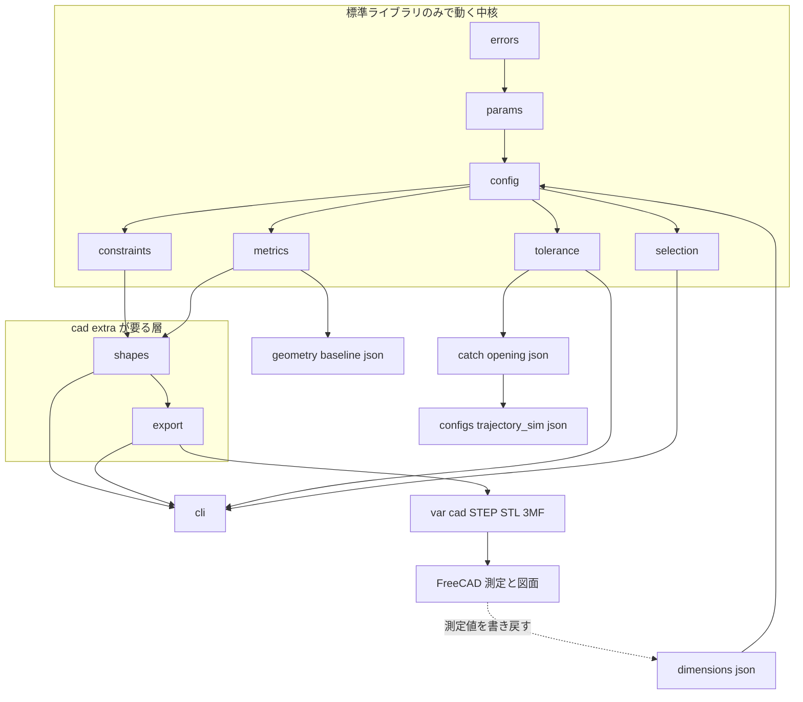
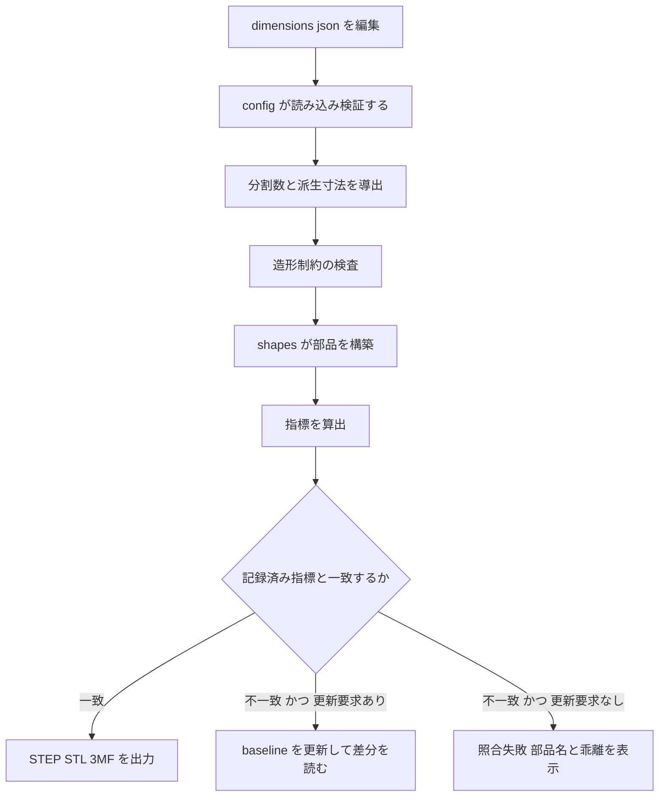
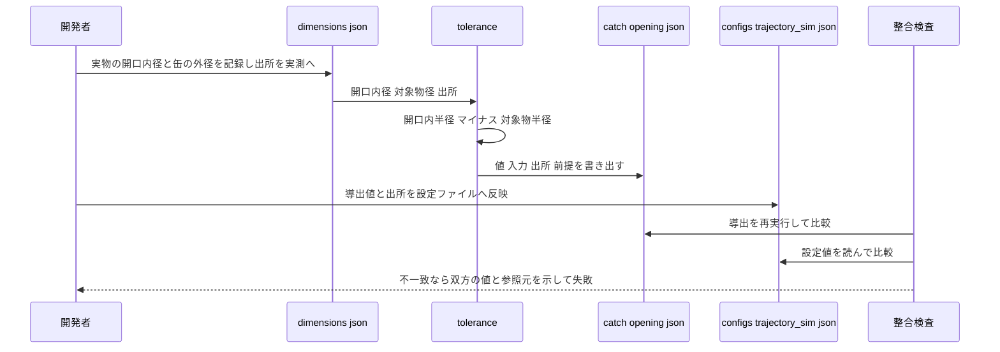

# Technical Design Document

## Overview

**Purpose**: 本 Spec は2つの成果を出す。(1) **CAD 基盤** — 寸法パラメータの単一の正、造形制約の明文化、
`.py` からのヘッドレスな形状生成と形状指標による検証。(2) **受け口（FR-7 / FR-12）** — 市販ゴミ箱の
選定・採寸・開口径の確定、ワイドリムの設計、保持に関する机上判断、および
`trajectory_sim.CatchCriteria.position_tolerance_mm` の**設定ファイル経由**の還元。

**Users**: 機構を設計する開発者（寸法変更 → 再生成 → 検査のループ）、シミュレータの利用者
（実物由来の許容誤差を受け取る）、および下流 Spec `chassis-mechanism`（CAD 基盤とゴミ箱の底寸法を消費する）。

**Impact**: 現在リポジトリに CAD 資産は無く、`position_tolerance_mm = 67.5` は φ200 開口を仮定した
暫定値である。本 Spec は `src/catch_mechanism/` パッケージと `configs/catch_mechanism/` の設定群を新設し、
`configs/trajectory_sim/` の**値のみ**を更新する。**`src/trajectory_sim/` と `src/prediction_core/` の
実装コードには触れない。**

### Goals

- 寸法値の**単一の正**を実装コードの外へ置き、値ごとに出所（実測 / 仮値）を保持する
- 造形制約（A1 mini 180mm・PETG・ボルト＋インサート）を**形状生成の一部として自動検査**する
- `.py` → STEP / STL / 3MF を**ヘッドレスに再生成**でき、形状指標の照合で**二重管理を検出**する
- 選定基準を判定可能なしきい値として保持し、**OQ-08 を決着**させる
- 開口径から位置許容誤差を**単一の箇所で導出**し、シミュレータ設定との**一致を検査**する
- FR-7 と FR-12 が逆向きに効く関係に対し、**根拠を残した机上判断**を下す
- 形状ライブラリを**任意依存に隔離**し、既存の実行時依存ゼロの不変条件を保つ

### Non-Goals

- 駆動ベース・ゴミ箱固定アダプタ・トレイ類・整備スタンドの設計（→ `chassis-mechanism`）
- キャッチ成否の判定ロジック、跳ね返りのモデル化（→ `trajectory-simulator` / D-9 で決着済み）
- 緩衝ライナーの材質選定・調達（→ OQ-10。M3 で実投擲後）
- NFR-5 / NFR-7 の達成判定、NFR-7 の目標値と N（→ OQ-05）
- 外部 CAD（FreeCAD）上の作業手順の自動化、および CI ワークフローの新設
  （リポジトリに `.github/` は存在せず、検査の実体は `python -m pytest` である）
- `docs/` の更新（決着した OQ の `decisions.md` への移行を含む）

## Boundary Commitments

### This Spec Owns

- **寸法パラメータの単一の正**: `configs/catch_mechanism/dimensions.json` と、その型・検証・読み込み
  （`src/catch_mechanism/params.py` / `config.py`）。⚠️ **プロジェクト内で唯一の置き場所**
- **造形制約の定義と検査**: 造形可能寸法・許可材料一覧・継手方針（`constraints.py`）
- **形状の正**: 受け口部品の形状を決める実装コード（`shapes.py`）と、そこからの生成物
- **形状指標の記録と照合**: `configs/catch_mechanism/geometry-baseline.json`（`metrics.py`）
- **ゴミ箱の選定基準・候補判定・選定結果**（`selection.py` / `selection-criteria.json` / `candidates.json`）
- **位置許容誤差の導出式**（`tolerance.py`）と導出記録 `configs/catch_mechanism/catch-opening.json`
- **受け口の深さ・底の扱い・テーパーに関する机上判断**（本書「受け口形状の決定」節が記録の正）

### Out of Boundary

- `src/trajectory_sim/` および `src/prediction_core/` の**実装コード**（値の還元は設定ファイルのみ）
- キャッチ成否の判定、`bounce_out` のモデル化、`MODEL_EXCLUSIONS` の改訂
- 駆動ベース・固定アダプタ・トレイ・整備スタンドの形状（`chassis-mechanism` が本基盤を**消費する**）
- 緩衝ライナーの材質決定・購入（本 Spec は「後から貼れる平面と締結箇所を残す」までを持つ）
- NFR-5 / NFR-7 の合否判定、投擲レイアウト（OQ-01）、対象物スコープの最終確定（OQ-02）
- FreeCAD の操作手順・図面テンプレート（形状の正を持たない領域の作業）

### Allowed Dependencies

| 依存先 | 可否 | 条件 |
|---|---|---|
| Python 標準ライブラリ | 可 | `params` / `config` / `selection` / `tolerance` / `constraints` / `metrics` はこれのみ |
| `build123d`（＋推移依存の OCCT バインディング） | 可 | **`shapes.py` / `export.py` に限る。** `[project.optional-dependencies].cad` として宣言し、既定ではインストールされない |
| `prediction_core` / `trajectory_sim` | **不可** | 依存方向が逆になる。両者は本 Spec の**下流の消費者**である |
| `firmware/` 側の資産 | 不可 | 別のビルド系列 |
| 外部 CAD（FreeCAD） | 実行時依存としては不可 | STEP を読む道具であり、コードから起動しない |

⚠️ **`catch_mechanism` は `trajectory_sim` を import しない。** 還元は
`configs/trajectory_sim/*.json` の値と、それを読むだけの整合検査（テスト）を通じて行う。

### Revalidation Triggers

以下の変更は、下流（`chassis-mechanism` / `trajectory-simulator` / `m1-prediction-validation`）の再検証を要する。

1. `dimensions.json` の**構造・キー名・単位**の変更（値の更新は再検証を要さない。出所が追随するため）
2. `Provenance` の値集合の変更（現在 `measured` / `assumed` の2値。⚠️ `trajectory_sim.Provenance` と型互換を保つ）
3. 位置許容誤差の**導出式**の変更（「開口内半径 − 対象物半径」以外を採る場合）
4. 公開 API（`catch_mechanism.__init__`）のシンボル追加・削除・意味変更
5. `geometry-baseline.json` の形式変更、または照合の許容差の緩和
6. 受け口が「開口内径を狭めない」不変条件を外す判断（FR-12 の前提が変わる）
7. 形状ライブラリの依存区分の変更（任意依存から必須依存へ移す等）

## Architecture

### Existing Architecture Analysis

- **固定側は単一の `pyproject.toml` / `src` レイアウト**に相乗りする（`structure.md`「Code Layout」）。
  Spec 1つにつき `src/<パッケージ名>/`、テストは `tests/<パッケージ名>/`、設定は `configs/<パッケージ名>/`
- **実行時サードパーティ依存ゼロ**が `prediction_core` / `trajectory_sim` の不変条件であり、
  `tests/prediction_core/test_boundaries.py` / `test_trajectory_sim_boundaries.py` が `ast` による
  静的解析で回帰検証している。⚠️ **本 Spec はこの2ファイルに触れない**
- `tests/prediction_core/test_packaging.py` は `[project].dependencies == []` を固定し、
  extras については **`ALLOWED_OPTIONAL_EXTRAS` の許可リスト方式**（`sensing-foundation` が導入）で
  「許可された名前しか無いこと」を表明している。本 Spec は**この許可リストへ `"cad"` を1行登録する**
  だけであり、`dependencies == []` の主張は変更しない（詳細は「依存境界の扱い」節）
- `trajectory_sim` の設定 JSON は `{"parameters": ..., "sweep": ...}` の2キーで、**あらゆる階層で未知キーを拒否**し、
  `parameters.provenance` のキーは `PARAMETER_PATHS`（データクラス木から生成）と一致することを要求する。
  `catch.position_tolerance_mm` はこの表に含まれる有効なパスであり、**値の追記だけで還元が成立する**
- `.gitattributes` は `*.md` / `*.json` を **CRLF**、`*.py` / `*.toml` を LF に固定している
- **リポジトリに CI は存在しない**（`.github/` なし）。「CI で検査する」の実体は `python -m pytest` である

### Architecture Pattern & Boundary Map

**選定パターン**: 純粋な設定・導出層（標準ライブラリのみ）の上に、形状生成層（build123d）を薄く載せる
**Core + Optional Adapter** 構成。`prediction-core` / `drivetrain-core` が採った
「実機（ここでは造形環境）なしで検証できる中核を持つ」作り方の踏襲である。



**Architecture Integration**:

- **責務の分離**: 「値を持つ層」と「形を作る層」を分ける。⚠️ **この分割が依存境界そのものである** —
  下流 `chassis-mechanism` とテストの大半は前者だけで動き、OCCT のインストールを要求しない
- **既存パターンの踏襲**: 出所（`Provenance`）付きパラメータ、未知キー拒否、frozen dataclass による
  構築時検証、`__init__` の明示的な公開 API は `trajectory_sim` と同形。ただし**コードは共有せず、
  import もしない**（依存方向が逆になるため）
- **新規要素の根拠**: `metrics`（形状指標の記録・照合）は二重管理の検出という**構造的な要求**から来ている。
  これが無いと A-1 の方針は規律頼みになる
- **FreeCAD は破線**（点線矢印）で示すとおり、**成果物の生成経路に入らない**。測定値の書き戻しは
  人手で `dimensions.json` を編集する経路のみ

### Dependency Direction

```
errors → params → config → {selection, tolerance, constraints, metrics} → shapes → export → cli
```

- 各層は**左側の層からのみ** import する。上位方向の import は許さない
- `build123d` の import は **`shapes` / `export` の2モジュールに限る**
- `__init__` は `shapes` / `export` を import しない（公開 API が OCCT を要求しないため）
- `cli` は `shapes` / `export` を**関数内で遅延 import** し、未インストール時に専用の失敗を返す
- この方向と import 制限は `tests/catch_mechanism/test_boundaries.py` が `ast` で静的に検査する

### Technology Stack

| Layer | Choice / Version | Role in Feature | Notes |
|-------|------------------|-----------------|-------|
| CLI | Python 3.11 標準ライブラリ（`argparse`） | `build` / `check` / `select` / `tolerance` サブコマンド | `python -m catch_mechanism` |
| 中核ロジック | Python 3.11 標準ライブラリのみ | パラメータ・選定・導出・制約・指標 | ⚠️ サードパーティ依存なし |
| 形状定義 | **build123d**（`>=0.9,<1.0`、OCCT カーネル） | ソリッド構築・STEP / STL / 3MF 出力 | `[project.optional-dependencies].cad`。`export_step` / `export_stl` / `Mesher`（3MF）を使用。単位は `Unit.MM` |
| データ | JSON（CRLF、`.gitattributes` 準拠） | 寸法・選定基準・候補・形状指標・導出記録 | 行単位の差分が読める |
| 生成物 | STEP / STL / 3MF | 組立確認・図面化・造形 | `var/cad/` へ出力（`.gitignore` 済み）。**コミットしない** |
| 組立確認 | FreeCAD（任意・手動） | STEP を読み込み、干渉チェック・測定・図面 | **形状の正を持たない。`.FCStd` は git 管理しない** |
| 依存管理 | uv / `pyproject.toml` / `uv.lock` | `cad` extra の解決 | Python 3.11 固定 |

> ⚠️ **build123d を選ぶ理由は「Python だから」ではなく「`.py` そのものがモデルであり、別のバイナリ文書が
> 存在しないから」である。** カーネルは FreeCAD と同じ OCCT のため STEP 経由の連携に情報欠落がない。

## File Structure Plan

### Directory Structure

```
src/catch_mechanism/
├── __init__.py          # 公開 API。build123d を import しない
├── errors.py            # 例外階層（CatchMechanismError 基底）
├── params.py            # Provenance / 各寸法型 / MechanismParams / 構築時検証 / PARAMETER_PATHS
├── config.py            # JSON 読み書き・未知キー拒否・出所検証・パラメータ識別子（digest）
├── selection.py         # 選定基準のしきい値と候補判定
├── tolerance.py         # 位置許容誤差の導出（唯一の置き場所）と導出記録の直列化
├── constraints.py       # 造形制約の検査（造形可能寸法・分割数の導出・材料・継手）
├── metrics.py           # 形状指標の型・記録ファイルの読み書き・照合（build123d 非依存）
├── shapes.py            # build123d による受け口部品の構築と指標抽出
├── export.py            # STEP / STL / 3MF の原子的な書き出し
├── cli.py               # サブコマンド実装（shapes / export は遅延 import）
└── __main__.py          # python -m catch_mechanism の入口

configs/catch_mechanism/
├── dimensions.json          # ★寸法パラメータの単一の正（値＋出所）
├── selection-criteria.json  # 選定基準のしきい値
├── candidates.json          # 候補機種の諸元（第一候補・次点・非推奨例）
├── geometry-baseline.json   # 形状指標の記録（parameters_digest つき）
└── catch-opening.json       # 位置許容誤差の導出記録（入力値と出所つき）

tests/catch_mechanism/
├── test_params.py                    # 構築時検証・出所の継承規則
├── test_config.py                    # 未知キー拒否・欠損拒否・往復・digest の安定性
├── test_selection.py                 # 基準判定（適合・不適合の両方向）
├── test_tolerance.py                 # 導出式・外向き張り出しの非算入・出所の継承
├── test_constraints.py               # 造形可能寸法・分割数の導出・材料・継手
├── test_boundaries.py                # build123d の import 範囲と依存方向の静的検査
├── test_baseline_digest.py           # パラメータ変更と指標記録の不整合検出（CAD 不要）
├── test_geometry_regression.py       # 再生成 → 指標照合・決定性（cad extra 必要）
├── test_rim_invariants.py            # 開口を狭めない・分割後の寸法・締結箇所（cad extra 必要）
├── test_trajectory_sim_sync.py       # シミュレータ設定との一致検査
└── test_downstream_contract.py       # 公開 API が CAD 無しで使えること・提供項目の存在
```

### Modified Files

- `pyproject.toml` — `[tool.hatch.build.targets.wheel].packages` へ `src/catch_mechanism` を追加。
  `[project.optional-dependencies]` へ `cad = ["build123d>=0.9,<1.0"]` を追加。
  ⚠️ **`[project].dependencies` は空のまま変更しない**
- `tests/prediction_core/test_packaging.py` — `ALLOWED_OPTIONAL_EXTRAS` へ `"cad"` を1行登録する
  （**許可リストへの登録のみ。不変条件の表現・主張は変更しない**）
- `tests/sensing_foundation/test_sensing_boundaries.py` — ⚠️ **同名の許可リストがここにも複製されている。**
  同じく `"cad"` を1行登録する。**片方だけ更新すると
  `test_pyproject_dependencies_stay_empty_and_extras_stay_within_allowlist` が落ちる**
- `.gitignore` — FreeCAD の作業ファイル（`*.FCStd` / `*.FCStd1`）を除外。
  生成物の出力先 `var/` は既に除外済み
- `.gitattributes` — 誤コミット時に内容が壊れないよう `*.step` / `*.stl` / `*.3mf` の改行変換を無効化する
- `configs/trajectory_sim/sweep-reachability.json` / `sweep-layout.json` —
  `parameters.catch.position_tolerance_mm` の値と `parameters.provenance` の該当行を更新する。
  ⚠️ **値の更新のみ。スキーマ・キー構造には手を入れない**

## System Flows

### 寸法 → 形状 → 生成物 → 照合



**Key Decisions**:

- 造形制約の検査は**書き出しより前**に置く。検査を通らない形状の生成物は残さない（要件 2.7 / 3.6）
- 指標の不一致は**既定で失敗**であり、更新は `--update-baseline` の明示的な要求時のみ。
  ⚠️ **これが「FreeCAD で手を入れた形状が `.py` から再生成できない」事実を可視化する経路である**

### 開口径 → 位置許容誤差 → シミュレータ設定



**Key Decisions**:

- ⚠️ **シミュレータ側へは値だけが渡る。** 導出式は本 Spec の `tolerance.py` にのみ存在する
- 反映は人手（設定ファイルの編集）で行い、**その正しさを検査が保証する**。自動書き換えを行わないのは、
  `configs/trajectory_sim/` が `trajectory-simulator` の資産であり、本 Spec が書き換え主体になると
  所有が曖昧になるためである

## Requirements Traceability

| Requirement | Summary | Components | Interfaces | Flows |
|-------------|---------|------------|------------|-------|
| 1.1, 1.2, 1.7 | 寸法値と出所を単一の設定ファイルへ | Params, Config, dimensions.json | `load_params` / `Quantity` | 寸法 → 形状 |
| 1.3, 1.4 | 未知キー・欠損・範囲外の拒否 | Config, Params | `load_params` の検証 | — |
| 1.5 | 導出値の出所は入力の最弱を継承 | Params | `Provenance.weakest` | 開口径 → 許容誤差 |
| 1.6 | 採寸値をコード変更なしに反映 | Config, Shapes | `load_params` → `build_parts` | 寸法 → 形状 |
| 1.8 | 定義は単一の箇所のみ | Params, Config | `PARAMETER_PATHS` | — |
| 2.1, 2.5, 2.6, 2.8 | 造形制約・材料・継手の保持 | Params, Constraints | `PrintingConstraints` / `JointPolicy` | 寸法 → 形状 |
| 2.2, 2.3 | 分割要否の判定と断片の検査 | Constraints | `required_segment_count` / `check_envelope` | 寸法 → 形状 |
| 2.4, 2.7 | 超過時の失敗と生成物の抑止 | Constraints, Shapes, Export | `BuildViolation` / `build_parts` | 寸法 → 形状 |
| 3.1, 3.2 | 形状のコード定義とヘッドレス生成 | Shapes, Cli | `build_parts` / `build` サブコマンド | 寸法 → 形状 |
| 3.3, 3.4 | STEP / STL / 3MF をミリメートルで出力 | Export | `export_parts` | 寸法 → 形状 |
| 3.5 | 生成物はバージョン管理外・再生成可能 | Export, .gitignore | `var/cad/` | 寸法 → 形状 |
| 3.6 | 失敗時に部分ファイルを残さない | Export | 一時ディレクトリ経由の原子的書き出し | 寸法 → 形状 |
| 3.7 | 同一入力から同一指標 | Shapes, Metrics | `measure_part` | 寸法 → 形状 |
| 4.1, 4.2 | 指標の算出と記録 | Metrics, geometry-baseline.json | `PartMetrics` / `write_baseline` | 寸法 → 形状 |
| 4.3, 4.4 | 再生成による照合と失敗の内容 | Metrics, Cli | `compare_metrics` / `check` サブコマンド | 寸法 → 形状 |
| 4.5 | CAD 非導入環境でも不整合を検出 | Config, Metrics | `parameters_digest` | 寸法 → 形状 |
| 4.6, 4.7 | 外部 CAD 作業ファイルの除外と書き戻し経路 | .gitignore, dimensions.json | — | 寸法 → 形状 |
| 5.1, 5.2, 5.3 | 任意依存としての隔離と明示的な失敗 | pyproject, Cli, Shapes | `CadUnavailableError` | — |
| 5.4, 5.6 | 既存パッケージの不変条件を壊さない | pyproject, test_packaging | `ALLOWED_OPTIONAL_EXTRAS` | — |
| 5.5, 5.7 | import 範囲の静的検査と CAD 無し完走 | test_boundaries | `ast` 走査 | — |
| 6.1, 6.2, 6.3, 6.4 | 選定基準と候補判定 | Selection, selection-criteria.json | `evaluate_candidate` | — |
| 6.5, 6.6, 6.8 | 採寸項目・出所更新・選定結果の記録 | Params, Config, dimensions.json | `TrashCanMeasurements` | 開口径 → 許容誤差 |
| 6.7 | 採寸前でも仮値で完走 | Config, Cli | 既定の `dimensions.json` | 寸法 → 形状 |
| 7.1, 7.2, 7.9 | 導出式・外向き張り出しの非算入・空き缶前提 | Tolerance | `derive_position_tolerance` | 開口径 → 許容誤差 |
| 7.3, 7.4 | 入力と出所の併記・出所の継承 | Tolerance, Params | `ToleranceDerivation` | 開口径 → 許容誤差 |
| 7.5 | シミュレータが解釈できる形式で出力 | Tolerance, catch-opening.json | `tolerance` サブコマンド | 開口径 → 許容誤差 |
| 7.6, 7.7 | 設定値との一致検査と失敗内容 | test_trajectory_sim_sync | 設定 JSON の読み取り | 開口径 → 許容誤差 |
| 7.8 | 実装コードを変更しない | 境界方針 | — | 開口径 → 許容誤差 |
| 8.1, 8.5, 8.6 | 縁への取り付け・採寸からの再導出・隙間 | Shapes, Params | `RimParams` / `build_parts` | 寸法 → 形状 |
| 8.2 | 開口内径を狭めない | Shapes, test_rim_invariants | `RimGeometry.inner_diameter_mm` | 寸法 → 形状 |
| 8.3, 8.4 | 分割と締結（インサート・位置決め） | Constraints, Shapes | `required_segment_count` / `JointPolicy` | 寸法 → 形状 |
| 8.7 | 質量の目安の算出 | Metrics, Params | `estimate_mass_g` | 寸法 → 形状 |
| 9.1, 9.2, 9.3, 9.5, 9.6 | 保持に関する判断の記録 | 本書「受け口形状の決定」節, dimensions.json | `RetentionParams` | — |
| 9.4, 9.7 | 緩衝材の平面と後付け締結箇所 | Shapes, test_rim_invariants | `RetentionParams` | 寸法 → 形状 |
| 10.1, 10.2, 10.4 | 底寸法・造形制約・出所の公開 | `__init__`, Params | 公開 API | — |
| 10.3 | 公開の参照に CAD を要さない | `__init__`, test_downstream_contract | 公開 API | — |
| 10.5 | 公開項目の変更は再検証対象 | Revalidation Triggers | — | — |
| 10.6 | 下流の部品を責務に含めない | Out of Boundary | — | — |

## Components and Interfaces

| Component | Domain/Layer | Intent | Req Coverage | Key Dependencies (P0/P1) | Contracts |
|-----------|--------------|--------|--------------|--------------------------|-----------|
| Errors | 中核 | 例外階層 | 1.3, 1.4, 5.3 | なし | Service |
| Params | 中核 | 寸法型・出所・構築時検証 | 1.1, 1.2, 1.4, 1.5, 1.8, 2.1, 2.5, 2.6, 8.6, 9.4, 10.1 | Errors (P0) | Service, State |
| Config | 中核 | JSON 読み書き・未知キー拒否・識別子 | 1.1, 1.3, 1.6, 1.7, 4.5, 6.6, 6.7 | Params (P0) | Service |
| Selection | 中核 | 選定基準と候補判定 | 6.1, 6.2, 6.3, 6.4, 6.8 | Config (P0) | Service |
| Tolerance | 中核 | 位置許容誤差の導出 | 7.1, 7.2, 7.3, 7.4, 7.5, 7.9 | Config (P0) | Service |
| Constraints | 中核 | 造形制約の検査と分割数の導出 | 2.2, 2.3, 2.4, 2.7, 2.8, 8.3 | Params (P0) | Service |
| Metrics | 中核 | 形状指標の型・記録・照合 | 3.7, 4.1, 4.2, 4.3, 4.4, 4.5, 8.7 | Params (P0), Config (P1) | Service, State |
| Shapes | CAD | 受け口部品の構築と指標抽出 | 3.1, 3.2, 8.1, 8.2, 8.4, 8.5, 9.4, 9.7 | Constraints (P0), build123d (P0) | Service |
| Export | CAD | 生成物の原子的な書き出し | 3.3, 3.4, 3.5, 3.6 | Shapes (P0), build123d (P0) | Batch |
| Cli | 入口 | サブコマンドと終了コード | 3.2, 4.3, 5.3, 6.2, 6.7, 7.5 | 全中核 (P0), Shapes/Export (P1) | Service |
| PublicApi | 入口 | 下流への公開契約 | 10.1, 10.2, 10.3, 10.4 | Params (P0), Config (P0) | Service |

### 中核（標準ライブラリのみ）

#### Params

| Field | Detail |
|-------|--------|
| Intent | 寸法・造形制約・継手・受け口の各パラメータを不変な型として定義し、構築時に検証する |
| Requirements | 1.1, 1.2, 1.4, 1.5, 1.8, 2.1, 2.5, 2.6, 8.6, 9.4, 10.1 |

**Responsibilities & Constraints**

- 値の**単一の型定義**を持つ。⚠️ **既定値を与えるのは「設計上の選択」に限り、実物の寸法には既定値を与えない**
  （省略された構築は失敗させる。`trajectory_sim.DrivetrainParams` と同じ扱い）
- 出所（`Provenance`）は **`MEASURED` / `ASSUMED` の2値**とする。⚠️ `trajectory_sim.Provenance` と
  値集合を一致させ、還元時に翻訳が要らないようにする。導出値には第3の値を作らず、
  **入力の最弱を継承する**（1つでも仮値なら仮値）
- `PARAMETER_PATHS` はデータクラス木の走査で生成し、手書きの表を二重管理しない

**Dependencies**

- Inbound: Config, Selection, Tolerance, Constraints, Metrics, Shapes — パラメータの供給元（P0）
- Outbound: Errors — 検証違反の送出（P0）

**Contracts**: Service [x] / API [ ] / Event [ ] / Batch [ ] / State [x]

##### Service Interface

```python
class Provenance(StrEnum):
    MEASURED = "measured"
    ASSUMED = "assumed"

    @staticmethod
    def weakest(*values: "Provenance") -> "Provenance": ...

@dataclass(frozen=True, slots=True)
class TrashCanMeasurements:
    opening_inner_diameter_mm: float
    top_outer_diameter_mm: float
    bottom_outer_diameter_mm: float
    bottom_flat_diameter_mm: float
    height_mm: float
    mass_g: float
    bottom_thickness_mm: float
    taper_deg: float

@dataclass(frozen=True, slots=True)
class ObjectSpec:
    diameter_mm: float
    height_mm: float

@dataclass(frozen=True, slots=True)
class PrintingConstraints:
    build_x_mm: float
    build_y_mm: float
    build_z_mm: float
    material: str
    material_density_g_cm3: float
    segment_margin_mm: float

@dataclass(frozen=True, slots=True)
class JointPolicy:
    bolt_designation: str
    through_hole_diameter_mm: float
    insert_outer_diameter_mm: float
    insert_length_mm: float
    dowel_diameter_mm: float
    min_bearing_area_mm2: float

@dataclass(frozen=True, slots=True)
class RimParams:
    fit_clearance_mm: float
    flange_width_mm: float
    flange_slope_deg: float
    wall_thickness_mm: float
    height_mm: float

@dataclass(frozen=True, slots=True)
class RetentionParams:
    retrofit_fastener_count: int
    liner_flat_min_diameter_mm: float
    added_depth_mm: float          # 受け口が本体に足す深さ。決定値は 0.0
    bottom_modification: str       # "none" 固定。底へ加工を行わない決定を型で表す

@dataclass(frozen=True, slots=True)
class MechanismParams:
    trash_can: TrashCanMeasurements
    target_object: ObjectSpec
    printing: PrintingConstraints
    joint: JointPolicy
    rim: RimParams
    retention: RetentionParams
    provenance: Mapping[str, Provenance]

PARAMETER_PATHS: Mapping[str, ParameterPath]
ALLOWED_MATERIALS: frozenset[str]  # {"PETG", "PLA"}（PLA は非構造部材に限る旨を注記）
```

- Preconditions: すべての長さ・直径は有限かつ正、角度は 0 以上 90 度未満、`provenance` のキーは `PARAMETER_PATHS` に含まれる
- Postconditions: 構築を通った `MechanismParams` は以降の層で再検証を要さない
- Invariants: `bottom_flat_diameter_mm <= bottom_outer_diameter_mm <= opening_inner_diameter_mm`、
  `material in ALLOWED_MATERIALS`、`retention.bottom_modification == "none"`、`retention.added_depth_mm == 0.0`

**Implementation Notes**

- Integration: `trajectory_sim.params` の型を import しない（依存方向が逆になる）。
  ⚠️ `Provenance` の**値集合だけ**を一致させ、`str` として設定ファイルへ書けるようにする
- Validation: 違反時は違反フィールド名と値をメッセージに含める（`trajectory_sim` の慣行に合わせる）
- Risks: 出所が黙って無視される事態を防ぐため、`provenance` の未知キーは拒否する

#### Config

| Field | Detail |
|-------|--------|
| Intent | `dimensions.json` の読み書きと、パラメータ識別子（digest）の算出 |
| Requirements | 1.1, 1.3, 1.6, 1.7, 4.5, 6.6, 6.7 |

**Responsibilities & Constraints**

- **あらゆる階層で未知キーを拒否**する（`trajectory_sim` の設定読み込みと同じ規律）
- `parameters_digest` を、正規化した JSON（キー整列・浮動小数点の固定書式）の SHA-256 として算出する。
  ⚠️ **この識別子が「パラメータを変えたのに形状指標を更新し忘れた」事故を CAD 非導入環境でも捕まえる**
- 書き出しは行単位の差分が読める整形（インデント2・キー整列・末尾改行）で行う

**Contracts**: Service [x]

##### Service Interface

```python
def load_params(path: Path | None = None) -> MechanismParams: ...
def dump_params(params: MechanismParams, path: Path) -> None: ...
def parameters_digest(params: MechanismParams) -> str: ...   # "sha256:<hex>"
DEFAULT_DIMENSIONS_PATH: Path                                # configs/catch_mechanism/dimensions.json
```

- Preconditions: ファイルが存在し JSON として解釈できる
- Postconditions: 戻り値は検証済み。`parameters_digest` は値が同じなら書式に依らず同一
- Invariants: 読み込み → 書き出し → 読み込みで値と出所が保存される

#### Selection

| Field | Detail |
|-------|--------|
| Intent | ゴミ箱の選定基準を判定可能なしきい値として保持し、候補を評価する |
| Requirements | 6.1, 6.2, 6.3, 6.4, 6.8 |

**Responsibilities & Constraints**

- 基準の**正は roadmap**であり、本コンポーネントはそれを機械可読なしきい値へ写したものである。
  ⚠️ **推測で基準を書き換えない**（2026-08-30 の実売調査で確定済み）
- 判定は全項目について行い、**最初の不適合で打ち切らない**（何が理由で落ちたかを一覧で示すため）

**Contracts**: Service [x]

##### Service Interface

```python
@dataclass(frozen=True, slots=True)
class SelectionCriteria:
    shape: str                      # "round"
    opening_inner_diameter_min_mm: float      # 200.0
    opening_inner_diameter_reject_below_mm: float  # 180.0
    opening_inner_diameter_typical_max_mm: float   # 225.0
    height_min_mm: float
    height_max_mm: float
    mass_max_g: float
    taper_max_deg: float            # 片側。緩いテーパーのみ許す
    price_max_jpy: int
    requires_lidless: bool
    prefers_outward_rim: bool

@dataclass(frozen=True, slots=True)
class Candidate:
    identifier: str                 # 機種名 / 型番 / JAN
    shape: str
    opening_inner_diameter_mm: float
    height_mm: float
    mass_g: float | None
    taper_deg: float
    price_jpy: int
    has_lid: bool
    has_outward_rim: bool | None
    provenance: Provenance          # 諸元が実測か公称か

@dataclass(frozen=True, slots=True)
class CandidateVerdict:
    identifier: str
    accepted: bool
    failed_items: tuple[str, ...]
    warnings: tuple[str, ...]

def evaluate_candidate(candidate: Candidate, criteria: SelectionCriteria) -> CandidateVerdict: ...
def load_criteria(path: Path | None = None) -> SelectionCriteria: ...
def load_candidates(path: Path | None = None) -> tuple[Candidate, ...]: ...
```

- Postconditions: `accepted` が偽なら `failed_items` は空でない
- Invariants: 望ましいが必須でない項目（外向きリム）は `warnings` にのみ現れ、`accepted` を左右しない

#### Tolerance

| Field | Detail |
|-------|--------|
| Intent | 位置許容誤差の導出をプロジェクト内の唯一の箇所として持つ |
| Requirements | 7.1, 7.2, 7.3, 7.4, 7.5, 7.9 |

**Responsibilities & Constraints**

- 式は `opening_inner_diameter_mm / 2 − target_object.diameter_mm / 2` のみ。
  ⚠️ **外向きに張り出すフランジの寸法を算入しない**（「入った」と「キャッチできた」は別問題であり、
  許容誤差は**保持まで成立する内径**で決める）
- 出所は入力の最弱を継承する。⚠️ **未実測の値から実測を名乗らない**
- 対象物は M1 の実験条件（空き缶）であり、その前提を記録に明示する（OQ-02 は未決のまま）

**Contracts**: Service [x]

##### Service Interface

```python
@dataclass(frozen=True, slots=True)
class ToleranceInput:
    name: str
    value_mm: float
    provenance: Provenance

@dataclass(frozen=True, slots=True)
class ToleranceDerivation:
    position_tolerance_mm: float
    provenance: Provenance
    inputs: tuple[ToleranceInput, ...]
    formula: str
    assumptions: tuple[str, ...]

def derive_position_tolerance(params: MechanismParams) -> ToleranceDerivation: ...
def dump_derivation(derivation: ToleranceDerivation, path: Path) -> None: ...
def load_derivation(path: Path) -> ToleranceDerivation: ...
```

- Preconditions: `opening_inner_diameter_mm > target_object.diameter_mm`
- Postconditions: `position_tolerance_mm > 0`、`inputs` は開口内径と対象物径の2件を必ず含む
- Invariants: すべての入力が `MEASURED` のときに限り `provenance == MEASURED`

#### Constraints

| Field | Detail |
|-------|--------|
| Intent | 造形制約を数値の検査として実装し、分割数を導出する |
| Requirements | 2.2, 2.3, 2.4, 2.7, 2.8, 8.3 |

**Responsibilities & Constraints**

- **分割数はパラメータではなく導出値**である。⚠️ 手で「3分割」と決めると、寸法が変わったときに黙って
  造形可能寸法を超える。外径 D の円環を n 等分した扇形の弦長 `D · sin(π/n)` が
  造形可能寸法から余裕（`segment_margin_mm`）を引いた値以下になる最小の n を返す
- ⚠️ **円は正方形の対角線を使えない**という制約に合わせ、**軸並行の外接箱で判定する**（斜め配置に頼らない）
- 材料は許可一覧からのみ受け付ける。⚠️ ASA / ABS / PC / PA / CF・GF は一覧に含めない

**Contracts**: Service [x]

##### Service Interface

```python
@dataclass(frozen=True, slots=True)
class Envelope:
    x_mm: float
    y_mm: float
    z_mm: float

@dataclass(frozen=True, slots=True)
class BuildViolation:
    part_name: str
    axis: str
    envelope_mm: float
    limit_mm: float
    excess_mm: float

def required_segment_count(outer_diameter_mm: float, printing: PrintingConstraints) -> int: ...
def check_envelope(part_name: str, envelope: Envelope, printing: PrintingConstraints) -> tuple[BuildViolation, ...]: ...
def check_material(printing: PrintingConstraints) -> None: ...
def check_joint(joint: JointPolicy, bearing_area_mm2: float) -> None: ...
```

- Postconditions: `required_segment_count` の戻り値 n に対し、n 等分した扇形が造形可能寸法に収まる
- Invariants: 収まる n が現実的な上限（例: 12）までに存在しない場合は例外で拒否する（黙って大きな n を返さない）

#### Metrics

| Field | Detail |
|-------|--------|
| Intent | 形状指標の型・記録・照合を build123d 非依存に保つ |
| Requirements | 3.7, 4.1, 4.2, 4.3, 4.4, 4.5, 8.7 |

**Responsibilities & Constraints**

- `PartMetrics` は**素の数値だけ**を持ち、形状オブジェクトを保持しない。
  ⚠️ **これにより照合ロジックが CAD 非導入環境でもテストできる**
- 記録には `parameters_digest` を含める。digest の不一致は、形状を再生成せずとも検出できる（要件 4.5）
- 許容差は相対（体積）と絶対（境界箱）で持ち、記録側に明示する

**Contracts**: Service [x] / State [x]

##### Service Interface

```python
@dataclass(frozen=True, slots=True)
class PartMetrics:
    part_name: str
    volume_mm3: float
    bbox_mm: tuple[float, float, float]
    solid_count: int

@dataclass(frozen=True, slots=True)
class GeometryBaseline:
    schema_version: str
    parameters_digest: str
    volume_rel_tolerance: float
    bbox_abs_tolerance_mm: float
    generator_version: str
    parts: Mapping[str, PartMetrics]

@dataclass(frozen=True, slots=True)
class MetricsMismatch:
    part_name: str
    field_name: str
    recorded: float
    regenerated: float

def load_baseline(path: Path | None = None) -> GeometryBaseline: ...
def write_baseline(baseline: GeometryBaseline, path: Path) -> None: ...
def compare_metrics(baseline: GeometryBaseline, measured: Mapping[str, PartMetrics]) -> tuple[MetricsMismatch, ...]: ...
def estimate_mass_g(volume_mm3: float, density_g_cm3: float) -> float: ...
```

- Postconditions: 一致なら空タプル、不一致なら部品名・項目名・双方の値を含む
- Invariants: 記録に存在して再生成に無い部品、またはその逆も不一致として報告する

### CAD 層（`cad` extra が必要）

#### Shapes

| Field | Detail |
|-------|--------|
| Intent | 寸法パラメータから受け口部品を構築し、指標を抽出する |
| Requirements | 3.1, 3.2, 8.1, 8.2, 8.4, 8.5, 9.4, 9.7 |

**Responsibilities & Constraints**

- 部品は**ワイドリムの扇形セグメント**のみ（分割数は `Constraints` が導出）。
  ⚠️ **内向きの漏斗部品を作らない**（「受け口形状の決定」節の判断による）
- 取り付け部の内径は `top_outer_diameter_mm + 2 × fit_clearance_mm` から導出する。
  フランジの内周は**開口内径以上**とし、開口を狭めない
- セグメント端面には貫通ボルト穴と金属インサート座を設け、位置決め用のダボは荷重を受けない径・嵌合で置く。
  ⚠️ **接合面の法線が層法線（Z）と一致しない造形向き（リム面を寝かせる）を前提とする**
- 後付け部品用の締結座を `RetentionParams.retrofit_fastener_count` 箇所設ける
- build123d の import は本モジュールと `Export` に限る

**Dependencies**

- Inbound: Export, Cli — 形状の供給元（P0）
- Outbound: Constraints — 造形制約の検査（P0）、Params — 寸法（P0）
- External: build123d — ソリッド構築と幾何セレクタ（P0）

**Contracts**: Service [x]

##### Service Interface

```python
@dataclass(frozen=True, slots=True)
class RimGeometry:
    segment_count: int
    inner_diameter_mm: float       # 取り付け部の内径
    clear_opening_diameter_mm: float  # 実際に通過できる最小径。開口内径以上であること
    outer_diameter_mm: float

@dataclass(frozen=True, slots=True)
class BuiltPart:
    name: str
    solid: object                  # build123d の Part。中核層へは渡さない
    metrics: PartMetrics

def rim_geometry(params: MechanismParams) -> RimGeometry: ...
def build_parts(params: MechanismParams) -> tuple[BuiltPart, ...]: ...
def measure_part(name: str, solid: object) -> PartMetrics: ...
PART_NAMES: tuple[str, ...]        # ("rim_segment",)
```

- Preconditions: `check_material` / `check_envelope` を通過している
- Postconditions: `clear_opening_diameter_mm >= trash_can.opening_inner_diameter_mm`、
  各部品の外接箱が造形可能寸法に収まる
- Invariants: 同一パラメータからの再構築は同一の `PartMetrics` を返す

**Implementation Notes**

- Integration: 参照解決は**幾何セレクタ（位置・向きによる選択）**で明示的に書く。
  ⚠️ 生成名（`Face6` 等）に依存しない書き方が TNP の影響を限定する理由そのものである
- Validation: `rim_geometry` は形状構築の前に評価でき、不変条件の検査を軽量に行える
- Risks: OCCT のバージョン差で体積の下位桁が動く可能性がある。許容差を記録側に持ち、
  ライブラリ版を `generator_version` として残す

#### Export

| Field | Detail |
|-------|--------|
| Intent | 生成物を原子的に書き出す |
| Requirements | 3.3, 3.4, 3.5, 3.6 |

**Responsibilities & Constraints**

- STEP（組立確認・図面化用）、STL・3MF（造形用）を出力する。単位は `Unit.MM` に固定
- **一時ディレクトリへ全ファイルを書き終えてから出力先へ移す。** 失敗時は何も残さない
- 出力先の既定は `var/cad/`（`.gitignore` 済み）。⚠️ **生成物をコミットしない**

**Contracts**: Batch [x]

##### Batch / Job Contract

- Trigger: `python -m catch_mechanism build [--output-dir <path>] [--update-baseline]`
- Input / validation: `MechanismParams`（検証済み）、出力先が書き込み可能であること
- Output / destination: `var/cad/<part_name>.step` / `.stl` / `.3mf`、および指標
- Idempotency & recovery: 同一入力で何度実行しても同じ内容。失敗時は出力先を変更しない

### 入口

#### Cli

| Field | Detail |
|-------|--------|
| Intent | サブコマンドと終了コードで、人と検査の双方から使える入口を与える |
| Requirements | 3.2, 4.3, 5.3, 6.2, 6.7, 7.5 |

**Contracts**: Service [x]

##### Service Interface

| サブコマンド | 動作 | CAD 要否 |
|---|---|---|
| `build` | 形状を生成し STEP / STL / 3MF と指標を出力。`--update-baseline` で記録を更新 | 必要 |
| `check` | 記録済み指標との照合。`--digest-only` は digest 照合のみ | `--digest-only` は不要 |
| `select` | 候補を選定基準で評価し、適合・不適合と理由を出力 | 不要 |
| `tolerance` | 位置許容誤差を導出し `catch-opening.json` へ出力。`--check <config>` で設定値と比較 | 不要 |

- 終了コード: `0` 正常 / `1` 検査の不一致 / `2` 使い方の誤り・入力不正 / `3` **形状生成の環境が無い**
- ⚠️ **CAD 不在を成功として黙って読み飛ばさない**（終了コード 3 で明示する）

#### PublicApi（`catch_mechanism/__init__.py`）

| Field | Detail |
|-------|--------|
| Intent | 下流 Spec が参照する契約を1箇所に固定する |
| Requirements | 10.1, 10.2, 10.3, 10.4 |

**Responsibilities & Constraints**

- 公開するのは**中核層の型と関数のみ**。⚠️ `shapes` / `export` を import しない
  （公開 API の import が OCCT を要求すると、`chassis-mechanism` が CAD 環境を強制される）
- `chassis-mechanism` は `TrashCanMeasurements`（底の外径・平面部径・テーパー角・高さ・重量）と
  `PrintingConstraints` / `JointPolicy` を**ここから**参照し、同じ値を再定義しない

##### Service Interface

```python
__all__ = [
    "Provenance", "TrashCanMeasurements", "ObjectSpec", "PrintingConstraints",
    "JointPolicy", "RimParams", "RetentionParams", "MechanismParams", "PARAMETER_PATHS",
    "ALLOWED_MATERIALS", "load_params", "dump_params", "parameters_digest",
    "SelectionCriteria", "Candidate", "CandidateVerdict", "evaluate_candidate",
    "load_criteria", "load_candidates", "ToleranceInput", "ToleranceDerivation",
    "derive_position_tolerance", "load_derivation", "Envelope", "BuildViolation",
    "required_segment_count", "check_envelope", "check_material", "check_joint",
    "PartMetrics", "GeometryBaseline", "MetricsMismatch", "load_baseline",
    "compare_metrics", "estimate_mass_g", "SCHEMA_VERSION",
    "CatchMechanismError", "ParameterError", "SelectionError", "GeometryError",
    "ConsistencyError", "CadUnavailableError",
]
```

## Data Models

### Domain Model

- **`MechanismParams` が唯一の集約ルート**であり、寸法・造形制約・継手・受け口・保持方針を束ねる
- **出所（`Provenance`）は値に付随する属性**であり、集約の外で管理しない。
  導出量は「入力の最弱」を継承する（半順序: `MEASURED` > `ASSUMED`）
- **形状指標（`PartMetrics`）は集約の外**にある派生データであり、`parameters_digest` で集約と紐付く

### Logical Data Model

#### `configs/catch_mechanism/dimensions.json`（★単一の正）

```json
{
  "schema_version": "1.0",
  "trash_can": {
    "model_id": "yamada-kagaku-no335",
    "opening_inner_diameter_mm": 220.0,
    "top_outer_diameter_mm": 225.0,
    "bottom_outer_diameter_mm": 158.0,
    "bottom_flat_diameter_mm": 140.0,
    "height_mm": 244.0,
    "mass_g": 228.0,
    "bottom_thickness_mm": 1.5,
    "taper_deg": 7.0
  },
  "target_object": { "diameter_mm": 65.0, "height_mm": 122.0 },
  "printing": {
    "build_x_mm": 180.0, "build_y_mm": 180.0, "build_z_mm": 180.0,
    "material": "PETG", "material_density_g_cm3": 1.27, "segment_margin_mm": 5.0
  },
  "joint": {
    "bolt_designation": "M3", "through_hole_diameter_mm": 3.4,
    "insert_outer_diameter_mm": 4.6, "insert_length_mm": 5.7,
    "dowel_diameter_mm": 3.0, "min_bearing_area_mm2": 60.0
  },
  "rim": {
    "fit_clearance_mm": 1.0, "flange_width_mm": 30.0, "flange_slope_deg": 15.0,
    "wall_thickness_mm": 4.0, "height_mm": 18.0
  },
  "retention": {
    "retrofit_fastener_count": 6, "liner_flat_min_diameter_mm": 140.0,
    "added_depth_mm": 0.0, "bottom_modification": "none"
  },
  "provenance": {
    "trash_can.opening_inner_diameter_mm": "assumed",
    "trash_can.bottom_outer_diameter_mm": "assumed",
    "target_object.diameter_mm": "assumed"
  }
}
```

- ⚠️ **表に無いキーは拒否される。** `provenance` に現れないパスは `ASSUMED` として扱い、
  「実測を名乗るには明示が要る」方向に倒す
- 上記の数値は**すべて公称・推定であり仮値**である（`docs/requirements.md` の
  「未実測の値を合否条件にしない」に従い、採寸で置き換わるまで `assumed`）

#### `configs/catch_mechanism/geometry-baseline.json`

| フィールド | 型 | 意味 |
|---|---|---|
| `schema_version` | string | 記録形式の版 |
| `parameters_digest` | string | 記録時の `dimensions.json` の識別子（`sha256:<hex>`） |
| `volume_rel_tolerance` | number | 体積の相対許容差 |
| `bbox_abs_tolerance_mm` | number | 境界箱の絶対許容差 |
| `generator_version` | string | 記録時の形状ライブラリ版（情報用） |
| `parts` | object | 部品名 → `{volume_mm3, bbox_mm, solid_count}` |

#### `configs/catch_mechanism/catch-opening.json`

| フィールド | 型 | 意味 |
|---|---|---|
| `schema_version` | string | 記録形式の版 |
| `position_tolerance_mm` | number | 導出結果 |
| `provenance` | string | `measured` / `assumed`（入力の最弱） |
| `inputs` | array | `{name, value_mm, provenance}` の並び |
| `formula` | string | 導出式の文字列表現 |
| `assumptions` | array | 前提（外向き張り出しの非算入、対象物は M1 の空き缶 等） |

### Data Contracts & Integration

**`configs/trajectory_sim/*.json` への還元（値のみ）**

```json
{
  "parameters": {
    "catch": { "policy": "stop_and_wait", "position_tolerance_mm": 77.5 },
    "provenance": { "catch.position_tolerance_mm": "assumed" }
  }
}
```

- `catch.position_tolerance_mm` は `trajectory_sim.PARAMETER_PATHS` に存在する有効なパスであり、
  `provenance` のキーとしても受け付けられる。⚠️ **スキーマ変更は不要**
- 出所の文字列は `trajectory_sim.Provenance` の値集合（`measured` / `assumed`）と一致する
- ⚠️ 上の 77.5 は φ220（公称・仮値）に対する値であり、**採寸で置き換わる。合否条件ではない**

## Error Handling

### Error Strategy

- **呼び出し方の誤り・入力の不正は例外**、**評価結果（不適合・不一致）は値**で返す
  （`trajectory_sim` の「シナリオの成否は値、呼び出しの誤りは例外」と同じ区分）
- 例外階層は `CatchMechanismError(ValueError)` を基底とし、`ValueError` としても捕捉できるようにする

### Error Categories and Responses

| 種別 | 例外 / 戻り値 | 応答 |
|---|---|---|
| 設定の不正（未知キー・欠損・範囲外） | `ParameterError` | 項目名と値を示して拒否。終了コード 2 |
| 候補の不適合 | `CandidateVerdict.accepted = False` | 不適合項目の一覧を返す（例外にしない） |
| 造形制約の違反 | `GeometryError`（`BuildViolation` を伴う） | 軸・超過量を示し、生成物を出力しない。終了コード 2 |
| 指標・設定値の不一致 | `MetricsMismatch` / `ConsistencyError` | 双方の値と参照元を示す。終了コード 1 |
| 形状ライブラリの不在 | `CadUnavailableError` | 導入方法を示して終了コード 3。⚠️ **成功にしない** |
| 書き出しの失敗 | `OSError` を包んだ `GeometryError` | 一時ディレクトリを破棄し、出力先を変更しない |

### Monitoring

- 本 Spec は常駐しないバッチであり、実行時の監視対象を持たない。
  検査は `python -m pytest` と `python -m catch_mechanism check` の終了コードで表現する

## Testing Strategy

### Unit Tests

1. **出所の継承**（`test_params.py`）: 実測＋仮値の導出が仮値になり、実測のみの導出が実測になる（1.5, 7.4）
2. **構築時検証**（`test_params.py`）: 底の平面部径 > 底の外径、負の肉厚、90 度以上のテーパー、
   許可外の材料が拒否される（1.4, 2.5）
3. **未知キー・欠損の拒否と往復**（`test_config.py`）: 未知キーを含む JSON が項目名つきで拒否され、
   読み込み → 書き出し → 読み込みで値と出所が保存される（1.3, 1.6, 1.7）
4. **分割数の導出**（`test_constraints.py`）: 外径 φ285 で 180mm 機に対し弦長が収まる最小の分割数が返り、
   その分割で外接箱が制約に収まる。⚠️ 斜め配置を仮定しないことを固定する（2.2, 2.3, 8.3）
5. **導出式と非算入**（`test_tolerance.py`）: φ220・φ65 で 77.5mm、フランジ幅を変えても値が動かない（7.1, 7.2）
6. **選定判定**（`test_selection.py`）: 第一候補が適合、上φ225→底φ145 相当の強テーパー品が不適合、
   φ180 未満が不適合、蓋付きが不適合、外向きリム無しは警告のみ（6.1, 6.2, 6.3, 6.4）

### Integration Tests

1. **指標照合の失敗経路**（`test_geometry_regression.py`）: 記録済み指標を意図的にずらすと
   部品名と双方の値を伴って失敗する（4.3, 4.4）
2. **digest 不整合の検出**（`test_baseline_digest.py`）: `dimensions.json` を変更して記録を更新しない状態が、
   **形状ライブラリ非導入の環境でも**失敗として検出される（4.5, 5.7）
3. **決定性**（`test_geometry_regression.py`）: 同一パラメータからの2回生成が同一指標になる（3.7）
4. **シミュレータ設定との一致**（`test_trajectory_sim_sync.py`）: `configs/trajectory_sim/*.json` の
   `catch.position_tolerance_mm` と `catch-opening.json` の値・出所が一致する。
   不一致時は双方の値と参照元を示す（7.5, 7.6, 7.7）
5. **依存境界**（`test_boundaries.py`）: `build123d` の import が `shapes` / `export` 以外に現れず、
   `__init__` から到達せず、`prediction_core` / `trajectory_sim` への import が存在しない（5.4, 5.5）
6. **下流契約**（`test_downstream_contract.py`）: 形状ライブラリ非導入の環境で公開 API を import でき、
   底の外径・平面部径・テーパー角・高さ・重量と造形制約・継手方針を出所つきで取得できる（10.1〜10.4）

### E2E / CLI Tests

1. `build` → `check` の連続実行が成功する（`cad` extra 導入時のみ実行）（3.2, 4.3）
2. `check --digest-only` が CAD 非導入環境で完走する（5.3, 5.7）
3. `select` が第一候補について適合を、非推奨例について不適合と理由を出力する（6.2）
4. `tolerance --check configs/trajectory_sim/sweep-reachability.json` が一致・不一致で終了コードを分ける（7.5, 7.6）
5. 生成失敗時に出力先へ部分ファイルが残らない（3.6）

### 受け口の不変条件テスト（`test_rim_invariants.py`、`cad` extra 必要）

1. `clear_opening_diameter_mm >= trash_can.opening_inner_diameter_mm`（開口を狭めない）（8.2）
2. 採寸値を変えると取り付け部の内径が追随する（8.5, 1.6）
3. 各セグメントの外接箱が造形可能寸法に収まる（8.3, 2.3）
4. 後付け用の締結座が `retrofit_fastener_count` 箇所存在する（9.7）
5. `added_depth_mm == 0.0` かつ `bottom_modification == "none"` を型と検証で固定する（9.4）

> ⚠️ **これらのしきい値は「設計の自己整合性」の検査であり、プロジェクトの合否条件（NFR-7）ではない。**
> 仮値を用いた検査であることを、テストの docstring に明記する（要件 9.6）。

## 依存境界の扱い（`cad` extra の導入）

**問題**: 形状ライブラリは OCCT バインディングを引き連れる重い依存であり、
既存パッケージの「実行時サードパーティ依存ゼロ」を壊しかねない。

**決定**:

1. `[project].dependencies` は**空のまま**とし、`[project.optional-dependencies]` に
   `cad = ["build123d>=0.9,<1.0"]` を追加する。⚠️ **既定ではインストールされない**
2. `ALLOWED_OPTIONAL_EXTRAS` へ `"cad"` を**1行登録**する。
   これは `sensing-foundation` が導入した許可リスト方式の**想定どおりの拡張点**であり、
   「extras は許可された名前しか無い」という表明そのものは変更しない。
   ⚠️ **登録先は2箇所ある**（下記）。**片方だけ直すと必ずテストが落ちる**:
   - `tests/prediction_core/test_packaging.py`
   - `tests/sensing_foundation/test_sensing_boundaries.py`

   > **なぜ複製されているか**: `tests/` 配下にテストサブパッケージ用の `__init__.py` を
   > 置けないため、テストモジュール間で定数を import できない。
   > これは `sensing-foundation` タスク1.5 の申し送りとして当該ファイルのコメントに明記されている。
   > ⚠️ **本 Spec はこの複製を解消しない**（テストツリーの構成変更は本 Spec の境界外であり、
   > `sensing-foundation` の所有物である）。**両方に同じ1行を足すだけに留める。**
3. ⚠️ **`tests/prediction_core/test_boundaries.py` と `test_trajectory_sim_boundaries.py` には触れない。**
   両者は `src/prediction_core/**` と `src/trajectory_sim/**` の import を走査するものであり、
   本 Spec のコードはその走査対象に入らない
4. 本 Spec 自身の import 範囲は `tests/catch_mechanism/test_boundaries.py` が同じ手法（`ast` 走査）で固定する

**代替案と却下理由**: `cad` を別プロジェクト（独立した `pyproject.toml`）へ切り出す案は、
`structure.md`「Code Layout」の「単一 `pyproject.toml` / `src` レイアウトへ相乗り」から外れ、
`chassis-mechanism` が同じ判断を繰り返す必要を生むため採らない。

## 受け口形状の決定（FR-7 と FR-12 の釣り合い）★要件 9 の記録

⚠️ **`docs/decisions.md` D-9 により `trajectory_sim` は `bounce_out` をモデル外としている。
したがってこの判断はシミュレータからは出せず、机上で決めるしかない。**
以下は判断とその根拠であり、**未実測の推定を含むため合否条件ではない**。

### 決定 1: フランジは外向きにのみ張り出し、開口内径を一切狭めない

| | |
|---|---|
| **決定** | 受け口は「外周が高く内周が低い、緩やかに傾いた外向きフランジ」とする。フランジの内周径はゴミ箱の開口内径以上とし、**内向きの漏斗を作らない** |
| **根拠** | テーパー／漏斗は FR-7 に有利・FR-12 に不利という**逆向きの作用**を持つ。この作用は「開口の内側を絞ること」から生じるため、**捕捉面積の増加を開口の外側だけで行えば、逆向きの不利を発生させずに FR-7 の利得を取れる**。二律背反を配置で分離する |
| **帰結** | 位置許容誤差の導出に外向き部分を算入しない（要件 7.2）。⚠️ **「入った」と「キャッチできた」を混同しないため、許容誤差は保持まで成立する内径で決める** |

### 決定 2: 受け口は深さを足さない（`added_depth_mm = 0`）

| | |
|---|---|
| **決定** | 受け口はゴミ箱本体の深さ（第一候補で H244mm）をそのまま使い、追加の筒を持たない |
| **根拠** | (a) 空き缶（約120mm）が寝て収まる深さは本体で足りている。(b) 深さを足すと重心が上がり、転倒余裕を削る（⚠️ 転倒限界は概算であり判断材料）。(c) 造形量と質量が増える。(d) 「浅い＝跳ね出しやすい」側のリスクは、**底の緩衝材（OQ-10）で後から対処できる余地を残してある** |
| **帰結** | 高さ方向の設計自由度を M3 の実測まで温存する。深さを足す判断は M3 で跳ね出しが観測されてから行う |

### 決定 3: 底に加工を行わない（`bottom_modification = "none"`）

| | |
|---|---|
| **決定** | ゴミ箱の底をくりぬかない。底面へは一切の加工を行わない |
| **根拠** | (a) 底は `chassis-mechanism` の固定アダプタが受ける座であり、剛性と支持を壊す。(b) 底を抜くと**緩衝材を貼る平面が失われ、OQ-10 の後付け余地を潰す**。(c) ⚠️ **不可逆な加工である**（110円で再調達できる利点は一度しか使えない）。(d) くりぬきによる衝突エネルギー低減の効果は未実測であり、D-9 によりシミュレータからも出せない。**未実測の推定で不可逆な選択をしない** |
| **帰結** | `liner_flat_min_diameter_mm` 以上の平面が底に残ることを設計上の制約として保持する（要件 9.4） |

### 決定 4: 跳ね出しを抑える返し（内向きリップ）は今は付けない

| | |
|---|---|
| **決定** | 内向きのリップを設けない。代わりに**後付け部品用の締結座を6箇所**設ける |
| **根拠** | リップは有効開口を狭め、決定1の利点を打ち消す。跳ね出しが実際に問題になるかは未検証（OQ-10 と同じ構図）であり、**先回りして開口を狭めない**。M3 で問題が観測された場合に、受け口を作り直さずに追加できる形を残す |
| **帰結** | 要件 9.7 の締結箇所として `retrofit_fastener_count` を保持する |

### 決定 5: 緩衝ライナー（OQ-10）は決着させない

本 Spec は「後から貼れる形にしておく」ことのみを担保する（`bom.md §E` の既定方針）。
材質選定と調達は **M3 で実投擲後に判断**する。⚠️ **本 Spec で決着させようとしない。**

## Open Questions / Risks

| リスク | 影響 | 緩和 |
|---|---|---|
| OCCT の版差で体積の下位桁が動く | 指標照合が偽陽性で落ちる | 許容差を記録側に持ち、`generator_version` を残す。版更新時は `--update-baseline` を明示的な変更としてレビューする |
| 採寸値が公称と大きく異なる（縁の巻き込み分など） | 許容誤差が動く | 出所を `measured` へ更新すれば全体が追随する設計とし、**開口内径は外径ではなく内径を測る**ことを採寸項目に明記する |
| 100均の在庫入れ替えで同一品が入手できない | 再調達不能 | 第一候補は**別ルートで単品入手できる**品を選んでいる。候補表に次点を保持する |
| `cad` extra の導入が重く、環境によって入らない | 形状の再生成ができない | 中核層を標準ライブラリのみで動かし、`--digest-only` の検査を用意する。⚠️ CAD 不在は終了コード 3 で明示し、成功にしない |
| 「FreeCAD で微調整」が発生する | 二重管理 | `.FCStd` を git 管理せず、指標照合の失敗として可視化する（決定の構造そのもの） |
| OQ-02（対象物スコープ）が後に変わる | 許容誤差が変わる | 対象物寸法をパラメータとして保持し、前提を導出記録に明示する |

## Supporting References

- roadmap「機構トラックの起点（2026-08-30 追加）」— 技術検証で確定した前提の表、FreeCAD を形状の正にしない根拠
- roadmap「ゴミ箱の選定基準（購入前に確定させる）」— 2026-08-30 の実売調査で確定した基準と候補
- roadmap「Boundary Strategy」— 「開口径 → `position_tolerance_mm`」「CAD 基盤の単独所有」
- `docs/requirements.md` FR-7 / FR-12 / NFR-5 / NFR-7 / CON-1〜4
- `docs/bom.md §E`（機構・3Dプリンタ活用）、`docs/drivetrain-spec.md §6.2`（3Dプリント範囲）
- `docs/decisions.md` D-9（`bounce_out` をモデル外とした決着）
- `docs/open-questions.md` OQ-02 / OQ-05 / OQ-08 / OQ-10
- build123d の入出力 API（`export_step` / `export_stl` / `Mesher`、既定単位 `Unit.MM`）
