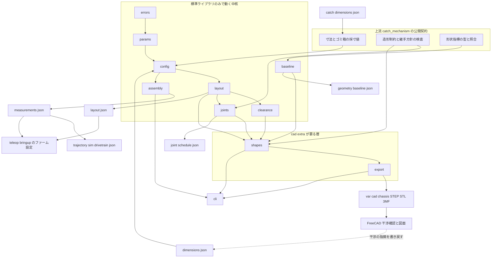
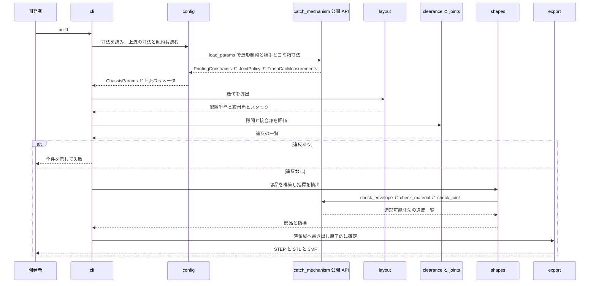
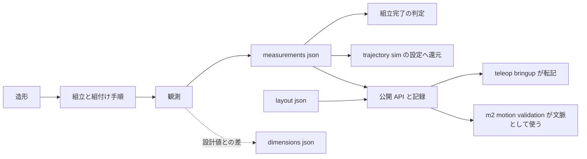

# Technical Design Document

## Overview

**Purpose**: 本 Spec は、手元に揃っている駆動部品を「機体」にするための構造物一式
（駆動ベース・ゴミ箱固定アダプタ・バッテリ／基板トレイ・配線ガイド・整備スタンド）を
設計し、造形し、組み立て、実測する。これにより `teleop-bringup`（M2a 初通電走行）の
着手条件——**安全に台上へ載せられる機体が物理的に存在すること**——を成立させる。

**Users**: 機構を設計する開発者（寸法の確定と形状生成）、機体を組み立てる開発者（造形と組立、
組付け手順の遂行）、および下流 Spec の実施者（`teleop-bringup` は整備スタンドと機体を使い、
`m2-motion-validation` は実測重量・重心を性能評価の文脈として使う）。

**Impact**: 現在、構造物は一つも存在せず駆動系トラック全体が止まっている。本 Spec は
上流 `catch-mechanism` が確立した CAD 基盤（形状の正・寸法パラメータの単一の正・造形制約・
継手方針）を**消費する側**として新規パッケージ `chassis_mechanism` を1つ立て、
機構設計時が期限と定められた4つの未決事項（OQ-07 / OQ-09 / OQ-11 / OQ-12）を決着させ、
非純正部品の公称値の上に載っている数値を実測へ置き換える。
⚠️ **本 Spec はモータを回さない。**

### Goals

- 造形可能寸法・継手方針・ゴミ箱の採寸値を**上流から参照するだけで**成立する設計層を作る
  （同じ値を2箇所に持たない）
- ホイール配置半径・鉛直スタック・床との隙間・接合部・締結部品を、
  **寸法パラメータ1点の更新から全体が再導出される**構造にする
- 整備スタンドを他のどの造形物よりも先に成立させる
- 造形・組立を経て、実測重量・重心・荷重下の実効転がり径を**記録として残し**、
  実効転がり径をシミュレータ設定へ還元する
- 下流が転記して使う値（`base_radius_mm` / 取付角 / 実効ホイール径 / 重量 / 重心）を、
  単位と基準を添えて公開する

### Non-Goals

- CAD 基盤そのもの（形状の正の枠組み・寸法パラメータの単一の正・造形制約・継手方針の**定義**）
- ゴミ箱本体の選定と開口寸法、受け口（ワイドリム／漏斗）の設計
- 通電・走行・計測、エンコーダのカウント校正、性能値（最高速度・加速度上限）の決定
- 制御ロジックとペリフェラルの実装
- 緩衝ライナーの要否・材質（OQ-10）、物理的な非常停止手段の決着（OQ-13）
- センサー固定治具、フレーム剛性の実測
- `docs/` 本体の更新（決着した未決事項の決定記録への移行を含む。A-10）

## Boundary Commitments

### This Spec Owns

- **本 Spec 固有の寸法パラメータの単一の正**: `configs/chassis_mechanism/dimensions.json` と
  その型・検証・読み込み（`params.py` / `config.py`）
- **幾何の導出**: ホイール配置半径・各輪の取付角・鉛直スタック・軸方向スタック
  （`layout.py` と導出記録 `configs/chassis_mechanism/layout.json`）。
  ⚠️ **OQ-07 の決着はここが唯一の置き場所**
- **床との隙間の算出と違反の列挙**（`clearance.py`）
- **接合部の定義と締結部品の数え上げ**（`joints.py` と記録 `configs/chassis_mechanism/joint-schedule.json`）。
  ⚠️ **OQ-09 の決着はここが唯一の置き場所**
- **組立後の観測の記録と、組立完了の判定**（`assembly.py` と `configs/chassis_mechanism/measurements.json`）
- **本 Spec の部品の形状の正**（`shapes.py`）と、そこからの生成物（`export.py`）
- **本 Spec の部品の形状指標の記録**（`configs/chassis_mechanism/geometry-baseline.json`、`baseline.py`）
- **電源系の機構的決着**（OQ-11 / OQ-12）と材料・接合姿勢の判断。
  本書「機構の決定」節が**記録の正**
- **組立手順**。本書「組立手順」節が**記録の正**

### Out of Boundary

- 上流 `catch_mechanism` が所有するもの——造形可能寸法・許可材料一覧・継手方針の**定義**、
  ゴミ箱の採寸値の**所有**、形状指標の型と照合の**定義**、受け口の形状。
  ⚠️ 本 Spec はこれらを**参照して用いる**だけで、同じ定義を持たない
- `src/trajectory_sim/` および `firmware/` の**実装コード**（還元は設定ファイルの値のみ）
- 輪番号と各輪の取付角の**規約の定義**。`firmware/lib/drivetrain_control` の
  `Kinematics` の行定義が唯一の場所である
- 通電・走行・エンコーダ校正・性能値の決定、台上確認（M2a-0 の #15〜#18）の**実施**
- 緩衝ライナーの材質決定、非常停止手段の決着、センサー固定治具、フレーム剛性の実測
- `docs/` 本体の更新（A-10）

### Allowed Dependencies

| 依存先 | 可否 | 条件 |
|---|---|---|
| Python 標準ライブラリ | 可 | 中核8モジュールはこれと下記の上流のみ |
| `catch_mechanism` の**公開 API** | 可 | ⚠️ `import catch_mechanism` / `from catch_mechanism import X` のみ。内部モジュール（`catch_mechanism.params` 等）へ直接 import しない |
| `build123d`（＋推移依存の OCCT バインディング） | 可 | **`shapes.py` / `export.py` に限る。** 上流が導入済みの extras `cad` を使い、**新しい extra を追加しない** |
| `prediction_core` / `trajectory_sim` / `sensing_foundation` / その他の兄弟パッケージ | **不可** | 依存方向が逆になる、または無関係 |
| `firmware/` 側の資産 | 不可 | 別のビルド系列 |
| 外部 CAD（FreeCAD） | 実行時依存としては不可 | STEP を読む道具であり、コードから起動しない |

⚠️ **`chassis_mechanism` は `trajectory_sim` を import しない。** 還元は
`configs/trajectory_sim/drivetrain-wheel60.json` の値と、それを読むだけの一致検査を通じて行う。

### Revalidation Triggers

以下の変更は、下流（`teleop-bringup` / `m2-motion-validation`）の再検証を要する。

1. `layout.json` / `measurements.json` の**構造・キー名・単位**の変更（値の更新は再検証を要さない）
2. ホイール配置半径・取付角の**基準の変更**（機体 +x から反時計回り、mm という約束）
3. 実効転がり径の**代表値の選び方**の変更（3個の平均を採るという規則）
4. 公開 API（`chassis_mechanism.__init__.__all__`）のシンボル追加・削除・意味変更
5. `geometry-baseline.json` の形式変更、または照合の許容差の緩和
6. 整備スタンドの支持方式の変更（駆動ベース端部にぶら下がる駆動ユニット（モータ胴体）の下面で支持するという前提）
7. 組立完了の判定に用いる必須観測項目の増減

⚠️ 上流側では、**`catch-mechanism` の Revalidation Triggers 項目1・4・5** が発火したとき
本 Spec の再検証が必要になる（`dimensions.json` の構造変更、公開 API の変更、
`GeometryBaseline` の形式変更）。

## Architecture

### Existing Architecture Analysis

- **固定側は単一の `pyproject.toml` / `src` レイアウト**であり、Spec 1つにつき
  `src/<パッケージ名>/`、テストは `tests/<パッケージ名>/`、設定は `configs/<パッケージ名>/`
  （`structure.md`「Code Layout」）
- 上流 `catch_mechanism` は**公開契約を `__init__.__all__` で機械的に固定**し、
  `tests/catch_mechanism/test_catch_downstream_contract.py` の `PUBLIC_CONTRACT` が
  由来モジュールごとの並びまで固定している。⚠️ **本 Spec はこの契約の唯一の消費者である**
- 上流 `dimensions.json` は**あらゆる階層で未知キーを拒否**し、
  `test_catch_config.py` は `document["chassis"] = {...}` が拒否されることを固定している。
  ⚠️ **本 Spec のパラメータを上流の設定ファイルへ相乗りさせられない**
- `[project].dependencies == []` と extras の許可リスト（`ALLOWED_OPTIONAL_EXTRAS`）は
  2ファイルに複製されている。⚠️ **本 Spec は新しい extra を追加しないため、この2ファイルに触れない**
- `tests/` に `__init__.py` が無くテストモジュール名がフラットな名前空間を共有する。
  ⚠️ **テストファイルは `test_chassis_` 接頭辞が必須**
- `.gitattributes` は `*.json` を CRLF に固定し、Python が書き戻す
  `configs/catch_mechanism/*.json` だけ `eol=lf` の例外を**後置**している
- **リポジトリに CI は存在しない**。「検査する」の実体は `python -m pytest` である

### Architecture Pattern & Boundary Map

**選定パターン**: 上流の中核層を土台に、本 Spec の中核層（標準ライブラリのみ）を重ね、
その上に形状生成層（`cad` extra）を薄く載せる **Core + Optional Adapter**。
上流と同形であり、造形環境なしで大半を検証できる。



**Architecture Integration**:

- **責務の分離**: 「値を持つ層」「値から幾何を導く層」「形を作る層」を分ける。
  ⚠️ **上流との境界は `Upstream` サブグラフとの矢印がすべてであり、逆向きの矢印は無い**
- **既存パターンの踏襲**: 出所付きパラメータ、未知キー拒否、frozen dataclass による構築時検証、
  `__init__` の明示的な公開 API、違反を値で返す検査は上流と同形
- **新規要素の根拠**: `layout`（幾何の導出）・`clearance`（床との隙間）・`joints`（接合部と締結部品）・
  `assembly`（組立後の観測と完了判定）は、上流に対応物が無い**本 Spec 固有の構造的要求**である。
  とくに `assembly` は「組み上がったかどうかを、モータを回さずにデータで判定する」ための層であり、
  これが無いと完了判定が規律頼みになる
- **FreeCAD は破線**で示すとおり成果物の生成経路に入らない。干渉の指摘は人手で
  `dimensions.json` へ戻す経路のみ

### Dependency Direction

```
errors → params → config → layout → {clearance, joints} → {assembly, baseline} → shapes → export → cli
```

- 各層は**左側の層からのみ** import する。上位方向の import は許さない
- `catch_mechanism` の公開 API は `params` / `config` / `joints` / `baseline` / `shapes` / `cli` から import してよい。
  ⚠️ **内部モジュール（`catch_mechanism.params` 等）を直接 import しない**
- `build123d` の import は **`shapes` / `export` の2モジュールに限る**
- `__init__` は `shapes` / `export` を import しない（公開 API が OCCT を要求しないため）。
  ⚠️ 上流 `catch_mechanism.__init__` も OCCT へ到達しないため、この性質は推移的に保たれる
- `cli` は `shapes` / `export` を**関数内で遅延 import** し、未導入時に専用の失敗を返す
- この方向と import 制限は `tests/chassis_mechanism/test_chassis_boundaries.py` が
  `ast` で静的に検査する（上流と同じく `chassis_mechanism` を import しない）

### Technology Stack

| Layer | Choice / Version | Role in Feature | Notes |
|-------|------------------|-----------------|-------|
| CLI | Python 3.11 標準ライブラリ（`argparse`） | `build` / `check` / `layout` / `joints` サブコマンド | `python -m chassis_mechanism` |
| 中核ロジック | Python 3.11 標準ライブラリ ＋ `catch_mechanism` の公開 API | パラメータ・幾何導出・隙間・接合・観測・記録 | ⚠️ サードパーティ依存なし |
| 形状定義 | **build123d**（`>=0.9,<1.0`、OCCT カーネル） | ソリッド構築・STEP / STL / 3MF 出力 | 上流が導入済みの `cad` extra を使う。**新しい extra を足さない** |
| データ | JSON（`configs/chassis_mechanism/*.json` は LF） | 寸法・導出記録・締結部品一覧・観測記録・形状指標 | 行単位の差分が読める |
| 生成物 | STEP / STL / 3MF | 干渉確認・図面化・造形 | `var/cad/chassis/` へ出力（`.gitignore` 済み）。**コミットしない** |
| 干渉確認 | FreeCAD（任意・手動） | STEP を読み込み、組み上がり状態の干渉確認・測定・図面 | **形状の正を持たない。`.FCStd` は git 管理外** |
| 造形機 | Bambu Lab A1 mini | 180×180×180mm、エンクロージャ無し | 制約の定義は上流 `PrintingConstraints` が持つ |
| 材料 | PETG（上流の許可一覧より） | 全部品共通 | ⚠️ 荷重部材で欲しい ASA は造形機の制約で選べない |

## File Structure Plan

### Directory Structure

```
src/chassis_mechanism/
├── __init__.py          # 公開 API。build123d を import しない
├── errors.py            # 例外階層（ChassisMechanismError 基底）
├── params.py            # 出所つき寸法型・ChassisParams・構築時検証・PARAMETER_PATHS
├── config.py            # JSON 読み書き・未知キー拒否・出所検証・パラメータ識別子・上流の取り込み
├── layout.py            # ホイール配置半径・取付角・鉛直/軸方向スタックの導出と導出記録の直列化
├── clearance.py         # 床との隙間の算出と違反の列挙（値で返す）
├── joints.py            # 接合部の定義・当たり面と造形姿勢・締結部品の数え上げと一覧の直列化
├── assembly.py          # 組立後の観測の型・読み書き・必須項目の充足検査（組立完了の判定）
├── baseline.py          # 形状指標の記録の書き出しと識別子照合（型と比較は上流を使う）
├── shapes.py            # build123d による各部品の構築と指標抽出
├── export.py            # STEP / STL / 3MF の原子的な書き出し
├── cli.py               # サブコマンド実装（shapes / export は遅延 import）
└── __main__.py          # python -m chassis_mechanism の入口

configs/chassis_mechanism/
├── dimensions.json          # ★本 Spec 固有の寸法パラメータの単一の正（値＋出所）
├── layout.json              # 幾何の導出記録（入力・式・出所つき）。OQ-07 の決着の記録
├── joint-schedule.json      # 接合部と締結部品の一覧（導出記録）。OQ-09 の決着の記録
├── measurements.json        # 組立後の観測（重量・重心・実効転がり径・隙間実測・組立差分）
└── geometry-baseline.json   # 形状指標の記録（parameters_digest つき）

tests/chassis_mechanism/
├── test_chassis_params.py              # 構築時検証・出所の継承規則
├── test_chassis_config.py              # 未知キー拒否・欠損拒否・往復・識別子の安定性・上流の取り込み
├── test_chassis_layout.py              # R の導出・取付角・スタック・基準面未確認時の出所
├── test_chassis_clearance.py           # 隙間の算出・違反の全件列挙・実効半径への追随
├── test_chassis_joints.py              # 接合部の当たり面・造形姿勢・締結部品の数え上げ
├── test_chassis_assembly.py            # 観測記録の検証・必須項目の充足・完了判定
├── test_chassis_baseline.py            # 記録の書き出し・識別子照合（CAD 不要）
├── test_chassis_boundaries.py          # import 範囲・依存方向・上流の公開 API 限定の静的検査
├── test_chassis_upstream_contract.py   # 上流から借りる項目が存在し CAD 無しで使えること
├── test_chassis_shapes.py              # 部品の構築と指標抽出（cad extra 必要）
├── test_chassis_invariants.py          # 分割・座面・スタンドの不変条件（cad extra 必要）
├── test_chassis_geometry_regression.py # 再生成 → 指標照合・決定性（cad extra 必要）
├── test_chassis_export.py              # 3形式の書き出し・失敗時に部分ファイルを残さない（cad extra 必要）
├── test_chassis_cli.py                 # サブコマンドと終了コードの写像
├── test_chassis_trajectory_sim_sync.py # シミュレータ設定との一致検査
├── test_chassis_packaging.py           # wheel の packages 登録・extras を増やしていないこと
├── test_chassis_repo_settings.py       # .gitattributes の LF 例外行の位置
└── test_chassis_end_to_end.py          # 寸法更新 → 再導出 → 検査の一貫性
```

> `tests/` はフラットな名前空間を共有するため、全ファイルに `test_chassis_` 接頭辞を付ける。

### Modified Files

- `pyproject.toml` — `[tool.hatch.build.targets.wheel].packages` へ `src/chassis_mechanism` を追加。
  ⚠️ **`[project].dependencies` と `[project.optional-dependencies]` は変更しない**
- `.gitattributes` — `configs/chassis_mechanism/*.json  text eol=lf` を1行追加。
  ⚠️ **`*.json  text eol=crlf` より後ろに置く**（git は最後にマッチした行を採用する）
- `configs/catch_mechanism/dimensions.json` — `trash_can.bottom_flat_diameter_mm` の**値**と
  `provenance` の該当行のみ更新（A-2、要件 6.3 / 6.4）。
  ⚠️ **構造・キー名・単位には触れない。上流の実装コードにも触れない**
- `configs/trajectory_sim/drivetrain-wheel60.json` — `wheel_diameter_mm` の**値のみ**更新
  （要件 10.6 / 10.7）。⚠️ **ファイル名は変更しない**——名前は「60mm ホイール構成」という
  構成の識別であり、実効径の主張ではない

> `.gitignore` は追加不要（`var/` と `*.FCStd` が既に効く）。
> `tests/prediction_core/test_packaging.py` と `tests/sensing_foundation/test_sensing_boundaries.py` の
> 許可リストは、新しい extra を足さないため**触れない**。

## System Flows

### 寸法 → 幾何 → 形状 → 生成物 → 照合



**Key Decisions**:

- **検査は形状生成の前に置く**。隙間と接合部の違反は、形が出来上がってから気付いても直しづらい
- **違反は全件まとめて返す**。1件ずつ直す往復を避ける（上流 `check_envelope` と同じ流儀）
- **書き出しは原子的**。失敗時に部分ファイルを残さない（要件 1.11 の「生成物」側の担保）

### 組立 → 観測 → 還元と公開



**Key Decisions**:

- **観測は設計入力と別のファイルへ置く**。混ぜるとパラメータ識別子が観測のたびに動き、
  「形状を再生成すべき変更」と「再生成不要な変更」が区別できなくなる
- **組立完了はデータで判定する**。必須の観測項目がすべて実測で埋まっていることが条件であり、
  ⚠️ **モータへの通電を一切含まない**
- **還元先はシミュレータ設定だけが機械的に検査できる**。ファームウェア設定は本 Spec からは
  検査できないため、公開記録に単位と基準を明記して転記ミスの余地を減らす

## Requirements Traceability

| Requirement | Summary | Components | Interfaces | Flows |
|-------------|---------|------------|------------|-------|
| 1.1, 1.2, 1.10 | 寸法値と出所を単一の設定ファイルへ・行単位の差分 | Params, Config, dimensions.json | `load_params` / `Provenance` | 寸法 → 形状 |
| 1.3 | 上流の値・制約・継手を参照し再定義しない | Config, Joints, Baseline, PublicApi | `catch_mechanism` 公開 API | 寸法 → 形状 |
| 1.4 | 未知キー・欠損・範囲外の拒否 | Config, Params | `load_params` の検証 | — |
| 1.5 | 採寸値をコード変更なしに反映 | Config, Layout, Shapes | `load_params` → `derive_layout` → `build_parts` | 寸法 → 形状 |
| 1.6, 1.7, 1.8 | ブラケット取付穴・取付面の向き・軸方向スタック・ボルト円の対応の実測と照合 | Params, Layout, Assembly | `BracketMeasurements` / `derive_layout` | 寸法 → 形状 |
| 1.9 | 未実測の公称寸法は仮値として扱う | Params, Config, Layout | `Provenance` の継承 | — |
| 1.11, 1.12 | 手続きとしての形状定義・ヘッドレス生成・決定性 | Shapes, Export, Cli | `build_parts` / `build` サブコマンド | 寸法 → 形状 |
| 2.1, 2.2, 2.3 | 分割の導出と断片の検査・超過時の失敗 | Joints, Shapes, Constraints（上流） | `required_segment_count` / `check_envelope` | 寸法 → 形状 |
| 2.4, 2.5 | 材料の選択とクリープ前提の根拠 | Shapes, 本書「機構の決定」節 | `check_material` | — |
| 2.6, 2.7 | 圧縮で受ける接合・位置決め要素への荷重禁止 | Joints, Shapes | `JointSpec` / `JointPolicy` | 寸法 → 形状 |
| 2.8 | 接合面の法線と積層方向・造形姿勢の記録 | Joints, joint-schedule.json | `JointSpec.print_normal_axis` | 寸法 → 形状 |
| 2.9 | 当たり面の下限を上流の検査で確認 | Joints | `check_joint` | 寸法 → 形状 |
| 2.10 | 締結部品の種別・長さ・必要数の一覧 | Joints, joint-schedule.json | `derive_fastener_schedule` | 寸法 → 形状 |
| 2.11 | 切削加工を前提とする形状を含めない | 本書「機構の決定」節, Shapes | — | — |
| 3.1, 3.2, 3.10 | 中央部と3つの取付部・等角度配置・接合の設計 | Layout, Joints, Shapes | `ChassisLayout` / `JointSpec` | 寸法 → 形状 |
| 3.3, 3.4 | 配置半径の導出と決定の根拠の記録 | Layout, layout.json, 本書「機構の決定」節 | `derive_layout` / `dump_layout` | 寸法 → 形状 |
| 3.5 | 転倒余裕は推定として記録し合否に使わない | Layout, layout.json | `TippingEstimate` | — |
| 3.6 | 輪番号と取付角の規約は上流から受け取る | Layout, 本書 Out of Boundary | `first_wheel_angle_deg` | 組立 → 公開 |
| 3.7, 3.8 | ブラケット経由の取付と長穴による寸法差の吸収 | Params, Shapes | `slot_travel_mm` | 寸法 → 形状 |
| 3.9 | 採寸更新時の再導出 | Layout, Shapes | `derive_layout` | 寸法 → 形状 |
| 4.1, 4.2, 4.3 | ベース下面高さの導出・4部位の隙間・下限値の保持 | Layout, Clearance, Params | `VerticalStack` / `evaluate_clearance` | 寸法 → 形状 |
| 4.4 | 下限を下回る場合の失敗と部位・不足量 | Clearance, Cli | `ClearanceViolation` | 寸法 → 形状 |
| 4.5 | 組立後の隙間実測と設計値との差の記録 | Assembly, measurements.json | `ClearanceObservation` | 組立 → 公開 |
| 4.6 | 配線が床へ垂れ下がらない保持箇所 | Shapes, Params | `cable_guide` 部品 | 寸法 → 形状 |
| 4.7 | 採寸・配置更新時の隙間の再算出 | Clearance, Layout | `evaluate_clearance` | 寸法 → 形状 |
| 5.1, 5.2 | 整備スタンドの先行・設計入力の限定 | Shapes, Layout, 本書「機構の決定」節 | `service_stand` 部品 | 寸法 → 形状 |
| 5.3, 5.4, 5.5 | 支持位置・3輪の非接触・回転の隙間 | Shapes, Params, test_chassis_invariants | `StandGeometry` | 寸法 → 形状 |
| 5.6, 5.7 | 反力に対する拘束の設計と手による確認 | Joints, 本書「組立手順」節, Assembly | `stand_retention_check` | 組立 → 公開 |
| 5.8 | 回転方向の目視と操作部への到達 | Shapes, 本書「機構の決定」節 | `StandGeometry` | — |
| 5.9 | 載せ降ろしを一人で行える手順 | 本書「組立手順」節 | — | — |
| 5.10 | 台上の確認項目そのものは責務外 | 本書 Out of Boundary | — | — |
| 6.1, 6.2, 6.9 | 円錐台の側面に沿う受け面・上流の採寸からの導出と再導出 | Shapes, Config | `AdapterGeometry` / `TrashCanMeasurements` | 寸法 → 形状 |
| 6.3, 6.4 | 上流の仮値の実測と値・出所のみの更新 | Config, Assembly, catch dimensions.json | 上流 `dump_params` | 組立 → 公開 |
| 6.5, 6.6 | 水平・上方向の拘束と着脱手順 | Shapes, 本書「組立手順」節 | `AdapterGeometry.retention` | 寸法 → 形状 |
| 6.7 | 底を抜いた通過を狭めず受け口と干渉しない | Shapes, test_chassis_invariants | `AdapterGeometry` の不変条件 | 寸法 → 形状 |
| 6.8 | 締結箇所の配置の根拠（残る縁の幅と側壁） | 本書「機構の決定」節, Joints | `JointSpec` | — |
| 6.10-6.12 | 切り取り径は寸法パラメータ（手切りの余裕つき・平面部径が上限）・縁は座面・掴み面は誤差の全域を覆う | Shapes, Params, 本書 決定 4b | `AdapterGeometry` の不変条件 | 寸法 → 形状 |
| 6.13, 6.14 | 側壁の穴はアダプタをガイドに開ける・段が確定するまで切らない | 本書「組立手順」節, 決定 4b | — | 組立 → 公開 |
| 7.1, 7.2, 7.3 | バッテリ最下部・着脱・搭載物の拘束 | Shapes, Params | `battery_tray` 部品 | 寸法 → 形状 |
| 7.4, 7.5 | 基板デッキの取付箇所と放熱の隙間 | Shapes, Params | `board_deck` 部品 | 寸法 → 形状 |
| 7.10, 7.11, 7.13 | 段積み土台を缶の内側へ通す・段の外形は高さごとの缶の内径から導出・超えれば分割 | Shapes, Params | `board_deck` / `catch_deck` | 寸法 → 形状 |
| 7.14 | 組立の順序が幾何的に成立する（缶が先・段は口から落とし込む） | Shapes, test_chassis_invariants | 到達経路の掃引 | 寸法 → 形状 |
| 7.12 | 最上段が上流の緩衝材用の平面の最小径以上の平面を持つ | Shapes, test_chassis_invariants | `retention.liner_flat_min_diameter_mm` | 寸法 → 形状 |
| 7.6, 7.7 | 配線経路の分離と識別 | Shapes, Params, 本書「組立手順」節 | `cable_guide` 部品 | 寸法 → 形状 |
| 7.8, 7.9 | 質量と保持高さの記録・合成重心の見積もり | Params, Layout, Baseline | `MassItem` / `estimate_mass_g` | 寸法 → 形状 |
| 8.1, 8.2 | メイン電源スイッチと電源分岐端子の決定と根拠 | 本書「機構の決定」節, Params | `PowerParams` | — |
| 8.3, 8.4 | スイッチの操作位置・端子台の保持と経路 | Shapes, Params | `board_tray` / `cable_guide` | 寸法 → 形状 |
| 8.5 | 主ヒューズをバッテリ直近へ置ける保持箇所 | Shapes, Params | `battery_tray` | 寸法 → 形状 |
| 8.6, 8.7 | 非常停止は対象外・判断材料と後付け余地 | 本書「機構の決定」節, Shapes | `PowerParams.estop_provision` | — |
| 8.8 | 無線依存の停止手段を安全装置として扱わない | 本書「機構の決定」節 | — | — |
| 9.1 | 造形前の干渉確認 | Shapes, test_chassis_invariants | `assembled_interferences` | 寸法 → 形状 |
| 9.2, 9.3 | 造形と組立・組立手順の記録 | 本書「組立手順」節, Export | — | 組立 → 公開 |
| 9.4, 9.5, 9.6 | 止めネジの平面当て・滑り確認・ボルト円の確認 | 本書「組立手順」節, Assembly | `AssemblyCheck` | 組立 → 公開 |
| 9.7 | 干渉・締結不能時の差分の記録と反映 | Assembly, Config | `FitDeviation` | 組立 → 公開 |
| 9.8 | 組立完了を通電なしで判定 | Assembly, Cli | `missing_observations` | 組立 → 公開 |
| 9.9 | 走行・通電・校正・性能値は対象外 | 本書 Out of Boundary | — | — |
| 10.1, 10.2 | 実測重量と重心の測定と記録 | Assembly, measurements.json | `MassObservation` / `CogObservation` | 組立 → 公開 |
| 10.3, 10.4, 10.5 | 実効転がり径の個体差・手順・静的測定の限界 | Assembly, measurements.json | `WheelObservation` | 組立 → 公開 |
| 10.6, 10.7, 10.8 | シミュレータ設定への値のみの還元と一致検査 | Cli, test_chassis_trajectory_sim_sync | `layout --check` | 組立 → 公開 |
| 10.9 | 実測値と概算値の区別 | Assembly, Params | `Provenance` | — |
| 11.1, 11.2, 11.3, 11.5 | 配置半径・取付角・実効径・重量・重心の出所つき公開 | PublicApi, layout.json, measurements.json | `__all__` | 組立 → 公開 |
| 11.4 | 整備スタンドの使用手順と保持条件の公開 | 本書「機構の決定」節, PublicApi | `StandGeometry` | 組立 → 公開 |
| 11.6 | 公開項目の変更は再検証対象 | 本書 Revalidation Triggers | — | — |
| 11.7 | 決着の記録を後から移せる形で残す | 本書「機構の決定」節, layout.json, joint-schedule.json | — | — |
| 11.8, 11.9 | 責務外の明示と完了の意味の限定 | 本書 Out of Boundary, Overview | — | — |

## Components and Interfaces

| Component | Domain/Layer | Intent | Req Coverage | Key Dependencies (P0/P1) | Contracts |
|-----------|--------------|--------|--------------|--------------------------|-----------|
| Errors | 中核 | 例外階層の基底 | 1.4, 2.3, 4.4 | なし | Service |
| Params | 中核 | 寸法型・出所・構築時検証 | 1.1, 1.2, 1.6, 1.9, 3.7, 7.8, 8.1 | Errors (P0) | Service |
| Config | 中核 | JSON 読み書き・未知キー拒否・識別子・上流の取り込み | 1.1, 1.3, 1.4, 1.5, 1.10, 6.3 | Params (P0), catch_mechanism (P0) | Service, State |
| Layout | 中核 | 配置半径・取付角・鉛直/軸方向スタックの導出と記録 | 3.1-3.6, 3.9, 4.1, 7.8 | Config (P0) | Service, Batch |
| Clearance | 中核 | 床との隙間の算出と違反の列挙 | 4.1-4.4, 4.7 | Layout (P0) | Service |
| Joints | 中核 | 接合部の定義・当たり面・造形姿勢・締結部品の数え上げ | 2.1-2.3, 2.6-2.10, 3.10, 5.6, 6.8 | Layout (P0), catch_mechanism (P0) | Service, Batch |
| Assembly | 中核 | 組立後の観測の記録と完了判定 | 4.5, 6.3, 9.4-9.8, 10.1-10.5, 10.9 | Config (P0) | Service, State |
| Baseline | 中核 | 形状指標の記録の書き出しと識別子照合 | 1.12, 7.9 | catch_mechanism (P0), Config (P0) | Service |
| Shapes | CAD | 各部品の構築と指標抽出 | 1.11, 2.2-2.7, 3.7, 4.6, 5.1-5.5, 5.8, 6.1-6.2, 6.5-6.7, 6.9, 7.1-7.7, 8.3-8.5, 9.1 | Layout (P0), Joints (P0), Clearance (P0), build123d (P0) | Service |
| Export | CAD | 3形式の原子的な書き出し | 1.11, 9.2 | Shapes (P0), build123d (P0) | Service, Batch |
| Cli | 入口 | 4サブコマンドと終了コード | 1.11, 2.3, 4.4, 9.8, 10.6-10.8 | 全中核 (P0), Shapes/Export 遅延 (P1) | Service, Batch |
| PublicApi | 入口 | 下流が参照してよい公開契約 | 1.3, 11.1-11.5 | 中核のみ (P0) | Service |

### 中核（標準ライブラリと上流の公開 API のみ）

#### Errors

| Field | Detail |
|-------|--------|
| Intent | 本 Spec の失敗を型で区別し、終了コードへ写せるようにする |
| Requirements | 1.4, 2.3, 4.4 |

**Responsibilities & Constraints**
- `ChassisMechanismError(ValueError)` を基底に、`ParameterError` / `GeometryError` /
  `ClearanceError` / `MeasurementError` / `ConsistencyError` / `CadUnavailableError` を持つ
- ⚠️ **上流の `CatchMechanismError` 系を継承しない。また包み直さない。**
  上流の失敗は上流の型のまま伝播させ、「どちらの設定が壊れているか」をメッセージから消さない
- 依存を持たない層であるため、違反を表す値型（`BuildViolation` / `ClearanceViolation`）を
  import できない。⚠️ **部位名・軸・超過量は例外メッセージへ載せる**（上流と同じ方針）

**Dependencies**: なし

**Contracts**: Service [x]

##### Service Interface
```python
class ChassisMechanismError(ValueError): ...
class ParameterError(ChassisMechanismError): ...      # 値・キー・範囲の不正
class GeometryError(ChassisMechanismError): ...        # 造形可能寸法・分割・干渉
class ClearanceError(ChassisMechanismError): ...       # 床との隙間の不足
class MeasurementError(ChassisMechanismError): ...     # 観測記録の不足・不整合
class ConsistencyError(ChassisMechanismError): ...     # 記録と現在値の不一致
class CadUnavailableError(ChassisMechanismError): ...  # 形状ライブラリ未導入
```

#### Params

| Field | Detail |
|-------|--------|
| Intent | 本 Spec 固有の寸法値を型として持ち、構築時に検証する |
| Requirements | 1.1, 1.2, 1.6, 1.9, 3.7, 7.8, 8.1 |

**Responsibilities & Constraints**
- コンポーネントは `bracket` / `motor` / `wheel` / `hub` / `base` / `clearance` / `adapter` /
  `battery` / `board` / `power` / `stand` / `joint_local` の12群
- すべて `frozen=True, slots=True` の dataclass。`__post_init__` で正値性・有限性・角度範囲を検証し、
  違反時は**項目名と値**を添えて `ParameterError` を送出する
- ⚠️ **`bracket` は値だけでなく基準面の定義を文字列で持つ**
  （`mount_face_reference`）。⚠️ 「別途 105.6mm という測定値があったが基準面が不明のため破棄した」
  という失敗を再発させないための型上の要求である
- `Provenance` は**上流の型をそのまま使う**（`measured` / `assumed`）。⚠️ 独自に定義しない
- 導出値の出所は**入力の最も弱いものを継承する**（1つでも仮値を含めば仮値）
- `PARAMETER_PATHS` はデータクラス木から生成し、`provenance` のキー集合と一致することを
  `Config` が検証する。⚠️ **一覧を手書きしない**

**Dependencies**
- Inbound: Config — 読み込んだ値からの構築 (P0)
- External: `catch_mechanism.Provenance` — 出所の型 (P0)

**Contracts**: Service [x]

##### Service Interface
```python
@dataclass(frozen=True, slots=True)
class BracketMeasurements:
    outline_x_mm: float
    outline_y_mm: float
    mount_face_to_contact_mm: float        # 取付面から接地点まで（鉛直）
    mount_face_to_wheel_center_mm: float   # 取付面からホイール中心まで（軸方向）
    mount_face_reference: str              # どの面のどの点から測ったか（人が読む定義）
    mount_hole_count: int
    mount_hole_diameter_mm: float
    mount_hole_pitch_mm: float

@dataclass(frozen=True, slots=True)
class ChassisParams:
    bracket: BracketMeasurements
    motor: MotorSpec
    wheel: WheelSpec
    hub: HubSpec
    base: BaseSpec
    clearance: ClearanceLimits
    adapter: AdapterSpec
    battery: BatterySpec
    board: BoardSpec
    power: PowerParams
    stand: StandSpec
    joint_local: LocalJointLimits
    provenance: Mapping[str, Provenance]

PARAMETER_PATHS: Mapping[str, ParameterPath]
```
- Preconditions: すべての数値は有限。長さは正、角度は `-360 < x < 360`
- Postconditions: 構築に成功した `ChassisParams` は以降の導出で再検証を要さない
- Invariants: `provenance` のキー集合 == `PARAMETER_PATHS` のキー集合

**Implementation Notes**
- Integration: `LocalJointLimits.min_bearing_area_mm2` は**上流の下限以上でなければならない**。
  ⚠️ 本 Spec は上流の下限を**厳しくすることはできるが緩めることはできない**。
  緩める値は `ParameterError` で拒否する（要件 2.9 の担保）
- Risks: 群が12あり肥大しやすい。⚠️ **上流が持つ値（造形可能寸法・材料・継手方針・
  ゴミ箱の採寸値）を1つでもここへ書いたら要件 1.3 違反である**。
  `test_chassis_boundaries.py` が項目名の重複を検出する

#### Config

| Field | Detail |
|-------|--------|
| Intent | 設定ファイルの読み書きと、上流パラメータの取り込みを1箇所に集める |
| Requirements | 1.1, 1.3, 1.4, 1.5, 1.10, 6.3 |

**Responsibilities & Constraints**
- `dimensions.json` を読み、**あらゆる階層で未知キーを拒否**し、欠損と型不正を項目名付きで拒否する
- 上流の `load_params()` を呼び、`PrintingConstraints` / `JointPolicy` / `TrashCanMeasurements` を
  取り込んだ `ResolvedParams` を返す。⚠️ **上流の値を本 Spec のファイルへ複製しない**
- `parameters_digest(params)` は本 Spec の寸法から安定した識別子を算出する。
  ⚠️ **上流の `parameters_digest` は引数型が違うため使えない。値の正規化規則は上流と同形にする**
- 書き出しは LF・キー整列・末尾改行。⚠️ `.gitattributes` の LF 例外行と対で成立する
- 上流の仮値を実測へ更新する経路（要件 6.3）は、上流の `dump_params` を用いて
  **値と `provenance` の該当行だけ**を書き戻す

**Dependencies**
- Inbound: Layout, Assembly, Baseline, Cli (P0)
- Outbound: Params (P0)
- External: `catch_mechanism.load_params` / `dump_params` / `SCHEMA_VERSION` (P0)

**Contracts**: Service [x] / State [x]

##### Service Interface
```python
SCHEMA_VERSION: Final[str] = "1.0"
DEFAULT_DIMENSIONS_PATH: Final[Path]

@dataclass(frozen=True, slots=True)
class ResolvedParams:
    chassis: ChassisParams
    printing: PrintingConstraints      # 上流
    joint: JointPolicy                 # 上流
    trash_can: TrashCanMeasurements    # 上流

def load_params(path: Path | None = None) -> ResolvedParams: ...
def dump_params(params: ChassisParams, path: Path) -> None: ...
def parameters_digest(params: ChassisParams) -> str: ...
def update_upstream_measurement(path_key: str, value: float) -> None: ...
```
- Preconditions: `path` は存在し、UTF-8 の JSON オブジェクト
- Postconditions: `load_params` の戻り値は検証済み。`dump_params(load_params(p).chassis, p)` は往復で一致する
- Invariants: ⚠️ `update_upstream_measurement` は**値と出所以外を書き換えない**（要件 6.4）

##### State Management
- 状態は設定ファイルのみ。プロセス内にキャッシュを持たない
- 上流の設定ファイルへの書き戻しは `update_upstream_measurement` の1経路に限る

#### Layout

| Field | Detail |
|-------|--------|
| Intent | 幾何を1箇所で導出し、導出記録として残す。OQ-07 の唯一の置き場所 |
| Requirements | 3.1-3.6, 3.9, 4.1, 7.8 |

**Responsibilities & Constraints**
- `base_radius_mm = hub_center_to_mount_face_mm + bracket.mount_face_to_wheel_center_mm`
- 取付角は等配置とし、`first_wheel_angle_deg` から `wheel_count` 個を生成する。
  ⚠️ **基準は「機体 +x から反時計回り」**であり、これは `firmware` の `GeometryParams` の定義に合わせる。
  ⚠️ **輪番号と符号の対応をここで定義し直さない**
- 鉛直スタックを接地点（床）を原点として組み立てる:
  モータ胴体下面 → 車軸中心（＝実効転がり半径）→ 締結の下端 → 取付面（＝ベース板下面）
  ⚠️ **これは物理的な高さの順であり、`VerticalStack` の項目の宣言順ではない。**
  `drivetrain-spec.md §6.3` は車軸中心 30mm に対しモータ胴体下面 11.5mm を与えており、
  宣言順で単調増加する並びは実機では成立しない
- 軸方向スタック（ギヤボックス端面 → ホイール内側面 → ホイール中心面）を導出し、
  実測との照合結果を保持する（要件 1.7）
- 転倒余裕の見積もり `a_limit = g * R / (2 * h_cog)` を**推定として**保持する。
  ⚠️ **合否条件に使わない**ことを型と記録の両方で明示する（`TippingEstimate.is_pass_criterion = False`）
- 導出記録 `layout.json` は入力・式・出所・結果を持つ（上流 `catch-opening.json` と同形）

**Dependencies**
- Inbound: Clearance, Joints, Shapes, Cli (P0)
- Outbound: Config (P0)

**Contracts**: Service [x] / Batch [x]

##### Service Interface
```python
DEFAULT_LAYOUT_PATH: Final[Path]

@dataclass(frozen=True, slots=True)
class VerticalStack:
    effective_rolling_radius_mm: float
    nominal_rolling_radius_mm: float   # wheel.nominal_diameter_mm / 2（記録が示す手掛かり）
    axle_center_height_mm: float
    motor_body_bottom_height_mm: float
    mount_face_height_mm: float
    fastener_bottom_height_mm: float

@dataclass(frozen=True, slots=True)
class TippingEstimate:
    accel_limit_mm_s2: float
    cog_height_mm: float
    is_pass_criterion: bool            # 常に False
    note: str

@dataclass(frozen=True, slots=True)
class ChassisLayout:
    base_radius_mm: float
    wheel_angles_deg: tuple[float, ...]
    hub_center_to_mount_face_mm: float
    arm_length_mm: float
    vertical: VerticalStack
    axial_stack_mm: tuple[float, float, float]
    tipping: TippingEstimate
    provenance: Provenance             # 入力の最弱を継承

@dataclass(frozen=True, slots=True)
class ObservedRollingRadius:
    """観測された実効転がり半径。⚠️ **値と出所は必ず対で運ぶ。**

    値だけを渡すと `provenance` の畳み込みが「使わなかった公称値」の出所を
    継承し続け、実測を使ったのに仮値を名乗る（またはその逆）状態になる。
    型は `layout` 側に置く——`layout` は `assembly` を import できない。
    """

    radius_mm: float
    provenance: Provenance

def derive_layout(
    params: ResolvedParams,
    observed_rolling_radius: ObservedRollingRadius | None = None,
) -> ChassisLayout: ...
def dump_layout(layout: ChassisLayout, path: Path) -> None: ...
def load_layout(path: Path | None = None) -> ChassisLayout: ...
```
- Preconditions: `params` は検証済み。`wheel_count >= 3`
- Postconditions: `len(wheel_angles_deg) == wheel_count` かつ隣接角の差が等しい。
  `arm_length_mm > 0`（アームが成立しない `R` は `GeometryError`）
- Invariants: `0 < motor_body_bottom_height_mm < axle_center_height_mm ==
  effective_rolling_radius_mm < fastener_bottom_height_mm <= mount_face_height_mm`。
  ⚠️ この順序が崩れる入力は `GeometryError` で拒否し、逆転した対と差の量をメッセージに載せる
  （`fastener_bottom_height_mm == mount_face_height_mm` は
  `clearance.fastener_protrusion_mm == 0` のとき成立する正当な状態である）

**Implementation Notes**
- Integration: 実効転がり半径は、観測があれば `measurements.json` の代表値、
  無ければ公称値の半分を用いる。⚠️ **どちらを使ったかは `provenance` に現れる**。
  ⚠️ **ただし `provenance` だけでは足りない**——公称値と観測の出所が同じ（どちらも仮値など）で
  ありうるため、出所は両者を区別しない。そこで `VerticalStack` は `nominal_rolling_radius_mm` を
  `effective_rolling_radius_mm` と並べて持ち、導出記録にも並べて書く（一致＝公称値、乖離＝観測）。
  ⚠️ **これが無いと `ASSUMPTIONS` の「公称値の半分を用いる」という前提文を記録の側から反証できず、
  観測を使った記録が「公称値を仮定した」と名乗ったまま下流へ流れる**（要件 11.3）。
  そのため観測は `ObservedRollingRadius`（値＋出所）として渡し、観測を使う場合は
  `weakest_provenance` の畳み込みから `wheel.nominal_diameter_mm` の寄与を外して
  観測側の出所へ差し替える。⚠️ **`ResolvedParams` へ観測を混ぜてはならない**
  （`Config` が `Assembly` へ依存することになり依存方向が逆転し、
  パラメータ識別子が観測のたびに動く）。組み立てるのは `cli` / `__init__` 側である
- Validation: `arm_length_mm` は接合部の当たり面を確保できる最小長さ以上であること（要件 3.10 の前提）
- Risks: ⚠️ **`bracket.mount_face_reference` の確認が済むまで `base_radius_mm` の出所は仮値である。**
  `derive_layout` はこれを黙って実測に格上げしない

#### Clearance

| Field | Detail |
|-------|--------|
| Intent | 床との隙間を全部位について算出し、違反を値として返す |
| Requirements | 4.1-4.4, 4.7 |

**Responsibilities & Constraints**
- 対象部位は**ブラケット / ボルト頭とナット / 駆動ベース下面 / 配線**の4つ（要件 4.2）に
  モータ胴体下面を加えた5つ。モータ胴体は設計で動かせないが、
  ⚠️ **最も低い部位であり基準として一覧に出す価値がある**
- ⚠️ **例外を送出しない。** 違反は全件を値として返す。失敗として扱うのは呼び出し側である
- 隙間はすべて `VerticalStack` から算出されるため、実効転がり半径が変われば自動で追随する（要件 4.7）

**Dependencies**
- Inbound: Shapes, Cli (P0)
- Outbound: Layout (P0)

**Contracts**: Service [x]

##### Service Interface
```python
@dataclass(frozen=True, slots=True)
class ClearanceItem:
    name: str                # motor_body / bracket / fastener / base_underside / cable
    height_mm: float

@dataclass(frozen=True, slots=True)
class ClearanceViolation:
    name: str
    height_mm: float
    minimum_mm: float
    shortfall_mm: float      # 常に正

def clearance_items(layout: ChassisLayout, params: ChassisParams) -> tuple[ClearanceItem, ...]: ...
def evaluate_clearance(
    layout: ChassisLayout, params: ChassisParams
) -> tuple[ClearanceViolation, ...]: ...
```
- Preconditions: `layout` は `derive_layout` の戻り値
- Postconditions: 戻り値が空であることと、全部位が下限以上であることは同値
- Invariants: `clearance_items` は常に5件を返す。⚠️ **部位を黙って省かない**

#### Joints

| Field | Detail |
|-------|--------|
| Intent | 接合部を定義し、当たり面・造形姿勢・締結部品を導出する。OQ-09 の唯一の置き場所 |
| Requirements | 2.1-2.3, 2.6-2.10, 3.10, 5.6, 6.8 |

**Responsibilities & Constraints**
- 接合部の一覧を `ChassisLayout` と `ChassisParams` から**導出**する。
  ⚠️ **手書きの一覧を設定ファイルへ持たない**
- 各接合部は「荷重を受ける締結要素（貫通ボルト＋金属インサート）」と
  「位置決めのみを担う要素（ダボ）」を**型の上で区別**して持つ（要件 2.7）
- 当たり面は上流の `check_joint` に通す。加えて本 Spec の `LocalJointLimits` が
  ⚠️ **より厳しい下限を課すことがある**（モータ反力を受ける接合部）
- 造形姿勢は「接合面の法線が積層方向（Z）と一致しない」ことを表明する軸として持つ（要件 2.8）
- **分割数の導出は部品の種類で分かれる**（研究ログの決定）:
  - **円環部品**（ゴミ箱固定アダプタ）→ 上流 `required_segment_count` を用いる
  - **位相が決まっている部品**（駆動ベース）→ 分割数は `wheel_count` から従属し、
    各断片は `check_envelope` が関門になる
- 締結部品の長さは「積み上がり厚さ ＋ インサート長 ＋ 余裕」から導出する。
  ⚠️ **上流 `JointPolicy.insert_length_mm` を使い、数値を書き写さない**

**Dependencies**
- Inbound: Shapes, Cli (P0)
- Outbound: Layout (P0)
- External: `catch_mechanism.check_joint` / `check_envelope` / `required_segment_count` / `JointPolicy` (P0)

**Contracts**: Service [x] / Batch [x]

##### Service Interface
```python
DEFAULT_JOINT_SCHEDULE_PATH: Final[Path]

@dataclass(frozen=True, slots=True)
class JointSpec:
    name: str
    members: tuple[str, str]
    bolt_count: int
    bolt_length_mm: float
    insert_count: int
    dowel_count: int                  # 位置決め専用。荷重計算に算入しない
    bearing_area_mm2: float
    print_normal_axis: str            # 接合面の法線が向く軸。"z" は禁止
    min_bearing_area_mm2: float       # 上流の下限以上

@dataclass(frozen=True, slots=True)
class FastenerLine:
    designation: str                  # M3 など
    kind: str                         # bolt / nut / insert
    length_mm: float | None
    count: int

@dataclass(frozen=True, slots=True)
class FastenerSchedule:
    schema_version: str
    parameters_digest: str
    joints: tuple[JointSpec, ...]
    lines: tuple[FastenerLine, ...]

def derive_joints(layout: ChassisLayout, params: ResolvedParams) -> tuple[JointSpec, ...]: ...
def segment_counts(params: ResolvedParams) -> Mapping[str, int]: ...
def derive_fastener_schedule(
    layout: ChassisLayout, params: ResolvedParams
) -> FastenerSchedule: ...
def dump_fastener_schedule(schedule: FastenerSchedule, path: Path) -> None: ...
def load_fastener_schedule(path: Path | None = None) -> FastenerSchedule: ...
```
- Preconditions: `layout` は `derive_layout` の戻り値
- Postconditions: すべての `JointSpec.print_normal_axis != "z"`。
  すべての `JointSpec` が `check_joint` と本 Spec の下限の**両方**を満たす
- Invariants: `lines` の総数は `joints` から一意に決まる。⚠️ **ダボは `lines` に現れない**
  （ダボは造形で作る位置決め要素であり、購入する締結部品ではない）

**Implementation Notes**
- Validation: `print_normal_axis == "z"` の接合部は `GeometryError` で拒否する（要件 2.8）
- Risks: ⚠️ **当たり面の面積は形状から得るのが本来だが、`joints` は build123d を import できない。**
  したがって当たり面は**寸法パラメータから解析的に算出**し、
  `test_chassis_invariants.py`（`cad` extra）が実形状との一致を検査する

#### Assembly

| Field | Detail |
|-------|--------|
| Intent | 組立後の観測を記録し、通電なしで組立完了を判定する |
| Requirements | 4.5, 6.3, 9.4-9.8, 10.1-10.5, 10.9 |

**Responsibilities & Constraints**
- 観測は `measurements.json` に置く。⚠️ **設計入力（`dimensions.json`）と混ぜない**
- 保持する観測: 実測重量 / 重心（高さと半径方向の偏り、測定手順つき）/
  ホイール3個の実効転がり径と代表値 / 5部位の隙間の実測と設計値との差 /
  組立時の干渉・締結不能の差分 / 手による確認の結果
- 実効転がり径の**代表値は3個の平均**とする。⚠️ この規則は Revalidation Trigger 項目3 である
- 測定手順が転動を伴わない場合、⚠️ **その測定が捉えられない範囲を必須の記述項目とする**
  （要件 10.5）。記述が空なら `MeasurementError`
- `missing_observations()` が空であることを**組立完了の定義**とする。
  ⚠️ **判定にモータへの通電を含む項目を1つも置かない**（要件 9.8）

**Dependencies**
- Inbound: Cli, PublicApi (P0)
- Outbound: Config (P0)

**Contracts**: Service [x] / State [x]

##### Service Interface
```python
DEFAULT_MEASUREMENTS_PATH: Final[Path]

@dataclass(frozen=True, slots=True)
class WheelObservation:
    index: int
    effective_rolling_diameter_mm: float | None
    method: str                     # static_loaded / rolling
    limitation_note: str            # method が転動を伴わない場合は必須

@dataclass(frozen=True, slots=True)
class ClearanceObservation:
    name: str
    measured_mm: float | None
    design_mm: float | None
    difference_mm: float | None

@dataclass(frozen=True, slots=True)
class FitDeviation:
    location: str
    design_mm: float
    actual_mm: float
    reflected_in_parameters: bool

@dataclass(frozen=True, slots=True)
class AssemblyCheck:
    name: str                       # hub_setscrew_no_slip / wheel_bolt_circle / stand_retention
    result: str                     # pass / fail / pending
    note: str

@dataclass(frozen=True, slots=True)
class AssemblyRecord:
    schema_version: str
    mass_g: float | None                        # 未記入は None
    cog_height_mm: float | None
    cog_radial_offset_mm: float | None  # ⚠️ 0.0 は「偏り無し」という測定結果であり未記入ではない
    cog_method: str
    wheels: tuple[WheelObservation, ...]
    representative_wheel_diameter_mm: float | None
    clearances: tuple[ClearanceObservation, ...]
    fit_deviations: tuple[FitDeviation, ...]
    checks: tuple[AssemblyCheck, ...]
    provenance: Mapping[str, Provenance]

def load_assembly_record(path: Path | None = None) -> AssemblyRecord: ...
def dump_assembly_record(record: AssemblyRecord, path: Path) -> None: ...
def missing_observations(record: AssemblyRecord) -> tuple[str, ...]: ...
def is_assembly_complete(record: AssemblyRecord) -> bool: ...
def representative_rolling_radius_mm(record: AssemblyRecord) -> float | None: ...
```
- Preconditions: 記録ファイルが存在すること。存在しない場合は `MeasurementError`。
  ⚠️ **全項目が未記入の記録も読み込みは成功する**（6群の実測が始まる前から
  他の検査を回せるようにするため）。未記入は `missing_observations` が報せる
- Postconditions: `is_assembly_complete(r)` は `missing_observations(r) == ()` と同値
- Invariants: `representative_wheel_diameter_mm` は `wheels` の平均に一致する。
  ⚠️ 一致しない記録は `ConsistencyError` で拒否する（二重管理の防止）

**Implementation Notes**
- Integration: `clearances` の `name` 集合は `clearance_items` の5件と一致しなければならない。
  ⚠️ **部位が1つでも欠けた記録を「完了」と呼ばない**
- Risks: 観測は人手で書き込まれる。⚠️ **出所が `assumed` のままの必須項目を
  `missing_observations` が拾う**ことで、概算のまま完了と呼ぶ経路を塞ぐ

#### Baseline

| Field | Detail |
|-------|--------|
| Intent | 形状指標の記録を書き出し、パラメータ識別子との不整合を検出する |
| Requirements | 1.12, 7.9 |

**Responsibilities & Constraints**
- **型と照合は上流から借りる**（`PartMetrics` / `GeometryBaseline` / `compare_metrics` /
  `load_baseline` / `estimate_mass_g`）。⚠️ **同じ型を再定義しない**
- **書き出しだけ本 Spec が持つ**。上流は `write_baseline` を公開していない（消費専用の設計）
- 識別子は `config.parameters_digest` を用いる。⚠️ **観測（`measurements.json`）は識別子に含めない**
  ——観測のたびに形状の再生成が要求されてしまう

**Dependencies**
- Inbound: Shapes, Cli (P0)
- Outbound: Config (P0)
- External: `catch_mechanism.GeometryBaseline` / `PartMetrics` / `compare_metrics` / `load_baseline` (P0)

**Contracts**: Service [x]

##### Service Interface
```python
DEFAULT_BASELINE_PATH: Final[Path]

def dump_baseline(baseline: GeometryBaseline, path: Path) -> None: ...
def verify_digest(baseline: GeometryBaseline, params: ChassisParams) -> None: ...
```
- Preconditions: `baseline.parts` が空でない
- Postconditions: 書き出しは原子的。⚠️ 途中で失敗しても既存の記録を壊さない
- Invariants: `verify_digest` は識別子が異なる場合に `ConsistencyError` を送出する

### CAD 層（`cad` extra が必要）

#### Shapes

| Field | Detail |
|-------|--------|
| Intent | 寸法と幾何から各部品のソリッドを構築し、指標を抽出する |
| Requirements | 1.11, 2.2-2.7, 3.7, 4.6, 5.1-5.5, 5.8, 6.1-6.2, 6.5-6.7, 6.9, 7.1-7.7, 8.3-8.5, 9.1 |

**Responsibilities & Constraints**
- 部品群（`wheel_count = 3` の場合）:

  | 部品 | 個数 | 分割の導出 | 主な要件 |
  |---|---|---|---|
  | `hub_plate` | 1 | 位相（分割しない）。`check_envelope` が関門 | 3.1, 3.10 |
  | `motor_arm_1..3` | 3 | 位相（輪数から従属） | 3.1, 3.2, 3.7, 3.10 |
  | `adapter_segment_1..n` | n | 円環（`required_segment_count`） | 6.1, 6.2, 6.5, 6.7, 6.9, 6.10 |
  | `battery_tray` | 1 | 位相 | 7.1, 7.2, 7.3, 8.5 |
  | `board_deck_1..n` | n | 円環（`required_segment_count`） | 7.4, 7.5, 7.10, 7.11, 7.13, 8.3, 8.4 |
  | `catch_deck_1..n` | n | 円環（`required_segment_count`） | 7.10, 7.12, 7.13 |
  | `cable_guide_1..3` | 3 | 位相 | 4.6, 7.6, 7.7, 8.4 |
  | `service_stand_1..3` | 3 | 位相 | 5.1-5.5, 5.8 |

- **不変条件**（`test_chassis_invariants.py` が検査）:
  - アダプタの受け面は**円錐台の側面に沿う**形状であり、⚠️ **円筒断面を持たない**（要件 6.2）
  - アダプタは、底を抜いた後に残る縁（外径と平面部径の差）を**下から受けて缶の重量を支える**。
    ⚠️ **切り取り径は上流の平面部径を超えない**（要件 6.10）。
    ⚠️ **縁は持ち上げ方向を止めない**——上方向の拘束は側壁を貫く保持ボルトが担う（要件 6.5）
  - アダプタと段は**ゴミ箱が提供する通過を狭めない**——底を抜いた開口（`bottom_flat_diameter_mm`）から
    `taper_deg` で広がる円錐と交わらない（要件 6.7）。⚠️ **`opening_inner_diameter_mm` は下限にならない**
  - 段の外形はその高さにおける缶の内径から導出され、⚠️ **缶の側壁と干渉しない**（要件 7.11）
  - 最上段（`catch_deck`）は上流の `retention.liner_flat_min_diameter_mm` 以上の**平面**を持つ
    （要件 7.12）。⚠️ **底を抜いたことで失われた緩衝材の貼り付け面は、ここが肩代わりする**
  - スタンドに載せたとき、3輪の最下点が床面より上にあり、
    かつ**ホイール外周とスタンドの隙間**が確保される（要件 5.4, 5.5）
  - スタンドの支持面は駆動ベース端部にぶら下がる駆動ユニット（モータ胴体）の下面にあり、
    ⚠️ **駆動ベース下面と接触しない**（要件 5.3）
  - 組み上がり状態でどの2部品も干渉しない（要件 9.1）
  - ブラケット取付穴は長穴であり、その移動量が `slot_travel_mm` と一致する（要件 3.8）
  - バッテリトレイの最下面が全部品の中で最も低い搭載物である（要件 7.1）
- 構築の前に `check_material` / `check_envelope` / `evaluate_clearance` を通す。
  ⚠️ **検査を通らない形状の生成物を出力しない**（要件 2.3, 4.4）。関門は
  `check_before_build` ただ1つであり、⚠️ **超過は部品と軸と超過量つきで、不足は部位と
  不足量つきで、いずれも全件を1回の失敗で示す**（1件ずつ直す往復にしない）
- 関門は⚠️ **数え上げた締結・位置決めの要素を形の側が実現していること**も見る
  （`joints` の `bolt_count` / `insert_count` / `dowel_count` に対応する穴が
  部品の `bore_diameters_mm` に現れること）。⚠️ **数えただけの要素は組み上がらない**。
  ⚠️ **照合は径の一覧に対してであり、位置に対してではない**——ダボは実現する穴の径が
  そもそも定義されていない（`DOWEL_BORE_DIAMETER_MM is None`）ため無条件に落ちて
  決定的だが、⚠️ **ボルトとインサートの側は同径の別用途の穴でも満たされうる**
  （保守側に緩い）。⚠️ **向きも片方だけである**——「数えたのに穴が無い」は見るが、
  ⚠️ **「穴があるのに誰も数えていない」は見ない**
- 質量の目安は上流 `estimate_mass_g` を用いる（要件 7.9）

**Dependencies**
- Outbound: Layout (P0), Joints (P0), Clearance (P0), Baseline (P1)
- External: `build123d` (P0), `catch_mechanism.check_envelope` / `check_material` / `estimate_mass_g` (P0)

**Contracts**: Service [x]

##### Service Interface
```python
@dataclass(frozen=True, slots=True)
class BuiltPart:
    name: str
    solid: object                    # build123d の Part。型は CAD 層の外へ漏らさない
    metrics: PartMetrics             # 上流の型

@dataclass(frozen=True, slots=True)
class AssemblyInterference:
    left: str
    right: str
    overlap_mm3: float

@dataclass(frozen=True, slots=True)
class PartMass:
    part_name: str
    volume_mm3: float
    mass_g: float

def part_names(params: ResolvedParams) -> tuple[str, ...]: ...
def part_envelopes(params: ResolvedParams, layout: ChassisLayout) -> tuple[tuple[str, Envelope], ...]: ...
def check_before_build(params: ResolvedParams, layout: ChassisLayout) -> None: ...
def check_before_building_stand(inputs: StandInputs, printing: PrintingConstraints) -> None: ...
def build_parts(params: ResolvedParams, layout: ChassisLayout) -> tuple[BuiltPart, ...]: ...
def assembled_parts(params: ResolvedParams, layout: ChassisLayout) -> tuple[BuiltPart, ...]: ...
def assembled_interferences(parts: tuple[BuiltPart, ...]) -> tuple[AssemblyInterference, ...]: ...
def part_masses(parts: tuple[BuiltPart, ...], printing: PrintingConstraints) -> tuple[PartMass, ...]: ...
def measure_part(name: str, solid: object) -> PartMetrics: ...
```
- ⚠️ **関門（`check_before_build`）は公開されているすべての `build_*` の先頭にある。**
  迂回できる入口があれば、そこから無検査の生成物が出る（タスク 3.6）。整備スタンドだけは
  設計入力が `StandInputs` に限られるため（要件 5.2）、材料と外接箱に閉じた
  `check_before_building_stand` を通る——⚠️ **床との隙間は機体の部位の話であり、
  スタンドの設計入力からは到達できない**
- ⚠️ **`assembled_interferences` は「据え付け済み」の部品を受け取り、値で全件を返す。**
  `build_parts` の戻り値は造形の座標であり、アームと配線ガイドは点数ぶん同一のソリッドで
  ある——回さずに比べれば自分自身と重なる。据え付けは `assembled_parts` が行い、
  ⚠️ **ゴミ箱の代用形状もそこに含まれる**（要件 9.1 の「搭載物との干渉」）。
  ⚠️ 戻り値を `tuple[str, ...]` から値型へ改めた（部品名だけでは重なりの量が読めない）
- Preconditions: `build123d` が導入されていること。未導入なら `CadUnavailableError`
- Postconditions: 同一の `ResolvedParams` からの複数回の生成は同一の `PartMetrics` を返す（要件 1.12）
- Invariants: 各部品の外接箱は造形可能寸法に収まる

#### Export

| Field | Detail |
|-------|--------|
| Intent | 生成物を3形式でミリメートル単位で原子的に書き出す |
| Requirements | 1.11, 9.2 |

**Responsibilities & Constraints**
- 出力先は `var/cad/chassis/`（`.gitignore` 済み）。⚠️ **生成物をコミットしない**
- 一時ディレクトリへ全件を書き出してから確定する。
  ⚠️ **失敗時に部分ファイルを残さず、既存の生成物も壊さない**
- 単位はミリメートルに固定する
- 出力先が前回の生成物を持つ場合、⚠️ **自分が所有する名前（部品名＋任意の連番＋
  3形式の拡張子）のうち今回作られないものを取り除く。** 分割数は導出であり点数は
  減り得る（要件 2.1）——残せば設計に無い断片がそのまま造形へ回る。
  ⚠️ **所有しない名前には触れない**（手で置いたファイルは残る）
- 提供する原子性は次のとおりであり、⚠️ **これ以上を主張しない**。
  書き出し中の失敗は出力先を1バイトも変えない / 出力先が無ければ `rename` 1回で
  確定する（唯一の単一原子操作）/ 出力先が在る場合はファイル単位の `replace` の
  **列**であり、⚠️ **単一の原子操作ではなく**、失敗時は補償処理で呼び出し前へ
  戻す。⚠️ **補償処理そのものも失敗した場合（二重障害）の結末は名前ごとに2つへ
  分かれ、例外の文面はそれを分けて示す**——**旧ファイルが在った名前**はその旧
  ファイルを失い（出力先から欠落するか、取り除けなかった新ファイルが残置される）、
  実体は退避先に残して文面がその場所を示す。**旧ファイルが無かった名前**は新
  ファイルが出力先に残置されるだけであり、⚠️ **退避先に戻すべき実体は無く、
  退避先は通常どおり消す**（残せば空の退避先が出力先の隣へ積もる）/
  ⚠️ **プロセスが死ぬ場合**（例外ではない失敗）は一時領域の残骸が出力先の隣に
  残り、移し替えの列の途中で死ねば新旧が混在し、⚠️ **退避済みの旧ファイルは
  出力先から欠落する**（実体は残骸の中に在る）

**Dependencies**
- Outbound: Shapes (P0)
- External: `build123d` の STEP / STL / 3MF 出力 (P0)

**Contracts**: Service [x] / Batch [x]

##### Service Interface
```python
DEFAULT_OUTPUT_DIR: Final[Path]

@dataclass(frozen=True, slots=True)
class ExportedPart:
    name: str
    file_names: tuple[str, ...]

def export_parts(parts: tuple[BuiltPart, ...], directory: Path | None = None) -> tuple[ExportedPart, ...]: ...
```
- Preconditions: `parts` が空でない
- Postconditions: 成功時は全部品の3形式が存在する。失敗（例外）時は出力先が
  呼び出し前の状態である（⚠️ **補償処理も失敗した場合を除く**——そのとき旧
  ファイルが在った名前はその旧ファイルを失って退避先に残り、旧ファイルが
  無かった名前は新ファイルが出力先に残置される）

### 入口

#### Cli

| Field | Detail |
|-------|--------|
| Intent | 1回きりのバッチ入口。常駐しない |
| Requirements | 1.11, 2.3, 4.4, 9.8, 10.6-10.8 |

**Responsibilities & Constraints**
- サブコマンドは4つ:

  | サブコマンド | 役割 | CAD 要否 |
  |---|---|---|
  | `build` | 形状生成と3形式の書き出し。`--update-baseline` で指標記録を更新 | 要 |
  | `check` | 寸法・隙間・接合・形状指標・観測記録の総合検査。`--digest-only` は形状を再生成しない | 一部のみ要 |
  | `layout` | 幾何の導出と記録の書き出し。`--check CONFIG` でシミュレータ設定と照合 | 不要 |
  | `joints` | 接合部と締結部品一覧の導出と書き出し | 不要 |

- `shapes` / `export` は**関数内で遅延 import** し、未導入時は専用の終了コードで失敗する。
  ⚠️ **成功にしない**
- 終了コード: `0` 正常 / `1` 検査の不一致・違反 / `2` 使い方の誤り・入力不正 / `3` 形状生成の環境が無い
- ⚠️ **終了コード表は上流の例外階層も含む**（上流の失敗を包み直さないため）

**Dependencies**
- Outbound: 全中核 (P0), Shapes/Export（遅延）(P1)
- External: `catch_mechanism` の例外階層と `GeometryBaseline` / `PartMetrics` /
  `compare_metrics` / `load_baseline` (P0)。
  ⚠️ **終了コード表が上流の例外階層を含む以上、公開入口からその型を取ることは避けられない**
  ——上流の失敗を包み直さない方針の帰結である（型を取らなければ、上流の失敗は表に無い
  例外として既定値へ黙って落ちる）。⚠️ **内部モジュールへは手を伸ばさない**

**Contracts**: Service [x] / Batch [x]

##### Batch / Job Contract
- Trigger: `python -m chassis_mechanism <subcommand>`
- Input / validation: 設定ファイル群。未知キー・欠損・範囲外は終了コード `2`
- Output / destination: `var/cad/chassis/` の生成物、`configs/chassis_mechanism/*.json` の記録
- Idempotency & recovery: 同一入力からの再実行は同一結果。書き出しは原子的であり途中状態を残さない

#### PublicApi（`chassis_mechanism/__init__.py`）

| Field | Detail |
|-------|--------|
| Intent | 下流が参照してよい唯一の入口を定める |
| Requirements | 1.3, 11.1-11.5 |

**Responsibilities & Constraints**
- **公開するもの**: 例外階層、寸法型と `PARAMETER_PATHS`、`load_params` / `parameters_digest`、
  `ChassisLayout` / `derive_layout` / `load_layout` / `DEFAULT_LAYOUT_PATH`、
  `ClearanceItem` / `ClearanceViolation` / `clearance_items` / `evaluate_clearance`、
  `JointSpec` / `FastenerLine` / `FastenerSchedule` / `load_fastener_schedule`、
  `AssemblyRecord` 系と `load_assembly_record` / `missing_observations` / `is_assembly_complete`
- **公開しないもの**: 形状生成と書き出しの手段（`shapes` / `export`）、
  記録を**書き換える**操作（`dump_*` 系）、上流から借りている型の**再エクスポート**。
  ⚠️ **上流の型が要るなら下流は `catch_mechanism` から直接取る。中継しない**
- ⚠️ `__init__` は `build123d` を import しない。上流 `catch_mechanism.__init__` も
  OCCT へ到達しないため、この性質は推移的に保たれる（`test_chassis_boundaries.py` が検査）

**Contracts**: Service [x]

## Data Models

### Domain Model

- **集約の境界は3つ**:
  1. **設計入力**（`ChassisParams` ＋ 上流パラメータ）— 変わると形状が変わる
  2. **導出結果**（`ChassisLayout` / `FastenerSchedule` / `GeometryBaseline`）— 入力から一意に決まる
  3. **観測**（`AssemblyRecord`）— 実物から得られ、設計を変えない
- **不変条件**: 導出結果は入力から再現できる。⚠️ **導出結果を手で編集しない**
  （`parameters_digest` が不整合を検出する）
- **出所の継承**: 導出値の出所は入力の最も弱いものを継承する

### Logical Data Model

#### `configs/chassis_mechanism/dimensions.json`（★設計入力の単一の正）

| コンポーネント | 主な項目 | 備考 |
|---|---|---|
| `bracket` | 外形、取付面→接地点、取付面→ホイール中心、**基準面の定義**、取付穴の数・径・ピッチ | ⚠️ 基準面の定義は必須。値だけでは再現できない |
| `motor` | 胴体径、全長、シャフト径・長さ・平面部の有無 | |
| `wheel` | 公称外径、幅、中心穴径、ボルト円、取付穴数、質量 | 公称値。実効径は観測側 |
| `hub` | 内径、ボス径・長さ、フランジ径・厚さ、全長、止めネジ呼び、質量 | |
| `base` | 輪数、ハブ外径、板厚、アーム幅・厚さ、長穴の移動量、第1輪の取付角 | |
| `clearance` | 隙間の下限、配線の最下オフセット、締結の突出量 | 根拠は本書「機構の決定」節 |
| `adapter` | 座の隙間、肉厚、立ち上がり高さ、保持箇所の数 | 底寸法は上流から |
| `battery` | 外形3寸法、質量、トレイ肉厚 | |
| `board` | デッキ寸法、スタンドオフ高さ、ドライバ台数 | |
| `power` | メインスイッチの有無と位置、端子台の寸法と位置、ヒューズホルダの位置、非常停止の取付余地 | OQ-11 / OQ-12 の決着が値として現れる |
| `stand` | 支持スパン、持ち上げ高さ、ホイール回転の隙間、支持脚の数 | |
| `joint_local` | 当たり面の下限（上流以上） | ⚠️ 緩める値は拒否 |
| `provenance` | 上記すべてのパスに対する `measured` / `assumed` | キー集合 == `PARAMETER_PATHS` |

- 未知キーは**あらゆる階層で拒否**する。欠損・型不正・範囲外も項目名付きで拒否する
- 1項目 = 1行、キー整列、末尾改行、LF

> ⚠️ **`docs/bom.md` との関係を宣言する**（`structure.md`「同じ事実を2箇所に書かない」）。
> `docs/bom.md` は**部品の同定（型番・数量・調達先）の正**であり、そこに載る寸法は
> 図面・メーカー資料・現物からの要約である。**CAD と導出が消費する寸法値の正は本ファイル**である。
> ⚠️ **齟齬が出た場合は実測を正とする。** `docs/bom.md` への反映は A-10 により本 Spec の対象外であり、
> 差異は `measurements.json` の `fit_deviations` と本書に記録として残す。

#### `configs/chassis_mechanism/layout.json`（幾何の導出記録）

- `formula`（`base_radius_mm` の式）、`inputs`（名前・値・出所）、
  `base_radius_mm`、`wheel_angles_deg`、`arm_length_mm`、`vertical`（5高さ）、
  `axial_stack_mm`、`tipping`（推定値と `is_pass_criterion: false` と注記）、
  `provenance`、`schema_version`
- ⚠️ **OQ-07 の決着はこのファイルと本書「機構の決定」節が対で記録の正である**

#### `configs/chassis_mechanism/joint-schedule.json`（接合部と締結部品）

- `joints`（接合部ごとに members・ボルト数と長さ・インサート数・ダボ数・当たり面・造形姿勢・下限）、
  `lines`（呼び・種別・長さ・数量）、`parameters_digest`、`schema_version`
- ⚠️ **OQ-09 の決着はこのファイルが記録の正である**

#### `configs/chassis_mechanism/measurements.json`（組立後の観測）

- `mass_g`、`cog_height_mm`、`cog_radial_offset_mm`、`cog_method`、
  `wheels`（3件。実効径・測定方法・限界の注記）、`representative_wheel_diameter_mm`、
  `clearances`（5件。実測・設計値・差）、`fit_deviations`、`checks`、`provenance`、`schema_version`
- ⚠️ **パラメータ識別子に含めない。** 観測が形状の再生成を要求してはならない

#### `configs/chassis_mechanism/geometry-baseline.json`（形状指標の記録）

- 上流 `GeometryBaseline` の形式に**そのまま従う**（`schema_version` / `parameters_digest` /
  `volume_rel_tolerance` / `bbox_abs_tolerance_mm` / `generator_version` / `parts`）

### Data Contracts & Integration

| 相手 | 方向 | 形式 | 検査 |
|---|---|---|---|
| `catch_mechanism` | 読み | 公開 API（`load_params` ほか） | `test_chassis_upstream_contract.py` が存在と CAD 非依存を固定 |
| `configs/catch_mechanism/dimensions.json` | 書き（値と出所のみ） | 上流 `dump_params` | ⚠️ 構造・キー名・単位を変えないことをテストで固定 |
| `configs/trajectory_sim/drivetrain-wheel60.json` | 書き（値のみ） | JSON の `wheel_diameter_mm` | `test_chassis_trajectory_sim_sync.py` が観測の代表値との一致を検査 |

> ⚠️ **駆動系設定ファイルは出所を持つ構造ではない**（`sweep-*.json` と異なり `provenance` キーが無い）。
> したがって還元後も「その値が実測か公称か」は**シミュレータ側からは読めない**。
> 出所は本 Spec の `measurements.json` にのみ現れる。
> 構造を足すのは `trajectory-simulator` の所有であり、⚠️ **本 Spec はスキーマに触れない**。
| `firmware`（`teleop-bringup`） | 公開のみ | `layout.json` / `measurements.json` / 公開 API | ⚠️ **機械的な検査はできない。** 単位と基準を記録へ明記して転記ミスの余地を減らす |
| FreeCAD | 読み | STEP | 形状の正を持たない。`.FCStd` は git 管理外 |

## Error Handling

### Error Strategy

- **早く失敗する**: 設定の読み込み時に未知キー・欠損・範囲外を項目名付きで拒否する
- **評価結果は値で返す**: 造形可能寸法の違反（上流 `BuildViolation`）と床との隙間の違反
  （`ClearanceViolation`）は**全件を値として返す**。失敗として扱うのは呼び出し側である。
  ⚠️ **最初の違反で打ち切らない**（1件ずつ直す往復を避ける）
- **上流の失敗を包み直さない**: 上流の `CatchMechanismError` 系はそのまま伝播させる。
  ⚠️ **どちらの設定が壊れているかをメッセージから消さない**
- **書き出しは原子的**: 一時領域を経て確定する。失敗時に部分ファイルを残さない

### Error Categories and Responses

| 分類 | 型 | 応答 | 終了コード |
|---|---|---|---|
| 入力不正（本 Spec） | `ParameterError` | 項目名と値を示す | 2 |
| 入力不正（上流） | `catch_mechanism.ParameterError` | 上流の項目名を示す。⚠️ 上流の設定を直す旨が分かる | 2 |
| 形状・分割・干渉 | `GeometryError` | 部品名・軸・超過量を示す | 1 |
| 床との隙間 | `ClearanceError` | 部位と不足量を**全件**示す | 1 |
| 観測の不足・不整合 | `MeasurementError` | 欠けている観測項目名を示す | 1 |
| 記録との不一致 | `ConsistencyError` | 記録側と現在値の双方を示す | 1 |
| 形状生成の環境が無い | `CadUnavailableError` | 導入方法を示す。⚠️ **成功にしない** | 3 |

### Monitoring

- 常駐しないバッチであり、監視の対象は**記録ファイルの整合**である。
  `check` サブコマンドが唯一の健全性確認手段であり、`python -m pytest` がその回帰検証である

## Testing Strategy

### Unit Tests

- `params`: 基準面の定義が空文字の場合の拒否 / 上流の下限より緩い `min_bearing_area_mm2` の拒否 /
  導出値の出所が入力の最弱を継承すること
- `config`: あらゆる階層での未知キー拒否（12コンポーネント分）/ 往復の一致 /
  識別子が観測の変更で動かないこと / 上流パラメータの取り込み
- `layout`: `base_radius_mm` の式 / 取付角の等間隔性 / 鉛直スタックの単調性 /
  アームが成立しない `R` の拒否 / 基準面未確認時に出所が仮値であること
- `clearance`: 5部位が常に返ること / 違反の全件列挙 / 実効転がり半径を下げると全高さが追随すること
- `joints`: 造形姿勢が `z` の接合部の拒否 / ダボが締結部品一覧に現れないこと /
  ボルト長が積み上がり厚さとインサート長から導出されること / 円環と非円環で分割導出が分かれること
- `assembly`: 代表値が平均と一致しない記録の拒否 / 転動を伴わない測定で限界の注記が空なら拒否 /
  隙間の部位が欠けた記録が完了と判定されないこと

### Integration Tests

- 寸法パラメータ1点（`bracket.mount_face_to_wheel_center_mm`）の更新が、
  `base_radius_mm`・アーム長・接合部・締結部品一覧・隙間へ**同時に**波及すること（要件 1.5, 3.9, 4.7）
- 上流の `trash_can.bottom_flat_diameter_mm` を更新すると、アダプタの座の寸法が再導出されること（要件 6.9）
- 形状ライブラリ未導入の環境で、`layout` / `joints` / `check --digest-only` が完走すること
- `measurements.json` の代表値と `configs/trajectory_sim/drivetrain-wheel60.json` の
  `wheel_diameter_mm` の不一致が検出されること（要件 10.8）
- 上流の公開 API から借りている項目がすべて存在し、CAD 無しで参照できること（要件 1.3）

### E2E / CLI Tests

- `layout` → `joints` → `build` → `check` の順で完走し、`check` が正常終了すること
- 隙間の下限を満たさない寸法で `build` が終了コード `1` となり、**全部位**が報告されること
- 形状ライブラリ未導入時に `build` が終了コード `3` で失敗し、⚠️ **生成物を残さないこと**
- 観測記録の必須項目が欠けた状態で `check` が終了コード `1` となり、欠けた項目名が示されること

### 形状の不変条件テスト（`cad` extra 必要）

- アダプタが上流の開口内径を狭めないこと / 座が円錐台に沿うこと
- スタンドに載せた状態で3輪が床にも台にも接触しないこと / 駆動ベース下面で支持していないこと
- 組み上がり状態で部品同士が干渉しないこと
- 同一パラメータからの再生成が同一指標を返すこと（決定性）
- 解析的に算出した当たり面が実形状と一致すること

### 静的検査

- `build123d` の import が `shapes` / `export` に限られること
- `__init__` から形状ライブラリへ到達しないこと（モジュール輸入グラフ上の到達可能性）
- 上流の**内部モジュール**（`catch_mechanism.params` 等）を直接 import していないこと
- `trajectory_sim` / `prediction_core` 等の兄弟パッケージを import していないこと
- 依存方向に反する内部の辺が無いこと
- ⚠️ **本 Spec の `PARAMETER_PATHS` に上流のコンポーネント名が現れないこと**
  （`trash_can` / `target_object` / `printing` / `joint` / `rim` / `retention`）。要件 1.3 の機械的な担保
- `pyproject.toml` の `packages` に登録され、**extras が増えていない**こと
- `.gitattributes` の `configs/chassis_mechanism/*.json` の行が `*.json` より**後ろ**にあること

## 機構の決定 ★要件 2.4, 2.5, 2.8, 2.11, 3.4, 3.5, 5.1, 5.8, 6.8, 8.1, 8.2, 8.6, 8.7, 8.8, 11.4, 11.7 の記録の正

⚠️ **本節は「決定と根拠」の記録である。** 数値そのものは設定ファイルが正であり、
本節は「なぜその形なのか」を持つ。A-10 により `docs/` へは移さないが、
**後から `decisions.md` へ移せる粒度**で書く。

### 決定 1: ホイール配置半径は値ではなく決定手順を確定させる（OQ-07）

`R` は次の4条件を同時に満たす範囲から選ぶ。

1. **造形可能性**: ハブ・アーム・アダプタ断片のいずれもが `check_envelope` を通ること
2. **接合の成立**: アーム長が、ハブとの接合部の当たり面を確保できる最小長さ以上であること
3. **座の到達**: ゴミ箱固定アダプタが底の外半径（上流の `bottom_outer_diameter_mm / 2`）まで届くこと
4. **転倒余裕**: `a_limit = g·R / (2·h_cog)` を**記録できる**こと

⚠️ **`R` を数値で先に固定しない。** `bracket.mount_face_to_wheel_center_mm` の**基準面が未確認**
（bom.md が「方向が軸方向であることの確認待ち」と明記）であり、
先に数値を固定すると、確認結果が食い違ったときに「決定」と「実測」のどちらを直すべきかが曖昧になる。

⚠️ **条件4は合否条件ではない。** `tech.md` 開発標準1 に従い、転倒余裕は推定として記録するだけで、
未達を理由に設計を変えない。実測は `m2-motion-validation` の領域である。

⚠️ **ハブ外径は造形可能寸法に収まらなければならないが、ゴミ箱の底（φ180）はそれを超える。**
したがって**底を受けるのはハブではなくアダプタ断片**であり、アダプタはハブとアームの上に載って
外側へ張り出す。この構造上の帰結が「アダプタが円環部品である」ことの理由である。

### 決定 2: 材料は PETG 単一とし、常時荷重は断面と当たり面で受ける

- 造形機にエンクロージャが無く、ベッド上限が 80℃ であるため、
  ⚠️ **荷重部材で最も欲しい ASA は選べない**。上流の許可一覧は `PETG` / `PLA` であり、**PETG を選ぶ**
- ⚠️ **PLA は Tg 以下でも常時荷重下でクリープする。** 2kg 級の機体を支える構造部材には使わない。
  PETG も耐クリープ性が高いわけではないため、**常時荷重を薄いリブや小さな当たり面で受けない**。
  ハブ・アーム・スタンドは断面を厚く取り、締結の当たり面を広く取る
- 材料は上流の `PrintingConstraints.material` が単一の正である。
  ⚠️ **部品ごとに材料を変えない**（変えるなら上流の型の変更＝再検証対象になる）

### 決定 3: 接合は貫通ボルトと金属インサートで受け、ダボは位置決め専用とする

- FDM は XY 面内強度が層間強度を大きく上回る。⚠️ **ダボ・蟻継ぎのような「樹脂だけで荷重を渡す継手」は
  層間剥離モードで落ちる**
- モータ反力（曲げ・ねじり）を受ける接合部は、**貫通ボルト＋金属ヒートインサート＋広い当たり面**とし、
  樹脂を圧縮のみで使う
- ⚠️ **接合面の法線が積層方向（Z）と一致する配置は禁忌**である。
  各接合部は `print_normal_axis` を持ち、`z` は `GeometryError` で拒否される
- ダボは位置決め専用であり、⚠️ **当たり面の面積に算入しない**（上流 `check_joint` の契約と同じ）
- 当たり面の下限は上流の `JointPolicy.min_bearing_area_mm2` を基準とし、
  モータ反力を受ける接合部には本 Spec が**より厳しい下限**を課す。⚠️ **緩める方向は拒否する**

### 決定 4: 切削加工を前提とする形状を含めない（要件 2.11）

手元に工作機械が無い（CON-1）。⚠️ **これは検査の漏れではなく対象範囲の宣言である。**
「後で削って合わせる」ことを前提とした嵌合・面出しを設計に置かない。
寸法差は**長穴と隙間のパラメータ**で吸収する。

### 決定 4b: ゴミ箱の底を抜き、段積み土台を缶の内側へ通す（要件 6.10, 7.10〜7.13）

⚠️ **本決定は上流 `catch-mechanism` の決定 3（改訂版）に依存する。**
上流が `bottom_modification = "bottom_removed"` を許可したことで成立した。

| | |
|---|---|
| **決定** | ゴミ箱の底を平面部径まで抜き、駆動ベースから段積み土台を缶の内側へ立ち上げる。アダプタは座ではなく**残った縁と側壁のクランプ**になる |
| **根拠** | (a) 基板の置き場が他に無い。基板の高さでは中央を缶が占め、外に残る環は差し渡し Ø270 で造形面 180 に1枚では収まらない。底を抜けば缶の内側が缶底 +30mm で Ø182（26,000mm²）使え、必要な 19,600mm² に対して**1段で足りる**。(b) 缶の深さ 235mm に対し段は 2〜3 段取れる。(c) 底を抜いた後に残る縁（外径 Ø180 − 平面部径 Ø170 ＝ 片側 5mm）が、そのまま**缶の重量を受ける座面**になる。⚠️ **縁は持ち上げ方向を止めない**——缶は上へ広がる円錐台であり、テーパーは持ち上げでは緩む側である。上方向の拘束は側壁を貫く保持ボルト（要件 6.5）が担っており、⚠️ **縁があるからボルトを省けるという意味ではない** |
| **段積み土台の荷重経路** | ⚠️ **段積み土台には持ち上げ方向を止める締結が無い。これは意図した設計である。** (i) 鉛直荷重は立ち上がりの下端の環が**中央部の上面へ圧縮で**渡す（A-5 が求める樹脂の使い方そのもの）。(ii) 半径方向はアダプタの床の内縁が全周で掴む（嵌合隙間は `_JOINT_FIT_CLEARANCE_MM`）。(iii) ⚠️ **要件 2.8 が禁じるのは層間剥離で荷重を受ける継手であり、圧縮の座ではない**——要件 2 の Objective が「樹脂を圧縮のみで使う設計になり…層間剥離で落ちる継手を作り込まず」と範囲を定めている。(iv) 段を持ち上げうる荷重は無い（ゴミは受け止めデッキへ**下向き**に落ち、缶は段に載らず周りを囲み、缶自身はアダプタへ留まる）。(v) ⚠️ **したがって段を抜くには先に缶を外す**——この順序は下の「組立手順」が持つ |
| **手作業の余裕** | ⚠️ **切断は工作機械ではなく手で行う。** 切り取り径は平面部径（Ø170）を上限とする**独立した寸法パラメータ**とし、上限をそのまま採らない（出荷値 Ø160、縁 10mm）。⚠️ **誤差の効き方は片側である**——小さく切れば縁が広がるだけだが、Ø180 まで大きく切ると縁が消える。掴み面は r=60.4〜91 に連続しており、⚠️ **Ø121〜Ø176 のどこで切っても縁は掴み面に載る**。真円である必要は無い。⚠️ **側壁の穴も手作業では位置を測らない**——アダプタを組んでからその穴をガイドに開ける（要件 6.13）。溝で縁を上下から挟む案を採らないのはこのためである: ⚠️ **溝は縁の幅に依存し、その幅こそ手切りが不確かにする量**だが、貫通ボルトは縁の幅を一切見ない |
| **残る警告** | ⚠️ **切断も穴あけも不可逆である。** 段の寸法が確定し、造形可能性と干渉の検査を通るまで行わない（要件 6.14）。缶は再調達できるが、その利点は失敗1回につき一度しか使えない |
| **組立の順序** | ⚠️ **缶が先、段が後である。** 段は切り取った開口より大きく（基板デッキ Ø173.6 / 受け止めデッキ Ø185.4 に対し開口 Ø160〜170）、⚠️ **缶を段の上から被せることはできない**。段は缶の口（Ø210）から落とし込む。⚠️ **「組み上がった状態で干渉しない」ことは組み上げられることを意味しない**——要件 7.14 はこれを形状で検査する |
| **帰結** | 緩衝材を貼る平面（上流 `retention.liner_flat_min_diameter_mm` ＝ 140）の義務が**最上段のデッキへ移る**（要件 7.12）。⚠️ **テーパーした PP の底より、平らな造形デッキのほうが貼る面としては素直である**。段は円環部品であり、分割は上流の分割数導出に従う |

### 決定 5: 整備スタンドは3脚独立とし、駆動ユニット下面で支持する（要件 5.1, 5.3, 5.8, 11.4）

- 支持は**駆動ベース端部にぶら下がる駆動ユニット（モータ胴体）の下面**で行う。
  ⚠️ **駆動ベース下面で支持しない**——最低地上高の余裕が小さく、ベース下面には
  ブラケット・ボルト頭・配線が並ぶため、そこへ台を当てると接触部が特定できない
- ⚠️ **当初挙げていた「ホイール外側」「駆動ベース端部」はいずれも成立しない。**
  台上でホイール頂点とベース板下面は同じ高さ（80.0mm）であり、ホイールより外側・
  上方に機体の構造が無い。ホイールそのものを受けることは要件 5.4・5.5（3輪が床にも
  台にも触れず、回転の隙間を確保する）が禁じる。駆動ベース端部の外形は 3.2 が
  設計するものであり、それを待つことは要件 5.1・5.2（スタンドが先行し、設計入力は
  配置半径と現物採寸値に限る）に反する。ベース板下面のうちホイールより内側の空き帯は
  ハブのフランジ厚ぶん（4.0mm）しかない。⚠️ モータ胴体で受けることは、
  `docs/bom.md §B` が最弱点と記録する M4 止めネジ1本を荷重経路から外す利点もある
- **3脚独立**とする。1体の枠にすると外形が造形可能寸法を超えるうえ、
  ⚠️ **輪ごとに載せ降ろしできず一人での作業が難しくなる**
- **保持できる条件**: 平坦な床の上で、3脚すべてが接地し、機体が水平であること
- ⚠️ **保持できない条件**: 傾いた面、脚が1つでも浮いた状態、ゴミ箱を載せたままの状態。
  この条件を公開記録に明記する（要件 11.4）
- 台上でホイールの回転方向が目視でき、エンコーダ配線・コネクタ・電源スイッチへ手が届くこと。
  ⚠️ **これは M2a-0 の台上確認（#15〜#18）が成立するための前提**である
  （ただし確認の**実施**は本 Spec の責務ではない）
- 反力に対する拘束は、脚がホイールを**両側から挟む**形で与える。
  手で押しても外れないことを組立手順の確認項目に置く（要件 5.6, 5.7）

### 決定 6: メイン電源スイッチを設け、非常停止とは兼ねない（OQ-11）

- **要否**: 設ける。⚠️ XT60 の抜き差しを日常の入切に使うと**コネクタの寿命を超え、
  抜けかけの接触不良**という最も危険な形で現れる
- **位置**: ⚠️ **`board_tray` はもう無い**（決定 4b で基板は缶の内側の段へ移り、基板トレイは廃止された）。メインスイッチは⚠️ **ゴミ箱を載せた状態でも外から操作できる高さの帯**——`DeckStackGeometry.switch_provision_band_mm`（駆動ベース下面〜缶の底の面）——に置く。この帯は形状が導出しており、`board.switch_height_mm` がその外にあれば`GeometryError` で拒否される（要件 8.3）
- **非常停止（OQ-13）との兼用**: ⚠️ **兼ねない。** 判断材料として次を記録する——
  兼用は「走行中の機体へ手を伸ばして押す」ことを前提にしてしまい、
  **転倒・巻き込みの危険が停止手段の側に生まれる**。`tech.md` 開発標準2 は
  「無線に依存する停止手段は安全装置ではない」と述べるが、
  **手を伸ばす必要がある物理スイッチも同じ理由で非常停止として不十分**である。
  OQ-13 は「離れた場所から作用する手段」を要し、その決着期限は M3 着手前であって本 Spec ではない
- **後付け余地**: 非常停止手段を後から追加できるねじ穴と配線の引き出しを⚠️ **配線ガイド（`cable_guide`）の裾**に残す（要件 8.7）。⚠️ **基板トレイではない**——決定 4b が基板トレイを廃止したのち、非常停止に手が届く高さの帯を持つ造形部品は配線ガイドだけである（ガイドの裾は配線の最下点 49.0mm——駆動ベース下面 60.0mm より 11mm 下——からアームの上面 75.0mm までを占め、缶の底の面 78.0mm まではその上の板が続く。ねじ穴の座は高さ 64.6mm ± 4.6mm＝[60.0, 69.2] にあり、メインスイッチと同じ「缶を載せても外から届く」帯 `switch_provision_band_mm`=(60.0, 78.0) の中に入る）。⚠️ **引き出しは `supply` の通路へだけ開く**——他の系統へは壁が残る（決定 8）

### 決定 7: 電源分岐はネジ留め端子台とする（OQ-12）

- **要否**: 設ける。1本のバッテリ出力をモータドライバ3台と 5V 生成回路へ分ける必要がある
- **方式**: ネジ留め端子台。⚠️ はんだ付けの Y 字分岐は取り回しが硬く、
  **ブリングアップ中に何度も配線を替える段階と相性が悪い**。圧着分岐は再作業ができない。
  ドライバは「交換前提の構造にしてある」ため、分岐も交換可能である必要がある
- **配置**: ⚠️ **配線ガイド（`cable_guide`）の上面の座**。⚠️ **基板トレイの最下段ではない**——決定 4b が基板トレイを廃止したためであり、端子台を缶の内側の段へ上げないのは、⚠️ **分岐は配線の合流点であって基板ではない**からである（3系統の通路の上の口がそこに開いており、ガイドの上面＝缶の底の面は缶を外せばそのまま手が届く）。主ヒューズは**バッテリ直近（端子台より上流）**に置く
- 端子台の質量と保持高さは合成重心の見積もりへ算入する

### 決定 8: 配線は系統ごとに分離した経路を通す（要件 7.6, 7.7）

モータ配線・エンコーダ配線・電源配線を**別々のガイド**へ通す。
⚠️ **エンコーダの黒は GND、モータ電源の負は白**であり、取り違えるとエンコーダが飛ぶ。
色だけに頼らず、**経路そのものを分ける**ことで取り違えの余地を減らす。
配線は床から遠ざけ、最下点を隙間の算出対象（`cable`）として扱う。

## 組立手順 ★要件 5.7, 5.9, 6.6, 7.2, 9.3-9.6 の記録の正

⚠️ **本節は手順の記録の正である。** 各手順の**結果**は `measurements.json` の
`checks` / `fit_deviations` へ書き込まれ、`missing_observations()` が空になることが組立完了である。

| 順 | 操作 | 使う部品・締結要素 | 確認項目（記録先） |
|---|---|---|---|
| 1 | 造形部品の受け入れ | 全造形部品 | 外接箱と反りの目視。差異は `fit_deviations` |
| 2 | 熱圧入インサートの挿入 | インサート、はんだごて | 座面と面一であること |
| 3 | ホイールとハブの組付け | ホイール、ハブ、M3 ボルト | ⚠️ **取付穴群とハブのボルト円の対応を目視で確認**（`checks.wheel_bolt_circle`。要件 9.6） |
| 4 | ハブをモータシャフトへ固定 | 6mm D シャフト、M4 止めネジ | ⚠️ **止めネジをシャフトの平面部へ当てる**（要件 9.4）。手でホイールを回して滑らないこと（`checks.hub_setscrew_no_slip`。要件 9.5） |
| 5 | モータを付属ブラケットへ取り付け | 付属金属ブラケット | ブラケットを**反転**し、モータを吊り下げる向きにする |
| 6 | ブラケットをアームへ取り付け | アーム、長穴、M3 ボルト | 長穴の移動量の範囲内で収まること |
| 7 | アームをハブへ接合 | ハブ、貫通ボルト、インサート | 当たり面が全面で接していること |
| 8 | バッテリトレイと主ヒューズの取り付け | バッテリトレイ、ヒューズホルダ | ヒューズがバッテリ直近であること |
| 9 | ゴミ箱の底の切り取り | ゴミ箱、けがき、刃物 | ⚠️ **不可逆。** `adapter.bottom_cut_diameter_mm` でけがいて**線の内側**を切る。真円である必要は無く、⚠️ **どこも平面部径を越えないこと**だけを見る（越えると縁が消える。要件 6.10, 6.12） |
| 10 | アダプタ断片の取り付けとゴミ箱の固定 | アダプタ断片、ゴミ箱、M3 ボルト | ⚠️ **缶を据えてから断片を半径方向へ差し込む**（要件 6.6）。⚠️ **側壁の穴はアダプタの穴をガイドに開ける**——手で位置を測らない（要件 6.13） |
| 11 | 段積み土台の取り付け | 基板デッキ、受け止めデッキ、段どうしの M3 ボルト | ⚠️ **缶より後に、缶の口から落とし込む**——段は切り取った開口より大きく、缶を段の上から被せることはできない（要件 7.14）。段は中央部の上面へ圧縮で座り、持ち上げ方向を止める締結を持たない（決定 4b）。抜くときは逆順 |
| 12 | 端子台・メインスイッチの取り付け | 段、端子台、スイッチ | スイッチが外から操作できること（缶を載せた状態でも） |
| 13 | 配線と配線ガイドへの収容 | 配線ガイド | ⚠️ **系統ごとに別経路**。床から離れていること |
| 14 | 最低地上高の実測 | ノギス、平坦な床 | 5部位の隙間を実測（`clearances`。要件 4.5） |
| 15 | 実測重量の測定 | はかり | `mass_g`（要件 10.1） |
| 16 | 重心位置の測定 | 支点、はかり | 手順とともに記録（`cog_*`。要件 10.2） |
| 17 | 荷重下の実効転がり径の測定 | ノギス、平坦な床 | ⚠️ **3個それぞれ**。転動を伴わない場合は限界を注記（`wheels`。要件 10.3-10.5） |
| 18 | 整備スタンドへの載せ降ろし | 整備スタンド3脚 | ⚠️ **一人で実施できること**（要件 5.9）。手で押しても外れないこと（`checks.stand_retention`。要件 5.7） |
| 19 | ゴミ箱の着脱の確認 | アダプタ断片、ゴミ箱、配線ガイドの M3 ねじ | ⚠️ **駆動ベースを分解せずに着脱できること**（要件 6.6）。手で加える力で外れないこと（要件 6.5）。⚠️ **順序: 段 → 配線ガイドのねじ2本 → アダプタ断片 → 缶。** 配線ガイドはアダプタ外周のすぐ外に立つため、緩めないと断片を半径方向へ引き抜けない（分解ではなく緩めるだけ） |

⚠️ **本手順にモータへ通電する操作は1つも無い**（要件 9.8）。
バッテリの着脱は駆動ベース・基板トレイを分解せずに行える（要件 7.2）。

## Open Questions / Risks

- ⚠️ **`bracket.mount_face_reference` の確認が全体の起点である。** 確認が済むまで
  `base_radius_mm` と鉛直スタックの出所は仮値であり、下流へ「実測」として渡せない。
  実装タスクの早い段階に置く
- ⚠️ **実効転がり径の静的測定は転動時の実効半径と一致するとは限らない。**
  本 Spec は静的な荷重下の値を記録し、その限界を注記する。
  転動を伴う校正（`ENCODER_COUNTS_PER_WHEEL_REV`）は `teleop-bringup` の M2a-0 に属する
- ⚠️ **ファームウェア設定への転記は機械的に検査できない。** 単位と基準を記録に明記する以上のことは
  本 Spec からはできない。`teleop-bringup` 側で設定値の由来を記録する運用を期待する
- 造形・組立という物理作業の所要時間は見積もれない。⚠️ **整備スタンドを先に出す**方針が
  この不確実性に対する唯一の緩和である
- OQ-10（緩衝ライナー）と OQ-13（非常停止）は本 Spec で決着しない。
  ⚠️ **後付けできる余地を形状として残す**ことで、決着したときに作り直しにならないようにする
