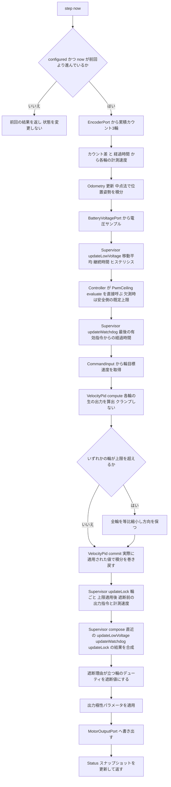
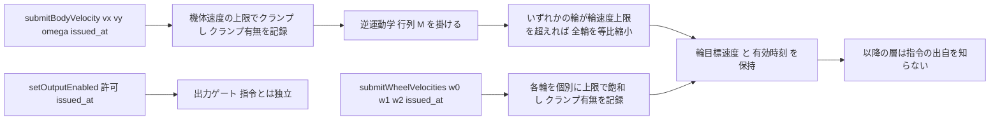
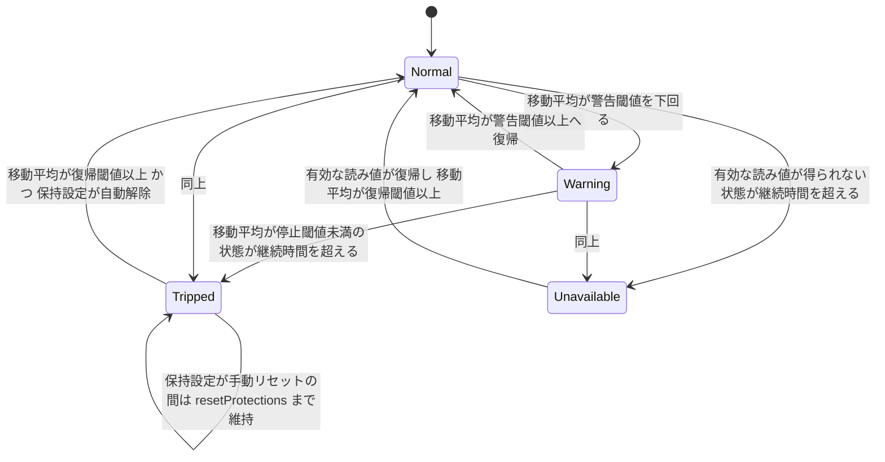
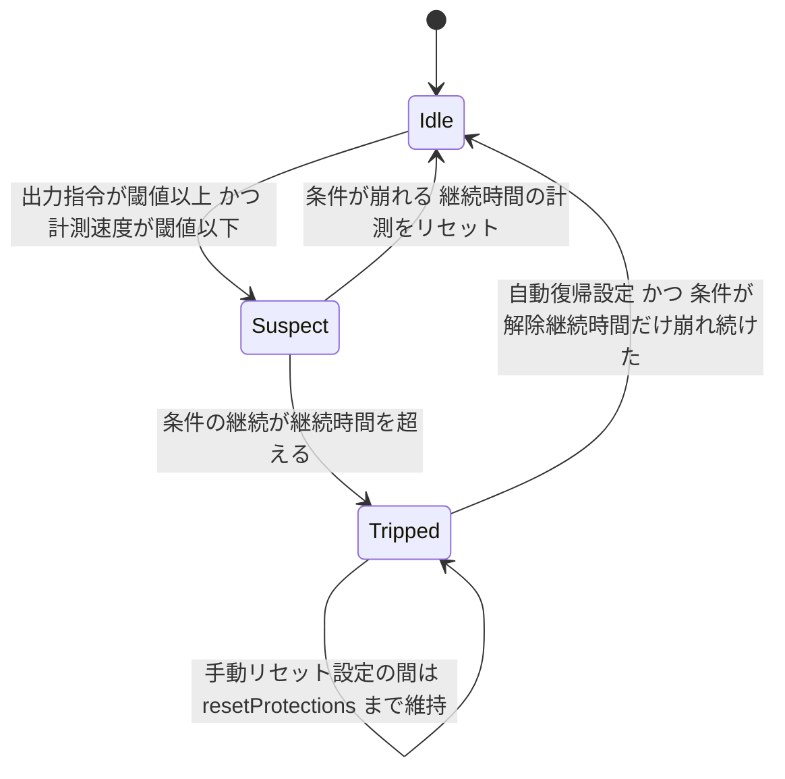

# Technical Design Document: drivetrain-core

## Overview

**Purpose**: 本 Spec は、3輪オムニ移動体の駆動中核ロジック（逆運動学・順運動学とオドメトリ・速度PID・保護①〜④・エンコーダ累積・電圧換算）を、**ESP32 実機とペリフェラルと無線を一切必要とせずホスト上で検証できる C++ ライブラリ**として確定させる。同時に、テレオペ用・本番用・ホストテスト用の3ビルド構成を持つファームウェアプロジェクトの骨組みを据える。

**Users**: 直接の利用者は下流2 Spec である。`teleop-bringup` は本 Spec が宣言した3つのポートを ESP32 ペリフェラルで実装し、パッド入力を指令入口へ写像する。`m2-motion-validation` は本 Spec が外へ出す量（機体速度・オドメトリ・実制御周期・指令反映遅れ）を計測に使い、`trajectory_sim.DrivetrainParams` へ翻訳して戻す。M3 の本番経路は**指令の入口を差し替えるだけ**で同じ下位層に乗る。

**Impact**: リポジトリに移動体側のコードが初めて生まれる。`firmware/` ツリーが新設され、`.kiro/steering/structure.md` の「Future Code Layout（案・未確定 → OQ-40）」が実態に合わせて是正される。OQ-40（ファーム側）と OQ-21 が決着し、BTstack ライセンスの扱いが新規 OQ として登録される。

### Goals

- 逆運動学・順運動学とオドメトリ・速度PID・保護①〜④・エンコーダ累積器・電圧換算の**すべてがホスト上で単体テストでき**、テスト専用のプラントモデルによって閉ループでも検証できる
- ペリフェラルとフレームワーク固有のヘッダが、**3つのポート宣言の向こう側に完全に隔離されている**。核から `Arduino.h` / `driver/*` / `freertos/*` / `esp_*` が一切参照されず、そのことが静的検査で回帰する
- 時刻が**引数として外から与えられ**、核が現在時刻を自分で取得しない
- 閾値・タイムアウト・ゲイン・寸法・分解能が**すべて外部パラメータ**であり、本 Spec は数値を持たない
- テレオペ用ビルドと本番用ビルドが排他であり、**下位層が3構成すべてで同一ソースとして共有される**
- `teleop-bringup` が着手できる状態、すなわち**実機で潰すべき問題が配線・符号・実測値だけに絞り込まれている**状態になる

### Non-Goals

- ESP32 ペリフェラルの実装コード（パルスカウンタ／PWM／ADC1）と無線・コントローラの一切 → `teleop-bringup`
- 指令生成（パッド入力 → `(vx, vy, ω)`、目標座標 → `(vx, vy, ω)`）とデッドゾーン・入力カーブ・ボタン割当 → `teleop-bringup` / M3
- 保護閾値の具体値（OQ-14 / OQ-15 / OQ-18 / OQ-22）と実機性能値（最高速度・加速度）の決定 → `m2-motion-validation`
- 目標座標への位置制御（上位ループ）、固定側 → 移動体の通信、⑤ジオフェンス、物理的な非常停止手段 → M3
- 実測値から `DrivetrainParams` への**翻訳そのもの** → `m2-motion-validation`
- FreeRTOS のタスク配置・優先度・スタックサイズ → `teleop-bringup`

---

## Boundary Commitments

> **本 Spec を分割しない理由**: 責務の継ぎ目は「純ロジック層」の1本しかなく、内部の部品は別々には動けない。特に要件 14.8 は保護①〜④のすべてを本 Spec の範囲として実装し後続へ先送りしないことを明示的に要求しており、これは `tech.md` 開発標準2（安全系はその段階に入る前に実装する）を Spec 境界の面で担保するものである。要件数が多いのは対象が広いからではなく、**M2a に入る前に書き終えていなければならないものが仕様として既に確定している**ためである。

### This Spec Owns

- **駆動中核ロジックの全体**: 逆運動学、順運動学とオドメトリ、各輪速度PID、保護①〜④の判定と状態機械、出力遮断値の決定、エンコーダのラップアラウンド累積器、ADC 生値 → バッテリ電圧の換算
- **指令の入力契約**: 機体速度指令 `(vx, vy, ω)` ＋有効時刻 / 輪ごとの目標速度 ＋有効時刻 / 出力許可。この3つが下位層への唯一の入口である
- **ポートの契約**（宣言のみ・実装を持たない）: エンコーダ読み出し / PWM・方向出力 / 電圧読み出し
- **数値表現の規約**: 距離 mm、時刻 ms、電圧 mV、角度 rad、デューティ `[-1, +1]` の `float`。累積量と時刻は固定幅整数
- **設定パラメータの型・不変条件・検証**（値は持たない）と、実効設定の外部提供
- **ファームウェアプロジェクトの骨組み**: 3ビルド構成（`teleop` / `production` / `native`）、ディレクトリ配置、排他機構、外部プラットフォーム定義の pin
- **ホストテスト一式**と、テスト専用の車輪応答モデル・偽ポート
- **文書の是正**: OQ-40（ファーム側）と OQ-21 の決着記録、OQ-42（BTstack ライセンス）の登録、`structure.md` の Code Layout 是正

### Out of Boundary

- **ポートの実装**（パルスカウンタ / LEDC / ADC1 の設定と読み書き、GPIO 割当、チャネル↔輪の対応付け）→ `teleop-bringup`
- **無線・コントローラ・通信に関する一切**。本 Spec はこれらのポートを**持たない**
- **指令の生成**。パッド入力の解釈も目標座標からの速度生成も本 Spec の外
- **デューティ 0 を coast にするか brake にするか**。本 Spec は遮断値を「デューティ 0」と定義するのみで、モータドライバの入力パターンへの対応付けはアダプタが持つ
- **1輪ロック時に機体全体を止めるかどうかの運転方針**。核は当該輪を止め、どの輪が発火したかを外へ出す。全停止させたい場合は出力許可を落とす（下記 Adjacent expectations）
- **FreeRTOS 上での実行形態と、別タスクから `status()` を読む場合の同期**。核は単一スレッド前提であり、ロックを持たない
- **保護閾値・ゲイン・寸法・分解能の具体値**。本 Spec は型と不変条件と検証だけを持つ
- **実測値から `trajectory_sim.DrivetrainParams` への翻訳**。本 Spec は単位と定義を揃えた量を外へ出すにとどまる
- **`src/trajectory_sim/` のコード変更**。意味論を揃えるだけで、コードは共有も変更もしない

### Allowed Dependencies

- **C++17 標準ライブラリのうちフリースタンディングで使える範囲のみ**: `<cstdint>` / `<cstddef>` / `<cmath>` / `<cstring>`。核では例外・RTTI・動的メモリ確保・`<iostream>` / `<string>` / `<vector>` を使わない
- **ESP-IDF は `src/`（アプリ層）と `test/embedded/` からのみ**参照してよい。`lib/drivetrain_control/` からは参照しない
- **`lib/test_support/`（テスト専用）は `lib/drivetrain_control/` に依存してよいが、逆方向は禁止**。`lib/test_support/` はファームウェア成果物へリンクされない
- **pioarduino `platform-espressif32` をリリース zip の URL で pin する**。`stable` / `#develop` / セマンティックレンジを使わない
- **`src/trajectory_sim/` へは依存しない**（言語が違い、コードを共有しない）

### Revalidation Triggers

以下が変わった場合、`teleop-bringup` / `m2-motion-validation` は結合を再確認する。

| 変化 | 再検証が要る理由 |
|---|---|
| 3つのポートのシグネチャ・返す物理量・妥当性フラグの意味 | アダプタ実装が直接壊れる |
| 指令入口の型（`BodyVelocityCommand` / `WheelVelocityCommand` / 出力許可）の形 | テレオペの入力写像と M3 の差し替え口が壊れる |
| `BlockReason` ビットの追加・意味変更・輪ごと／機体全体の別 | 発火試験の合否判定とログ解釈が変わる |
| `DrivetrainStatus` に含まれる量の単位・定義（特に `DrivetrainParams` 対応表の5量） | `m2-motion-validation` の翻訳が成立しなくなる |
| 設定構造体のフィールド追加・不変条件の変更 | `configure()` が既存設定を拒否し得る |
| 累積器の前提条件（法 M・最短経路仮定）の変更 | エンコーダ読み出しアダプタの周期設計が変わる |
| ビルド構成の増減、pin した pioarduino 版、排他マクロ名 | `teleop-bringup` のビルド設定が壊れる |
| 純ロジックのディレクトリ配置と2マニフェスト同居の方式 | ファームウェアと `native` のリンク経路が変わる |

---

## Architecture

### Existing Architecture Analysis

- リポジトリの既存コードは**固定側の Python パッケージ5本のみ**（`src/prediction_core` 他）。移動体側のコードは存在せず、本 Spec はグリーンフィールドである
- 踏襲するパターンは `prediction-core` の作り方である: **実行時依存を最小に保ち、実機なしで検証できる中核を先に切り出し、境界を静的テストで回帰させる**。`tests/prediction_core/test_boundaries.py` と `tests/trajectory_sim/test_trajectory_sim_boundaries.py` がその先例であり、本 Spec の静的境界検査は同じ場所・同じ流儀で追加する
- `src/trajectory_sim/drivetrain.py` は「等方な質点＋加速度上限」の**シミュレータ用性能モデル**であり、実機の駆動制御とは別物である。**コードを共有しない**。接点は `DrivetrainParams` の意味論のみ（後述の対応表）
- `.kiro/steering/structure.md` の Future Code Layout は「現時点でディレクトリを作らない」のまま実態と乖離している。本 Spec の最終段でこれを是正する

### Architecture Pattern & Boundary Map

**選択パターン**: Ports & Adapters（ヘキサゴナル）。境界の定義は A-2 のとおり **「ペリフェラル／フレームワーク固有のヘッダを include するか否か」** そのものであり、比喩ではなく静的検査で機械的に判定できる線として扱う。

```mermaid
graph TB
    subgraph Upstream[指令生成 本Specの外]
        Teleop[パッド入力 to vx vy omega]
        Production[目標座標 to vx vy omega]
    end

    subgraph Core[lib drivetrain_control 純ロジック 本Specが所有]
        CommandInput[CommandInput 指令の受付と保持]
        Kinematics[Kinematics 逆運動学と順運動学]
        Odometry[Odometry 位置姿勢推定]
        Pid[VelocityPid 各輪速度制御]
        Supervisor[ProtectionSupervisor 保護1と2と4の検出器保持と合成]
        Lock[MotorLockDetector]
        LowV[LowVoltageProtector]
        Ceiling[PwmCeiling]
        Watchdog[CommandWatchdog]
        Accum[WrapAccumulator]
        Scaler[VoltageScaler]
        Controller[DrivetrainController 制御ステップの合成]
    end

    subgraph PortLayer[ポート 宣言のみ]
        EncPort[EncoderPort]
        MotorPort[MotorOutputPort]
        BattPort[BatteryVoltagePort]
    end

    subgraph Adapters[アダプタ teleop-bringup が所有]
        Pcnt[パルスカウンタ実装]
        Ledc[PWM 方向出力実装]
        Adc[ADC1 実装]
    end

    Teleop --> CommandInput
    Production --> CommandInput
    CommandInput --> Kinematics
    Controller --> CommandInput
    Controller --> Kinematics
    Controller --> Odometry
    Controller --> Pid
    Controller --> Supervisor
    Controller --> Ceiling
    Supervisor --> Lock
    Supervisor --> LowV
    Supervisor --> Watchdog
    Controller --> EncPort
    Controller --> MotorPort
    Controller --> BattPort
    Pcnt -.implements.-> EncPort
    Ledc -.implements.-> MotorPort
    Adc -.implements.-> BattPort
    Pcnt --> Accum
    Adc --> Scaler
```



**Architecture Integration**:

- **責務の分離**: 「判定」は核、「実行」はアダプタ。ただし要件 14.1 が求めるとおり、**遮断されるべき状態のときに出力指令が既に遮断値になっている**ところまでを核が確定させる。アダプタは受け取った値をそのまま書き出すだけであり、判断を持たない（要件 2.5）
- **累積器と電圧換算の位置**: この2つは**アダプタが呼ぶ核の部品**である。ポートは物理量（64bit 累積カウント / mV）を返す契約なので、そこへ至る最も壊れやすい算術（折り返しの桁上げ、分圧比、非線形補正）がアダプタ側へ沈まないよう、核が提供して利用させる（A-2 / A-11）
- **`PwmCeiling` は `ProtectionSupervisor` を介さず `DrivetrainController` が直接保持し呼び出す。** `PwmCeiling` は状態を持たない純関数であり、保護①②④のような「継続時間を伴う成立／解除の状態機械」ではないため、`ProtectionSupervisor` が合成する対象に含めない。上限値は等比縮小（PID の `compute` と `commit` の間）で使うために PID より前に確定している必要があり、`Supervisor.compose()`（PID `commit` より後に呼ばれる）の出力へ含めると呼び出し順序が矛盾する（→ System Flows「制御ステップ1回のフロー」）
- **時刻はポートではない**: 状態を変える公開メソッドはすべて `TimeMs now` を引数に取る。`ClockPort` は作らない（→ `research.md` Design Decisions）
- **無線のポートを持たない**（要件 2.6）。指令は入口から「押し込まれる」ものであり、核が取りに行くものではない
- **Steering compliance**: `tech.md` 開発標準1（未実測の数値を合否条件にしない）＝ 数値パラメータに既定値を与えない。標準2（安全系はその段階に入る前に実装）＝ 保護①〜④を本 Spec で完結させる（要件 14.8）。標準3（二重実装しない）＝ シミュレータとコードを共有せず、意味論だけを揃える

### Dependency Direction

矢印の左から右へのみ依存してよい。逆方向・層飛ばしの上方向参照は実装・レビューともに違反として扱う。

```
L0 units, errors
  → L1 types
  → L2 config
  → L3 ports
  → L4 wrap_accumulator, voltage_scaler
  → L5 kinematics
  → L6 odometry, velocity_pid
  → L7 protection/{motor_lock, low_voltage, pwm_ceiling, command_watchdog}
  → L8 protection/supervisor
  → L9 command_input
  → L10 controller
  → L11 drivetrain_control.hpp（公開入口）
```

| 層 | ファイル | 依存してよい層 |
|---|---|---|
| L0 | `units.hpp`, `errors.hpp` | 標準ヘッダのみ |
| L1 | `types.hpp` | L0 |
| L2 | `config.hpp/.cpp` | L0, L1 |
| L3 | `ports.hpp` | L0, L1 |
| L4 | `wrap_accumulator.*`, `voltage_scaler.*` | L0–L2 |
| L5 | `kinematics.*` | L0–L2 |
| L6 | `odometry.*`, `velocity_pid.*` | L0–L2, L5 |
| L7 | `protection/*.（supervisor 以外）` | L0–L2 |
| L8 | `protection/supervisor.*` | L0–L2, L7 |
| L9 | `command_input.*` | L0–L2, L5 |
| L10 | `controller.*` | L0–L9 |
| L11 | `drivetrain_control.hpp` | L0–L10（再エクスポートのみ） |

**`lib/test_support/` は L11 に依存してよいが、L0〜L11 のいずれも `test_support` を参照してはならない**（要件 16.3）。

### Technology Stack

| Layer | Choice / Version | Role in Feature | Notes |
|-------|------------------|-----------------|-------|
| 言語 | **C++17**（`-std=gnu++17` を3環境すべてで明示） | 駆動中核ロジック | ホスト gcc と Xtensa gcc で同じ言語版に揃える。IDF 既定の C++ 版に流されない |
| ビルド | **PlatformIO Core 6.x** | 3構成の管理・テスト実行 | `platformio.ini` が構成の唯一の定義元 |
| 組込みフレームワーク | **ESP-IDF 5.5.x**（`framework = espidf`） | `teleop` / `production` 環境 | 両環境を espidf に揃えることでレイアウトが `main/` と `src/` に割れない |
| プラットフォーム定義 | **pioarduino `platform-espressif32` 55.03.311**（Arduino 3.3.11 / IDF 5.5.5）をリリース zip URL で pin | ツールチェーンと IDF の固定 | 公式 `platformio/platform-espressif32` は 7.0.1 で凍結。更新で内容が変わらない形にする（要件 1.7） |
| 対象 MCU | **classic ESP32**（`board = esp32dev`） | テレオペ・本番の両ファーム | BT Classic を持つのは classic のみ。S3/C3/C6/H2 への乗り換えは無いものとして設計する（要件 1.6） |
| ホストテスト | **`platform = native` ＋ Unity**（PlatformIO 同梱） | 駆動ロジックの振る舞い検証 | ESP32・ペリフェラル・無線を必要としない（要件 1.5） |
| 静的境界検査 | **pytest**（既存 `tests/` ツリー） | 境界・型・ビルド構成の回帰 | `tests/prediction_core/test_boundaries.py` と同じ役割・同じ流儀。駆動ロジックの複製ではない |
| Arduino-as-component | **本 Spec では導入しない** | — | 核は Arduino API を使わない。Bluepad32 が要求する `teleop` 環境で `teleop-bringup` が導入する |

---

## File Structure Plan

### Directory Structure

```
firmware/
├── platformio.ini                       # 3環境の唯一の定義元。プラットフォームを zip URL で pin
├── CMakeLists.txt                       # IDF ルート。EXTRA_COMPONENT_DIRS で純ロジックを直接指す
├── sdkconfig.defaults                   # 両ファーム共通
├── sdkconfig.defaults.teleop            # BT 有効（実際の有効化は teleop-bringup）
├── sdkconfig.defaults.production        # BT / Wi-Fi を無効化（要件 1.4）
├── lib/
│   ├── drivetrain_control/              # ★純ロジック。3環境すべてから同一ソースとしてリンクされる
│   │   ├── CMakeLists.txt               # espidf 経路: idf_component_register(SRCS ... INCLUDE_DIRS include)
│   │   ├── library.json                 # native 経路: PlatformIO 私有ライブラリのマニフェスト
│   │   ├── include/drivetrain_control/
│   │   │   ├── drivetrain_control.hpp   # L11 公開入口。下流はここだけを include する
│   │   │   ├── units.hpp                # L0 単位換算係数の集約。裸の 1000 / π をここ以外に書かない
│   │   │   ├── errors.hpp               # L0 ConfigError / ConfigField / ConfigDiagnostic
│   │   │   ├── types.hpp                # L1 TimeMs, 指令, 出力, Pose2D, BlockReason, Status
│   │   │   ├── config.hpp               # L2 全パラメータ構造体と validate()
│   │   │   ├── ports.hpp                # L3 3つのポート宣言（実装を持たない）
│   │   │   ├── wrap_accumulator.hpp     # L4 折り返し検出と 64bit 桁上げ
│   │   │   ├── voltage_scaler.hpp       # L4 生値 → mV（分圧比＋区分線形補正）
│   │   │   ├── kinematics.hpp           # L5 逆運動学行列とその逆行列
│   │   │   ├── odometry.hpp             # L6 中点法による位置姿勢推定
│   │   │   ├── velocity_pid.hpp         # L6 1輪分の速度PID
│   │   │   ├── protection/
│   │   │   │   ├── motor_lock.hpp       # L7 ① 輪ごと
│   │   │   │   ├── low_voltage.hpp      # L7 ② 移動平均・継続時間・ヒステリシス
│   │   │   │   ├── pwm_ceiling.hpp      # L7 ③ 上限決定（トリップ状態を持たない）
│   │   │   │   ├── command_watchdog.hpp # L7 ④ 経過時間のみで判定
│   │   │   │   └── supervisor.hpp       # L8 合成と遮断理由ビットマスク
│   │   │   ├── command_input.hpp        # L9 3入口と保持。投入時に輪目標速度へ正規化
│   │   │   └── controller.hpp           # L10 制御ステップの合成
│   │   └── src/                         # 上記ヘッダに対応する .cpp（ヘッダのみで済む部品は置かない）
│   │       ├── config.cpp
│   │       ├── wrap_accumulator.cpp
│   │       ├── voltage_scaler.cpp
│   │       ├── kinematics.cpp
│   │       ├── odometry.cpp
│   │       ├── velocity_pid.cpp
│   │       ├── protection/motor_lock.cpp
│   │       ├── protection/low_voltage.cpp
│   │       ├── protection/pwm_ceiling.cpp
│   │       ├── protection/command_watchdog.cpp
│   │       ├── protection/supervisor.cpp
│   │       ├── command_input.cpp
│   │       └── controller.cpp
│   └── test_support/                    # ★テスト専用。EXTRA_COMPONENT_DIRS に含めない = ファームへ入らない
│       ├── library.json                 # CMakeLists.txt を持たない（IDF から見えない）
│       ├── include/test_support/
│       │   ├── wheel_plant.hpp          # 1次遅れ車輪モデル＋ストール注入＋生カウント生成
│       │   ├── plant_coefficients.hpp   # 係数を1箇所へ集約。仮値である旨をここで宣言する
│       │   └── fake_ports.hpp           # 3ポートの偽実装（プラント／固定値の両モード）
│       └── src/wheel_plant.cpp
├── src/
│   ├── CMakeLists.txt                   # idf_component_register(SRCS main.cpp REQUIRES drivetrain_control)
│   ├── build_profile.hpp                # 排他マクロの検査（#error）。核には置かない
│   └── main.cpp                         # app_main の骨組み。本 Spec ではポートを結線しない
└── test/
    ├── native/                          # test_filter = native/*
    │   ├── units/                       # 単位換算とスケールの往復
    │   ├── config_validation/           # 設定検証（要件 15.4）
    │   ├── wrap_accumulator/            # 折り返し・逆転・オーバーフロー
    │   ├── voltage_scaler/              # 区分線形・単調性・範囲外
    │   ├── kinematics/                  # 逆↔順の往復・純回転・等比縮小
    │   ├── odometry/                    # 直進・旋回・円軌道の閉合・初期化
    │   ├── velocity_pid/                # 収束・ワインドアップ・遮断中の扱い・dt<=0
    │   ├── protection_lock/             # ① 継続時間・輪独立・一過性・復帰方式
    │   ├── protection_low_voltage/      # ② 移動平均・ヒステリシス・欠測
    │   ├── protection_pwm_ceiling/      # ③ 上限・方向保存・無効化・欠測時の安全側
    │   ├── protection_watchdog/         # ④ タイムアウト・復帰・出力許可との関係
    │   ├── protection_supervisor/       # 合成・優先・理由の判別・リセット
    │   ├── command_input/               # 3入口・クランプ報告・保持・未着状態
    │   ├── controller_step/             # ステップの決定性・dt<=0・遮断値
    │   └── controller_closed_loop/      # プラント接続による閉ループ検証（要件 16.2, 16.8）
    └── embedded/                        # test_filter = embedded/*
        └── build_smoke/                 # 実機ツールチェーンでリンクが通ることの最小確認

tests/
└── firmware/
    └── test_firmware_boundaries.py      # ★静的境界検査（pytest）
```

**File Structure Plan の要点**

- `lib/drivetrain_control/` に **`CMakeLists.txt` と `library.json` が同居する**のが本設計の要である。`framework = espidf` では PlatformIO の LDF が効かないため、ファーム2環境は IDF コンポーネントとして、`native` 環境は PlatformIO 私有ライブラリとして、**同一のディレクトリを2つの経路から発見する**（→ `research.md`）
- ルート `CMakeLists.txt` の `EXTRA_COMPONENT_DIRS` は **`lib/drivetrain_control` を直接指す**。`lib/` 全体を指さないことで `lib/test_support/` がファームウェアへ混入する経路が存在しなくなる（要件 16.3）
- `build_profile.hpp` は `src/`（アプリ層）に置く。**`lib/drivetrain_control/` にビルド構成の `#ifdef` を1つも置かない**ことで、要件 1.2 の「3構成すべてから同一のソース」を字義どおり満たす
- ヘッダのみで完結する部品（`units` / `errors` / `types` / `ports`）に `.cpp` を作らない。`CMakeLists.txt` の `SRCS` と `src/*.cpp` の集合が一致することを静的検査で回帰させる

### Modified Files

- `docs/open-questions.md` — OQ-21 の行を削除、OQ-40 の行を削除、**OQ-42（BTstack ライセンス）を末尾に採番して追加**（要件 18.1, 18.2, 18.4, 18.5）
- `docs/decisions.md` — **D-10**（リポジトリのディレクトリ構成、OQ-40 決着）と **D-11**（テレオペ用と本番用ファームウェアの排他方法、OQ-21 決着）を §1 末尾に追加（要件 18.1, 18.2）
- `docs/drivetrain-spec.md` — §10.1.2 の `→ OQ-21` 参照を外し、決着先（`decisions.md` D-11）へのリンクに置き換える（要件 18.3）
- `docs/drivetrain-spec.md` §11「To be verified on actual hardware」— **手元の ESP32 DevKit の型番を確認し `bom.md` #8 へ明記する**項目を追加（BT Classic 必須のため S3/C3/C6/H2 不可）（要件 18.8）
- `.kiro/steering/structure.md` — 「Future Code Layout（案・未確定 → OQ-40）」を実態に合わせた **Code Layout** へ書き換え、`firmware/` ツリーと既存 Python ツリーの配置を記述する（要件 18.6）
- `.kiro/steering/roadmap.md` — `drivetrain-core` の状態更新と、OQ-40 に言及している箇所の是正（要件 18.3）
- `pyproject.toml` — pytest の対象に `tests/firmware/` が含まれることの確認（既存設定で足りる場合は変更しない）

**⚠️ 未決事項を `open-questions.md` 以外へ複製しない**（要件 18.7、`structure.md` Documentation Rules 1）。本 Spec の文書更新は「決着した行を消す」「新規1件を末尾へ足す」「決定内容を `decisions.md` へ移す」に限る。

---

## System Flows

### 制御ステップ1回のフロー



**フローの決定事項**

- **`ProtectionSupervisor` は「検出器を呼ぶメソッド」と「結果を合成するメソッド」を分離する。** `updateLowVoltage()` / `updateWatchdog()` / `updateLock()` はそれぞれの Flow ノードの位置で `DrivetrainController` が呼び、内部の `LowVoltageProtector` / `CommandWatchdog` / `MotorLockDetector` を1回だけ進める。**`compose()` はこれら3つの直近の結果（と `configured` / `output_enabled` / `has_command`）を読むだけで、検出器を呼び直さない。** こうしないと「合成メソッドがもう一度検出器を呼ぶのか」が曖昧になり、`LowVoltageProtector` の移動平均・継続時間のような「1ステップにつき1回」を前提にした状態機械が二重に進んでしまう
- **`PwmCeiling` は `ProtectionSupervisor` に属さず、`DrivetrainController` が直接保持して呼ぶ。** 状態を持たない純関数であり、①②④のような「継続時間を伴う成立／解除」の対象ではないため、`Supervisor` の合成対象に含めない。上限は等比縮小（`Pid compute` の直後）で使うために PID より前に確定している必要があり、`Supervisor.compose()`（PID の `commit` より後に呼ばれる）の出力に含めると呼び出し順序が破綻する
- **PWM 上限は「輪ごとのクリップ」ではなく「3輪まとめての等比縮小」として適用する。** 輪ごとに個別クリップすると、1輪だけ飽和した瞬間に指令された運動の方向が崩れる。要件 12.4 が求める「すべての輪の出力指令に同一の上限を適用し、指令された運動の方向を保つ」は、**デューティのベクトルを一様にスケールする**ことでしか満たせない
- **PID は2段（`compute` → `commit`）にする。** `compute()` は上限でクランプしない生の出力を返し、等比縮小の後に `commit(実際に適用された値)` を呼ぶ。**縮小によって実現されなかった分を積分項へ溜め込まない**（要件 9.4）。1段の PID に飽和値を渡す形では、群としての縮小と個々のアンチワインドアップが噛み合わない
- **ロックの判定は上限適用の後・遮断の前の出力指令に対して行う**。遮断後の値で判定すると、いったん遮断された瞬間に「出力が低い」となって条件が崩れ、ロック状態が自己解除してしまう。逆に上限適用の前の生の出力で判定すると、上限が下がっている状況で実際には出ていない大きな指令を根拠に発火してしまう
- **等比縮小は2箇所で起きるが、対象が違う**。指令投入時（`CommandInput`）は**輪目標速度**に対して `max_wheel_speed_mm_s` で（要件 6.5）、制御ステップでは**デューティ**に対して PWM 上限で（要件 12.4）。どちらも `scaleToLimit()` という同じ関数を使う
- **極性の適用は最後の1箇所のみ**。要件 6.6（輪番号と符号の対応を1箇所で定義）を出力側で担保する
- `now` が前回以前のとき（要件 3.4）は**ポートも読まず、状態も更新せず、前回の結果を返す**。副作用のない短絡にすることで「内部状態を破壊しない」を字義どおり満たす

### 指令の受付から輪目標速度まで



**この分岐が要件 5.2 に反しない理由**: ここで分かれているのは**指令の形**（機体速度か輪速度か）であり、**指令元**（テレオペか本番経路か）ではない。どちらの形も同じ `WheelTargets` に落ちるため、保護①〜④とPIDより下は指令の出自も形も一切知らない。要件 5.9（輪単体指令にも保護を同一に適用）が実装の注意深さではなく構造で成立する。

**輪単体指令に等比縮小を掛けない理由**: 1輪だけ回す用途（M2a-0 の輪単体テスト）には保存すべき「運動の方向」が存在しない。各輪を個別に飽和させ、飽和したことを `status()` で報告する。

### 保護② LiPo 低電圧の状態遷移



- **欠測サンプルは移動平均へ取り込まない**（要件 11.8）。取り込むと欠測が「電圧低下」に見えて、原因の異なる2つの事象が同じ症状になる
- 復帰閾値 > 停止閾値 は設定検証で強制する（要件 11.4）。ヒステリシスが逆転した設定を受け付けない

### 保護① モータロックの状態遷移（輪ごと・3個独立）



要件 10.4（継続時間に満たない一時的な速度低下では停止しない）は、`Suspect` の滞在時間が閾値を超えるまで `Tripped` へ遷移しないことで満たす。復帰条件の自動／手動は設定（OQ-15 の決着先）で選ぶ（要件 10.5）。

---

## Requirements Traceability

| Requirement | Summary | Components | Interfaces | Flows |
|-------------|---------|------------|------------|-------|
| 1.1, 1.2 | 3ビルド構成と純ロジックの共有 | BuildSkeleton, DrivetrainControlLibrary | `platformio.ini`, `CMakeLists.txt`, `library.json` | — |
| 1.3, 1.4 | テレオペと本番の排他・本番に無線を含めない | BuildSkeleton | `build_profile.hpp`, `sdkconfig.defaults.*` | — |
| 1.5 | ホストテストが実機を要さない | BuildSkeleton, NativeTestSuite | `[env:native]` | — |
| 1.6, 1.7 | classic ESP32 固定・プラットフォーム定義の pin | BuildSkeleton, FirmwareBoundaryCheck | `platformio.ini`, `test_firmware_boundaries.py` | — |
| 2.1, 2.3, 2.5, 2.6 | ポート宣言と契約の粒度 | Ports | `EncoderPort`, `MotorOutputPort`, `BatteryVoltagePort` | 制御ステップ |
| 2.2, 2.4 | 固有ヘッダを核から参照しない・混入をテストで検出 | FirmwareBoundaryCheck | `test_firmware_boundaries.py` | — |
| 3.1, 3.2, 3.5, 3.6 | 時刻の注入と外部駆動 | DrivetrainController, CommandInput | `step(TimeMs)`, `submit*(…, TimeMs)` | 制御ステップ |
| 3.3 | 同一入力・同一時刻列で同一出力 | DrivetrainController | `StepResult` | 制御ステップ |
| 3.4 | 過去時刻は経過時間ゼロ・状態を壊さない | DrivetrainController | `step(TimeMs)` | 制御ステップ（短絡） |
| 4.1, 4.2, 4.4, 4.5 | 固定幅整数・mm/ms・累積量の幅と限界 | Units, Types, WrapAccumulator, VelocityPid | `units.hpp`, `types.hpp` | — |
| 4.3 | 単位換算係数の集約 | Units | `units.hpp` | — |
| 4.6 | 処理系依存の型の混入をテストで検出 | FirmwareBoundaryCheck | `test_firmware_boundaries.py` | — |
| 5.1, 5.3 | 指令の型と指令元固有情報の排除 | Types, CommandInput | `BodyVelocityCommand` | 指令受付 |
| 5.2, 5.9 | 指令元で分岐しない・輪単体でも保護同一 | CommandInput | `WheelTargets` への正規化 | 指令受付 |
| 5.4 | 範囲外指令のクランプと報告 | CommandInput | `CommandAcceptance` | 指令受付 |
| 5.5 | 直前の有効指令と時刻の保持 | CommandInput | `CommandInput::latched()` | 指令受付 |
| 5.6, 5.7 | 指令受領は出力許可ではない・独立した許可入口 | CommandInput, ProtectionSupervisor | `setOutputEnabled` | 制御ステップ |
| 5.8 | 輪ごとの直接指令入口 | CommandInput | `WheelVelocityCommand` | 指令受付 |
| 6.1, 6.2, 6.6 | 逆運動学・寸法パラメータ・符号の一元化 | Kinematics, GeometryParams | `Kinematics::inverse` | — |
| 6.3, 6.4 | 純並進の往復一致・純回転で3輪同一 | Kinematics | `Kinematics::forward` | — |
| 6.5 | 出力範囲超過時の等比縮小 | CommandInput, DrivetrainController | `scaleToLimit` | 制御ステップ／指令受付 |
| 6.7 | 上位の位置制御を持たない | （非機能。Boundary Commitments に明記） | — | — |
| 7.1, 7.3, 7.4 | 折り返し検出と桁上げ・逆転を跨ぐ累積 | WrapAccumulator | `WrapAccumulator::update` | — |
| 7.2 | ホストでテストできる形 | WrapAccumulator, NativeTestSuite | — | — |
| 7.5 | ポート契約は折り返しを含まない累積カウント | Ports | `EncoderPort::read` | 制御ステップ |
| 7.6, 7.7 | 分解能とホイール径のパラメータ化・換算の集約 | EncoderParams, Units | `countsToMillimetres` | 制御ステップ |
| 8.1, 8.2, 8.5 | 順運動学と積分・mm/ms での提供 | Odometry, Kinematics | `Odometry::update` | 制御ステップ |
| 8.3 | 原点と姿勢の初期化 | Odometry, DrivetrainController | `resetOdometry` | — |
| 8.4 | 逆→順の復元一致 | Kinematics | `forward(inverse(v)) == v` | — |
| 8.6 | ドリフト見積もり用の経過時間と累積走行距離 | Odometry | `OdometryState` | 制御ステップ |
| 8.7 | 外部座標系への整合を責務に含めない | （非機能。Boundary Commitments に明記） | — | — |
| 9.1, 9.2, 9.3 | 偏差に基づく出力・ゲインのパラメータ化・時刻の外部注入 | VelocityPid, PidParams | `VelocityPid::update` | 制御ステップ |
| 9.4, 9.6 | ワインドアップ対策と積分項の型・限界 | VelocityPid | `PidParams::integral_limit` | 制御ステップ |
| 9.5 | 遮断中の内部状態の扱い | VelocityPid, ProtectionSupervisor | `VelocityPid::holdReset` | 制御ステップ |
| 9.7 | プラント接続による収束検証 | WheelPlant, NativeTestSuite | `controller_closed_loop` | — |
| 10.1, 10.2, 10.3, 10.4 | ロック判定・パラメータ・輪独立・一過性の除外 | MotorLockDetector, LockParams | `MotorLockDetector::update` | ① 状態遷移 |
| 10.5, 10.6 | 復帰方式の選択・発火の外部提供 | MotorLockDetector, ProtectionSupervisor | `BlockReason::MotorLock` | ① 状態遷移 |
| 10.7 | ハードウェアヒューズを前提にしない | （設計方針。Overview / Non-Goals に明記） | — | — |
| 11.1, 11.2, 11.3, 11.5 | 警告・停止・移動平均・一時降下の除外 | LowVoltageProtector | `LowVoltageProtector::update` | ② 状態遷移 |
| 11.4, 11.6 | ヒステリシスと全パラメータの外部化 | LowVoltageParams, DrivetrainConfig | `validate()` | ② 状態遷移 |
| 11.7 | 生値 → 電圧の換算を純ロジックで提供 | VoltageScaler, VoltageScalerParams | `VoltageScaler::toMilliVolts` | — |
| 11.8 | 欠測の扱いと継続時の停止 | LowVoltageProtector | `VoltageSample::valid` | ② 状態遷移 |
| 12.1, 12.2, 12.3 | 電圧に応じた上限・基準電圧・最大出力の制限 | PwmCeiling, PwmCeilingParams | `PwmCeiling::evaluate` | 制御ステップ |
| 12.4 | 全輪へ同一上限・方向の保存 | PwmCeiling, DrivetrainController | `scaleToLimit` | 制御ステップ |
| 12.5 | 算出式の差し替えと無効化 | PwmCeiling | `PwmCeilingParams::override_fn` | 制御ステップ |
| 12.6 | 欠測時に安全側の既定上限 | PwmCeiling | `PwmCeilingParams::fallback_duty` | 制御ステップ |
| 13.1, 13.3, 13.4 | タイムアウト判定・パラメータ・ステップ側での判定 | CommandWatchdog, WatchdogParams | `CommandWatchdog::update` | 制御ステップ |
| 13.2, 13.7 | 経過時間のみを見る・指令元の差し替えに耐える | CommandWatchdog | `CommandWatchdog::update` | 制御ステップ |
| 13.5, 13.6 | 直前指令を継続しない・復帰は出力許可を要する | CommandWatchdog, ProtectionSupervisor | `BlockReason::CommandTimeout` | 制御ステップ |
| 13.8 | 物理的な非常停止の代替ではない | （設計方針。Overview / Boundary Commitments に明記） | — | — |
| 14.1, 14.2, 14.3 | 遮断値・遮断実行の非所有・複数成立時の扱い | ProtectionSupervisor, DrivetrainController | `applyGate` | 制御ステップ |
| 14.4 | 成立中の保護種別の外部提供 | ProtectionSupervisor, Types | `BlockReason` ビットマスク | 制御ステップ |
| 14.5, 14.6 | 保持／自動解除の設定・解除操作 | ProtectionSupervisor | `resetProtections` | ①② 状態遷移 |
| 14.7 | ホストでテストできる形 | ProtectionSupervisor, NativeTestSuite | — | — |
| 14.8 | ①〜④すべてを本 Spec で実装 | 保護4部品すべて | — | — |
| 14.9, 14.10 | 出力未許可・指令未着時の遮断 | ProtectionSupervisor, CommandInput | `BlockReason::OutputDisabled` / `NoCommandYet` | 制御ステップ |
| 15.1, 15.2, 15.6 | 全パラメータの外部化・性能値の非保持・埋め込み禁止 | DrivetrainConfig, Units | `config.hpp` | — |
| 15.3 | 既定値が必須性能でも達成済み性能でもない旨の明示 | DrivetrainConfig | `config.hpp` の宣言 | — |
| 15.4 | 不正パラメータを制御開始前に拒否 | DrivetrainConfig, DrivetrainController | `configure()` → `ConfigDiagnostic` | — |
| 15.5 | 実効パラメータの実行開始時確認 | DrivetrainController | `effectiveConfig()` | — |
| 16.1, 16.5, 16.8 | 全要素のホスト検証・再現性・保護の発火再現 | NativeTestSuite | `test/native/**` | — |
| 16.2, 16.3, 16.4 | プラントモデルの配備・本体からの分離・仮値の明示 | WheelPlant, PlantCoefficients, FirmwareBoundaryCheck | `lib/test_support/` | — |
| 16.6 | ホスト結果を実機性能の主張にしない旨の明示 | PlantCoefficients, NativeTestSuite | テスト出力の宣言 | — |
| 16.7 | ホストテストと実機テストの区別 | BuildSkeleton | `test_filter` | — |
| 17.1 | 5量を既存モデルと同一の単位・定義で扱う | Types, MotionLimits, DrivetrainStatus, DrivetrainController | `DrivetrainParams` 対応表、`command_apply_latency_ms` の算出式 | 制御ステップ |
| 17.2, 17.3, 17.4 | 翻訳を持たない・シミュレータを変更しない・共有しない | （Boundary Commitments に明記） | — | — |
| 17.5 | 実装を伴わない契約の提供 | Ports, PublicApi | `drivetrain_control.hpp` | — |
| 17.6 | 指令元の差し替えのみで本番経路へ | CommandInput | `submitBodyVelocity` | 指令受付 |
| 17.7 | 制御ステップをブロックしない状態読み出し | DrivetrainController | `status() const` | — |
| 18.1, 18.2, 18.3 | OQ-40 / OQ-21 の決着と本文参照の除去 | DocumentationUpdate | `decisions.md`, `open-questions.md` | — |
| 18.4, 18.5 | 新規 OQ の末尾採番と決め方の記載 | DocumentationUpdate | OQ-42 | — |
| 18.6 | steering の実態への是正 | DocumentationUpdate | `structure.md` | — |
| 18.7 | 未決事項を他所へ複製しない | DocumentationUpdate | — | — |
| 18.8 | MCU 型番が部品表で未指定である点を残す | DocumentationUpdate | `drivetrain-spec.md` §11 | — |

---

## Components and Interfaces

| Component | Domain/Layer | Intent | Req Coverage | Key Dependencies (P0/P1) | Contracts |
|-----------|--------------|--------|--------------|--------------------------|-----------|
| BuildSkeleton | Build | 3構成・排他・pin・テスト振り分け | 1, 16.7 | pioarduino platform (P0), PlatformIO Core (P0) | State |
| Units | L0 | 単位換算係数の唯一の定義元 | 4 | — | Service |
| Errors | L0 | 設定エラーの型 | 15.4 | — | Service |
| Types | L1 | 指令・出力・状態・遮断理由の型 | 4, 5, 14.4, 17.1 | Units (P0) | Service |
| DrivetrainConfig | L2 | 全パラメータと不変条件 | 15 | Types (P0) | Service, State |
| Ports | L3 | 3ポートの宣言 | 2, 7.5 | Types (P0) | Service |
| WrapAccumulator | L4 | 折り返し検出と 64bit 桁上げ | 7 | Types (P0) | Service, State |
| VoltageScaler | L4 | 生値 → mV の換算 | 11.7 | Config (P0) | Service |
| Kinematics | L5 | 逆運動学行列とその逆行列 | 6, 8.1, 8.4 | Config (P0) | Service |
| Odometry | L6 | 位置姿勢の推定 | 8 | Kinematics (P0) | Service, State |
| VelocityPid | L6 | 1輪分の速度制御 | 9 | Config (P0) | Service, State |
| MotorLockDetector | L7 | 保護① 輪ごと | 10 | Config (P0) | Service, State |
| LowVoltageProtector | L7 | 保護② | 11 | Config (P0) | Service, State |
| PwmCeiling | L7 | 保護③ 上限決定 | 12 | Config (P0) | Service |
| CommandWatchdog | L7 | 保護④ | 13 | Config (P0) | Service, State |
| ProtectionSupervisor | L8 | 保護①②④の検出器を保持し遮断理由を合成 | 14 | MotorLockDetector×3, LowVoltageProtector, CommandWatchdog (P0) | Service, State |
| CommandInput | L9 | 3つの指令入口と保持 | 5, 17.6 | Kinematics (P0) | Service, State |
| DrivetrainController | L10 | 制御ステップの合成 | 3, 6.5, 12.4, 15.4, 15.5, 17.7 | L0–L9 (P0), Ports (P0) | Service, State |
| PublicApi | L11 | 下流が参照する唯一の入口 | 17.5 | L0–L10 (P0) | Service |
| WheelPlant / FakePorts | Test | 閉ループ検証用の車輪応答モデルと偽ポート | 16.2, 16.3, 16.4 | PublicApi (P1) | Service |
| NativeTestSuite | Test | ホスト上での振る舞い検証一式（`firmware/test/native/`） | 7.2, 9.7, 14.7, 16.1, 16.5, 16.6, 16.8 | WheelPlant (P0), PublicApi (P0) | Batch |
| FirmwareBoundaryCheck | Test | 境界・型・ビルド構成の静的回帰 | 1.3, 1.4, 1.6, 1.7, 2.2, 2.4, 4.6, 16.3 | pytest (P0) | Batch |
| DocumentationUpdate | Docs | OQ の決着と steering 是正 | 18 | — | Batch |

---

### Build / Infrastructure

#### BuildSkeleton

| Field | Detail |
|-------|--------|
| Intent | 3つのビルド構成と、純ロジックを3構成すべてへリンクする経路を確定させる |
| Requirements | 1.1, 1.2, 1.3, 1.4, 1.5, 1.6, 1.7, 16.7 |

**Responsibilities & Constraints**

- `platformio.ini` が**ビルド構成の唯一の定義元**である。同じ事実を `CMakeLists.txt` 側にも書かない
- `[env:teleop]` / `[env:production]`: `platform` は pioarduino のリリース zip URL、`board = esp32dev`、`framework = espidf`、`lib_ldf_mode = off`、`build_flags` に `-std=gnu++17` と排他マクロ
- `[env:native]`: `platform = native`、`build_flags = -std=gnu++17`、`test_filter = native/*`
- ファーム2環境は `test_filter = embedded/*`
- ルート `CMakeLists.txt` は `EXTRA_COMPONENT_DIRS` に **`lib/drivetrain_control` を直接**指定する

**Contracts**: Service [ ] / API [ ] / Event [ ] / Batch [ ] / State [x]

##### State Management

| 事項 | 決定 |
|---|---|
| 排他の実現（要件 1.3、OQ-21 の決着） | `[env:teleop]` は `-DDRIVETRAIN_BUILD_TELEOP`、`[env:production]` は `-DDRIVETRAIN_BUILD_PRODUCTION` を定義する。`src/build_profile.hpp` が **両方定義／どちらも未定義のときに `#error`** を出す。1つのバイナリに両者が同居することがコンパイル時に不可能になる |
| 本番へ無線を入れない（要件 1.4） | `sdkconfig.defaults.production` が `CONFIG_BT_ENABLED=n` / `CONFIG_ESP_WIFI_ENABLED=n` を置く。`[env:production]` は無線関連の `lib_deps` を1つも持たない。`build_src_filter` が `src/teleop/` を除外する |
| MCU の固定（要件 1.6） | 両ファーム環境が `board = esp32dev` を持ち、他系統の環境を定義しない |
| プラットフォームの pin（要件 1.7） | `platform = https://github.com/pioarduino/platform-espressif32/releases/download/55.03.311/platform-espressif32.zip` |
| ホストと実機のテスト振り分け（要件 16.7） | `test/native/` と `test/embedded/` にディレクトリを分け、`test_filter` で環境ごとに振り分ける |

**Implementation Notes**

- Integration: 純ロジックの `CMakeLists.txt` は `idf_component_register(SRCS <src/*.cpp を列挙> INCLUDE_DIRS "include")`。`library.json` は `{"name": "drivetrain_control", "version": "0.1.0", "build": {"srcDir": "src"}, "includeDir": "include"}` 相当
- Validation: 本コンポーネントの完了条件は**3環境すべてがビルド／テストを完走すること**。`native` が緑でファームがリンクできない状態を「できた」と扱わない
- Risks: `CMakeLists.txt` の `SRCS` 更新漏れで `native` だけ通る（→ FirmwareBoundaryCheck が集合一致を回帰）。2マニフェスト同居が通らない場合の退避は `research.md` R1

---

### L0-L2 基盤層

#### Units

| Field | Detail |
|-------|--------|
| Intent | 単位換算係数を1箇所に集約し、裸の定数が計算式へ現れないようにする |
| Requirements | 4.2, 4.3, 7.7, 15.6 |

##### Service Interface

```cpp
namespace drivetrain_control::units {

// 換算係数（これ以外の場所に 1000 / π / 60 を書かない）
inline constexpr float kMillisecondsPerSecond = 1000.0f;
inline constexpr float kMilliVoltsPerVolt     = 1000.0f;
inline constexpr float kPi                    = 3.14159265358979323846f;
inline constexpr float kTwoPi                 = 2.0f * kPi;

// 時刻（ms）→ 秒。dt <= 0 の判定は呼び出し側が済ませている前提
constexpr float millisToSeconds(std::int32_t ms) noexcept;

// エンコーダ累積カウント差 → 距離（mm）
//   counts_per_wheel_rev: 出力軸1回転あたりのカウント数（実測校正値。要件 7.6）
//   wheel_diameter_mm:    ホイール直径（mm。要件 7.7）
constexpr float countsToMillimetres(std::int64_t delta_counts,
                                    std::int32_t counts_per_wheel_rev,
                                    float wheel_diameter_mm) noexcept;

// 角度を (-π, +π] へ正規化
float wrapAngle(float radians) noexcept;

}  // namespace drivetrain_control::units
```

- Preconditions: `counts_per_wheel_rev > 0`、`wheel_diameter_mm > 0`（設定検証で保証済み）
- Postconditions: `countsToMillimetres` は `delta_counts` に比例し、符号を保つ
- Invariants: **カウント → 距離の換算はこの関数だけが行う**（要件 7.7）

#### Errors

| Field | Detail |
|-------|--------|
| Intent | 設定検証の失敗を、例外なしで違反箇所まで含めて返す |
| Requirements | 15.4 |

##### Service Interface

```cpp
namespace drivetrain_control {

enum class ConfigError : std::uint16_t {
  kNone = 0,
  kNotFinite,            // NaN / inf
  kNotPositive,          // <= 0 が許されない箇所
  kOutOfRange,           // 定義域外（デューティが 1 を超える等）
  kOrderingViolated,     // 復帰閾値 <= 停止閾値 等の順序違反
  kDegenerateGeometry,   // 逆運動学行列が特異に近い
  kTableNotMonotonic,    // 電圧校正テーブルが単調でない
  kTableTooShort,        // 校正点が 2 点未満
  kTableTooLong,         // 校正点が上限を超える
  kWindowTooLarge,       // 移動平均窓が上限を超える
};

enum class ConfigField : std::uint16_t {
  kNone = 0,
  /* 以降、各パラメータへ 1:1 で対応する列挙子を並べる */
};

struct ConfigDiagnostic {
  ConfigError code  = ConfigError::kNone;
  ConfigField field = ConfigField::kNone;
  std::uint8_t index = 0;   // 輪ごとパラメータのときの輪番号、テーブルのときの要素位置
  constexpr bool ok() const noexcept { return code == ConfigError::kNone; }
};

}  // namespace drivetrain_control
```

- Invariants: 核は例外を投げない。IDF の既定設定（例外無効）で動くこと

#### Types

| Field | Detail |
|-------|--------|
| Intent | 指令・出力・状態・遮断理由の型を、指令元と処理系に依存しない形で定義する |
| Requirements | 4.1, 4.2, 4.4, 5.1, 5.3, 14.4, 17.1 |

##### Service Interface

```cpp
namespace drivetrain_control {

inline constexpr std::uint8_t kWheelCount = 3;

// 動的確保を避けるための容量上限。性能値でも閾値でもない（要件 15.3）
inline constexpr std::uint8_t kMaxVoltagePoints = 16;   // 電圧校正テーブルの点数上限
inline constexpr std::uint8_t kMaxVoltageWindow = 32;   // 移動平均の窓の上限

// 単調増加ミリ秒。int64 にすることで 32bit millis() の折り返しを
// 経過時間計算の考慮対象から外す（要件 3.1, 4.1, 4.4）
using TimeMs     = std::int64_t;
using DurationMs = std::int32_t;

struct BodyVelocityCommand {          // 要件 5.1
  float  vx_mm_s     = 0.0f;          // 機体前方が +x
  float  vy_mm_s     = 0.0f;          // 機体左方が +y
  float  omega_rad_s = 0.0f;          // 反時計回りが +
  TimeMs issued_at_ms = 0;            // その指令が有効になった時刻
};

struct WheelVelocityCommand {         // 要件 5.8
  float  wheel_mm_s[kWheelCount] = {0.0f, 0.0f, 0.0f};   // 各輪の周速
  TimeMs issued_at_ms = 0;
};

struct CommandAcceptance {            // 要件 5.4
  bool accepted = false;              // 未設定・過去時刻なら false
  bool clamped  = false;              // 有効範囲へ制限されたか
};

struct WheelOutputs {                 // MotorOutputPort へ渡す値
  float duty[kWheelCount] = {0.0f, 0.0f, 0.0f};   // [-1, +1]。0 が遮断値
};

struct VoltageSample {                // 要件 11.8
  bool         valid = false;
  std::int32_t milli_volts = 0;
};

struct EncoderCounts {                // 要件 7.5。折り返しを含まない累積値
  std::int64_t count[kWheelCount] = {0, 0, 0};
};

struct Pose2D {
  float x_mm = 0.0f;
  float y_mm = 0.0f;
  float theta_rad = 0.0f;             // (-π, +π]
};

struct BodyVelocity {
  float vx_mm_s = 0.0f;
  float vy_mm_s = 0.0f;
  float omega_rad_s = 0.0f;
};

// 遮断理由。輪ごとに立つのは kMotorLock のみ（→ Out of Boundary）
enum class BlockReason : std::uint16_t {
  kNone               = 0,
  kNotConfigured      = 1u << 0,   // 要件 15.4
  kOutputDisabled     = 1u << 1,   // 要件 14.9
  kNoCommandYet       = 1u << 2,   // 要件 14.10
  kCommandTimeout     = 1u << 3,   // 保護④
  kLowVoltage         = 1u << 4,   // 保護②
  kVoltageUnavailable = 1u << 5,   // 要件 11.8
  kMotorLock          = 1u << 6,   // 保護①（輪ごと）
};
using BlockMask = std::uint16_t;

struct StepResult {
  WheelOutputs outputs{};
  BlockMask    global_reasons = 0;
  BlockMask    wheel_reasons[kWheelCount] = {0, 0, 0};
  bool         outputs_written = false;
};

}  // namespace drivetrain_control
```

- Invariants: この名前空間に処理系依存幅の型（`int` / `long` / `size_t` / `double`）を持つメンバを置かない。**`float` は binary32 としてホストと ESP32 で同一表現である**という前提に立つ（→ `research.md`）

#### DrivetrainConfig

| Field | Detail |
|-------|--------|
| Intent | 全パラメータを型と不変条件として定義し、値を持たない |
| Requirements | 15.1, 15.2, 15.3, 15.4, 15.6, 6.2, 7.6, 7.7, 9.2, 10.2, 11.6, 12.2, 13.3 |

**Responsibilities & Constraints**

- **数値パラメータに既定値を与えない**。既定値を持つのは**振る舞いを選ぶ真偽値・列挙のみ**（`enabled`、`latching`、復帰方式）であり、これらは性能値ではない（要件 15.3）
- **実機の性能値（最高速度・加速度）を核が持たない**（要件 15.2）。`max_body_speed_mm_s` は「外から与えられる指令クランプの上限」であって、達成済み性能でも必須性能でもない
- 検証は `validate()` が単独で行い、`DrivetrainController::configure()` がこれを通してから内部状態を構築する

##### Service Interface

```cpp
namespace drivetrain_control {

struct GeometryParams {               // 要件 6.2, 6.6
  float wheel_angle_rad[kWheelCount]; // 機体 +x から反時計回りに測った各輪の取付角
  float base_radius_mm;               // 機体中心から各輪までの距離
  // 120° 等配置を安全に組み立てる補助。sin / cos の手書きを設計上禁止する（要件 15.6）
  static GeometryParams equilateral(float base_radius_mm, float first_wheel_angle_rad) noexcept;
};

struct EncoderParams {                // 要件 7.6, 7.7
  std::int32_t counts_per_wheel_rev;  // 出力軸1回転あたり。M2a-0 の実測校正値
  float        wheel_diameter_mm;
  std::int32_t raw_modulus;           // ハードウェアカウンタの法（例: 65536）
  std::int8_t  polarity[kWheelCount]; // +1 / -1。A/B 逆結線の吸収（要件 6.6）
};

struct OutputParams {
  std::int8_t polarity[kWheelCount];  // +1 / -1。モータ極性逆結線の吸収（要件 6.6）
  float       absolute_max_duty;      // <= 1.0（要件 12.3）
};

struct MotionLimits {                 // 要件 5.4, 6.5, 17.1
  float max_body_speed_mm_s;          // trajectory_sim.DrivetrainParams.max_speed_mm_s と同一定義
  float max_body_omega_rad_s;
  float max_wheel_speed_mm_s;
};

struct PidParams {                    // 要件 9.2, 9.4, 9.6
  float kp, ki, kd;
  float integral_limit;               // 積分項の絶対値上限。有限であることを検証で強制する
};

struct LockParams {                   // 要件 10.2, 10.5
  float       duty_threshold;         // これ以上の出力指令で
  float       speed_threshold_mm_s;   // これ以下の計測速度が
  DurationMs  duration_ms;            // この時間続いたら発火（→ OQ-15 の運用は latching で選ぶ）
  DurationMs  clear_duration_ms;      // 自動復帰時、条件解除がこの時間続けば復帰
  bool        latching = true;        // true: 手動リセット / false: 自動復帰
};

struct LowVoltageParams {             // 要件 11.6
  std::int32_t warn_milli_volts;
  std::int32_t stop_milli_volts;
  std::int32_t recover_milli_volts;   // > stop_milli_volts を検証で強制（要件 11.4）
  std::uint8_t average_window;        // 移動平均のサンプル数。1..kMaxVoltageWindow
  DurationMs   stop_duration_ms;
  DurationMs   unavailable_duration_ms;  // 要件 11.8
  bool         latching = true;
};

struct VoltageScalerParams {          // 要件 11.7
  struct Point { std::int32_t raw; std::int32_t milli_volts; };
  Point        table[kMaxVoltagePoints];
  std::uint8_t point_count;           // 2 以上。2 点なら分圧比のみの線形換算に縮退する
};

struct PwmCeilingParams {             // 要件 12.2, 12.5, 12.6
  bool         enabled = true;
  std::int32_t reference_milli_volts; // 上限算出の基準電圧
  float        fallback_duty;         // 読み値が得られないときの安全側既定上限（要件 12.6）
  // 差し替え用。nullptr なら組み込みの式を使う（要件 12.5）
  float (*override_fn)(std::int32_t measured_milli_volts, const PwmCeilingParams&) = nullptr;
};

struct WatchdogParams {               // 要件 13.3
  DurationMs timeout_ms;
};

struct DrivetrainConfig {
  GeometryParams      geometry;
  EncoderParams       encoder;
  OutputParams        output;
  MotionLimits        limits;
  PidParams           pid[kWheelCount];
  LockParams          lock;
  LowVoltageParams    low_voltage;
  VoltageScalerParams voltage_scaler;
  PwmCeilingParams    pwm_ceiling;
  WatchdogParams      watchdog;
};

ConfigDiagnostic validate(const DrivetrainConfig& config) noexcept;   // 要件 15.4

}  // namespace drivetrain_control
```

- Preconditions: なし（あらゆる値を受け取り、判定する）
- Postconditions: `ok()` が真のとき、以降のすべての部品は不変条件を再検証しない
- Invariants: **⚠️ 本 Spec は数値を持たない。** 上記のどのフィールドにも「目安値」を書かない。既定値を持つ真偽値・列挙は振る舞いの選択であり、性能でも閾値でもない（要件 15.3）

**Implementation Notes**

- Validation: 有限性・正値性・定義域（デューティは `[0, 1]`）・順序（`recover > stop`、`warn >= stop`）・幾何の非退化（`|det(M)| > ε`）・テーブルの単調性と点数・移動平均窓の上限・`polarity` が `±1` であること・`integral_limit` が有限であること
- Risks: 構造体をゼロ初期化して `configure()` へ渡すと、`counts_per_wheel_rev = 0` などが `kNotPositive` で弾かれる。**ゼロ初期化された設定が拒否されることをテストで固定**し、「未設定のまま動いてしまう」経路を塞ぐ

---

### L3 ポート層

#### Ports

| Field | Detail |
|-------|--------|
| Intent | ペリフェラルとの境界を、物理量だけを往復する3つの抽象として宣言する |
| Requirements | 2.1, 2.3, 2.5, 2.6, 7.5, 17.5 |

**Responsibilities & Constraints**

- **宣言のみを持ち、実装を持たない**（要件 2.1）。実装は `teleop-bringup` が所有する
- **ペリフェラル固有の型・分解能・イベント形式を露出させない**（要件 2.3）。返すのは 64bit 累積カウント・正規化デューティ・mV であって、PCNT ユニット番号でも LEDC 分解能でも ADC 生値でもない
- **判断・計算を伴う処理をポートの実装側へ委ねない**（要件 2.5）。折り返しの桁上げは `WrapAccumulator`、分圧比と非線形補正は `VoltageScaler` が核として提供し、アダプタはこれらを**利用する**
- **無線・コントローラ・通信のポートを持たない**（要件 2.6）

##### Service Interface

```cpp
namespace drivetrain_control {

class EncoderPort {
 public:
  virtual ~EncoderPort() = default;
  // 折り返しを含まない累積カウントを返す（要件 7.5）。
  // 実装は WrapAccumulator を用いてハードウェアカウンタの桁上げを累積すること。
  virtual EncoderCounts read() = 0;
};

class MotorOutputPort {
 public:
  virtual ~MotorOutputPort() = default;
  // 受け取った値をそのまま書き出す。判断を持たない（要件 2.5, 14.2）。
  // duty[i] == 0.0f が遮断値。0 を coast にするか brake にするかはアダプタの責務。
  virtual void write(const WheelOutputs& outputs) = 0;
};

class BatteryVoltagePort {
 public:
  virtual ~BatteryVoltagePort() = default;
  // バッテリ電圧（mV）。読み値が得られない場合は valid == false を返す（要件 11.8）。
  // 実装は VoltageScaler を用いて生値から換算すること。
  virtual VoltageSample read() = 0;
};

struct Ports {
  EncoderPort*        encoder = nullptr;
  MotorOutputPort*    motor   = nullptr;
  BatteryVoltagePort* battery = nullptr;
};

}  // namespace drivetrain_control
```

- Preconditions: `configure()` に渡す `Ports` の3つがすべて非 null であること。null は設定エラーとして拒否する
- Postconditions: `read()` は副作用として核の状態を変えない
- Invariants: このヘッダは `<cstdint>` と `types.hpp` 以外を include しない（要件 2.2）

---

### L4 プリミティブ層

#### WrapAccumulator

| Field | Detail |
|-------|--------|
| Intent | ハードウェアカウンタの折り返しを検出し、64bit の累積値へ桁上げする |
| Requirements | 7.1, 7.2, 7.3, 7.4, 4.4, 4.5 |

##### Service Interface

```cpp
class WrapAccumulator {
 public:
  // modulus: ハードウェアカウンタの法（例: 符号付き 16bit なら 65536）
  WrapAccumulator(std::int32_t modulus, std::int32_t initial_raw) noexcept;
  std::int64_t update(std::int32_t raw_now) noexcept;   // 累積値を返す
  std::int64_t value() const noexcept;
  void reset(std::int32_t raw_now, std::int64_t accumulated) noexcept;
};
```

- Preconditions: **サンプリング間隔中の真の変化量の絶対値が `modulus / 2` 未満であること。** 本機の最悪条件（約 836 counts/rev の目安値、無負荷 530 RPM ≈ 7,385 counts/s、法 65536）では約 4.4 秒まで成立し、想定制御周期 5〜10 ms に対して 3 桁近い余裕がある
- Postconditions: 前回値との差を法で最短経路へ折り返して積算する。正転・逆転のどちらから折り返しても回転方向を取り違えない（要件 7.4）
- Invariants: 累積値は `std::int64_t`。**処理系に依らず同一幅であり、ホストと実機でオーバーフロー挙動が一致する**（要件 4.4）

**Implementation Notes**

- Validation: `int64_t` の飽和はカウント 9.2×10^18 に相当し、7,385 counts/s では約 4,000 万年である。要件 4.5 が求める「表現範囲を超え得る箇所の明示」としては**この見積もりを記録し、境界値近傍での挙動をテストで固定する**（初期値を `INT64_MAX` 付近に置いて `update()` を回す）
- Risks: `teleop-bringup` がハードウェアカウンタを watch point でゼロリセットする方式を採る場合、法の意味が変わる。`modulus` をパラメータにしてあるのはこのため

#### VoltageScaler

| Field | Detail |
|-------|--------|
| Intent | ADC 生値からバッテリ電圧（mV）への換算を、校正作業の出力形そのままのパラメータで行う |
| Requirements | 11.7, 15.6 |

##### Service Interface

```cpp
class VoltageScaler {
 public:
  explicit VoltageScaler(const VoltageScalerParams& params) noexcept;
  // 単調増加を検証済みの区分線形テーブルで換算する。
  // テーブル範囲外は両端の区間の傾きで外挿する（クランプではない）。
  std::int32_t toMilliVolts(std::int32_t raw) const noexcept;
};
```

- Preconditions: `validate()` を通過した `VoltageScalerParams`（点数 2 以上・`raw` が狭義単調増加）
- Postconditions: テーブル点の上では厳密に一致する。2 点のみのとき分圧比だけの線形換算に縮退する
- Invariants: 分圧比・補正係数を実装内に固定値として持たない（要件 15.6）。`docs/drivetrain-spec.md` §9.1 の 27/(100+27) はテーブルの初期作成の根拠であって、コード内の定数ではない

---

### L5-L6 運動学・制御層

#### Kinematics

| Field | Detail |
|-------|--------|
| Intent | 逆運動学行列とその逆行列を設定時に構築し、制御ループでは行列積だけを行う |
| Requirements | 6.1, 6.2, 6.3, 6.4, 6.6, 8.1, 8.4 |

**Responsibilities & Constraints**

- 行 i = `[-sin α_i, cos α_i, R]`。正の輪速度は機体を反時計回りの接線方向へ駆動する
- **3輪3自由度なので `M` は正方行列であり、順運動学は擬似逆行列ではなく厳密な逆行列** `M⁻¹` である。これにより要件 6.3 / 8.4 の往復一致が浮動小数点誤差の範囲で構造的に成立する
- **三角関数の評価はここ1回きり**。制御ループ内で `sin` / `cos` を呼ばない
- **輪番号と符号の対応を定義する唯一の場所**（要件 6.6）。極性の吸収は `EncoderParams::polarity` / `OutputParams::polarity` がそれぞれ1箇所で行う

##### Service Interface

```cpp
class Kinematics {
 public:
  // validate() 済みの GeometryParams から構築する。退化配置は configure() が先に弾く。
  explicit Kinematics(const GeometryParams& geometry) noexcept;

  // 逆運動学: 機体速度 → 各輪の周速（要件 6.1）
  void inverse(const BodyVelocity& body, float wheel_mm_s[kWheelCount]) const noexcept;

  // 順運動学: 各輪の周速 → 機体速度（要件 8.1）
  BodyVelocity forward(const float wheel_mm_s[kWheelCount]) const noexcept;

  // 行列式。configure() が退化判定に使う。
  float determinant() const noexcept;
};

// 方向を保ったまま全輪を等比縮小する（要件 6.5, 12.4）。
// 戻り値は適用した縮小率（1.0 なら縮小なし）。
float scaleToLimit(float values[kWheelCount], float limit) noexcept;
```

- Preconditions: `|determinant()| > ε`（`validate()` が保証）
- Postconditions: `forward(inverse(v))` は `v` に一致する（浮動小数点許容差の範囲、要件 6.3, 8.4）。純回転指令（`vx = vy = 0`）では3輪が同一符号・同一大きさになる（要件 6.4）
- Invariants: 行列は構築後に不変。制御ループで再構築しない

#### Odometry

| Field | Detail |
|-------|--------|
| Intent | 各輪の累積カウントから機体の位置・姿勢と、ドリフト見積もりに使える量を推定する |
| Requirements | 8.1, 8.2, 8.3, 8.5, 8.6 |

##### Service Interface

```cpp
struct OdometryState {
  Pose2D       pose{};                  // 初期化時点の原点・姿勢からの推定値（要件 8.5, mm/rad）
  BodyVelocity body_velocity{};         // 直近ステップの機体速度（mm/s, rad/s）
  float        traveled_mm = 0.0f;      // 累積走行距離（要件 8.6）
  DurationMs   since_reset_ms = 0;      // 初期化時点からの経過時間（要件 8.6）
};

class Odometry {
 public:
  explicit Odometry(const Kinematics& kinematics) noexcept;
  void reset(const Pose2D& pose, TimeMs now) noexcept;                      // 要件 8.3
  void update(const float wheel_mm_s[kWheelCount], DurationMs dt_ms, TimeMs now) noexcept;
  const OdometryState& state() const noexcept;
};
```

- Preconditions: `dt_ms > 0`（`step()` が短絡済み）
- Postconditions: 姿勢角は `(-π, +π]` に正規化される。積分は**中点法**（機体座標系の変位を `θ + Δθ/2` で回転させる）
- Invariants: **外部座標系（World frame）への整合を行わない**（要件 8.7）。原点は「最後に `reset()` した時点」であり、それ以上の意味を持たない

**Implementation Notes**

- Integration: `traveled_mm` と `since_reset_ms` は `m2-motion-validation` がドリフト率（mm/m または mm/s）を出すための素材である。核はドリフト率を計算しない
- Risks: 中点法を採る理由は `teleop-bringup` の M2a-2（手動で正方形を走らせて出発点との誤差を測る）で、前進オイラーの系統誤差が「逆運動学のバグ」と区別できなくなるため（→ `research.md`）

#### VelocityPid

| Field | Detail |
|-------|--------|
| Intent | 1輪分の速度追従。時刻を持たず、実際に適用された値を後段から受け取ってアンチワインドアップを閉じる |
| Requirements | 9.1, 9.2, 9.3, 9.4, 9.5, 9.6, 9.7 |

##### Service Interface

```cpp
class VelocityPid {
 public:
  explicit VelocityPid(const PidParams& params) noexcept;

  // 生の出力を返す。上限でクランプしない。群としての等比縮小は呼び出し側が行う。
  float compute(float target_mm_s, float measured_mm_s, DurationMs dt_ms) noexcept;

  // 等比縮小と遮断を経て実際に適用された値を渡す。
  // 実現されなかった分を積分項へ溜め込まない（要件 9.4）。
  void commit(float applied_duty) noexcept;

  // 出力が遮断されている間に compute/commit の代わりに呼ぶ（要件 9.5）。
  // 積分項を 0 に保ち、微分の基準を現在の計測値へ追従させる。
  void holdReset(float measured_mm_s) noexcept;

  float integral() const noexcept;      // テスト・診断用
};
```

- Preconditions: `dt_ms > 0`。`compute()` の直後に必ず `commit()` を呼ぶ（`holdReset()` を呼んだステップでは両方を呼ばない）
- Postconditions:
  - 比例・積分は偏差 `target - measured` に、**微分は計測値の変化**に掛かる（設定値変更時のキックを避ける）
  - 積分は `[-integral_limit, +integral_limit]` にクランプされる（要件 9.6）
  - `commit()` は、適用値の**大きさ（絶対値）**が生の出力の大きさより小さく、かつ偏差の符号が生の出力の符号と一致するとき、**そのステップの積分増分を取り消す**（条件付き積分。要件 9.4）。⚠️ **符号付きの比較ではなく大きさの比較でなければならない。** `scaleToLimit()` は符号を保ったまま非負係数で全輪を縮小するため、出力が負の場合は「縮小された適用値」が数値上は元の生の出力より**大きく**なる（例: raw=-1020 → applied=-510 は `-510 < -1020` が偽になる）。符号付き比較では負方向の飽和でアンチワインドアップが機能しない
- Invariants: **時刻を自分で取得しない**（要件 9.3）。積分項は `float`（binary32、ホストと ESP32 で同一表現）で保持し、発散は型幅ではなく `integral_limit` が封じる。`integral_limit` が有限であることを設定検証で強制する（要件 9.6）

**Implementation Notes**

- Validation: 閉ループ検証（要件 9.7）は `WheelPlant` と接続して行う。**収束の速さは合否条件ではない**（要件 16.4, 16.6）。検証するのは「定常偏差が縮む方向へ動くこと」「飽和を跨いでも発散しないこと」「遮断解除の直後に過大な出力が出ないこと」
- Risks: フィードフォワード項を持たないため低速域の追従は `ki` 依存になる。ゲイン合わせは M2a-2 の作業であり、本 Spec は値を持たない

---

### L7-L8 保護層

#### MotorLockDetector

| Field | Detail |
|-------|--------|
| Intent | 保護①。出力を出しているのに輪が回っていない状態を輪ごとに検出する |
| Requirements | 10.1, 10.2, 10.3, 10.4, 10.5, 10.6, 10.7 |

##### Service Interface

```cpp
class MotorLockDetector {                 // 輪ごとに1個。合計3個を Supervisor が持つ
 public:
  explicit MotorLockDetector(const LockParams& params) noexcept;
  // commanded_duty: 上限適用の後・遮断の前の出力指令（絶対値で判定する）
  bool update(float commanded_duty, float measured_mm_s, TimeMs now) noexcept;  // true = 発火中
  bool tripped() const noexcept;
  void reset(TimeMs now) noexcept;        // 手動リセット（要件 10.5）
};
```

- Preconditions: `now` は単調増加（`step()` が保証）
- Postconditions: `|commanded_duty| >= duty_threshold && |measured_mm_s| <= speed_threshold_mm_s` の継続が `duration_ms` を超えたときに発火する。条件が崩れれば継続時間の計測はリセットされる（要件 10.4）
- Invariants: **判定は輪ごとに独立**（要件 10.3）。他輪の状態を参照しない
- **⚠️ 判定入力は「上限適用の後・遮断の前」の出力指令である。** 遮断後の値で判定すると発火した瞬間に条件が崩れてロック状態が自己解除し、上限適用の前の生の出力で判定すると実際には出ていない大きな指令を根拠に誤発火する

**Implementation Notes**

- Integration: 発火は `BlockReason::kMotorLock` として**輪ごとの遮断理由**に立つ。機体全体を止めるかどうかは上位の運転方針であり、核は判断しない（→ Out of Boundary）
- Risks: ハードウェアヒューズ（10A）は 1 モータのストール（約 2.3A）では溶断しない。**この保護がその領域の唯一の防護である**（要件 10.7、`docs/drivetrain-spec.md` §5）

#### LowVoltageProtector

| Field | Detail |
|-------|--------|
| Intent | 保護②。急加速時の一時的な電圧降下で誤停止せずにバッテリを保護する |
| Requirements | 11.1, 11.2, 11.3, 11.4, 11.5, 11.6, 11.8 |

##### Service Interface

```cpp
enum class LowVoltageState : std::uint8_t { kNormal, kWarning, kTripped, kUnavailable };

class LowVoltageProtector {
 public:
  explicit LowVoltageProtector(const LowVoltageParams& params) noexcept;
  LowVoltageState update(const VoltageSample& sample, TimeMs now) noexcept;
  LowVoltageState state() const noexcept;
  std::int32_t averaged_milli_volts() const noexcept;   // 判定に使った移動平均値
  bool voltage_valid() const noexcept;
  void reset(TimeMs now) noexcept;
};
```

- Preconditions: `average_window` は `1..kMaxVoltageWindow`（設定検証で保証）。**動的メモリ確保を行わない固定長リングバッファ**を用いる
- Postconditions:
  - 警告は移動平均が `warn_milli_volts` を下回った時点で即座に立つ（要件 11.1）
  - 停止は移動平均が `stop_milli_volts` 未満の状態が `stop_duration_ms` 継続したときに立つ（要件 11.2, 11.5）
  - 復帰は移動平均が `recover_milli_volts` 以上のとき（要件 11.4）。`latching` が真の間は `reset()` まで維持する
  - **`valid == false` のサンプルは移動平均へ取り込まない**。欠測が `unavailable_duration_ms` 継続したら `kUnavailable` として停止する（要件 11.8）
- Invariants: 判定はすべて `std::int32_t` の mV 演算で行う（要件 11.3 の移動平均を含む）。浮動小数点を経由しないため、平均の丸めがプラットフォームに依存しない

#### PwmCeiling

| Field | Detail |
|-------|--------|
| Intent | 保護③。計測電圧に応じて出力上限を下げる。トリップ状態を持たない |
| Requirements | 12.1, 12.2, 12.3, 12.4, 12.5, 12.6 |

##### Service Interface

```cpp
class PwmCeiling {
 public:
  PwmCeiling(const PwmCeilingParams& params, float absolute_max_duty) noexcept;
  // valid == false のときは fallback_duty を返す（要件 12.6）
  float evaluate(const VoltageSample& sample) const noexcept;
};
```

- Preconditions: `absolute_max_duty <= 1.0`、`fallback_duty <= absolute_max_duty`（設定検証で保証）
- Postconditions:
  - `enabled` が偽なら常に `absolute_max_duty`（要件 12.5 の無効化）
  - `override_fn` が非 null ならその戻り値を `[0, absolute_max_duty]` にクランプして返す（要件 12.5 の差し替え）
  - 既定の式は `min(absolute_max_duty, reference_milli_volts / measured_milli_volts)`。`docs/drivetrain-spec.md` §9.3 の式に相当するが、**固定仕様として決め打ちしない**
  - 戻り値は決して `absolute_max_duty` を超えない（要件 12.3）
- Invariants: 状態を持たない純関数的な部品。**遮断ではなく上限**なので `BlockReason` のビットを持たない
- **全輪への適用と方向の保存**（要件 12.4）は `DrivetrainController` が `scaleToLimit()` で行う。輪ごとに個別にクリップすると指令された運動の方向が崩れる

**Implementation Notes**

- Integration: **`DrivetrainController` がこのインスタンスを直接保持し、`ProtectionSupervisor` を介さずに `evaluate()` を呼ぶ**（→ System Flows「制御ステップ1回のフロー」の `Ceil` ノード）。状態を持たない純関数であるため、①②④のような「継続時間を伴う成立／解除」を合成する `ProtectionSupervisor` の対象に含めない。上限値は PID の `compute` の直後（等比縮小）で使うために確定している必要があり、`Supervisor.compose()`（PID の `commit` より後に呼ばれる）の出力へ含めると呼び出し順序が破綻する

#### CommandWatchdog

| Field | Detail |
|-------|--------|
| Intent | 保護④。最後に有効な指令を受けてからの経過時間だけを見て停止する |
| Requirements | 13.1, 13.2, 13.3, 13.4, 13.5, 13.6, 13.7, 13.8 |

##### Service Interface

```cpp
class CommandWatchdog {
 public:
  explicit CommandWatchdog(const WatchdogParams& params) noexcept;
  // last_command_at_ms: CommandInput が保持する最後の有効指令の有効時刻
  // has_command:        起動後まだ一度も有効な指令を受けていなければ false（要件 14.10）
  bool update(TimeMs now, TimeMs last_command_at_ms, bool has_command) noexcept;  // true = 発火中
  bool tripped() const noexcept;
};
```

- Preconditions: なし
- Postconditions: `has_command && (now - last_command_at_ms) <= timeout_ms` のときのみ非発火。**判定は制御ステップ側で毎周期行う**（要件 13.4）。指令の到着イベントに依存しない
- Invariants:
  - **指令元に固有の情報を一切参照しない**（要件 13.2, 13.7）。引数は時刻2つと真偽値1つだけであり、M3 で指令元が固定側からの受信メッセージへ変わっても**この部品は1文字も変わらない**
  - 発火中は `CommandInput` の保持する輪目標速度が PID へ渡らない（`DrivetrainController` が目標を 0 とし、PID を `holdReset` に置く）。要件 13.5 の「直前の指令を継続して実行しない」を、出力遮断と目標ゼロ化の両方で満たす
  - 新しい有効指令が届けば発火は解除されるが、**出力が再許可されるのは出力許可が与えられている場合のみ**（要件 13.6）。ここは `ProtectionSupervisor` の `kOutputDisabled` が独立に効く
- **⚠️ 本保護は物理的な非常停止手段の代替ではない**（要件 13.8）。無線に依存する停止手段は「運転操作」であって安全装置ではないという `tech.md` 開発標準2 の線引きに従う。物理的な非常停止手段は OQ-13 として M3 着手前に決まる

#### ProtectionSupervisor

| Field | Detail |
|-------|--------|
| Intent | 保護①②④の検出器を内部に保持し、それぞれの更新呼び出しを個別メソッドとして公開したうえで、直近の結果を遮断理由へ合成する |
| Requirements | 14.1, 14.2, 14.3, 14.4, 14.5, 14.6, 14.7, 14.8, 14.9, 14.10 |

**Responsibilities & Constraints**

- **「検出器を進める」と「結果を合成する」を別メソッドに分離する。** `updateLowVoltage()` / `updateWatchdog()` / `updateLock()` は `DrivetrainController` が System Flows の対応する Flow ノードの位置でそれぞれ1回だけ呼ぶ。**`compose()` はこれら3つの直近の結果を読むだけであり、検出器を呼び直さない**（→ System Flows「フローの決定事項」）
- **`PwmCeiling` は保持しない**（→ 上記 PwmCeiling Implementation Notes）。本コンポーネントが扱うのは①②④のみ

##### Service Interface

```cpp
struct GateOutcome {
  BlockMask global_reasons = 0;
  BlockMask wheel_reasons[kWheelCount] = {0, 0, 0};
};

class ProtectionSupervisor {
 public:
  explicit ProtectionSupervisor(const DrivetrainConfig& config) noexcept;

  // 保護②。内部の LowVoltageProtector を1回進める（要件 11）。
  LowVoltageState updateLowVoltage(const VoltageSample& battery, TimeMs now) noexcept;

  // 保護④。内部の CommandWatchdog を1回進める（要件 13）。
  bool updateWatchdog(TimeMs now, TimeMs last_command_at_ms, bool has_command) noexcept;

  // 保護①。輪ごとに1回、内部の MotorLockDetector[wheel] を進める（要件 10）。
  // commanded_duty: 上限適用の後・遮断の前の出力指令。
  bool updateLock(std::uint8_t wheel, float commanded_duty, float measured_mm_s, TimeMs now) noexcept;

  // 直近の updateLowVoltage / updateWatchdog / updateLock の結果と、
  // configured / output_enabled / has_command を合成する。検出器は呼び直さない。
  GateOutcome compose(bool configured, bool output_enabled, bool has_command) const noexcept;

  // 内部の LowVoltageProtector が保持する平滑後電圧と妥当性の読み出し専用転送。
  // DrivetrainStatus.battery_milli_volts / battery_valid を埋めるために
  // DrivetrainController が使う（要件 17.7）。状態を変更しない。
  std::int32_t averagedBatteryMilliVolts() const noexcept;
  bool batteryVoltageValid() const noexcept;

  // 保持されている保護状態を解除する。解除条件を満たす保護のみが解ける（要件 14.6）
  void resetProtections(TimeMs now) noexcept;
  // 遮断値の適用。理由が立っている輪のデューティを 0 にする（要件 14.1, 14.2）
  static void applyGate(const GateOutcome& outcome, WheelOutputs& outputs) noexcept;
};
```

- Preconditions:
  - `now` は単調増加
  - **1ステップにつき、`updateLowVoltage()` / `updateWatchdog()` / 輪ごとの `updateLock()` をそれぞれ厳密に1回呼んだ後に `compose()` を呼ぶ。** `compose()` を検出器の再更新の代わりに使わない。これらの内部検出器は「1ステップにつき1回」を前提にした継続時間の状態機械であり、二重に呼ぶと `LowVoltageProtector` の移動平均・継続時間や `MotorLockDetector` の継続時間が実際の経過時間からずれる
- Postconditions:
  - **いずれか一つでも理由が立っていれば、その輪の出力指令は遮断値（デューティ 0）になる**（要件 14.1, 14.3）
  - `kNotConfigured` / `kOutputDisabled` / `kNoCommandYet` / `kCommandTimeout` / `kLowVoltage` / `kVoltageUnavailable` は**機体全体**の理由。`kMotorLock` のみ**輪ごと**の理由（要件 14.4）
  - `resetProtections()` は、保持設定の保護のうち**解除条件を満たすものだけ**を解く（要件 14.6）。条件が継続している保護は解けない
- Invariants:
  - **物理的な遮断そのものは責務に含めない**（要件 14.2）。核が確定させるのは「ポートへ渡す値が遮断値になっていること」まで
  - 保持／自動解除の別は保護ごとの設定（`latching`）で決まる（要件 14.5）
  - 保護①〜④のすべてが本 Spec の中に存在し、下流へ先送りしない（要件 14.8）。④のうち `PwmCeiling`（③）は別コンポーネントだが、`DrivetrainConfig` に含まれ本 Spec の範囲内で実装される
- **要件 14.9 / 14.10 の位置づけ**: 出力未許可と指令未着は「保護」ではないが、遮断値になるという結果は同じである。**`compose()` の中で同じゲートとして扱い、別のビットを立てる**ことで、テレオペ運転中に出力が出ない理由を1つの状態表示で切り分けられる

**Implementation Notes**

- Integration: `DrivetrainStatus.low_voltage_state` は `updateLowVoltage()` の戻り値を `DrivetrainController` がそのまま保存する。`GateOutcome` に重複して持たせない
- Integration: `averagedBatteryMilliVolts()` / `batteryVoltageValid()` は `DrivetrainStatus.battery_milli_volts` / `battery_valid`（要件 17.7）を埋めるためだけに存在する読み出し専用の転送であり、判定ロジックを持たない。`GateOutcome` には含めない（保護③ PwmCeiling が別途 `DrivetrainController` から直接呼ばれるのと同じ理由で、これらは「保護の合成」ではなく「観測値の中継」に属する）
- Validation: `updateLock()` を輪ごとに呼ぶ順序（0→1→2）は結果に影響しない（3輪は独立、要件 10.3）。呼び忘れ・二重呼び出しの検出はホストテストの回帰項目とする（`protection_supervisor/`）

---

### L9-L11 指令・合成・公開層

#### CommandInput

| Field | Detail |
|-------|--------|
| Intent | 3つの入口を受け、投入時点で輪目標速度へ正規化して保持する |
| Requirements | 5.1, 5.2, 5.3, 5.4, 5.5, 5.6, 5.7, 5.8, 5.9, 6.5, 17.6 |

##### Service Interface

```cpp
struct WheelTargets {
  float  mm_s[kWheelCount] = {0.0f, 0.0f, 0.0f};
  TimeMs issued_at_ms = 0;
  bool   valid = false;                 // 起動後まだ一度も有効指令が無ければ false（要件 14.10）
};

class CommandInput {
 public:
  CommandInput(const Kinematics& kinematics, const MotionLimits& limits) noexcept;

  CommandAcceptance submit(const BodyVelocityCommand& command) noexcept;   // 要件 5.1
  CommandAcceptance submit(const WheelVelocityCommand& command) noexcept;  // 要件 5.8
  void setOutputEnabled(bool enabled, TimeMs now) noexcept;                // 要件 5.7

  const WheelTargets& latched() const noexcept;      // 要件 5.5
  bool outputEnabled() const noexcept;
  bool lastCommandClamped() const noexcept;          // 要件 5.4
};
```

- Preconditions: `Kinematics` が構築済み（`configure()` の順序が保証）
- Postconditions:
  - `BodyVelocityCommand` は `max_body_speed_mm_s` / `max_body_omega_rad_s` でクランプされ、**逆運動学を通した後に `max_wheel_speed_mm_s` で等比縮小される**（要件 6.5）。クランプまたは縮小が起きたことは `CommandAcceptance::clamped` と `lastCommandClamped()` で外部へ提供される（要件 5.4）
  - `WheelVelocityCommand` は**各輪を個別に飽和**させる。1輪だけ回す用途には保存すべき運動方向が存在しないため等比縮小を掛けない
  - どちらの入口も同じ `WheelTargets` に落ちる。**以降の層は指令の形も出自も知らない**（要件 5.2, 5.9）
  - 指令の受領は出力許可の条件にならない（要件 5.6）。`setOutputEnabled` は完全に独立した入口である（要件 5.7）
- Invariants:
  - **指令元に固有の情報を型に含めない**（要件 5.3）。`BodyVelocityCommand` はスティック値もボタン状態も通信のシーケンス番号も持たない
  - **M3 への移行は `submit(BodyVelocityCommand)` の呼び出し元を差し替えるだけ**である（要件 17.6）

**Implementation Notes**

- Integration: `teleop-bringup` のデッドマンは `setOutputEnabled()` への写像として実現される。輪単体テスト（D-pad による対象輪選択）は `submit(WheelVelocityCommand)` への写像として実現される。**どちらの写像も `teleop-bringup` が持ち、本 Spec は入口だけを持つ**
- Risks: `issued_at_ms` を呼び出し側が正しく入れないとウォッチドッグが機能しない。**過去時刻の指令は `accepted = false` で拒否**し、ウォッチドッグを欺けないようにする

#### DrivetrainController

| Field | Detail |
|-------|--------|
| Intent | 制御ステップを合成し、外部へ渡す出力指令を確定させる |
| Requirements | 3.1, 3.2, 3.3, 3.4, 3.5, 3.6, 6.5, 12.4, 15.4, 15.5, 17.1, 17.7 |

##### Service Interface

```cpp
class DrivetrainController {
 public:
  DrivetrainController() = default;

  // 設定を検証し、内部状態を構築する。ok() でない限り step() は出力を許可しない（要件 15.4）
  ConfigDiagnostic configure(const DrivetrainConfig& config, const Ports& ports, TimeMs now) noexcept;
  bool configured() const noexcept;
  const DrivetrainConfig& effectiveConfig() const noexcept;      // 要件 15.5

  // 指令入口（CommandInput への委譲）
  CommandAcceptance submit(const BodyVelocityCommand& command) noexcept;
  CommandAcceptance submit(const WheelVelocityCommand& command) noexcept;
  void setOutputEnabled(bool enabled, TimeMs now) noexcept;

  void resetProtections(TimeMs now) noexcept;                    // 要件 14.6
  void resetOdometry(const Pose2D& pose, TimeMs now) noexcept;   // 要件 8.3

  // 制御ステップ。状態を変える公開メソッドはすべて now を取る（要件 3.6）
  StepResult step(TimeMs now) noexcept;

  // 副作用を持たず、ポートを読まず、ロックを取らないスナップショット（要件 17.7）
  DrivetrainStatus status() const noexcept;
};
```

- Preconditions: `configure()` が `ok()` を返していること。そうでない場合 `step()` は `kNotConfigured` を立てて遮断値を書き出す
- Postconditions:
  - **`now <= last_step_ms` のとき、ポートを読まず状態も変えず、前回の `StepResult` をそのまま返す**（要件 3.4）
  - 経過時間は `now - last_step_ms` から求める。**制御周期を固定値として前提にしない**（要件 3.5）
  - 同一の時刻列と入力列に対して同一の出力列を返す（要件 3.3、同一プラットフォーム上）
  - PWM 上限の適用と等比縮小は**遮断より前**に行う（要件 12.4, 6.5）
  - **`command_apply_latency_ms` の算出**（要件 17.1）: `CommandInput::latched().issued_at_ms` を毎ステップ内部で保持している直前値と比較し、**変化していれば**（＝新しい指令がこのステップで初めて適用された）`now - latched().issued_at_ms` を計算して `command_apply_latency_ms` を更新し、比較用の内部値もその `issued_at_ms` へ更新する。**変化していなければ前回の `command_apply_latency_ms` を保持する**（次の新しい指令が来るまでの遷移の記録として扱う）。この定義は「指令が投入されてから、その指令が制御ステップで初めて反映されるまでの遅れ」であり、`trajectory_sim.DrivetrainParams.command_latency_ms`（指令反映遅れ）と同じ概念を指す
- Invariants:
  - **自らループを回さない**（要件 3.2）。呼び出し側（`teleop-bringup` の制御タスク）が周期を決める
  - **現在時刻を内部で取得しない**（要件 3.1）。`<ctime>` / `<chrono>` / `millis` / `esp_timer_*` を核から参照しない
  - `status()` は `const` であり、ポートを読まず、ロックを取らない。**別タスクから読む場合の同期は呼び出し側の責務**（→ Out of Boundary）

##### State Management

```cpp
struct DrivetrainStatus {
  TimeMs      now_ms = 0;
  bool        configured = false;
  bool        output_enabled = false;
  bool        has_valid_command = false;
  bool        last_command_clamped = false;
  TimeMs      last_command_at_ms = 0;

  float       wheel_target_mm_s[kWheelCount]   = {0.0f, 0.0f, 0.0f};
  float       wheel_measured_mm_s[kWheelCount] = {0.0f, 0.0f, 0.0f};
  float       wheel_duty[kWheelCount]          = {0.0f, 0.0f, 0.0f};
  std::int64_t encoder_count[kWheelCount]      = {0, 0, 0};

  float           pwm_ceiling = 0.0f;
  std::int32_t    battery_milli_volts = 0;     // 移動平均後
  bool            battery_valid = false;
  LowVoltageState low_voltage_state = LowVoltageState::kNormal;

  BlockMask   global_reasons = 0;
  BlockMask   wheel_reasons[kWheelCount] = {0, 0, 0};

  OdometryState odometry{};

  // trajectory_sim.DrivetrainParams との対応（要件 17.1）
  DurationMs  last_step_interval_ms = 0;       // 実測の制御周期
  DurationMs  command_apply_latency_ms = 0;    // 指令の有効時刻から実際に適用されるまで
};
```

- State model: すべて POD。動的確保を持たず、値でコピーできる。`DrivetrainController` は上記に加え、`command_apply_latency_ms` の遷移検出用に `TimeMs last_applied_command_issued_at_ms_` を内部にのみ保持する（`DrivetrainStatus` には出さない）
- Persistence & consistency: 永続化しない。電源投入ごとに初期状態から始まる
- Concurrency strategy: **核はロックを持たない単一スレッド前提**。`status()` は `step()` を妨げないが、別タスクからの読み出しにおける原子性は保証しない

**Implementation Notes**

- Integration: `configure()` は `Ports` の 3 つが非 null であることも検証する。null は設定エラーとして拒否する
- Integration: `VelocityPid::compute()` → 等比縮小 → `commit()` の呼び出し順序は `controller.cpp` 内の非公開ヘルパー（例: `applyWheelOutputs()`）へ閉じ込め、`compute()`/`commit()` を直接呼ぶコードパスを `controller.cpp` の外に作らない。2段プロトコルの誤用（`commit()` の呼び忘れ・二重 `compute()`）を、呼び出し箇所を1つに限定することで防ぐ
- Validation: 決定性テストは「同じ時刻列と入力列で2回回して `StepResult` の全フィールドが一致すること」で行う（要件 3.3, 16.5）
- Validation: `command_apply_latency_ms` は、指令投入から複数ステップ後に反映された場合（`step()` の呼び出し間隔より短い周期で複数の指令が届いた場合を含む）でも「最後に反映が切り替わった時点の遅れ」を報告することを回帰させる
- Risks: `now` の単調性はアダプタが保証する。`esp_timer_get_time()`（µs, `int64_t`）を 1000 で割って渡すのが想定であり、**Arduino の `millis()`（`uint32_t`、約 49.7 日で折り返す）をそのまま渡さない**ことを `teleop-bringup` の期待として明記する

#### PublicApi

| Field | Detail |
|-------|--------|
| Intent | 下流 Spec が参照する唯一の入口を固定する |
| Requirements | 17.5 |

`include/drivetrain_control/drivetrain_control.hpp` が以下を再エクスポートする。下流はこのヘッダだけを include する。

- 型: `TimeMs` / `DurationMs` / `BodyVelocityCommand` / `WheelVelocityCommand` / `CommandAcceptance` / `WheelOutputs` / `VoltageSample` / `EncoderCounts` / `Pose2D` / `BodyVelocity` / `BlockReason` / `BlockMask` / `StepResult` / `DrivetrainStatus` / `OdometryState` / `LowVoltageState`
- ポート: `EncoderPort` / `MotorOutputPort` / `BatteryVoltagePort` / `Ports`
- 設定: `DrivetrainConfig` と各 `*Params` / `ConfigError` / `ConfigField` / `ConfigDiagnostic` / `validate`
- 部品: `WrapAccumulator` / `VoltageScaler` / `Kinematics` / `DrivetrainController`

**`Odometry` / `VelocityPid` / 保護4部品 / `ProtectionSupervisor` / `CommandInput` は再エクスポートしない。** これらは `DrivetrainController` の内部構造であり、下流が直接組み立てる対象ではない（テストは個別ヘッダを直接 include する）。

---

### テスト支援・検査

#### WheelPlant / FakePorts

| Field | Detail |
|-------|--------|
| Intent | 閉ループでの検証を可能にする、テスト専用の車輪応答モデルと偽ポート |
| Requirements | 9.7, 16.2, 16.3, 16.4, 16.6, 16.8 |

**Responsibilities & Constraints**

- **`lib/test_support/` に置き、本体のコードに含めない**（要件 16.3）。`EXTRA_COMPONENT_DIRS` に含めないため、ファームウェア成果物へリンクされる経路が存在しない
- モデルは**1次遅れのみ**。むだ時間を持たない（→ `research.md`）
- ストール注入（速度を強制的に 0 にする）とバッテリ電圧の時間変化を注入でき、保護①②の発火をホストで再現できる（要件 16.8）
- **生カウントを法 M で折り返して出力**できる。`WrapAccumulator` を実際の使われ方で回せる

##### Service Interface

```cpp
namespace test_support {

// ⚠️ ここに置く係数はすべて「合否条件ではない仮値」である（要件 16.4）。
//    実測値ではなく、ここで得た数値を実機性能の主張に使わない（要件 16.6）。
struct PlantCoefficients {
  float duty_to_steady_mm_s;   // 仮値
  float time_constant_ms;      // 仮値
};

class WheelPlant {
 public:
  WheelPlant(const PlantCoefficients& coefficients, std::int32_t counts_per_wheel_rev,
             float wheel_diameter_mm, std::int32_t raw_modulus) noexcept;
  void advance(float duty, float supply_ratio, drivetrain_control::DurationMs dt_ms) noexcept;
  float        speed_mm_s() const noexcept;
  std::int32_t raw_count() const noexcept;    // 法 M で折り返した生カウント
  void setStalled(bool stalled) noexcept;     // 保護① の発火試験用
};

class FakeEncoderPort  : public drivetrain_control::EncoderPort { /* WheelPlant 3本 ＋ WrapAccumulator */ };
class FakeMotorPort    : public drivetrain_control::MotorOutputPort { /* 最後に書かれた値を保持 */ };
class FakeBatteryPort  : public drivetrain_control::BatteryVoltagePort { /* 時系列と欠測を注入 */ };

}  // namespace test_support
```

**Implementation Notes**

- Validation: 閉ループテストの合否条件は「収束の向き」「発火の有無」「遮断の成立」であり、**具体的な収束時間やゲイン値を合否条件にしない**（要件 16.4, 16.6、`tech.md` 開発標準1）
- Risks: プラント係数がいつのまにか「実機の特性」として引用される。`plant_coefficients.hpp` の先頭にその旨を明記し、テスト名にも `plant_model_is_provisional` を含む回帰を1本置く

#### FirmwareBoundaryCheck

| Field | Detail |
|-------|--------|
| Intent | 境界・型・ビルド構成の違反を、PlatformIO を起動せずに静的に検出する |
| Requirements | 1.3, 1.4, 1.6, 1.7, 2.2, 2.4, 4.6, 16.3 |

**Contracts**: Service [ ] / API [ ] / Event [ ] / Batch [x] / State [ ]

##### Batch / Job Contract

- Trigger: pytest（`tests/firmware/test_firmware_boundaries.py`）。既存の `tests/prediction_core/test_boundaries.py` と同じ役割・同じ流儀
- Input / validation: `firmware/` 配下のソースとビルド設定ファイル
- Output / destination: テストの成否
- Idempotency & recovery: 読み取りのみ。副作用を持たない

| 検査 | 対象 | 根拠 |
|---|---|---|
| 禁止 include: `Arduino.h` / `esp_*` / `driver/*` / `freertos/*` / `sdkconfig.h` / `WiFi*` / `Bluetooth*` | `lib/drivetrain_control/**` | 要件 2.2, 2.4 |
| 禁止トークン: `millis(` / `micros(` / `esp_timer_` / `<chrono>` / `<ctime>` / `time(` | 同上 | 要件 3.1, 2.4 |
| 禁止型トークン: `long` / `double` / `unsigned ` / `size_t` | 同上 | 要件 4.1, 4.6 |
| 禁止: 例外・RTTI・動的確保（`throw` / `new ` / `malloc` / `<vector>` / `<string>` / `<iostream>`） | 同上 | Allowed Dependencies |
| 禁止: ビルド構成マクロ（`DRIVETRAIN_BUILD_TELEOP` / `DRIVETRAIN_BUILD_PRODUCTION`）の参照 | 同上 | 要件 1.2 |
| 禁止: `test_support` への参照 | 同上 | 要件 16.3 |
| 依存方向: 各ファイルの include が Dependency Direction 表の許可範囲に収まる | 同上 | Dependency Direction |
| `CMakeLists.txt` の `SRCS` と `src/**/*.cpp` の集合が一致する | `lib/drivetrain_control/` | `research.md` R2 |
| `lib/test_support/` に `CMakeLists.txt` が存在しない／`EXTRA_COMPONENT_DIRS` に含まれない | `firmware/CMakeLists.txt` | 要件 16.3 |
| `platformio.ini` に `teleop` / `production` / `native` の3環境が存在する | `platformio.ini` | 要件 1.1 |
| `teleop` と `production` の排他マクロが互いに排他である | 同上 | 要件 1.3 |
| `production` に無線関連の `lib_deps` が無い／`sdkconfig.defaults.production` が BT・Wi-Fi を無効化する | 同上 | 要件 1.4 |
| ファーム2環境の `board` が `esp32dev` であり、他系統の環境が存在しない | 同上 | 要件 1.6 |
| `platform` が `releases/download/<タグ>/` を含む URL であり、`stable` / `#develop` / レンジ指定でない | 同上 | 要件 1.7 |

#### DocumentationUpdate

| Field | Detail |
|-------|--------|
| Intent | 本 Spec で決まったことを未決事項一覧・決定の記録・steering へ反映し、ずれを残さない |
| Requirements | 18.1, 18.2, 18.3, 18.4, 18.5, 18.6, 18.7, 18.8 |

**Contracts**: Service [ ] / API [ ] / Event [ ] / Batch [x] / State [ ]

##### Batch / Job Contract

- Trigger: 実装がすべて着地した後の最終段。**ディレクトリ配置が実態として定まってから**行う（要件 18.6）
- Input / validation: `docs/open-questions.md`、`docs/decisions.md`、`docs/drivetrain-spec.md`、`.kiro/steering/structure.md`、`.kiro/steering/roadmap.md`
- Output / destination: 上記ファイルの更新
- Idempotency & recovery: 決着行の削除と追記のみ。**同じ事実を2箇所へ書かない**（要件 18.7、`structure.md` Documentation Rules 1 / 4）

| 作業 | 内容 |
|---|---|
| D-10 の追加（要件 18.1） | `decisions.md` §1 末尾に「リポジトリのディレクトリ構成を確定した（OQ-40 決着）」を追加。固定側の `src/<パッケージ>/` ＋ `tests/` ＋ `configs/` が実態として定まっていること、移動体側が `firmware/`（`lib/drivetrain_control` / `lib/test_support` / `src` / `test`）であること、`framework = espidf` では LDF が効かないため2マニフェスト同居構成を採ったこと、を理由ごと記録する |
| D-11 の追加（要件 18.2） | 同じく「テレオペ用と本番用ファームウェアの排他方法を確定した（OQ-21 決着）」を追加。ビルドフラグ `DRIVETRAIN_BUILD_TELEOP` / `DRIVETRAIN_BUILD_PRODUCTION` とコンパイル時 `#error`、`sdkconfig.defaults.production` による BT・Wi-Fi 無効化、`build_src_filter` による除外の3層で排他することを記録する。**2.4GHz 共存に加えて BTstack ライセンスの封じ込めという別の根拠がある**ことも併記する |
| OQ の削除（要件 18.1, 18.2） | `open-questions.md` から OQ-21 と OQ-40 の行を削除する。**ID は欠番にし、再利用しない** |
| 本文参照の除去（要件 18.3） | `drivetrain-spec.md` §10.1.2 の `→ OQ-21` を `decisions.md` D-11 へのリンクへ差し替える。`roadmap.md` の OQ-40 への言及を是正する |
| OQ-42 の追加（要件 18.4, 18.5） | `open-questions.md` の**末尾に採番**して「無線ライブラリが依存する非オープンソース部品（BTstack）のライセンス取り扱い」を追加する。**決め方**: GitHub 公開の可否とトップレベル LICENSE の書き方を決める。テレオペビルドにのみ encumbrance を封じ込め、本番ビルドの成果物がクリーンであることを確認できれば決まる。期限は GitHub 公開前 |
| steering の是正（要件 18.6） | `structure.md` の「Future Code Layout（案・未確定 → OQ-40）」を、実態を記述した **Code Layout** へ書き換える。「現時点でディレクトリを作らない」の記述を削除し、`firmware/` ツリーと既存 Python ツリーを記述する。**ファイル一覧ではなくパターンを書く**（同ファイル末尾の方針） |
| MCU 型番の明記要求（要件 18.8） | `drivetrain-spec.md` §11「To be verified on actual hardware」へ「手元の ESP32 DevKit の型番を確認し `bom.md` #8 へ明記する（BT Classic 必須のため S3 / C3 / C6 / H2 は不可）」を追加する。**未決事項一覧へは書かない** — 現物を見れば決まることであり、`open-questions.md` の運用ルールに照らして課題として成立しない |

---

## Data Models

### Domain Model

本 Spec が扱うのは永続化されない実行時状態のみである。集約は3つ。

| 集約 | 所有する状態 | 不変条件 |
|---|---|---|
| **指令**（`CommandInput`） | 最後の有効な輪目標速度とその有効時刻、出力許可 | 有効時刻は単調増加。未着状態と「速度ゼロの指令」を区別する |
| **推定**（`Odometry` ＋ `WrapAccumulator` ×3） | 累積カウント、姿勢、累積走行距離、初期化時刻 | 累積カウントは `int64_t`。姿勢角は `(-π, +π]` |
| **保護**（`ProtectionSupervisor` ＋ `MotorLockDetector`×3／`LowVoltageProtector`／`CommandWatchdog`） | 各保護の状態と継続時間の起点、移動平均の窓 | 保持設定の保護は解除条件を満たすまで解けない |
| **PWM上限**（`PwmCeiling`。`DrivetrainController` が直接保持） | なし（状態を持たない純関数） | 戻り値は常に `absolute_max_duty` 以下 |

`DrivetrainController` はこの4行（指令・推定・保護・PWM上限）と `Kinematics` / `VelocityPid` ×3 を保持する合成体であり、それ自身の固有状態は「最後のステップ時刻」「最後の `StepResult`」「実効設定」「最後に適用した指令の有効時刻」（`command_apply_latency_ms` 算出用。後述）のみである。

#### 累積量と表現範囲（要件 4.4, 4.5）

**表現範囲を超え得る箇所を明示し、その振る舞いをテストで確認できるようにする**（要件 4.5）。幅は処理系に依らず同一であり、ホストと実機でオーバーフロー挙動が一致する（要件 4.4）。

| 累積量 | 型 | 限界の見積もり | 超えたときの振る舞い | 検証 |
|---|---|---|---|---|
| エンコーダ累積カウント | `std::int64_t` | 約 9.2×10^18 counts。最悪 7,385 counts/s で約 4,000 万年 | 符号付き整数のラップ（実質到達しない） | `INT64_MAX` 近傍を初期値にした `update()` の回帰 |
| 時刻 `TimeMs` | `std::int64_t` | 約 2.9×10^8 年 | 同上（実質到達しない） | — |
| 経過時間 `DurationMs` | `std::int32_t` | 約 24.8 日 | `step()` の呼び出し間隔がこれを超える運用は想定しない。設定の継続時間も同じ幅 | 設定検証で正値・有限を強制 |
| PID 積分項 | `float`（binary32） | `integral_limit` でクランプ | **クランプされ発散しない**（要件 9.4, 9.6） | 飽和が続く入力でクランプ値を超えないこと |
| オドメトリ位置 `x_mm` / `y_mm` | `float`（binary32） | 絶対値 16,777,216 mm（約 16.7 km）を超えると 1 mm 未満の分解能を失う | 分解能が段階的に劣化する。**屋内の走行距離では到達しない**が、`reset()` を挟まない長時間運転では劣化する | `traveled_mm` を併せて外へ出し、ドリフト見積もりの前提を利用側が判断できるようにする（要件 8.6） |
| 累積走行距離 `traveled_mm` | `float`（binary32） | 同上 | 同上 | 単調増加の回帰 |

### Data Contracts & Integration

#### `trajectory_sim.DrivetrainParams` との意味論対応（要件 17.1, 17.2）

`m2-motion-validation` が実測値をシミュレータへ翻訳して戻せるよう、**単位と定義を揃える**。⚠️ **コードは共有しない**（要件 17.3, 17.4）。翻訳そのものは本 Spec の責務ではない（要件 17.2）。

| `trajectory_sim.DrivetrainParams` | 単位 | drivetrain-core での対応 | 種別 |
|---|---|---|---|
| `max_speed_mm_s` | mm/s | `MotionLimits::max_body_speed_mm_s` | **設定パラメータ**（指令クランプの上限。達成済み性能ではない） |
| `max_accel_mm_s2` | mm/s² | `DrivetrainStatus::odometry.body_velocity` の時間変化から `m2-motion-validation` が算出 | **報告される計測素材**（核は加速度制限を持たない） |
| `max_decel_mm_s2` | mm/s² | 同上（減速側） | 同上 |
| `control_period_ms` | ms | `DrivetrainStatus::last_step_interval_ms`（実測の制御周期。→ OQ-22） | **報告される計測素材** |
| `command_latency_ms` | ms | `DrivetrainStatus::command_apply_latency_ms`（指令の有効時刻から実際に適用されるまで） | **報告される計測素材** |

**核が加速度上限を持たない理由**: 要件 15.2 が「実機の性能値（最高速度・加速度）を自身の内部に持たない」ことを求めている。加速度はオドメトリから**測るもの**であって、核が課すものではない。スルーレート制限器を置かないのはこのためである。

---

## Error Handling

### Error Strategy

核は**例外を投げない**（IDF の既定設定で例外は無効）。失敗は3種類に分けて扱う。

| 種別 | 扱い | 対応要件 |
|---|---|---|
| **設定エラー** | `configure()` が `ConfigDiagnostic`（コード＋違反フィールド＋添字）を返し、内部状態を構築しない。`step()` は `kNotConfigured` を立てて遮断値を書き出す | 15.4 |
| **実行時の異常入力** | 拒否ではなく**定義された振る舞い**へ落とす。過去時刻の `step()` は短絡、過去時刻の指令は `accepted = false`、範囲外指令はクランプして報告 | 3.4, 5.4 |
| **ペリフェラルの異常** | 電圧の欠測は `VoltageSample::valid == false` として保護②が扱う。**欠測は移動平均へ取り込まない**。エンコーダと出力ポートは失敗を返さない契約であり、失敗はアダプタ側で扱う | 11.8, 12.6 |

### Error Categories and Responses

- **設定の誤り**: `ConfigError` の列挙で原因の種別を、`ConfigField` と `index` で場所を返す。呼び出し側（`teleop-bringup`）は起動時ログにこれを出す
- **保護の成立**: エラーではなく**設計された状態**である。`BlockReason` のビットマスクとして表現され、`status()` で判別できる（要件 14.4）
- **回復**: 保持設定の保護は `resetProtections()` で、条件が解除されているものだけが解ける（要件 14.6）。ウォッチドッグは新しい有効指令で解けるが、出力の再許可には出力許可が別途必要（要件 13.6）

### Monitoring

核は**ログを出さない**（`<iostream>` を使えず、IDF のログマクロも参照できない）。観測は `status()` のスナップショットを呼び出し側が読み出す形で行う。`DrivetrainStatus` は POD であり、`teleop-bringup` が走行中に RAM へバッファし走行後に吸い出す運用（`tech.md` 開発標準5）に載せられる。

`effectiveConfig()` は起動時に実効パラメータを1回だけ記録するためにある（要件 15.5）。**未実測の閾値が「いつのまにか仕様になっている」事態を防ぐのはこの記録である。**

---

## Testing Strategy

### Unit Tests（`firmware/test/native/`、Unity）

1. **逆↔順運動学の往復**（`kinematics/`）— 純並進・純回転・複合の各指令で `forward(inverse(v)) == v` を許容差内で確認する。純回転では3輪が同一符号・同一大きさになることを確認する（要件 6.3, 6.4, 8.4）
2. **等比縮小の方向保存**（`kinematics/`）— 輪速度上限を超える指令に対し、縮小後の輪速度から復元した機体速度が**元の指令と同じ方向**を向くことを確認する（要件 6.5, 12.4）
3. **折り返し累積**（`wrap_accumulator/`）— 正転で法を跨ぐ列、逆転で跨ぐ列、正転と逆転を交互に跨ぐ列、`INT64_MAX` 近傍の初期値の4系統（要件 7.1, 7.3, 7.4, 4.5）
4. **設定検証**（`config_validation/`）— ゼロ初期化した設定が拒否されること、`recover <= stop` が `kOrderingViolated` で拒否されること、退化した幾何が `kDegenerateGeometry` で拒否されること、`polarity` が `±1` 以外で拒否されること（要件 15.4）
5. **PID のワインドアップと遮断中の扱い**（`velocity_pid/`）— 飽和が続く入力で積分が `integral_limit` を超えないこと、`compute()` の値より小さい値で `commit()` した回が続いても積分が育たないこと、`holdReset()` の後の最初の `compute()` が過大な出力を返さないこと（要件 9.4, 9.5）
6. **電圧換算**（`voltage_scaler/`）— テーブル点の上での厳密一致、点間の線形性、2点のときの分圧比への縮退、範囲外の外挿（要件 11.7）
7. **オドメトリの積分**（`odometry/`）— 直進、その場旋回、一定 ω の円軌道が1周で閉じること、`reset()` 後に原点へ戻ること、`traveled_mm` と `since_reset_ms` が単調増加すること（要件 8.2, 8.3, 8.6）

### Integration Tests（`firmware/test/native/`、Unity）

1. **指令入口の等価性**（`command_input/` ＋ `controller_step/`）— 機体速度指令で得た輪目標速度と同じ値を輪単体入口へ直接与えたとき、**以降の保護・PID・遮断の振る舞いが完全に一致する**ことを確認する。要件 5.9 を構造ではなく振る舞いで裏取りする
2. **ウォッチドッグの発火と復帰**（`protection_watchdog/` ＋ `controller_step/`）— 指令を止めて時刻だけを進め、`timeout_ms` を超えた時点で出力が遮断値になること。新しい指令で解除されるが**出力許可が無ければ出力が出ない**こと。指令の到着イベントではなく `step()` が判定していることを、`submit()` を一切呼ばずに時刻だけ進めて確認する（要件 13.1, 13.4, 13.6）
3. **保護の合成と理由の判別**（`protection_supervisor/`）— 低電圧と1輪ロックを同時に成立させ、機体全体の理由と輪ごとの理由が正しく分かれて立つこと。`resetProtections()` が**条件の継続している保護を解かない**こと（要件 14.3, 14.4, 14.6）
4. **出力許可と指令未着の遮断**（`controller_step/`）— `configure()` 直後（指令未着）に `step()` を回して `kNoCommandYet` で遮断値になること。指令を与えても `setOutputEnabled(true)` が無ければ `kOutputDisabled` で遮断値のままであること（要件 14.9, 14.10, 5.6）
5. **決定性**（`controller_step/`）— 同一の時刻列・指令列・ポート応答列で2回回し、`StepResult` と `DrivetrainStatus` の全フィールドが一致すること（要件 3.3, 16.5）
6. **Supervisor の呼び出し順序**（`protection_supervisor/`）— `updateLowVoltage()` / `updateWatchdog()` / `updateLock()` を1ステップにつき1回ずつ呼んでから `compose()` を呼ぶ実装（`controller_step/` 経由）で、`LowVoltageProtector` の継続時間判定が実際の経過時間と一致すること。**同一ステップ内で `updateLowVoltage()` を2回呼ぶ誤用**が継続時間を実際より早く進めることを回帰テストで固定し、実装がこの誤用をしていないことの間接証拠とする（要件 11.2, 11.5, 14.7）
7. **指令反映遅れの算出**（`command_input/` ＋ `controller_step/`）— 新しい指令が `latched()` へ反映された最初の `step()` で `command_apply_latency_ms` が `now - issued_at_ms` になること、次の指令が反映されるまで値が保持されること、`step()` の呼び出し間隔より短い周期で複数の指令が届いても最後の遷移の遅れを報告すること（要件 17.1）

### 閉ループテスト（`firmware/test/native/controller_closed_loop/`）

⚠️ **ここで得た数値は実機性能の主張ではない**（要件 16.4, 16.6）。プラント係数は仮値である。

1. **速度追従の収束**（要件 9.7）— `WheelPlant` と接続し、一定の機体速度指令に対して定常偏差が縮む方向へ動くこと。**収束時間を合否条件にしない**
2. **保護① の発火**（要件 16.8, 10.1）— `setStalled(true)` で1輪を拘束し、`duration_ms` 経過後に当該輪のみが遮断値になること。`duration_ms` に満たない一時的な拘束では発火しないこと（要件 10.4）
3. **保護② の発火とヒステリシス**（要件 16.8, 11.2, 11.5）— 電圧を段階的に下げて警告 → 停止の順に遷移すること。急加速を模した一時的な降下では停止しないこと。`recover_milli_volts` まで戻して初めて復帰すること
4. **保護③ の効き**（要件 12.1, 12.4）— 満充電相当の電圧で上限が下がり、全輪へ同一の上限が掛かって指令方向が保たれること。電圧欠測時に `fallback_duty` が適用されること（要件 12.6）
5. **オドメトリの整合**（要件 8.4）— 逆運動学で与えた機体速度どおりに `WheelPlant` が回った条件で、順運動学が同じ機体速度を復元すること

### 静的境界テスト（`tests/firmware/test_firmware_boundaries.py`、pytest）

上記 **FirmwareBoundaryCheck** の表がそのまま検査項目である。要件 1.3, 1.4, 1.6, 1.7, 2.2, 2.4, 4.6, 16.3 を担う。

### 実機テスト（`firmware/test/embedded/`）

本 Spec では**ビルドとリンクが通ることの確認のみ**（要件 16.7 の振り分け先を用意する）。実機での校正・発火試験は `teleop-bringup` が持つ。

---

## Open Questions / Risks

| # | 事項 | 扱い |
|---|---|---|
| 1 | 2マニフェスト同居構成（`CMakeLists.txt` ＋ `library.json`）が実際に3環境で通るか | **最初のタスクの完了条件そのもの**にする。退避策は `research.md` R1 |
| 2 | 1輪ロック時に機体が旋回し続ける | 核は当該輪を止め、輪ごとの理由を `status()` へ出す。全停止させるかは運転方針であり `teleop-bringup` が出力許可で行う。M2a-1「ホイール拘束」発火試験で必ず観測される |
| 3 | デューティ 0 が coast か brake かを核が指定できない | 遮断値は「デューティ 0」と定義し、対応付けはアダプタの責務として境界外に置く |
| 4 | pin した pioarduino 55.03.311（IDF 5.5.5）が Bluepad32 と噛み合うか | 核は無線を持たないため影響は骨組みのみ。`teleop-bringup` が版を下げる可能性を再検証トリガに挙げてある |
| 5 | 別タスクから `status()` を読む場合の原子性 | 核はロックを持たない。同期は呼び出し側の責務として Out of Boundary に明記 |
| 6 | ホストと実機の浮動小数点結果のビット一致 | **主張しない。** 決定性の範囲は「同一プラットフォーム上での再現性」（要件 3.3 / 16.5 の文言どおり）。三角関数の評価は設定時1回に閉じてある |
| 7 | `ProtectionSupervisor` の「検出器を進める」呼び出しと「合成する」呼び出しが分かれたことによる呼び出し順序ミス（`compose()` の前に3つの `update*()` を呼び忘れる等） | `controller.cpp` 内の1箇所にステップの合成手順をカプセル化し、`Supervisor` を直接叩くコードパスを他に作らない（→ `DrivetrainController` Implementation Notes）。誤用の検出はホストテスト `protection_supervisor/` の回帰項目とする |

**新規の未決事項として登録するのは OQ-42（BTstack ライセンス）1件のみ**である（要件 18.4）。上記のうち 1〜6 はいずれも「決め方が書けない」ものではなく、実装・観測・下流 Spec の作業で決まる事項であるため、`open-questions.md` の運用ルールに照らして課題として登録しない（要件 18.7）。
