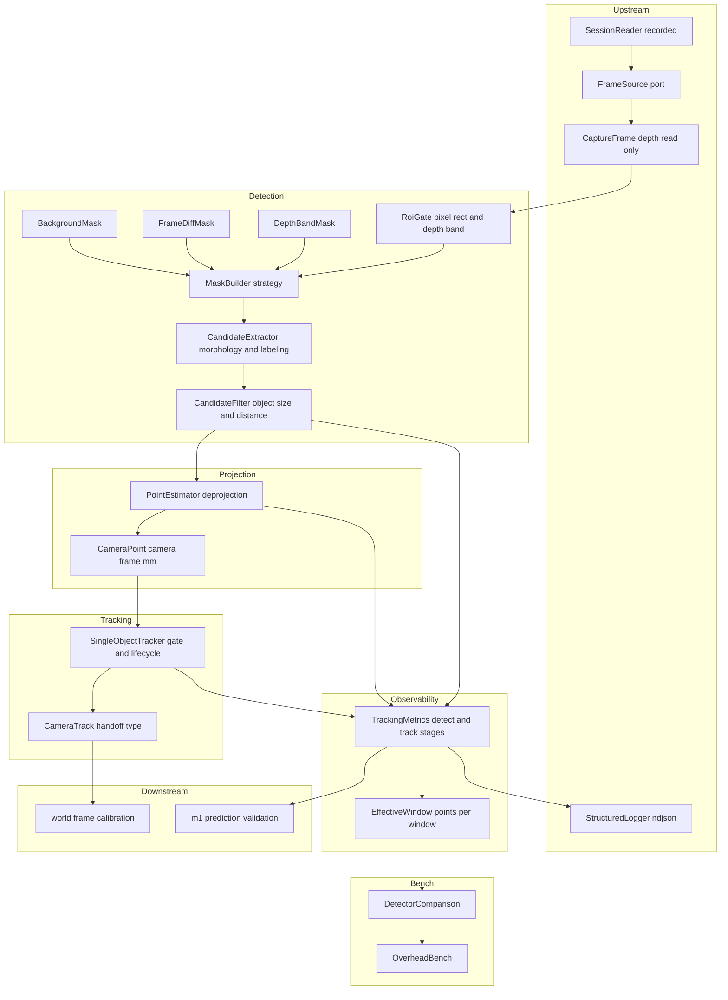
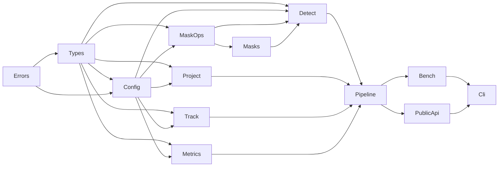
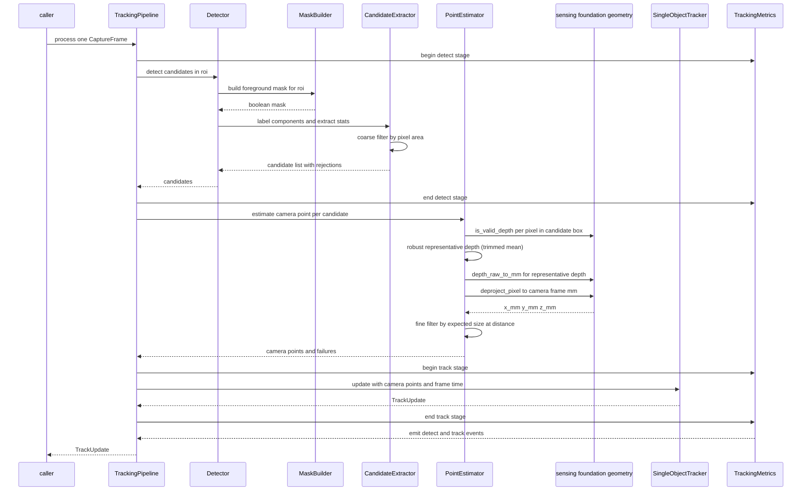
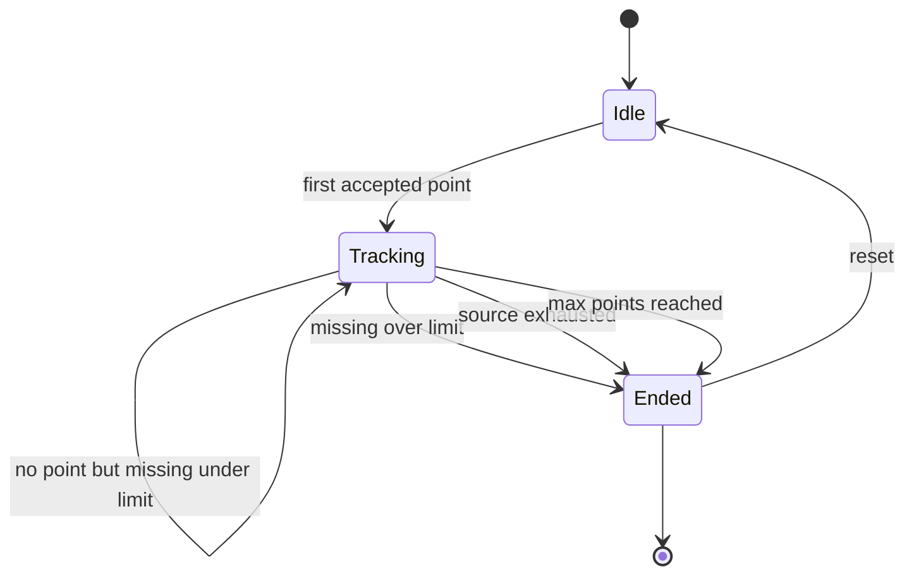
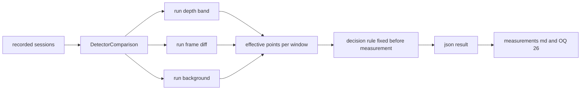
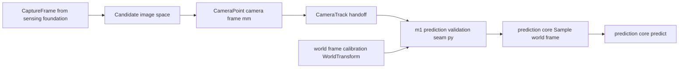

# Technical Design Document: flying-object-tracking

## Overview

**Purpose**: 本機能は、`sensing-foundation` が供給するフレーム列から**飛来する空き缶を検出し、
その3D位置を「カメラ座標系」で求め、フレームを跨いで1投擲の点列にまとめる**。
本設計が与える価値は「検出できること」そのものではなく、
**(a) 検出方式を同一データ上で実測比較できる状態を作ること**（OQ-26 の決着条件そのもの）と、
**(b) 座標系の境界を型で閉じること**（World 変換をここに書けなくすること）の2点にある。

**Users**: 本 Spec の出力（カメラ座標系の点列 `CameraTrack`）を受け取るのは
**`m1-prediction-validation` の `seam.py`** である。`seam.py` は
`world-frame-calibration` が所有する `WorldTransform` を使って World frame へ変換し、
`prediction_core.Sample` を構成する。すなわち `world-frame-calibration` は
**変換の提供者**であって本 Spec の出力の消費者ではない。
`m1-prediction-validation` はさらに、本 Spec が残す `detect` / `track` 区間の計測値と、
追跡開始時刻（`docs/requirements.md §3` 区間1 の実測に必要）を使う。
`prediction-core` へは**直接繋がらない**。間に必ず World 変換（`WorldTransform`）が入る。

**Impact**: 本 Spec はリポジトリに**初めて OpenCV を持ち込む**層である。
`sensing-foundation` が意図的に導入を見送り、本 Spec の責務として明示した道具である。
依存の向きは常に `flying_object_tracking → sensing_foundation` の一方向であり、
**`prediction_core` へは依存しない**。あわせて **OQ-26 を決着させる**。

### Goals

- 前景マスクの作り方だけが異なる3つの軽量検出方式を、同一の後段で走らせられるようにする（要件 3 / 4）
- 候補の絞り込みを画素の魔法数ではなく**対象物の寸法（φ65mm）と実測距離**から導出する（要件 3.3 / 12.5）
- 候補領域の画素だけを逆投影し、**カメラ座標系**の代表3D点を求める（要件 5）
- 1投擲 = 1物体の追跡を最小構成で成立させ、途中経過を逐次取り出せるようにする（要件 6）
- 出力を**カメラ座標系であると型から判別できる**形にし、World 変換を構造的に締め出す（要件 7）
- `detect` / `track` 区間のレイテンシと `effective_points_per_window` を計測値として残す（要件 8）
- **実機も RealSense SDK も無い環境で**、検出・逆投影・追跡の全経路をテストできる（要件 11）
- 3方式を実測比較し、**結果を根拠として OQ-26 を決着させる**（要件 4.8 / 4.9）

### Non-Goals

- カメラ座標系 → World 座標系の変換、床平面推定、World frame の確立（`world-frame-calibration`）
- 予測・フィッティング・落下地点の算出（`prediction-core`）
- フレーム取得・記録・再生・構造化ロギング**基盤**（`sensing-foundation`）
- 落下地点の可視化、時間予算の総合評価、M1 完了判定（`m1-prediction-validation`）
- ゴミの種類判別（分別）、複数物体の同時追跡、空き缶以外への対応（OQ-02）
- 誤検出の**最終的な棄却判断**（残差による棄却は `m1-prediction-validation`）
- **Pi 4 継続可否の判断**（OQ-27。材料の提供までを持つ）
- リポジトリ全体のディレクトリ構成（OQ-40）と Python 環境構築方針（OQ-41）の確定

> 詳細と担当先は下の [Out of Boundary](#out-of-boundary) を正とする。

---

## Boundary Commitments

### This Spec Owns

- **検出の契約と3つの実装**: `Detector` プロトコルと、距離帯ゲート／フレーム間差分／背景差分の
  3つのマスク生成方式（要件 3 / 4）
- **候補の絞り込み規則**: 対象物の寸法と実測距離から期待画素サイズを導出する判定（要件 3.3 / 3.4）
- **処理範囲の限定**: 画素矩形と距離帯からなる ROI と、その適用規則（要件 2）
- **カメラ座標系の3D位置算出**: 候補領域内の有効 Depth 画素からの逆投影と代表値の決定（要件 5）
- **単一物体追跡**: 対応付け規則・ライフサイクル・終了理由・点列の確定（要件 6）
- **下流への受け渡し型**: `CameraTrack` / `TrackPoint` と `HANDOFF_VERSION`（要件 7）
- **`detect` / `track` 区間の計測点**と `effective_points_per_window` の定義（要件 8）
- **検出方式の比較手段と判定規則**、および比較結果の記録（要件 4。**OQ-26 を決着させる**）
- **物理配置**: `src/flying_object_tracking/**`、`tests/flying_object_tracking/**`、
  `.kiro/specs/flying-object-tracking/measurements.md`、ルート `pyproject.toml` への**追記**

### Out of Boundary

- **カメラ座標系 → World 座標系の変換、床平面推定、カメラ姿勢推定**（`world-frame-calibration`）
- 予測・フィッティング・残差（`prediction-core`）
- フレーム取得・ドレイン・セッション記録・再生・構造化ロギング基盤（`sensing-foundation`）
- 段階別レイテンシの**集計と判断**（`m1-prediction-validation` / OQ-27）
- 投擲物理・合成データの物理モデル（`trajectory-simulator` / OQ-33）
- **Throw Record のスキーマ**（`prediction-core` / D-8）。本 Spec は Throw Record を読み書きしない
- 可視化・GUI・ダッシュボード、ESP32 への送信、移動体側のすべて
- `docs/` の本文更新（実装完了時に OQ-26 を `decisions.md` へ移す作業として別途行う）
- `src/prediction_core/**` および `src/sensing_foundation/**` への一切の変更

### Allowed Dependencies

- **`sensing_foundation` の公開入口（`sensing_foundation.__init__`）のみ。** 内部モジュールへ直接 import しない
- **逆投影の基本演算は上流の公開入口から借りる。**
  `depth_raw_to_mm` / `is_valid_depth` / `deproject_pixel` を呼ぶ。
  **本 Spec はピンホール式・mm 換算・無効画素の判定を自前で実装しない**
  （`world-frame-calibration` と同じ実装に乗ることが、誤差切り分けの前提である）
- **`prediction_core` へは依存しない**（import しない）。本 Spec は `Sample` を構成できない。
  これが「World 変換を持たない」ことの構造的な保証である（`research.md` Decision 1）
- **宣言するサードパーティ依存は `numpy` と GUI 無し OpenCV の2つ**
  （extras `tracking` として宣言。**`[project].dependencies` は空のまま維持する**）
- 標準ライブラリ（`json` / `time` / `dataclasses` / `enum` / `pathlib` / `math` / `argparse` /
  `collections` / `statistics` / `typing`）
- **禁止**: `prediction_core` へのサードパーティ依存の逆流、`prediction_core` の import、
  下流 Spec（`world-frame-calibration` / `m1-prediction-validation`）への依存、
  `sensing_foundation` の内部モジュールへの直接 import、`pyrealsense2` の直接利用

### Revalidation Triggers

以下が発生した場合、下流（`world-frame-calibration` / `m1-prediction-validation`）は結合を再確認する必要がある。

- `CameraTrack` / `TrackPoint` / `CameraPoint` の**フィールド追加以外の変更**（改名・削除・単位変更）
- `HANDOFF_VERSION` の変更
- **座標系の意味の変更**（`CoordinateFrame` の値、または「カメラ座標系で確定する」という約束）
- **時間基準の変更**（`t_capture_ms` をそのまま引き継ぐという約束）
- `Detector` プロトコルのメソッド構成・候補集合の意味論の変更
- `detect` / `track` の stage 名、および計測イベントの固定キーの変更
- `effective_points_per_window` の定義（窓長の意味、有効の定義）の変更
- サードパーティ依存の追加（Pi 側の導入手順が変わる）
- **上流由来**: `sensing_foundation` の `CaptureFrame` / `StreamProfile` / `CameraIntrinsics` /
  `FrameSource` / ログ形式版の変更（同 Spec の Revalidation Triggers が発火したとき）
- **上流由来（逆投影の基本演算）**: `sensing_foundation` の
  `depth_raw_to_mm` / `is_valid_depth` / `deproject_pixel` の変更
  （画素中心規約・`depth_scale_mm` の適用位置・無効画素の判定を含む）。
  本 Spec の `PointEstimator` はこの3関数の上に乗っており、
  変更は `m1-prediction-validation` の**要件 1.10 クロス Spec 契約テスト**
  （`tests/m1_validation/test_deprojection_contract.py`）を直撃する
- **上流由来（パッケージング）**: `tests/prediction_core/test_packaging.py` の
  extras 許可リスト（`ALLOWED_OPTIONAL_EXTRAS`）の変更。
  当該改修は `sensing-foundation` が所有する

---

## 決着させる未決事項

| OQ | 決定 | 決め方 |
|---|---|---|
| **OQ-26** 物体検出方式 | **設計では決めない。** 3方式（距離帯ゲート／フレーム間差分／背景差分）を
実装し、**同一の記録済みセッションに対する実測比較で選定する**。判定規則は実測前に確定させる（下記） | `compare-detectors` が3方式を同一条件で実行し、`effective_points_per_window` を第一指標として比較。結果と選定根拠を `measurements.md` に記録する |

**判定規則**（`research.md` Decision 7。**実測前に確定させ、結果とともに記録する**）:

> 1. **`effective_points_per_window` が最大**の方式を第一候補とする
> 2. 方式間の差が各方式の四分位範囲以内なら**区別がついていない**とみなし、
>    `detect` 区間の処理時間 p95 が小さい方を採る
> 3. なお並ぶ場合は、**設定パラメータが少ない方**を採る
>
> **絶対値の目標を置かない。** すべて方式間の相対比較とばらつきで定義する
> （`tech.md` 開発標準1）。

**未決のまま残すもの**（明示）:

- **OQ-40**（全体のディレクトリ構成）: 本 Spec は `src/flying_object_tracking/` 1パッケージだけを定める。
  **全 Spec が landing した後も `[project].name` は `prediction-core` のままであり、
  wheel には `prediction_core` / `sensing_foundation` / `flying_object_tracking` /
  `world_frame_calibration` / `m1_validation` / `trajectory_sim` が同居する。
  この配布名の改称は OQ-40 として先送りする**（各 Spec で個別に蒸し返さない）
- **OQ-41**（Python 環境構築・パッケージ管理）: 既存の `pyproject.toml` に乗る。
  **Pi 上で OpenCV を apt / pip のどちらで導入したか**の実測結果を OQ-41 の判断材料として報告する
- **OQ-02**（対象ゴミの最終スコープ）: 判断しない。φ65mm を設定値として分離することで、
  最終決定が下りたときの変更を設定変更に留める
- **OQ-27**（Pi 4 継続可否）: 判断しない。`detect` / `track` 区間の計測値を材料として提供する

---

## Architecture

### Existing Architecture Analysis

既存実装は `src/prediction_core/` のみで、`src/sensing_foundation/` は設計確定済み・未実装である。
本設計は両者が確立した約束を踏襲する。

| 既存の約束 | 本設計での扱い |
|---|---|
| `src/` レイアウト、`pyproject.toml` は PEP 621 | 踏襲。`[tool.hatch.build.targets.wheel].packages` に追記する |
| 単位をフィールド名に含める（距離 mm / 時刻 ms） | 踏襲（要件 5.2） |
| 依存方向を階層で固定し、静的テストで回帰検証する | 踏襲。`test_boundaries.py` を本 Spec にも置く |
| 無効は例外ではなく値で返し、例外は「呼び出し方の誤り」に限る | 踏襲。ただし**設定不正と前提欠落は例外**とする（下記 Error Handling） |
| `prediction_core` は実行時サードパーティ依存ゼロ | **維持する。** numpy / OpenCV は extras、`[project].dependencies` は空のまま |
| 公開 API を `__init__` の1点に集約する | 踏襲 |
| 入力元は `for frame in source.frames():` の1本（Ports & Adapters） | **上流のポートをそのまま使う。** 独自のアダプタを作らない |
| 構造化ログは NDJSON。下流は自分の stage を足す | 踏襲。`detect` / `track` を足す |

`structure.md` の Future Code Layout（入力層・処理層・通信層・観測基盤）は **OQ-40 として未決のまま残す**。
本設計は処理層のうち「検出・3D位置取得・追跡」だけを物理化する。

### Architecture Pattern & Boundary Map

**Selected pattern**: **パイプライン（検出 → 逆投影 → 追跡）＋ 検出内部の戦略パターン**。
段の境界を `docs/development-environment.md §12` の段階検証（3. 検出 → 4. 3D位置取得 → 5. 追跡）に
一致させ、**方式の差し替えは検出段の内部（前景マスクの作り方）だけに閉じる**。



**Architecture Integration**:

- **Selected pattern**: パイプライン ＋ 戦略。`research.md` Architecture Pattern Evaluation のとおり、
  3方式の違いは **`MaskBuilder` だけ**であり、後段（形態処理・ラベリング・絞り込み・逆投影・追跡）は共通である。
  これにより OQ-26 の比較が**後段の実装差で交絡しない**（要件 4.4）
- **Domain/feature boundaries**: 検出（Detection）・逆投影（Projection）・追跡（Tracking）・
  計測（Observability）の4領域。**Projection は Detection を import しない**（候補の矩形と Depth だけを受け取る）。
  結び付けるのは `TrackingPipeline` だけである
- **Existing patterns preserved**: `src/` レイアウト、単位付きフィールド名、依存方向の静的検証、
  公開 API の一点集約、無効を値で返す方針
- **New components rationale**: 各コンポーネントは要件の責務境界（ROI／マスク生成／候補抽出／
  候補絞り込み／逆投影／追跡／計測／比較）に 1 対 1 で対応する。
  **実装が1つしかない抽象は置かない**（例: 逆投影のストラテジ抽象を作らない）。
  なお**逆投影の基本演算そのものは上流 `sensing_foundation` に1つだけ存在する**。
  本 Spec はそれを呼ぶだけであり、ここでも抽象を挟まない
- **Steering compliance**:
  - `tech.md` 開発標準1 — 未実測値を合否条件にしない。方式選定は相対比較で定義する（要件 8.10 / 4.9）
  - `tech.md` 開発標準4 — 部品を替える前に設定で詰める。ROI・方式・閾値をすべて設定にする（要件 12.1）
  - `tech.md` 開発標準5 — fire-and-forget、実行時無効化、ON/OFF 実測確認（要件 8.6〜8.9）
  - `tech.md` 開発標準6 — Record / Replay 前提。上流のポートをそのまま使う（要件 1.1 / 1.2）
  - `development-environment.md §4` — ROI だけ処理する、画像コピーを減らす、
    毎フレーム巨大な Point Cloud を作らない、headless（要件 2 / 5.6 / 12.4）
  - `roadmap.md` Boundary Strategy — **カメラ座標系まで**（要件 5.3 / 7.3）

### Dependency Direction

依存は**左から右へのみ**許可する。右の層が左の層を import してよく、逆は禁止する。



| 層 | モジュール | import してよい対象 |
|---|---|---|
| 0 | `errors` | 標準ライブラリのみ |
| 1 | `types` | `errors` ＋ `numpy` ＋ **`sensing_foundation`（公開入口のみ）** |
| 2 | `config` | 0〜1 |
| 3 | `metrics` | 0〜2 ＋ `sensing_foundation`（`Logger`） |
| 3 | `detection/mask_ops` | 0〜2 ＋ `numpy` ＋ **`cv2`（本パッケージで `cv2` を import する唯一の場所）** |
| 4 | `detection/masks/*` | 0〜3（`mask_ops` を使う。`cv2` を直接 import しない） |
| 5 | `detection/detector` | 0〜4 |
| 5 | `projection` | 0〜2 ＋ `numpy` ＋ **`sensing_foundation`（公開入口の逆投影基本演算 `depth_raw_to_mm` / `is_valid_depth` / `deproject_pixel`）**（`detection` を import しない） |
| 6 | `tracking` | 0〜2（`detection` / `projection` を import しない。点だけを受け取る） |
| 7 | `pipeline` | 0〜6 ＋ `sensing_foundation` |
| 8 | `bench/*` | 0〜7 |
| 9 | `cli` | 0〜8 |
| 9 | `__init__` | 0〜8（再エクスポートのみ。ロジックを持たない） |

> **`tracking` が `detection` を import しないのは意図的である。** 追跡は「時刻付きカメラ座標点の列」に対する
> 処理であり、その点がどの検出方式から来たかを知る必要がない。この分離により、
> **追跡のテストを検出なしで書ける**（要件 11.2 の合成軌道テストが検出を経由せずに追跡を検証できる）。
>
> **`cv2` の import を `detection/mask_ops` の1箇所に閉じる。** これにより
> 「OpenCV が無い環境でも `types` / `config` / `tracking` / `projection` は import できる」状態を保てる。
> Pi 上での OpenCV 導入が難航した場合（OQ-41）、退避の影響範囲がこの1モジュールに限定される。
>
> **`prediction_core` はどの層からも import しない。** `test_boundaries.py` が静的に検証する。

### Technology Stack

| Layer | Choice / Version | Role in Feature | Notes |
|---|---|---|---|
| 言語 / ランタイム | Python >= 3.11 | 実装言語 | `prediction-core` / `sensing-foundation` と同一。PEP 695 構文を使わない |
| 入力層 | `sensing_foundation`（同リポジトリ） | フレーム供給・記録再生・ロギング | **公開入口のみ**。内部モジュールへ触れない |
| 配列 | NumPy（extras `tracking`） | Depth の差分・マスク・逆投影のベクトル化 | 上流と同じ依存。バージョン下限を揃える |
| 画像処理 | OpenCV（GUI 無しの構成。extras `tracking`） | モルフォロジと**連結成分ラベリング** | `research.md` Decision 3。GUI 機能は使わない（要件 12.4） |
| 直列化 | 標準ライブラリ `json` | 比較結果・ハンドオフの永続化 | 独自形式を増やさない |
| 計時 | `sensing_foundation` の `Logger.timed()` / `SessionClock` | `detect` / `track` 区間の計測 | **独自の計時機構を作らない**（要件 8.2） |
| CLI | 標準ライブラリ `argparse` | サブコマンド入口 | 上流に合わせる。常駐サーバを持たない |
| テスト | `pytest`（開発依存） | 単体・結合・契約・境界テスト | **実機・SDK なしで全通過**すること（要件 11.1） |

> **OpenCV の版を設計に焼き付けない。** Pi 上で apt / pip のどちらで入るかが未確定（OQ-41）であり、
> 使用する API（`morphologyEx` / `connectedComponentsWithStats`）はいずれも長期にわたり安定している。
> extras には下限のみを宣言する。

---

## File Structure Plan

### Directory Structure

```
src/flying_object_tracking/
├── __init__.py                     # 公開APIの再エクスポート専用。ロジックを持たない
├── errors.py                       # 例外階層
├── types.py                        # Roi / Candidate / CameraPoint / TrackPoint / CameraTrack /
│                                   #   TrackUpdate と列挙型・HANDOFF_VERSION
├── config.py                       # RoiConfig / ObjectModelConfig / DetectorConfig /
│                                   #   TrackerConfig / MeasurementConfig / TrackingSettings と解決順序
├── metrics.py                      # TrackingMetrics（detect / track 区間）と EffectiveWindow
├── detection/
│   ├── __init__.py
│   ├── mask_ops.py                 # cv2 を import する唯一の場所。モルフォロジ・連結成分・ROI 切り出し
│   ├── masks/
│   │   ├── __init__.py             # MaskBuilder プロトコルと生成口（レジストリ）
│   │   ├── depth_band.py           # 方式1: 距離帯ゲート（最軽量ベースライン）
│   │   ├── frame_diff.py           # 方式2: 直前フレームとの Depth 差分
│   │   └── background.py           # 方式3: 静止背景 Depth モデルとの差分
│   ├── candidates.py               # 連結成分 → Candidate 化と、寸法・距離による絞り込み
│   └── detector.py                 # Detector プロトコルと既定実装（マスク生成 + 共通後段）
├── projection.py                   # 候補領域の有効画素 → カメラ座標系 CameraPoint（代表値の決定）
│                                   #   逆投影の基本演算は sensing_foundation の
│                                   #   depth_raw_to_mm / is_valid_depth / deproject_pixel を呼ぶ。
│                                   #   ピンホール式をここに書かない
├── tracking.py                     # SingleObjectTracker（ゲート・ライフサイクル・終了理由）
├── pipeline.py                     # TrackingPipeline（検出 → 逆投影 → 追跡 + 計測）と track_source
├── bench/
│   ├── __init__.py
│   ├── compare.py                  # 検出方式の比較（effective_points_per_window ほか）と判定規則
│   └── overhead.py                 # 計測 ON/OFF 比較
└── cli.py                          # track / compare-detectors / bench-overhead / export

tests/flying_object_tracking/
├── conftest.py                     # 共通フィクスチャ（一時ディレクトリ・設定・ロガー）
├── synthetic.py                    # 既知の3D軌道 → Depth フレーム列の合成器（テストツリーに置く）
├── fakes.py                        # テスト用の最小 FrameSource 実装（本体には置かない）
├── test_types.py
├── test_config.py
├── test_metrics.py
├── test_mask_ops.py
├── test_masks.py                   # 3方式が同一の入力に対し同一形式のマスクを返すこと
├── test_candidates.py              # 寸法・距離による絞り込みと除外理由の計数
├── test_projection.py              # 代表値の決定と往復（合成器の逆演算との一致）。
│                                   #   上流の基本演算に委譲していることも確認する
├── test_tracking.py                # 対応付け・欠測許容・終了理由・決定的なタイブレーク
├── test_pipeline.py                # 検出 → 逆投影 → 追跡の結合。既知軌道の往復
├── test_readonly_depth.py          # read-only Depth に対する in-place 変更の検出
├── test_determinism.py             # 同一入力に対する同一出力（要件 11.3）
├── test_bench.py                   # 比較の指標算出と判定規則
├── test_cli.py
└── test_boundaries.py              # 依存方向・prediction_core 非依存・cv2 集約・extras の静的検証
```

### Modified Files

- `pyproject.toml` — `[tool.hatch.build.targets.wheel].packages` に `src/flying_object_tracking` を**追記**する。
  `[project.optional-dependencies]` に **`tracking = ["numpy>=1.24", "opencv-python-headless>=4.8"]`** を追記する。
  **`[project].dependencies` は空のまま変更しない**。
  > ⚠️ **前提（landing 順序）**: `tests/prediction_core/test_packaging.py` は現状、
  > `[project].dependencies == []` **と** `[project.optional-dependencies] == {}` の
  > **両方**を表明している。後者があるため、extras を1つでも足した時点で
  > **既にマージ済みの `prediction-core` のテストが赤くなる**。
  > この表明を「基本依存は空、かつ extras は許可リストの部分集合」へ緩める改修は
  > **`sensing-foundation`（Wave 0）が所有する**:
  > `ALLOWED_OPTIONAL_EXTRAS = {"sensing", "tracking", "calibration", "m1-viz"}` に対する
  > `set(project.get("optional-dependencies", {})) <= ALLOWED_OPTIONAL_EXTRAS`。
  > **本 Spec は当該テストを再改修しない。** `tracking` はこの許可リストに含まれており、
  > 本 Spec の `pyproject.toml` 追記が成立するのは**この改修が landing した後**である
- `.gitignore` — 比較結果・エクスポートの出力先（既定 `var/`）を**冪等に**追加する。
  `var/` の記載が無ければ追加し、**既にあれば何もしない**（重複させない）。
  `var/` 配下の出力ディレクトリの作成も同様に**存在すれば作らない**（`mkdir -p` 相当）。
  **他 Spec の landing 順序に依存しない書き方にする**
  （`git worktree` での並行実装でもどちらが先でも成立させるため）
- `.kiro/specs/flying-object-tracking/measurements.md` — **新規**。
  検出方式の比較結果と **OQ-26 の選定根拠**、計測 ON/OFF 比較、OpenCV 導入手段の実測を人が読む形で記録する
  （生データは `var/` 配下で版管理しない）

> `src/prediction_core/**` と `src/sensing_foundation/**` は**一切変更しない**。
> `src/world_frame_calibration/**` にも触れない（並行して別 Spec が担当する）。

---

## System Flows

### 1フレームの処理（検出 → 逆投影 → 追跡）



**Key Decisions**:

- **絞り込みは2段になる**（`research.md` Decision 4）。距離が分かる前は画素数による粗いふるいしかかけられず、
  対象物の寸法（φ65mm）による本判定は逆投影で距離が求まってからになる。
  この順序は**設計上の必然であり、後段へ回した手抜きではない**
- **候補領域の画素だけを逆投影する**（要件 5.6 / 2.6）。フレーム全体の点群は作らない
- 計測イベントの送出は各段の**最後**に置き、送出の完了を待たない（上流の fire-and-forget に乗る）
- **例外を投げるのは設定不正と前提欠落だけ**。検出できない・3D点にならないは値で返る（要件 3.5 / 10.2）

### 追跡のライフサイクル



**Key Decisions**:

- **終了理由を必ず持たせる**（`LOST` / `SOURCE_END` / `MAX_POINTS` / `RESET`）。
  「なぜ点列がそこで切れたか」が分からないと、`m1-prediction-validation` が
  取りこぼしの原因を検出側か取得側かに切り分けられない（要件 6.5）
- **追跡開始時刻を記録する**（要件 6.3）。`docs/requirements.md §3` の区間1
  （リリース〜検出開始。**完全に未検証**と明記されている）の実測に必要な唯一の材料である
- **途中経過を逐次取り出せる**（要件 6.7）。`prediction-core` が3点で初回予測を出す設計であるため、
  追跡終了を待って点列を渡すと**早期予測という上流の設計意図が死ぬ**
- ゲートは直近2点からの等速外挿を基準にし、点が1つの間は直前点からの距離ゲートに縮退する
  （`research.md` Decision 5）

### 検出方式の比較（OQ-26 の決着）



**Key Decisions**:

- **後段の設定は全方式で同一にする。** 比較結果に「後段設定のハッシュ」を含め、
  異なる設定同士を比較していないことを事後に確認できるようにする（要件 4.4）
- **判定規則を実測前に確定させ、結果と一緒に記録する。** 結果を見てから基準を決めると、
  それは選定ではなく追認になる（`tech.md` 開発標準1）
- 比較は**記録済みセッションに対して行う**（要件 4.4）。実機の逐次実行では方式ごとに入力が変わり、
  投擲のばらつきが方式の差を覆い隠す（`tech.md` Testing「投擲は再現性が低い」）
- 入力元が `simulated` の場合、結果に**「実機の結論として扱わない」旨を明示する**（要件 11.5）

---

## Requirements Traceability

| Requirement | Summary | Components | Interfaces | Flows |
|---|---|---|---|---|
| 1.1, 1.2 | 入力はフレーム列1本。入力元で分岐しない | TrackingPipeline | `track_source`, `TrackingPipeline.process` | 1フレームの処理 |
| 1.3, 1.4 | Depth を変更しない／混入をテストで検出 | MaskOps, PointEstimator | `mask_ops` の非破壊契約 | — |
| 1.5, 1.6 | 上流は公開入口のみ／基盤は持たない | 全モジュール | 依存方向表 | — |
| 1.7 | SDK・実機なしで全経路が動く | 全モジュール | — | — |
| 2.1, 2.2, 2.3, 2.4 | ROI（画素矩形＋距離帯）の適用 | RoiGate, MaskOps | `Roi`, `RoiConfig`, `crop_roi` | 1フレームの処理 |
| 2.5 | ROI で座標基準が変わらない | PointEstimator | `CameraPoint`（全画面画素座標を保持） | 1フレームの処理 |
| 2.6 | 全画面の点群を作らない | PointEstimator | `estimate` は候補矩形のみ受ける | 1フレームの処理 |
| 3.1, 3.5 | 候補集合（0個以上）を返し例外を投げない | Detector, CandidateExtractor | `Detector.detect` | 1フレームの処理 |
| 3.2 | 候補に判断材料を付与 | CandidateExtractor | `Candidate` | — |
| 3.3, 3.4 | 寸法・距離による絞り込みと除外の計数 | CandidateFilter, PointEstimator | `ObjectModelConfig`, `CandidateRejection` | 1フレームの処理 |
| 3.6, 3.7 | 分別しない／学習済みモデルを必須にしない | Detector | 3方式はいずれもモデル非依存 | — |
| 4.1, 4.2, 4.3 | 方式の差し替えと3方式の提供 | MaskBuilder, masks/* | `MaskBuilder`, `create_detector`, `DetectorKind` | 方式比較 |
| 4.4, 4.5, 4.6, 4.7 | 同一指標での比較（実効点数・取りこぼし・処理時間） | DetectorComparison, EffectiveWindow | `DetectorComparisonResult` | 方式比較 |
| 4.8, 4.9 | 結論と根拠の記録／未実測選定を確定扱いしない | DetectorComparison, CLI | `--decide` 出力, `measurements.md` | 方式比較 |
| 5.1, 5.2, 5.7 | 代表3D点をカメラ座標系 mm と時刻付きで返す | PointEstimator | `CameraPoint` | 1フレームの処理 |
| 5.3 | World 変換を持たない | 全モジュール | `prediction_core` 非依存 | — |
| 5.4 | 用いたカメラパラメータの出所を追跡可能に | PointEstimator | `CameraPoint.intrinsics_source` | — |
| 5.5 | 有効画素不足は無効として理由付きで扱う | PointEstimator | `PointFailure`, `PointFailureReason` | 1フレームの処理 |
| 5.6 | 候補領域外を逆投影しない | PointEstimator | `estimate(frame, candidate)` | 1フレームの処理 |
| 5.8 | 逆投影の基本演算を上流の共有実装に委ねる | PointEstimator, test_boundaries | `sensing_foundation` の `depth_raw_to_mm` / `is_valid_depth` / `deproject_pixel` | 1フレームの処理 |
| 6.1, 6.2, 6.4 | 単一物体の対応付けと点列への追加 | SingleObjectTracker | `update` | 追跡ライフサイクル |
| 6.3 | 追跡開始時刻の記録 | SingleObjectTracker | `CameraTrack.started_t_ms` | 追跡ライフサイクル |
| 6.5 | 欠測超過で終了・終了理由の付与 | SingleObjectTracker | `TrackEndReason` | 追跡ライフサイクル |
| 6.6 | 複数候補は決定的に1つ選び、残りを計数 | SingleObjectTracker | タイブレーク規則 | 追跡ライフサイクル |
| 6.7 | 途中経過を逐次取り出せる | SingleObjectTracker, TrackingPipeline | `TrackUpdate` | 追跡ライフサイクル |
| 6.8 | 複数物体追跡を持たない | SingleObjectTracker | — | — |
| 6.9 | 追跡閾値を設定値に | TrackerConfig | `max_step_mm`, `max_missing_frames` | — |
| 7.1, 7.2, 7.7 | 点列と判断材料、フレームからの追跡可能性 | CameraTrack, TrackPoint | `CameraTrack` | — |
| 7.3 | 座標系を出力から判別できる | CoordinateFrame | `CameraTrack.frame` | — |
| 7.4, 7.5, 7.6, 7.8 | 予測の入力契約を汚さない／予測結果・棄却判断を含めない | 全モジュール | `prediction_core` 非依存 | — |
| 8.1, 8.2, 8.3 | detect / track 区間を独立計測し上流ログへ | TrackingMetrics | `Logger.timed`, stage `detect` / `track` | 1フレームの処理 |
| 8.4 | 実効点数の算出 | EffectiveWindow | `effective_points_per_window` | 方式比較 |
| 8.5 | 取りこぼしと3D化失敗を区別して計数 | TrackingMetrics | `TrackingCounters` | 1フレームの処理 |
| 8.6, 8.7 | 計測の実行時無効化と生成回避 | MeasurementConfig, TrackingMetrics | `NullLogger` への委譲 | — |
| 8.8 | ON/OFF 比較の手段 | OverheadBench | `bench-overhead` | — |
| 8.9 | 実行中に集計・可視化しない | TrackingMetrics | 集計は CLI 側 | — |
| 8.10 | 未実測値を合否条件にしない | DetectorComparison | 判定規則は相対比較 | 方式比較 |
| 9.1, 9.5 | 最終棄却を持たない／誤追跡でも例外にしない | SingleObjectTracker | — | 追跡ライフサイクル |
| 9.2, 9.3 | 明らかな外れは除外し理由を計数 | CandidateFilter, TrackingMetrics | `CandidateRejection` | 1フレームの処理 |
| 9.4 | 信頼度の材料を点に付与 | TrackPoint | `TrackPoint.quality` | — |
| 10.1, 10.6 | 無効 Depth を有効としない／埋めない | PointEstimator | `is_valid_depth`（上流）による `valid_pixels` の算出 | 1フレームの処理 |
| 10.2 | 1フレームの失敗で止まらない | TrackingPipeline | `process` は例外を伝播しない | 1フレームの処理 |
| 10.3 | フレーム欠落を検出し記録 | TrackingPipeline, CameraTrack | `gap_before` の引き継ぎ | 追跡ライフサイクル |
| 10.4 | カメラパラメータ欠落は明示して失敗 | PointEstimator | `IntrinsicsUnavailableError` | — |
| 10.5 | 設定不正は開始前に拒否 | TrackingSettings | `resolve` | — |
| 11.1, 11.2, 11.3 | SDK なしテスト／合成軌道の往復／決定性 | tests/synthetic, tests/fakes | — | — |
| 11.4 | 実機要否の区別 | tasks.md のタスク分割 | — | — |
| 11.5 | 実機なしの結果を実機の結論としない | DetectorComparison | 結果に入力元種別と注記 | 方式比較 |
| 12.1, 12.2, 12.6 | 設定の外部化・確認・出力先 | TrackingSettings, CLI | `resolve`, `--print-settings` | — |
| 12.3, 12.5 | 既定値の非既成事実化／寸法値の分離 | ObjectModelConfig | docstring と `--help` | — |
| 12.4 | GUI を必須としない | Technology Stack | GUI 無し OpenCV | — |
| 13.1, 13.2, 13.5 | 既存・上流パッケージを変更しない | — | Modified Files | — |
| 13.3, 13.4 | extras 宣言と基本依存の空維持 | pyproject | `[project.optional-dependencies] tracking` | — |
| 13.6 | 予測の入力契約にカメラ固有型が漏れない | test_boundaries | `prediction_core` 非 import 検査 | — |
| 13.7 | OpenCV 導入手段の実測を記録 | measurements.md | — | — |

---

## Components and Interfaces

| Component | Domain/Layer | Intent | Req Coverage | Key Dependencies (P0/P1) | Contracts |
|---|---|---|---|---|---|
| CoreTypes | L1 型 | 候補・3D点・点列・座標系を不変値として定義 | 3.2, 5.2, 7.1, 7.3 | sensing_foundation (P0), numpy (P0) | State |
| TrackingSettings | L2 設定 | 設定の解決と起動時検証 | 10.5, 12.1, 12.2, 12.5 | CoreTypes (P0) | Service, State |
| TrackingMetrics | L3 計測 | detect / track 区間の計測とカウンタ | 8.1〜8.7, 9.3 | sensing_foundation Logger (P0) | Service, Event |
| MaskOps | L3 画像 | cv2 の唯一の窓口。ROI 切り出し・形態処理・ラベリング | 1.3, 2.2, 3.1 | cv2 (P0), numpy (P0) | Service |
| MaskBuilder + masks/* | L4 検出 | 3方式の前景マスク生成 | 4.1, 4.2, 4.3 | MaskOps (P0), Config (P0) | Service, State |
| Detector | L5 検出 | フレーム → 候補集合。既定実装がマスク＋共通後段 | 3.1〜3.7, 4.1 | MaskBuilder (P0), CandidateExtractor (P0) | Service |
| CandidateExtractor / Filter | L5 検出 | 連結成分の候補化と粗い絞り込み・除外計数 | 3.2, 3.3, 3.4, 9.2 | MaskOps (P0) | Service |
| PointEstimator | L5 逆投影 | 候補 → カメラ座標系の代表3D点と本判定（基本演算は上流へ委譲） | 2.5, 2.6, 5.1〜5.8, 10.1, 10.4 | CoreTypes (P0), numpy (P0), sensing_foundation geometry (P0) | Service |
| SingleObjectTracker | L6 追跡 | 対応付け・ライフサイクル・点列の確定 | 6.1〜6.9, 9.1, 9.5 | CoreTypes (P0) | Service, State |
| TrackingPipeline | L7 統合 | 3段の結線と計測、フレーム欠落の引き継ぎ | 1.1, 1.2, 10.2, 10.3 | 上記すべて (P0), sensing_foundation (P0) | Service |
| DetectorComparison | L8 比較 | 3方式の実測比較と判定規則の適用（OQ-26） | 4.4〜4.9, 8.4, 11.5 | TrackingPipeline (P0) | Batch |
| OverheadBench | L8 比較 | 計測 ON/OFF 比較 | 8.8 | TrackingPipeline (P0) | Batch |
| CLI | L9 入口 | 設定をコード外から与える実行入口 | 12.1, 12.2, 12.6 | 全コンポーネント (P0) | Service |
| PublicApi | L9 入口 | 公開シンボルの再エクスポート | 7.1, 7.3 | 全コンポーネント (P0) | — |

### L1-L2: 型と設定

#### CoreTypes

| Field | Detail |
|---|---|
| Intent | 候補・3D点・点列・座標系を、入力元と検出方式に依存しない不変値として定義する |
| Requirements | 3.2, 5.2, 5.4, 5.7, 7.1, 7.2, 7.3, 7.7, 9.4 |

**Responsibilities & Constraints**

- すべて `frozen=True, slots=True` の dataclass とし、値等価にする
- **距離は mm、時刻は ms、画素量は `_px`** とし、フィールド名に単位を含める（`structure.md` 命名規約）
- **座標系は型で表明する。** `CameraPoint` / `CameraTrack` は `frame: CoordinateFrame` を持ち、
  本 Spec が生成する値は常に `CoordinateFrame.CAMERA` である
- **`prediction_core` の型を一切参照しない**（`Sample` を作らない）

**Contracts**: Service [ ] / API [ ] / Event [ ] / Batch [ ] / State [x]

##### State Management

```python
HANDOFF_VERSION: str = "1.0"

class CoordinateFrame(StrEnum):
    CAMERA = "camera"            # 本 Spec が出す唯一の値

class RejectReason(StrEnum):
    TOO_SMALL_PX = "too_small_px"
    TOO_LARGE_PX = "too_large_px"
    OUT_OF_ROI = "out_of_roi"
    OUT_OF_DEPTH_BAND = "out_of_depth_band"
    SIZE_MISMATCH = "size_mismatch"          # 距離から導いた期待寸法と合わない
    TOUCHES_ROI_EDGE = "touches_roi_edge"

class PointFailureReason(StrEnum):
    INSUFFICIENT_VALID_PIXELS = "insufficient_valid_pixels"
    DEPTH_SPREAD_TOO_LARGE = "depth_spread_too_large"
    OUT_OF_DEPTH_BAND = "out_of_depth_band"

class TrackState(StrEnum):
    IDLE = "idle"
    TRACKING = "tracking"
    ENDED = "ended"

class TrackEndReason(StrEnum):
    LOST = "lost"                # 欠測が許容フレーム数を超えた
    SOURCE_END = "source_end"    # 入力が尽きた
    MAX_POINTS = "max_points"    # 点数上限に達した
    RESET = "reset"              # 呼び出し側の明示的な打ち切り

@dataclass(frozen=True, slots=True)
class Roi:
    x_px: int
    y_px: int
    width_px: int
    height_px: int
    z_min_mm: float | None
    z_max_mm: float | None

@dataclass(frozen=True, slots=True)
class Candidate:
    """検出段の出力。まだ3D位置を持たない（要件 3.1 / 3.2）。"""
    cx_px: float                 # 全画面座標での重心（ROI オフセット加算済み。要件 2.5）
    cy_px: float
    bbox_px: tuple[int, int, int, int]   # 全画面座標 (x, y, w, h)
    area_px: int                 # 前景画素数
    valid_depth_px: int          # bbox 内の有効 Depth 画素数
    mask_score: float            # 方式ごとの前景らしさ（比較可能性のため 0..1 に正規化）

@dataclass(frozen=True, slots=True)
class CandidateRejection:
    reason: RejectReason
    count: int

@dataclass(frozen=True, slots=True)
class CameraPoint:
    """カメラ座標系の3D点（要件 5.2 / 5.4 / 5.7）。"""
    frame: CoordinateFrame       # 常に CAMERA
    t_ms: float                  # 上流の t_capture_ms をそのまま引き継ぐ
    x_mm: float
    y_mm: float
    z_mm: float
    valid_depth_px: int
    depth_spread_mm: float       # 代表値まわりのばらつき（信頼度の材料。要件 9.4）
    apparent_diameter_px: float
    expected_diameter_px: float  # 距離と object_diameter_mm から導いた期待値
    intrinsics_source: str       # 例: "stream_profile"（要件 5.4）

@dataclass(frozen=True, slots=True)
class PointFailure:
    reason: PointFailureReason
    valid_depth_px: int

@dataclass(frozen=True, slots=True)
class TrackPoint:
    point: CameraPoint
    frame_index: int             # CaptureFrame.index（要件 7.7）
    frame_seq: int               # CaptureFrame.seq
    gap_before: int              # 上流が検出したフレーム番号の飛び（要件 10.3）
    rivals: int                  # 同フレームでゲート内に居た他候補の数（要件 6.6 / 9.4）

@dataclass(frozen=True, slots=True)
class CameraTrack:
    """1投擲ぶんの点列。本 Spec の唯一の受け渡し型（要件 7.1）。"""
    handoff_version: str         # HANDOFF_VERSION
    frame: CoordinateFrame       # 常に CAMERA
    track_id: int
    started_t_ms: float          # 追跡開始時刻（要件 6.3）
    points: tuple[TrackPoint, ...]
    state: TrackState
    end_reason: TrackEndReason | None
    source: SourceKind           # 上流の入力元種別（要件 11.5 の材料）
    detector_kind: str           # どの方式で得た点列か（比較のため）

@dataclass(frozen=True, slots=True)
class TrackUpdate:
    """1フレーム処理後の逐次結果（要件 6.7）。"""
    track: CameraTrack           # そのフレーム時点までの点列
    appended: TrackPoint | None  # このフレームで追加された点
    candidates: int
    rejections: tuple[CandidateRejection, ...]
    point_failures: tuple[PointFailure, ...]
```

- Preconditions: `CameraTrack.points` は `t_ms` について単調非減少
- Invariants: `frame == CoordinateFrame.CAMERA`。`points` の `t_ms` は上流の `t_capture_ms` と同一基準

**Implementation Notes**

- Integration: `SourceKind` は `sensing_foundation` の公開入口から**再エクスポートして使う**
  （同 Spec が `prediction_core` から再エクスポートしている値。**新規定義しない**）
- Validation: 生成時に検証しない（`prediction_core` / `sensing_foundation` の方針を踏襲）。
  検証は `PointEstimator` と `SingleObjectTracker` の境界で行う
- Risks: `CameraTrack` に World 座標のフィールドを足したくなる誘惑が必ず生じる。
  **足した瞬間に境界が消える。** docstring に「World 値をここに入れない」と明記する

#### TrackingSettings

| Field | Detail |
|---|---|
| Intent | 設定を「既定 → 設定ファイル → 環境変数 → CLI」の順で解決し、不正を起動時に拒否する |
| Requirements | 3.3, 6.9, 10.5, 12.1, 12.2, 12.3, 12.5, 12.6 |

**Contracts**: Service [x] / State [x]

```python
@dataclass(frozen=True, slots=True)
class RoiConfig:
    x_px: int = 0
    y_px: int = 0
    width_px: int | None = None      # None ならフレーム幅（要件 2.4）
    height_px: int | None = None
    z_min_mm: float | None = 500.0   # 初期評価候補。必須性能ではない
    z_max_mm: float | None = 5000.0

@dataclass(frozen=True, slots=True)
class ObjectModelConfig:
    """対象物の物理モデル。OQ-02 が動いたらここだけが変わる（要件 12.5）。"""
    diameter_mm: float = 65.0        # 空き缶。OQ-02 の最終決定ではない
    min_scale: float = 0.5           # 期待画素直径に対する許容下限
    max_scale: float = 2.0           # 同上限
    min_area_px: int = 12            # 距離非依存の粗いふるい
    max_area_px: int = 4000

@dataclass(frozen=True, slots=True)
class DetectorConfig:
    kind: DetectorKind = DetectorKind.FRAME_DIFF   # 暫定。OQ-26 の実測で確定する
    diff_threshold_mm: float = 80.0
    background_frames: int = 30      # 背景モデルの初期化に使うフレーム数
    background_update_rate: float = 0.0   # 0.0 なら更新しない（飛翔体を背景に取り込まない）
    open_kernel_px: int = 3
    close_kernel_px: int = 3
    max_candidates: int = 8          # ラベル数の上限。上位のみ採る

@dataclass(frozen=True, slots=True)
class ProjectionConfig:
    min_valid_depth_px: int = 8
    depth_trim_ratio: float = 0.2    # 代表値算出時に外れ値として捨てる割合
    max_depth_spread_mm: float = 200.0

@dataclass(frozen=True, slots=True)
class TrackerConfig:
    max_step_mm: float = 900.0       # 1フレーム間の許容移動量
    max_missing_frames: int = 3
    min_points_to_start: int = 1
    max_points: int = 120

@dataclass(frozen=True, slots=True)
class MeasurementConfig:
    enabled: bool = True
    window_ms: float = 600.0         # effective_points_per_window の窓長（要件 8.4）
    detect_stage: str = "detect"
    track_stage: str = "track"

@dataclass(frozen=True, slots=True)
class TrackingSettings:
    roi: RoiConfig = ...
    object_model: ObjectModelConfig = ...
    detector: DetectorConfig = ...
    projection: ProjectionConfig = ...
    tracker: TrackerConfig = ...
    measurement: MeasurementConfig = ...
    output_root: Path = Path("var/tracking")

    @classmethod
    def resolve(cls, *, file: Path | None, env: Mapping[str, str],
                overrides: Mapping[str, object]) -> "TrackingSettings": ...
    def describe(self) -> dict[str, object]: ...      # --print-settings（要件 12.2）
    def postprocess_fingerprint(self) -> str: ...     # 後段設定の同一性検査（要件 4.4）
```

- Preconditions: すべての `_px` は正、`min_scale < max_scale`、`0.0 <= depth_trim_ratio < 0.5`、
  `max_missing_frames >= 0`、`window_ms > 0`
- Postconditions: 解決後の設定は不変。実行中に変更されない
- Invariants: `z_min_mm < z_max_mm`（いずれも指定されている場合）。
  ROI が指定されている場合、フレーム範囲内に収まること（範囲外は `TrackingConfigError`）

**Implementation Notes**

- Integration: 環境変数は `STB_FOT_` 接頭辞（上流の `STB_SF_` と衝突しない）。設定ファイルは JSON
- Validation: 拒否は**起動時**に行う（要件 10.5）。フレーム依存の検証（ROI がフレームに収まるか）は
  最初のフレーム受領時に1度だけ行い、以後は行わない
- Risks: 既定値のうち **`diameter_mm=65.0` / `kind=FRAME_DIFF` / `window_ms=600.0` は
  「初期評価候補」であって確定値ではない**。docstring と `--help` に明記し、既定値を既成事実化させない
  （`tech.md` 開発標準1、要件 12.3）

### L3: 計測と画像処理の基礎

#### TrackingMetrics

| Field | Detail |
|---|---|
| Intent | detect / track 区間の時間とカウンタを1箇所に集め、上流のロガーへ送る |
| Requirements | 8.1, 8.2, 8.3, 8.5, 8.6, 8.7, 8.9, 9.3 |

**Dependencies**

- Inbound: TrackingPipeline (P0), bench (P1)
- Outbound: なし
- External: `sensing_foundation.Logger`（P0。`timed()` / `stage()` / `emit()`）

**Contracts**: Service [x] / Event [x]

```python
@dataclass(frozen=True, slots=True)
class TrackingCounters:
    frames_processed: int
    frames_without_candidate: int    # 取りこぼし（要件 8.5 前半）
    candidates_total: int
    candidates_rejected: int
    points_estimated: int
    point_failures: int              # 3D化の失敗（要件 8.5 後半）
    points_appended: int
    gate_rejected: int               # ゲートで落ちた候補（要件 6.6）
    tracks_started: int
    tracks_ended: int

class TrackingMetrics:
    def __init__(self, logger: Logger, config: MeasurementConfig) -> None: ...
    def detect(self, frame_index: int) -> AbstractContextManager[None]: ...
    def track(self, frame_index: int) -> AbstractContextManager[None]: ...
    def record_update(self, update: TrackUpdate, frame: CaptureFrame) -> None: ...
    def counters(self) -> TrackingCounters: ...
    def window(self) -> "EffectiveWindow": ...
```

##### Event Contract

- 送出先は**上流の構造化ログ**。独自形式を定義しない（要件 8.2）
- stage は **`detect`** と **`track`**（上流の予約 stage `system` / `capture` / `record` と衝突しない）
- `stage="detect"`, `event="frame"` の `data`:
  `frame_index` / `detect_ms` / `candidates` / `rejected` / `mask_px`
- `stage="track"`, `event="frame"` の `data`:
  `frame_index` / `track_ms` / `appended`（bool）/ `points` / `rivals` / `gate_rejected`
- `stage="track"`, `event="track_end"` の `data`:
  `track_id` / `points` / `duration_ms` / `end_reason`
- 順序保証・冪等性・欠落の扱いは**上流のロガーに従う**（キュー溢れによる欠落はあり得る）

**Implementation Notes**

- Integration: 計測が無効なとき、`TrackingMetrics` は上流の `NullLogger` に委譲し、
  **イベントの生成も文字列化も行わない**（要件 8.7）。`detect()` / `track()` は共有の no-op を返す
- Validation: 集計（p50 / p95）は**実行中に行わない**（要件 8.9）。
  生の計測値を送り、集計は CLI と `LogSummarizer`（上流）が別環境で行う
- Risks: `record_update` を毎フレーム呼ぶため、ここでの割り当てが支配的になりうる。
  カウンタは可変の内部状態として持ち、`TrackingCounters` の生成は要求時のみとする

#### EffectiveWindow

| Field | Detail |
|---|---|
| Intent | 一定時間窓内に得られた有効3D点数（`effective_points_per_window`）を算出する |
| Requirements | 4.5, 8.4 |

**Contracts**: Service [x] / State [x]

```python
class EffectiveWindow:
    def __init__(self, window_ms: float) -> None: ...
    def add(self, t_ms: float) -> None: ...
    def value(self) -> float: ...        # 窓あたりの平均点数
    def peak(self) -> int: ...           # 最も密な窓での点数
```

**Implementation Notes**

- Integration: **名前を上流と区別する。** `sensing_foundation` の `effective_samples_per_window` は
  フレーム層の指標であり、対象が違う（`research.md` Decision 6）
- Validation: 窓長は設定値（既定 600 ms）。**固定値として埋め込まない**（要件 8.4）
- Risks: `peak()` は投擲区間だけを切り出す用途に効くが、窓長より短い投擲では意味が薄い。
  比較時は `value()` と `peak()` の両方を残す

#### MaskOps

| Field | Detail |
|---|---|
| Intent | OpenCV への唯一の窓口として、ROI 切り出し・形態処理・連結成分ラベリングを提供する |
| Requirements | 1.3, 2.2, 2.6, 3.1 |

**Contracts**: Service [x]

```python
def crop_roi(depth: "numpy.ndarray", roi: Roi) -> "numpy.ndarray": ...
    # 非破壊。ビューを返し、コピーしない（要件 1.3 / 2.2）

def clean_mask(mask: "numpy.ndarray", open_px: int, close_px: int) -> "numpy.ndarray": ...
    # cv2.morphologyEx。入力を変更せず新しい配列を返す

@dataclass(frozen=True, slots=True)
class Component:
    x_px: int; y_px: int; w_px: int; h_px: int
    area_px: int; cx_px: float; cy_px: float

def components(mask: "numpy.ndarray", max_count: int) -> tuple[Component, ...]: ...
    # cv2.connectedComponentsWithStats。面積降順で max_count 件まで
```

**Implementation Notes**

- Integration: **本パッケージで `cv2` を import する唯一のモジュールである。**
  Pi 上の OpenCV 導入が難航した場合（OQ-41）、退避の影響範囲がここに限定される
- Validation: 入力配列を変更しない。`crop_roi` はビューを返すため、
  **呼び出し側が書き込むと上流の read-only 制約に触れて例外になる**（要件 1.4 の検出経路）
- Risks: `astype` による全画面コピーはレイテンシに直結する。
  **ROI 切り出しの後に型変換する**順序を守る（`development-environment.md §4`「不要な画像コピーを減らす」）

### L4-L5: 検出

#### MaskBuilder と3方式

| Field | Detail |
|---|---|
| Intent | 前景マスクの生成だけを差し替え可能にする（比較対象を1点に絞る） |
| Requirements | 4.1, 4.2, 4.3, 3.7 |

**Contracts**: Service [x] / State [x]

```python
class DetectorKind(StrEnum):
    DEPTH_BAND = "depth_band"
    FRAME_DIFF = "frame_diff"
    BACKGROUND = "background"

class MaskBuilder(Protocol):
    @property
    def kind(self) -> DetectorKind: ...
    @property
    def ready(self) -> bool: ...          # 背景モデル初期化中は False
    def build(self, roi_depth: "numpy.ndarray") -> "numpy.ndarray": ...  # bool マスク
    def reset(self) -> None: ...

def create_mask_builder(config: DetectorConfig, roi: Roi,
                        scale_mm: float) -> MaskBuilder: ...
```

| 方式 | マスクの作り方 | 状態 | 想定される弱点 |
|---|---|---|---|
| `depth_band` | ROI 内で `z_min_mm <= z <= z_max_mm` を前景とする | 無し | 背景が距離帯に入ると常時前景になる |
| `frame_diff` | 直前フレームとの Depth 差が `diff_threshold_mm` を超えた画素を前景とする | 直前フレーム1枚 | 静止した瞬間に消える。二重像（残像）が出る |
| `background` | 初期 N フレームから作った背景 Depth モデルとの差が閾値を超えた画素を前景とする | 背景モデル1枚 | 背景が変わると全体が前景になる。初期化中は検出できない |

- Preconditions: `build()` の入力は ROI 切り出し済みの uint16 配列。**入力を変更しない**
- Postconditions: 返すのは同形状の bool 配列（新規割り当て）
- Invariants: `ready` が False の間、`build()` は全 False のマスクを返す（例外にしない）

**Implementation Notes**

- Integration: 無効 Depth（0）は**どの方式でも前景にしない**（要件 10.1）。
  差分方式では「無効 → 有効」の変化を差分として扱わない
- Validation: 3方式は同一の入力・同一の出力形式を持つ。`test_masks.py` が契約テストで検証する
- Risks: `background_update_rate > 0` にすると飛翔体を背景に取り込む恐れがある。
  **既定は 0.0（更新しない）**とし、更新が必要と判明した場合のみ上げる

#### Detector / CandidateExtractor / CandidateFilter

| Field | Detail |
|---|---|
| Intent | フレームから候補集合を作り、距離非依存の粗いふるいをかけて除外理由を数える |
| Requirements | 3.1, 3.2, 3.3, 3.4, 3.5, 3.6, 9.2 |

**Contracts**: Service [x]

```python
@dataclass(frozen=True, slots=True)
class DetectResult:
    candidates: tuple[Candidate, ...]
    rejections: tuple[CandidateRejection, ...]
    mask_px: int                    # 前景画素数（方式の暴走を検知する材料）

class Detector(Protocol):
    @property
    def kind(self) -> DetectorKind: ...
    def detect(self, frame: CaptureFrame) -> DetectResult: ...
    def reset(self) -> None: ...

def create_detector(settings: TrackingSettings) -> Detector: ...
```

- Preconditions: `frame.depth` は read-only。ROI がフレーム範囲に収まっていること
- Postconditions: 候補が無ければ空タプルを返す。**例外を送出しない**（要件 3.5）
- Invariants: 候補の座標は**全画面座標**で表される（ROI オフセット加算済み。要件 2.5）

**Implementation Notes**

- Integration: `create_detector` が唯一の生成口。CLI も bench も直接実装クラスを構築しない（要件 4.2）
- Validation: 粗いふるいは `min_area_px` / `max_area_px` と ROI 端接触のみ。
  **寸法による本判定は距離が求まる `PointEstimator` で行う**（`research.md` Decision 4）。
  除外は理由ごとに数える（要件 3.4 / 9.2 / 9.3）
- Risks: `max_candidates` を小さくしすぎると、正解が面積順で漏れる。
  既定 8 は「1投擲＋人・手・背景の揺らぎ」を想定した値であり、**根拠を docstring に書く**

#### PointEstimator

| Field | Detail |
|---|---|
| Intent | 候補領域内の有効 Depth 画素だけからカメラ座標系の代表3D点を求め、寸法の本判定を行う。**逆投影の基本演算は上流に委譲し、本コンポーネントは「どの画素をどう代表させるか」という集約方針だけを持つ** |
| Requirements | 2.5, 2.6, 5.1, 5.2, 5.3, 5.4, 5.5, 5.6, 5.7, 5.8, 10.1, 10.4, 10.6, 3.3 |

**Dependencies**

- Inbound: TrackingPipeline (P0)
- Outbound: CoreTypes (P0), TrackingSettings (P0),
  **`sensing_foundation`（公開入口）の `depth_raw_to_mm` / `is_valid_depth` / `deproject_pixel` (P0)**
- External: numpy (P0)。**`cv2` を使わない**

**Contracts**: Service [x]

```python
class PointEstimator:
    def __init__(self, object_model: ObjectModelConfig,
                 projection: ProjectionConfig, roi: Roi) -> None: ...
    def estimate(self, frame: CaptureFrame,
                 candidate: Candidate) -> CameraPoint | PointFailure: ...
```

- Preconditions: `frame.profile.intrinsics` が `None` でないこと。
  `None` の場合は `IntrinsicsUnavailableError` を送出する（要件 10.4）
- Postconditions: 返り値が `CameraPoint` のとき `frame == CoordinateFrame.CAMERA` かつ
  `t_ms == frame.t_capture_ms`
- Invariants: **候補の外接矩形の外側を一切読まない**（要件 5.6）

**責務の分割**（FIX の要点。**ここが本コンポーネントの設計上の肝である**）:

| 誰が持つか | 何を固定するか |
|---|---|
| **`sensing_foundation`（上流）** | 無効画素の述語（`is_valid_depth`）、生カウント → mm の換算（`depth_raw_to_mm`）、画素中心の規約とピンホール式（`deproject_pixel`） |
| **本 Spec（`PointEstimator`）** | 候補領域内の**どの有効画素をどう集約するか**（トリム代表値）、候補の絞り込み、`intrinsics_source` の記録、失敗理由の分類 |

> ⚠️ `world-frame-calibration`（床平面推定）も同じ上流関数に乗る。
> **`docs/requirements.md §6.2`** が警告するとおり、座標が数 cm ずれても症状は
> 「予測が悪い」にしか見えない。2経路の逆投影が画素中心規約・`depth_scale_mm` の
> 適用位置・無効画素の扱いのどれかで食い違うと、`m1-prediction-validation` の
> 誤差切り分けが土台から崩れる。ゆえに**基本演算は1箇所に固定する**。
> この一致は `m1-prediction-validation` が
> **`tests/m1_validation/test_deprojection_contract.py`（要件 1.10）**として
> クロス Spec 契約テストで強制している

**アルゴリズム上の約束**（実装の詳細ではなく、契約として固定するもの）:

1. 外接矩形内の Depth のうち**無効値を除外**する。判定は
   **`sensing_foundation.is_valid_depth()` にのみ委ねる**（`raw == 0` を自前で書かない）。
   埋めない（要件 10.1 / 10.6 / 5.8）
2. 有効画素が `min_valid_depth_px` 未満なら `INSUFFICIENT_VALID_PIXELS` として無効（要件 5.5）
3. 代表距離は**外れ値に強い代表値**（両側 `depth_trim_ratio` を落としたトリム平均）とする。
   ばらつきが `max_depth_spread_mm` を超えたら `DEPTH_SPREAD_TOO_LARGE` として無効。
   **この集約方針は本 Spec 固有のものであり、上流には無い**
4. 代表距離の mm 換算は **`sensing_foundation.depth_raw_to_mm(raw, profile.depth_scale_mm)`**
   でのみ行う。**`depth_scale_mm` を自分で掛けない**し、「1カウント = 1mm」とも決め打ちしない（要件 5.8）
5. 逆投影は **`sensing_foundation.deproject_pixel(frame.profile.intrinsics, u_px, v_px, z_mm)`**
   を呼ぶ。**ピンホール式を本 Spec に書かない**。渡す `z_mm` は手順4で mm 換算済みの値であり、
   `u_px` / `v_px` は候補重心の小数画素座標（**`+0.5` の補正を足さない**。規約は上流が持つ）（要件 5.8）
6. **寸法の本判定**: `expected_diameter_px = fx_px * diameter_mm / z_mm` を求め、
   見かけの直径が `[min_scale, max_scale]` の範囲外なら `SIZE_MISMATCH` として除外（要件 3.3）。
   これは逆投影ではなく**候補の絞り込み**であり、本 Spec の責務である
7. 距離帯（`z_min_mm` / `z_max_mm`）の外なら `OUT_OF_DEPTH_BAND` として無効

**Implementation Notes**

- Integration: 使用した内因パラメータの出所を `intrinsics_source` に記録する（要件 5.4）。
  現時点の値は `"stream_profile"` の1種類だが、**出所を記録する枠だけ先に作る**。
  キャリブレーションで別の内因値を使う可能性は `world-frame-calibration` 側にあり、
  そのとき「どのパラメータで逆投影したか」が分からないと誤差を切り分けられない
- Validation: 下流へ渡すのは**カメラ座標系の値のみ**。
  床平面・World 原点・回転はここに登場しない（要件 5.3）
- Validation: **本モジュールにピンホール式・`* depth_scale_mm`・`raw == 0` が現れないこと**を
  `test_boundaries.py` で静的に検査する（要件 5.8）。
  数値としての一致は `m1-prediction-validation` の要件 1.10 契約テストが担保する
- Risks: 対象が小さいため、外接矩形が背景を多く含むと代表距離が背景に引かれる。
  トリム平均と `max_depth_spread_mm` の2段で守るが、**足りなければ設定で詰める**
  （`development-environment.md §13.2` の改善順序）

### L6-L7: 追跡と統合

#### SingleObjectTracker

| Field | Detail |
|---|---|
| Intent | 1投擲 = 1物体として、フレーム間の対応付けとライフサイクルを管理する |
| Requirements | 6.1〜6.9, 9.1, 9.5, 10.3 |

**Dependencies**

- Inbound: TrackingPipeline (P0)
- Outbound: CoreTypes (P0), TrackerConfig (P0)
- External: なし（**`detection` も `projection` も import しない**）

**Contracts**: Service [x] / State [x]

```python
class SingleObjectTracker:
    def __init__(self, config: TrackerConfig, source: SourceKind,
                 detector_kind: str) -> None: ...
    @property
    def state(self) -> TrackState: ...
    def update(self, points: Sequence[CameraPoint], *,
               frame_index: int, frame_seq: int, gap_before: int) -> TrackUpdate: ...
    def finish(self, reason: TrackEndReason) -> CameraTrack: ...
    def reset(self) -> None: ...
```

##### State Management

- **State model**: `IDLE` → `TRACKING` → `ENDED`（[追跡のライフサイクル](#追跡のライフサイクル)図）
- **対応付け規則**（決定的であること。要件 6.6）:
  1. 点が0個なら欠測を1つ数える。`max_missing_frames` を超えたら `ENDED(LOST)`
  2. 追跡中の点が2点以上あれば、**直近2点の等速外挿**で予測位置を作る。
     1点なら直前点そのものを予測位置とする
  3. 予測位置から `max_step_mm` 以内の点を候補とし、**最も近い点**を採る
  4. 距離が同値の場合は `(z_mm, y_mm, x_mm)` の辞書順で小さい方を採る（**タイブレークを規則で固定する**）
  5. ゲート内に居た他の候補数を `rivals` として記録し、`gate_rejected` を数える
- **Persistence & consistency**: 状態はインメモリのみ。永続化しない
- **Concurrency strategy**: 単一スレッド前提。並行呼び出しを想定しない

**Implementation Notes**

- Integration: `update()` は**毎フレーム `TrackUpdate` を返す**（要件 6.7）。
  追跡終了を待たせない。上流の `prediction-core` が3点で初回予測を出す設計と整合させるため
- Validation: 誤って人や手を追跡しても**例外にしない**（要件 9.5）。
  最終的な棄却判断は `m1-prediction-validation` が残差で行う（要件 9.1）
- Risks: `max_step_mm` の既定 900mm は「1フレーム 33ms・水平速度 27 m/s 相当」という上限側の見積もりであり、
  **実測値ではない**。docstring に導出を書き、実測で見直す前提にする（`tech.md` 開発標準1）

#### TrackingPipeline

| Field | Detail |
|---|---|
| Intent | 検出 → 逆投影 → 追跡を結線し、区間計測とフレーム欠落の引き継ぎを行う |
| Requirements | 1.1, 1.2, 1.7, 8.1, 10.2, 10.3, 11.3 |

**Contracts**: Service [x]

```python
class TrackingPipeline:
    def __init__(self, settings: TrackingSettings, logger: Logger) -> None: ...
    def process(self, frame: CaptureFrame) -> TrackUpdate: ...
    def finish(self) -> CameraTrack: ...
    def counters(self) -> TrackingCounters: ...

def track_source(source: FrameSource, settings: TrackingSettings,
                 logger: Logger) -> Iterator[TrackUpdate]: ...
```

- Preconditions: `source` は上流の `FrameSource`。**`open_source()` を呼ぶのは CLI と bench だけ**
- Postconditions: 入力が尽きたら `finish(SOURCE_END)` 相当の最終 `CameraTrack` を得られる
- Invariants: **入力元の種別で処理を分岐しない**（要件 1.1）。同一入力なら同一出力（要件 11.3）

**Implementation Notes**

- Integration: `track_source` は `with source:` を用いる。イテレータを途中で捨てられても
  上流の `stop()` が呼ばれる（上流の Risks に対応）
- Validation: **1フレームの検出失敗で処理を止めない**（要件 10.2）。
  例外は捕捉して `stage="detect"`, `event="error"` として記録し、そのフレームを候補ゼロとして扱う。
  ただし**設定不正と内因パラメータ欠落は捕捉しない**（起動時・初回フレームで落とす）
- Risks: 例外の握り潰しは不具合を隠す。捕捉した例外は必ず種別と件数を数え、
  `counters()` と `session_end` 相当の要約に出す

### L8-L9: 比較・入口

#### DetectorComparison

| Field | Detail |
|---|---|
| Intent | 3方式を同一の記録済みセッション上で実行し、判定規則を適用して OQ-26 を決着させる |
| Requirements | 4.4, 4.5, 4.6, 4.7, 4.8, 4.9, 8.4, 11.5 |

**Contracts**: Batch [x]

```python
@dataclass(frozen=True, slots=True)
class DetectorRunResult:
    detector_kind: str
    session_id: str
    source: SourceKind
    frames_processed: int
    frames_without_candidate: int          # 取りこぼし（要件 4.6）
    points_appended: int
    point_failures: int
    effective_points_per_window: float     # 第一指標（要件 4.5）
    effective_points_peak: int
    detect_ms_p50: float
    detect_ms_p95: float
    detect_ms_iqr: float                   # 判定規則で使う（要件 4.7）
    track_ms_p50: float
    track_ms_p95: float
    tracks_started: int
    postprocess_fingerprint: str           # 後段設定の同一性（要件 4.4）

@dataclass(frozen=True, slots=True)
class DetectorDecision:
    criterion: str            # 判定規則の説明文（実測前に確定して記録する）
    selected: str | None      # 決めきれない場合は None
    rationale: str
    provisional: bool         # 実機以外の入力しか無い場合 True（要件 11.5 / 4.9）

@dataclass(frozen=True, slots=True)
class DetectorComparisonResult:
    runs: tuple[DetectorRunResult, ...]
    decision: DetectorDecision
    note: str                 # simulated / recorded の別と、扱い上の注意
```

##### Batch / Job Contract

- **Trigger**: CLI `compare-detectors`
- **Input / validation**: 1つ以上の記録済みセッション。**後段設定は全方式で同一であること**を
  `postprocess_fingerprint` の一致で検証し、不一致なら実行前に拒否する
- **Output / destination**: `var/tracking/compare-<session_id>.json` ＋
  結論を `.kiro/specs/flying-object-tracking/measurements.md` へ
- **Idempotency & recovery**: 各方式の実行は独立。失敗した方式は `null` として残し、
  他方式の結果を捨てない。生の計測値を残し、**判定を後から再計算できる**ようにする

**判定規則**（[決着させる未決事項](#決着させる未決事項)と同一。実測前に確定させ、結果とともに記録する）

**Implementation Notes**

- Integration: 実機が無い期間は合成入力・記録済みセッションで実行できる。
  その場合 `provisional=True` とし、`note` に**「実機の結論として扱わない」旨を明示する**（要件 11.5）
- Validation: `selected is None`（決めきれない）を**正常な結果として扱う**。
  無理に1つ選ぶと OQ-26 の決着が根拠を失う（要件 4.9）
- Risks: セッションが1本だと投擲のばらつきが方式差を覆う。**複数セッションでの実行を既定の運用**とし、
  1本しか無い場合は結果に警告を残す

#### OverheadBench

| Field | Detail |
|---|---|
| Intent | 計測 ON / OFF で処理時間が有意に変わらないことを実測で確認する |
| Requirements | 8.6, 8.7, 8.8 |

**Contracts**: Batch [x]

- **Trigger**: CLI `bench-overhead`
- **Input / validation**: 同一入力・同一設定・同一時間で、条件だけを変えて **A/B/A/B** で回す
- **Output / destination**: `var/tracking/overhead-<session_id>.json` ＋ 判定を `measurements.md` へ
- **判定基準**（実測前に確定させる）: **ON 条件の1フレームあたり総処理時間の中央値と
  OFF 条件の中央値の差が、OFF 条件の四分位範囲以内**であるとき「有意に変化しない」と判定する

**Implementation Notes**

- Integration: 判定基準の形は上流 `sensing-foundation` の `LoggingOverheadBench` と揃える。
  **同じ問いに違う基準を使わない**
- Risks: 本 Spec の計測対象は `detect` / `track` であり、上流の capture 区間とは別である。
  結果を混同しないよう、出力に stage 名を明示する

#### CLI

| Field | Detail |
|---|---|
| Intent | 設定をコード外から与え、各機能を実行する入口を提供する |
| Requirements | 4.2, 4.8, 8.8, 12.1, 12.2, 12.6 |

| サブコマンド | 役割 | 主な要件 |
|---|---|---|
| `track` | 入力元から追跡を実行し、点列と統計を出力する | 1.1, 1.2, 6.7 |
| `compare-detectors` | 3方式の比較と判定規則の適用（OQ-26） | 4.4〜4.9 |
| `bench-overhead` | 計測 ON/OFF 比較 | 8.8 |
| `export` | 点列を JSON として書き出す（下流の手動確認用） | 7.1, 12.6 |

**Implementation Notes**

- Integration: 設定の解決順序は **CLI 引数 > 環境変数 > 設定ファイル > 既定値**。
  `--print-settings` で解決結果を表示できる（要件 12.2）。入力元の指定は**上流の `open_source()` に委ねる**
- Validation: `--detector` は `DetectorKind` の値のみ受理する。未知の値は起動前に拒否する
- Risks: 既定値が既成事実化しないよう、`--help` に「初期評価候補であり必須性能ではない」と明記する

---

## Data Models

### 受け渡し（ハンドオフ）

本 Spec が外へ出す唯一のデータは `CameraTrack` である。
**これを受け取るのは `m1-prediction-validation` の `seam.py` である。**
`seam.py` が `CameraTrack` と `CalibrationResult` を突き合わせ、
`world_frame_calibration.WorldTransform.apply_point()` で World frame へ変換し、
`prediction_core.Sample` を構成する。

> ⚠️ **`world-frame-calibration` は `CameraTrack` の消費者ではない。**
> 同 Spec は**変換の提供者**（`WorldTransform` の所有者）であり、
> その Allowed Dependencies は `prediction_core` の import を禁じているため
> `Sample` を構成できない。また `flying_object_tracking` にも依存しない。
> `roadmap.md` の Boundary Strategy が言う「World 変換は1箇所」は
> **`WorldTransform` を誰が所有するか**の話であって、受け渡しの経路の話ではない。
> 結合点（seam）は `m1-prediction-validation` の**存在理由**そのものである。



**Consistency & Integrity**

- `CameraTrack.frame` は常に `CoordinateFrame.CAMERA`。**この値が他になることはない**
- `TrackPoint.point.t_ms` は上流の `t_capture_ms` を**そのまま**引き継ぐ。再基準化しない
- `TrackPoint.frame_index` / `frame_seq` から、上流のセッション記録の該当フレームへ辿れる（要件 7.7）
- 形式を変える場合は `HANDOFF_VERSION` を上げる。**下流は未知の版を推測して読まない**
- **Throw Record（`prediction_core.ThrowRecord`）は本 Spec が読み書きしない。**
  スキーマは D-8 で確定しており、記録は `sensing-foundation` の `ThrowRecordStore` と
  `m1-prediction-validation` が扱う（要件 7.6）

### エクスポート形式（開発用）

`var/tracking/track-<session_id>-<track_id>.json`。`CameraTrack` を素直に JSON 化したもの。

| キー | 型 | 内容 |
|---|---|---|
| `handoff_version` | string | `HANDOFF_VERSION`（現行 `"1.0"`） |
| `frame` | string | 常に `"camera"` |
| `track_id` | int | セッション内の通し番号 |
| `started_t_ms` | number | 追跡開始時刻（要件 6.3） |
| `source` | string | `live` / `recorded` / `simulated` |
| `detector_kind` | string | `depth_band` / `frame_diff` / `background` |
| `state` / `end_reason` | string | 終了理由（要件 6.5） |
| `points[]` | array | `t_ms` / `x_mm` / `y_mm` / `z_mm` / `valid_depth_px` / `depth_spread_mm` / `apparent_diameter_px` / `expected_diameter_px` / `frame_index` / `frame_seq` / `gap_before` / `rivals` |

- `json.dumps(..., allow_nan=False)` を用いる。NaN / Infinity は**その項目を欠測にする**
  （上流と `prediction_core` の方針に揃える）
- **World 座標のフィールドをこの形式に足さない。** 足した時点で境界が消える

### 比較結果

`var/tracking/compare-<session_id>.json`。`DetectorComparisonResult` をそのまま JSON 化する。
判定規則の説明文（`decision.criterion`）を**結果と同じファイルに含める**ことで、
「どの基準で選んだか」が結果と離れないようにする（要件 4.8）。

---

## Error Handling

### Error Strategy

`prediction_core` / `sensing_foundation` の「**無効は値、例外は呼び出し方の誤り**」を踏襲する。
本 Spec では区分を3つに整理する。

| 区分 | 扱い | 例 |
|---|---|---|
| **正常系の無効** | **値**で返す（例外にしない） | 候補ゼロ、有効 Depth 画素不足、寸法不一致、ゲート外 |
| **呼び出し方・設定の誤り** | **例外**。起動時または初回フレームで落とす | 設定値が不正、ROI がフレーム外、未知の方式名 |
| **前提の欠落** | **例外**。推測して続行しない | 内因パラメータが無い、OpenCV が無い |

```python
class TrackingError(Exception): ...
class TrackingConfigError(TrackingError): ...            # 設定不正（要件 10.5）
class IntrinsicsUnavailableError(TrackingError): ...     # 内因パラメータ欠落（要件 10.4）
class DetectorUnavailableError(TrackingError): ...       # OpenCV 等の前提欠落
```

### Error Categories and Responses

- **候補が得られない / 3D点にならない**: 値で返し、理由ごとに数える（要件 3.5 / 5.5 / 8.5）。
  **`m1-prediction-validation` が「取れなかった理由」を切り分けられることが目的**である
- **1フレームの処理中の予期しない例外**: 捕捉し、`stage="detect"`, `event="error"` として記録して
  そのフレームを候補ゼロとして扱う。処理は継続する（要件 10.2）。**種別と件数を必ず数える**
- **内因パラメータが無い**: `IntrinsicsUnavailableError`。**逆投影を推測で行わない**（要件 10.4）。
  上流の `simulated` / `recorded` が内因を持たない設定で作られている場合、
  それは設定の誤りであり、**黙って続けると座標が全部おかしくなる**
- **OpenCV が無い**: `DetectorUnavailableError`。`types` / `config` / `tracking` / `projection` は
  import できるため、**「検出だけが使えない」状態を正確に表現できる**
- **フレーム欠落（`gap_before > 0`）**: エラーではない。点に記録して下流へ渡す（要件 10.3）

### Monitoring

- すべての異常事象は上流の構造化ログへ `event="error"` として残す。**独自のログ経路を作らない**
- 除外理由・失敗理由の内訳は `TrackingCounters` として取り出せる（要件 9.3）
- 集計は実行中に行わない（要件 8.9）。CLI と上流の `LogSummarizer` が別環境で行う

---

## Testing Strategy

**すべてのテストは実機・RealSense SDK なしで通ること**（要件 11.1）。
OpenCV と NumPy は extras `tracking` として導入する。

### Unit Tests

- `test_config.py` — 不正な設定（`min_scale >= max_scale`、ROI がフレーム外、`window_ms <= 0`）が
  **起動時に**拒否されること（要件 10.5 / 12.1）
- `test_mask_ops.py` — `crop_roi` が入力を変更しないこと、`clean_mask` / `components` が
  新しい配列を返すこと、面積降順で `max_count` 件に切られること（要件 1.3 / 3.1）
- `test_masks.py` — 3方式が同一入力に対し**同形状・同 dtype のマスク**を返す契約テスト。
  無効 Depth（0）を前景にしないこと。`background` が初期化中に全 False を返すこと（要件 4.1 / 4.3 / 10.1）
- `test_candidates.py` — 粗いふるいが `min_area_px` / `max_area_px` / ROI 端接触で除外し、
  **理由ごとに件数を数える**こと（要件 3.4 / 9.2 / 9.3）
- `test_projection.py` — 既知の内因値・既知の距離に対して逆投影が解析解と一致すること。
  有効画素不足・ばらつき過大・距離帯外がそれぞれ正しい `PointFailureReason` を返すこと。
  内因が無いとき `IntrinsicsUnavailableError` を送出すること（要件 5.1〜5.7 / 10.4）
- `test_projection.py` — **上流の基本演算に委譲していること**: Depth の mm 換算・無効画素の判定・
  ピンホール式を自前で持たず、`sensing_foundation` の
  `depth_raw_to_mm` / `is_valid_depth` / `deproject_pixel` の結果と一致すること（要件 5.8）。
  ただし**トリム代表値の決定は本 Spec 固有**であり、ここで固定するのはその集約方針である
- `test_tracking.py` — 欠測許容の境界（`max_missing_frames` ちょうどで継続、超過で `LOST`）、
  等速外挿ゲート、**距離同値時のタイブレークが決定的**であること、`rivals` の計数（要件 6.2〜6.9）

### Integration Tests

- `test_pipeline.py` — **既知の3D軌道 → 合成 Depth フレーム列 → パイプライン → 点列**の往復。
  投入した軌道が誤差の範囲で復元されること（要件 11.2）。
  これが検出・逆投影・追跡を貫く**最も強い回帰テスト**である
- `test_pipeline.py` — 3方式すべてで同一の合成軌道が復元できること（方式の実装差の検出）
- `test_readonly_depth.py` — **read-only な Depth 配列**を流し、全経路が例外なく完走すること。
  in-place 変更が混入すれば `ValueError` で落ちる（要件 1.3 / 1.4）
- `test_determinism.py` — 同一の合成セッションを2回処理して**同一の点列**が得られること（要件 11.3）。
  入力元種別だけを変えた同一内容の入力でも同一結果になること（要件 1.2）
- `test_metrics.py` — 計測有効時に `detect` / `track` の stage でイベントが送出され、
  無効時に**1件も送出されない**こと。カウンタが取りこぼしと3D化失敗を区別すること（要件 8.1〜8.7）

### E2E / CLI Tests

- `test_cli.py` — `track` が記録済み（合成）セッションに対して点列を出力し、
  `--print-settings` が解決済み設定を出すこと（要件 12.2）
- `test_cli.py` — `compare-detectors` が3方式を実行し、
  **後段設定が不一致なら実行前に拒否する**こと（要件 4.4）
- `test_bench.py` — 判定規則の適用: 差が IQR 以内のとき `detect_ms_p95` で決まること、
  それでも並ぶとき `selected is None` を返しうること（要件 4.9）
- `test_bench.py` — 入力元が `simulated` のとき `provisional=True` と注記が付くこと（要件 11.5）

### 境界テスト（回帰）

`test_boundaries.py` はソースを静的に走査して次を検証する（`prediction-core` / `sensing-foundation` の先例）。

- **`prediction_core` を import しているモジュールが1つも無い**こと（要件 5.3 / 7.4 / 13.6）
- `sensing_foundation` の**内部モジュール**（`sensing_foundation.types` 等）への直接 import が無いこと（要件 1.5）
- **`cv2` を import しているのは `detection/mask_ops.py` だけ**であること
- 依存方向表に反する import が無いこと（特に `tracking` → `detection` / `projection`）
- **`projection.py` が逆投影の基本演算を自前で持たない**こと（要件 5.8）:
  ピンホール式（`ppx_px` / `ppy_px` を用いた画素→mm の除算）、`depth_scale_mm` の直接の乗算、
  無効 Depth の直値比較（`== 0`）が現れず、`sensing_foundation` の
  `depth_raw_to_mm` / `is_valid_depth` / `deproject_pixel` を呼んでいること
- `pyproject.toml` の **`[project].dependencies` が空**であること（要件 13.3 / 13.4）
- `[project.optional-dependencies].tracking` に numpy と OpenCV が宣言されていること
  （**extras 表明そのものの緩和は `sensing-foundation` が所有する。本 Spec は
  `tests/prediction_core/test_packaging.py` を変更しない**）
- `src/prediction_core/**` / `src/sensing_foundation/**` を参照する相対 import が無いこと（要件 13.1 / 13.5）

### 実機テスト（ハード到着後）

- Pi 4 上での `track` 実行と、`detect` / `track` 区間のレイテンシ実測（要件 8.1）
- 実データセッションに対する `compare-detectors` の実行と **OQ-26 の確定**（要件 4.8）
- `bench-overhead` による計測 ON/OFF 比較（要件 8.8）
- OpenCV の導入手段（apt / pip）の実測と OQ-41 への材料提供（要件 13.7）

---

## Performance & Scalability

**目標値を置かない。** `docs/requirements.md §3` の区間2（0.10〜0.15 s）と FR-1 の「最低3サンプル」は
いずれも暫定値であり、**未実測の数値を合否条件にしない**（`tech.md` 開発標準1、要件 8.10）。

本設計が持つのは「速くする手段」ではなく「**遅かったときに削れる場所**」である。
`docs/development-environment.md §13.2` の改善順序に対応させると次のようになる。

| 改善順序 | 本設計での対応箇所 |
|---|---|
| 1. Color stream 削減 | 上流の `CaptureConfig.color_enabled`（既定で無効）。**本 Spec は Color を使わない** |
| 2. Resolution 調整 | 上流の `CaptureConfig`。本 Spec は解像度に依存しない（寸法判定を物理量で書いているため） |
| 3. **ROI 縮小** | `RoiConfig`（画素矩形＋距離帯）。**本 Spec が持つ最大の打ち手** |
| 4. FPS 調整 | 上流の `CaptureConfig` |
| 5. 不要な画像処理削減 | `open_kernel_px` / `close_kernel_px` を 0 にして形態処理を省ける |
| 6. Point Cloud 全生成を回避 | **設計上そもそも作らない**（候補矩形のみ逆投影。要件 2.6 / 5.6） |
| 7. 検出アルゴリズム簡略化 | `DetectorKind` の切り替え（`depth_band` が最軽量） |
| 8. ソフトウェア最適化 | ROI 切り出し後に型変換する、`max_candidates` を下げる |

**計測が計測対象を歪めないこと**（`tech.md` 開発標準5）:
計測は実行時に無効化でき（要件 8.6）、無効時はイベントの生成も文字列化も行わない（要件 8.7）。
ON/OFF の差は `bench-overhead` で実測して確認する（要件 8.8）。

---

## Supporting References

- `research.md` — 検出方式の候補整理、パターン評価、7つの設計判断、OQ-26 の判定規則の導出
- `.kiro/specs/sensing-foundation/design.md` — 上流の公開契約（`CaptureFrame` / `FrameSource` /
  `StructuredLogger` / セッション記録形式 / 予約 stage）。**本 Spec が従う正**
- `.kiro/specs/prediction-core/design.md` — 依存方向を静的テストで守る先例、
  「無効は値・例外は呼び出し方の誤り」の方針
- `docs/development-environment.md` §4 / §5.1 / §10 / §12 / §13.1 / §13.2
- `docs/requirements.md` FR-1 / §3 / §6.1 / §6.2 / §8 M1
- `docs/open-questions.md` OQ-02 / OQ-26 / OQ-40 / OQ-41、`docs/decisions.md` D-8
- `.kiro/steering/tech.md` 開発標準 1 / 4 / 5 / 6、`.kiro/steering/structure.md` 命名規約、
  `.kiro/steering/roadmap.md` Boundary Strategy
