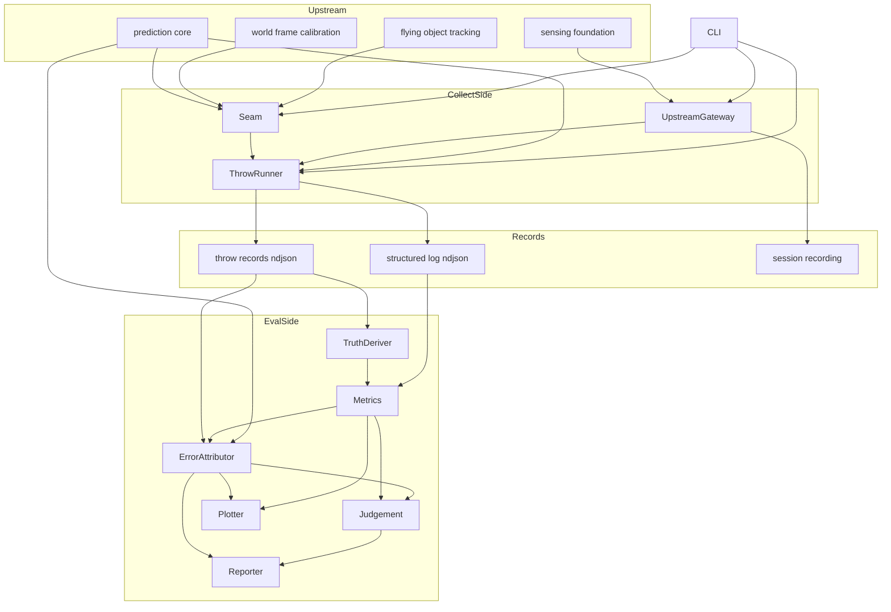
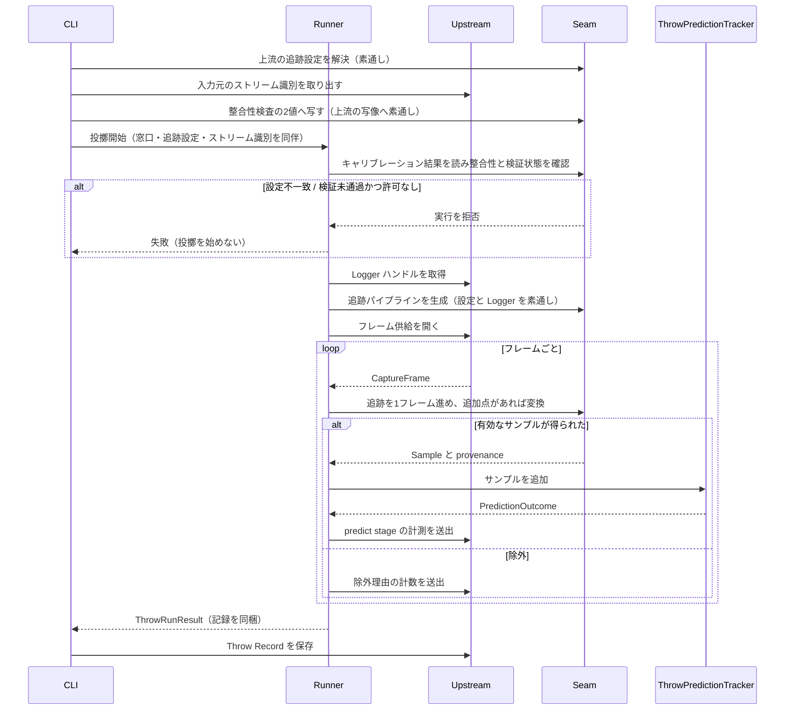
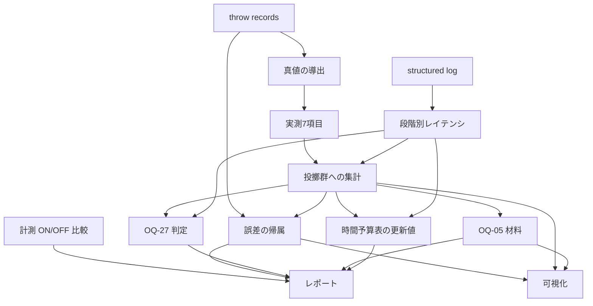
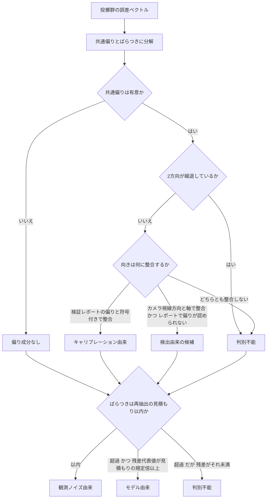

# Technical Design Document: m1-prediction-validation

## Overview

**Purpose**: 本機能は、既に仕様化・実装された部品（`sensing-foundation` / `flying-object-tracking` /
`world-frame-calibration` / `prediction-core`）を**実データで一本に繋ぎ、実際に投げて測る**。
本設計の重心は「繋ぐこと」そのものではなく、**繋いだ結果として誤差が1つの数値に潰れないようにすること**にある。
`docs/requirements.md §6.2` が警告するとおり、座標系が数 cm ずれても症状は「予測が悪い」にしか見えない。
Spec をキャリブレーション・検出・予測に分けたのは、その3つを分離可能にするためであり、
**統合 Spec がその分離可能性を壊すなら、分けた意味が消える。**

**Users**: M1 の実施者（実機で投げ、記録し、集計する）。プロジェクトの意思決定者（時間予算表の更新値と
OQ-27 の結論を受け取る）。下流としては M2 / M3（移動体に残された時間の確定値）と
`trajectory-simulator`（検出遅れ・予測誤差の較正入力）。

**Impact**: 本 Spec は **`CameraTrack` → `prediction_core.Sample` の継ぎ目**をリポジトリに初めて作る。
`flying-object-tracking` が `prediction_core` を import しない設計である以上、この継ぎ目はどの上流にも存在しない。
あわせて **OQ-27 を決着させ**、**`docs/requirements.md §3` の時間予算表を実測値で更新する**。

### Goals

- カメラ座標系の点列を World 座標系の予測入力へ変換する経路を、**単一のモジュールに閉じて**提供する（要件 1）
- 検証を通していないキャリブレーションでの実測を、**構造として拒否する**（要件 2）
- 1投擲を取得から逐次予測まで通して実行し、`prediction-core` のスキーマで記録する（要件 3）
- 実際の落下地点・落下時刻・リリース時刻の**求め方を定義し、不確かさとともに残す**（要件 4）
- M1 実測7項目を、ばらつきと試行数を伴って算出する（要件 5）
- 誤差を**キャリブレーション／検出／予測へ帰属**させ、判別不能を正常な結果として扱う（要件 6）
- 段階別レイテンシを集計し、**計測が計測対象を歪めていない**ことを確認する（要件 7）
- 落下地点を図として出し、**その依存を実機側の実行経路から締め出す**（要件 8）
- **OQ-27 を、実測前に固定した3値の規則で判断する**（要件 9）
- OQ-05 の判断材料を提示し、**決着させない**（要件 10）
- 実測値が揃ったことをゲートに、`docs/requirements.md §3` を更新する（要件 11）
- 実機と上流実装が揃う前に、継ぎ目から判断・可視化までを作り切れるようにする（要件 12）

### Non-Goals

- フレーム取得・記録・再生・構造化ロギング**基盤**（`sensing-foundation`）
- 検出方式の決定・追跡・カメラ座標系の3D位置算出（`flying-object-tracking` / OQ-26）
- 床平面推定・World frame の確立・変換の**実装**（`world-frame-calibration` / OQ-03）
- 予測アルゴリズム・Throw Record スキーマ（`prediction-core` / D-8。実装済み・変更しない）
- **予測アルゴリズムの改良。** 本 Spec は測定であって改善ではない
- 移動体に関するすべて（M2 / M3 / M4）、ESP32 への送信、テレオペ
- 投擲アーカイブ／ベンチマーク（OQ-39。本 Spec でデータが貯まってから再判断）
- **ハードウェアの置き換えの実行**（判断材料と結論の提示までを持つ）
- ブラウザ可視化（`simulator-visualization` / OQ-34）
- リポジトリ全体のディレクトリ構成（OQ-40）と Python 環境構築方針（OQ-41）の確定

> 詳細と担当先は下の [Out of Boundary](#out-of-boundary) を正とする。

---

## Boundary Commitments

### This Spec Owns

- **継ぎ目**: `CameraTrack` ＋ `WorldTransform` → `prediction_core.Sample` の変換と、
  変換に伴う除外規則・除外理由の計数（要件 1）
- **キャリブレーション検証ゲート**: 未検証結果での実測を拒否する規則と、許可時の印の付け方（要件 2）
- **1投擲の実行順序**: 取得 → 検出・追跡 → 変換 → 逐次予測 → 記録という組み立て（要件 3）
- **真値の定義**: 実際の落下地点・落下時刻・リリース時刻の求め方と、不確かさの併記規則（要件 4）
- **M1 実測7項目の算出定義**と、投擲群としての集計（要件 5）
- **誤差の帰属**: 分解の仕方、向きによる判別、判定規則（要件 6。**本 Spec の核**）
- **end-to-end レイテンシの定義**と、投擲単位への束ね直し、計測 ON/OFF 比較（要件 7）
- **可視化の内容と、可視化依存の隔離規則**（要件 8）
- **OQ-27 の判定規則と結論**（要件 9。**OQ-27 を決着させる**）
- **OQ-05 の判断材料の算出定義**（要件 10。**決着させない**）
- **`docs/requirements.md §3`（時間予算表と、そこから導出される予測レイテンシの暫定目標）の更新**（要件 11）
- **物理配置**: `src/m1_validation/**`、`tests/m1_validation/**`、
  `.kiro/specs/m1-prediction-validation/measurements.md`、同 `procedure.md`、
  ルート `pyproject.toml` への**追記**、および `docs/requirements.md §3` の更新

### Out of Boundary

- フレーム取得・ドレイン・セッション記録・再生・構造化ロギング基盤（`sensing-foundation`）
- 検出方式・マスク生成・候補絞り込み・カメラ座標系の逆投影・フレーム間追跡（`flying-object-tracking`）
- 床平面推定・World frame の確立・変換の実装・検証レポートの**算出**（`world-frame-calibration`）。
  本 Spec は検証レポートを**読むだけ**であり、合否の定義は上流が正
- フィッティング・落下地点算出・Throw Record スキーマ（`prediction-core`）
- 予測アルゴリズムの改良、カルマンフィルタ等への差し替え（測って不足が分かってから別 Spec）
- 投擲物理・合成データの物理モデル（`trajectory-simulator` / OQ-33）
- 移動体側のすべて、ESP32 への送信、目標データのプロトコル（OQ-30）
- `docs/open-questions.md` からの OQ-27 行の削除と `docs/decisions.md` への移設。
  上流 Spec と同じく**実装完了時の文書整備として別途行う**
- `docs/requirements.md` の §3 以外の節、および `docs/` の他ファイル
- `src/prediction_core/**` / `src/sensing_foundation/**` / `src/flying_object_tracking/**` /
  `src/world_frame_calibration/**` への一切の変更
- 他 Spec の `.kiro/specs/<name>/**` および `.kiro/steering/roadmap.md`

### Allowed Dependencies

- **上流4パッケージの公開入口のみ。** 内部モジュールへ直接 import しない
  - `prediction_core.__init__` の18シンボル（実行時依存ゼロ。**どの層からでも参照してよい共通語彙**）
  - `sensing_foundation.__init__` — **接点は `upstream.py` 1モジュールに限る**
  - `flying_object_tracking.__init__` / `world_frame_calibration.__init__` —
    **接点は `seam.py` 1モジュールに限る**（`runner.py` は `seam.py` 経由で使う）
- **本 Spec 自身が宣言するサードパーティ依存は `matplotlib` 1つだけ**（extras `m1-viz`）。
  それを import するのは `plot.py` 1モジュールに限る。
  **`[project].dependencies` は空のまま維持する。**
  `tests/prediction_core/test_packaging.py::test_no_third_party_runtime_dependencies` は
  `[project].dependencies == []` に加えて **extras 名が許可リストの範囲内にあること**を検証する形へ
  改訂される（許可リスト `ALLOWED_OPTIONAL_EXTRAS = {"sensing", "tracking", "calibration", "m1-viz"}`）。
  ⚠️ **この改訂は `sensing-foundation`（Wave 0）が所有し、本 Spec は同テストを再改訂しない。**
  本 Spec が必要とするのは、許可リストに **`m1-viz` が含まれていること**だけである（下記 Prerequisite 参照）
- 標準ライブラリ（`json` / `math` / `statistics` / `dataclasses` / `enum` / `pathlib` / `argparse` /
  `random` / `typing` / `collections`）
- **禁止**:
  - `prediction_core` へのサードパーティ依存の逆流、および同パッケージへの一切の変更
  - `cv2` / `pyrealsense2` / `numpy` の直接 import（前2者は上流の道具、numpy は上流 extras の中で完結させる）
  - **評価側（`truth` / `metrics` / `attribution` / `judgement` / `report` / `plot`）からの
    `sensing_foundation` / `flying_object_tracking` / `world_frame_calibration` の import**。
    評価側は**記録された値だけ**を読む（要件 12.5 を構造で保証する）
  - **実機側の実行経路（`upstream` / `seam` / `runner`）からの `plot` の import**（要件 8.8）
  - 下流 Spec（`simulator-visualization`）および `trajectory_simulator` への依存

### Prerequisites（他 Spec が先に landing している必要があるもの）

- **`tests/prediction_core/test_packaging.py` の extras 許可リスト化**（`sensing-foundation` が所有）。
  現行の同テストは `[project].optional-dependencies == {}` を主張しており、
  **本 Spec の `pyproject.toml` 追記（`m1-viz`）はこの改訂が landing した後にのみ有効**である。
  改訂前に追記すると、マージ済みの `prediction-core` テスト群が赤くなる。
  タスク1.1 の着手前に、許可リストに `m1-viz` が含まれていることを確認する
- ★ **ピンホール逆投影の基本演算の一元化**（`sensing-foundation` が所有）。
  `sensing_foundation.geometry` が `depth_raw_to_mm` / `is_valid_depth` / `deproject_pixel` を公開し、
  `flying-object-tracking` と `world-frame-calibration` が**それぞれの独自実装を捨てて同じ演算に乗る**
  （両 Spec は自分の集約方針だけを持つ）。**本 Spec はこの一元化を前提として要件 1.10 の
  クロス Spec 契約テストを書くだけであり、基本演算そのものも上流2 Spec の呼び出し側も所有しない**

### Revalidation Triggers

以下が発生した場合、本 Spec の結合と集計は再確認が必要になる。

- **上流由来**:
  - `flying_object_tracking` の `HANDOFF_VERSION` 変更、`CameraTrack` / `TrackPoint` / `CameraPoint` の
    追加以外の変更、`CoordinateFrame` の意味変更、`detect` / `track` の stage 名変更
  - `world_frame_calibration` の **World frame 定義の変更**、`CALIBRATION_FORMAT_VERSION` 変更、
    `WorldTransform` の意味論変更、検証レポートの誤差定義変更、`calibrate` stage のキー変更
  - `sensing_foundation` の `RECORDING_FORMAT_VERSION` / `LOG_FORMAT_VERSION` 変更、
    予約 stage の意味変更、Throw Record 保存レイアウトの変更、時間基準の変更
  - ★ **`sensing_foundation.geometry` のピンホール逆投影の基本演算
    （`depth_raw_to_mm` / `is_valid_depth` / `deproject_pixel`）の変更**
    （画素中心規約・`depth_scale_mm` の適用位置・無効画素判定を含む）。
    `flying_object_tracking`（3次元点の復元）と `world_frame_calibration`（床平面推定）の
    **両方が同じ演算に乗っている**ため、この変更は上流2経路の結果を同時に動かす。
    **本 Spec の帰属（`attribution.py`）は2経路が完全に一致していることを前提に成立している**ので、
    変更があれば要件 1.10 のクロス Spec 契約テストを必ず再確認する
  - `prediction_core` の `SCHEMA_VERSION` 変更、公開18シンボルの変更
- **本 Spec 由来**（下流 = M2 / M3 / `trajectory-simulator` が再確認する）:
  - `M1_EXTRA_VERSION`（Throw Record の `extra["m1"]` の形）の変更
  - **真値の求め方の変更**（外挿・内挿の定義）。実測値の意味が変わる
  - **実測7項目の算出定義の変更**
  - **判定規則の変更**（帰属・収束・OQ-27・計測 ON/OFF）
  - `docs/requirements.md §3` の更新内容

---

## 決着させる未決事項

| OQ | 決定 | 決め方 |
|---|---|---|
| **OQ-27** ★ Pi 4 継続可否 | **設計では決めない。判定規則だけを実測前に固定する。** 判定値は `continue` / `continue_with_constraints` / `insufficient` / `deferred` の4値 | `judge-oq27` が段階別レイテンシ・資源使用・改善適用履歴から規則を適用し、結論と根拠を `measurements.md` に記録する |

**OQ-27 の判定規則**（[Oq27Judge](#oq27judge) と同一。**実測前に確定させ、結果とともに記録する**）:

> **GATE 0（前提）**: `docs/development-environment.md §13.2` の改善項目（Color 削減 → 解像度 → ROI →
> fps → 画像処理削減 → PointCloud 回避 → アルゴリズム簡略化 → 最適化）のうち**未適用のものが残っている間、
> `insufficient` を出さない**。適用済み項目と前後の計測値を証跡として要求する（`tech.md` 開発標準4）。
>
> **GATE 1（試行数）**: 有効投擲数またはセッション数が設定下限に満たない場合は `deferred`。
> **投擲はばらつきが大きく再現性が低いため、単発では判断しない**。
>
> **GATE 2（入力元）**: 実機（live）由来の投擲が1件も無い場合は `deferred` とし、
> 合成・記録再生の結果を実機の結論として扱わない。
>
> 上記を通過したうえで、
> 1. **end-to-end レイテンシ p95 が、同一測定で得た実測オーバーヘッド相当値を超えない** → `continue`
> 2. 超え、かつ **CPU 使用率の飽和または取りこぼしの増加**を伴う → `insufficient`
> 3. 超えるが計算資源に余裕があり、律速段階が取得区間である → `continue_with_constraints`
>    （律速している取得条件を明示する）
> 4. 上記で決まらない → `deferred`（理由を明示）
>
> **絶対値の目標を置かない。** 比較対象は同一測定内で得た量であり、判定はばらつきと併記する
> （`tech.md` 開発標準1）。

**OQ-05 は決着させない**（要件 10）。予測側から見た成功率の上限と、必要試行数の算出のみを材料として出す。
成功率の目標値は移動体の実測（M2）が入って初めて置ける。

**未決のまま残すもの**（明示）:

- **OQ-40**（全体のディレクトリ構成）: 本 Spec は `src/m1_validation/` 1パッケージの位置だけを定める
- **OQ-41**（Python 環境構築・パッケージ管理）: 既存の `pyproject.toml` に**追記のみ**で乗る
- **OQ-01**（投擲レイアウトの定義）: 設定として外部化し、本 Spec の実測を確定の材料として提供する。
  **設計で数値を確定させない**
- **OQ-02**（対象ゴミの最終スコープ）: 空き缶 φ65 mm は M1 の仮値。設定値として分離する
- **OQ-39**（柱3 を作るか）: 本 Spec でデータが貯まってから再判断する。集計・検索機能を作らない

---

## Architecture

### Existing Architecture Analysis

- リポジトリには `src/prediction_core/`（実装済み・実行時依存ゼロ）のみが存在する。
  上流3パッケージは**仕様化済み・未実装**である
- 既存パターンとして踏襲すべきもの:
  - **公開入口（`__init__.py`）は再エクスポート専用**で、ロジックを持たない
  - 値オブジェクトは `frozen=True, slots=True` の dataclass、フィールド名に単位を含む（`_mm` / `_ms` / `_px`）
  - **無効は値、例外は呼び出し方の誤り**（`prediction_core` の方針。上流2 Spec も踏襲）
  - 判定は「**規則の説明文 ＋ 判定値 ＋ 根拠**」を同じ出力に含める（`OverheadVerdict` / `DetectorDecision`）
  - サードパーティ依存は **extras として宣言し、import する場所を1モジュールに閉じる**
    （`cv2` は `mask_ops.py`、`pyrealsense2` は live アダプタ）
  - 境界テスト（`test_boundaries.py`）で依存方向と禁止 import を**静的に固定する**
- 技術的負債として引き受けるもの: 配布名が `prediction-core` のままである（OQ-40 で解決）

### Architecture Pattern & Boundary Map

**選択したパターン**: **収集側（実機）と評価側（開発PC）を、記録を唯一の境界として分離するパイプライン。**



**Architecture Integration**:

- **境界の切れ目は「記録」である。** 収集側は実機で走り、評価側は記録だけを読む。
  評価側は上流3パッケージを import しない。これにより
  「集計・表示を Pi 上で動かさない」（`structure.md`）と「実機なしで再現できる」（要件 12.5）が
  運用規則ではなく**構造**になる
- **上流ごとの接点を1モジュールに固定する。** `sensing_foundation` は `upstream.py`、
  `flying_object_tracking` と `world_frame_calibration` は `seam.py`。
  `prediction_core` は依存ゼロの共通語彙としてどの層からも参照してよい
- **継ぎ目（`seam.py`）は本 Spec の存在理由**であり、他のどこにも変換を書かない
- **新規コンポーネントの根拠**: 継ぎ目・真値・帰属・判断・可視化は、どの上流も持っていない（`research.md` Build vs Adopt）
- **steering 準拠**: 開発標準1（未実測の数値を合否条件にしない）・3（アルゴリズムを2言語に置かない）・
  4（部品を替える前に設定とソフトで詰める）・5（計測が計測対象を歪めない）・6（Record / Replay 前提）

### Dependency Direction

```
errors → types → layout → config
                             ↓
        （収集側）  upstream ─┬→ seam → runner
                             │
        （評価側）  truth → metrics/* → attribution → judgement/* → report → plot
                                                                              ↓
                                                                             cli
```

- 各層は**左の層のみ**を import する。上向きの import は誤りとして扱う
- `prediction_core` は層に属さない共通語彙として、`types` 以降のどの層からも参照してよい
- **評価側から収集側への import は禁止**（`truth` 以降が `upstream` / `seam` / `runner` を import しない）
- **収集側から `plot` への import は禁止**
- `cli.py` は全層を参照してよい唯一のモジュールであり、ロジックを持たない

### Technology Stack

| Layer | Choice / Version | Role in Feature | Notes |
|---|---|---|---|
| 言語 | Python >= 3.11 | 全体 | 既存 `pyproject.toml` の `requires-python` に従う |
| 予測 | `prediction_core`（実装済み） | 逐次予測・Throw Record | 公開18シンボルのみ消費。**実行時依存ゼロを壊さない** |
| 入力・記録・ログ | `sensing_foundation`（extras `sensing`） | フレーム供給・NDJSON ログ・Throw Record 保存・ログ集計 | 接点は `upstream.py` |
| 検出・追跡 | `flying_object_tracking`（extras `tracking`） | カメラ座標系の点列 | 接点は `seam.py` |
| 座標変換 | `world_frame_calibration`（extras `calibration`） | World 変換・検証レポート | 接点は `seam.py`。変換を再実装しない |
| 可視化 | **matplotlib >= 3.8**（extras `m1-viz`） | 落下地点・時系列・収束・帰属の図 | **`plot.py` のみが import する。開発PC 専用** |
| 集計・判断 | 標準ライブラリのみ | 実測算出・帰属・判断 | **本 Spec の評価側は追加依存を持たない** |
| テスト | pytest（既存 `dev` グループ） | 単体・結合・E2E・境界 | 実機不要で全経路を通す |

> **本 Spec 自身が宣言するサードパーティ依存は matplotlib 1つだけである。**
> パイプライン実行に必要な numpy / OpenCV は上流 extras の中で完結しており、本 Spec は再宣言しない。

---

## File Structure Plan

### Directory Structure

```
src/m1_validation/
├── __init__.py            # 公開APIの再エクスポート専用。ロジックを持たない
├── errors.py              # 例外階層と失敗理由の列挙
├── types.py               # 値オブジェクト: SampleProvenance / ThrowSamples / TruthValue /
│                          #   ThrowTruth / ThrowMeasurement / Aggregate / Judgement /
│                          #   M1_EXTRA_VERSION と列挙型
├── layout.py              # ThrowLayout（投擲位置・方向・待機位置・対象物寸法・リリース高さ）
│                          #   OQ-01 / OQ-02 の仮値の置き場。数値をコードへ埋め込まない
├── config.py              # M1Settings（判定規則の閾値・下限・出力先）と解決順序
├── upstream.py            # sensing_foundation との唯一の接点。フレーム入力・セッション時計・
│                          #   構造化ログ・Throw Record 保存・ログ集計の委譲
├── seam.py                # ★ flying_object_tracking / world_frame_calibration との唯一の接点。
│                          #   CameraTrack + CalibrationResult → Sample 列 + provenance。
│                          #   検証ゲートもここに置く
├── runner.py              # 1投擲の実行（取得 → 追跡 → 継ぎ目 → 逐次予測 → 記録）と計測点
├── truth.py               # 真値の受け取り・導出（落下地点=実測 / 落下時刻=内挿 / リリース=外挿）
├── metrics/
│   ├── __init__.py
│   ├── flight.py          # 実測項目 1 / 2 / 6（総飛行時間・リリース〜検出開始・狙い誤差）
│   ├── accuracy.py        # 実測項目 4 / 5（落下地点誤差・落下時刻誤差の系列）
│   ├── convergence.py     # 実測項目 7（有効サンプル数・収束サンプル数と判定規則）
│   ├── latency.py         # 実測項目 3 ＋ §13.1（段階別・end-to-end・資源）の集計
│   └── aggregate.py       # 投擲群への束ね直し（代表値・ばらつき・試行数・暫定印）
├── attribution.py         # ★ 誤差の帰属（共通偏り / ばらつき、World 固定 vs カメラ視線方向）
├── judgement/
│   ├── __init__.py
│   ├── budget.py          # 時間予算表の更新値の算出（§3 更新の入力。ゲート付き）
│   ├── oq27.py            # Pi 4 継続可否の判定規則と適用
│   └── oq05.py            # NFR-7 の目標値・試行回数 N の判断材料
├── bench.py               # 計測 ON/OFF 比較（上流と同じ判定基準の形。タスク6.4で bench.py として実装。
                           #   design.md の OverheadBench 節は擬似コード無しで着手したため、公開面は
                           #   上流2実装の形を踏襲して起こした）
├── report.py              # 人間可読の要約 ＋ 機械可読 JSON
├── plot.py                # ★ matplotlib を import する唯一の場所。開発PC 専用
└── cli.py                 # run-throw / ingest-truth / measure / attribute / judge-oq27 /
                           #   material-oq05 / budget / bench-overhead / report / plot

tests/m1_validation/
├── conftest.py            # 共通フィクスチャ（一時ディレクトリ・既定設定・既定レイアウト）
├── synthetic.py           # 既知の放物軌道 → CameraTrack / Throw Record の合成器（テストツリーに置く）
├── fakes.py               # 上流公開型を模した最小ダブル（CameraTrack / CalibrationResult / ログ）
├── test_types.py
├── test_layout.py
├── test_config.py
├── test_seam.py           # 変換の正しさ・座標系不一致・形式版・除外理由の計数
├── test_seam_gate.py      # 未検証キャリブレーションの拒否と、許可時の印
├── test_deprojection_contract.py  # ★ クロス Spec 契約: 追跡側とキャリブレーション側の
│                          #   逆投影が同一入力に対して完全一致すること（要件 1.10）
├── test_upstream.py       # 上流ダブルでの委譲（フレーム・ログ・保存）
├── test_runner.py         # 1投擲の実行順序・逐次予測・記録・失敗投擲の扱い
├── test_truth.py          # 内挿・外挿・欠測・不確かさの併記
├── test_metrics_flight.py
├── test_metrics_accuracy.py
├── test_metrics_convergence.py   # 収束判定規則
├── test_metrics_latency.py       # 未知 stage の読み取りと end-to-end の定義
├── test_aggregate.py             # 代表値・ばらつき・試行数下限・暫定印
├── test_attribution.py           # ★ 注入した既知の原因を指すこと
├── test_judgement_oq27.py        # GATE 0/1/2 と4値の分岐
├── test_judgement_oq05.py
├── test_budget.py                # 実測値が揃うまで更新しないゲート
├── test_m1_bench.py       # test_overhead.py ではない。design.md 未記載の衝突回避規約に揃えた
                           #   （tasks.md「Implementation Notes」参照）
├── test_report.py
├── test_plot.py                  # 依存が無い環境での縮退を含む
├── test_cli.py
├── test_e2e_synthetic.py         # 合成入力で継ぎ目から判断まで通す
├── test_determinism.py           # 同一入力に同一の集計値と同一の判定
└── test_boundaries.py            # 依存方向・上流 import 集中・評価側の隔離・plot 隔離
```

### Modified Files

- `pyproject.toml` — `[tool.hatch.build.targets.wheel].packages` に `src/m1_validation` を**追記**する。
  `[project.optional-dependencies]` に **`m1-viz = ["matplotlib>=3.8"]`** を**追記**する。
  **`[project].dependencies` は空のまま変更しない**。
  ⚠️ **この追記は、`tests/prediction_core/test_packaging.py` の extras 許可リスト化
  （`sensing-foundation` 所有・`ALLOWED_OPTIONAL_EXTRAS` に `m1-viz` を含む）が landing した後にのみ有効**である
  （「Prerequisites」参照）。**本 Spec は同テストを改変しない**。
  ⚠️ **上流3 Spec が同じファイルを追記する。既存行を書き換えず、衝突時は両方の追記を残す**
- `docs/requirements.md` — **§3 の時間予算表**を実測値の列を持つ形へ更新し、
  区間2 を「検出開始〜**初回予測**」と読み替える。あわせて**表から導出されている NFR-3 の暫定目標**を
  更新後の表と整合させる。**§3 以外の節を書き換えない。導出根拠と ⚠️ 注記を削らない**（要件 11）
- `.kiro/specs/m1-prediction-validation/procedure.md` — **新規**。投擲実験の手順書
  （レイアウトの固定、キャリブレーション検証の先行、真値の測り方、試行数、記録の持ち帰り）
- `.kiro/specs/m1-prediction-validation/measurements.md` — **新規**。実測7項目・帰属・段階別レイテンシ・
  改善適用履歴・**OQ-27 の結論と根拠**・OQ-05 の材料を人が読む形で記録する
  （生データは `var/` 配下で版管理しない）

> `src/prediction_core/**` / `src/sensing_foundation/**` / `src/flying_object_tracking/**` /
> `src/world_frame_calibration/**` は**一切変更しない**。
> `.gitignore` は編集しない（`var/` は `sensing-foundation` が追加する。本 Spec の出力は `var/m1/` に置く）。

---

## System Flows

### 1投擲の実行（収集側・実機）



**流れ上の決定**:
- **検証ゲートは投擲を始める前に評価する。** 走らせてから拒否すると実験時間を捨てることになる。
  **整合性検査を検証ゲートより先に置く**——両方が成り立たないとき「未検証だから」とだけ言われると、
  解像度を戻さないまま許可フラグで押し通してしまう
- **調達と実行を分ける。** 上流由来の値（追跡設定・ストリーム識別）を用意するのは入口の責務、
  それを解釈せず素通しするのが実行層の責務である。**Logger だけは入口が持ち回らない**——
  取り出せるのは接点だけであり、入口が空呼びして持ち回るのは死にコードになる
- **記録の保存は入口が行う**（実行と保存を分けることで、記録先の決定を入口に集約できる）
- 追跡が1点も出さなかった投擲は**失敗として理由付きで記録**し、成功試行の集計から除く（要件 3.8）
- 計測の送出は fire-and-forget（上流のロガーに委譲）。**予測経路の中で集計しない**（`tech.md` 開発標準5）

### 評価と判断（評価側・開発PC）



**流れ上の決定**:
- **`BUDGET` は実測値の存在をゲートとする**（要件 11.1）。揃わない場合は更新値を出さずに欠測を返す
- `OQ27` は `BUDGET` に依存しない（時間予算表が未更新でも判定できる）が、
  **GATE 0 / 1 / 2 を通らなければ `deferred` を返す**
- **`ATTR` は集計だけでは足りない。** カメラ視線方向・フィット残差・落下地点の真値・検証レポート要約は
  `ThrowAggregate` に無いので、**記録そのものも受け取る**
- ⚠️ **`REPORT` は文書を書き換えない。** `docs/requirements.md` の更新は、値を見た人が差分を目で確認して
  行う実機タスクの仕事である（`BudgetUpdater` の「値を算出するだけ」と同じ規律）

### 誤差帰属の判定（要件 6）



**流れ上の決定**:
- **判別不能は正常な結果**である（要件 6.10）。無理に一つの原因へ割り当てると、
  OQ-27 や時間予算の判断まで誤らせる
- 偏りとばらつきは**独立に判定する**。両方が同時に存在しうる
- **縮退の判定は向きの判定より先に置く**（順序が load-bearing である）。
  投擲位置が1箇所だと World 固定方向とカメラ視線方向が一致してしまい、
  先に向きを見ると「キャリブレーション由来」と断定してしまう
- **符号の扱いが左右で違う。** 検証レポートとは**符号付き**（較正のずれは World 上で符号を保つ）、
  カメラ視線とは**軸**（Depth が対象物のカメラ側表面を測る寄りは視線とは逆を向く）
- **レポートの偏りは3値**（認められる / 認められない / **測っていない**）。
  「測っていない」を「認められない」と同一視すると、検証していないだけの群が検出由来へ倒れる

---

## Requirements Traceability

| Requirement | Summary | Components | Interfaces | Flows |
|---|---|---|---|---|
| 1.1-1.3, 1.7-1.9 | 継ぎ目の変換と除外 | Seam | `build_samples` | 1投擲の実行 |
| 1.4-1.6 | 座標系・形式版・設定の不一致 | Seam, Errors | `build_samples` / `SeamFailure` | 1投擲の実行 |
| 1.10 | 上流2経路の逆投影一致（クロス Spec 契約）★ | Seam, integration tests | `deproject_pixel`（上流公開入口） | 1投擲の実行 |
| 2.1-2.5 | 検証ゲートと印 | CalibrationGate（Seam 内）, ThrowRunner | `open_calibration` | 1投擲の実行 |
| 3.1-3.2, 3.6-3.8 | 実行と逐次予測 | ThrowRunner, UpstreamGateway | `run_throw` | 1投擲の実行 |
| 3.3-3.5 | Throw Record への記録 | ThrowRunner, M1Types | `M1_EXTRA_VERSION` / `extra["m1"]` | 1投擲の実行 |
| 4.1-4.7 | 真値の定義と不確かさ | TruthDeriver | `derive_truth` / `ThrowTruth` | 評価と判断 |
| 5.1-5.2, 5.6 | 実測項目 1 / 2 / 6 | FlightMetrics | `measure_flight` | 評価と判断 |
| 5.3-5.5 | 実測項目 3 / 4 / 5 | AccuracyMetrics, LatencyAggregator | `measure_accuracy` / `aggregate_latency` | 評価と判断 |
| 5.7-5.8 | 実測項目 7 と収束規則 | ConvergenceAnalyzer | `analyze_convergence` | 評価と判断 |
| 5.9-5.11 | 集計・試行数下限・想定との併置 | ThrowAggregator, Reporter | `aggregate` | 評価と判断 |
| 6.1-6.11 | 誤差の帰属 ★ | ErrorAttributor | `attribute` / `AttributionResult` | 帰属の判定 |
| 7.1-7.4, 7.9 | 段階別・end-to-end 集計 | LatencyAggregator, UpstreamGateway | `aggregate_latency` | 評価と判断 |
| 7.5-7.8 | 計測 ON/OFF 比較 | OverheadBench | `run_overhead` | — |
| 8.1-8.7, 8.10 | 可視化の内容 | Plotter | `plot_*` | 評価と判断 |
| 8.8-8.9 | 可視化依存の隔離と縮退 | Plotter, CLI | `plot` サブコマンド | — |
| 9.1-9.11 | OQ-27 の判断 ★ | Oq27Judge | `judge_oq27` / `Judgement` | 評価と判断 |
| 10.1-10.5 | OQ-05 の材料 | Oq05Material | `oq05_material` | 評価と判断 |
| 11.1-11.8 | 時間予算表の更新 | BudgetUpdater, Reporter | `compute_budget_update` | 評価と判断 |
| 12.1-12.6 | 実機非依存と再現性 | 全コンポーネント, tests | 合成器・最小ダブル | — |
| 13.1-13.9 | 境界・依存・設定 | M1Settings, ThrowLayout, boundaries test | `M1Settings.resolve` / `describe` | — |

---

## Components and Interfaces

| Component | Layer | Intent | Req Coverage | Key Dependencies (P0/P1) | Contracts |
|---|---|---|---|---|---|
| Errors | L0 | 失敗理由の列挙と例外階層 | 1.4, 1.5, 1.6, 2.1 | — | State |
| M1Types | L0 | 値オブジェクトと共通の判定結果の形 | 1.8, 3.3, 4.4, 9.1 | prediction_core (P0) | State |
| ThrowLayout | L1 | 投擲レイアウトの外部化（OQ-01 / OQ-02 の仮値） | 4.3, 5.6, 13.8 | M1Types (P0) | State |
| M1Settings | L1 | 設定の解決と起動時検証 | 5.10, 9.9, 13.5, 13.6, 13.7 | ThrowLayout (P0) | Service, State |
| UpstreamGateway | L2 | `sensing_foundation` との唯一の接点 | 3.1, 3.6, 7.1, 7.3, 7.4 | sensing_foundation (P0) | Service |
| Seam ★ | L2 | `CameraTrack` → `Sample`、検証ゲート | 1.1-1.9, 2.1-2.3 | flying_object_tracking (P0), world_frame_calibration (P0), prediction_core (P0) | Service |
| ThrowRunner | L3 | 1投擲の実行と記録 | 3.1-3.8, 2.3, 7.4 | Seam (P0), UpstreamGateway (P0) | Service, Batch |
| TruthDeriver | L4 | 真値の受け取りと導出 | 4.1-4.7 | prediction_core (P0) | Service |
| FlightMetrics | L5 | 実測項目 1 / 2 / 6 | 5.1, 5.2, 5.6 | TruthDeriver (P0), ThrowLayout (P0) | Service |
| AccuracyMetrics | L5 | 実測項目 4 / 5 | 5.4, 5.5 | TruthDeriver (P0) | Service |
| ConvergenceAnalyzer | L5 | 実測項目 7 と収束規則 | 5.7, 5.8 | M1Settings (P0) | Service |
| LatencyAggregator | L5 | 実測項目 3 ＋ §13.1 | 5.3, 7.1-7.4, 7.9 | UpstreamGateway の集計 (P1) | Service, Batch |
| ThrowAggregator | L5 | 投擲群への束ね直し | 5.9, 5.10, 2.5 | 各 Metrics (P0) | Service |
| ErrorAttributor ★ | L6 | 誤差の帰属 | 6.1-6.11 | ThrowAggregator (P0) | Service |
| BudgetUpdater | L7 | 時間予算表の更新値（ゲート付き） | 11.1-11.8 | ThrowAggregator (P0) | Service |
| Oq27Judge ★ | L7 | Pi 4 継続可否の判定 | 9.1-9.11 | LatencyAggregator (P0), ThrowAggregator (P0) | Service |
| Oq05Material | L7 | NFR-7 の判断材料 | 10.1-10.5 | AccuracyMetrics (P0) | Service |
| OverheadBench | L7 | 計測 ON/OFF 比較 | 7.5-7.8 | ThrowRunner (P0) | Batch |
| Reporter | L8 | 要約と機械可読出力 | 5.11, 6.9, 9.4, 10.4, 11.2 | 上位すべて (P0) | Batch |
| Plotter | L8 | 落下地点ほかの図 | 8.1-8.10 | matplotlib (P1) | Batch |
| CLI | L9 | 実行入口 | 12.6, 13.5 | 全層 (P0) | Batch |

### L0-L1: 型・レイアウト・設定

#### Errors

| Field | Detail |
|---|---|
| Intent | 失敗を識別可能な理由付きで表し、呼び出し方の誤りと観測の不成立を区別する |
| Requirements | 1.4, 1.5, 1.6, 2.1 |

**Responsibilities & Constraints**

- 上流の方針（**無効は値、例外は呼び出し方の誤り**）を踏襲する。ただし
  **「継ぎ目が成立しない」は例外**とする。座標系や形式版が食い違ったまま値が下流へ流れること自体が事故である
- 失敗理由を列挙する: `FRAME_MISMATCH`（座標系不一致）/ `UNKNOWN_HANDOFF_VERSION` /
  `UNKNOWN_CALIBRATION_VERSION` / `PROFILE_MISMATCH` / `CALIBRATION_NOT_VERIFIED` /
  `NO_VALID_SAMPLE` / `TRUTH_MISSING` / `INSUFFICIENT_TRIALS` / `UNKNOWN_RECORD_SCHEMA`
- 例外には**実測値と判定に用いた基準**を載せる文脈情報を持たせる

**Contracts**: State [x]

**Implementation Notes**

- Integration: 基底例外 `M1ValidationError` の下に、設定・入力の誤り（`M1ConfigError`）と
  継ぎ目の不成立（`SeamFailure`）を置く
- Risks: 「拒否」を例外にすると実験中に落ちる。**投擲の前に評価する**設計（System Flows）で緩和する

#### M1Types

| Field | Detail |
|---|---|
| Intent | 値オブジェクトと、すべての判断が載る共通の形を定義する |
| Requirements | 1.8, 3.3, 4.4, 5.9, 6.9, 9.1 |

**Responsibilities & Constraints**

- すべて `frozen=True, slots=True` の dataclass。距離 mm / 時刻 ms / 角度 deg をフィールド名に含める
- **判断はすべて `Judgement` という共通の形に載せる**（`research.md` Generalization）。
  規則の説明文を結果と同じ場所に持たせることで、「どの基準で判断したか」が結果から離れない
- **真値はすべて `TruthValue` という共通の形に載せる**（値・求め方・不確かさ）

**Contracts**: State [x]

##### State Management

```python
M1_EXTRA_VERSION: str = "1.0"     # ThrowRecord.extra["m1"] の形の版

class TruthMethod(StrEnum):
    MEASURED = "measured"          # メジャー等による実測
    INTERPOLATED = "interpolated"  # 観測点の内挿
    EXTRAPOLATED = "extrapolated"  # 推定軌道の外挿
    EXTERNAL_MARK = "external_mark"  # 外部の合図
    MISSING = "missing"

class SampleReject(StrEnum):
    NOT_FINITE = "not_finite"
    BELOW_FLOOR = "below_floor"
    DEPTH_SPREAD_TOO_LARGE = "depth_spread_too_large"
    INSUFFICIENT_VALID_PIXELS = "insufficient_valid_pixels"

class Attribution(StrEnum):
    CALIBRATION = "calibration"
    DETECTION = "detection"
    PREDICTION = "prediction"
    OBSERVATION_NOISE = "observation_noise"
    NONE = "none"
    UNDETERMINED = "undetermined"

class Oq27Verdict(StrEnum):
    CONTINUE = "continue"
    CONTINUE_WITH_CONSTRAINTS = "continue_with_constraints"
    INSUFFICIENT = "insufficient"
    DEFERRED = "deferred"

@dataclass(frozen=True, slots=True)
class TruthValue:
    """真値。値だけでなく求め方と不確かさを必ず伴う（要件 4.4）。"""
    value: float | tuple[float, float, float] | None
    method: TruthMethod
    uncertainty_mm: float | None      # 位置の真値のとき
    uncertainty_ms: float | None      # 時刻の真値のとき
    source: str                       # 測り方の記述。必須（要件 4.1）

@dataclass(frozen=True, slots=True)
class SampleProvenance:
    """Sample に入れられない観測品質。samples と同じ順序・同じ長さで保持する。"""
    frame_index: int
    frame_seq: int
    valid_depth_px: int
    depth_spread_mm: float
    apparent_diameter_px: float
    expected_diameter_px: float
    rivals: int
    gap_before: int
    camera_ray_unit: tuple[float, float, float]   # World 系で表したカメラ視線方向（要件 6.3）

@dataclass(frozen=True, slots=True)
class ThrowSamples:
    """継ぎ目の出力（要件 1.1 / 1.8）。"""
    samples: tuple[Sample, ...]                   # prediction_core.Sample
    provenance: tuple[SampleProvenance, ...]      # len は samples と一致（不変条件）
    rejected: tuple[tuple[SampleReject, int], ...]
    handoff_version: str
    calibration_id: str
    verification_state: str
    verified: bool                                # False なら全生成物に印が付く（要件 2.2）

@dataclass(frozen=True, slots=True)
class Judgement:
    """すべての判断が載る共通の形（要件 5.8 / 6.1 / 9.1）。"""
    question: str                  # 例: "OQ-27" / "convergence" / "attribution"
    criterion: str                 # 実測前に固定した規則の説明文
    verdict: str
    rationale: str
    evidence: Mapping[str, object]
    provisional: bool              # 試行数下限未達・実機以外の入力など
```

- Preconditions: `len(samples) == len(provenance)`
- Invariants: `TruthValue.source` は空文字列を許さない。`Judgement.criterion` は空文字列を許さない

**Implementation Notes**

- Integration: `Sample` / `SourceKind` / `Prediction` 等は `prediction_core` の公開入口から参照し、**再定義しない**
- Validation: 生成時に検証しない（上流3 Spec と同じ方針）。検証は各サービスの境界で行う
- Risks: `provenance` を添字で対応させる設計は壊れやすい。**長さ一致をテストで固定する**

#### ThrowLayout

| Field | Detail |
|---|---|
| Intent | 投擲レイアウトを設定として外部化し、数値をコードへ埋め込まない |
| Requirements | 4.3, 5.6, 13.7, 13.8, 13.9 |

**Contracts**: State [x]

```python
@dataclass(frozen=True, slots=True)
class ThrowLayout:
    layout_id: str
    release_position_world_mm: tuple[float, float, float] | None  # 分かる場合のみ
    release_height_mm: float                # リリース時刻の外挿に使う高さ（要件 4.3）
    throw_direction_deg: float              # World +X からの角度
    standby_position_world_mm: tuple[float, float]   # 待機位置（狙い誤差の基準。要件 5.6）
    object_diameter_mm: float               # 空き缶 φ65。OQ-02 の仮値
    aperture_diameter_mm: float             # 開口 φ200。NFR-5 の窓の算出に使う
    camera_position_world_mm: tuple[float, float, float]  # カメラ視線方向の算出に使う（要件 6.3）
    notes: str

    @property
    def position_tolerance_mm(self) -> float:
        """NFR-5 の暫定許容窓 = 開口半径 − 対象寸法/2。**合否条件ではない**。"""
```

- Invariants: `release_height_mm > 0`、`object_diameter_mm < aperture_diameter_mm`

**Implementation Notes**

- Integration: レイアウトは JSON ファイルとして与える。**投擲位置を2箇所以上にできる形**にしておく
  （`research.md` Decision 4 の縮退対策）
- Risks: `position_tolerance_mm` が合否条件として一人歩きしやすい。
  **docstring と図の注記に「暫定目標値」と明記する**（要件 8.3）

#### M1Settings

| Field | Detail |
|---|---|
| Intent | 判定規則の閾値・下限・出力先を、既定 → ファイル → 環境変数 → 実行時指定の順で解決する |
| Requirements | 5.10, 9.9, 13.5, 13.6, 13.7 |

**Contracts**: Service [x] / State [x]

```python
@dataclass(frozen=True, slots=True)
class SeamConfig:
    require_verified_calibration: bool = True   # 要件 2.1。**既定で拒否**
    min_valid_depth_px: int = 8
    max_depth_spread_mm: float = 200.0
    floor_margin_mm: float = -50.0              # これより下は床面下として除外

@dataclass(frozen=True, slots=True)
class ConvergenceConfig:
    band_mm: float | None = None   # None ならレイアウトの暫定許容窓に揃える（要件 5.8）
    require_monotonic_tail: bool = True

@dataclass(frozen=True, slots=True)
class AttributionConfig:
    bootstrap_iterations: int = 200
    bootstrap_seed: int = 0                     # 決定性のため固定（要件 12.4）
    direction_agreement_deg: float = 30.0       # 向きが整合するとみなす角度差
    bias_significance_ratio: float = 1.0        # 共通偏りの大きさ / ばらつきの比の下限
    residual_significance_ratio: float = 1.0    # 規則6 の残差比（自己言及の解消。タスク5.2）
    range_band_mm: float = 500.0                # 距離帯の幅。固定幅・データ非依存（要件 6.11）

@dataclass(frozen=True, slots=True)
class Oq27Config:
    cpu_saturation_ratio: float = 0.9           # 使用率の満量（100%）に対する割合
    fps_shortfall_ratio: float = 0.95           # 実処理 fps / 取得 fps の下限

@dataclass(frozen=True, slots=True)
class Oq05Config:
    confidence_level: float = 0.95
    interval_widths: tuple[float, ...] = (0.2, 0.1, 0.05)

@dataclass(frozen=True, slots=True)
class BudgetConfig:
    segment3_assumed_ms: float = 50.0           # ⚠️ 実測値ではない据え置き（要件 11.4）

@dataclass(frozen=True, slots=True)
class OverheadConfig:
    cycles: int = 5                             # A/B/A/B の巡回数
    min_samples: int = 30

@dataclass(frozen=True, slots=True)
class TrialLimits:
    min_valid_throws: int = 20        # 暫定。OQ-05 の「最低20回程度」に揃えた出発点
    min_sessions: int = 2
    require_live_source: bool = True  # OQ-27 の GATE 2

@dataclass(frozen=True, slots=True)
class M1Settings:
    layout: ThrowLayout
    seam: SeamConfig
    convergence: ConvergenceConfig
    attribution: AttributionConfig
    oq27: Oq27Config
    oq05: Oq05Config
    budget: BudgetConfig
    overhead: OverheadConfig
    trials: TrialLimits
    improvements_applied: tuple[str, ...] = ()   # §13.2 の適用済み項目（要件 9.4）
    output_root: Path = Path("var/m1")

    @classmethod
    def resolve(cls, *, file: Path | None, env: Mapping[str, str],
                overrides: Mapping[str, object]) -> "M1Settings": ...
    def describe(self) -> dict[str, object]: ...   # --print-settings（要件 13.5）
```

- Preconditions: `bootstrap_iterations > 0`、`0 < direction_agreement_deg < 90`、`min_valid_throws > 0`
- Postconditions: 解決後の設定は不変。実行中に変更されない

**Implementation Notes**

- Integration: 環境変数は `STB_M1_` 接頭辞（上流の `STB_SF_` / `STB_FOT_` と衝突しない）
- Validation: 不正は**起動時**に拒否する（要件 13.6）
- Risks: `min_valid_throws=20` / `band_mm` / `direction_agreement_deg` / `residual_significance_ratio` /
  `range_band_mm` / `cpu_saturation_ratio` / `fps_shortfall_ratio` / `confidence_level` /
  `interval_widths` / `segment3_assumed_ms` / `cycles` / `min_samples` は**暫定の評価候補**であり、
  必須性能ではない。`--help` と docstring に明記する（要件 13.7、`tech.md` 開発標準1）
- Risks: ⚠️ **`require_live_source` の説明と効き先が食い違っている。** 上の docstring は
  「OQ-27 の GATE 2」と呼ぶが、[決着させる未決事項](#決着させる未決事項) の GATE 2 とタスク箇条は
  どちらも**無条件**（実機由来の投擲が無ければ保留）であり、実装も無条件である。
  当該設定が実際に支配しているのは `ThrowAggregator` の暫定印だけである。**説明を整理すること**

### L2: 上流との接点

#### UpstreamGateway

| Field | Detail |
|---|---|
| Intent | `sensing_foundation` との唯一の接点。フレーム供給・時計・ログ・保存・集計を委譲する |
| Requirements | 3.1, 3.6, 7.1, 7.3, 7.4, 7.9 |

**Responsibilities & Constraints**

- **`sensing_foundation` を import する唯一のモジュール**である
- 予約 stage（`system` / `capture` / `record`）と衝突しない**独自 stage `predict` と `m1`** を足す
- **集計を実機上で常時実行する前提を持たない**（要件 7.9）。集計はログファイルを読むだけ
- **`Logger` オブジェクトそのものを取り出す入口 `get_logger_handle()` を持つ。**
  上流の `TrackingPipeline.__init__` が `Logger` を要求するため、`emit` のような
  関数形の委譲だけでは足りない。取り出した `Logger` は**本 Spec のどの層も解釈せず**、
  `cli.py` が受け取って `Seam.open_tracking()` へ素通しするだけの**不透明値**として扱う
  （`sensing_foundation` の接点を1モジュールに閉じたまま、上流の要求を満たすための最小の穴）

**Dependencies**

- Inbound: ThrowRunner（P0）, CLI（P0）
- Outbound: —
- External: `sensing_foundation` 公開入口（P0）

**Contracts**: Service [x]

```python
def open_frames(settings, source_spec) -> Iterator["CaptureFrame"]: ...
def session_clock_ms() -> float: ...            # end-to-end の基準（要件 7.2）
def emit(stage: str, event: str, data: Mapping[str, object]) -> None: ...
def get_logger_handle() -> object: ...          # sensing_foundation の Logger を不透明値として渡す
def store_record(record: "ThrowRecord", path: Path) -> None: ...
def load_records(path: Path) -> Iterator["ThrowRecord"]: ...
def summarize_stages(log_path: Path, stages: Sequence[str] | None) -> Mapping[str, object]: ...
```

- Preconditions: `emit` の `stage` は `system` / `capture` / `record` 以外
- Postconditions: `store_record` は `prediction_core` のスキーマをそのまま用い、再定義しない。
  `get_logger_handle` の戻り値は本 Spec の型ではなく、**属性アクセスも型検査も行わない**
- ⚠️ **上流依存**: `Logger` が `sensing_foundation` の公開入口に含まれることを前提とする。
  `sensing-foundation` 側は本バッチで並行して編集され、`Logger` を公開入口に含めることが保証される

**Implementation Notes**

- Integration: ログ集計は上流の集計器へ委譲する。**集計器を二重に持たない**（`research.md` Decision 7）。
  未知の stage も読めるという上流の性質にそのまま乗る（要件 7.3）
- Validation: Throw Record 読み出し時に `schema_version` を `prediction_core.SCHEMA_VERSION` と照合する
- Risks: 上流未実装の期間は、公開型を模した最小ダブルで検証する。**本体にダブルを置かない**

#### Seam ★

| Field | Detail |
|---|---|
| Intent | カメラ座標系の点列を World 座標系の予測入力へ変換する。**本 Spec の存在理由** |
| Requirements | 1.1-1.9, 2.1, 2.2, 2.3 |

**Responsibilities & Constraints**

- **`flying_object_tracking` と `world_frame_calibration` を import する唯一のモジュール**である
- **座標変換を再実装しない。** 上流の `WorldTransform.apply_point` を呼ぶだけ（要件 1.2）
- **時刻を再基準化しない。** `TrackPoint.point.t_ms` をそのまま `Sample.t_ms` にする（要件 1.3）
- **単位変換を挟まない。** 上流・下流ともに mm / ms で一致している
- 変換前に**検証ゲート**を評価する（要件 2.1 / 2.2）
- 生成した `Sample` と同じ順序・同じ長さの `SampleProvenance` を返す（要件 1.8）
- **カメラ固有の型・画素座標・カメラパラメータを `Sample` の側へ出さない**（要件 1.9）
- ★ **上流2経路の逆投影が一致していることを、本 Spec がクロス Spec 契約として検証する**（要件 1.10）。
  `flying_object_tracking`（3次元点の復元）と `world_frame_calibration`（床平面推定）は、
  バッチ決定により**どちらも `sensing_foundation.geometry` の
  `depth_raw_to_mm` / `is_valid_depth` / `deproject_pixel` に乗る**。
  **両方を import する正当な理由を持つのは本 Spec だけ**であるため、
  2経路が同一入力に対して**完全に同一の値**を返すことを確かめられるのもここだけである。
  仮に両者がずれると、そのずれは共通の偏りとして現れ、
  **「予測が悪い」という単一の症状に潰れる**（`docs/requirements.md §6.2` が警告する失敗そのもの）

**Dependencies**

- Inbound: ThrowRunner（P0）, CLI（P0）
- Outbound: M1Types（P0）, M1Settings（P0）, Errors（P0）
- External: `flying_object_tracking` 公開入口（P0）, `world_frame_calibration` 公開入口（P0）,
  `prediction_core` 公開入口（P0）

**Contracts**: Service [x]

##### Service Interface

```python
def open_calibration(path: Path, *, settings: M1Settings,
                     signature: object, intrinsics: object,
                     allow_unverified: bool = False) -> "CalibrationResult":
    """キャリブレーション結果を読み、検証ゲートと整合性検査を通す。

    Raises:
        SeamFailure(UNKNOWN_CALIBRATION_VERSION): 形式版が未知
        SeamFailure(PROFILE_MISMATCH): ストリーム設定・内部パラメータが不一致
        SeamFailure(CALIBRATION_NOT_VERIFIED): 検証未通過かつ allow_unverified が False
    """

def build_samples(track: "CameraTrack", calibration: "CalibrationResult",
                  *, settings: M1Settings) -> ThrowSamples:
    """カメラ座標系の点列を World 座標系のサンプル列へ変換する。

    Raises:
        SeamFailure(FRAME_MISMATCH): track.frame がカメラ座標系でない
        SeamFailure(UNKNOWN_HANDOFF_VERSION): handoff_version が未知
    """

def camera_ray_unit(calibration: "CalibrationResult",
                    point_world_mm: tuple[float, float, float]) -> tuple[float, float, float]:
    """World 系で表した、カメラから当該点へ向かう単位ベクトル（要件 6.3 の材料）。"""

def resolve_tracking_settings(*, config_path: Path | None,
                              env: Mapping[str, str],
                              overrides: Mapping[str, object]) -> "TrackingSettings":
    """上流の `TrackingSettings.resolve()` への素通し。

    上流の署名は `resolve(cls, *, file, env, overrides)` で**3つとも必須**である。
    本関数が `config_path` だけを受け取って `env` / `overrides` を内部で空に
    埋めると、上流側の環境変数と CLI 上書きが**黙って捨てられる**。
    本 Spec の CLI は「CLI 引数 > 環境変数 > 設定ファイル > 既定値」を掲げているため、
    3つとも呼び出し元（`cli.py`）から受け取り、そのまま渡す。

    `cli.py` が `run_throw` へ渡す値を調達するための入口である。**本 Spec は追跡の
    設定値を一切決めない**（既定値も持たない）。この関数が存在するのは、
    `flying_object_tracking` を import するのが `seam.py` だけという境界を保ったまま、
    `cli.py` が上流の解決結果を手に入れられるようにするためだけである。
    """

def open_tracking(settings: M1Settings, tracking_settings: "TrackingSettings",
                  logger: object) -> "TrackingPipeline":
    """上流の追跡パイプラインを生成して返す。

    `ThrowRunner` が追跡を1フレームずつ進めるための入口である。**この関数が存在する
    ことで `runner.py` は `flying_object_tracking` を import せずに済み、検出・追跡
    パッケージとの接点が本モジュールだけに保たれる**（design.md Allowed Dependencies）。

    上流の `TrackingPipeline.__init__(settings: TrackingSettings, logger: Logger)` は
    **本 Spec が生成できない2つの値**を要求する。したがって本関数は両方を**引数として
    受け取り、そのまま渡すだけ**にする。

    - ``tracking_settings``: `flying_object_tracking.TrackingSettings`。
      **これを調達するのは `cli.py` であり、調達手段は上記 `resolve_tracking_settings()` に限る**
      （`cli.py` は全層を参照してよい唯一のモジュールだが、`flying_object_tracking` を
      直接 import しないため継ぎ目経由で受け取る）。
      本 Spec は追跡の設定・方式を決めない（OQ-26 は上流の担当）。
      **設定オブジェクトを素通しすることは方式を決めることではない**
    - ``logger``: `sensing_foundation` の `Logger`。本 Spec の型ではないため
      `object` として受け、**中身を解釈しない**。取得は `UpstreamGateway.get_logger_handle()`
      に限る（`sensing_foundation` の接点は `upstream.py` 1モジュールという制約を守るため）
    """
```

- Preconditions: `track.frame` はカメラ座標系。`handoff_version` は既知の集合に含まれる
- Postconditions: `len(result.samples) == len(result.provenance)`。
  `result.verified is False` のとき、下流のすべての生成物に未検証の印が伝播する
- Invariants: 出力の `t_ms` は入力の `t_ms` と同一値。**変換は回転と平行移動のみ**（上流の不変条件に従う）

**Implementation Notes**

- Integration: 未知の形式版を**推測して読まない**（上流3 Spec 共通の方針）。
  `check_compatibility` を先に通すことで、解像度変更後に古いキャリブレーションを使い回す事故を防ぐ
- Validation: 除外規則は `SeamConfig` に従い、**除外理由ごとの件数を必ず返す**（要件 1.7）。
  除外を静かに行わない
- Risks:
  - **`Sample` に品質情報を入れたくなる誘惑が必ず生じる。** 入れた時点で `prediction_core` の入力契約が壊れる。
    docstring に「`Sample` は4フィールドのままにする」と明記する
  - 検証ゲートを緩めたくなる場面が実験中に必ず来る。**緩めた事実が生成物に残る形**にしておく

### L3: 実行

#### ThrowRunner

| Field | Detail |
|---|---|
| Intent | 1投擲を取得から逐次予測・記録まで通して実行する |
| Requirements | 2.3, 3.1-3.8, 7.4 |

**Responsibilities & Constraints**

- 上流の追跡パイプラインを1フレームずつ進め、点が追加されたら継ぎ目を通し、
  `ThrowPredictionTracker` へサンプルを追加する。
  **追跡パイプラインは `Seam.open_tracking()` から得る**（本モジュールは検出・追跡パッケージを import しない）。
  `open_tracking` が要求する**上流の追跡設定と `Logger` は、呼び出し元（`cli.py`）から
  不透明値として受け取って素通しする**。本モジュールはどちらも解釈しない
- **予測の更新は `prediction_core` に委ねる。** 本 Spec は再フィットの制御を行わない
- 各予測について `predict` stage の計測を送出し、**end-to-end を後から算出できる材料**を残す
- 記録は `ThrowPredictionTracker.to_record()` を用い、**本 Spec 固有の情報は `extra["m1"]` へ退避する**
  （⚠️ **`to_record()` は `extra` を受け取らない。** マージ済みの `prediction_core.tracker` は
  `ThrowRecord(record_id, source, config, samples, predictions)` を組むだけであり、
  `ThrowRecord` は `@dataclass(frozen=True, slots=True)` である。したがって `extra["m1"]` の付与は
  **`dataclasses.replace(record, extra={...})`**、または `ThrowPredictionTracker.samples` /
  `.predictions` からの**公開コンストラクタでの直接構築**のいずれかで行う。
  `trajectory-simulator` は後者を採っており、**両下流の書き手が同じ手段を採ることを意図して
  ここに明記する**。`prediction_core` 側には一切手を入れない）

**Dependencies**

- Inbound: CLI（P0）, OverheadBench（P0）
- Outbound: Seam（P0）, UpstreamGateway（P0）, M1Settings（P0）
- External: `prediction_core.ThrowPredictionTracker`（P0）

**Contracts**: Service [x] / Batch [x]

```python
@dataclass(frozen=True, slots=True)
class ThrowRunResult:
    record_id: str
    record: "ThrowRecord"
    samples_appended: int
    rejected: tuple[tuple[SampleReject, int], ...]
    first_valid_sample_count: int | None    # 初回予測が成立したサンプル数（要件 5.3）
    failed_reason: str | None               # 追跡不成立などの失敗理由（要件 3.8）

UPSTREAM_FAILURE: str          # 上流由来の失敗を表す failed_reason（要件 3.8）

def run_throw(*, settings: M1Settings, gateway: "UpstreamGateway",
              calibration_path: Path, record_id: str,
              tracking_settings: object, signature: object, intrinsics: object,
              supplier: object = None,
              allow_unverified: bool = False) -> ThrowRunResult: ...
def failed_reason_of(record: "ThrowRecord") -> str | None: ...
def successful_throws(records: Iterable["ThrowRecord"]) -> tuple["ThrowRecord", ...]: ...
```

- `tracking_settings` は `flying_object_tracking.TrackingSettings`、`signature` / `intrinsics` は
  `world_frame_calibration` のストリーム識別と内部パラメータである。**いずれも `cli.py` が用意し、
  本関数は `Seam` へ素通しするだけ**である（型注釈を `object` に留めるのは、
  本モジュールが上流パッケージを import しないという制約を型注釈の上でも守るため）
- **入力元は `gateway` として開いた状態で受け取る**（`source_spec` を受けて自分で開かない）。
  ゲートウェイの生存期間を CLI が持つことで、1セッションの中で複数投擲を回せる
- ⚠️ **例外の扱いの線引きは load-bearing である**（タスク3.2 で確定）:
  `M1ConfigError` と **`SeamFailure` は投擲の中でも再送出する**。
  値へ倒すのは**上流由来の失敗だけ**（`UPSTREAM_FAILURE`）である。
  継ぎ目の不成立を値にすると、たとえば上流の受け渡し版が上がったとき
  **1投擲目で止まらずに失敗記録を積み続ける**

##### Batch / Job Contract

- **Trigger**: CLI `run-throw`
- **Input / validation**: 入力元指定（live / recorded / simulated）とキャリブレーション結果。
  **検証ゲートは投擲を始める前に評価する**
- **Output / destination**: `var/m1/throws/<session>.ndjson`（1行1 Throw Record）＋ 構造化ログ
- **Idempotency & recovery**: 同一の記録済み入力に対して同一の記録を生成する（要件 3.7）。
  失敗投擲も**理由付きで記録**し、後から除外できるようにする（要件 3.8）

**Implementation Notes**

- Integration: 計測の送出は fire-and-forget。**予測経路の中で集計・統計処理を行わない**（`tech.md` 開発標準5）
- Validation: 有効サンプルが0件の投擲は `failed_reason` を付けて記録する
- Risks: 実験中に例外で落ちると1試行を失う。**上流の失敗は投擲単位で捕捉し、次の投擲へ進める**

### L4-L5: 真値と実測

#### TruthDeriver

| Field | Detail |
|---|---|
| Intent | 実際の落下地点・落下時刻・リリース時刻を、求め方と不確かさを伴って求める |
| Requirements | 4.1-4.7 |

**Responsibilities & Constraints**

- **落下地点**: 外部から与えられる実測値。**測り方の記述を必須**とする（要件 4.1）
- **落下時刻**: 観測サンプル列のうち床面高さを跨ぐ隣接2点の**内挿**。跨ぐ区間が無ければ欠測（要件 4.2）
- **リリース時刻**: 推定軌道を観測開始より前へ**外挿**し、レイアウトのリリース高さに達する時刻（要件 4.3）
- 外部の合図が記録されていれば、外挿値との**差をレポートに残す**（要件 4.5）
- **真値の入力は投擲の実行と分離**し、実行後に追記できる（要件 4.7）

**Dependencies**

- Inbound: FlightMetrics（P0）, AccuracyMetrics（P0）, Reporter（P1）
- Outbound: M1Types（P0）, ThrowLayout（P0）
- External: `prediction_core`（軌道パラメータの参照。P0）

**Contracts**: Service [x]

```python
@dataclass(frozen=True, slots=True)
class ThrowTruth:
    record_id: str
    impact_point_world_mm: TruthValue     # 落下地点（要件 4.1）
    impact_time_ms: TruthValue            # 落下時刻（要件 4.2）
    release_time_ms: TruthValue           # リリース時刻（要件 4.3）
    external_mark_delta_ms: float | None  # 外部の合図との差（要件 4.5）

@dataclass(frozen=True, slots=True)
class TruthIngest:
    records: tuple["ThrowRecord", ...]     # 真値を追記した記録（要件 4.7）
    truths: tuple[ThrowTruth, ...]
    unknown_record_ids: tuple[str, ...]    # 記録に無い識別子。警告として返す（黙って捨てない）

def load_truth_file(path: Path | str, *,
                    expected_layout_id: str | None = None) -> Mapping[str, Mapping[str, object]]: ...
def derive_truth(record: "ThrowRecord", entry: Mapping[str, object] | None,
                 *, layout: ThrowLayout) -> ThrowTruth: ...
def truth_to_dict(truth: ThrowTruth) -> dict[str, object]: ...
def attach_truth(record: "ThrowRecord", truth: ThrowTruth) -> "ThrowRecord": ...
def ingest_truth(records: Iterable["ThrowRecord"], entries: Mapping[str, Mapping[str, object]],
                 *, layout: ThrowLayout) -> TruthIngest: ...
```

- Preconditions: 落下地点が与えられる場合、`source`（測り方）が非空であること
- Postconditions: 求められなかった真値は `TruthMethod.MISSING` として返り、**例外を投げない**（要件 4.6）

**Implementation Notes**

- Integration: 外挿は最終予測の軌道パラメータを用いる。**新しいフィッティングを実装しない**
- Integration: 真値の入力は投擲の実行と分離するので、**実行後に追記する経路**（`ingest_truth` /
  `attach_truth`）を公開面に持つ（要件 4.7）。記録に存在しない識別子の真値は
  **警告として返し、黙って捨てない**——1件の書き間違いで他の投擲の集計を止めないため、
  例外ではなく値で返す
- Validation: 内挿は床面高さを**跨ぐ**区間に限る。片側外挿で落下時刻を作らない。
  **床面 z = 0 は本 Spec が決め直してはならない値である**——`prediction_core` も落下地点を
  `z = 0` との交点として定義しており、内挿による落下時刻と予測の落下時刻が違う平面を指すと、
  その差は誤差ではなく**定義の食い違い**になる
- Risks: **外挿の不確かさが区間1 の実測値をそのまま左右する。**
  外挿区間の長さと軌道の残差から不確かさの目安を算出し、必ず併記する（要件 4.4）
- Risks: ⚠️ **要件 4.2 と `SeamConfig.floor_margin_mm = -50.0` が実データで干渉しうる。**
  落下時刻の内挿には床面を跨ぐ隣接2点、すなわち床下側のサンプルが1点要るが、継ぎ目は
  `z < -50mm` を除外し、接地時の鉛直速度は約 5.8 mm/ms なので 60fps でも1フレームで約96mm 落ちる。
  **サンプルが `(-50, 0]` に入るのは約半分の投擲だけ**で、残りは要件 4.2 どおり正当に欠測になる。
  **実測項目5 が系統的に欠測になりうる**ので、実験計画か既定値の見直しで扱うこと

#### FlightMetrics

| Field | Detail |
|---|---|
| Intent | 実測項目 1（総飛行時間）/ 2（リリース〜検出開始）/ 6（狙い誤差）を算出する |
| Requirements | 5.1, 5.2, 5.6 |

**Contracts**: Service [x]

```python
@dataclass(frozen=True, slots=True)
class FlightResult:
    total_flight_ms: float | None                  # 項目1: 落下時刻 − リリース時刻
    total_flight_uncertainty_ms: float | None      # 内挿＋外挿の単純和（上界）
    release_to_detect_ms: float | None             # 項目2: 最初の有効サンプル時刻 − リリース時刻 ★未検証区間
    release_to_detect_uncertainty_ms: float | None # 外挿のみに依存
    aim_error_mm: float | None                     # 項目6: 待機位置 → 実落下地点の水平距離
    aim_error_uncertainty_mm: float | None         # 落下地点の実測不確かさのみ
    methods: Mapping[str, TruthMethod]
    emphasis: Mapping[str, str]                    # 項目2 を強調する旨の文面（要件 5.2）

def measure_flight(record: "ThrowRecord", truth: ThrowTruth,
                   *, layout: ThrowLayout) -> FlightResult: ...
```

**Implementation Notes**

- Integration: 項目2 は §3 区間1 に対応し、**プロジェクトで最も未検証な量**である。
  求め方（外挿）と不確かさを結果に必ず含め、レポートで強調する
- Validation: **不確かさは項目別に持つ。** 項目1 は2つの真値（内挿＋外挿）に依存し、
  項目2 は**観測された時刻そのもの**を終点とするため外挿のみに依存する。
  1フィールドへ畳むと**項目1 の過小申告か項目2 の水増しのどちらかになる**
- Risks:
  - リリース時刻が欠測なら項目1 / 2 は欠測。**他項目の集計を止めない**（要件 4.6）
  - 項目1 の不確かさは**単純和（上界）**である。内挿と外挿がどちらも同じ残差を分子に持つため、
    共通成分を持つ量に二乗和を使うと過小評価になる。
    **タスク4.1 の不確かさの導出式が変われば、ここも再検討が要る**
  - 項目6 の不確かさは**待機位置の測り方の誤差を含まない**（`ThrowLayout` が不確かさを持たないため）。
    実験計画側で待機位置の測り方を記録する必要がある

#### AccuracyMetrics

| Field | Detail |
|---|---|
| Intent | 実測項目 4（落下地点誤差）/ 5（落下時刻誤差）を、予測更新のたびの系列として算出する |
| Requirements | 5.4, 5.5 |

**Contracts**: Service [x]

```python
@dataclass(frozen=True, slots=True)
class PredictionError:
    sample_count: int
    based_on_time_ms: float
    hit_error_mm: tuple[float, float]      # 予測 − 実測（ベクトル。帰属で向きを使う）
    hit_error_norm_mm: float
    time_error_ms: float | None
    residual_mm: float
    remaining_time_ms: float

@dataclass(frozen=True, slots=True)
class AccuracyResult:
    errors: tuple[PredictionError, ...]
    first_valid: PredictionError | None
    final: PredictionError | None
    invalid_counts: tuple[tuple[InvalidReason, int], ...]   # 理由ごとの無効件数

def measure_accuracy(record: "ThrowRecord", truth: ThrowTruth) -> AccuracyResult: ...
```

**Implementation Notes**

- Integration: 誤差は**スカラーではなくベクトルとして保持する**。帰属（要件 6.3）が向きを使う
- Validation: 無効な予測（`InvalidPrediction`）は系列から除き、**理由ごとに数えて
  `invalid_counts` へ載せる**。理由の語彙は `prediction_core.InvalidReason` をそのまま使い、
  **本 Spec で新しい理由を定義しない**
- Risks:
  - 真値が欠測なら誤差も欠測。集計側で試行数として数えない
  - ⚠️ **`errors` が空のとき、「有効予測が0件」と「落下地点の真値が未記入」を戻り値だけでは
    区別できない。** 集計側は `truth.impact_point_world_mm.method` を見て試行数から外すこと

#### ConvergenceAnalyzer

| Field | Detail |
|---|---|
| Intent | 実測項目 7（何サンプル取れたか / 何サンプルで収束するか）を算出する |
| Requirements | 5.7, 5.8 |

**Contracts**: Service [x]

**収束の判定規則**（**実測前に確定させ、結果とともに記録する**。`research.md` Decision 8）:

> **サンプル数 N 以降のすべての予測落下地点が、その投擲の最終予測から `band_mm` 以内に収まり続ける
> 最小の N** を収束サンプル数とする。`band_mm` の既定はレイアウトの暫定許容窓に揃える。
> 収束しない投擲は「未収束」を正常な結果として返す。
> **収束サンプル数と最終誤差を必ず併記する**（最終予測自体がずれている場合、収束は速く見えるため）。
>
> ⚠️ **縮退の解消（タスク4.4 で確定）**: 上の規則は字義どおりだと、**最終予測が自分自身との距離 0 で
> 必ず条件を満たすため「未収束」が到達不能**になる。同じ段落が「収束しない投擲は『未収束』を
> 正常な結果として返す」と述べていることと矛盾するので、**「最終予測より前の予測が1つも
> 帯域内に留まらなければ未収束」**と解釈して確定させた。この解釈は `criterion` の文面へ書き込む。

```python
@dataclass(frozen=True, slots=True)
class ConvergenceResult:
    valid_samples: int
    converged_at: int | None
    band_mm: float
    final_error_mm: float | None
    judgement: Judgement          # criterion に上記の規則の説明文を持つ

def convergence_criterion(*, band_mm: float, require_monotonic_tail: bool) -> str: ...
def analyze_convergence(record: "ThrowRecord", accuracy: AccuracyResult,
                        *, settings: M1Settings) -> ConvergenceResult: ...
```

**Implementation Notes**

- Integration: この結果が **FR-1 の「3」の妥当性**の材料になる。
  収束サンプル数の分布を集計し、`min_samples` の見直し材料としてレポートへ出す
- Validation: **`record` を引数に取る。** `AccuracyResult` からは要件 5.7 の「有効サンプル数」が
  出せない——誤差系列は有効な予測しか持たず、末尾の予測が無効な投擲で過少になり、真値が欠測なら
  0 になる。`layout` を落としたのは `settings.layout` が同一物であり、帯域導出への経路が2つあると
  設定を1箇所へ集めた意味が消えるためである
- Risks:
  - 真値と無関係に定義しているため、**最終誤差の併記を欠かすと誤読される**
  - **有効予測が1件だけの投擲は規則上つねに「未収束」**になり、**真値が欠測した投擲は「測定不能」**
    になる（未収束とは別）。集計側は両者を別々に数えること

#### LatencyAggregator

| Field | Detail |
|---|---|
| Intent | 段階別レイテンシと資源使用を集計し、end-to-end を定義して投擲単位へ束ね直す |
| Requirements | 5.3, 7.1, 7.2, 7.3, 7.4, 7.9 |

**Responsibilities & Constraints**

- 集計対象は `development-environment.md §13.1` の10項目
- **end-to-end の定義**（要件 7.2）: **ある観測の `t_capture_ms` から、その観測を含めた予測が
  得られるまでの経過時間**。定義文を出力に含める
- 上流が記録した stage（`capture` / `record` / `detect` / `track` / `calibrate`）を、
  **集計側の改修なしに**読み取る（上流の集計器へ委譲）
- 実測項目3 は「検出開始（最初の有効サンプル）から**初回予測**が成立するまで」とし、
  **単発予測ではなく初回予測を基準としている旨を結果に明示する**（要件 5.3、D-1）

**Contracts**: Service [x] / Batch [x]

```python
@dataclass(frozen=True, slots=True)
class StageLatency:
    stage: str
    event: str
    field: str
    source: str                           # "log" / "record" / "derived"（二重計上の防止）
    count: int
    p50_ms: float | None
    p95_ms: float | None
    mean_ms: float | None                 # 上流 FieldStats に p25/p75 が無いため IQR ではない
    min_ms: float | None
    max_ms: float | None

@dataclass(frozen=True, slots=True)
class FirstPredictionLatency:
    record_id: str
    detection_start_ms: float | None
    first_prediction_at_ms: float | None
    first_prediction_sample_count: int | None
    detect_to_first_prediction_ms: float | None

@dataclass(frozen=True, slots=True)
class LatencyResult:
    definition: str                       # end-to-end の定義文（要件 7.2）
    first_prediction_basis: str           # 初回予測を基準としている旨（要件 5.3、D-1）
    stage_note: str                       # 段階の合計と end-to-end が一致しない旨
    stages: tuple[StageLatency, ...]
    end_to_end: StageLatency
    detect_to_first_prediction: tuple[FirstPredictionLatency, ...]   # 実測項目3（投擲ごと）
    capture_fps: float | None
    process_fps: float | None
    cpu_percent_mean: float | None
    rss_bytes_max: int | None
    frames_dropped: int | None            # 欠測を 0 で埋めない
    frames_missing: int | None
    unknown_stages: tuple[str, ...]       # 読めたが本 Spec が知らない stage
    foreign_prediction_events: int
    unusable_prediction_events: int
    log_lines_dropped: int
    log_lines_skipped: int

def is_duration_field(name: str) -> bool: ...
def aggregate_latency(log_path: Path, records: Sequence["ThrowRecord"],
                      *, summarize: StageSummarizer) -> LatencyResult: ...
```

**Implementation Notes**

- Integration: 資源値（CPU・メモリ）は上流が Linux の `/proc` から取得する。**取得できない環境では欠測**
- Integration: **段階別の集計は上流の集計器へ委譲し、書き直さない**（`research.md` Decision 7）。
  その集計器は**引数 `summarize` として注入で受け取る**——集計のためだけに gateway を開くと
  要件 7.9 に正面から反し、本モジュールが `sensing_foundation` を直接 import する羽目になって
  接点1モジュール規則も壊れる。`iqr_ms` を `mean/min/max` にしたのも、上流 `FieldStats` に
  p25/p75 が無く、導出には生ログの再走査＝集計器の二重化が要るためである
- Validation: 未知 stage は捨てずに `unknown_stages` として残す（要件 7.3）。
  所要時間フィールドの判別は**命名規約だけ**で行い、**段階名の許可リストで絞らない**——
  上流が段階を足しても集計側の改修が要らないようにする
- Validation: `source` の札（ログ由来 / 記録由来 / 算出値）は、**同じ量を別の出所から二重に載せない**
  ための安全機構である。予測所要時間は Throw Record 側から読んでいるため、札が無いと二重計上に気づけない
- Risks: 段階の合計と end-to-end は一致しない（待ち時間・スケジューリングを含むため）。
  **一致しないことを定義文に明記する**

#### ThrowAggregator

| Field | Detail |
|---|---|
| Intent | 投擲群へ束ね直し、代表値・ばらつき・試行数・暫定印を付ける |
| Requirements | 2.5, 5.9, 5.10 |

**Contracts**: Service [x]

```python
@dataclass(frozen=True, slots=True)
class Distribution:
    count: int
    median: float | None
    p95: float | None
    iqr: float | None
    minimum: float | None
    maximum: float | None
    missing: int

@dataclass(frozen=True, slots=True)
class ThrowMetrics:
    record: "ThrowRecord"
    truth: ThrowTruth
    flight: FlightResult
    accuracy: AccuracyResult
    convergence: ConvergenceResult

@dataclass(frozen=True, slots=True)
class ThrowRow:
    record_id: str
    session_id: str | None
    source: str
    live: bool
    truth_available: bool
    error_vector_mm: tuple[float, float] | None
    values: Mapping[str, float | None]

@dataclass(frozen=True, slots=True)
class ThrowAggregate:
    calibration_id: str                 # 混在させない（要件 2.5）
    verified: bool                      # 検証状態も群の鍵の一部（要件 2.2）
    session_ids: tuple[str, ...]
    throw_count: int
    failed_throw_count: int
    valid_throw_count: int
    live_throw_count: int
    converged_count: int
    not_converged_count: int
    not_measurable_count: int           # 真値欠測。未収束として数えない
    single_prediction_throw_count: int  # 規則上つねに未収束になる投擲の内数
    provisional: bool                   # 試行数下限未達ほか（要件 5.10）
    provisional_reasons: tuple[str, ...]
    items: Mapping[str, Distribution]   # 実測7項目の分布
    error_vectors: tuple[tuple[float, float], ...]   # 帰属の入力（向きを保つ）
    per_throw: tuple[ThrowRow, ...]

def aggregate(results: Sequence[ThrowMetrics], *, settings: M1Settings,
              latency: LatencyResult | None = None) -> tuple[ThrowAggregate, ...]: ...
```

**Implementation Notes**

- Integration: **群の鍵は `(calibration_id, verified)` の対**である（要件 2.5 / 2.2）。
  混ぜて平均すると、座標系の入れ替わりがばらつきとして紛れ込む。
  **`verified` を `provisional` へ畳まない**——検証状態と試行数は直し方の違う別の軸であり、
  1つに畳むと「未検証だが試行数十分」と「検証済みだが試行数不足」が区別できなくなる
- Integration: 入力は**型付きの `ThrowMetrics`** である。素のマッピングを受けると
  キーの綴り違いが黙って欠測になり、本モジュールが防ごうとしている壊れ方を入口で許す。
  実測項目3 は `LatencyAggregator` にしか無いので `latency` を引数で受け取る
  （再計算は `research.md` Decision 7 に反する）
- Validation: 未検証キャリブレーションで得た投擲は、検証済みのものと**同じ集計に混ぜない**。
  有効試行の判定は `truth.impact_point_world_mm.method` で行い、
  **`AccuracyResult.errors` の空きでは判定しない**
- Risks: 試行数下限は暫定値である。**未達でも集計は返し、暫定印を付けるだけ**にする（判断側で使う）

### L6: 帰属 ★

#### ErrorAttributor

| Field | Detail |
|---|---|
| Intent | 誤差をキャリブレーション・検出・予測へ帰属させる。**本 Spec の核** |
| Requirements | 6.1-6.11 |

**Responsibilities & Constraints**

- **判定規則を実測前に固定し、結果と同じ場所に説明文として持たせる**（要件 6.1）
- 誤差ベクトル群を **共通の偏り成分**（平均ベクトル）と **ばらつき成分**（偏り除去後の RMS）に分解する（要件 6.2）
- 共通の偏りについて、**World 座標系に固定された向き**との整合と、
  **カメラ視線方向**との整合を両方評価する（要件 6.3）
- キャリブレーション検証レポートの偏りと突き合わせる（要件 6.4 / 6.5）
- ばらつきについて、**観測サンプルの再抽出（ブートストラップ）による予測ばらつき**と比較する（要件 6.6 / 6.8）
- **判別不能を正常な結果として返す**（要件 6.10）
- 距離帯ごとの誤差を提示する（要件 6.11）

**判定規則**（[System Flows](#誤差帰属の判定要件-6) と同一。実測前に固定する）:

> **偏り成分**
> 1. 共通偏りの大きさ ÷ ばらつきが `bias_significance_ratio` 未満 → **偏り成分なし**
> 2. 有意なとき、その向きが検証レポートの平均オフセット方向と `direction_agreement_deg` 以内で
>    一致する → **キャリブレーション由来**（**符号付き**で比べる。較正のずれは World 上で符号を保つ）
> 3. 有意なとき、その向きが投擲ごとのカメラ視線方向と一貫して整合し、かつ検証レポートで偏りが
>    認められない → **検出由来の候補**（Depth が対象物のカメラ側表面を測ることによる系統的な寄り）。
>    **こちらは軸として比べる**（同じ向きと逆向きを区別しない）——表面を測る寄りは視線とは**逆**を
>    向くため、符号付きで比べると物理的に正しい向きが落ちる
> 4. どちらとも整合しない、または**両者が縮退して区別できない**（投擲位置が1箇所でカメラ視線方向が
>    World 固定方向と一致してしまう場合を含む）→ **判別不能**。
>    **縮退の判定は規則2 より先に行う**（順序が load-bearing である）
>
> **ばらつき成分**
> 5. ばらつきがブートストラップで見積もった予測ばらつきの範囲内 → **観測ノイズ由来**
> 6. 範囲を超え、かつ**フィットの残差代表値が `residual_significance_ratio` × 再抽出見積もり以上**
>    → **モデル由来（予測）**
> 7. 範囲を超えるが残差が小さい → **判別不能**
>
> **絶対値の目標を置かない。** すべて同一測定内の量どうしの相対比較で定義する。
>
> ⚠️ **規則6 の自己言及の解消（タスク5.2 で確定）**: 原文の「残差代表値が投擲群の**上位側**にある」は、
> 代表値に中央値を採る限り**定義上つねに群の中位**であり、そのままでは真にならない。
> 上記のとおり「**残差代表値 ≥ `residual_significance_ratio` × 再抽出で見積もった予測ばらつき**」と
> 解釈して確定させ、`criterion` へ書き込んだ。
>
> ⚠️ **検証レポートの偏りは3値である**（タスク5.2 で確定）: 「認められる」「認められない」
> 「**測っていない**」。design 原文は2値しか想定していないが、**「測っていない」を「認められない」と
> 同一視すると、検証を実施していないだけの群がまるごと検出由来へ倒れる**（要件 2.2 違反）。
> 「認められる」の定義（レポート自身のばらつきとの相対比較）も本 Spec で確定させ `criterion` に書いた。

**Dependencies**

- Inbound: Oq27Judge（P1）, Reporter（P0）, Plotter（P0）
- Outbound: ThrowAggregator（P0）, M1Types（P0）, M1Settings（P0）
- External: `prediction_core.predict`（ブートストラップの再予測。P0）

**Contracts**: Service [x]

```python
@dataclass(frozen=True, slots=True)
class BootstrapSpread:
    rms_mm: float | None                         # 見積もれなかったときは None（0 で埋めない）
    mean_hit_mm: tuple[float, float] | None
    iterations: int
    valid_count: int
    invalid_counts: tuple[tuple[InvalidReason, int], ...]
    seed: int                                    # 用いた種を結果と同じ場所へ残す（要件 12.4）

@dataclass(frozen=True, slots=True)
class BiasComponent:
    vector_mm: tuple[float, float]
    norm_mm: float
    significance_ratio: float | None             # ばらつきが 0 / 算出不能なら None
    world_fixed_agreement_deg: float | None      # 検証レポートの偏りとの角度差（符号付き）
    camera_ray_agreement_deg: float | None       # カメラ視線方向との角度差（軸）
    degenerate: bool                             # 2方向が縮退して判別できない
    attribution: Attribution

@dataclass(frozen=True, slots=True)
class ScatterComponent:
    rms_mm: float | None                         # 誤差ベクトルが2件未満なら None
    bootstrap_rms_mm: float | None
    residual_median_mm: float | None             # 残差の記録が無ければ None
    attribution: Attribution

@dataclass(frozen=True, slots=True)
class RangeBand:
    range_lo_mm: float
    range_hi_mm: float
    throw_count: int
    mean_error_norm_mm: float

@dataclass(frozen=True, slots=True)
class AttributionResult:
    bias: BiasComponent
    scatter: ScatterComponent
    range_bands: tuple[RangeBand, ...]
    calibration_reference: Mapping[str, object]   # 検証レポートから取り込んだ値（要件 2.4）
    judgement: Judgement

def attribution_criterion(*, direction_agreement_deg: float, bias_significance_ratio: float,
                          residual_significance_ratio: float, range_band_mm: float) -> str: ...
def attribute(aggregate: ThrowAggregate, records: Sequence["ThrowRecord"],
              *, settings: M1Settings) -> AttributionResult: ...
def bootstrap_prediction_spread(record: "ThrowRecord", *,
                                iterations: int, seed: int) -> BootstrapSpread: ...
```

- Preconditions: `aggregate.error_vectors` が1件以上。0件なら `INSUFFICIENT_TRIALS` で失敗
- Postconditions: **合計誤差の単一値を返さない。** 常に成分ごとの内訳を返す（要件 6.9）。
  `judgement.verdict` は `bias=<帰属先>/scatter=<帰属先>` の対とする（単一の帰属先へ畳むと要件 6.9 に反する）
- Invariants: 同一入力・同一 seed に対して同一結果（要件 12.4）。
  乱数は `random.Random(seed)` をローカルに持ち、**グローバル乱数状態に触れない**

**Implementation Notes**

- Integration: 検証レポートの値は**記録に埋め込まれた要約**（`extra["m1"]["calibration"]`）から取り込む。
  評価側は `world_frame_calibration` を import しない
- Validation: ブートストラップは観測サンプルを再抽出して `prediction_core.predict` を呼び直すだけであり、
  **新しい推定器を実装しない**。自前で軌道当てはめを書くと、**ばらつきの見積もりが本番予測器の性質では
  なく自前実装の性質を測ることになり、帰属そのものが無意味になる**
- Validation: **ばらつきは平均まわり・分母 N の母集団 RMS** に統一する。
  要件 6.6 は2つの RMS の大小だけで決まるので、片方だけ N-1 にすると比較が「範囲を超えた」側へ偏る
- Validation: `attribute()` は `records` を引数に取る。**`ThrowAggregate` はカメラ視線方向・
  フィット残差・落下地点の真値・検証レポート要約のどれも持たない**ので、
  要件 6.3 / 6.4 / 6.5 / 6.7 / 6.11 / 2.4 を構造的に満たせないためである
  （`layout` は `settings.layout` へ吸収した）
- Risks:
  - ⚠️ **規則5 と規則6 は、比べる2つの量が一致する点で分かれる。** 純粋な観測ノイズだけの群では
    群のばらつきと再抽出の見積もりが**同じ量を測っている**ので、判定はほぼコイン投げになる
    （20種の乱数種で比は 0.581〜1.232、**7/20 がモデル由来へ反転**）。**投擲数を 8→64 に増やしても
    再抽出回数を 24→200 にしても消えない。** 実測でこの分岐を使う前に、
    範囲の取り方（点比較か帯か）を見直すこと
  - ⚠️ **ばらつき側の語彙に「検出由来」が無い**（要件 6.6 / 6.7 は3値のみ）。
    カメラ視線方向の偏りは投擲位置ごとに World 上の向きが変わるため**実際にばらつきも生み**、
    それが規則6 で「モデル由来」と名指しされる。**偏り成分と併せて読むこと**
  - ⚠️ **モデル由来は観測窓が長くないと現れない**（実測: n≤20 では判別不能、n=25 以降でモデル由来）。
    「検出開始から落下まで何サンプル取れるか」が帰属の可否を決める
  - **投擲位置が1箇所だと、World 固定方向とカメラ視線方向が縮退する。**
    その場合 `degenerate=True` として `UNDETERMINED` を返す。
    判別可能性を上げるにはレイアウトで投擲位置を増やす（`ThrowLayout` を外部化してある理由）
  - 「検出由来の候補」は候補にとどめる。**断定すると検出側の改善に誤って時間を使う**

### L7: 判断

#### Oq27Judge ★

| Field | Detail |
|---|---|
| Intent | Raspberry Pi 4 を継続するかを、実測前に固定した規則で判断する（OQ-27） |
| Requirements | 9.1-9.11 |

**Responsibilities & Constraints**

- 判定規則は [決着させる未決事項](#決着させる未決事項) と同一。**結果に説明文として埋め込む**
- **GATE 0**: `M1Settings.improvements_applied` が `§13.2` の全項目を覆っていない間、
  `insufficient` を返さない（要件 9.3）
- **GATE 1 / 2**: 試行数下限・セッション数下限・実機由来の投擲の有無（要件 9.9 / 9.10）
- 律速段階を段階別レイテンシの内訳から特定する（要件 9.5）
- **ハードウェアの置き換えを実行しない**（要件 9.11）

**Dependencies**

- Inbound: Reporter（P0）, CLI（P0）
- Outbound: LatencyAggregator（P0）, ThrowAggregator（P0）, M1Settings（P0）
- External: —

**Contracts**: Service [x]

```python
@dataclass(frozen=True, slots=True)
class ImprovementRecord:
    step: str                 # §13.2 の項目名
    applied: bool
    before: Mapping[str, float]
    after: Mapping[str, float]

@dataclass(frozen=True, slots=True)
class Oq27Result:
    verdict: Oq27Verdict
    bottleneck_stage: str | None
    bottleneck_label: str | None
    bottleneck_p95_ms: float | None
    end_to_end_p95_ms: float | None      # 欠測を 0 で埋めない
    overhead_reference_ms: float | None  # 同一測定から得た比較対象（要件 9.2 / 9.6）
    resource_saturated: bool | None      # 材料が全欠測なら判定不能。「余裕あり」にしない
    limiting_conditions: tuple[str, ...] # 律速している条件（要件 9.8）
    improvements: tuple[ImprovementRecord, ...]
    judgement: Judgement

def oq27_criterion(*, min_valid_throws: int, min_sessions: int,
                   fps_shortfall_ratio: float, cpu_saturation_ratio: float) -> str: ...
def judge_oq27(latency: LatencyResult, aggregate: ThrowAggregate, *, settings: M1Settings,
               improvements: Sequence[ImprovementRecord] = ()) -> Oq27Result: ...
```

- Postconditions: `verdict` が `insufficient` のとき、`improvements` の全項目が `applied=True` であること
- Invariants: `judgement.criterion` は空でない。`provisional` は GATE 1 / 2 の未達を反映する

**Implementation Notes**

- Integration: 比較対象（`overhead_reference_ms`）は**同一測定で得た実測オーバーヘッド相当値**であり、
  設計時の想定 0.2〜0.3 s を合否条件として持ち込まない（`tech.md` 開発標準1）。
  **中身は「実測項目2 の代表値 ＋ 実測項目3 の代表値」**と確定させた（タスク6.1）——
  区間3 は本 Spec の範囲外なので含めない。結果として比較対象は真のオーバーヘッドの**下側**であり、
  判定は「超えた」と言いやすい側へ倒れる
- Integration: `improvements` は**引数で受け取る**。`M1Settings.improvements_applied` は
  項目名の並びしか持たず、要件 9.4 が求める `before` / `after` の証跡をどこからも取れないためである
- Validation: **資源の飽和は同一測定の3 signal**（取りこぼし > 0 ／`process_fps < capture_fps × 割合`
  ／`cpu_mean ≥ 100% × 割合`）で判定し、**3つとも欠測なら `None`（判定不能）**とする。
  ⚠️ **CPU の 100% だけは「その量自身の満量」である**——要件 9.2 は絶対値の目標を禁じるが、
  「飽和」は目盛りの端への張り付きを指す概念で、使用率という量には定義上の上限しか比較対象が無い。
  **100% が性能目標ではなくその量の満量である旨を、定数・設定・`criterion` の3箇所に明記する**
- Validation: 要件 9.7 の「取りこぼしの**増加**」は**「1件以上」**と読む。単一の集計に時系列は無く、
  前後比較を持つのは `OverheadBench`（計測 ON/OFF）である
- Validation: 判定の順序は **GATE 1（試行数 → セッション数）→ GATE 2（実機）→ 規則1〜4 → GATE 0 veto**。
  GATE 0 が veto するのは**「不足」だけ**で「継続」は veto しない
- Validation: `deferred` を正常な結果として扱う。**判断を急いで暫定値でハードを替えない**
- Risks: 「不足」の判定は購入判断に直結する。**GATE 0 の証跡が無い判定を出せない構造**にしておく

#### Oq05Material

| Field | Detail |
|---|---|
| Intent | NFR-7 の目標成功率と試行回数 N を決めるための材料を提示する（**決着させない**） |
| Requirements | 10.1-10.5 |

**Contracts**: Service [x]

```python
@dataclass(frozen=True, slots=True)
class Oq05Result:
    window_mm: float                     # レイアウトから導いた暫定許容窓
    within_window_ratio: float | None    # 予測が窓に収まる割合（要件 10.1）。誤差0件なら欠測
    within_window_count: int             # 割合だけでは分母が読めないので内数も持つ
    evaluated_throw_count: int
    confidence_level: float              # 実際に用いた信頼水準（設定から）
    required_trials: Mapping[str, int | None]   # 信頼区間幅ごとの必要試行数（要件 10.3）
    upper_bound_note: str                # 「予測側から見た上限」である旨（要件 10.2）
    object_scope_note: str               # 対象物の最終スコープが未決である旨（要件 10.5）
    material_only_note: str              # 材料の提示にとどめる旨（要件 10.4）
    judgement: Judgement                 # verdict は常に "material_only"（要件 10.4）

def required_trials_key(width: float) -> str: ...
def oq05_criterion(*, window_mm: float, aperture_diameter_mm: float, object_diameter_mm: float,
                   confidence_level: float, interval_widths: Sequence[float]) -> str: ...
def oq05_material(aggregate: ThrowAggregate, *, settings: M1Settings) -> Oq05Result: ...
```

**Implementation Notes**

- Integration: 必要試行数は二項比率の信頼区間幅から算出する。**新しい統計手法を導入しない**。
  ⚠️ **design 原文は区間の種類（Wald / Wilson / Clopper-Pearson）も全幅か片側かも指定していない。**
  「新しい統計手法を導入しない」に従い **正規近似（Wald）の全幅** `n = ceil(4 z² p(1-p) / W²)` と
  解釈して確定させ、式・両側分位点の取り方・全幅である旨を `criterion` へ書き込んだ（タスク6.2）
- Integration: 署名は `settings` を取る。信頼水準と信頼区間幅は `M1Settings.oq05` にしか無く、
  `layout` は `settings.layout` と同一物だからである
- Validation: 窓の判定は誤差ベクトルの**ノルム**で行い（境界ちょうどは内側）、片成分でも
  L∞（矩形窓）でもない。**3つの注記は公開フィールドと証跡の両方へ載せ、相互排他で固定する**
- Risks: `within_window_ratio` が「キャッチ成功率」として読まれると、
  移動体性能を無視した誤った期待値になる。**注記を出力に含める**（要件 10.2）
- Risks: ⚠️ **正規近似は割合が 0 / 1 の近傍で破綻する。** 本実装は p が振り切れた群を
  「ばらつきが 0 で見積もれない」として**欠測**で返すが、**M1 の初期は試行数が少なく p = 1
  （全投擲が窓に収まる）は現実的に起こる**——そのとき材料2 が丸ごと欠測になり、しかも
  `provisional` のどちらの項も立たないので**暫定印が付かないまま材料だけが空になる**。
  区間の取り方（Wilson 等への差し替え・p の平滑化）か暫定印の条件を OQ-05 の場で見直すこと
- Risks: `ThrowAggregate.error_vectors` は**最終予測の誤差ベクトルしか持たない**。
  初回予測時点の分布からの上限を材料へ入れたいなら `ThrowAggregator` 側の拡張が要る

#### BudgetUpdater

| Field | Detail |
|---|---|
| Intent | `docs/requirements.md §3` の更新値を、実測値の存在をゲートとして算出する |
| Requirements | 11.1-11.8 |

**Contracts**: Service [x]

```python
@dataclass(frozen=True, slots=True)
class BudgetRow:
    segment: str                 # "1" / "2" / "3" / "total"
    label: str                   # 区間2 は「検出開始〜初回予測」（要件 11.3）
    assumed: str                 # 既存の想定値（そのまま残す）
    measured: Distribution | None
    trials: int
    note: str

@dataclass(frozen=True, slots=True)
class BudgetUpdate:
    ready: bool                  # False なら更新しない（要件 11.1）
    missing_items: tuple[str, ...]              # "item<n>:<列名>" で欠測列を列挙
    rows: tuple[BudgetRow, ...]
    total_flight_ms: Distribution | None
    remaining_time_ms: Distribution | None      # 移動体に残された時間
    derived_latency_target_ms: float | None     # NFR-3 の更新値（要件 11.4）
    segment3_assumed_ms: float                  # 導出に使った据え置き値（実測値ではない）
    total_flight_assumed: str                   # §3 本文の想定値（要件 11.2）
    remaining_time_assumed: str
    remaining_time_note: str                    # 上側である旨と想定側の非対称
    provisional_target_note: str                # 暫定目標である旨（要件 11.7）
    computation_only_note: str                  # 更新対象の限定（要件 11.8）
    judgement: Judgement

def missing_item_key(item: int, column: str) -> str: ...
def budget_criterion(*, segment3_assumed_ms: float) -> str: ...
def compute_budget_update(aggregate: ThrowAggregate, latency: LatencyResult,
                          *, settings: M1Settings) -> BudgetUpdate: ...
```

- Preconditions: なし（未成立なら `ready=False` を返す）
- Postconditions: `ready is False` のとき `rows` の `measured` はすべて `None`

**Implementation Notes**

- Integration: 区間3（予測確定〜移動体が動き出す）は **M1 の範囲外**である（移動体が存在しない）。
  行は残し、`note` に「M3 で実測する」と明記する。**勝手に埋めない**
- Validation: `derived_latency_target_ms` は更新後の表から導出する。
  **表と食い違ったまま放置しない**（`docs/requirements.md` NFR-3 の ⚠️）。
  ⚠️ **要件 11.4 はどの代表値を使うかも未実測の区間3 をどう扱うかも指定していない。**
  現行 200 ms が §3 の**区間2＋区間3 の想定範囲の上端和**（0.15 s + 0.05 s）から導かれていることに
  合わせ、**「区間2 の実測 p95 ＋ 区間3 の据え置き想定値」**と解釈して確定させた（タスク6.3）。
  区間3 を落とすと NFR-3 の定義自体と食い違うので落とさない。**表の区間3 の行は欠測のままである**
- Validation: オーバーヘッド合計と残り時間は**投擲ごとに算出**する（代表値どうしの引き算ではない）。
  ゲートは実測7項目の10列すべてに値があることを要求し、
  **「行はあるが空」も「行が丸ごと無い」も欠測に数える**
- Risks: ⚠️ **§3 の想定値の側は区間3 を計上しており、実測の側は含まない。**
  想定オーバーヘッド 0.2〜0.3 s は区間1+2+3 の和、想定の残り時間 0.3〜1.0 s は
  **区間3 を差し引いた後**の値である。実測側は区間3 を含まないので
  **オーバーヘッド合計は下側・移動体に残された時間は上側**へ倒れている。
  **2列を並べるときは「想定側は区間3 を計上し、実測側は含まない」の一文を必ず一緒に出す**
- Risks: `BudgetConfig.segment3_assumed_ms` は「**設定なのに実測値ではない据え置き**」である。
  非正値は起動前に拒否し、公開フィールド・証跡・`criterion` の3経路すべてに据え置きである旨を書く
- Risks: 更新は `docs/` への書き込みを伴う。**本コンポーネントは値を算出するだけ**で、
  文書の書き換えは実装タスクとして人が行う（差分を目で確認するため）

#### OverheadBench

| Field | Detail |
|---|---|
| Intent | 計測 ON / OFF で処理時間が有意に変わらないことを実測で確認する |
| Requirements | 7.5, 7.6, 7.7, 7.8 |

**Contracts**: Batch [x]

- **Trigger**: CLI `bench-overhead`
- **Input / validation**: 同一入力元・同一設定・同一時間で、条件だけを変えて **A/B/A/B** で回す
- **Output / destination**: `var/m1/overhead-<session>.json` ＋ 判定を `measurements.md` へ
- **判定基準**（**実測前に確定させる**）: **ON 条件の1予測あたり総処理時間の中央値と OFF 条件の中央値の差が、
  OFF 条件の四分位範囲以内**であり、かつ**取りこぼしが増えていない**とき「有意に変化しない」と判定する。
  上流2実装と突き合わせた結果、**(a) 差は絶対値 (b) 基準は OFF 条件の IQR (c) 比較は `<=`（境界は合格）
  (d) 分位点は `k=(n−1)q` の線形補間 (e) 取りこぼしは `on <= off`** の5点で一致している

```python
@dataclass(frozen=True, slots=True)
class SegmentRequest:
    condition: str
    measurement_enabled: bool
    cycle: int
    index: int

@dataclass(frozen=True, slots=True)
class SegmentObservation:
    predict_ms: tuple[float, ...]
    end_to_end_ms: tuple[float, ...]
    frames_dropped: int | None

class SegmentRunner(Protocol):
    def __call__(self, request: SegmentRequest) -> SegmentObservation: ...

@dataclass(frozen=True, slots=True)
class ConditionStats:
    condition: str
    target: str                    # "predict" / "end_to_end"
    target_label: str
    samples: int
    p50_ms: float | None
    p95_ms: float | None
    iqr_ms: float | None           # 2件未満なら None（0.0 を基準に据えない）

@dataclass(frozen=True, slots=True)
class OverheadVerdict:
    target: str
    target_label: str
    passed: bool
    median_delta_ms: float | None
    baseline_iqr_ms: float | None
    within_iqr: bool | None        # 「差があった」と「確かめられなかった」を分ける
    dropped_not_increased: bool | None
    on_frames_dropped: int | None
    off_frames_dropped: int | None
    detail: str
    unconditional_validity_note: str | None   # 要件 7.8。真のときは None

@dataclass(frozen=True, slots=True)
class OverheadReport:
    criterion: str
    stats: tuple[ConditionStats, ...]
    verdicts: tuple[OverheadVerdict, ...]
    raw_samples: Mapping[str, Mapping[str, tuple[float, ...]]]   # 後から再計算できる生値
    segment_order: tuple[str, ...]            # A/B/A/B の実行順
    frames_dropped: Mapping[str, int | None]
    target_labels: Mapping[str, str]
    upstream_segment_note: str                # 上流の区間と混同させない
    end_to_end_definition: str
    unconditional_validity_note: str | None
    judgement: Judgement

def overhead_criterion(*, cycles: int, min_samples: int) -> str: ...
def build_condition_stats(*, condition: str, target: str,
                          values: Sequence[float]) -> ConditionStats: ...
def compute_verdict(*, on: ConditionStats, off: ConditionStats,
                    on_frames_dropped: int | None,
                    off_frames_dropped: int | None) -> OverheadVerdict: ...
def run_overhead_bench(*, segments: SegmentRunner, settings: M1Settings) -> OverheadReport: ...
def report_to_dict(report: OverheadReport) -> dict[str, object]: ...
def write_overhead_report(report: OverheadReport, output_root: Path,
                          session_id: str) -> Path: ...
```

**Implementation Notes**

- Integration: 判定基準の形は上流（`sensing-foundation` の `LoggingOverheadBench`、
  `flying-object-tracking` の `bench-overhead`）と**同一の形**にする。同じ問いに違う基準を使わない
- Validation: 偽と判定された場合、**当該条件の計測結果を無条件に有効として扱わない旨を出力に含める**（要件 7.8）
- Integration: **1セグメントの実行は注入（`SegmentRunner`）で受け取る。**
  design 原文は「何を1セグメントとするか」を定めておらず、壁時計に依存した判定はテストで固定できない。
  実体として**1投擲＝1セグメント**の `ThrowSegmentRunner` を提供する
- Validation: 判定値は**3値**（有意に変化しない / 有意に変化した / **判定不能**）とする。
  欠測を「差が無かった」に丸めない。**判定不能のときも「無条件に有効として扱わない」旨を出す**
- Validation: 分位点は上流と同一の `k=(n−1)q` 線形補間だが、**件数 0 / 1 では `None` を返す**
  （上流は `0.0` を返す）。1件から算出した `0.0` は「ばらつきが無い」ではなく
  「**ばらつきを測れていない**」であり、判定の基準に据えるとあらゆる差が有意になる
- Risks: 本 Spec の計測対象は `predict` 区間と end-to-end であり、上流の区間とは別である。
  出力に対象区間を明示する
- Risks: ⚠️ **本比較は計測有効側のオーバーヘッドを過小評価する側（＝「有意に変化しない」へ倒れる側）に
  偏る。** 無効化できるのは `predict` 段への**送出だけ**で、`ThrowRunner` は計測の有無によらず
  予測時刻の取得と引数の組み立てを行うため、**その残余は両条件に共通で乗って差に現れない**。
  偏りの向きを `criterion` に書き込む
- Risks: ⚠️ **取りこぼし件数の調達経路が CLI 側で未決である。** `UpstreamGateway` は
  `CaptureMetrics` を公開しておらず、probe を渡さないと取りこぼしは常に欠測になり判定は常に
  判定不能へ落ちる。`LatencyAggregator` の `frames_dropped` から本 Spec 内で読めるので、
  **CLI が必ずこれを供給すること**
- Risks: ⚠️ **上流 `sensing_foundation/bench/logging_overhead.py` の docstring は論理が逆である。**
  絶対値を採る理由を「ON が OFF より速くなるケースを誤って不合格にしないため」と書くが、
  符号付きなら ON が速いとき負値になり非負の IQR に必ず収まって**合格する**。
  実装は絶対値で正しい。**上流の文書修正として申し送る**

### L8-L9: 出力

#### Reporter

| Field | Detail |
|---|---|
| Intent | 実測・帰属・判断を、人が読む要約と機械可読 JSON の両方で出す |
| Requirements | 5.11, 6.9, 9.4, 10.4, 11.2 |

**Contracts**: Batch [x]

- **Trigger**: CLI `report`
- **Output / destination**: `var/m1/report-<session>.json` ＋ 標準出力の要約。
  ⚠️ **`measurements.md` への書き出しは本コンポーネントが行わない**（タスク7.1 で確定）——
  そこへ実際に書くのは実機タスク群（9.3 / 9.4 / 9.5 / 9.6）が箇条で所有しており、
  `BudgetUpdater` の「値を算出するだけで文書を書き換えない」規律とも整合する
- **要約に必ず含めるもの**:
  - 実測7項目を**対応する `docs/requirements.md` の想定値と並べて**表示する（要件 5.11）
  - 帰属の内訳（合計誤差の単一値にしない。要件 6.9）と、上流の読み分け規則
  - OQ-27 の判定値・規則・改善適用履歴（要件 9.4）
  - OQ-05 が**材料であって決着ではない**旨（要件 10.4）
  - 未検証キャリブレーションで得たデータが含まれる場合の**警告**（要件 2.2）

**Contracts**（続き）

```python
@dataclass(frozen=True, slots=True)
class MeasurementColumn:
    key: str
    present: bool                # 行そのものが無い項目を 0 で埋めない
    count: int | None
    median: float | None
    p95: float | None
    iqr: float | None
    minimum: float | None
    maximum: float | None
    missing: int | None

@dataclass(frozen=True, slots=True)
class MeasurementRow:
    item: int
    label: str                   # docs/requirements.md §8 M1 の表の見出し
    assumed: str                 # 対応する想定値（要件 5.11）
    assumed_source: str          # その想定値の出どころ
    notes: tuple[str, ...]       # 単位の食い違い・想定値が無い旨など
    columns: tuple[MeasurementColumn, ...]

@dataclass(frozen=True, slots=True)
class M1Report:
    report_version: str
    session_id: str
    calibration_id: str
    verified: bool
    provisional: bool
    warnings: tuple[str, ...]
    measurements: tuple[MeasurementRow, ...]
    attribution: AttributionResult
    attribution_reading_notes: tuple[str, ...]   # 上流の読み分け規則（要件 6.9 / 6.11）
    oq27: Oq27Result
    oq05: Oq05Result
    budget: BudgetUpdate
    overhead: OverheadReport | None
    judgements: tuple[Judgement, ...]            # 全判定の規則説明文
    provisional_notice: str

def provisional_warning(reasons: Sequence[str]) -> str: ...
def judgement_to_dict(judgement: Judgement) -> dict[str, object]: ...
def build_report(*, session_id: str, aggregate: ThrowAggregate,
                 attribution: AttributionResult, oq27: Oq27Result, oq05: Oq05Result,
                 budget: BudgetUpdate, overhead: OverheadReport | None = None) -> M1Report: ...
def report_to_dict(report: M1Report) -> dict[str, object]: ...
def render_summary(report: M1Report) -> str: ...
def write_report(report: M1Report, output_root: Path, session_id: str) -> Path: ...
```

- Postconditions: **全判定（帰属・OQ-27・OQ-05・時間予算・計測 ON/OFF）の `criterion` が、
  要約と機械可読出力の両方へ全文のまま載る**（数値だけが残って根拠が消える状態を避ける）
- Invariants: **1レポート = 1キャリブレーション群**（識別子 × 検証状態）。CLI は群ごとに呼ぶ

**Implementation Notes**

- Integration: 想定値は `BudgetUpdate`（区間1 / 2 と総飛行時間）と `Oq05Result`（許容窓）から
  **運ぶ**。レポート側で再発明しない
- Validation: **証跡のキー集合と値の型を1箇所で固定する**（`judgement_to_dict` ＋ JSON 安全化）。
  真偽値を整数より先に判定し、NaN / ±Inf は `None` へ倒す。書き出しは `allow_nan=False`
- Risks: 数値だけを転記して根拠を落とすと、`structure.md` が最悪と呼ぶ状態になる。
  **判定規則の説明文を要約に必ず含める**
- Risks: ⚠️ **項目5（落下時刻の予測誤差）には並べる想定値がどの文書にも無い**——NFR-6 は到達時の
  静定を求めるだけで、方針は OQ-04 で未確定である。**仮の目標値を置かず「並べる相手が無い」旨を
  明記する**（置くと実測前の数値が合否条件として独り歩きする）
- Risks: ⚠️ **想定値と実測値の単位が違う**（項目1 / 2 / 3 は秒 対 ミリ秒、項目6 はメートル 対
  ミリメートル）。**そのまま引き比べない旨を行の注記として出す。**
  時間予算表側（`BudgetUpdater`）にも同じ注記があるほうが望ましい

#### Plotter

| Field | Detail |
|---|---|
| Intent | 落下地点・時系列・軌道・収束・帰属を図として出す（開発PC 専用） |
| Requirements | 8.1-8.10 |

**Responsibilities & Constraints**

- **matplotlib を import する唯一のモジュール**である（要件 8.8）
- **アルゴリズムを持たない。** 集計済みの値を描画するだけ（要件 8.10、`tech.md` 開発標準3）
- 依存が無い環境では**この機能だけが利用不可**になり、集計・判断は動く（要件 8.9）

**Contracts**: Batch [x]

| 図 | 内容 | 要件 |
|---|---|---|
| 上面図 | 床平面上の予測落下地点系列・実落下地点・待機位置・許容窓（暫定と明記） | 8.1, 8.2, 8.3 |
| 時系列図 | 予測落下時刻の推移・実落下時刻・残差の推移 | 8.4 |
| 軌道図 | World 座標系の観測点列と推定軌道 | 8.5 |
| 収束図 | サンプル数と誤差 | 8.6 |
| 帰属図 | 誤差ベクトルの散布・共通偏り・カメラ視線方向の重ね描き | 8.7 |

- **Trigger**: CLI `plot`
- **Output / destination**: `var/m1/plots/<record_id>-<kind>.png`。
  ⚠️ **帰属図だけは `calibration_id` を幹にする**（タスク7.2 で確定）——帰属は投擲群に対する判断であり、
  1投擲の識別子を付けると別の投擲の図と取り違えられる
- **軌道図の投影面は鉛直面（X-Z）**とする（上面図の X-Y と重複せず、床面 z = 0 との交わりが読める）
- **Idempotency**: 同一入力に同一の図。対話的表示を行わない

```python
class PlotBackend(Protocol):
    def open_figure(self, *, kind: str, title: str, x_label: str, y_label: str) -> None: ...
    def points(self, *, label: str, points: Sequence[tuple[float, float]],
               annotations: Sequence[str]) -> None: ...
    def polyline(self, *, label: str, points: Sequence[tuple[float, float]]) -> None: ...
    def reference_line(self, *, label: str, axis: str, value: float) -> None: ...
    def circle(self, *, label: str, center: tuple[float, float], radius: float) -> None: ...
    def arrow(self, *, label: str, origin: tuple[float, float],
              vector: tuple[float, float]) -> None: ...
    def note(self, *, text: str) -> None: ...
    def save(self, path: Path) -> None: ...
    def missing_glyph_count(self) -> int: ...

@dataclass(frozen=True, slots=True)
class PlotAvailability:
    available: bool
    library: str
    backend: str
    reason: str | None

@dataclass(frozen=True, slots=True)
class PlotResult:
    available: bool
    reason: str | None
    kinds: tuple[str, ...]
    paths: tuple[Path, ...]
    missing_glyph_count: int      # 既定フォントで描けなかった文字の**種類数**
    font_warning: str | None      # 字形が欠けている旨（要件 8.3 が成立していない事実）

def visualization_availability(
        *, backend_factory: Callable[[], PlotBackend] | None = None) -> PlotAvailability: ...
def matplotlib_backend() -> PlotBackend: ...
def plot_output_path(output_root: Path | str, stem: str, kind: str) -> Path: ...
def draw_top_down(backend: PlotBackend, *, record: "ThrowRecord", truth: ThrowTruth,
                  layout: ThrowLayout, oq05: Oq05Result) -> None: ...
def draw_timeline(backend: PlotBackend, *, record: "ThrowRecord", truth: ThrowTruth,
                  accuracy: AccuracyResult) -> None: ...
def draw_trajectory(backend: PlotBackend, *, record: "ThrowRecord",
                    trajectory_points_world_mm: Sequence[tuple[float, float, float]]) -> None: ...
def draw_convergence(backend: PlotBackend, *, accuracy: AccuracyResult,
                     convergence: ConvergenceResult) -> None: ...
def draw_attribution(backend: PlotBackend, *, aggregate: ThrowAggregate,
                     attribution: AttributionResult,
                     camera_ray_horizontal: tuple[float, float] | None) -> None: ...
def render_figures(*, output_root: Path | str, record: "ThrowRecord", truth: ThrowTruth,
                   accuracy: AccuracyResult, convergence: ConvergenceResult,
                   layout: ThrowLayout, oq05: Oq05Result, aggregate: ThrowAggregate,
                   attribution: AttributionResult,
                   trajectory_points_world_mm: Sequence[tuple[float, float, float]] = (),
                   camera_ray_horizontal: tuple[float, float] | None = None,
                   backend_factory: Callable[[], PlotBackend] | None = None) -> PlotResult: ...
```

**Implementation Notes**

- Integration: 描画は非対話バックエンドで行い、画面を要求しない。
  **`matplotlib` の import は関数内に置く**（トップレベルに置くと未導入環境で
  `m1_validation` 全体が壊れる）
- Integration: **描画はバックエンド越しに行う**（タスク7.2 で確定）。画像の中身は照合できないので、
  記録用バックエンドを差し込めなければ「何をどこへ描いたか」が一切固定できない
- Validation: 依存が無ければ、**利用不可を報告して終了コードで区別する**（例外で全体を落とさない）。
  値へ倒すのは **`ImportError` だけ**である——書き込み失敗まで握ると
  「任意依存を入れれば直る」と「入れても直らない」が同じ見え方になる
- Risks: 図に凡例と単位と「暫定目標値」の注記が無いと誤読される。**注記を図の一部として描く**
- Risks: ⚠️ **推定軌道の点列とカメラ視線方向の水平成分は、上流のどの公開結果型も持っていない。**
  `ErrorAttributor` が公開するのは角度差だけであり、`Prediction.trajectory` から点列を起こすのは
  放物運動モデルの解き直しで要件 8.10 に反する。よって**両方を引数で受け取る**。
  **CLI がこの2値をどこから調達するかは未決**であり、公開ヘルパの追加が要るなら
  `ErrorAttributor` が所有する
- Risks: ⚠️ **要件 8.3 は実質未達である。** matplotlib の既定フォント（DejaVu Sans）は CJK の
  字形を持たず、本 Spec の見出し・凡例・注記はすべて日本語なので、**実際の PNG では文字が豆腐になる**
  （実測で16種類の字形が欠落）。「図に明示する」は字が読めて初めて満たされる。
  本コンポーネントは**その事実を `PlotResult.font_warning` として報告するところまで**を担い、
  **フォントの導入は CLI か実験計画の仕事**である

#### CLI

| Field | Detail |
|---|---|
| Intent | 設定をコード外から与え、各機能を実行する入口を提供する |
| Requirements | 12.6, 13.5, 13.6, 13.7 |

| サブコマンド | 役割 | 実機 | 主な要件 |
|---|---|---|---|
| `run-throw` | 1投擲を実行し記録する | 要 | 3.1-3.8 |
| `ingest-truth` | 真値ファイルを取り込み、記録へ対応付ける | 不要 | 4.1, 4.7 |
| `measure` | 実測7項目と段階別レイテンシを算出する | 不要 | 5.1-5.11, 7.1-7.4 |
| `attribute` | 誤差の帰属を判定する | 不要 | 6.1-6.11 |
| `judge-oq27` | Pi 4 継続可否を判定する | 不要 | 9.1-9.11 |
| `material-oq05` | NFR-7 の判断材料を出す | 不要 | 10.1-10.5 |
| `budget` | 時間予算表の更新値を算出する | 不要 | 11.1-11.8 |
| `bench-overhead` | 計測 ON/OFF 比較 | 要（推奨） | 7.5-7.8 |
| `report` | 要約と JSON を出す | 不要 | 5.11, 6.9, 9.4 |
| `plot` | 図を出す | 不要 | 8.1-8.10 |

**Implementation Notes**

- Integration: 設定の解決順序は **CLI 引数 > 環境変数 > 設定ファイル > 既定値**。
  `--print-settings` で解決結果を表示できる（要件 13.5）。
  **各サブコマンドのヘルプに実機の要否を明示する**（要件 12.6）
- **上流由来の2値の調達は `run-throw` / `bench-overhead` の入口が担う**（全層を参照してよい唯一のモジュール）:
  - `Logger` を `UpstreamGateway.get_logger_handle()` から得る
  - 上流の追跡設定を `Seam.resolve_tracking_settings()`（= `flying_object_tracking.TrackingSettings.resolve()`
    への素通し）から得る。上流の署名は `file` / `env` / `overrides` の**3つとも必須**なので、
    `cli.py` が3つとも供給する（`env` / `overrides` を継ぎ目側で空に埋めない。
    埋めると上流の環境変数・上書きが黙って捨てられ、本 CLI が掲げる優先順位と食い違う）。
    **`flying_object_tracking` を import するのは `seam.py` だけ**という
    本 Spec の境界を崩さないため、`cli.py` は上流パッケージを直接 import せず継ぎ目経由で調達する。
    **本 Spec は追跡の設定値・方式を決めない**（OQ-26 は上流の担当）。
    上流の解決結果をそのまま `ThrowRunner.run_throw()` へ渡すだけであり、
    本 Spec の `M1Settings` へ写し取らない（写し取ると方式を決めたことになる）
  - どちらも本 Spec のどの層でも解釈しない不透明値として `Seam.open_tracking()` まで素通しする
- Validation: `--allow-unverified` は明示的に与えたときのみ有効（要件 2.2）
- Risks: 既定値が既成事実化しないよう、`--help` に「暫定の評価候補であり必須性能ではない」と明記する

---

## Data Models

### Throw Record の拡張（`extra["m1"]`）

**スキーマは `prediction_core.ThrowRecord`（`schema_version` 1.0）をそのまま使う。再定義しない**（D-8）。
本 Spec 固有の情報は `extra["m1"]` へ退避する（要件 3.4）。

| キー | 型 | 内容 |
|---|---|---|
| `m1_extra_version` | string | `M1_EXTRA_VERSION`（現行 `"1.0"`） |
| `layout` | object | `ThrowLayout` の要約（`layout_id` と主要値） |
| `calibration` | object | `calibration_id` / `verification_state` / `bias_mm` / `scatter_rms_mm` / `verdict` / `verified_at_wall_ms` |
| `tracking` | object | `handoff_version` / `track_id` / `detector_kind` / `started_t_ms` |
| `provenance` | array | サンプルと同順・同数の観測品質（`SampleProvenance` の直列化） |
| `rejected` | array | 除外理由と件数 |
| `truth` | object \| null | `ThrowTruth` の直列化（後から追記される。要件 4.7） |
| `verified` | bool | 検証済みキャリブレーションで得たか（要件 2.2） |
| `failed_reason` | string \| null | 追跡不成立などの失敗理由（要件 3.8） |

- `sensing_foundation` が使う `extra["sensing"]`（セッション対応付け）と**同居させる。上書きしない**
- **付与手段**: `ThrowPredictionTracker.to_record()` は `extra` を受け取らないため、
  `dataclasses.replace(record, extra={...})` か公開コンストラクタでの直接構築を用いる
  （[ThrowRunner](#throwrunner) の Implementation Notes と同一）
- 読み出し時に `schema_version` と `m1_extra_version` の**両方**の既知性を検査する。
  未知の版を**推測して読まない**

### 真値ファイル（`truth.json`）

投擲の実行とは分離して人が記入する（要件 4.7）。

```json
{
  "truth_format_version": "1.0",
  "layout_id": "L1-2026-09",
  "entries": {
    "throw-0007": {
      "impact_point_world_mm": [1240.0, -310.0, 0.0],
      "impact_point_source": "メジャー実測。原点マーカー中心から床上を計測",
      "impact_point_uncertainty_mm": 15.0,
      "external_release_mark_ms": null,
      "notes": "缶が1回バウンドした。初弾接地位置を記録"
    }
  }
}
```

**不変条件**: `impact_point_source` は空文字列を許さない（要件 4.1）。
記録に存在しない `record_id` は取り込み時に警告として報告し、黙って捨てない。

### 集計・判断の出力（`report-<session>.json`）

`ThrowAggregate` / `AttributionResult` / `Oq27Result` / `Oq05Result` / `BudgetUpdate` を素直に JSON 化する。
**すべての判断は `Judgement`（規則の説明文を含む）を伴う。**
`json.dumps(..., allow_nan=False)` を用い、NaN / Infinity は欠測として表す（上流・`prediction_core` と同方針）。

### 構造化ログ（stage = `predict` / `m1`）

上流の NDJSON へ送る。**形式は上流が正**であり、本 Spec は `stage` と `event` と `data` の中身だけを定める。

| stage | event | 主な `data` |
|---|---|---|
| `m1` | `throw_start` | `record_id`, `layout_id`, `calibration_id`, `verification_state`, `verified` |
| `m1` | `seam` | `appended`, `rejected`, `handoff_version`, 所要時間 |
| `m1` | `throw_end` | `samples`, `first_valid_sample_count`, `failed_reason` |
| `predict` | `update` | `sample_count`, `residual_mm`, `remaining_time_ms`, `elapsed_ms`, `end_to_end_ms` |
| `predict` | `invalid` | `sample_count`, `reason` |

> **予約 stage（`system` / `capture` / `record`）および上流が使う `detect` / `track` / `calibrate` と
> 衝突しない。** 下流が自分の stage を足す前提（`sensing-foundation` 要件 8.9）に沿う。

---

## Error Handling

### Error Strategy

上流3 Spec と `prediction_core` の「**無効は値、例外は呼び出し方の誤り**」を踏襲する。
ただし**継ぎ目の不成立は例外**とする。座標系・形式版・設定が食い違ったまま値が下流へ流れることは、
本 Spec が防ごうとしている事故そのものだからである。

### Error Categories and Responses

| 分類 | 例 | 応答 |
|---|---|---|
| 設定の誤り | 不正な閾値、レイアウト未指定、範囲外の値 | `M1ConfigError`。**起動時**に拒否する |
| 継ぎ目の不成立 | 座標系不一致、未知の形式版、設定不一致、検証未通過 | `SeamFailure`。**投擲を始める前**に評価する |
| 観測の不成立 | 有効サンプル0件、追跡不成立 | **値として扱う**。失敗投擲として理由付きで記録し、集計から除く |
| 真値の欠測 | 落下地点未記入、床面を跨ぐ区間が無い | **値として扱う**。当該項目のみ欠測、他項目は継続 |
| 判断の未成立 | 試行数下限未達、実機由来の投擲なし、改善未適用 | **値として扱う**。`deferred` / `provisional` として返す |
| 可視化の不能 | 描画依存が未導入 | **値として扱う**。可視化のみ利用不可を報告し、集計・判断は継続 |

### Monitoring

- 構造化ログ（stage = `predict` / `m1`）に、投擲の開始・継ぎ目の結果・予測更新・終了を残す
- 集計は**後から**行う。実機上で常時集計しない（`tech.md` 開発標準5）

---

## Testing Strategy

### Unit Tests

- **継ぎ目**: 既知の姿勢で合成した `CameraTrack` を変換し、既知の World 座標と一致すること。
  時刻がそのまま引き継がれること。除外理由ごとの件数が合うこと
- **検証ゲート**: `verification_state` の4値それぞれに対する拒否・許可・印の付き方
- **真値**: 床面を跨ぐ区間の内挿、跨がない場合の欠測、外挿によるリリース時刻と不確かさの併記
- **収束**: 既知の収束列・未収束列に対して、固定した規則どおりの結果を返すこと
- **設定**: 解決順序（CLI > 環境変数 > ファイル > 既定）と、不正値の起動時拒否

### Integration Tests

- **1投擲の実行**: 合成フレーム列 → 追跡ダブル → 継ぎ目 → 逐次予測 → Throw Record の往復。
  `extra["m1"]` が `extra["sensing"]` を壊さないこと
- **集計**: 複数投擲・複数キャリブレーション識別子の混在を、識別子ごとに分けて集計すること
- **レイテンシ**: 未知 stage を含むログを読み、`unknown_stages` として残すこと
- **上流2経路の逆投影一致（クロス Spec 契約）★**: 同一の内部パラメータ・画素座標・生の奥行き値に対し、
  `flying_object_tracking` 側の逆投影経路と `world_frame_calibration` 側の逆投影経路が
  **完全に同一の値**を返すこと（浮動小数の厳密比較。許容差を置かない。
  両者が同じ `sensing_foundation.geometry` の基本演算に乗っている限り、厳密一致するのが正しい）。
  無効な生の奥行き値・境界値（`0` / 画素中心規約の効く半画素ずれ）も含めて比較する。
  **両上流を import する正当な理由を持つのは本 Spec だけであり、ここが唯一の検証場所である**旨と、
  ずれた場合の症状（共通偏りとして現れ「予測が悪い」に潰れる。`docs/requirements.md §6.2`）を
  テストの docstring に書く（要件 1.10）。
  本テストは上流3パッケージの**公開入口だけ**を参照する。
  本体側で `sensing_foundation`（`geometry` を含む）に触れてよいのは**接点モジュール `upstream.py` 1つに限る**、という
  境界規則（[Allowed Dependencies](#allowed-dependencies)）は本テストによって緩まない。
  `seam.py` が受け取る `CameraTrack` は既にカメラ座標系の3D点であり、`seam.py` は `WorldTransform` を
  適用するだけなので、逆投影演算を必要としない
- **帰属 ★**: 既知の偏りを注入した投擲群に対し、
  (a) World 固定の偏り → キャリブレーション由来、
  (b) カメラ視線方向の偏り → 検出由来の候補、
  (c) 観測ノイズのみ → 観測ノイズ由来、
  (d) 投擲位置1箇所で両方向が縮退 → 判別不能、
  をそれぞれ返すこと。**この4分岐が本 Spec の存在意義そのもの**である旨をテストの docstring に書く
- **OQ-27**: GATE 0 / 1 / 2 の各未達で `deferred` になること。
  改善未適用のまま `insufficient` を返さないこと。4値それぞれの分岐

### E2E / CLI Tests

- 合成入力に対し `run-throw` → `ingest-truth` → `measure` → `attribute` → `judge-oq27` →
  `budget` → `report` が通り、実測7項目がすべて算出されること
- 実測値が揃わない状態で `budget` が `ready=False` を返し、**時間予算表の更新値を出さない**こと
- 描画依存が無い環境で `plot` のみが利用不可となり、他のサブコマンドが成功すること

### 境界テスト（回帰）

- `sensing_foundation` を import するのが `upstream.py` だけであること
- `flying_object_tracking` / `world_frame_calibration` を import するのが `seam.py` だけであること
- **評価側（`truth` / `metrics` / `attribution` / `judgement` / `report` / `plot`）が
  上流3パッケージを import しないこと**
- **収集側（`upstream` / `seam` / `runner`）が `plot` を import しないこと**、
  および `plot.py` 以外が `matplotlib` を import しないこと
- `cv2` / `pyrealsense2` / `numpy` を直接 import していないこと
- `[project].dependencies` が空のままであること、および本 Spec が追記した extras 名が
  `tests/prediction_core/test_packaging.py` の許可リスト（`ALLOWED_OPTIONAL_EXTRAS`）に含まれること
  （**同テストは改変しない**。本 Spec 側は自テストで追記内容のみを検証する）
- 変更対象が自パッケージ・自テスト・自 Spec ディレクトリ・`pyproject.toml` の追記・
  `docs/requirements.md` §3 に閉じていること

### 実機テスト（ハード到着後・別タスク群）

- 実投擲での7項目の実測、帰属、段階別レイテンシ、計測 ON/OFF 比較、§13.2 の改善適用と再測定
- 記録した実データを WSL 上で再生し、**実機なしで同じ集計と判断が再現されること**（要件 12.5）

---

## Performance & Scalability

- **計測が計測対象を歪めないこと**が本 Spec の前提である（`tech.md` 開発標準5）。
  収集側は記録に徹し、集計・帰属・判断・可視化を実機上で行わない
- 継ぎ目の処理は1点あたり回転と平行移動の適用のみであり、追跡や検出に比べて無視できる。
  ただし**それを主張せず、`m1` stage の計測値で確認する**
- ブートストラップ（既定200回）は評価側でのみ実行する。**実機の実行経路に入らない**
- ログ・記録は行単位でストリーム処理し、全読み込みを避ける（上流の集計器に従う）

---

## Supporting References

- `docs/requirements.md` — §3（時間予算表 / NFR-3 / NFR-5 / NFR-6 / NFR-7）、§6.1 / §6.2、§8 M1、FR-1 / FR-2
- `docs/development-environment.md` — §12（段階検証）、§13.1（実測項目）、§13.2（改善順序）、§13.3、§16
- `docs/decisions.md` — D-1 / D-2（合否条件の規律）、D-8（Throw Record スキーマ）
- `docs/open-questions.md` — OQ-01 / OQ-02 / OQ-05 / OQ-27 / OQ-39 / OQ-40 / OQ-41
- `.kiro/specs/prediction-core/design.md` / `requirements.md`（D-1: 時間予算表の読み替え）
- `.kiro/specs/sensing-foundation/design.md`（Boundary Commitments / Data Models）
- `.kiro/specs/flying-object-tracking/design.md`（Boundary Commitments / Data Models / L1-L2）
- `.kiro/specs/world-frame-calibration/design.md`（Boundary Commitments / L6-L9）
- 本 Spec の `research.md`（Decision 1〜8、Synthesis Outcomes、Risks）
