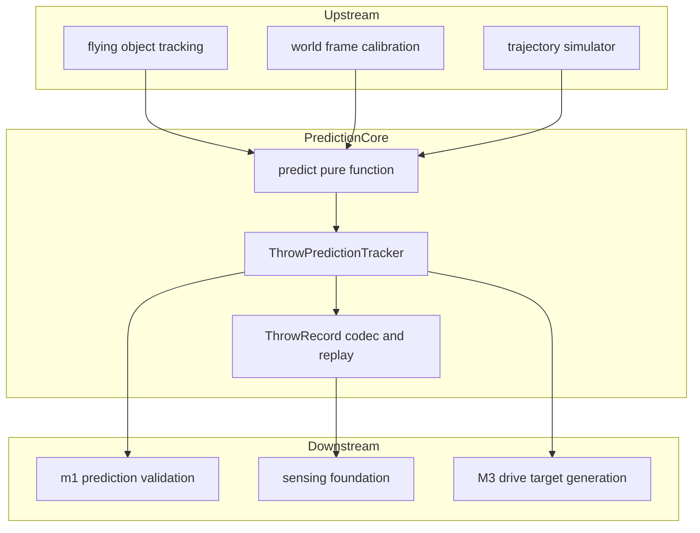
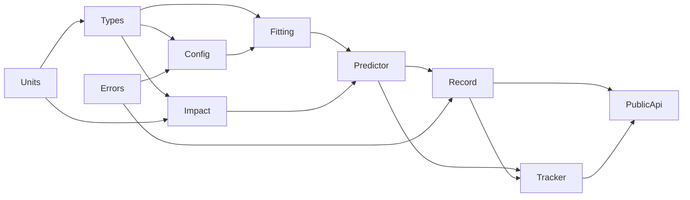
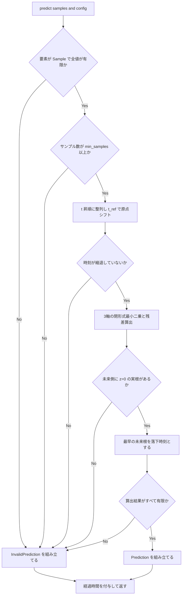
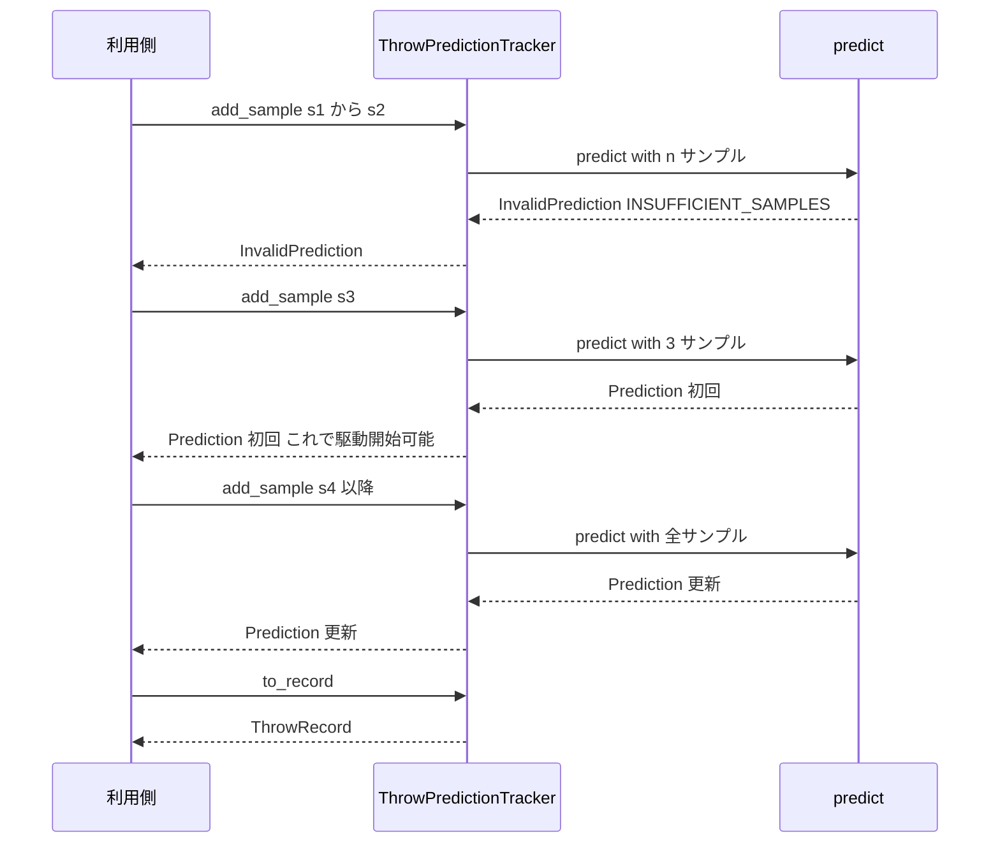

# Technical Design Document: prediction-core

## Overview

**Purpose**: 本機能は、時刻付き3次元位置サンプル列 `(t, x, y, z)` から床面 z = 0 への落下地点・落下時刻・残差を推定する予測部品を提供する。数式は `docs/requirements.md §5-B` で確定しており、本設計が与える価値は式そのものではなく、**予測が一箇所にしか存在しない構造**にある。

**Users**: `m1-prediction-validation`（実データ）、`trajectory-simulator`（合成データ）、および M3 以降の目標座標生成が、いずれも同一の `predict()` を呼ぶ。あわせて本 Spec は Throw Record 最小スキーマ（OQ-31）の単一定義元となり、`sensing-foundation` の Record / Replay 形式（OQ-32）がこれに従う。

**Impact**: 本 Spec はプロジェクト最初の実装コードである。既存コードは一行も存在しないため、既存アーキテクチャの改変は発生しない。一方で、Python パッケージの物理配置とテスト運用の先例を作る。**サードパーティ依存を一切持たない標準ライブラリのみのパッケージ**として実装し、ハードウェア・ネットワーク・ファイル I/O のいずれも必要としない。

### Goals

- 時刻付き3次元位置サンプル列だけを入力とし、デバイス種別に依存しない予測経路を確立する
- 最小サンプル数（既定 3）到達時点で初回予測を生成し、以降サンプル追加のたびに更新する
- 構造的に算出不能な状況を「予測無効」として型レベルで正常値と分離する
- 予測1回あたりの処理時間を計測値として提供する（合否判定は行わない）
- Throw Record 最小スキーマを定義し、直列化・復元・Replay 再現を保証する
- ハードウェア非接続の環境で全機能を検証可能にする

### Non-Goals

- サンプル列を生成する側の一切（検出・追跡・座標変換・床平面推定・投擲物理・ノイズ生成）
- 残差の閾値による採否判定、可視化、駆動制御・目標座標の送信、ファイル入出力・ロギング基盤
- カルマンフィルタ等への推定方式の差し替え機構（実装が1つしかない抽象を今は置かない）

> 詳細と担当先は下の [Out of Boundary](#out-of-boundary) を正とする。

---

## Boundary Commitments

### This Spec Owns

- **軌道パラメータ推定**: 放物運動モデル `x = x0 + vx·t` / `y = y0 + vy·t` / `z = z0 + vz·t − ½g·t²` への最小二乗フィット（要件 2）
- **落下点算出**: 推定軌道と平面 z = 0 の、最新観測時刻より後にある最も早い交点（要件 3）
- **残差の定義と算出**: `sqrt(SSE / (3(n−2)))`（単位 mm）。判断材料の提供までを持つ（要件 2.4 / 6.8）
- **予測無効の判定と理由の区別**: 5 種類の構造的無効理由（要件 6）
- **逐次蓄積と予測系列**: `ThrowPredictionTracker` が投擲1回分の観測と予測を保持する（要件 4 / 5）
- **処理時間の計測**: `elapsed_ms` の算出と出力への同梱（要件 8）
- **Throw Record 最小スキーマ**: 構造定義・`to_dict` / `from_dict` / `to_json` / `from_json` / `replay`（要件 9、OQ-31 を決着させる）
- **パラメータの公開と単位規約**: `PredictionConfig` と外部公開フィールドの命名（要件 10）
- **物理配置**: `src/prediction_core/**`、`tests/prediction_core/**`、ルートの `pyproject.toml`

### Out of Boundary

- 入力サンプルの生成手段（カメラ、Depth、検出、追跡、座標変換、シミュレータの物理・ノイズ）
- 床平面そのものの推定・キャリブレーション（要件 3.6）。本 Spec は z = 0 を**前提として受け取る**
- 残差・収束度の閾値、誤検出の棄却ポリシー（要件 6.8）
- ファイル／ストレージへの読み書き、構造化ロギング基盤への送出、集計（要件 8.4 / 9.5）
- 駆動制御、目標座標の送信、通信プロトコル（要件 5.4）
- `docs/requirements.md §3` 時間予算表の更新（requirements.md D-1 により `m1-prediction-validation` が行う）
- `src/prediction_core/` 以外のリポジトリ構成（OQ-40 は未決のまま残す）

### Allowed Dependencies

- **Python 標準ライブラリのみ**（`dataclasses` / `enum` / `math` / `json` / `time` / `sys` / `typing`）
- **サードパーティ実行時依存はゼロ**。`numpy` / `scipy` / `pydantic` を含め一切導入しない
- 開発時依存は `pytest` のみ（実行時に import されない）
- 上流 Spec への import 依存を持たない（本 Spec は Wave 0 で依存元が存在しない）
- ハードウェア、ネットワーク、環境変数、ファイルシステムへのアクセスを行わない

### Revalidation Triggers

以下が発生した場合、下流 Spec（`trajectory-simulator` / `m1-prediction-validation` / `sensing-foundation`）は結合を再確認する必要がある。

- `Sample` / `Prediction` / `InvalidPrediction` の**フィールド追加以外の変更**（改名・削除・単位変更）
- `InvalidReason` の**メンバ削除または意味変更**（追加は後方互換とみなす）
- `ThrowRecord` の `schema_version` の変更、および必須フィールドの追加
- `residual` の定義式の変更（利用側の閾値が無効化されるため）
- `PredictionConfig` の既定値の変更（特に `min_samples` と `gravity_mm_s2`）
- 運動モデルの変更（空気抵抗の導入など）、および推定方式の差し替え
- サードパーティ実行時依存の追加（依存ゼロ前提で組まれた実行環境が壊れる）

---

## Architecture

### Existing Architecture Analysis

既存の実装コードは存在しない（`product.md` / `structure.md`）。したがって「既存パターンへの適合」ではなく「先例の確立」が論点になる。本設計が固定するのは以下に限る。

- Python パッケージは `src/` レイアウトを用いる
- 実行時のサードパーティ依存を持たない層を、まずコアに置く
- 単位はフィールド名に現れる（`structure.md` 命名規約：距離 mm / 時刻 ms）

`structure.md` の Future Code Layout（入力層・処理層・通信層・観測基盤）は **OQ-40 として未決のまま残す**。本設計は処理層のうち prediction 部分だけを物理化する。

### Architecture Pattern & Boundary Map

**Selected pattern**: **純関数コア + 薄い状態レイヤ**。推定・交点算出・予測は副作用の無い純関数とし、状態を持つのは投擲1回分を蓄積する `ThrowPredictionTracker` のみに限定する。



**Architecture Integration**:

- **Selected pattern**: 純関数コア + 薄い状態レイヤ。決定性（要件 1.3 / 9.4）とハード非依存の検証容易性（要件 7.1）が、この選択の直接の理由である
- **Domain/feature boundaries**: 予測経路は「サンプル列 + 設定」しか受け取らない。ソース種別（live / recorded / simulated）は Throw Record のメタ情報にのみ存在し、予測関数の引数に現れない。これにより要件 1.3 が**型として**保証される
- **Existing patterns preserved**: 該当なし（greenfield）
- **New components rationale**: 各コンポーネントは要件の責務境界（推定／交点／予測統合／逐次蓄積／記録）に1対1で対応する。実装が1つしかない抽象（Estimator ストラテジ等）は置かない
- **Steering compliance**:
  - `tech.md` 開発標準1 — 未実測値を合否条件にしない。処理時間は計測のみ（要件 8.5）
  - `tech.md` 開発標準3 — 予測アルゴリズムは Python の1実装のみ。TypeScript 側に複製しない
  - `tech.md` 開発標準5 — 計測は実行時に無効化できる（要件 8.3）
  - `tech.md` 開発標準6 — live / recorded / simulated で下流を共通にする
  - `structure.md` 命名規約 — 距離 mm / 時刻 ms / 速度 mm/s をフィールド名に含める

### Dependency Direction

依存は**左から右へのみ**許可する。右の層が左の層を import してよく、逆は禁止する。



> 矢印は「矢先のモジュールが矢元のモジュールを import してよい」ことを表す。上図に無い辺は禁止である。

| 層 | モジュール | import してよい対象 |
|---|---|---|
| 0 | `units` / `errors` | 標準ライブラリのみ。互いに import しない |
| 1 | `types` | `units` |
| 2 | `config` | `units`, `types`, `errors` |
| 3 | `fitting` | `units`, `types`, `config` |
| 3 | `impact` | `units`, `types` |
| 4 | `predictor` | 0〜3 |
| 5 | `record` | 0〜4 |
| 6 | `tracker` | 0〜5 |
| 7 | `__init__` | 0〜6（再エクスポートのみ。ロジックを持たない） |

> `fitting` と `impact` は**同一階層で互いに独立**であり、相互に import しない。両者を結び付けるのは `predictor` だけである。この分離により、交点算出のテストが推定器を経由せずに書ける。
> `impact` が `config` を import しないのも意図的である。重力加速度は引数として受け取り、設定オブジェクトへの依存を持たない純関数に保つ。
> **`record` を `tracker` より下層に置くのも意図的である。** `ThrowRecord` は下流 Spec が参照する単一定義元（要件 9.7）であり、
> スキーマを import しただけで逐次蓄積器まで引きずり込まれる状態を避ける。したがって `replay()` は Tracker を使わず、
> 記録順の前置列に `predict()` を適用して系列を再構成する。

### Technology Stack

| Layer | Choice / Version | Role in Feature | Notes |
|-------|------------------|-----------------|-------|
| 言語 / ランタイム | Python >= 3.11 | 実装言語 | Raspberry Pi OS Bookworm は 3.11、Trixie は 3.13。OS 未確定（OQ-23）のため下限を 3.11 に置く。PEP 695 構文を使わない |
| 実行時ライブラリ | 標準ライブラリのみ | 数値計算・直列化・計測 | `dataclasses` / `enum` / `math` / `json` / `time` / `sys` / `typing`。**サードパーティ依存ゼロ** |
| 数値計算 | 自前の閉形式最小二乗 | 軌道パラメータ推定 | NumPy を採用しない。理由は BLAS 実装差による非決定性が要件 9.4 を弱めるため（`research.md` 参照） |
| 直列化 | 標準ライブラリ `json` | Throw Record の文字列化 | float は最短往復表現で出力されるため往復が厳密に一致する。`allow_nan=False` を用いる |
| 時間計測 | `time.perf_counter_ns` | `elapsed_ms` の算出 | 単調時計。壁時計の巻き戻しの影響を受けない |
| パッケージング | `pyproject.toml` / PEP 621 | 配布とテスト実行 | `src/` レイアウト。実行時依存なし、開発依存は `pytest` のみ |
| テスト | `pytest`（開発依存のみ） | 単体・結合テスト | ハードウェア不要。`python -m pytest` のみで完結（要件 7.1） |

---

## File Structure Plan

### Directory Structure

```
pyproject.toml                          # 新規。PEP 621 メタデータ、requires-python >= 3.11、実行時依存なし
src/
└── prediction_core/
    ├── __init__.py                     # 公開 API の再エクスポートのみ。ロジックを持たない
    ├── units.py                        # 単位換算定数と換算関数（mm/ms <-> mm/s、mm/s^2 -> mm/ms^2）
    ├── types.py                        # Sample / SourceKind / TrajectoryParameters / Prediction / InvalidPrediction / InvalidReason / PredictionOutcome
    ├── errors.py                       # PredictionConfigError / RecordSchemaError / RecordSerializationError
    ├── config.py                       # PredictionConfig と構築時検証（要件 10.1-10.3、10.5）
    ├── fitting.py                      # 閉形式最小二乗による軌道パラメータ推定と残差算出（要件 2）
    ├── impact.py                       # 平面 z=0 との未来側交点の算出（要件 3.2）
    ├── predictor.py                    # predict()。入力検証 -> fit -> impact -> 計測 -> PredictionOutcome 組み立て（要件 1, 6, 8）
    ├── record.py                       # ThrowRecord・直列化・復元・replay・predictions_equivalent（要件 9）
    └── tracker.py                      # ThrowPredictionTracker。逐次蓄積と予測系列（要件 4, 5）
tests/
└── prediction_core/
    ├── conftest.py                     # 共通フィクスチャ（既定 PredictionConfig 等）
    ├── analytic.py                     # テスト専用。解析的サンプル生成と決定的ノイズ重畳（random.Random(seed)）
    ├── test_units.py                   # 単位換算の往復と境界
    ├── test_config.py                  # 既定値、min_samples < 3 の拒否、不正な重力加速度の拒否
    ├── test_fitting.py                 # 解析解一致、時刻縮退の検出、順序不変性
    ├── test_impact.py                  # 未来側の最早根の選択、交点なし、数値安定性
    ├── test_predictor.py               # 無効理由5種、出力フィールドと単位、計測の有効・無効
    ├── test_tracker.py                 # 初回予測のタイミング、予測系列、逐次更新
    ├── test_record.py                  # to_dict/from_dict 往復、JSON 往復、未知キー保存、非有限値の拒否
    ├── test_replay.py                  # 記録した系列の再現（要件 9.4）
    ├── test_analytic_e2e.py            # 既知放物線の end-to-end 一致（要件 7.2）
    ├── test_error_behavior.py          # サンプル数と予測誤差の関係（要件 7.3 / 7.4）
    └── test_boundaries.py              # 依存ゼロと依存方向の逆流を静的に検査（要件 1.5 / 7.1 / 8.2 / 9.5）
```

### Modified Files

なし。すべて新規作成である（既存コードは存在しない）。

> 並行実装の安全性のため、**E2E・評価系のテストは1タスク1ファイルに分離する**（`test_analytic_e2e.py` / `test_error_behavior.py` / `test_boundaries.py`）。同一ファイルを複数タスクが同時に触らないようにするため。
> `errors.py` は `types.py` と分けている。例外は「予測の結果」ではなく「呼び出し方の誤り」を表す別カテゴリであり、`types.py` の直和型と混在させると要件 6.7 の意図（無効は値、設定不正は例外）が読みづらくなるため。
> `tests/prediction_core/analytic.py` は**テストツリーにのみ置く**。ノイズ生成・投擲物理は `trajectory-simulator` の責務であり、パッケージ本体に持ち込まない（Out of Boundary）。

---

## System Flows

### 予測1回の処理フロー



**Key decisions**:

- どの段階で失敗しても**返り値は `PredictionOutcome` であり例外は送出しない**（要件 6）。例外は設定不正と直列化失敗にのみ用いる
- 経過時間の付与は成功・失敗の双方で行う。無効判定に要した時間も計測対象に含める（要件 8.1）
- `measure_elapsed` が偽のとき、開始時刻の取得自体を行わず `elapsed_ms` は `None` になる（要件 8.3）
- 各判定に対応する `InvalidReason` と**評価順序**は Predictor の契約で固定する（同一入力に対する `reason` を決定的にするため）

### 逐次予測更新のフロー



**Key decisions**:

- `add_sample()` は**常に**結果を返し、**常に**予測系列へ追加する。最小サンプル数未満でも `InvalidPrediction` を系列に残すことで、系列がそのまま投擲のタイムラインになる
- 初回予測（要件 4.1）は系列上で最初の `Prediction` として一意に特定でき、専用の経路を設けない
- Tracker は毎回全点から再計算する。バッチ計算と逐次計算の 2 経路を作らない（`research.md` の Decision 参照）

---

## Requirements Traceability

| Requirement | Summary | Components | Interfaces | Flows |
|-------------|---------|------------|------------|-------|
| 1.1 | 入力を `(t, x, y, z)` 列のみに限定 | CoreTypes, Predictor | `Sample`, `predict` | 予測1回 |
| 1.2 | 距離 mm / 時刻 ms として解釈 | Units, CoreTypes | `Sample.t_ms/x_mm/y_mm/z_mm` | — |
| 1.3 | 入力元によらず同一結果 | Predictor | `predict(samples, config)` のみ。ソース種別を渡さない | 予測1回 |
| 1.4 | デバイス固有型・カメラパラメータ・ファイル I/O を含めない | Boundary Commitments, CoreTypes | `Sample` のフィールド定義 | — |
| 1.5 | ハードウェア接続を要求しない | 全コンポーネント（依存ゼロ） | — | — |
| 2.1 | 6パラメータを最小二乗で推定 | TrajectoryFitter | `fit_trajectory` | 予測1回 |
| 2.2 | 空気抵抗を無視した初期方式 | TrajectoryFitter | `TrajectoryParameters` | — |
| 2.3 | 理想放物線で解析解と一致 | TrajectoryFitter | `fit_trajectory` | 予測1回 |
| 2.4 | 残差の算出 | TrajectoryFitter | `FitResult.residual` | 予測1回 |
| 2.5 | 速度成分を `estimated_v*_mm_s` で提供 | Predictor, Units | `Prediction.estimated_vx_mm_s` 他 | 予測1回 |
| 3.1 | World frame 前提、床面 z = 0 | Boundary Commitments, ImpactSolver | `solve_floor_impact` | — |
| 3.2 | 最新観測時刻より後の最早交点 | ImpactSolver | `solve_floor_impact` | 予測1回 |
| 3.3 | 8 フィールドを含む予測結果 | Predictor, CoreTypes | `Prediction` | 予測1回 |
| 3.4 | 落下時刻は入力と同一時間基準 | Predictor, ImpactSolver | `TrajectoryParameters.t_ref_ms` | 予測1回 |
| 3.5 | `remaining_time_ms` の定義 | Predictor | `Prediction.remaining_time_ms` | 予測1回 |
| 3.6 | 床平面推定・キャリブレーションを持たない | Out of Boundary | — | — |
| 4.1 | min_samples 到達時点で初回予測 | ThrowPredictionTracker, Predictor | `add_sample` | 逐次更新 |
| 4.2 | 超過分の到着を待たない | ThrowPredictionTracker | `add_sample` の同期返却 | 逐次更新 |
| 4.3 | 何サンプル目の予測か識別可能 | CoreTypes | `Prediction.sample_count` | 逐次更新 |
| 5.1 | 追加のたびに再推定 | ThrowPredictionTracker | `add_sample` | 逐次更新 |
| 5.2 | 生成順を保持した予測系列 | ThrowPredictionTracker | `predictions` プロパティ | 逐次更新 |
| 5.3 | 各予測に基準観測時刻を含める | CoreTypes | `Prediction.based_on_time_ms` | 逐次更新 |
| 5.4 | 駆動制御・送信を持たない | Out of Boundary | — | — |
| 6.1 | サンプル数不足 → 無効 | Predictor | `InvalidReason.INSUFFICIENT_SAMPLES` | 予測1回 |
| 6.2 | 時刻縮退 → 無効 | TrajectoryFitter, Predictor | `InvalidReason.DEGENERATE_TIME` | 予測1回 |
| 6.3 | 未来側交点なし → 無効 | ImpactSolver, Predictor | `InvalidReason.NO_FUTURE_FLOOR_CROSSING` | 予測1回 |
| 6.4 | NaN / Infinity → 無効 | Predictor | `InvalidReason.NON_FINITE_VALUE` | 予測1回 |
| 6.5 | 入力契約違反 → 無効 | Predictor | `InvalidReason.MALFORMED_INPUT` | 予測1回 |
| 6.6 | 理由を区別可能に返す | CoreTypes | `InvalidReason`, `InvalidPrediction.detail` | 予測1回 |
| 6.7 | 無効時に落下地点を正常値として返さない | CoreTypes | `InvalidPrediction` に該当フィールドを持たせない | 予測1回 |
| 6.8 | 採否判定を行わず残差を返すにとどめる | Out of Boundary, CoreTypes | `Prediction.residual` | — |
| 7.1 | ハード非接続で全機能を検証可能 | 全コンポーネント, Testing Strategy | 依存ゼロ、`python -m pytest` | — |
| 7.2 | 既知放物線で解析解と一致 | TrajectoryFitter, ImpactSolver | `predict` | 予測1回 |
| 7.3 | サンプル数を変えた予測を相互比較可能 | ThrowPredictionTracker, CoreTypes | `predictions`, `sample_count`, `residual` | 逐次更新 |
| 7.4 | 誤差重畳時にサンプル数と誤差の関係を評価可能 | ThrowPredictionTracker, CoreTypes | `predictions` 系列 | 逐次更新 |
| 8.1 | 処理時間を ms で計測し結果とレコードから取得可能 | Predictor | `Prediction.elapsed_ms`, `InvalidPrediction.elapsed_ms` | 予測1回 |
| 8.2 | ロギング基盤に依存しない | Allowed Dependencies | `time.perf_counter_ns` のみ | — |
| 8.3 | 実行時に計測を無効化できる | PredictionConfig, Predictor | `PredictionConfig.measure_elapsed` | 予測1回 |
| 8.4 | 記録・集計・送出を持たない | Out of Boundary | — | — |
| 8.5 | 目標値の充足判定を行わない | Out of Boundary | `elapsed_ms` は生値のみ | — |
| 9.1 | 1投擲 = 1 レコード | ThrowRecordCodec | `ThrowRecord` | — |
| 9.2 | 必須項目を含む | ThrowRecordCodec | `ThrowRecord` の各フィールド | — |
| 9.3 | 直列化と復元で等価 | ThrowRecordCodec | `to_dict` / `from_dict` / `to_json` / `from_json` | — |
| 9.4 | 同一パラメータで再入力すると系列を再現 | ThrowRecordCodec, Predictor | `replay`, `predictions_equivalent` | 逐次更新 |
| 9.5 | 構造定義と直列化のみ。ファイル I/O を持たない | ThrowRecordCodec, Out of Boundary | 文字列と dict のみを扱う | — |
| 9.6 | 粒度を保ったまま項目追加が可能 | ThrowRecordCodec | `schema_version`, `extra` | — |
| 9.7 | スキーマの単一定義元 | ThrowRecordCodec, PublicApi | `prediction_core.ThrowRecord` | — |
| 10.1 | 重力加速度と最小サンプル数を公開 | PredictionConfig | `gravity_mm_s2`, `min_samples` | — |
| 10.2 | 最小サンプル数の既定 3 と導出根拠 | PredictionConfig, TrajectoryFitter | 既定値と残差の自由度 `3(n−2)` | — |
| 10.3 | 3 未満の指定を拒否 | PredictionConfig, Errors | `PredictionConfigError` | — |
| 10.4 | 単位をフィールド名に含める | Units, CoreTypes, PredictionConfig | 命名規約（`residual` は例外） | — |
| 10.5 | 根拠のない固定値を埋め込まない | PredictionConfig | 全パラメータに導出根拠を併記 | — |
| 10.6 | 使用パラメータを結果から追跡可能 | CoreTypes | `Prediction.config` / `InvalidPrediction.config` | 予測1回 |

---

## Components and Interfaces

| Component | Domain/Layer | Intent | Req Coverage | Key Dependencies (P0/P1) | Contracts |
|-----------|--------------|--------|--------------|--------------------------|-----------|
| Units | L0 基盤 | 単位換算の単一定義点 | 1.2, 2.5, 10.4 | 標準ライブラリ (P2) | Service |
| Errors | L0 基盤 | 呼び出し誤りを表す例外階層 | 9.3, 10.3 | なし | Service |
| CoreTypes | L1 型 | 値オブジェクトと予測結果の直和型 | 1.1, 3.3, 4.3, 5.3, 6.6, 6.7, 10.6 | Units (P0) | State |
| PredictionConfig | L2 設定 | パラメータの公開と構築時検証 | 8.3, 10.1, 10.2, 10.3, 10.5 | Units (P0), Errors (P0) | Service, State |
| TrajectoryFitter | L3 推定 | 閉形式最小二乗と残差算出 | 2.1, 2.2, 2.3, 2.4, 6.2, 10.2 | CoreTypes (P0), PredictionConfig (P0) | Service |
| ImpactSolver | L3 交点 | 平面 z=0 の未来側最早交点 | 3.2, 3.4, 6.3 | CoreTypes (P0), Units (P0) | Service |
| Predictor | L4 統合 | 入力検証・推定・交点・計測の統合 | 1.3, 1.4, 3.3, 3.5, 6.1-6.7, 8.1, 8.3 | TrajectoryFitter (P0), ImpactSolver (P0) | Service |
| ThrowRecordCodec | L5 記録 | Throw Record の定義・直列化・Replay | 9.1-9.7 | Predictor (P0), Errors (P0) | Service, Batch |
| ThrowPredictionTracker | L6 状態 | 逐次蓄積と予測系列の保持 | 4.1, 4.2, 5.1, 5.2, 7.3, 7.4 | Predictor (P0), ThrowRecordCodec (P0) | Service, State |
| PublicApi | L7 公開 | 公開シンボルの単一入口 | 9.7 | L0〜L6 (P0) | Service |

### L0-L2 基盤層

#### Units

| Field | Detail |
|-------|--------|
| Intent | mm / ms / mm/s / mm/s² の換算を一箇所に集約する |
| Requirements | 1.2, 2.5, 10.4 |

**Contracts**: Service [x] / API [ ] / Event [ ] / Batch [ ] / State [ ]

```python
MS_PER_S: float = 1000.0

def mm_per_ms_to_mm_per_s(v_mm_ms: float) -> float: ...   # v * MS_PER_S
def mm_per_s2_to_mm_per_ms2(a_mm_s2: float) -> float: ... # a / MS_PER_S ** 2
```

- 外部契約の単位は **距離 mm・時刻 ms・速度 mm/s・加速度 mm/s²**（`docs/requirements.md §6.1`）。
  内部計算は **mm と ms** に統一するため、内部の速度は mm/ms、内部の重力加速度は mm/ms² になる
- 換算係数はこのモジュールにのみ存在し、他モジュールが `1000` や `1e6` を直接書かない（要件 10.5）

#### CoreTypes

| Field | Detail |
|-------|--------|
| Intent | 入力サンプル・軌道パラメータ・予測結果の値オブジェクトを定義する |
| Requirements | 1.1, 3.3, 4.3, 5.3, 6.6, 6.7, 10.6 |

**Responsibilities & Constraints**

- すべて `@dataclass(frozen=True, slots=True)` の不変値オブジェクトとする
- **`Prediction` と `InvalidPrediction` はフィールド構成が異なる直和型**であり、`InvalidPrediction` に落下地点・落下時刻のフィールドを**持たせない**（要件 6.7 を型で担保する）
- 距離・時刻・速度を表すフィールド名には単位を含める。`residual` は要件 10.4 が名指しする例外であり、**値は mm 単位**である旨を契約として明記する
- `SourceKind` は Throw Record のメタ情報専用であり、予測経路の引数に現れない（要件 1.3）

**Dependencies**

- なし（宣言専用モジュール）。実行時 import は標準ライブラリのみ。
  速度の単位換算は値を生成する側（TrajectoryFitter / ImpactSolver）が Units を用いて行うため、
  本モジュールは `units` を import しない

**Contracts**: Service [ ] / API [ ] / Event [ ] / Batch [ ] / State [x]

##### State Management

```python
class SourceKind(StrEnum):
    LIVE = "live"
    RECORDED = "recorded"
    SIMULATED = "simulated"

class InvalidReason(StrEnum):
    INSUFFICIENT_SAMPLES = "insufficient_samples"        # 6.1
    DEGENERATE_TIME = "degenerate_time"                  # 6.2
    NO_FUTURE_FLOOR_CROSSING = "no_future_floor_crossing" # 6.3
    NON_FINITE_VALUE = "non_finite_value"                # 6.4
    MALFORMED_INPUT = "malformed_input"                  # 6.5

@dataclass(frozen=True, slots=True)
class Sample:
    t_ms: float
    x_mm: float
    y_mm: float
    z_mm: float

@dataclass(frozen=True, slots=True)
class TrajectoryParameters:
    t_ref_ms: float          # 位置・速度がこの時刻を原点とすることを示す
    x0_mm: float
    y0_mm: float
    z0_mm: float
    estimated_vx_mm_s: float
    estimated_vy_mm_s: float
    estimated_vz_mm_s: float
    gravity_mm_s2: float

@dataclass(frozen=True, slots=True)
class Prediction:
    predicted_hit_x_mm: float
    predicted_hit_y_mm: float
    predicted_hit_time_ms: float
    remaining_time_ms: float
    estimated_vx_mm_s: float
    estimated_vy_mm_s: float
    estimated_vz_mm_s: float
    residual: float            # 単位 mm。定義は TrajectoryFitter を参照
    trajectory: TrajectoryParameters
    sample_count: int          # 4.3
    based_on_time_ms: float    # 5.3。使用サンプルのうち最新の観測時刻
    elapsed_ms: float | None   # 8.1 / 8.3。計測無効時は None
    config: "PredictionConfig" # 10.6

@dataclass(frozen=True, slots=True)
class InvalidPrediction:
    reason: InvalidReason
    detail: str
    sample_count: int
    based_on_time_ms: float | None
    elapsed_ms: float | None
    config: "PredictionConfig"

PredictionOutcome = Prediction | InvalidPrediction
```

- State model: すべて不変。生成後に変更されない
- Persistence & consistency: 永続化は行わない。ThrowRecordCodec が dict へ写像する
- Concurrency strategy: 不変値のみのため共有安全。ロックを持たない

**Implementation Notes**

- Integration: `PredictionConfig` を型注釈で参照するため、循環 import を避けて `from __future__ import annotations` と `TYPE_CHECKING` を用いる。実行時の import 方向は `config` → `types` ではなく `types` → `config` を**作らない**
- Validation: 値オブジェクト自体は検証しない。有限性の検証は Predictor が境界で行う（要件 6.4 / 6.5）
- Risks: `residual` の名前だけでは単位が読み取れない。docstring・Throw Record スキーマ・本設計に mm を明記して補う

#### Errors

| Field | Detail |
|-------|--------|
| Intent | 「予測の無効」ではなく「呼び出し方の誤り」を表す例外を定義する |
| Requirements | 9.3, 10.3 |

**Contracts**: Service [x] / API [ ] / Event [ ] / Batch [ ] / State [ ]

```python
class PredictionCoreError(Exception): ...
class PredictionConfigError(PredictionCoreError, ValueError): ...      # 10.3
class RecordSchemaError(PredictionCoreError, ValueError): ...          # 9.3 復元時
class RecordSerializationError(PredictionCoreError, ValueError): ...   # 9.3 直列化時
```

- 予測の失敗は例外にしない（要件 6 は値で返すことを求める）。例外は「設定の不正」と
  「Throw Record のスキーマ不整合・直列化不能」の 2 系統に限る

#### PredictionConfig

| Field | Detail |
|-------|--------|
| Intent | 挙動を左右する数値を導出根拠つきで公開し、構築時に検証する |
| Requirements | 8.3, 10.1, 10.2, 10.3, 10.5 |

**Responsibilities & Constraints**

- 不変（`frozen=True`）かつハッシュ可能。予測結果に同梱して使用パラメータを追跡できるようにする（要件 10.6）
- 既定値には**すべて導出根拠を併記する**（要件 10.5）
- 不正な設定は構築時に `PredictionConfigError` を送出して拒否する（Fail Fast）

**Dependencies**

- Outbound: Units — 重力加速度の内部単位への換算 (P0)
- Outbound: Errors — 検証失敗の送出 (P0)

**Contracts**: Service [x] / API [ ] / Event [ ] / Batch [ ] / State [x]

##### Service Interface

```python
@dataclass(frozen=True, slots=True)
class PredictionConfig:
    gravity_mm_s2: float = 9806.65
    min_samples: int = 3
    measure_elapsed: bool = True
    time_degeneracy_rel_tol: float = 1.4901161193847656e-08

    def __post_init__(self) -> None: ...
    @property
    def gravity_mm_ms2(self) -> float: ...
```

| パラメータ | 既定値 | 導出根拠 |
|---|---|---|
| `gravity_mm_s2` | 9806.65 | 標準重力加速度 9.80665 m/s² を mm/s² に換算した値。定数として埋め込まずパラメータ化する（要件 10.1） |
| `min_samples` | 3 | 各軸の未知数が2個であるため、n = 2 では厳密解となり残差自由度 `3(n−2)` が 0 になる。3 が残差を信頼度として使える下限（要件 10.2、A-1） |
| `measure_elapsed` | True | 計測を実行時に無効化できること（要件 8.3、`tech.md` 開発標準5） |
| `time_degeneracy_rel_tol` | `sqrt(float64 eps)` ≈ 1.49e-8 | 正規方程式は条件数を2乗するため、行列式の相対閾値には machine epsilon の平方根を用いるのが慣行 |

- Preconditions: なし
- Postconditions: 構築に成功した `PredictionConfig` は以下の不変条件を満たす
- Invariants:
  - `min_samples >= 3`（要件 10.3。3 未満は `PredictionConfigError`）
  - `gravity_mm_s2 > 0` かつ有限（`g <= 0` では平面 z = 0 との「落下側」の解が定義できないため拒否する）
  - `0 < time_degeneracy_rel_tol < 1` かつ有限
- `gravity_mm_ms2` は `mm_per_s2_to_mm_per_ms2(gravity_mm_s2)` を返す。内部計算はこちらのみを使う

**Implementation Notes**

- Integration: 予測結果に同梱されるため、`frozen=True` と値等価性が必須。`slots=True` と併用する
- Validation: `__post_init__` で全不変条件を検査し、違反したフィールド名と値を例外メッセージに含める
- Risks: `min_samples` を 3 より大きくすると初回予測が遅れる。M1 の実測で調整する前提であり、既定値は変更しない

### L3-L4 予測層

#### TrajectoryFitter

| Field | Detail |
|-------|--------|
| Intent | 整列済みサンプル列から軌道パラメータと残差を閉形式で推定する |
| Requirements | 2.1, 2.2, 2.3, 2.4, 6.2, 10.2 |

**Responsibilities & Constraints**

- 副作用を持たない純関数。同一入力に対し同一出力を返す
- `g` が既知であることを利用し、`z' = z + ½·g·t̃²` と置いて**3軸すべてを2パラメータの単回帰に還元する**（要件 2.1 / 2.2）
- 時刻は `t̃ = t − t_ref`（`t_ref = min(t_ms)`）へ原点シフトしてから累積する。絶対時刻のまま `t²` を扱うと桁落ちするため
- **残差の定義**: `residual = sqrt(SSE / (3 * (n - 2)))`。ここで `SSE` は3軸合計の残差二乗和、`n` はサンプル数。単位は **mm**。座標1成分あたりの観測誤差の不偏推定量にあたり、サンプル数の異なる予測どうしを比較できる（要件 7.3 / 7.4）
- **縮退判定**: `Δ = n·Σt̃² − (Σt̃)²` が `time_degeneracy_rel_tol * n * Σt̃²` 以下のとき縮退とみなす（要件 6.2）
- 交点算出・入力検証・時間計測を**行わない**

**Dependencies**

- Inbound: Predictor — 推定の実行 (P0)
- Outbound: CoreTypes — `Sample` / `TrajectoryParameters` (P0)
- Outbound: PredictionConfig — `gravity_mm_ms2` / `time_degeneracy_rel_tol` (P0)

**Contracts**: Service [x] / API [ ] / Event [ ] / Batch [ ] / State [ ]

##### Service Interface

```python
@dataclass(frozen=True, slots=True)
class FitResult:
    trajectory: TrajectoryParameters
    residual: float          # 単位 mm

def fit_trajectory(
    samples: Sequence[Sample],
    config: PredictionConfig,
) -> FitResult | InvalidReason: ...
```

- Preconditions:
  - `samples` は `t_ms` 昇順に整列済みであり、全要素の全フィールドが有限であること（Predictor が保証する）
  - `len(samples) >= config.min_samples`
- Postconditions:
  - 成功時は `FitResult` を返す。`trajectory.t_ref_ms == min(s.t_ms)`
  - `trajectory` の速度は **mm/s** 単位で格納される（内部の mm/ms から換算済み）
  - 縮退時は `InvalidReason.DEGENERATE_TIME` を返す（例外を送出しない）
- Invariants:
  - 誤差を含まない理想放物線が入力された場合、残差は丸め誤差の範囲で 0 となり、推定パラメータは解析解と一致する（要件 2.3）
  - `n = 2` に相当する自由度では残差が定義できない。これが `min_samples >= 3` の根拠である（要件 10.2）

**Implementation Notes**

- Integration: 累積は `t̃` 昇順の固定順序で行う。順序が固定であることが要件 1.3 と 9.4 の決定性を支える
- Validation: 縮退判定は相対閾値で行う。`Δ == 0` の厳密比較は使わない
- Risks: 空気抵抗があるとモデル不一致が残差の増大として現れる。判定は利用側の責務（要件 6.8）であり、本コンポーネントは値を返すにとどめる

#### ImpactSolver

| Field | Detail |
|-------|--------|
| Intent | 推定軌道と平面 z = 0 の、未来側で最も早い交点を求める |
| Requirements | 3.2, 3.4, 6.3 |

**Responsibilities & Constraints**

- 副作用を持たない純関数。`PredictionConfig` に依存せず、重力加速度を引数で受け取る
- 解く式は `½·g·t̃² − vz·t̃ − z0 = 0`。判別式 `D = vz² + 2·g·z0`
- **桁落ち対策**: 素朴な根の公式ではなく `q = −½(b + sign(b)·√D)` 形式を用い、2根を `q/a` と `c/q` で得る
- `t̃` の解のうち **`t̃_latest` より真に大きいもののうち最小**を採用する（要件 3.2）
- 該当する解が存在しない場合（`D < 0`、または全解が `t̃_latest` 以下）は `InvalidReason.NO_FUTURE_FLOOR_CROSSING` を返す（要件 6.3）
- 落下時刻は `t_ref_ms` を戻して**入力と同一の時間基準**で返す（要件 3.4）

**Dependencies**

- Inbound: Predictor — 交点算出の実行 (P0)
- Outbound: CoreTypes — `TrajectoryParameters` (P0)
- Outbound: Units — 内部単位への換算 (P0)

**Contracts**: Service [x] / API [ ] / Event [ ] / Batch [ ] / State [ ]

##### Service Interface

```python
@dataclass(frozen=True, slots=True)
class FloorImpact:
    hit_x_mm: float
    hit_y_mm: float
    hit_time_ms: float       # 入力と同一の時間基準（絶対）

def solve_floor_impact(
    trajectory: TrajectoryParameters,
    latest_time_ms: float,
) -> FloorImpact | InvalidReason: ...
```

- Preconditions: `trajectory` の全フィールドが有限、`trajectory.gravity_mm_s2 > 0`、`latest_time_ms >= trajectory.t_ref_ms`
- Postconditions:
  - 成功時 `hit_time_ms > latest_time_ms`
  - `hit_x_mm` / `hit_y_mm` は等速モデルを `hit_time_ms` で評価した値
  - 該当解なしのとき `InvalidReason.NO_FUTURE_FLOOR_CROSSING`
- Invariants: 解析的に既知の放物線に対して、丸め誤差の範囲で解析解と一致する（要件 7.2）

**Implementation Notes**

- Integration: 床平面は z = 0 固定であり、平面パラメータを引数に取らない。床平面の推定は `world-frame-calibration` の責務（要件 3.1 / 3.6）
- Validation: `D < 0` と「未来側に解なし」を同一の `InvalidReason` に写像する。両者は利用側から見て「落下点が決まらない」という同じ意味を持つため、`detail` 文字列で区別する
- Risks: `z0 < 0`（観測が床下）や上昇中で `D` が極小の場合、解が数値的に不安定になる。相対誤差は残差では捕捉されないため、`m1-prediction-validation` での実測観察に委ねる

#### Predictor

| Field | Detail |
|-------|--------|
| Intent | 入力検証・推定・交点算出・時間計測を統合し、単一の予測結果を返す |
| Requirements | 1.3, 1.4, 3.3, 3.5, 6.1-6.7, 8.1, 8.3 |

**Responsibilities & Constraints**

- **公開シグネチャは `predict(samples, config)` のみ**。ソース種別・デバイス情報・ファイルパスを一切受け取らない（要件 1.3 / 1.4）
- 入力は `t_ms` 昇順に安定ソートしてから下位へ渡す。これにより**入力の並び順が異なっても結果がビット単位で一致する**
- 検証の順序を固定し、複数の無効条件が同時に成立する場合の理由を決定的にする
  1. 要素が `Sample` であること → 違反時 `MALFORMED_INPUT`（6.5）
  2. 全フィールドが有限であること → 違反時 `NON_FINITE_VALUE`（6.4）
  3. サンプル数が `min_samples` 以上 → 違反時 `INSUFFICIENT_SAMPLES`（6.1）
  4. 時刻が縮退していないこと → 違反時 `DEGENERATE_TIME`（6.2）
  5. 未来側に床面交点があること → 違反時 `NO_FUTURE_FLOOR_CROSSING`（6.3）
  6. 算出結果が全て有限であること → 違反時 `NON_FINITE_VALUE`（6.4）
- **例外を送出しない**。すべての失敗は `InvalidPrediction` として返る（要件 6）
- 計測は成功・失敗の双方で行う。`measure_elapsed` が偽なら `elapsed_ms` は `None`（要件 8.3）

**Dependencies**

- Inbound: ThrowPredictionTracker — 逐次更新時の呼び出し (P0)
- Inbound: ThrowRecordCodec — Replay 時の前置列に対する呼び出し (P0)
- Outbound: TrajectoryFitter — 軌道推定 (P0)
- Outbound: ImpactSolver — 交点算出 (P0)
- External: `time.perf_counter_ns` — 経過時間の計測 (P1)

**Contracts**: Service [x] / API [ ] / Event [ ] / Batch [ ] / State [ ]

##### Service Interface

```python
def predict(
    samples: Sequence[Sample],
    config: PredictionConfig,
) -> PredictionOutcome: ...
```

- Preconditions: なし（不正入力も戻り値で表現する）
- Postconditions:
  - 戻り値は `Prediction` または `InvalidPrediction`
  - `Prediction` のとき `remaining_time_ms == predicted_hit_time_ms - based_on_time_ms`（要件 3.5）
  - `Prediction` のとき `predicted_hit_time_ms` は入力サンプルと同一の時間基準（要件 3.4）
  - `sample_count == len(samples)`、`based_on_time_ms == max(s.t_ms)`
  - `Prediction` の `estimated_v*_mm_s` は `trajectory` の同名フィールドと厳密に一致する（要件 3.3 が結果直下での提供を求めるため両方に持つが、値の出所は一つである）
  - `config` は引数として与えられたものと同一オブジェクト（要件 10.6）
  - `config.measure_elapsed` が真なら `elapsed_ms` は有限の非負 float、偽なら `None`
- Invariants:
  - 同一内容のサンプル列に対し、**並び順が異なっても** `elapsed_ms` を除く全フィールドが一致する（要件 1.3）
  - `InvalidPrediction` は落下地点・落下時刻のフィールドを持たない（要件 6.7）

**Implementation Notes**

- Integration: 経過時間の計測は `predict()` の入口と出口で `time.perf_counter_ns()` を1回ずつ呼び、`(end - start) / 1e6` を ms とする。ロギング基盤へ送らない（要件 8.2 / 8.4）
- Validation: 「有効なサンプル」の定義は「`Sample` 型であり4フィールドすべてが有限」である。無効な要素が1つでもあれば列全体を無効とし、部分的な除外は行わない（除外ポリシーは利用側の責務。要件 6.8 と整合）
- Risks: 検証順序が変わると同一入力に対する `reason` が変わりうる。順序を上記のとおり契約として固定し、テストで固定する

### L5-L7 状態・記録層

#### ThrowPredictionTracker

| Field | Detail |
|-------|--------|
| Intent | 投擲1回分の観測を蓄積し、追加のたびに予測を更新して系列として保持する |
| Requirements | 4.1, 4.2, 5.1, 5.2, 7.3, 7.4 |

**Responsibilities & Constraints**

- 本 Spec で**唯一状態を持つコンポーネント**
- `add_sample()` は**常に** `PredictionOutcome` を返し、**常に**予測系列へ追加する。最小サンプル数未満の間は `INSUFFICIENT_SAMPLES` が入る
- 初回予測（要件 4.1）は系列上で最初の `Prediction` として特定できる。専用の経路・フラグを設けない（要件 4.2 は同期返却により満たされる）
- 毎回全観測点から再計算する。スライディングウィンドウを持たず、インクリメンタルな部分和も保持しない
- 駆動制御・送信を行わない（要件 5.4）

**Dependencies**

- Inbound: 利用側（`m1-prediction-validation` / `trajectory-simulator`） (P0)
- Outbound: Predictor — 予測の実行 (P0)
- Outbound: ThrowRecordCodec — `to_record()` が返す `ThrowRecord` の構築 (P0)

**Contracts**: Service [x] / API [ ] / Event [ ] / Batch [ ] / State [x]

##### Service Interface

```python
class ThrowPredictionTracker:
    def __init__(
        self,
        *,
        record_id: str,
        source: SourceKind,
        config: PredictionConfig | None = None,
    ) -> None: ...

    def add_sample(self, sample: Sample) -> PredictionOutcome: ...

    @property
    def samples(self) -> tuple[Sample, ...]: ...
    @property
    def predictions(self) -> tuple[PredictionOutcome, ...]: ...
    @property
    def latest(self) -> PredictionOutcome | None: ...
    @property
    def first_valid(self) -> Prediction | None: ...

    def to_record(self) -> "ThrowRecord": ...
```

- Preconditions: `record_id` は空文字列でないこと。`config` 省略時は既定の `PredictionConfig()` を用いる
- Postconditions:
  - `len(self.predictions) == len(self.samples)`（要件 5.2）
  - `add_sample` の戻り値は `self.predictions[-1]` と同一
  - `first_valid` は `predictions` 中で最初の `Prediction`、無ければ `None`（要件 4.1）
  - 各 `Prediction` の `sample_count` は系列上で狭義単調増加する（要件 4.3 / 7.3）
- Invariants:
  - `samples` は追加順を保持する（`predict()` 側が整列するため、順序は結果に影響しない）
  - 状態を持つのはこのクラスのみであり、`Predictor` 以下は無状態

##### State Management

- State model: `record_id`・`source`・`config`（不変）＋ `samples` リスト ＋ `predictions` リスト（追記のみ）
- Persistence & consistency: 永続化しない。`to_record()` が不変のスナップショットを生成する
- Concurrency strategy: スレッド安全性を提供しない。1投擲 = 1インスタンスで単一スレッドから使う前提を契約として明記する

**Implementation Notes**

- Integration: `samples` / `predictions` は `tuple` として公開し、外部からの変更を防ぐ
- Validation: `add_sample` は要素の妥当性を自ら検査しない。検査は `predict()` の境界に一元化する（判定ロジックを二重に持たない）
- Risks: 利用側が Tracker を使わず `predict()` を直接呼ぶ経路も残る。それは要件 7.3 の比較用途で必要なため意図的に許容する

#### ThrowRecordCodec

| Field | Detail |
|-------|--------|
| Intent | Throw Record 最小スキーマを定義し、直列化・復元・Replay 再現を提供する |
| Requirements | 9.1, 9.2, 9.3, 9.4, 9.5, 9.6, 9.7 |

**Responsibilities & Constraints**

- **OQ-31 を決着させる単一定義元**。`sensing-foundation` は独自スキーマを定義せず、これに従う（要件 9.7）
- 粒度は **1投擲 = 1レコード**（要件 9.1）。この粒度を崩す変更は Revalidation Trigger に該当する
- **ファイル・ストレージへの読み書きを行わない**（要件 9.5）。扱うのは `dict` と `str` のみ
- 予測処理時間は各 `PredictionOutcome` の `elapsed_ms` として保持され、レコード専用フィールドを設けない（要件 9.2）
- 拡張規則（要件 9.6）:
  - 追加は**任意フィールドのみ**とし、既定値を持つこと
  - `from_dict` は未知のトップレベルキーを `extra` に退避し、`to_dict` で再出力する（往復で情報を失わない）
  - 互換性を壊す変更は `schema_version` を上げる

**Dependencies**

- Inbound: `sensing-foundation` — 記録形式（OQ-32）が本スキーマに従う (P0)
- Inbound: `m1-prediction-validation` — 評価入力 (P0)
- Inbound: `trajectory-simulator` — 合成データの記録 (P1)
- Outbound: Predictor — Replay 時の予測実行 (P0)
- Outbound: Errors — スキーマ不整合・直列化不能の送出 (P0)
- External: 標準ライブラリ `json` — 文字列との相互変換 (P1)

**Contracts**: Service [x] / API [ ] / Event [ ] / Batch [x] / State [ ]

##### Service Interface

```python
SCHEMA_VERSION: str = "1.0"

@dataclass(frozen=True, slots=True)
class ThrowRecord:
    record_id: str
    source: SourceKind
    config: PredictionConfig
    samples: tuple[Sample, ...]
    predictions: tuple[PredictionOutcome, ...]
    schema_version: str = SCHEMA_VERSION
    extra: Mapping[str, object] = field(default_factory=dict)

    def to_dict(self) -> dict[str, object]: ...
    @classmethod
    def from_dict(cls, data: Mapping[str, object]) -> "ThrowRecord": ...
    def to_json(self, *, indent: int | None = None) -> str: ...
    @classmethod
    def from_json(cls, text: str) -> "ThrowRecord": ...

def replay(record: ThrowRecord) -> tuple[PredictionOutcome, ...]: ...

def predictions_equivalent(
    left: Sequence[PredictionOutcome],
    right: Sequence[PredictionOutcome],
) -> bool: ...
```

##### Batch / Job Contract

- Trigger: 利用側が明示的に `replay(record)` を呼ぶ。スケジュールや常駐は無い
- Input / validation: `record.samples` を記録順の**前置列**（1点目、1〜2点目、…、全点）に分け、それぞれへ `record.config` で `predict()` を適用する。**Tracker には依存しない**
- Output / destination: `tuple[PredictionOutcome, ...]` を返すのみ。書き込み先を持たない
- Idempotency & recovery: `replay` は副作用を持たず、何度呼んでも同じ結果を返す

- Preconditions:
  - `to_json` の対象レコードは非有限値を含まないこと。含む場合は `RecordSerializationError`
  - `from_dict` / `from_json` は必須キーの欠落・型不一致で `RecordSchemaError`
- Postconditions:
  - `ThrowRecord.from_dict(r.to_dict()) == r`（要件 9.3）
  - `ThrowRecord.from_json(r.to_json()) == r`（要件 9.3）
  - `predictions_equivalent(replay(r), r.predictions)` が真（要件 9.4）
- Invariants:
  - `predictions_equivalent` は `elapsed_ms` を**比較対象から除外する**。それ以外の全フィールドを厳密比較する
  - `to_dict` は `InvalidReason` / `SourceKind` を文字列値へ、`Prediction` / `InvalidPrediction` を `kind` キー付きの dict へ写像する（復元時に直和型を判別するため）

**Implementation Notes**

- Integration: `to_json` は `json.dumps(..., allow_nan=False, ensure_ascii=False)` を用いる。既定の `NaN` / `Infinity` 出力は RFC 8259 準拠ではなく、TypeScript 可視化側の `JSON.parse` が受け付けないため
- Validation: `to_dict` は非有限値でも例外にしない。メモリ上の忠実性を保ち、拒否は JSON 化の時点に限定する
- Risks:
  - 非有限サンプルを含む投擲は JSON として記録できない。記録する必要が生じた場合の表現方法は `sensing-foundation` が決める（本 Spec の Out of Boundary）
  - `created_at` を持たない最小スキーマである。日時が必要な下流は要件 9.6 の加算的拡張で追加する

#### PublicApi

| Field | Detail |
|-------|--------|
| Intent | 下流 Spec が参照する公開シンボルの単一入口 |
| Requirements | 9.7 |

**Responsibilities & Constraints**

- `__init__.py` は再エクスポートのみを行い、**ロジックを一切持たない**
- `__all__` を明示し、公開範囲を契約として固定する。ここに無いシンボルは内部実装とみなす
- 公開シンボル: `Sample` / `SourceKind` / `PredictionConfig` / `TrajectoryParameters` / `Prediction` / `InvalidPrediction` / `InvalidReason` / `PredictionOutcome` / `predict` / `ThrowPredictionTracker` / `ThrowRecord` / `SCHEMA_VERSION` / `replay` / `predictions_equivalent` / 例外4種

**Contracts**: Service [x] / API [ ] / Event [ ] / Batch [ ] / State [ ]

---

## Data Models

### Domain Model

- **集約ルート**: `ThrowRecord`。1投擲を1つの整合単位として扱う（要件 9.1）
- **エンティティ**: `ThrowRecord`（`record_id` により同一性を持つ）
- **値オブジェクト**: `Sample` / `TrajectoryParameters` / `Prediction` / `InvalidPrediction` / `PredictionConfig`。すべて不変で、値等価性を持つ
- **不変条件**:
  - `len(predictions) == len(samples)`（Tracker 由来のレコード）
  - すべての `Prediction` / `InvalidPrediction` が同一の `config` を参照する
  - `sample_count` は系列上で 1 から始まり 1 ずつ増加する

### Data Contracts & Integration

**Throw Record JSON スキーマ（最小形、`schema_version` 1.0）**

| キー | 型 | 必須 | 説明 |
|---|---|---|---|
| `schema_version` | string | ○ | 本スキーマの版。互換を壊す変更で更新する |
| `record_id` | string | ○ | 投擲の識別子（要件 9.2） |
| `source` | string | ○ | `live` / `recorded` / `simulated`（要件 9.2） |
| `config` | object | ○ | 予測に使用したパラメータ（要件 9.2 / 10.6） |
| `samples` | array of object | ○ | 観測サンプル系列。要素は `t_ms` / `x_mm` / `y_mm` / `z_mm`（要件 9.2） |
| `predictions` | array of object | ○ | 予測結果系列。生成順を保持（要件 5.2 / 9.2） |
| `extra` | object | — | 下流が追加した項目の退避先（要件 9.6） |

**`predictions` 要素の判別**: 各要素は `kind` キー（`"prediction"` / `"invalid"`）を持ち、残りのキーは CoreTypes の `Prediction` / `InvalidPrediction` のフィールドに1対1で対応する。`kind` は復元時に直和型を判別するためだけに存在し、Python 側の型には現れない。

> `residual` の単位は **mm** である。フィールド名に単位が現れない唯一の量であり、
> 利用側が閾値を持つ場合は mm を前提とする（要件 10.4 の明示的な例外）。
> `elapsed_ms` は計測無効時に `null` になる（要件 8.3）。

**互換性ルール（要件 9.6）**

- 追加は既定値を持つ任意フィールドに限る。必須フィールドの追加は `schema_version` の更新を伴う
- 未知のトップレベルキーは `extra` へ退避され、`to_dict` で再出力される。往復で情報を失わない
- `InvalidReason` へのメンバ追加は後方互換とみなす。削除・意味変更は Revalidation Trigger

**シリアライズ形式**

- JSON（RFC 8259 準拠）。`allow_nan=False` により `NaN` / `Infinity` を出力しない
- float は CPython `json` の最短往復表現で出力され、復元時に厳密に一致する（要件 9.3）
- ファイル拡張子・保存先・NDJSON 化の是非は本 Spec の責務外（OQ-32 / OQ-35 → `sensing-foundation`）

---

## Error Handling

### Error Strategy

失敗を **3 カテゴリ**に分け、扱いを固定する。この区分は要件 6.7（無効を正常値として返さない）と要件 10.3（不正設定の拒否）を両立させるためのものである。

| カテゴリ | 表現 | 例 |
|---|---|---|
| **予測が構造的に成立しない** | 戻り値 `InvalidPrediction`（例外にしない） | サンプル不足、時刻縮退、未来側交点なし、非有限値、契約違反入力 |
| **呼び出し方の誤り** | 例外 | `min_samples < 3`、`gravity_mm_s2 <= 0` |
| **記録の不整合** | 例外 | 必須キー欠落、型不一致、非有限値の JSON 化 |

### Error Categories and Responses

**予測無効（要件 6.1-6.7）** — `InvalidPrediction` として返す。`reason` で機械的に分岐でき、`detail` に人が読める文脈（該当サンプル数、時刻範囲、判別式の値など）を含める。落下地点・落下時刻のフィールドは**存在しない**ため、誤って正常値として読む経路が型レベルで塞がれる。

**設定不正（要件 10.3）** — `PredictionConfigError` を構築時に送出する。予測実行前に失敗させることで、不正な設定のまま予測系列が生成される事態を防ぐ。メッセージにはフィールド名・与えられた値・制約を含める。

**記録の不整合（要件 9.3）** — `RecordSchemaError`（復元時）／`RecordSerializationError`（JSON 化時）。どのキーが問題かをメッセージに含める。

**品質が低い予測** — **エラーとして扱わない。** 残差が大きくても `Prediction` を返す。採否判定は利用側の責務（要件 6.8）。

### Monitoring

- 本 Spec はログを出力しない（要件 8.2 / 8.4）。`logging` モジュールへの依存も持たない
- 観測可能性は**戻り値を通じてのみ**提供する: `elapsed_ms`（処理時間）、`residual`（フィット品質）、`reason` / `detail`（無効理由）、`sample_count` / `based_on_time_ms`（進行状況）
- これらの記録・集計・送出は `sensing-foundation` の責務であり、本 Spec は Throw Record という受け渡し形式を提供するにとどまる

---

## Testing Strategy

すべてハードウェア非接続で実行できること（要件 7.1）。実行時依存が無いため `python -m pytest` のみで完結する。

### Unit Tests

1. **理想放物線の解析解一致**（`test_fitting.py`）— 既知の `(x0, vx, y0, vy, z0, vz, g)` から生成した誤差なしサンプル列で、推定パラメータが解析値と丸め誤差の範囲で一致し残差が 0 になること（要件 2.1 / 2.3 / 2.4）
2. **時刻縮退の検出**（`test_fitting.py`）— 全サンプル同一時刻、および相対閾値の境界近傍の時刻分散で `DEGENERATE_TIME` が返ること（要件 6.2）
3. **未来側最早根の選択**（`test_impact.py`）— 上昇中の軌道（z = 0 の解が過去側と未来側に1つずつ）で未来側の根が選ばれること。判別式が負の軌道、および全解が `latest_time_ms` 以下の軌道で `NO_FUTURE_FLOOR_CROSSING`（要件 3.2 / 6.3）
4. **設定検証**（`test_config.py`）— `min_samples` に 0/1/2 で `PredictionConfigError`、3 以上で成功。`gravity_mm_s2` に 0・負・NaN で拒否。既定値が 9806.65 / 3 / True であること（要件 10.1 / 10.2 / 10.3）
5. **単位換算の一貫性**（`test_units.py`）— mm/ms ⇔ mm/s、mm/s² → mm/ms² が定義どおりで、往復で元の値に戻ること（要件 1.2 / 2.5）

### Integration Tests

1. **無効理由5種の網羅と判定順序**（`test_predictor.py`）— 5 条件を単独で成立させた入力と複数同時成立の入力で、契約で固定した順序どおりの `reason` が返ること。`InvalidPrediction` に落下地点フィールドが存在しないこと（要件 6.1-6.7）
2. **出力フィールドと単位・時間基準**（`test_predictor.py`）— 要件 3.3 の 8 フィールドが揃い、`remaining_time_ms == predicted_hit_time_ms - based_on_time_ms` が成立し、大きな `t_ms` オフセットでも落下時刻が同一基準で返ること（要件 3.3 / 3.4 / 3.5）
3. **入力順序不変性とソース非依存性**（`test_predictor.py`）— 同一サンプル集合を異なる並び順で与え、`elapsed_ms` を除く全フィールドが一致すること。`predict` のシグネチャにソース種別を渡す経路が無いこと（要件 1.3 / 1.4）
4. **初回予測のタイミングと逐次更新**（`test_tracker.py`）— 1点ずつ追加し `min_samples - 1` 点目までは `INSUFFICIENT_SAMPLES`、`min_samples` 点目で最初の `Prediction` が返ること。`min_samples` を 4/5 に変えても同様。系列長がサンプル数と一致し `sample_count` が単調増加すること（要件 4.1 / 4.2 / 4.3 / 5.1 / 5.2 / 5.3）
5. **計測の有効・無効切り替え**（`test_predictor.py`）— `measure_elapsed=True` で `elapsed_ms` が有限の非負値、`False` で `None`（要件 8.1 / 8.3）
6. **Throw Record 往復**（`test_record.py`）— `to_dict`/`from_dict` と `to_json`/`from_json` の往復で等価。未知トップレベルキーが `extra` に保存され再出力されること。非有限値を含むレコードで `to_json` が `RecordSerializationError`、`to_dict` は成功すること（要件 9.1 / 9.2 / 9.3 / 9.6）
7. **Replay 再現**（`test_replay.py`）— Tracker 由来のレコードを `replay` し `predictions_equivalent` が真。JSON 往復を挟んでも成立すること（要件 9.4）

### E2E / 評価テスト

1. **既知放物線の end-to-end 一致**（`test_analytic_e2e.py`）— 落下地点・落下時刻が解析的に既知の投擲を複数パターン（水平投射・斜方投射・高い/低い初期高度）与え、`predict` の出力が丸め誤差の範囲で解析値と一致すること（要件 7.2）
2. **サンプル数と予測誤差の関係**（`test_error_behavior.py`）— 既知の放物線に決定的な擬似乱数（`random.Random(seed)`）でノイズを重畳し、サンプル数を 3 → n と増やした予測系列を取得する。各予測の `sample_count` / `residual` / 落下地点誤差が同一系列から取り出せること。**誤差が単調減少することは合否条件にしない**（`tech.md` 開発標準1）。検証するのは評価に必要な出力が揃っていることである（要件 7.3 / 7.4）
3. **境界と依存ゼロの回帰テスト**（`test_boundaries.py`）— `src/prediction_core/**` の import 文を走査し、標準ライブラリ許可リスト外が無いこと、および `record` が `tracker` を import していない（依存方向の逆流が無い）ことを静的に検証する。要件 1.4 / 1.5 / 7.1 / 8.2 / 9.5 を構造として守るための歯止め

### Performance

**目標値を置かない**（要件 8.5、`tech.md` 開発標準1）。処理時間は計測して記録するのみとし、合否判定は行わない。

- `elapsed_ms` が出力に含まれることの確認は Integration Tests 5 でカバーする
- Raspberry Pi 4 上の実測と End-to-End の時間予算評価は `m1-prediction-validation` の責務
- 参考値（開発 PC / WSL / Python 3.14.4）: 3軸フィット1回あたり n=3 で 1.28 µs、n=40 で 6.55 µs。**これは実機の値ではなく、合否条件でもない**

---

## Open Questions / Risks

| 項目 | 内容 | 扱い |
|---|---|---|
| OQ-31 | Throw Record 最小スキーマ | **本 Spec で決着**（`schema_version` 1.0） |
| OQ-32 | Record / Replay のデータ形式 | 本スキーマに従う。保存先・拡張子・NDJSON 化は `sensing-foundation` |
| OQ-33 | 物理モデルの詳細度（空気抵抗） | 本 Spec は空気抵抗を無視する（要件 2.2）。モデル不一致は残差として観測される |
| OQ-40 | リポジトリのディレクトリ構成 | 本 Spec は `src/prediction_core/` 部分木のみ確定。全体は未決のまま残す |
| D-1 | 時間予算表が単発予測を前提 | 本 Spec では `docs/requirements.md §3` を変更しない。M1 実測後に更新する |
| `residual` の単位 | 名称に単位が現れないが値は mm | 要件 10.4 が名指しする例外。契約とスキーマに mm を明記済み |
| `min_samples` の妥当性 | 既定 3 が実用上足りない可能性 | パラメータ化済み。M1 の実測で見直す（要件 10.2） |
| 非有限サンプルの記録 | JSON 化できない | `to_dict` では保持。表現方法が必要になったら `sensing-foundation` が決める |
