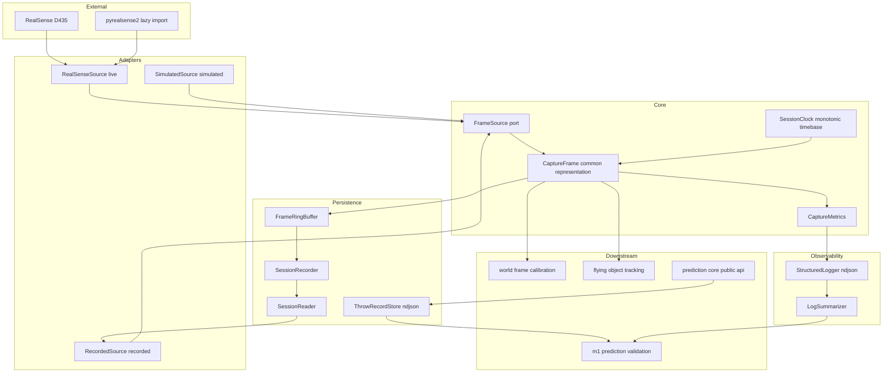
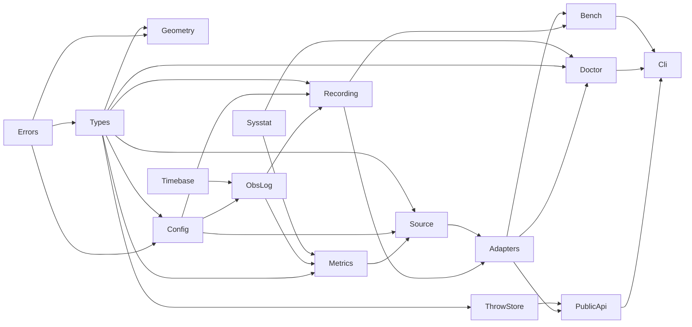
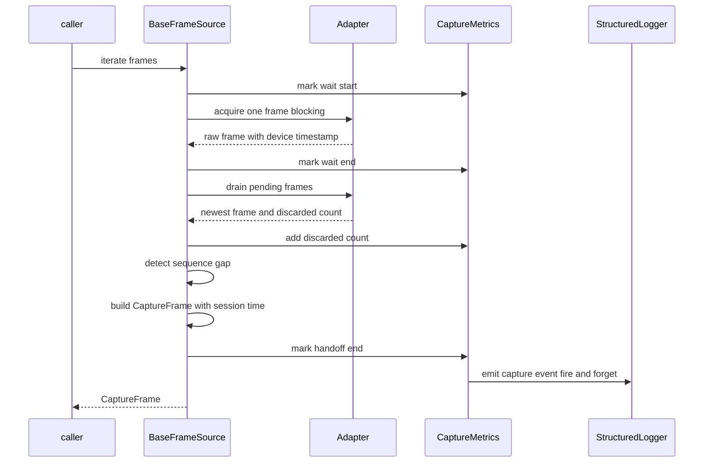
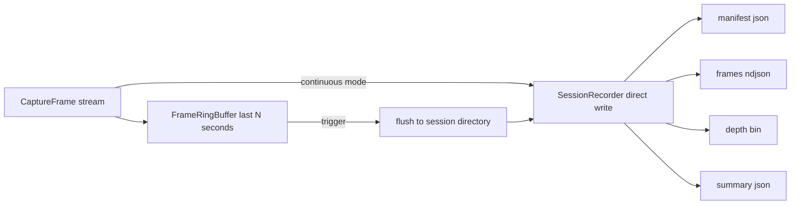
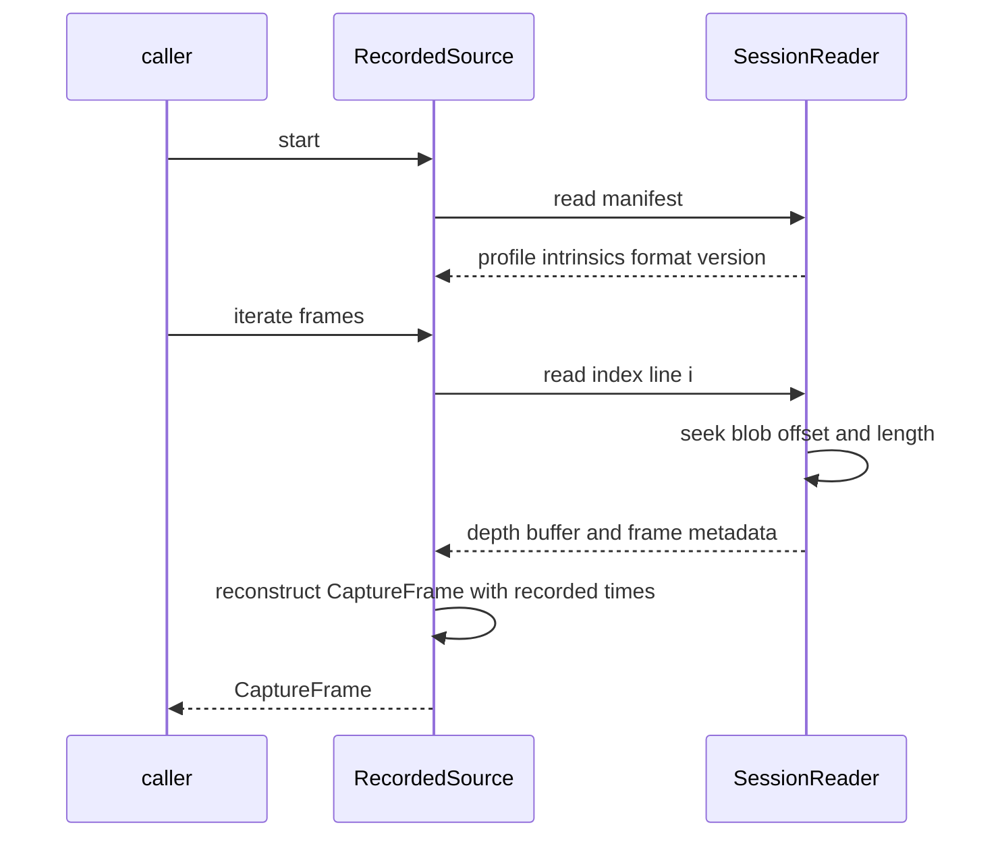
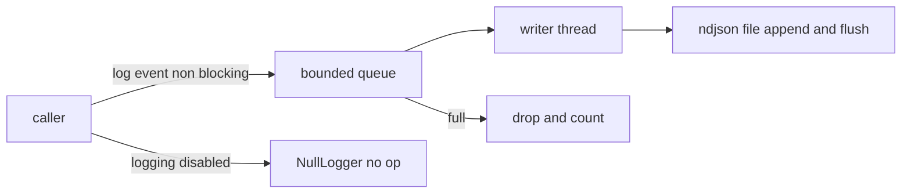
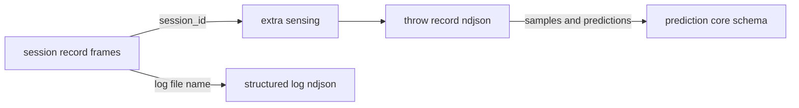

# Technical Design Document: sensing-foundation

## Overview

**Purpose**: 本機能は、**Raspberry Pi 4 と RealSense D435 を実際に動く状態にし**、そこから得られるフレームを**入力元によらない共通表現**として下流へ供給し、**記録（Record）・再生（Replay）・構造化ロギング**の基盤を提供する。本設計が与える価値は「フレームが取れること」ではなく、**以降のすべての判断が実測に基づけるようになること**にある。段階別レイテンシ（`docs/development-environment.md §13.1`）が取れなければ **OQ-27（Pi 4 継続可否）の判断そのものが下せない。**

**Users**: `world-frame-calibration`（床平面推定に Depth を使う）、`flying-object-tracking`（検出・追跡の入力と、アルゴリズム比較のための繰り返し再生）、`m1-prediction-validation`（段階別レイテンシの集計と M1 完了判定）の3 Spec が本 Spec の上に乗る。`trajectory-simulator` は `simulated` 入力の供給側になりうる。

**Impact**: 本 Spec は、リポジトリに**初めてサードパーティ依存と外部デバイスを持ち込む**層である。既存の `src/prediction_core/`（実行時依存ゼロ・ハード不要）はそのまま維持し、依存の向きは常に `sensing_foundation → prediction_core` の一方向とする。あわせて **OQ-23 / OQ-24 / OQ-25 / OQ-28 / OQ-32 / OQ-35 の6件を決着させる。**

### Goals

- Pi 4 上での実機ブリングアップを、順序と切り分け手段（環境診断）を伴って成立させる（要件 1）
- 古いフレームを溜めず、破棄・欠落を**数えながら**フレームを取得する（要件 2）
- 入力元（live / recorded / simulated）を差し替えても下流のコードが変わらない構造を作る（要件 3 / 4）
- 投擲の実データを記録し、**SDK も実機も無い環境で**繰り返し再生できるようにする（要件 5 / 6）
- Throw Record を `prediction-core` のスキーマのまま保存・読み出しできるようにする（要件 7）
- 各段階の計測値を残す構造化ロギング基盤と、capture 区間の計測点を提供する（要件 8 / 9）
- 計測 ON / OFF で処理時間が有意に変わらないことを**実測で確認する**（要件 10）
- 解像度・fps を**実効サンプル数**で比較し、設定を決定する（要件 11）

### Non-Goals

- 物体検出・追跡・床平面推定・**World frame への座標変換**・予測（各下流 Spec / `prediction-core`）。ただし**カメラ座標系への1画素の逆投影（ピンホール基本演算）は本 Spec が持つ**（要件 3.6 / 3.8。下流2 Spec の二重実装を防ぐため）
- 合成データの物理モデル（`trajectory-simulator` / OQ-33）
- ライブダッシュボード・可視化（OQ-38。**作らない**）
- **Pi 4 を継続するかの判断**（OQ-27。材料の提供までを持つ）
- Throw Record **スキーマ**の定義（`prediction-core` が確定済み。D-8）
- リポジトリ全体のディレクトリ構成（OQ-40）と Python 環境構築方針（OQ-41）の確定

> 詳細と担当先は下の [Out of Boundary](#out-of-boundary) を正とする。

---

## Boundary Commitments

### This Spec Owns

- **実機ブリングアップの手順と切り分け手段**: 環境診断（SDK 可用性・デバイス認識・USB3 判定・RAM・OS）と、その結果の記録（要件 1）
- **フレーム取得ポリシー**: キュー容量・ドレイン（最新追従）・破棄と欠落の計数・取得統計（要件 2）
- **フレームの共通表現と時間基準**: `CaptureFrame` と、セッション単調時計に基づく `t_capture_ms`（要件 3）
- **入力層の契約**: `FrameSource` プロトコルと3つのアダプタ（live / recorded / simulated）（要件 4）
- **観測フレーム記録の形式**: セッションディレクトリ（`manifest.json` / `frames.ndjson` / `depth.bin` / `summary.json`）。**OQ-32 のフレーム側を決着させる**（要件 5 / 6）
- **Throw Record の保存レイアウト**: NDJSON（1行1レコード）。**OQ-32 のサンプル側を決着させる**（要件 7）
- **構造化ログの形式**: NDJSON（1行1イベント）と送出機構。**OQ-35 を決着させる**（要件 8）
- **capture 区間の計測点**と、下流が自分の区間を足すための共通手段（要件 8.9 / 9）
- **計測 ON / OFF 比較と、解像度・fps 比較の実行手段と判定基準**（要件 10 / 11。**OQ-25 を決着させる**）
- **ピンホール逆投影の基本演算**: 生 Depth → mm 換算・画素中心規約・逆投影式・無効画素判定を**1箇所に固定する**（要件 3.6 / 3.8）。`world-frame-calibration` と `flying-object-tracking` は**この演算を再実装せず本 Spec を呼ぶ**
- **物理配置**: `src/sensing_foundation/**`、`tests/sensing_foundation/**`、`.kiro/specs/sensing-foundation/measurements.md`、ルート `pyproject.toml` への**追記**（既存の記述を書き換えない）、および **`tests/prediction_core/test_packaging.py` の extras 不変条件1件の是正**（唯一の例外。File Structure Plan を参照）

### Out of Boundary

- 検出・追跡（`flying-object-tracking`）、床平面推定・World frame（`world-frame-calibration`）、予測（`prediction-core`）
- 投擲物理・ノイズ生成（`trajectory-simulator` / OQ-33）
- **Throw Record のスキーマ**（`prediction-core` / D-8）。本 Spec は**保存形式のみ**を決める
- 段階別レイテンシの**集計と判断**（`m1-prediction-validation` / OQ-27）。本 Spec は capture 区間の計測点と集計の道具までを持つ
- detection / tracking / prediction 各区間の**計測点そのもの**（各 Spec が自分で足す）
- 可視化・ダッシュボード（OQ-38）、ESP32 への送信、移動体側のすべて
- `docs/` の本文更新（実装完了時に OQ を decisions.md へ移す作業として別途行う）
- `src/prediction_core/` への一切の変更（テスト側の例外は `tests/prediction_core/test_packaging.py` の extras 不変条件1件のみ。File Structure Plan を参照）
- **逆投影結果の集約方針**: 歪み係数の棄却・平面当てはめでの NaN 方針は `world-frame-calibration`、領域内での代表点の刈り込みは `flying-object-tracking` が各々持つ。本 Spec は**1画素の逆投影**までを持つ

### Allowed Dependencies

- **`prediction_core` の公開入口（`prediction_core.__init__` の18シンボル）のみ**。内部モジュールへ直接 import しない
- **宣言するサードパーティ依存は `numpy` のみ**（extras `sensing` として宣言。`[project].dependencies` は空のまま維持する。extras 名は `tests/prediction_core/test_packaging.py` の `ALLOWED_OPTIONAL_EXTRAS` に登録する）
- **`pyrealsense2` は依存として宣言しない。** live アダプタ内部で遅延 import し、未導入環境では live 以外がすべて動作する
- **OpenCV を導入しない**（検出が必要とする道具であり、`flying-object-tracking` の責務）
- 標準ライブラリ（`json` / `time` / `threading` / `queue` / `dataclasses` / `enum` / `pathlib` / `zlib` / `os` / `platform` / `argparse` / `collections`）
- Linux の `/proc`（CPU・メモリ計測）。Linux 以外では欠測として扱う
- **禁止**: `prediction_core` へのサードパーティ依存の逆流、`sensing_foundation` から下流 Spec への依存

### Revalidation Triggers

以下が発生した場合、下流 Spec（`world-frame-calibration` / `flying-object-tracking` / `m1-prediction-validation`）は結合を再確認する必要がある。

- `CaptureFrame` / `StreamProfile` / `CameraIntrinsics` の**フィールド追加以外の変更**（改名・削除・単位変更）
- **`sensing_foundation.__all__` からのシンボル削除・改名**（下流3 Spec の境界テストが本リストを起点にしている）
- `FrameSource` プロトコルのメソッド構成・イテレーション意味論の変更
- **ピンホール逆投影の基本演算（`depth_raw_to_mm` / `is_valid_depth` / `deproject_pixel`）の変更**（画素中心規約・`depth_scale_mm` の適用位置・無効画素判定を含む）。**`world-frame-calibration`（床平面推定）と `flying-object-tracking`（3次元点の復元）の両方が同じ演算に乗っているため、この基本演算の変更は両 Spec の結果を同時に動かす**
- **`effective_samples_per_window`（フレーム層）の定義変更**。`flying-object-tracking` が定義する `effective_points_per_window`（点層）と対になる指標であり、片方だけ変えると両者の比較が成立しない
- **時間基準の変更**（単調時計の起点、`t_capture_ms` の意味）
- `RECORDING_FORMAT_VERSION` の変更、および `manifest.json` / `frames.ndjson` の必須フィールド追加
- `LOG_FORMAT_VERSION` の変更、および構造化ログの固定キーの変更
- Throw Record 保存レイアウト（NDJSON 1行1レコード）の変更
- 予約された `stage` 名の意味変更（下流が自分の段階名を足す前提が崩れる）
- サードパーティ依存の追加（Pi 側の導入手順が変わる）
- **`prediction_core` の `SCHEMA_VERSION` 変更**（上流由来。本 Spec も再確認が必要になる）

---

## 決着させる未決事項

本 Spec が結論を出す6件を、決定内容として先に示す。根拠は `research.md` を参照。

| OQ | 決定 | 決め方 |
|---|---|---|
| **OQ-23** OS | **Raspberry Pi OS 64-bit を第一候補**とし、librealsense のビルドまたは動作が成立しない場合に **Ubuntu 24.04 LTS arm64 へ退避**する。いずれも 64bit・headless 運用 | ブリングアップ（タスク群1）で実測し、採用結果と根拠を `measurements.md` に記録 |
| **OQ-24** RAM | 実機で確認して記録する。**リングバッファ長の上限根拠として使う** | 環境診断が `/proc/meminfo` から取得して報告 |
| **OQ-25** 解像度・fps | **実効サンプル数**（一定時間内に得られた有効フレーム数）で比較して決定する。fps 単体では決めない | `bench-modes` が候補設定を同一条件で掃引し、結果と選定根拠を記録 |
| **OQ-28** セットアップ成立性 | 認識・USB3・給電安定性・SDK 導入を**この順で**確認し、環境診断ツールで再現可能にする | 環境診断＋ブリングアップ手順の記録 |
| **OQ-32** Record/Replay 形式 | **2階層**に分ける。フレーム層＝セッションディレクトリ（`manifest.json` + `frames.ndjson` + `depth.bin` + `summary.json`）、サンプル層＝ `prediction_core.ThrowRecord` を **NDJSON 1行1レコード**で保存。**`.bag` は採用しない**（`research.md` Decision 2） | 設計で決定。スキーマは D-8 に従い再定義しない |
| **OQ-35** ログ形式 | **NDJSON（1行1イベント）**。固定キー ＋ 任意の `data` オブジェクト。CSV は下流が計測項目を足すたびに列定義が壊れるため不採用 | 設計で決定 |

**未決のまま残すもの**（明示）:

- **OQ-40**（全体のディレクトリ構成）: 本 Spec は `src/sensing_foundation/` 1パッケージと記録データの置き場だけを定める。配布名が `prediction-core` のままである点は OQ-40 で解決する
- **OQ-41**（Python 環境構築・パッケージ管理）: 既存の `pyproject.toml` / `uv.lock` / `.python-version` に乗る。**pyrealsense2 が依存表に書けない**という本 Spec の実測結果を OQ-41 の判断材料として報告する
- **OQ-27**（Pi 4 継続可否）: 判断しない。材料のみ提供する

---

## Architecture

### Existing Architecture Analysis

既存実装は `src/prediction_core/` のみで、次の先例が確立している。本設計はこれを踏襲する。

| 既存の約束 | 本設計での扱い |
|---|---|
| `src/` レイアウト、`pyproject.toml` は PEP 621 | 踏襲。`[tool.hatch.build.targets.wheel].packages` に追記する |
| 単位をフィールド名に含める（距離 mm / 時刻 ms） | 踏襲（要件 3.3） |
| 依存方向を階層で固定し、静的テストで回帰検証する | 踏襲。`test_boundaries.py` 相当を本 Spec にも置く |
| 無効は例外ではなく値で返し、例外は「呼び出し方の誤り」に限る | 踏襲。ただし**外部デバイスの失敗は例外**とする（下記 Error Handling） |
| `prediction_core` は実行時サードパーティ依存ゼロ | **維持する。** numpy は extras、pyrealsense2 は宣言しない |

`structure.md` の Future Code Layout（入力層・処理層・通信層・観測基盤）は **OQ-40 として未決のまま残す**。本設計は入力層と観測基盤の一部だけを物理化する。

### Architecture Pattern & Boundary Map

**Selected pattern**: **Ports & Adapters（ポート＝ `FrameSource`）＋ 記録／ロギングの直交レイヤ**。取得の契約を1つのポートに集約し、live / recorded / simulated をアダプタとして差し替える。記録とロギングは取得経路に**割り込まず**、フレームを受け取って横へ流す。



**Architecture Integration**:

- **Selected pattern**: Ports & Adapters。要件 4.2（入力元を替えても下流が変わらない）を**構造として**保証する。`development-environment.md §7` の図がそのままこの形である
- **Domain/feature boundaries**: 取得（Port とアダプタ）・記録（Persistence）・計測（Observability）の3領域は互いに import しない。結び付けるのは CLI と `SessionRecorder` の呼び出し側だけである
- **Existing patterns preserved**: `src/` レイアウト、単位付きフィールド名、依存方向の静的検証、公開 API の一点集約
- **New components rationale**: 各コンポーネントは要件の責務境界（診断／取得／表現／記録／再生／保存／ロギング／計測／比較）に 1 対 1 で対応する。実装が1つしかない抽象は置かない（例: 記録形式のストラテジ抽象を作らない）
- **Steering compliance**:
  - `tech.md` 開発標準1 — 未実測値を合否条件にしない。fps・レイテンシは計測のみ（要件 9.5 / 11.6）
  - `tech.md` 開発標準4 — 部品を替える前に設定で詰める。Color 削減・解像度・fps を設定で切り替えられる（要件 11.1 / 11.7）
  - `tech.md` 開発標準5 — fire-and-forget、実行時無効化、ON/OFF 実測確認（要件 8 / 10）
  - `tech.md` 開発標準6 — Record / Replay を前提に入力層を3種で差し替える（要件 4）
  - `development-environment.md §4` — 古いフレームを溜めない、Point Cloud を作らない、headless（要件 2.1 / 2.6 / 12.1）

### Dependency Direction

依存は**左から右へのみ**許可する。右の層が左の層を import してよく、逆は禁止する。



| 層 | モジュール | import してよい対象 |
|---|---|---|
| 0 | `errors` / `timebase` / `sysstat` | 標準ライブラリのみ。互いに import しない |
| 1 | `types` | `errors` ＋ **`prediction_core`（公開入口のみ。`SourceKind` の再エクスポートに限る）** |
| 2 | `geometry` | `errors`, `types`（**`source` / `recording` / アダプタを import しない**） |
| 2 | `config` | `errors`, `types` |
| 3 | `obslog` | 0〜2 |
| 4 | `metrics` | 0〜3 |
| 5 | `source` | 0〜4 |
| 5 | `recording/*` | 0〜3（`source` を import しない。記録は取得の下流でも上流でもない） |
| 6 | `sources/simulated` / `sources/realsense` | 0〜5（`realsense` のみ `pyrealsense2` を**関数内で遅延 import**） |
| 6 | `throw_store` | 0〜2 ＋ **`prediction_core`（公開入口のみ）** |
| 7 | `sources/recorded` | 0〜6（`recording/reader` を使う） |
| 7 | `doctor` | 0〜6。**SDK への問い合わせは `sources/realsense` の probe 関数に委ね、自身は `pyrealsense2` を import しない** |
| 8 | `bench/*` | 0〜7 |
| 9 | `cli` | 0〜8 |
| 9 | `__init__` | 0〜8（再エクスポートのみ。ロジックを持たない） |

> **`recording` が `source` を import しないのは意図的である。** `SessionRecorder` は「フレームを受け取って書く」だけの受動的な部品にする。取得ループの中に記録を埋め込むと、記録を止めた状態のレイテンシと有効な状態のレイテンシを比較できなくなり、要件 5.6 が成立しない。
> **`prediction_core` を import してよいのは `types` と `throw_store` の2モジュールだけである。** 役割は明確に分かれている。
> - `types` は **`SourceKind` の再エクスポートのみ**を行う（要件 4.3）。同義の列挙型を新たに定義しないという要求は、**同一の列挙オブジェクト**を配ることでしか満たせないため、ここだけは層1から `prediction_core` の公開入口を参照する。下流（`flying-object-tracking` の `CameraTrack.source` / `CaptureFrame.source`）は `sensing_foundation.SourceKind is prediction_core.SourceKind` が成り立つ前提で Throw Record を組み立てる。別オブジェクトになると、m1 の実行系が**気付かれないまま異なる列挙値を Throw Record へ書き込む**
> - `throw_store` は **Throw Record スキーマの参照点**であり、`ThrowRecord` / `SCHEMA_VERSION` / スキーマ例外を参照する唯一のモジュールである。これにより「**スキーマ**の参照点が1箇所しかない」ことが物理的に保証される（要件 7.8）。`types` の例外は列挙型の再エクスポートに限られ、スキーマには触れないため、この主張は損なわれない
>
> 境界回帰テストはこの2モジュール**以外**が `prediction_core` を import しないことを検証する。
> **`sources/realsense` 以外は `pyrealsense2` を import しない。** これにより、SDK 非導入の WSL でも `import sensing_foundation` が成功する（要件 4.4 / 12.2）。

### Technology Stack

| Layer | Choice / Version | Role in Feature | Notes |
|---|---|---|---|
| 言語 / ランタイム | Python >= 3.11 | 実装言語 | `prediction-core` と同一。OS 未確定のため下限を 3.11 に置く。PEP 695 構文を使わない |
| カメラ SDK | librealsense / pyrealsense2（実機のみ） | live 入力 | **依存表に書けない**（aarch64 wheel が存在せずソースビルドの `.so` として現れる）。遅延 import ＋ 環境診断で扱う |
| 配列 | NumPy（extras `sensing`） | Depth バッファの保持と `frombuffer` 読み出し | 唯一の宣言済みサードパーティ依存。`prediction_core` へは持ち込まない |
| 直列化 | 標準ライブラリ `json` | manifest / NDJSON / Throw Record | `ThrowRecord.to_json(indent=None)` の出力がそのまま1行になる |
| 圧縮（任意） | 標準ライブラリ `zlib` | Depth ブロブの任意圧縮 | 既定は無圧縮。設定で切替。追加依存を作らない |
| 並行 | `threading` + `queue.Queue(maxsize)` | ログの fire-and-forget 送出 | 有界キュー＋満杯時破棄。取得ループを待たせない |
| 計時 | `time.perf_counter_ns` / `time.time_ns` | セッション単調時計と壁時計アンカ | `prediction_core` の `elapsed_ms` と同じ方式 |
| リソース計測 | `/proc/stat` / `/proc/self/stat` / `/proc/meminfo` | CPU・メモリ | `psutil` を採らない（Pi 上の依存を増やさない）。Linux 以外は欠測 |
| CLI | 標準ライブラリ `argparse` | サブコマンド入口 | 常駐サーバを持たない（`tech.md` の Hono 不採用と同じ理由） |
| テスト | `pytest`（開発依存） | 単体・結合・契約テスト | live 以外は**実機・SDK なしで全通過**すること |

---

## File Structure Plan

### Directory Structure

```
src/sensing_foundation/
├── __init__.py                 # 公開APIの再エクスポート専用。`__all__` を明示的に列挙する。ロジックを持たない
├── errors.py                   # 例外階層
├── types.py                    # CaptureFrame / StreamProfile / CameraIntrinsics / TimestampDomain / CaptureStats / SourceKind 再エクスポート
├── geometry.py                 # ピンホール逆投影の基本演算（depth_raw_to_mm / is_valid_depth / deproject_pixel）
├── timebase.py                 # SessionClock（単調時計と壁時計アンカ）
├── sysstat.py                  # /proc からの CPU・メモリ・RAM 総量読み取り
├── config.py                   # CaptureConfig / RecordingConfig / LoggingConfig / RuntimeSettings と解決順序
├── obslog.py                   # StructuredLogger / NullLogger / LogEvent / LOG_FORMAT_VERSION
├── metrics.py                  # CaptureMetrics（区間計測とカウンタ）と stage タイマ
├── source.py                   # FrameSource プロトコル / BaseFrameSource（ドレイン方針・統計）/ open_source
├── sources/
│   ├── __init__.py
│   ├── simulated.py            # 合成フレーム供給の差し替え口（物理は持たない）
│   ├── realsense.py            # live。pyrealsense2 を関数内で遅延 import
│   └── recorded.py             # 記録の再生。SessionReader を使う
├── recording/
│   ├── __init__.py
│   ├── layout.py               # ディレクトリ規約・ファイル名・RECORDING_FORMAT_VERSION・manifest スキーマ
│   ├── ringbuffer.py           # FrameRingBuffer（直近N秒保持・必要RAM算出）
│   ├── writer.py               # SessionRecorder（連続記録／トリガ保存）
│   └── reader.py               # SessionReader（索引読み・ブロブ読み・破損検出）
├── throw_store.py              # ThrowRecordStore。Throw Record スキーマを参照する唯一のモジュール（prediction_core 公開入口のみ）
├── doctor.py                   # 環境診断（SDK・デバイス・USB3・RAM・OS・Python）
├── bench/
│   ├── __init__.py
│   ├── modes.py                # 解像度・fps 掃引と実効サンプル数の算出
│   └── logging_overhead.py     # 計測 ON/OFF 比較と判定
└── cli.py                      # doctor / capture / record / replay-session / bench-modes / bench-logging / summarize

tests/sensing_foundation/
├── conftest.py                 # 共通フィクスチャ（一時ディレクトリ・合成フレーム生成器）
├── synthetic.py                # 決定的な合成フレーム生成ヘルパ（テストツリーに置く）
├── test_types.py
├── test_geometry.py            # 逆投影の基本演算（画素中心規約・mm 換算・無効画素）
├── test_public_api.py          # __all__ を固定する（下流3 Spec の境界テストの起点）
├── test_timebase.py
├── test_config.py
├── test_obslog.py
├── test_metrics.py
├── test_source_contract.py     # 3アダプタ共通の契約テスト
├── test_recording_roundtrip.py
├── test_recorded_source.py
├── test_throw_store.py
├── test_doctor.py
├── test_bench.py
├── test_cli.py
└── test_boundaries.py          # 依存方向・SDK 非依存・prediction_core 汚染防止の静的検証
```

### Modified Files

- `pyproject.toml` — `[tool.hatch.build.targets.wheel].packages` に `src/sensing_foundation` を**追記**する。`[project.optional-dependencies] sensing = ["numpy>=1.24"]` を**新設**する。**`[project].dependencies` は空のまま変更しない**（`prediction_core` の依存ゼロ性を守るため）
- `tests/prediction_core/test_packaging.py` — **既存テストの改訂**。現行の `test_no_third_party_runtime_dependencies` は `[project].dependencies == []` に加えて **`[project.optional-dependencies] == {}` も表明している**。前者は「`prediction_core` の import に第三者パッケージが要らない」という本来の不変条件だが、**後者は extras の存在そのものを禁じており、上の `sensing` extras を追加した時点で既存テストが赤くなる**。したがって extras 側の表明を**許可リストとの包含関係**へ差し替える（下記）
- `.gitignore` — 記録データとログの出力先（既定 `var/`）を追加する（要件 12.6）
- `.kiro/specs/sensing-foundation/measurements.md` — **新規**。ブリングアップ・モード比較・ON/OFF 比較の**結論**を人が読む形で記録する（生データは `var/` 配下で版管理しない）

#### `test_packaging.py` の改訂（唯一の例外）

不変条件を「実際に守りたいもの」＝**`import prediction_core` が第三者パッケージを一切必要としないこと**へ狭める。

```python
ALLOWED_OPTIONAL_EXTRAS = {"sensing", "tracking", "calibration", "m1-viz"}

def test_no_third_party_runtime_dependencies() -> None:
    project = _load_pyproject()["project"]
    assert project.get("dependencies", []) == []
    assert set(project.get("optional-dependencies", {})) <= ALLOWED_OPTIONAL_EXTRAS
```

- `[project].dependencies == []` は**そのまま残す**。これが `prediction_core` の依存ゼロ性を守る本体である
- extras は「無いこと」ではなく「**許可された名前しか無いこと**」を表明する。extras は明示的に指定しない限りインストールされないため、`prediction_core` の import 経路には現れない
- 許可リストは**加算的に育つ**。`sensing` は本 Spec、`tracking` は `flying-object-tracking`、`calibration` は `world-frame-calibration`、`m1-viz` は `m1-prediction-validation` が各々追加する。**本 Spec は Wave 0 で最初に着地するため、定数の新設と `sensing` の登録を本 Spec が担う**
- **これは「`prediction_core` のツリーに触れない」という原則に対する唯一の認可された例外である。** 理由は、後続4 Spec が同じ赤いテストに個別に衝突するのを避けるため、最初に着地する Spec が不変条件の表現だけを是正するのが最も安全だからである。実装者はこれを境界違反として扱ってはならない。**変更してよいのは `tests/prediction_core/test_packaging.py` のこの1関数と新設の定数のみ**であり、`src/prediction_core/**` および他のテストには一切触れない

> `src/prediction_core/**` は**一切変更しない**。テストツリーへの変更も上記1件に限る。

---

## System Flows

### 取得ループ（古いフレームを溜めない）



**Key Decisions**:

- **待機で1枚受け取った直後に、溜まっている分を捨てて最新へ追いつく**（ドレイン）。SDK のキュー容量を小さくするだけでは、下流が重いときに古いフレームが返る事態を防げない（`research.md` Research 4）
- 破棄（ドレインで捨てた分）と欠落（フレーム番号の飛び）は**別のカウンタ**で数える。前者は自分の処理落ち、後者は USB / 給電由来である可能性が高く、切り分けの意味が違う（要件 2.2 / 2.3）
- ログ送出は計測点の**最後**に置き、送出の完了を待たない（要件 8.3）

### 記録（リングバッファ＋トリガ保存）



**Key Decisions**:

- **既定はリングバッファ方式**。投擲は 1 秒級の事象であり、必要なのは長時間の連続記録ではなく「投擲の前後を確実に残すこと」である。書き込みが取得ループの外へ出るため、要件 5.7 が構造的に満たされる（`research.md` Decision 5）
- リングバッファ長は**必要 RAM を事前に算出**して提示し、上限を超える設定を拒否する。上限の根拠は OQ-24 の実測 RAM
- 連続記録も選べるが既定にしない。書き込み帯域が不足した場合は**取得を止めず**、書き込み失敗を計数して記録する（要件 5.8）

### 再生（Replay）



**Key Decisions**:

- **再生は pyrealsense2 を必要としない。** 索引と生バッファを自分で読むため、SDK も実機も無い環境で動く（要件 6.3 / 12.2）
- **再生側でフレームを間引かない**（要件 6.7）。ドレインは live のみの挙動であり、recorded / simulated では無効化する
- 実時間再生（記録時の `t_capture_ms` 間隔を再現）と最速再生を選べる。**既定は最速**（解析用途が主であるため）
- 形式版・索引・ブロブ長の不整合は**復元できるふりをしない**。専用の例外として通知する（要件 6.6）
- **CLI のサブコマンド名は `replay-session` とする。** `prediction_core.replay(record)` が既に公開シンボルとして存在し、そちらは **Throw Record（サンプル層）から予測を再実行する**操作である。本 Spec の再生は**セッション記録（フレーム層）からフレームを流し直す**操作であり、層が異なる。同じ語を2つの層に使うと、計測メモや `docs/` 側の記述（OQ-32 の「Record / Replay のデータ形式」）がどちらを指すか判別できなくなるため、**CLI 側に層の名前を付けて区別する**

### 構造化ログの送出



**Key Decisions**:

- 有界キューが満杯なら**ログを捨てて取得を優先する**（要件 8.6）。破棄件数はセッション終了時のサマリに現れる
- 無効時は `NullLogger` に差し替え、**イベントオブジェクトの生成自体を行わない**（要件 8.5）。呼び出し側は `if logger.enabled:` を挟まずに済むよう、引数を遅延評価できる形にする
- 書き込みは**行単位でフラッシュ**する。電源断で末尾行が欠けても先行行は読める（要件 8.7）

---

## Requirements Traceability

| Requirement | Summary | Components | Interfaces | Flows |
|---|---|---|---|---|
| 1.1, 1.2, 1.6, 1.7, 1.8, 1.9 | ブリングアップの順序・OS 選定・記録 | BringupProcedure（手順）, MeasurementsRecord | `measurements.md` の章立て | — |
| 1.3 | 各確認項目の結果を記録 | Doctor, MeasurementsRecord | `Doctor.report()` → JSON | — |
| 1.4, 1.5 | USB3 判定と USB2 時の警告 | Doctor, RealSenseSource | `DeviceReport.usb_type`, `Doctor.check()` | — |
| 1.10 | 診断を取得本体と独立に提供 | Doctor, CLI `doctor` | `Doctor.check()` | — |
| 2.1, 2.2, 2.3, 2.4, 2.7, 2.8 | ドレイン・破棄／欠落計数・統計 | BaseFrameSource, CaptureStats, CaptureMetrics | `FrameSource.frames()`, `FrameSource.stats` | 取得ループ |
| 2.5, 2.6 | headless・Point Cloud 非生成 | BaseFrameSource, RealSenseSource | — | 取得ループ |
| 3.1, 3.2, 3.3, 3.5 | 共通表現とフィールド・単位 | CaptureFrame, StreamProfile, CameraIntrinsics, TimestampDomain | 型定義 | 取得ループ |
| 3.4 | 単調な単一時間基準 | SessionClock | `SessionClock.now_ms()` | 取得ループ |
| 3.6 | 内部パラメータの取得 | StreamProfile, 各アダプタ, Geometry | `FrameSource.profile`, `deproject_pixel()` | 再生 |
| 3.7 | World frame 変換・床平面推定を持たない | 全体（Out of Boundary） | — | — |
| 3.8 | 逆投影の基本演算を1箇所に固定 | Geometry | `depth_raw_to_mm()`, `is_valid_depth()`, `deproject_pixel()` | — |
| 4.1, 4.2, 4.6 | 3アダプタ共通の契約 | FrameSource, BaseFrameSource, open_source | `FrameSource` プロトコル | 取得ループ |
| 4.3 | 種別は `prediction_core.SourceKind` | CoreTypes（層1からの再エクスポート）, PublicApi | `SourceKind`（`prediction_core` と**同一オブジェクト**） | — |
| 4.4 | SDK 無しで live 以外が動く | sources パッケージ分割, test_boundaries | 遅延 import | 再生 |
| 4.5 | simulated は差し替え口まで | SimulatedSource | `FrameSupplier` コールバック | — |
| 5.1, 5.2, 5.3, 5.4, 5.9 | セッション記録の内容と制御 | SessionRecorder, RecordingLayout | `SessionRecorder.write()/close()` | 記録 |
| 5.5 | リングバッファ保存 | FrameRingBuffer | `FrameRingBuffer.flush_to()` | 記録 |
| 5.6 | 記録 ON/OFF の追加負荷計測 | CaptureMetrics, bench.logging_overhead | 計測点 | — |
| 5.7, 5.8 | 取得を妨げない・書き込み失敗時継続 | SessionRecorder, FrameRingBuffer | `RecordingStats.write_errors` | 記録 |
| 6.1, 6.2, 6.4, 6.5, 6.7 | 再生の同一性・メタ経路・速度選択 | RecordedSource, SessionReader | `FrameSource.frames()` | 再生 |
| 6.3 | ハード無しで再生 | RecordedSource, SessionReader | — | 再生 |
| 6.6 | 破損・形式不一致の通知 | SessionReader, errors | `RecordingFormatError` | 再生 |
| 7.1, 7.2, 7.8 | スキーマ再定義せず公開入口のみ参照 | ThrowRecordStore | `prediction_core.ThrowRecord` | — |
| 7.3, 7.4 | 追記と1件ずつの読み出し・往復 | ThrowRecordStore | `append()/iter_records()` | — |
| 7.5, 7.6 | 破損行・版不一致の報告 | ThrowRecordStore, errors | `ThrowRecordReadIssue` | — |
| 7.7 | フレーム記録との対応付け | ThrowRecordStore, RecordingLayout | `ThrowRecord.extra` の規約 | — |
| 8.1, 8.2, 8.10 | NDJSON 形式・時間基準 | StructuredLogger, LogEvent, SessionClock | `LOG_FORMAT_VERSION` | ロギング |
| 8.3, 8.6, 8.7 | fire-and-forget・破棄・失敗時継続 | StructuredLogger（writer thread） | `LoggerStats.dropped` | ロギング |
| 8.4, 8.5 | 実行時無効化と完全な no-op | NullLogger, LoggingConfig | `get_logger()` | ロギング |
| 8.8 | 集計を持たない（記録のみ） | 全体（Out of Boundary）, LogSummarizer は別コマンド | — | — |
| 8.9 | 下流が段階を足せる | StructuredLogger, 予約 stage 名 | `logger.stage("detect")` | ロギング |
| 9.1, 9.2, 9.4 | capture 区間の計測と分解集計 | CaptureMetrics, LogSummarizer | 計測点定義 | 取得ループ |
| 9.3 | CPU・メモリ | Sysstat, CaptureMetrics | `Sysstat.sample()` | — |
| 9.5, 9.6 | 判定せず提供のみ | 全体（Out of Boundary） | — | — |
| 9.7 | 集計を実機外で実行 | LogSummarizer, CLI `summarize` | — | — |
| 10.1, 10.2, 10.3, 10.4, 10.5 | ON/OFF 比較と判定基準 | bench.logging_overhead, MeasurementsRecord | `compare()` | — |
| 11.1, 11.2, 11.7 | 設定切替と候補比較 | CaptureConfig, bench.modes | `ModeSweep.run()` | — |
| 11.3, 11.4, 11.5 | 記録項目と実効サンプル数・選定根拠 | bench.modes, MeasurementsRecord | `ModeResult` | — |
| 11.6 | fps 目標を持たない | 全体（Out of Boundary） | — | — |
| 12.1, 12.2, 12.3 | headless・SDK 非依存・実機外解析 | 全体, test_boundaries | — | — |
| 12.4 | 設定を書き換えずに指定 | RuntimeSettings, CLI | 解決順序 | — |
| 12.5 | `prediction_core` を汚さない | test_boundaries, pyproject, `tests/prediction_core/test_packaging.py`（唯一の例外として改訂） | 静的検証, `ALLOWED_OPTIONAL_EXTRAS` | — |
| 12.6 | データを版管理しない | `.gitignore`, RecordingLayout | — | — |
| 12.7 | 導入手順を再現可能に記録 | MeasurementsRecord, Doctor | — | — |
| 12.8 | 公開シンボルを明示列挙し変化を検出 | PublicApi, test_public_api | `sensing_foundation.__all__` | — |

---

## Components and Interfaces

| Component | Domain/Layer | Intent | Req Coverage | Key Dependencies | Contracts |
|---|---|---|---|---|---|
| CoreTypes | L1 型 | 入力元に依存しないフレーム表現と統計 | 3.1-3.3, 3.5, 2.4, 4.3 | errors (P2), prediction_core (P0 外部・`SourceKind` のみ) | State |
| Geometry | L2 幾何 | ピンホール逆投影の基本演算を1箇所に固定する | 3.6, 3.8 | types (P0), errors (P2) | Service |
| SessionClock | L0 計時 | セッション単調時計と壁時計アンカ | 3.4, 8.10 | — | Service |
| Sysstat | L0 計測 | `/proc` から CPU・メモリ・RAM 総量 | 9.3, 1.1 | — | Service |
| RuntimeSettings | L2 設定 | 実行時設定の解決と検証 | 11.1, 11.7, 12.4 | types (P1) | Service |
| StructuredLogger | L3 観測 | NDJSON の fire-and-forget 送出 | 8.1-8.10 | config (P0), timebase (P0) | Service, Event |
| CaptureMetrics | L4 観測 | 区間計測とカウンタの集約 | 2.2, 2.3, 5.6, 9.1-9.4 | obslog (P0), sysstat (P1) | Service |
| FrameSource / BaseFrameSource | L5 取得 | 取得の契約とドレイン方針 | 2.1-2.8, 4.1, 4.2, 4.6 | types (P0), metrics (P0) | Service |
| RecordingLayout | L5 永続 | ディレクトリ規約と形式版・manifest スキーマ | 5.2, 6.4, 7.7, 12.6 | types (P0) | Batch, State |
| FrameRingBuffer | L5 永続 | 直近N秒の保持と必要 RAM 算出 | 5.5, 5.7 | types (P0) | State |
| SessionRecorder | L5 永続 | セッション記録の書き出し | 5.1-5.4, 5.7-5.9 | layout (P0), obslog (P1) | Batch |
| SessionReader | L5 永続 | 索引・ブロブの読み出しと破損検出 | 6.1, 6.2, 6.4, 6.6 | layout (P0) | Batch |
| SimulatedSource | L6 アダプタ | 合成フレームの差し替え口 | 4.1, 4.4, 4.5 | source (P0) | Service |
| RealSenseSource | L6 アダプタ | live 取得（SDK 遅延 import） | 1.4, 1.5, 2.1-2.8, 3.6, 11.1, 11.7 | source (P0), pyrealsense2 (P0 外部) | Service |
| ThrowRecordStore | L6 永続 | Throw Record の NDJSON 保存・読み出し | 7.1-7.8 | prediction_core (P0 外部) | Batch |
| RecordedSource | L7 アダプタ | 記録の再生 | 4.1, 4.4, 6.1-6.7 | source (P0), reader (P0) | Service |
| Doctor | L7 診断 | 環境・デバイス・接続の切り分け報告 | 1.3-1.5, 1.10, 12.7 | sysstat (P1), realsense probe (P0) | Service |
| ModeSweep | L8 比較 | 解像度・fps の掃引と実効サンプル数 | 11.2-11.5 | adapters (P0), metrics (P0) | Batch |
| LoggingOverheadBench | L8 比較 | 計測 ON/OFF の比較と判定 | 5.6, 10.1-10.5 | adapters (P0), obslog (P0) | Batch |
| LogSummarizer | L8 集計 | ログ・記録の後処理集計 | 8.8, 9.4, 9.7, 12.3 | obslog 形式 (P1) | Batch |
| CLI | L9 入口 | サブコマンドの提供 | 12.4, 1.10, 9.7 | 全コンポーネント (P0) | Service |
| PublicApi | L9 入口 | 公開シンボルの再エクスポート（`__all__` を明示列挙し、テストで固定する） | 4.1, 4.3, 12.5, 12.8 | 全コンポーネント (P0) | — |

---

### L0-L2: 基盤

#### CoreTypes

| Field | Detail |
|---|---|
| Intent | 入力元に依存しないフレーム表現・取得設定・統計を不変値として定義する |
| Requirements | 2.4, 3.1, 3.2, 3.3, 3.5 |

**Responsibilities & Constraints**

- すべて `frozen=True, slots=True` の dataclass とし、値等価にする
- **距離は mm、時刻は ms、周波数は fps** とし、それらを表すフィールド名に単位を含める（`fx` などのピクセル単位量は `_px` を付す）
- **Depth の生バッファは `numpy.ndarray`（`uint16`、shape=(h, w)）として保持する。** 読み取り専用フラグを立て、下流での破壊的変更を防ぐ
- `SourceKind` は **`prediction_core` から再エクスポートする**（新規定義しない。要件 4.3）

**Contracts**: Service [ ] / API [ ] / Event [ ] / Batch [ ] / State [x]

##### State Management

```python
class TimestampDomain(StrEnum):
    HARDWARE_CLOCK = "hardware_clock"
    SYSTEM_TIME = "system_time"
    GLOBAL_TIME = "global_time"
    UNKNOWN = "unknown"          # recorded / simulated、または問い合わせ不能

@dataclass(frozen=True, slots=True)
class CameraIntrinsics:
    width_px: int
    height_px: int
    fx_px: float
    fy_px: float
    ppx_px: float
    ppy_px: float
    model: str
    coeffs: tuple[float, float, float, float, float]

@dataclass(frozen=True, slots=True)
class StreamProfile:
    width_px: int
    height_px: int
    fps: int
    depth_scale_mm: float          # Depth の1カウントあたりの mm
    color_enabled: bool
    intrinsics: CameraIntrinsics | None

@dataclass(frozen=True, slots=True)
class CaptureFrame:
    index: int                     # セッション内の 0 始まり通し番号
    seq: int                       # 入力元が付けたフレーム番号（欠落検出に使う）
    t_capture_ms: float            # セッション単調時計。**これが正の時間基準**
    device_timestamp_ms: float | None
    timestamp_domain: TimestampDomain
    capture_latency_ms: float | None   # domain が GLOBAL_TIME のときのみ有効
    depth: "numpy.ndarray"         # uint16, shape=(h, w), read-only
    profile: StreamProfile
    source: SourceKind
    dropped_before: int            # 直前のドレインで捨てた枚数
    gap_before: int                # 直前に検出したフレーム番号の飛び

@dataclass(frozen=True, slots=True)
class CaptureStats:
    frames_yielded: int
    frames_dropped: int            # ドレインで捨てた総数
    frames_missing: int            # フレーム番号の飛びの総数
    duration_ms: float
    measured_fps: float
    acquire_errors: int
```

- Preconditions: `depth.shape == (profile.height_px, profile.width_px)`、`depth.dtype == uint16`
- Invariants: `t_capture_ms` は同一セッション内で単調非減少。`index` は 0 から欠番なく増加する

**Implementation Notes**

- Integration: `numpy` は型注釈と実体の両方で使う。`types` が numpy を import する唯一の理由がこれである
- Validation: 生成時に検証しない（`prediction_core` の方針を踏襲）。検証は各アダプタと `SessionReader` の境界で行う
- Risks: `depth` を読み取り専用にしないと、下流が in-place 変更して Replay の再現性が崩れる

#### Geometry

| Field | Detail |
|---|---|
| Intent | ピンホール逆投影の基本演算を1箇所に固定し、下流2 Spec の二重実装を防ぐ |
| Requirements | 3.6, 3.8 |

**Contracts**: Service [x]

```python
# geometry.py — 状態を持たない純関数のみ。numpy 配列ではなくスカラを扱う

INVALID_DEPTH_RAW: int = 0        # D435 は「測距不能」を 0 で表す

def is_valid_depth(raw: int) -> bool:
    """raw が測距済みの値か。0 は無効（穴）であり、0 mm として扱ってはならない。"""

def depth_raw_to_mm(raw: int, depth_scale_mm: float) -> float:
    """生カウント → mm。`raw * depth_scale_mm` を適用する唯一の場所。"""

def deproject_pixel(
    intrinsics: CameraIntrinsics, u_px: float, v_px: float, z_mm: float
) -> tuple[float, float, float]:
    """画素 (u, v) と奥行き z_mm から**カメラ座標系**の (x_mm, y_mm, z_mm) を返す。"""
```

**Responsibilities & Constraints**

- **画素中心の規約**: 整数座標 `(u, v)` は**その画素の中心**を指す。したがって逆投影は
  `x_mm = (u_px - ppx_px) / fx_px * z_mm`、`y_mm = (v_px - ppy_px) / fy_px * z_mm`、`z_mm` はそのまま。
  **`+0.5` の補正を加えない**（RealSense SDK の `rs2_deproject_pixel_to_point` と同じ規約に合わせる）。
  重心などの小数座標をそのまま渡せるよう、`u_px` / `v_px` は `float` で受ける
- **mm 換算は `depth_raw_to_mm()` でのみ行う**。呼び出し側が `depth_scale_mm` を自分で掛けてはならない。
  `deproject_pixel()` は**すでに mm に換算済みの `z_mm`** を受け取る（換算の二重適用を型ではなく規約で防ぐため、引数名に単位を含める）
- **無効画素の判定は `is_valid_depth()` でのみ行う**。無効値を逆投影すると原点 `(0, 0, 0)` という
  **もっともらしい嘘の点**が出る。呼び出し側は逆投影の前に必ずこの述語で弾く
- **歪み補正（`coeffs`）は適用しない。** D435 の Depth ストリームは Brown-Conrady 係数が全て 0 で提供されるため、
  現時点では恒等変換である。将来 Color 側の内部パラメータを使う必要が生じた場合に限り、本モジュールへ追加する
  （**追加は Revalidation Trigger に該当する**）
- World frame への変換・床平面推定はここに置かない（要件 3.7）。本モジュールが返すのは**カメラ座標系**までである

**Implementation Notes**

- Integration: `world-frame-calibration`（床平面推定の入力点群）と `flying-object-tracking`（検出画素からの3次元点復元）は、
  **この3関数を呼ぶ**。同等の式を自前で書いてはならない。両者が同じ演算に乗っていることが、
  片方で校正した床平面をもう片方の点に適用してよい根拠になる
- Validation: `fx_px` / `fy_px` が 0 の内部パラメータは呼び出し前に弾く（`CameraIntrinsics` が `None` の入力元では逆投影自体を提供しない）
- Risks: 規約（画素中心・mm 換算位置・無効画素）のいずれかを変えると**下流2 Spec の結果が同時に動く**。
  変更時は両 Spec の再検証が必要である（Revalidation Triggers を参照）

#### SessionClock

| Field | Detail |
|---|---|
| Intent | セッション開始を原点とする単調時計を提供し、壁時計との対応を1度だけ記録する |
| Requirements | 3.4, 8.10 |

**Contracts**: Service [x] / State [x]

```python
class SessionClock:
    def __init__(self, session_id: str) -> None: ...
    @property
    def session_id(self) -> str: ...
    @property
    def started_wall_ms(self) -> float: ...      # epoch ms（アンカ。1度だけ取得）
    @property
    def started_monotonic_ns(self) -> int: ...
    def now_ms(self) -> float: ...               # 開始からの経過 ms
    def to_wall_ms(self, t_ms: float) -> float:  # 事後解析用の換算
        ...
```

- Preconditions: なし。Postconditions: `now_ms()` は単調非減少
- Invariants: `now_ms()` は `time.perf_counter_ns` のみに依存し、壁時計の巻き戻しの影響を受けない

**Implementation Notes**

- Integration: `SessionClock` は取得・記録・ロギングで**同一インスタンスを共有する**。共有しないとログとフレームの時刻が突き合わせられない（要件 8.10）
- Risks: セッションをまたぐ時刻比較は `to_wall_ms()` を通す必要がある。この制約を docstring に明記する

#### Sysstat

| Field | Detail |
|---|---|
| Intent | 追加依存なしに CPU 使用率・メモリ使用量・搭載 RAM を読む |
| Requirements | 1.1, 9.3 |

**Contracts**: Service [x]

```python
@dataclass(frozen=True, slots=True)
class ResourceSample:
    cpu_percent: float | None        # 前回サンプルとの差分から算出。初回は None
    process_rss_bytes: int | None
    system_available_bytes: int | None
    system_total_bytes: int | None

class Sysstat:
    def __init__(self) -> None: ...
    def sample(self) -> ResourceSample: ...
    @staticmethod
    def available() -> bool: ...     # /proc が読めるか
```

**Implementation Notes**

- Integration: `/proc/stat`（システム CPU）、`/proc/self/stat`（プロセス CPU）、`/proc/self/statm` または `/proc/self/status`（RSS）、`/proc/meminfo`（総量・利用可能量）
- Validation: `/proc` が読めない環境ではすべて `None` を返す（例外にしない）。要件 9.3 は「計測値として残せる」ことを求めており、欠測は欠測として残す
- Risks: CPU 使用率は差分ベースであり、**サンプリング間隔が短すぎると意味を持たない**。既定間隔を 500 ms とし設定可能にする

#### RuntimeSettings

| Field | Detail |
|---|---|
| Intent | 実行時設定を「既定 → 設定ファイル → 環境変数 → CLI」の順で解決し、不正な組み合わせを起動時に拒否する |
| Requirements | 11.1, 11.7, 12.4 |

**Contracts**: Service [x] / State [x]

```python
@dataclass(frozen=True, slots=True)
class CaptureConfig:
    width_px: int = 640
    height_px: int = 480
    fps: int = 30
    color_enabled: bool = False        # 既定で Color を切る（§13.2 の改善順序1）
    queue_capacity: int = 1            # 小さく保つ
    drain_enabled: bool = True         # live のみ有効
    acquire_timeout_ms: int = 5000
    on_acquire_error: Literal["continue", "stop"] = "continue"

@dataclass(frozen=True, slots=True)
class RecordingConfig:
    enabled: bool = False
    mode: Literal["ring", "continuous"] = "ring"
    ring_seconds: float = 3.0
    compression: Literal["none", "zlib"] = "none"
    root: Path = Path("var/sessions")
    max_ring_bytes: int | None = None   # None なら搭載 RAM から上限を導く

@dataclass(frozen=True, slots=True)
class LoggingConfig:
    enabled: bool = True
    path: Path = Path("var/logs")
    queue_capacity: int = 4096
    flush_each_line: bool = True

@dataclass(frozen=True, slots=True)
class RuntimeSettings:
    source: SourceKind = SourceKind.LIVE
    capture: CaptureConfig = ...
    recording: RecordingConfig = ...
    logging: LoggingConfig = ...
    session_path: Path | None = None    # recorded のとき必須

    @classmethod
    def resolve(cls, *, file: Path | None, env: Mapping[str, str],
                overrides: Mapping[str, object]) -> "RuntimeSettings": ...
```

- Preconditions: `fps > 0`、`width_px > 0`、`height_px > 0`、`queue_capacity >= 1`、`ring_seconds > 0`
- Postconditions: 解決後の設定は不変。以後の実行中に変更されない
- Invariants: `source == RECORDED` のとき `session_path` は必須。`recording.mode == "ring"` のとき、必要 RAM = `width*height*2*fps*ring_seconds` が `max_ring_bytes`（既定は搭載 RAM の 25%）を超えたら `SensingConfigError`

**Implementation Notes**

- Integration: 環境変数は `STB_SF_` 接頭辞（例: `STB_SF_FPS`）。設定ファイルは JSON
- Validation: 拒否は**起動時**に行う。取得開始後に不正が判明する状態を作らない
- Risks: 既定値のうち **`fps=30` / `640x480` は「初期評価候補」であって必須性能ではない**。docstring と `--help` にその旨を書き、既定値が既成事実化しないようにする（`tech.md` 開発標準1）

---

### L3-L4: 観測基盤

#### StructuredLogger

| Field | Detail |
|---|---|
| Intent | 構造化イベントを NDJSON へ fire-and-forget で追記する |
| Requirements | 8.1, 8.2, 8.3, 8.4, 8.5, 8.6, 8.7, 8.9, 8.10 |

**Responsibilities & Constraints**

- **1行1イベントの NDJSON**。行の生成順とファイル上の順序は一致する
- 呼び出し側スレッドは**キューに積むだけ**。書き込みは専用スレッドが行う
- キューが満杯なら**捨てる**。捨てた件数を数える（要件 8.6）
- 無効時は `NullLogger` を返し、**イベントの生成も文字列化も行わない**（要件 8.5）
- **集計を持たない**（要件 8.8）。集計は `LogSummarizer` が別プロセス／別環境で行う

**Dependencies**

- Inbound: CaptureMetrics, SessionRecorder, CLI（P0）
- Outbound: SessionClock（P0）, LoggingConfig（P0）
- External: なし

**Contracts**: Service [x] / Event [x] / State [x]

##### Service Interface

```python
class Logger(Protocol):
    enabled: bool
    def emit(self, stage: str, event: str, /, **data: object) -> None: ...
    def stage(self, stage: str) -> "StageLogger": ...
    def timed(self, stage: str, event: str, /, **data: object) -> AbstractContextManager[None]: ...
    def stats(self) -> "LoggerStats": ...
    def close(self, timeout_ms: float = 1000.0) -> None: ...

class StructuredLogger(Logger): ...
class NullLogger(Logger): ...      # すべて no-op、enabled=False

def get_logger(config: LoggingConfig, clock: SessionClock) -> Logger: ...
```

- Preconditions: `stage` / `event` は ASCII の識別子。`data` の値は JSON 直列化可能
- Postconditions: `emit()` は呼び出し側で I/O を行わない。返るまでの処理はキュー投入のみ
- Invariants: `close()` 後の `emit()` は no-op。二重 `close()` は安全

##### Event Contract

- **固定キー**: `t_ms`（セッション単調時計）, `session_id`, `stage`, `event`
- **任意キー**: `seq`, `data`（ネストしたオブジェクト）
- 各ファイルの**先頭行**は `stage="system"`, `event="session_start"` で、`log_format_version` / `wall_ms` / 解決済み設定 / ホスト情報を持つ
- 各ファイルの**最終行**（正常終了時）は `stage="system"`, `event="session_end"` で、取得統計とログ破棄件数を持つ
- **予約 stage**: `system` / `capture` / `record`。下流 Spec は `detect` / `track` / `predict` などを**自由に足してよい**（要件 8.9）
- 順序保証: 同一プロセス内では投入順。**キュー溢れによる欠落はあり得る**（`session_end` の `dropped` で分かる）
- 冪等性: なし（追記のみ）

```json
{"t_ms":123.456,"session_id":"20260901T101500Z-3f9a2b71","stage":"capture","event":"frame","seq":1042,"data":{"index":37,"wait_ms":31.2,"handoff_ms":1.8,"dropped_before":0,"gap_before":0}}
```

**Implementation Notes**

- Integration: ファイル名は `<log root>/<session_id>.ndjson`。1セッション1ファイルにして、集計時の突き合わせを単純にする
- Validation: `json.dumps(..., allow_nan=False, ensure_ascii=False)`。NaN / Infinity は文字列 `"nan"` へ落とさず**その項目を欠測にする**（`prediction_core` が `allow_nan=False` を採る方針と揃える）
- Risks: `timed()` を無効時に使うと context manager の生成コストが残る。`NullLogger.timed()` は**単一の共有 no-op オブジェクト**を返して割り当てを避ける

#### CaptureMetrics

| Field | Detail |
|---|---|
| Intent | capture 区間の時間・カウンタ・リソースを1箇所に集め、ログへ送る |
| Requirements | 2.2, 2.3, 5.6, 9.1, 9.2, 9.3, 9.4 |

**Contracts**: Service [x] / State [x]

```python
@dataclass(frozen=True, slots=True)
class FrameTiming:
    wait_ms: float          # 取得待機に入ってから1枚受け取るまで（ホスト閉区間）
    drain_ms: float         # ドレインに要した時間
    handoff_ms: float       # 共通表現の構築から下流へ渡すまで
    total_ms: float         # wait + drain + handoff

class CaptureMetrics:
    def __init__(self, logger: Logger, clock: SessionClock,
                 sysstat: Sysstat | None, resource_interval_ms: float = 500.0) -> None: ...
    def frame(self, timing: FrameTiming, frame: CaptureFrame) -> None: ...
    def counters(self) -> CaptureStats: ...
    def snapshot_resources(self) -> None: ...     # 間隔を過ぎていれば1件送る
```

**Implementation Notes**

- Integration: **区間の定義を1箇所（本コンポーネント）に置く。** 下流 Spec は同じ `Logger.timed()` を使って自分の区間名を足すだけでよい（要件 8.9 / 9.4）
- Validation: `capture_latency_ms` は `timestamp_domain == GLOBAL_TIME` のときのみ数値を送る。それ以外は**キーごと省く**（欠測と 0 を区別する）
- Risks: リソース計測を毎フレーム行うと `/proc` 読み取りが支配的になる。**間隔を空けてサンプルする**（既定 500 ms）

---

### L5: 取得と永続化

#### FrameSource / BaseFrameSource

| Field | Detail |
|---|---|
| Intent | 入力元の契約を1つに定め、ドレイン・計数・統計の共通挙動を提供する |
| Requirements | 2.1, 2.2, 2.3, 2.4, 2.5, 2.6, 2.7, 2.8, 4.1, 4.2, 4.6 |

**Responsibilities & Constraints**

- **ポートはイテレータ**。`for frame in source.frames():` が下流のすべての入口になる
- ドレイン・欠落検出・統計更新・計測点送出は**基底クラスが一元的に行う**。アダプタは「1枚取る」「溜まっている分を取る」だけを実装する
- **入力元固有の設定はコンストラクタで受ける。** ポートの引数には現れない（要件 4.6）
- 文脈管理（`with`）に対応し、例外時も `stop()` が呼ばれる

**Dependencies**

- Inbound: CLI, SessionRecorder の呼び出し側, bench（P0）
- Outbound: CoreTypes（P0）, CaptureMetrics（P0）, RuntimeSettings（P1）
- External: なし（アダプタが持つ）

**Contracts**: Service [x] / State [x]

##### Service Interface

```python
class FrameSource(Protocol):
    @property
    def kind(self) -> SourceKind: ...
    @property
    def profile(self) -> StreamProfile: ...
    @property
    def stats(self) -> CaptureStats: ...
    def start(self) -> None: ...
    def frames(self) -> Iterator[CaptureFrame]: ...
    def stop(self) -> None: ...
    def __enter__(self) -> "FrameSource": ...
    def __exit__(self, *exc: object) -> None: ...

class BaseFrameSource(FrameSource):
    # アダプタが実装する2つの抽象操作
    def _acquire(self, timeout_ms: int) -> "RawFrame | None": ...
    def _drain_latest(self) -> tuple["RawFrame | None", int]: ...

def open_source(settings: RuntimeSettings, metrics: CaptureMetrics) -> FrameSource: ...
```

- Preconditions: `start()` は `frames()` の前に1度だけ。`open_source` は `settings.source` で分岐する
- Postconditions: `frames()` が返す `CaptureFrame.index` は 0 から欠番なく増える。`stop()` 後は `stats` が確定する
- Invariants: `drain_enabled` が真でも、**recorded / simulated では常にドレインを行わない**（要件 6.7）

**Implementation Notes**

- Integration: `open_source()` が唯一の生成口。CLI も bench も直接アダプタを構築しない
- Validation: 取得失敗は `on_acquire_error` 設定に従って継続または停止する（要件 2.7）。継続時は `acquire_errors` を数え、ログへ送る
- Risks: イテレータを途中で捨てられた場合に `stop()` が呼ばれない。`__del__` に頼らず、CLI と bench は必ず `with` を使う

#### RecordingLayout

| Field | Detail |
|---|---|
| Intent | セッション記録のディレクトリ規約・形式版・manifest スキーマを1箇所に固定する |
| Requirements | 5.2, 6.4, 7.7, 12.6 |

**Contracts**: Batch [x] / State [x]

```python
RECORDING_FORMAT_VERSION: str = "1.0"

MANIFEST_NAME = "manifest.json"
INDEX_NAME = "frames.ndjson"
BLOB_NAME = "depth.bin"
SUMMARY_NAME = "summary.json"

def new_session_id(now_wall_ms: float) -> str: ...   # "YYYYMMDDTHHMMSSZ-<8 hex>"
def session_dir(root: Path, session_id: str) -> Path: ...
```

##### Batch / Job Contract

- **Trigger**: `SessionRecorder` の生成時にディレクトリを作る
- **Input / validation**: `StreamProfile` と `CameraIntrinsics` が確定していること
- **Output / destination**: `<root>/<session_id>/` 配下の4ファイル。既定 root は `var/sessions`（版管理対象外）
- **Idempotency & recovery**: `session_id` は衝突しない。既存ディレクトリへの上書きは拒否する。書きかけのセッションは `summary.json` の**不在**で識別できる

**Implementation Notes**

- Integration: `session_id` は `SessionClock.session_id` と同一値を用い、**ログファイル名・記録ディレクトリ名・Throw Record の `extra` を同じ識別子で結ぶ**（要件 7.7）
- Risks: 形式を変えるときは `RECORDING_FORMAT_VERSION` を上げる。**古い記録を読めるふりをしない**

#### FrameRingBuffer

| Field | Detail |
|---|---|
| Intent | 直近 N 秒のフレームを RAM に保持し、トリガで書き出す |
| Requirements | 5.5, 5.7 |

**Contracts**: State [x]

```python
class FrameRingBuffer:
    def __init__(self, seconds: float, profile: StreamProfile,
                 max_bytes: int | None = None) -> None: ...
    @staticmethod
    def required_bytes(seconds: float, profile: StreamProfile) -> int: ...
    def append(self, frame: CaptureFrame) -> None: ...
    def flush_to(self, recorder: "SessionRecorder") -> int: ...   # 書いた枚数
    def clear(self) -> None: ...
    def __len__(self) -> int: ...
```

- Preconditions: `required_bytes(...) <= max_bytes`（超える設定は `RuntimeSettings` が起動時に拒否する）
- Invariants: 保持する枚数は `ceil(seconds * fps)` を超えない。古いものから捨てる

**Implementation Notes**

- Integration: `append()` は `deque(maxlen=...)` への追加のみ。**コピーしない**（`CaptureFrame` は不変で `depth` は読み取り専用）
- Risks: 必要 RAM は解像度と fps に比例する。640×480/60fps・3秒で約 110 MB。**設定時に算出値を提示する**

#### SessionRecorder

| Field | Detail |
|---|---|
| Intent | セッション記録の4ファイルを書き出す |
| Requirements | 5.1, 5.2, 5.3, 5.4, 5.7, 5.8, 5.9 |

**Contracts**: Batch [x]

```python
class SessionRecorder:
    def __init__(self, root: Path, session_id: str, profile: StreamProfile,
                 device: "DeviceInfo | None", runtime: "RuntimeInfo",
                 compression: str = "none", logger: Logger = ...) -> None: ...
    def write(self, frame: CaptureFrame) -> None: ...
    def close(self, stats: CaptureStats) -> "RecordingStats": ...
    def __enter__(self) -> "SessionRecorder": ...
    def __exit__(self, *exc: object) -> None: ...
```

- Preconditions: `write()` に渡す `CaptureFrame` の `profile` は生成時の `profile` と一致する
- Postconditions: `close()` で `summary.json` が書かれ、以後の `write()` は拒否される
- Invariants: `frames.ndjson` の行数と `depth.bin` に書かれたフレーム数は常に一致する。**索引行はブロブ書き込みの後に書く**（途中で落ちても索引が実体を超えない）

**Implementation Notes**

- Integration: `write()` は**取得ループから呼ばれてもよいし、リングバッファの flush から呼ばれてもよい**。前者が連続記録、後者がトリガ保存にあたる
- Validation: 書き込み失敗（容量不足・I/O エラー）は `write_errors` を増やしてログへ送り、**例外を上へ投げない**（要件 5.8）。連続失敗が上限に達した場合のみ記録を停止し、取得は継続する
- Risks: `depth.bin` は追記のみ。`zlib` 圧縮時は索引行の `len` が**圧縮後**の長さになる。`raw_len` も併記して読み側の検証に使う

#### SessionReader

| Field | Detail |
|---|---|
| Intent | 記録の索引とブロブを読み、再現可能なフレーム系列を返す |
| Requirements | 6.1, 6.2, 6.4, 6.6 |

**Contracts**: Batch [x]

```python
class SessionReader:
    def __init__(self, session_dir: Path) -> None: ...
    @property
    def profile(self) -> StreamProfile: ...
    @property
    def manifest(self) -> Mapping[str, object]: ...
    @property
    def summary(self) -> Mapping[str, object] | None: ...   # 書きかけなら None
    def __len__(self) -> int: ...
    def read(self, i: int) -> CaptureFrame: ...
    def iter_frames(self) -> Iterator[CaptureFrame]: ...
```

- Preconditions: `manifest.json` が存在し `format_version` が既知であること
- Postconditions: `iter_frames()` は索引の順序どおりに返す。同一 `SessionReader` を複数回反復しても**同一系列**になる（要件 6.2）
- Invariants: `read(i)` はブロブのオフセットとバイト長で決まり、内部状態に依存しない

**Implementation Notes**

- Integration: 読み出しは `mmap` ではなく通常の `seek`/`read` ＋ `numpy.frombuffer` とする。WSL 上の大きなファイルでも挙動が単純になる
- Validation: `format_version` 不一致 → `RecordingVersionError`。索引行の JSON 破損・オフセット超過・長さ不一致 → `RecordingFormatError`（**部分的な読み出しを成功と呼ばない**。要件 6.6）
- Risks: 書きかけのセッション（`summary.json` 不在）は**読めるところまで読める**。この場合は警告として報告し、`len()` は索引の有効行数を返す

---

### L6-L7: アダプタ・保存・診断

#### RealSenseSource（live）

| Field | Detail |
|---|---|
| Intent | D435 から Depth（任意で Color）を取得し、共通表現へ変換する |
| Requirements | 1.4, 1.5, 2.1, 2.2, 2.3, 2.6, 2.7, 3.5, 3.6, 11.1, 11.7 |

**Dependencies**

- Inbound: Doctor（P0）— `probe_sdk()` / `probe_devices()` を利用する
- Outbound: BaseFrameSource（P0）, CoreTypes（P0）
- External: **pyrealsense2**（P0）。**関数内で遅延 import する**。未導入なら `SourceUnavailableError`

**Contracts**: Service [x]

**Implementation Notes**

- Integration:
  - `rs.config` に Depth（`z16`）を設定し、`color_enabled` が偽なら Color を有効にしない（`§13.2` の改善順序1）
  - フレームキュー容量は `CaptureConfig.queue_capacity`（既定 1）
  - 取得は「`wait_for_frames(timeout)` で1枚 → `poll_for_frames()` を空になるまで回して最新へ追いつく」（`research.md` Research 4）
  - `frame.get_frame_number()` で欠落を検出し、`get_timestamp()` / `get_frame_timestamp_domain()` を記録する
  - `RS2_OPTION_GLOBAL_TIME_ENABLED` を有効化し、**有効化できたかどうかを manifest とログに残す**
  - **Point Cloud を生成しない**（要件 2.6）。`get_data()` を `numpy.frombuffer` で読み、必要な1回だけコピーして読み取り専用にする
  - USB 接続種別は `rs.camera_info.usb_type_descriptor` から取得し、`"2."` で始まるなら警告フラグを立てる（要件 1.4 / 1.5）
  - **SDK への問い合わせ関数（`probe_sdk()` / `probe_devices()`）を本モジュールが公開し、`Doctor` はそれを経由する。** `pyrealsense2` を import するモジュールを本モジュール1つに限定するための措置である
- Validation: 要求した解像度・fps が拒否された場合は**起動時に失敗**させる。黙って別のモードで動かさない
- Risks: SDK のビルド構成によって取得できるメタデータが変わる。**取れないものは欠測として残す**（要件 3.5）

#### RecordedSource

| Field | Detail |
|---|---|
| Intent | 記録済みセッションを live と同じ契約で再生する |
| Requirements | 4.1, 4.4, 6.1, 6.2, 6.3, 6.4, 6.5, 6.7 |

**Contracts**: Service [x]

**Implementation Notes**

- Integration: `SessionReader` を包むだけ。`profile` / `intrinsics` は manifest から返し、**live と同じ経路**で取れるようにする（要件 6.4）
- Validation: `speed` 設定 — `"fast"`（既定、待たない）と `"realtime"`（記録時の `t_capture_ms` 差分だけ待つ）。**どちらでも返るフレーム系列は同一**である（要件 6.2 / 6.5）
- Risks: ドレインを継承しない。`_drain_latest()` は常に `(None, 0)` を返す（要件 6.7）

#### SimulatedSource

| Field | Detail |
|---|---|
| Intent | 合成フレームの差し替え口を提供する（物理は持たない） |
| Requirements | 4.1, 4.4, 4.5 |

**Contracts**: Service [x]

```python
FrameSupplier = Callable[[int], "numpy.ndarray | None"]   # index -> depth または終端

class SimulatedSource(BaseFrameSource):
    def __init__(self, supplier: FrameSupplier, profile: StreamProfile,
                 metrics: CaptureMetrics, fps: int = 30) -> None: ...
```

**Implementation Notes**

- Integration: 供給関数を外から渡すだけ。**投擲物理・ノイズ生成を本 Spec に置かない**（要件 4.5）。`trajectory-simulator` が将来この口へ接続する
- Validation: 供給関数が `None` を返したら終端。返した配列の shape / dtype が `profile` と合わなければ `SourceContractError`
- Risks: テスト専用に見えるが、**契約テストの主役**である。live が無い期間はこれが唯一の実行経路になる

#### ThrowRecordStore

| Field | Detail |
|---|---|
| Intent | `prediction_core.ThrowRecord` を NDJSON で保存・読み出しする |
| Requirements | 7.1, 7.2, 7.3, 7.4, 7.5, 7.6, 7.7, 7.8 |

**Dependencies**

- External: **`prediction_core`（公開入口のみ）**（P0）— `ThrowRecord` / `SCHEMA_VERSION` / `RecordSchemaError` / `RecordSerializationError`

**Contracts**: Batch [x]

```python
@dataclass(frozen=True, slots=True)
class ThrowRecordReadIssue:
    line_no: int
    kind: Literal["malformed_json", "schema_error", "version_mismatch"]
    detail: str

class ThrowRecordStore:
    def __init__(self, path: Path) -> None: ...
    def append(self, record: ThrowRecord) -> None: ...
    def iter_records(self) -> Iterator[ThrowRecord]: ...          # 破損行で停止する
    def iter_with_issues(self) -> Iterator[ThrowRecord | ThrowRecordReadIssue]: ...
    def count(self) -> int: ...

def link_to_session(record: ThrowRecord, session_id: str,
                    frame_index_from: int, frame_index_to: int) -> ThrowRecord: ...
```

- Preconditions: `append()` に渡すレコードの `schema_version` は `prediction_core.SCHEMA_VERSION` と一致する
- Postconditions: `append()` した内容は `iter_records()` で**等価なレコード**として読み戻せる（要件 7.3）
- Invariants: 1行 = 1レコード。行内に改行を含めない（`to_json(indent=None)` を用いる）

**Implementation Notes**

- Integration: **対応付けは `ThrowRecord.extra` を使う**（D-8 が用意した加算的拡張の退避先）。`extra["sensing"] = {"session_id": ..., "frame_index_from": ..., "frame_index_to": ...}` の1キーに収め、`extra` の名前空間を汚さない（要件 7.7）
- Validation: 読み出しは行ごとに独立して行う。破損行は `ThrowRecordReadIssue` として報告し、**`iter_with_issues()` では後続行の読み出しを続ける**（要件 7.5）。`schema_version` 不一致は `version_mismatch` として報告し、**内容を推測して読み替えない**（要件 7.6）
- Risks: `prediction_core` の内部モジュールを import しないこと。`test_boundaries.py` が静的に検証する（要件 7.8 / 12.5）

#### Doctor

| Field | Detail |
|---|---|
| Intent | ブリングアップの失敗原因を切り分け可能な形で報告する |
| Requirements | 1.3, 1.4, 1.5, 1.10, 12.7 |

**Contracts**: Service [x]

```python
@dataclass(frozen=True, slots=True)
class CheckResult:
    name: str
    status: Literal["ok", "warn", "fail", "skip"]
    detail: str
    value: object | None

class Doctor:
    def check(self) -> tuple[CheckResult, ...]: ...
    def report_json(self) -> str: ...
```

**確認項目**（`development-environment.md §16` に対応）:

| name | 内容 | 対応 |
|---|---|---|
| `os` | ディストリビューション・カーネル・64bit か | #2 / OQ-23 |
| `python` | 実行中の Python 版と実行パス | OQ-41 |
| `memory` | 搭載 RAM と利用可能量 | #1 / OQ-24 |
| `sdk_import` | `pyrealsense2` を import できるか・版・`.so` の場所 | #6 / OQ-28 |
| `device` | D435 が列挙されるか・シリアル・ファームウェア | #3 |
| `usb` | USB 接続種別（3.x か 2.x か） | #4 |
| `stream_open` | 要求モードでストリームを開けるか | #7 の前提 |
| `power_stability` | 短時間の連続取得で切断・欠落が発生しないか | #5 |
| `disk` | 記録先の空き容量と書き込み速度の目安 | 5.8 の前提 |

**Implementation Notes**

- Integration: `capture` 本体とは独立に実行できる（要件 1.10）。CLI の `doctor` サブコマンドが入口。**SDK 関連の項目は `RealSenseSource` の probe 関数を経由する**（`pyrealsense2` を直接 import しない）
- Validation: **各項目は独立して `fail` になれる。** 1つ落ちても後続をスキップせず、すべての結果を返す（切り分けが目的であるため）
- Risks: `power_stability` は短時間の観測でしか判定できない。**「問題なし」ではなく「この条件では観測されなかった」と報告する**

---

### L8-L9: 比較・集計・入口

#### ModeSweep

| Field | Detail |
|---|---|
| Intent | 解像度・fps 候補を同一条件で掃引し、実効サンプル数で比較する（OQ-25） |
| Requirements | 11.2, 11.3, 11.4, 11.5 |

**Contracts**: Batch [x]

```python
@dataclass(frozen=True, slots=True)
class ModeResult:
    width_px: int
    height_px: int
    fps: int
    color_enabled: bool
    measured_fps: float
    frames_yielded: int
    frames_dropped: int
    frames_missing: int
    effective_samples_per_window: float    # 評価窓あたりの有効フレーム数
    wait_ms_p50: float
    wait_ms_p95: float
    total_ms_p50: float
    total_ms_p95: float
    cpu_percent_mean: float | None
    rss_bytes_max: int | None

class ModeSweep:
    def __init__(self, modes: Sequence[CaptureConfig], duration_s: float,
                 window_ms: float, warmup_s: float) -> None: ...
    def run(self, settings: RuntimeSettings) -> tuple[ModeResult, ...]: ...
```

##### Batch / Job Contract

- **Trigger**: CLI `bench-modes`。実機（live）または recorded / simulated でも実行できる
- **Input / validation**: 候補モード列。既定は 640×480/30fps と 640×480/60fps（要件 11.2）。ウォームアップ区間を必ず設ける
- **Output / destination**: `var/bench/modes-<session_id>.json` ＋ 結論を `measurements.md` へ
- **Idempotency & recovery**: 各モードは独立に実行される。途中で失敗したモードは `null` として残り、他のモードの結果を捨てない

**Implementation Notes**

- Integration: **評価軸は `effective_samples_per_window`**（既定窓 600 ms ＝ 総飛行時間の下限側の目安）。fps 単体で比較しない（要件 11.4）。窓長は設定可能とし、**固定値として埋め込まない**
- Validation: USB2 接続や `stream_open` の失敗が検出された場合、その回の結果を**無効として記録する**（要件 1.5）
- Risks: 実行順による熱の影響が出うる。**モード順を入れ替えた2巡目を実行できる**ようにし、差が出たら記録する

#### LoggingOverheadBench

| Field | Detail |
|---|---|
| Intent | 計測 ON / OFF で処理時間が有意に変わらないことを実測で確認する |
| Requirements | 5.6, 10.1, 10.2, 10.3, 10.4, 10.5 |

**Contracts**: Batch [x]

```python
@dataclass(frozen=True, slots=True)
class OverheadResult:
    condition: Literal["logging_off", "logging_on", "recording_on"]
    samples: int
    total_ms_p50: float
    total_ms_p95: float
    total_ms_iqr: float
    measured_fps: float
    frames_dropped: int

@dataclass(frozen=True, slots=True)
class OverheadVerdict:
    criterion: str          # 判定基準の説明文（実測前に確定して記録する）
    passed: bool
    median_delta_ms: float
    baseline_iqr_ms: float
    detail: str
```

##### Batch / Job Contract

- **Trigger**: CLI `bench-logging`
- **Input / validation**: 同一入力元・同一設定・同一時間で、条件だけを変えて交互に実行する（順序効果を打ち消すため **A/B/A/B** で回す）
- **Output / destination**: `var/bench/logging-<session_id>.json` ＋ 判定を `measurements.md` へ
- **Idempotency & recovery**: 各条件の生サンプルを残し、判定を後から再計算できるようにする

**判定基準**（要件 10.3。**実測前に確定させ、結果とともに記録する**）:

> **ON 条件の `total_ms` 中央値と OFF 条件の中央値の差が、OFF 条件の四分位範囲（IQR）以内**であり、かつ **`frames_dropped` が増えていない**とき「有意に変化しない」と判定する。

- この基準は**絶対値の目標を置かない**。`tech.md` 開発標準1（未実測の数値を合否条件にしない）に反しないよう、**基準を「OFF 条件自身のばらつき」に対する相対量で定義する**
- 判定が偽になった場合、**計測結果を無条件に有効なものとして扱わない**旨を `measurements.md` に明記する（要件 10.4）

**Implementation Notes**

- Integration: 実機が無い期間は `simulated` 入力で実行できる（要件 10.5）。実機到着後に live で再実行する
- Risks: `simulated` では I/O 負荷の性質が実機と異なる。**simulated の結果を実機の結論として扱わない**旨を出力に明記する

#### LogSummarizer

| Field | Detail |
|---|---|
| Intent | NDJSON ログとセッション記録を、実機以外の環境で集計する |
| Requirements | 8.8, 9.4, 9.7, 12.3 |

**Contracts**: Batch [x]

```python
def summarize_log(path: Path, *, stages: Sequence[str] | None = None
                  ) -> "LogSummary": ...   # stage×event ごとの件数・p50・p95・欠測数
```

**Implementation Notes**

- Integration: CLI `summarize`。**Pi 上での実行を想定しない**（`original-features.md` 制約2）。ただし実行可能ではある
- Validation: 未知の `stage` も集計できる（下流 Spec が足した段階を、集計側の改修なしに読める）
- Risks: 巨大ログの全読み込みを避け、行ごとにストリーム処理する

#### CLI

| Field | Detail |
|---|---|
| Intent | 設定をコード外から与え、各機能を実行する入口を提供する |
| Requirements | 1.10, 9.7, 12.4 |

| サブコマンド | 役割 | 主な要件 |
|---|---|---|
| `doctor` | 環境診断を実行し JSON で報告する | 1.3, 1.4, 1.5, 1.10, 12.7 |
| `capture` | 取得のみ行い統計を表示する | 2.8, 11.1 |
| `record` | 取得＋記録（ring / continuous） | 5.1-5.5 |
| `replay-session` | セッション記録（フレーム層）を再生し、統計と一致性を確認する | 6.1-6.5 |
| `bench-modes` | 解像度・fps 掃引 | 11.2-11.5 |
| `bench-logging` | 計測 ON/OFF 比較 | 10.1-10.4 |
| `summarize` | ログ・記録の集計 | 9.4, 9.7, 12.3 |

**Implementation Notes**

- Integration: 設定の解決順序は **CLI 引数 > 環境変数 > 設定ファイル > 既定値**。`--print-settings` で解決結果を表示できる（要件 12.4）
- Validation: `--source recorded` のとき `--session` が無ければ起動前に失敗させる
- Naming: **再生のサブコマンド名は `replay` ではなく `replay-session` である**（`prediction_core.replay()` はサンプル層の別操作。上記「再生（Replay）」節を参照）
- Risks: 既定値が既成事実化しないよう、`--help` に「初期評価候補であり必須性能ではない」と明記する

#### PublicApi

| Field | Detail |
|---|---|
| Intent | 下流3 Spec が参照してよいシンボルを `__all__` として明示列挙し、テストで固定する |
| Requirements | 4.1, 4.3, 12.5, 12.8 |

**Contracts**: なし（再エクスポートのみ。ロジックを持たない）

```python
# sensing_foundation/__init__.py — 以下が公開入口の全体である
__all__ = [
    # 型（types）
    "CaptureFrame", "StreamProfile", "CameraIntrinsics", "TimestampDomain",
    "CaptureStats", "SourceKind",
    # 幾何（geometry）
    "depth_raw_to_mm", "is_valid_depth", "deproject_pixel", "INVALID_DEPTH_RAW",
    # 計時・資源（timebase / sysstat）
    "SessionClock", "Sysstat", "ResourceSample",
    # 設定（config）
    "CaptureConfig", "RecordingConfig", "LoggingConfig", "RuntimeSettings",
    # 観測（obslog / metrics）
    "Logger", "StructuredLogger", "NullLogger", "LogEvent", "get_logger",
    "LOG_FORMAT_VERSION", "CaptureMetrics", "FrameTiming",
    # 取得（source）
    "FrameSource", "open_source",
    # 記録・再生（recording）
    "SessionRecorder", "SessionReader", "FrameRingBuffer", "RECORDING_FORMAT_VERSION",
    # Throw Record 保存（throw_store）
    "ThrowRecordStore", "ThrowRecordReadIssue",
    # 例外（errors）
    "SensingFoundationError", "SensingConfigError", "SourceUnavailableError",
    "DeviceNotReadyError", "SourceContractError", "RecordingFormatError",
    "RecordingVersionError", "RecordingWriteError",
]
```

**Responsibilities & Constraints**

- **`__all__` は散文の説明ではなくコード上のリストであり、`tests/sensing_foundation/test_public_api.py` が
  「`set(sensing_foundation.__all__)` が期待リストと一致すること」「列挙された全シンボルが実際に import できること」を固定する。**
  下流3 Spec の境界テストはこのリストを起点にしているため、**削除・改名は Revalidation Trigger に該当する**（追加は該当しない）
- **`CaptureMetrics` / `SessionClock` / `Logger`（および `get_logger`）を必ず含める。**
  `flying-object-tracking` と `world-frame-calibration` は自分の段階の計測点をロギング基盤へ足し（要件 8.9）、
  `m1-prediction-validation` は同一の時間基準（要件 8.10）で段階別レイテンシを集計する。
  これらのシンボルが公開入口に無いと、下流は内部モジュールを直接 import することになり依存方向の静的検証が壊れる
- `SourceKind` は `prediction_core` と**同一オブジェクト**として再エクスポートされる（要件 4.3。`types` 経由）
- アダプタ実装クラス（`RealSenseSource` / `RecordedSource` / `SimulatedSource`）と `BaseFrameSource` は
  **公開しない**。入力元の生成は `open_source(settings, metrics)` に一本化する（要件 4.1 / 4.6）。
  `bench` / `doctor` / `cli` も公開入口には出さない（コマンドとして使う）

---

## Data Models

### セッション記録（フレーム層。OQ-32 の決着）

```
var/sessions/<session_id>/
├── manifest.json      # セッションメタ（1個）
├── frames.ndjson      # 1行1フレームの索引
├── depth.bin          # Depth の生バッファを連結
└── summary.json       # 終了時サマリ（書きかけなら不在）
```

**`manifest.json`**

| キー | 型 | 内容 |
|---|---|---|
| `format_version` | string | `RECORDING_FORMAT_VERSION`（現行 `"1.0"`） |
| `session_id` | string | ログ・Throw Record と共通の識別子 |
| `source` | string | `live` / `recorded` / `simulated` |
| `started_wall_ms` | number | セッション開始の壁時計（epoch ms。単調時計とのアンカ） |
| `profile` | object | `width_px` / `height_px` / `fps` / `depth_scale_mm` / `color_enabled` / `pixel_format` |
| `intrinsics` | object \| null | `fx_px` / `fy_px` / `ppx_px` / `ppy_px` / `model` / `coeffs` |
| `device` | object \| null | `serial` / `firmware` / `usb_type` / `product_line`（live のみ） |
| `runtime` | object | OS・カーネル・Python 版・SDK 版・ホスト名・`global_time_enabled` |
| `capture` | object | `queue_capacity` / `drain_enabled` / `acquire_timeout_ms` |
| `blob` | object | `file` / `dtype`（`uint16`）/ `little_endian` / `frame_bytes` / `compression` |

**`frames.ndjson`**（1行）

| キー | 型 | 内容 |
|---|---|---|
| `i` | int | セッション内の通し番号（0 始まり、欠番なし） |
| `seq` | int | 入力元が付けたフレーム番号 |
| `t_capture_ms` | number | セッション単調時計。**再生時に復元される正の時刻** |
| `device_ts_ms` | number \| null | デバイス側時刻 |
| `ts_domain` | string | `hardware_clock` / `system_time` / `global_time` / `unknown` |
| `capture_latency_ms` | number \| null | `ts_domain == global_time` のときのみ |
| `off` / `len` | int | `depth.bin` 内のオフセットと長さ |
| `raw_len` | int | 展開後のバイト数（無圧縮なら `len` と同じ） |
| `dropped_before` / `gap_before` | int | 直前の破棄枚数と欠落枚数（要件 5.3） |

**`summary.json`**: `frames_written` / `frames_dropped` / `frames_missing` / `measured_fps` / `duration_ms` / `bytes_written` / `write_errors` / `closed_wall_ms`

**Consistency & Integrity**

- 索引行は**ブロブ書き込みの後**に書く。途中で電源が落ちても索引が実体を超えない
- `summary.json` の存在が「正常に閉じた」ことの唯一の印である
- 形式を変える場合は `format_version` を上げる。読み側は未知の版を**推測して読まない**

### 構造化ログ（OQ-35 の決着）

`var/logs/<session_id>.ndjson`。1行1イベント。固定キーは `t_ms` / `session_id` / `stage` / `event`、任意キーは `seq` / `data`。先頭行に `session_start`（`log_format_version` / `wall_ms` / 解決済み設定）、末尾行に `session_end`（取得統計・ログ破棄件数）を置く。

**予約 stage**: `system` / `capture` / `record`。下流 Spec は独自の stage 名を足してよく、集計側は未知の stage も扱える。

### Throw Record（サンプル層。スキーマは `prediction-core` が正）

`var/throws/<name>.ndjson`。**1行 = `ThrowRecord.to_json(indent=None)` の出力**。

- スキーマは `prediction_core.ThrowRecord`（`schema_version` 1.0）を**そのまま**使う。本 Spec は再定義しない（要件 7.1）
- セッション記録との対応は `extra["sensing"] = {"session_id", "frame_index_from", "frame_index_to"}`（要件 7.7）
- 読み出し時に `schema_version` を `prediction_core.SCHEMA_VERSION` と照合し、不一致は `version_mismatch` として報告する（要件 7.6）



---

## Error Handling

### Error Strategy

`prediction_core` の「無効は値、例外は呼び出し方の誤り」を踏襲しつつ、**外部デバイス・ファイル I/O が絡む本 Spec では区分を1つ増やす。**

| 区分 | 扱い | 例 |
|---|---|---|
| **呼び出し方の誤り** | 例外（起動時に失敗させる） | 不正な設定値、`recorded` なのにセッション未指定、必要 RAM 超過 |
| **環境が要求を満たさない** | 例外（明示的な型で） | SDK 未導入、デバイス未接続、要求モードを開けない、形式版不一致 |
| **観測された事実** | **値として返す**（例外にしない） | フレーム破棄・欠落、USB2 接続、メタデータ欠測、ログ破棄、書き込み失敗 |

**「観測された事実」を例外にしないのが本設計の要点である。** これらは異常ではなく**計測対象**であり、例外にすると取得が止まって計測が成立しない。

### Error Categories and Responses

```python
class SensingFoundationError(Exception): ...            # 基底
class SensingConfigError(SensingFoundationError, ValueError): ...
class SourceUnavailableError(SensingFoundationError): ...    # SDK 未導入・デバイス未接続
class DeviceNotReadyError(SourceUnavailableError): ...       # 認識はしたがモードを開けない
class SourceContractError(SensingFoundationError): ...       # アダプタが契約を破った
class RecordingFormatError(SensingFoundationError): ...      # 索引・ブロブの不整合
class RecordingVersionError(RecordingFormatError): ...       # 形式版が未知
class RecordingWriteError(SensingFoundationError): ...       # 上限回数を超えた書き込み失敗
```

- **`SourceUnavailableError` は必ず「次に何を確認すべきか」を含める。** 例: 「pyrealsense2 を import できない。`doctor` の `sdk_import` を確認せよ」（要件 1.10 との接続）
- 取得失敗（要件 2.7）は `on_acquire_error` 設定で分岐する。`continue` なら計数してログへ、`stop` なら `SourceUnavailableError`
- 記録の書き込み失敗（要件 5.8）は計数のみ。**連続失敗が上限（既定 100）に達したときだけ** `RecordingWriteError` を送出して記録を止め、**取得は継続する**

### Monitoring

- すべての異常事象は構造化ログの `stage="system"` または該当 stage へ `event="error"` として残す
- セッション終了時の `session_end` に、破棄・欠落・取得失敗・書き込み失敗・ログ破棄の**5つのカウンタ**を必ず含める。これが「静かに壊れていない」ことの確認点になる

---

## Testing Strategy

**全体方針**: **live 以外のすべてを、実機も SDK も無い環境で検証できること。** これが満たせないと、実機到着までの期間に何も検証できない。

### Unit Tests

1. `SessionClock` — `now_ms()` の単調性と、壁時計アンカが1度しか取得されないこと（3.4）
2. `RuntimeSettings.resolve` — 解決順序（CLI > 環境変数 > 設定ファイル > 既定）と、必要 RAM 超過・`fps<=0`・`recorded` でセッション未指定の各拒否（11.1, 12.4）
3. `StructuredLogger` — 有界キュー満杯時にログを破棄して**呼び出し側をブロックしない**こと、破棄件数が数えられること、`NullLogger` が何も書かないこと（8.3, 8.5, 8.6）
4. `FrameRingBuffer` — `required_bytes` の算出、`seconds*fps` を超えて保持しないこと、古いものから捨てること（5.5）
5. `Sysstat` — `/proc` が読めない環境で例外を出さず欠測を返すこと（9.3）
6. `ThrowRecordStore` — 追記→読み戻しの等価性、破損行の報告と後続行の継続、`schema_version` 不一致の報告（7.3, 7.5, 7.6）
7. `geometry` — `depth_raw_to_mm` の mm 換算、`is_valid_depth(0) is False`、**主点画素を逆投影すると `x=y=0` になる**こと（画素中心規約に `+0.5` を足していないことの検出）、既知の内部パラメータでの逆投影値、`fx_px=0` の拒否（3.6, 3.8）
8. `sensing_foundation.__all__` — 期待リストとの完全一致と、列挙された全シンボルが実際に import できること。**`CaptureMetrics` / `SessionClock` / `Logger` / `get_logger` の在席を明示的に表明する**（12.8, 4.1）

### Integration Tests

1. **契約テスト（3アダプタ共通）** — 同一の合成フレーム列を `simulated` と `recorded`（一度記録してから再生）へ流し、`CaptureFrame` の系列が等価になること。live は実機タスクで同じテストを再実行する（4.1, 4.2, 6.1）
2. **記録→再生の往復** — 記録したセッションを再生し、`t_capture_ms` / `seq` / Depth の内容が完全一致すること。**2回再生して同一であること**（5.1, 6.1, 6.2）
3. **破損記録の扱い** — 索引行を欠損・オフセットを改竄・`format_version` を未知に書き換えた3ケースで、それぞれ適切な例外が出て**部分結果を成功として返さない**こと（6.6）
4. **ドレイン挙動** — 意図的に遅い下流を与えたとき、`simulated`（ドレイン無効）では欠落せず、live 相当のドレイン有効モックでは破棄が計数されること（2.1, 2.2）
5. **欠落検出** — フレーム番号を飛ばす供給関数で `frames_missing` が正しく増えること（2.3）
6. **Throw Record ↔ セッション記録の対応付け** — `extra["sensing"]` から記録側のフレーム範囲を引けること（7.7）
7. **書き込み失敗時の継続** — 書き込み先を読み取り専用にしたとき、取得が止まらず `write_errors` が増えること（5.8）

### E2E / CLI Tests

1. `doctor` — SDK 非導入環境で `sdk_import` が `fail`、`os` / `memory` / `python` が `ok` を返し、**全項目が返る**こと（1.10）
2. `record` → `replay-session` → `summarize` を `simulated` 入力で通し、セッション記録・ログ・集計の3つが生成されること（5.1, 6.1, 9.4）
3. `bench-modes` を `simulated` で実行し、`effective_samples_per_window` を含む結果 JSON が全モード分そろうこと（11.2, 11.3）
4. `bench-logging` を `simulated` で実行し、判定基準文字列と判定結果が出力に含まれること（10.2, 10.3, 10.5）

### 境界テスト（回帰）

1. `sensing_foundation` の各モジュールが**宣言された層より上を import していない**こと（依存方向の静的検証）
2. `sensing_foundation`（`sources.realsense` を除く）が **`pyrealsense2` を import しない**こと（4.4, 12.2）
3. **`types` と `throw_store` 以外**が `prediction_core` を import しないこと、かつ両者とも `prediction_core` の**内部モジュール**を import しないこと。加えて `types` の参照は `SourceKind` の再エクスポートのみであり、**スキーマ関連シンボル（`ThrowRecord` / `SCHEMA_VERSION`）を参照するのは `throw_store` だけ**であること（7.8, 4.3）
4. `prediction_core` が `sensing_foundation` を import しないこと、`[project].dependencies` が空のままであること（12.5）
5. `sensing_foundation.SourceKind is prediction_core.SourceKind`（同一オブジェクトであること。別オブジェクト化の回帰を検出する）（4.3）
6. `set(sensing_foundation.__all__)` が期待リストと一致すること（`test_public_api.py`。下流3 Spec の境界テストの起点）（12.8）
7. `tests/prediction_core/test_packaging.py` が **`[project].dependencies == []`** と **`set(optional-dependencies) <= ALLOWED_OPTIONAL_EXTRAS`** の2点を表明していること（本 Spec が改訂した唯一の例外。File Structure Plan を参照）（12.5）

### 実機テスト（ハード到着後）

1. `doctor` の全項目を実機で実行し、結果を `measurements.md` に記録（1.3, 1.8, 1.9）
2. 契約テストを live で再実行（4.2）
3. `bench-modes` を live で実行し、設定を決定（11.5 / OQ-25）
4. `bench-logging` を live で実行し、ON/OFF 判定を確定（10.2 / 10.4）

---

## Performance & Scalability

**本 Spec は性能目標値を持たない**（要件 9.5 / 11.6）。ここに記すのは目標ではなく**設計上の予算感と、超えたときの対処順序**である。

| 項目 | 見積 | 根拠 | 超えたときの対処 |
|---|---|---|---|
| Depth 1フレーム | 614,400 B | 640×480×2 B | 解像度を下げる（`§13.2` の2） |
| 取得帯域 | 約 18 MB/s（30fps）/ 約 37 MB/s（60fps） | 上記×fps | Color を切る（1）→ 解像度（2）→ fps（4） |
| リングバッファ 3秒 | 約 55 MB（30fps）/ 約 110 MB（60fps） | 上記×秒数 | 秒数を短くする。搭載 RAM から上限を導く |
| ログ1行 | 200〜400 B | 固定キー＋計測値 | 毎フレームの `data` を減らす |
| ログ帯域 | 約 12 KB/s（30fps） | 上記×fps | 有界キューの破棄に任せる |

**改善順序は `development-environment.md §13.2` に従う**（Color 削減 → 解像度 → ROI → fps → 画像処理削減 → PointCloud 回避 → アルゴリズム簡略化 → 最適化 → 最後に HW 変更）。本 Spec が制御できるのは 1・2・4 と「PointCloud を作らない」であり、それらをすべて**設定で切り替えられる**ようにしてある。

---

## Supporting References

- 外部 API の調査結果・`.bag` を採らなかった理由・時刻ドメインの詳細・依存判断の経緯は `research.md` を参照。**結論は本書に再掲済み**であり、本書だけで実装レビューが成立する
- `prediction_core` の公開 API（18シンボル）と Throw Record スキーマは `.kiro/specs/prediction-core/design.md` および `docs/decisions.md` D-8 を正とする
- 実機ブリングアップの手順表は `docs/development-environment.md §16` を正とし、本書はそれを実行可能な形（`doctor` の確認項目）へ写像している
