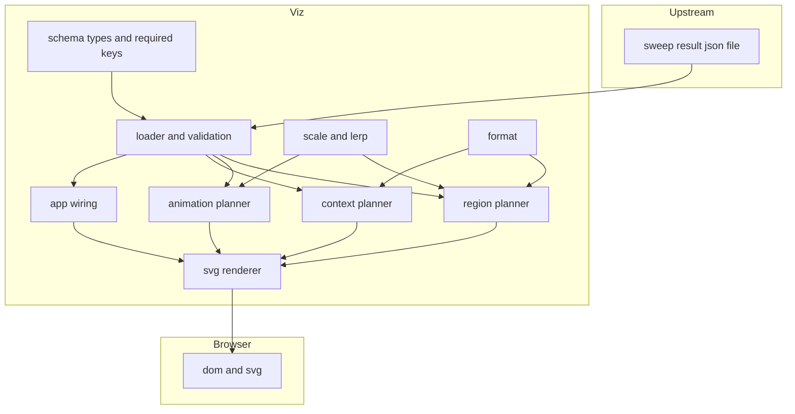
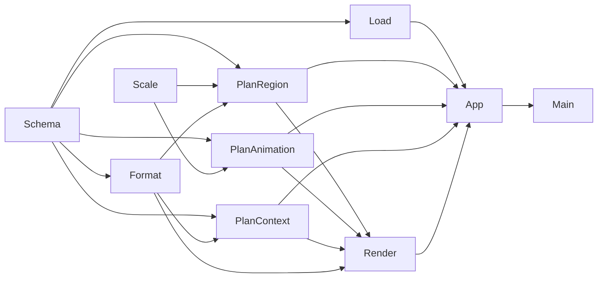
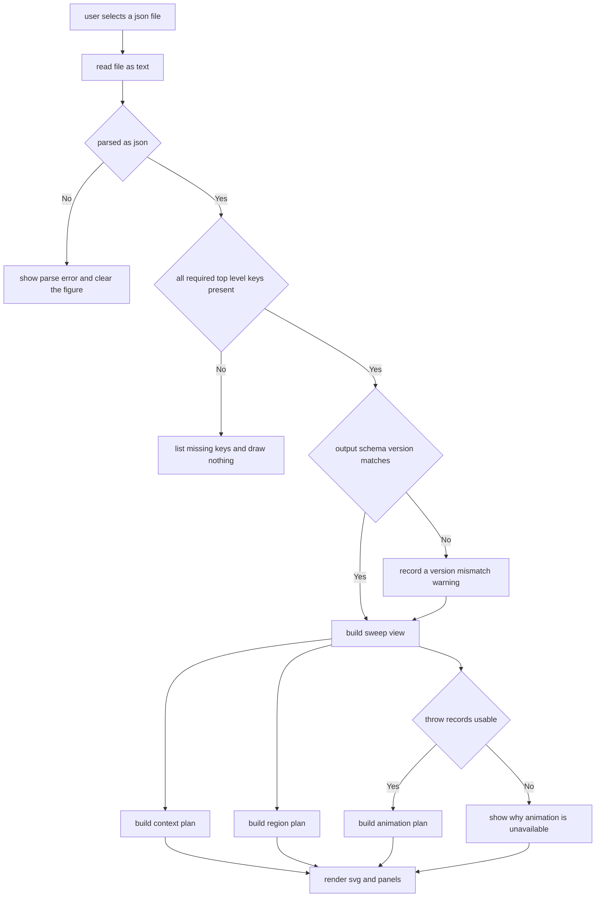
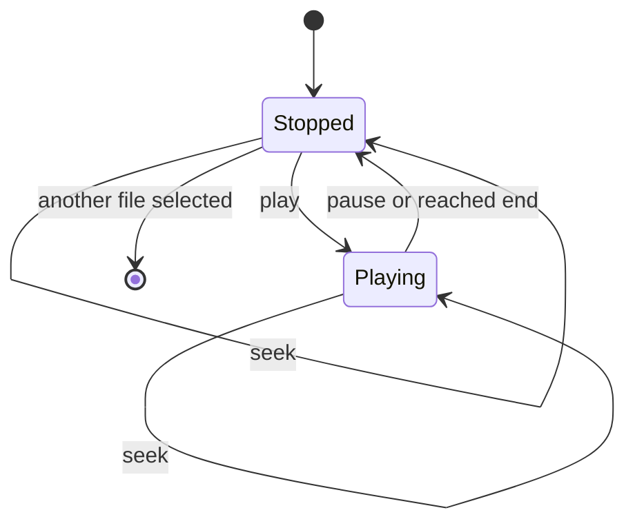

# Technical Design Document: simulator-visualization

## Overview

**Purpose**: 本機能は、`trajectory-simulator` が出力した掃引結果 JSON をローカルファイルとして読み込み、**キャッチ可能領域の図**を主たる出力として、代表シナリオの**軌跡アニメーション**を副次的な出力として、開発PC のブラウザ上に描画する静的ビューアを提供する。価値の中心は「絵が出ること」ではなく、**成立境界を人が見て議論できる状態にすること**と、**その図が前提と限界を必ず伴って提示されること**にある。

**Users**: 投擲レイアウト（OQ-01）を机上で検討する開発者、掃引結果を他人に見せる立場の開発者。本 Spec は**表示の終端**であり、下流の Spec を持たない。

**Impact**: 既存コードへの変更は `.gitattributes` の 1 ブロック追加のみである。新規に `viz/` ディレクトリを追加し、そこに**本リポジトリ初の TypeScript 面**を置く。Python 側（`pyproject.toml` / `src/` / `tests/` / `configs/`）には一切触れない。

### Goals

- 掃引の格子を、成立 / 不成立 / 評価対象外の区別とともに 1 枚の図として描く
- 較正段階・パラメータ出所・モデル除外要因・判定閾値を、図と同じ画面から切り離せない形で提示する
- 前提を欠いた入力（較正段階・除外要因・出所のいずれかが無い JSON）は**図にしない**
- 代表 Throw Record の観測サンプル列と予測系列を、時間軸に沿って再生する
- **ブラウザ側にアルゴリズムを置かないことを、散文ではなく検査で担保する**
- OQ-34（Canvas / SVG / WebGL）を決着させる
- 上記を**実行時依存ゼロ・開発時依存 1 個**で達成する

### Non-Goals

- 物理モデル・予測・掃引・成立判定の実装または移植（**本 Spec の最大の禁止事項**）
- 入力 JSON に存在しない量の算出・推定・補外。**移動体の走行軌跡の再現を含む**
- 常駐サーバ・HTTP API・WebSocket・実機とのライブ接続（柱2b → OQ-38）
- 実データのリプレイビューア・投擲アーカイブ（柱3 → OQ-39）
- 複数の掃引結果を同一画面で自動比較・差分表示すること
- コンポーネントフレームワーク・バンドラ・CSS フレームワークの導入
- リポジトリ全体のディレクトリ構成（OQ-40）と Python 環境構築（OQ-41）の確定

> **タスク数が少ないことは、本 Spec では成功の指標である。**
> `docs/original-features.md` は「可視化に時間をかけすぎて 1（シミュレータ）の結論が出ない」失敗を
> 名指しで警告しており、ロードマップは本 Spec を**先送り可 / 急がない**と位置付けている。
> 機能を足したくなった場合は、実装せずに下の [先送り事項](#先送り事項) へ追記する。

---

## Boundary Commitments

### This Spec Owns

- **入力の読み込みと検証**: ローカル JSON 1 件の解釈、必須項目の検証、欠落時の拒否（要件 1）
- **キャッチ可能領域の描画**: 格子点の配置・状態の区別・軸ラベル・凡例・詳細提示（要件 2）
- **前提と限界の提示**: 較正段階・注意書き・除外要因・パラメータ出所・閾値（要件 3）
- **結果の同一性の提示**: ファイル名・パラメータ全体・機体パラメータ・掃引定義（要件 4）
- **軌跡アニメーション**: 観測サンプル列と予測系列の時間再生（要件 5）
- **表示操作**: ファイル差し替え・軸選択・記録選択・再生操作（要件 6）
- **境界検査**: 実装コードに対する静的検査とその自己検証（要件 7）
- **物理配置**: `viz/**`

### Out of Boundary

- 出力 JSON の**形式の定義**（`trajectory-simulator` が単一定義元。`output_schema_version` に従う側である）
- Throw Record スキーマの定義・改変（`prediction_core` が単一定義元。`docs/decisions.md` D-8）
- 予測・物理・掃引・成立判定のロジック（→ `prediction_core` / `trajectory_sim`。**再実装しない**）
- 移動体の走行軌跡の生成（上流の出力に含まれない。→ [先送り事項](#先送り事項)）
- 上流 Python パッケージの設定変更（`pyproject.toml` の `[project] dependencies` は `[]` のまま）
- `docs/` の更新（OQ-34 の決着内容を `decisions.md` へ移し `tech.md` / `open-questions.md` を直す作業は、`prediction-core` の OQ-31 と同じく**実装完了後の別作業**）
- `viz/` 以外のリポジトリ構成（OQ-40 は未決のまま残す）
- 実機・Raspberry Pi 上での実行（`structure.md` Code Organization Principles）

### Allowed Dependencies

- **実行時依存はゼロ。** ブラウザ標準の API（DOM / SVG / `FileReader` / `requestAnimationFrame`）のみを使う
- **開発時依存は `typescript` 1 個のみ。** テストランナーは Node.js 組み込みの `node:test`、静的配信は `python -m http.server` を用いる
- `viz/src/**` は**相対 import のみ**。`node_modules` からの import を持たない
- 通信 API（`fetch` / `XMLHttpRequest` / `WebSocket` / `EventSource` / `navigator.sendBeacon`）を使わない
- 上流とは**出力 JSON のみ**で接続する。Python の型・コード・実行環境を共有しない

### Revalidation Triggers

以下が発生した場合、本 Spec の再確認が必要になる。

- 上流 `trajectory-simulator` の `output_schema_version` の変更、必須キーの追加・改名・単位変更
- 上流の `CellStatus` / `NotEvaluatedReason` / `CalibrationStage` / `Provenance` の値の増減・改名
- `MODEL_EXCLUSIONS` の段名または要因の増減（＝ OQ-33 の決着内容の変更）
- 上流 `prediction_core` の `SCHEMA_VERSION`、Throw Record の必須キー、`kind` の値（`"prediction"` / `"invalid"`）の変更
- 上流が**合否を断定するキーを出力へ追加**すること（本 Spec の要件 3.6 / 3.7 と衝突する）
- 本 Spec 側の[境界検査](#境界検査)の許可リストを広げる変更（要件 7.6。**境界の変更そのものである**）

---

## Architecture

### Existing Architecture Analysis

既存コードは `src/prediction_core/`（実装完了・`main` へマージ済み）とそのテストのみで、**TypeScript のコードは 1 行も存在しない**。本設計が守るべき既存の制約は次の 4 点である。

| 既存の制約 | 固定している場所 | 本設計への影響 |
|---|---|---|
| Python 側の実行時サードパーティ依存ゼロ | `tests/prediction_core/test_packaging.py`（`dependencies == []` を検査） | **`pyproject.toml` に触れない。** TypeScript 側も同じ規律（実行時依存ゼロ）を自前の検査で敷く |
| Throw Record は `prediction_core` が単一定義元 | `docs/decisions.md` D-8、`src/prediction_core/record.py` | `kind` の値を含め、実装済みのキーをそのまま読む。**再定義しない** |
| 改行コード規約（コードは LF、ドキュメントと JSON は CRLF） | `.gitattributes`、`structure.md` | `*.ts` / `*.html` / `*.css` と `viz/package.json` の指定を追加する必要がある |
| 可視化レイヤを Pi 上で動かさない | `structure.md` Code Organization Principles | 実行環境を開発PC のブラウザに限定する |

上流 `trajectory-simulator/design.md` の Boundary Map には、本 Spec が既に `simulator visualization` として下流に描かれている。**本設計はその位置に実体を置くだけで、上流の境界を変更しない。**

### Architecture Pattern & Boundary Map

**Selected pattern**: **純粋プラン + 薄い描画層**。表示に必要な図形と文字列を、DOM に触れない純粋関数で「プラン」として組み立て、DOM を触る層はプランを SVG 要素へ写すだけにする。



**Architecture Integration**:

- **Selected pattern**: 純粋プラン + 薄い描画層。**DOM 実装（jsdom 等）を導入せずに表示ロジックを単体テストできる**ことが、この選択の直接の理由である。副次的に、DOM を触るモジュールが 3 つに限定され、境界検査が単純になる
- **Domain/feature boundaries**: 未検証の入力に触れてよいのは `load.ts` だけである。`load.ts` を通過した後は、型の付いた検証済みの値しか流れない。この一点集中により要件 1.2 / 1.5 を静的検査で固定できる
- **Existing patterns preserved**: 上流 `prediction_core` の「純関数コア + 薄い状態レイヤ」「不変な値」「無効は例外でなく値」「単位をフィールド名に含める」をそのまま踏襲する。上流由来のフィールド名（`x_mm` / `t_ms` 等）は**改名せずに扱う**
- **New components rationale**: 各コンポーネントは brief.md の Boundary Candidates（データ読み込み / キャッチ可能領域の描画 / 軌跡アニメーション / 操作 UI）に対応する。実装が 1 つしかない抽象（描画バックエンドのインタフェース、プラグイン機構）は置かない
- **Steering compliance**:
  - `tech.md` 開発標準1 — 表示上の色分け閾値を合否条件として表示しない（要件 2.9 / 3.6）
  - `tech.md` 開発標準3 — ブラウザ側にアルゴリズムを持たない。**検査で担保する**（要件 7）
  - `tech.md` 決定表「Hono を使わない」— 常駐サーバ・HTTP API を持たない（要件 8.2）
  - `structure.md` — 可視化レイヤを Pi 上で動かさない（要件 8.1）。距離 mm / 時刻 ms

### Dependency Direction

依存は**左から右へのみ**許可する。右の層が左の層を import してよく、逆は禁止する。



> 矢印は「矢先のモジュールが矢元のモジュールを import してよい」ことを表す。上図に無い辺は禁止である。

| 層 | モジュール | import してよい対象 | DOM |
|---|---|---|---|
| 0 | `schema.ts` | なし（型と定数のみ） | 不可 |
| 0 | `scale.ts` | なし | 不可 |
| 1 | `format.ts` | `schema` | 不可 |
| 1 | `load.ts` | `schema` | 不可 |
| 2 | `plan/region.ts` | `schema`, `scale`, `format` | 不可 |
| 2 | `plan/animation.ts` | `schema`, `scale` | 不可 |
| 2 | `plan/context.ts` | `schema`, `format` | 不可 |
| 3 | `view/render.ts` | `schema`, `format`, `plan/*` | **可** |
| 4 | `app.ts` | 0〜3 のすべて | **可** |
| 5 | `main.ts` | `app` のみ | **可** |

> **DOM に触れてよいのを 3 モジュールに限定するのが、テスト戦略の前提である。**
> `plan/*` が DOM を知らない構造にしておけば、表示ロジックの全体を Node.js 上で検証でき、
> DOM 実装をサードパーティ依存として抱え込まずに済む。
>
> `plan/animation.ts` が `format` を import しないのは意図的である。アニメーション面の文言は
> `view/render.ts` 側で組み立てる。フレームごとに文字列を作らないための措置である。

### Technology Stack

| Layer | Choice / Version | Role in Feature | Notes |
|-------|------------------|-----------------|-------|
| 言語 | TypeScript >= 5.5（`strict: true`） | 実装言語 | `any` を使わない。`noUncheckedIndexedAccess` を有効にする |
| 描画 | **SVG（ブラウザ標準）** | 格子図・軌跡・凡例 | **OQ-34 の決着**。理由は下の [OQ-34 の決着](#oq-34-の決着) |
| 実行時ライブラリ | **なし** | — | `package.json` の `dependencies` は `{}`。境界検査で固定する |
| ビルド | `tsc` のみ（バンドラなし） | `viz/src/**.ts` → `viz/dist/src/**.js`（ES モジュール） | `index.html` が `dist/src/main.js` を `type="module"` で読む |
| テスト | Node.js 組み込み `node:test` / `node:assert/strict`（Node >= 20） | 単体テストと境界検査 | `tsc` が出力した JavaScript に対して実行する。実験的機能に依存しない |
| 境界検査 | TypeScript Compiler API（`ts.createSourceFile`） | ソースの AST 走査 | 上流 Python 側が `ast` で行っている検査と同じ形 |
| 配信 | `python -m http.server`（既存の Python 環境） | 静的ファイル配信 | **常駐サーバ・HTTP API を持たない。** Hono を使わない |
| 実行環境 | 開発PC（Windows + WSL2）のブラウザ | 表示 | **Raspberry Pi 上では動かさない** |

#### OQ-34 の決着

**SVG を採用する。Canvas 2D と WebGL は採らない。**

| 手段 | 判断 | 理由 |
|---|---|---|
| **SVG** | **採用** | 当たり判定（要件 2.6 は `<title>` 子要素だけで満たせる）・テキスト配置・拡大縮小をブラウザが持つ。**表示側に書くコードが最も少ない。** ベクタのまま保存でき、レイアウト議論の材料として `docs/` へ持ち込める |
| Canvas 2D | 不採用 | 座標から格子点への逆引き・文字配置を自前で書くことになり、**表示側の算術が増える**。ラスタでしか保存できない |
| WebGL | 不採用 | 描画対象は格子点 数十〜数百、軌跡 数十点であり、規模が 3 桁足りない。`tech.md`「使いたい技術に合わせて用途を作らない」に反する |

> 判断の軸を**描画性能ではなく「表示側に書かずに済むコードの量」**に置いたのは、
> 本 Spec の最大のリスクがアルゴリズムの流入（要件 7）であるためである。
> 格子点が数千を超えて DOM 要素数が問題になった場合は、`view/render.ts` だけを差し替える。
> **今は差し替えのための抽象を作らない。**
>
> `tech.md` Core Technologies 表の「Canvas / WebGL」は OQ-34 未決時点の候補列挙であり、決定ではない。
> 表記の修正は実装完了後の `docs` 更新作業に含める。

---

## File Structure Plan

### Directory Structure

```
.gitattributes                          # 変更。*.ts / *.html / *.css と viz の package 系を LF に固定
viz/
├── package.json                        # dependencies は {}。devDependencies は typescript のみ
│                                       #   scripts: build (tsc) / test (tsc && node --test dist/tests)
│                                       #   engines.node >= 20
├── tsconfig.json                       # strict, ES2022, lib: [ES2022, DOM], rootDir ".", outDir "dist"
├── index.html                          # 唯一の HTML。dist/src/main.js を type=module で読む
├── style.css                           # 最小限のレイアウト。図の色は CSS カスタムプロパティで定義
├── src/
│   ├── schema.ts                       # 入力 JSON の型・列挙値・必須キー表・想定スキーマ版（要件 1.2, 1.4）
│   ├── scale.ts                        # 値域から画面座標への線形写像と lerp（唯一の補間実装。要件 5.6）
│   ├── format.ts                       # 数値・単位・列挙値・パスの表示文字列化（画面文言の単一の出所）
│   ├── load.ts                         # テキストから検証済み SweepView を作る。未検証の値に触れる唯一の場所
│   ├── plan/
│   │   ├── region.ts                   # キャッチ可能領域のプラン（要件 2）
│   │   ├── animation.ts                # 軌跡アニメーションのプランとフレーム（要件 5）
│   │   └── context.ts                  # 前提・限界・同一性のプラン（要件 3, 4）
│   ├── view/
│   │   └── render.ts                   # プランを SVG / DOM へ写す。描画の唯一の実装
│   ├── app.ts                          # 画面の組み立て、ファイル選択・軸選択・再生操作の結線（要件 6）
│   └── main.ts                         # エントリポイント。app を起動するだけ
└── tests/
    ├── fixtures.ts                     # 上流の出力形式に沿った最小入力を生成する関数群（fs を使わない）
    ├── load.test.ts                    # 必須項目の欠落・不正 JSON・版不一致・記録欠如（要件 1）
    ├── scale.test.ts                   # 線形写像の端点一致・逆写像・lerp の境界
    ├── format.test.ts                  # 単位付き表記、列挙値の表示、断定語を含まないこと（要件 3.6）
    ├── plan-region.test.ts             # 格子配置、状態の区別、軸選択、固定軸、凡例（要件 2）
    ├── plan-animation.test.ts          # 時刻からのフレーム、線形補間のみ、無効予測の区別（要件 5）
    ├── plan-context.test.ts            # 較正段階・除外要因・出所・閾値・機体パラメータ（要件 3, 4）
    ├── boundaries.test.ts              # 依存方向・依存ゼロ・通信禁止・算術制限などの静的検査（要件 7）
    └── boundaries-negative.test.ts     # 違反例に対して検査が実際に落ちることの証明（要件 7.5）
```

### Modified Files

- `.gitattributes` — 次のブロックを追加する。**既存の行は変更しない**

  ```
  *.ts    text eol=lf
  *.html  text eol=lf
  *.css   text eol=lf
  viz/package.json      text eol=lf
  viz/package-lock.json text eol=lf
  viz/tsconfig.json     text eol=lf
  ```

  > 既定では `*.json text eol=crlf` が効くが、npm は `package.json` / `package-lock.json` を
  > LF で書き戻すため、指定しないと**インストールのたびに全行差分が出る**。
  > `tsconfig.json` も同じ理由で LF に揃える。

- `.gitignore` — `viz/node_modules/` と `viz/dist/` を追加する

> `pyproject.toml` には**触れない**。`[project] dependencies` は `[]` のままであり、
> `tests/prediction_core/test_packaging.py` がそれを検査している。

---

## 入力契約

**契約は出力 JSON のみである。** Python の型・コードを共有しない。以下は上流 `trajectory-simulator/design.md` の `ResultSerializer` と、実装済みの `src/prediction_core/record.py` から確定させたものである。

### 最上位構造

| キー | 必須 | 内容 | 表示先 |
|---|---|---|---|
| `output_schema_version` | ✅ | 出力形式の版（初版 `"1.0"`） | 同一性パネル（不一致は警告） |
| `calibration` | ✅ | `{ stage, notice }` | **常時表示のバナー** |
| `model_exclusions` | ✅ | 段名 → 要因名の配列 | 前提と限界パネル（全項目） |
| `sweep` | ✅ | `{ kind, axes[], trials_per_cell, seed, catch_ratio_threshold }` | 軸ラベル・凡例・同一性パネル |
| `parameters` | ✅ | シナリオパラメータ全体（任意の入れ子） | パラメータ表（パスへ平坦化） |
| `parameter_provenance` | ✅ | パス → `measured` / `assumed` | パラメータ表の出所欄 |
| `cells` | ✅ | 格子点の配列 | キャッチ可能領域の図 |
| `throw_records` | — | 代表 Throw Record の配列 | 軌跡アニメーション |

- `sweep.axes[]` = `{ name, unit, values[] }`。`values` の要素は数値または文字列
- `sweep.catch_ratio_threshold` は `null` になりうる（試行 1 回の掃引）
- `cells[]` = `{ axis_values[], status, success_ratio, metrics, not_evaluated_reason }`
- `calibration.notice` は較正済みの場合 `null` になりうる

### 列挙値（上流の値をそのまま用いる。翻訳表は `format.ts` が持つ）

| 種別 | 値 |
|---|---|
| `status` | `catchable` / `not_catchable` / `not_evaluated` |
| `not_evaluated_reason` | `no_floor_crossing` / `no_samples` / `no_valid_prediction` |
| `calibration.stage` | `uncalibrated` / `m1_calibrated` / `m2_calibrated` |
| `parameter_provenance` の値 | `measured` / `assumed` |
| `sweep.kind` | `reachability` / `throw` |
| `model_exclusions` の段名 | `throw_physics` / `observation` / `drivetrain` / `catch` |

### Throw Record（`prediction_core.ThrowRecord.to_dict` の実際の形）

- `{ schema_version, record_id, source, config, samples[], predictions[], extra }`
- `samples[]` = `{ t_ms, x_mm, y_mm, z_mm }`
- `predictions[]` は `kind` キーによる直和
  - `kind === "prediction"`: `predicted_hit_x_mm` / `predicted_hit_y_mm` / `predicted_hit_time_ms` / `remaining_time_ms` / `residual` / `sample_count` / `based_on_time_ms` ほか
  - `kind === "invalid"`: `reason` / `detail` / `sample_count` / `based_on_time_ms`
- **本 Spec は読むキーだけを型に書く。** 読まないキー（`estimated_v*` / `trajectory` / `config` / `elapsed_ms` / `extra`）は型に含めない

### 上流に存在しないもの（＝ 本 Spec が描かないもの）

| 項目 | 扱い |
|---|---|
| 移動体の走行軌跡（時系列の位置） | **描かない。** `metrics` の必要移動量・持ち時間を数値として併記するにとどめる（要件 5.7） |
| 真の軌道の連続曲線・真の落下地点 | **描かない。** 描けるのは記録にある観測点と予測点のみ |
| 合否・達成の断定 | **上流が意図的に出力しない。** 本 Spec はその欠如を欠陥として補わない（要件 3.7） |

### 仮定と、異なっていた場合の扱い

| 仮定 | 根拠 | 異なっていた場合 |
|---|---|---|
| `throw_records` は配列である | 上流 design のキー名（複数形）と「代表シナリオの Throw Record」という記述 | 配列でなければ**アニメーション面のみ縮退**し、その旨を提示する。図の描画は続行する（要件 1.7）。推測による吸収を行わない |
| `cells[].metrics` のキー名は掃引設定に依存する | 上流は「位置誤差・持ち時間・必要移動量・予測誤差・残留速度の平均」を入れるとしている | キー名を決め打ちせず、**存在するキーをそのまま表示する**。既知のキーには `format.ts` が単位付きの表示名を与え、未知のキーはキー名のまま出す |

---

## System Flows

### 読み込みから描画までのフロー



**Key decisions**:

- **必須項目の欠落は fail closed。** 図を一切描かず、欠けているキー名を列挙する。これは要件 1.2 と 3.1〜3.4 を「注意書きを添える」ではなく「前提が無いデータは図にしない」という強度で実装するための判断である
- **版の不一致は警告にとどめる**（要件 1.4）。読める形をしていれば描く。ただし警告は較正バナーと同じ帯に出す
- **代表 Throw Record の欠如は縮退**（要件 1.7）。図が主、アニメーションが副という価値の順序を、失敗時の挙動にも反映する

### 再生のフロー



現在時刻は記録の時間基準（`samples[0].t_ms` から最終サンプルまで）で保持する。フレームごとに `frameAt(plan, timeMs)` を呼び、返ったフレームプランを描画層へ渡すだけで、**再生側が位置を計算することはない**。

---

## Requirements Traceability

| Requirement | Summary | Components | Interfaces | Flows |
|---|---|---|---|---|
| 1.1 | ローカル JSON 1 件を入力とする | App | `<input type="file">` と `FileReader` | 読み込み |
| 1.2 | 必須項目の欠落で描画しない | Loader, Schema | `loadSweep`, `REQUIRED_TOP_LEVEL_KEYS` | 読み込み |
| 1.3 | JSON として解釈できない場合 | Loader, App | `LoadResult` の `ok: false` | 読み込み |
| 1.4 | 出力形式の版の不一致を提示 | Loader, ContextPlanner | `LoadIssue` の `schema_version_mismatch` | 読み込み |
| 1.5 | 入力に無い量を作らない | Loader, 全 Planner | 境界検査 B-5 / B-6 / B-8 | — |
| 1.6 | ファイル名を併せて提示 | ContextPlanner | `ContextPlan.identity` | 読み込み |
| 1.7 | 記録が無くても図は描く | Loader, App | `SweepView.recordsIssue` | 読み込み |
| 2.1 | 格子点を軸の値の位置へ配置 | RegionPlanner, Scale | `buildRegionPlan`, `linearMap` | — |
| 2.2 | 状態を視覚的に区別 | RegionPlanner, Renderer | `RegionCell.fillKey` | — |
| 2.3 | 軸の名前・単位・値をラベルに | RegionPlanner, Format | `RegionPlan.xAxis` / `yAxis` | — |
| 2.4 | 成立割合と閾値の併記 | RegionPlanner | `RegionPlan.legend` | — |
| 2.5 | 評価対象外を別表現に | RegionPlanner | `RegionCell.fillKey`, `tooltip` | — |
| 2.6 | 格子点の詳細提示 | RegionPlanner, Renderer | `RegionCell.tooltip` と SVG `<title>` | — |
| 2.7 | 3 軸以上での 2 軸選択と固定軸の提示 | RegionPlanner, App | `AxisSelection`, `RegionPlan.fixedAxes` | — |
| 2.8 | 1 軸のときの並び | RegionPlanner | `AxisSelection.yAxisIndex === null` | — |
| 2.9 | 色分けは表示上の取り決めである旨 | RegionPlanner, Format | `RegionPlan.note` | — |
| 3.1 | 較正段階の常時表示 | ContextPlanner, Renderer | `ContextPlan.calibrationBanner` | 読み込み |
| 3.2 | 未較正時の注意書き | ContextPlanner | `calibrationBanner.notice` | 読み込み |
| 3.3 | 除外要因を全項目提示 | ContextPlanner, Renderer | `ContextPlan.exclusions` | — |
| 3.4 | 出所をパラメータと対に | ContextPlanner | `ParameterRow.provenance` | — |
| 3.5 | 閾値と試行回数の併記 | RegionPlanner, ContextPlanner | `legend`, `identity` | — |
| 3.6 | 断定的表現を用いない | Format | 境界検査 B-10 | — |
| 3.7 | 入力に無い判定を生成しない | 全 Planner | 境界検査 B-5 / B-6 | — |
| 4.1 | パラメータ全体の提示 | ContextPlanner | `ContextPlan.parameters` | — |
| 4.2 | 機体パラメータの提示 | ContextPlanner | `ContextPlan.drivetrainRows` | — |
| 4.3 | 掃引定義の提示 | ContextPlanner | `ContextPlan.identity` | — |
| 4.4 | ファイル名と較正段階を図と同時に | Renderer, App | 画面レイアウト | — |
| 4.5 | 自動比較を持たない | Non-Goals | — | — |
| 5.1 | 観測サンプル列の時間再生 | AnimationPlanner, App | `buildAnimationPlan`, `frameAt` | 再生 |
| 5.2 | 予測落下地点とサンプル数 | AnimationPlanner | `PredictionMarker` | 再生 |
| 5.3 | 現在の再生時刻の提示 | AnimationPlanner, Renderer | `FramePlan.timeMs` | 再生 |
| 5.4 | 無効予測の区別と理由 | AnimationPlanner, Format | `PredictionMarker.invalid` | 再生 |
| 5.5 | 再生操作 | App | 再生 / 停止 / 先頭 / シーク | 再生 |
| 5.6 | 線形補間のみ | Scale, AnimationPlanner | `lerp`（唯一の補間実装） | 再生 |
| 5.7 | 記録に無い量を描かない | AnimationPlanner | 境界検査 B-5 / B-6 | 再生 |
| 5.8 | 複数記録からの選択 | App | 記録セレクタ | 再生 |
| 6.1 | ファイル差し替え | App | ファイル入力の再選択 | 読み込み |
| 6.2 | 図と再生への同一画面からの到達 | App, Renderer | 単一ページ構成 | — |
| 6.3 | 切り替え後も前提提示を維持 | App | 文脈パネルを再描画対象から外さない | — |
| 6.4 | パラメータ編集を提供しない | Non-Goals | — | — |
| 6.5 | 状態を永続化しない | App | 境界検査 B-3（`localStorage` を含む） | — |
| 7.1 | アルゴリズムを含まない | 全モジュール | 境界検査 B-1〜B-10 | — |
| 7.2 | 検査として検証可能 | BoundaryCheck | `boundaries.test.ts` | — |
| 7.3 | 通信機構を含まない | BoundaryCheck | 境界検査 B-3 | — |
| 7.4 | 実行時依存ゼロ | BoundaryCheck | 境界検査 B-2 / B-9 | — |
| 7.5 | 検査が違反を検出することの証明 | BoundaryCheck | `boundaries-negative.test.ts` | — |
| 7.6 | 許可範囲の拡大が差分に現れる | BoundaryCheck | 許可リストをソース内の定数で持つ | — |
| 8.1 | 開発PC のブラウザで動作 | Technology Stack | — | — |
| 8.2 | 常駐サーバを持たない | Technology Stack, BoundaryCheck | 境界検査 B-3 | — |
| 8.3 | ハード非接続で全機能確認 | Testing Strategy | 単体テストと手動確認手順 | — |
| 8.4 | 既存の出力ファイルだけで動作 | App | ファイル選択のみ | 読み込み |
| 8.5 | Python 側設定を変更しない | Out of Boundary | `pyproject.toml` に触れない | — |

---

## Components and Interfaces

| Component | Layer | Intent | Req Coverage | Key Dependencies (P0/P1) | Contracts |
|---|---|---|---|---|---|
| Schema | L0 | 入力 JSON の型・列挙値・必須キー表 | 1.2, 1.4 | なし | State |
| Scale | L0 | 線形写像と唯一の補間実装 | 2.1, 5.6 | なし | Service |
| Format | L1 | 画面文言の単一の出所 | 2.3, 2.9, 3.6, 5.4 | Schema (P0) | Service |
| Loader | L1 | 未検証の入力を検証済みの値へ変える唯一の場所 | 1.1〜1.7 | Schema (P0) | Service |
| RegionPlanner | L2 | キャッチ可能領域のプラン生成 | 2.1〜2.9, 3.5 | Schema/Scale/Format (P0) | Service |
| AnimationPlanner | L2 | 軌跡アニメーションのプランとフレーム生成 | 5.1〜5.8 | Schema/Scale (P0) | Service |
| ContextPlanner | L2 | 前提・限界・同一性のプラン生成 | 3.1〜3.5, 4.1〜4.4 | Schema/Format (P0) | Service |
| Renderer | L3 | プランを SVG / DOM へ写す | 2.2, 2.6, 3.3, 4.4, 5.3 | Plan/*, Format (P0) | Service |
| App | L4 | 画面の組み立てと操作の結線 | 1.1, 1.3, 6.1〜6.5 | Loader/Plan/Renderer (P0) | State |
| BoundaryCheck | test | 境界違反の静的検出とその自己検証 | 7.1〜7.6 | TypeScript Compiler API (P0) | Service |

### L0-L1 基盤層

#### Schema

| Field | Detail |
|---|---|
| Intent | 入力 JSON の型・列挙値・必須キー表を宣言する |
| Requirements | 1.2, 1.4 |

**Responsibilities & Constraints**

- 上流のフィールド名を**そのまま**型のプロパティ名にする（`x_mm` / `t_ms` / `success_ratio` 等）。読みやすさのための改名を行わない
- **読むキーだけを型に書く。** 読まないキーを型へ書かない
- ロジックを持たない。関数を公開しない
- `parameters` は任意の入れ子であるため `JsonValue` として受ける

**Contracts**: State [x]

##### State Management

```typescript
export type JsonValue =
  | null | boolean | number | string
  | readonly JsonValue[]
  | { readonly [key: string]: JsonValue };

export type CellStatus = "catchable" | "not_catchable" | "not_evaluated";
export type NotEvaluatedReason = "no_floor_crossing" | "no_samples" | "no_valid_prediction";
export type CalibrationStage = "uncalibrated" | "m1_calibrated" | "m2_calibrated";
export type ProvenanceKind = "measured" | "assumed";
export type SweepKind = "reachability" | "throw";
export type AxisValue = number | string;

export interface AxisSpec {
  readonly name: string;
  readonly unit: string;
  readonly values: readonly AxisValue[];
}

export interface SweepSpec {
  readonly kind: SweepKind;
  readonly axes: readonly AxisSpec[];
  readonly trials_per_cell: number;
  readonly seed: number;
  readonly catch_ratio_threshold: number | null;
}

export interface CellResult {
  readonly axis_values: readonly AxisValue[];
  readonly status: CellStatus;
  readonly success_ratio: number | null;
  readonly metrics: { readonly [key: string]: number };
  readonly not_evaluated_reason: NotEvaluatedReason | null;
}

export interface Calibration {
  readonly stage: CalibrationStage;
  readonly notice: string | null;
}

export interface SampleEntry {
  readonly t_ms: number;
  readonly x_mm: number;
  readonly y_mm: number;
  readonly z_mm: number;
}

export interface PredictionEntry {
  readonly kind: "prediction";
  readonly predicted_hit_x_mm: number;
  readonly predicted_hit_y_mm: number;
  readonly predicted_hit_time_ms: number;
  readonly remaining_time_ms: number;
  readonly residual: number;
  readonly sample_count: number;
  readonly based_on_time_ms: number;
}

export interface InvalidPredictionEntry {
  readonly kind: "invalid";
  readonly reason: string;
  readonly detail: string;
  readonly sample_count: number;
  readonly based_on_time_ms: number | null;
}

export type PredictionEntryUnion = PredictionEntry | InvalidPredictionEntry;

export interface ThrowRecordDoc {
  readonly schema_version: string;
  readonly record_id: string;
  readonly source: string;
  readonly samples: readonly SampleEntry[];
  readonly predictions: readonly PredictionEntryUnion[];
}

export interface SweepDocument {
  readonly output_schema_version: string;
  readonly calibration: Calibration;
  readonly model_exclusions: { readonly [stage: string]: readonly string[] };
  readonly sweep: SweepSpec;
  readonly parameters: JsonValue;
  readonly parameter_provenance: { readonly [path: string]: ProvenanceKind };
  readonly cells: readonly CellResult[];
}

export const REQUIRED_TOP_LEVEL_KEYS = [
  "output_schema_version", "calibration", "model_exclusions", "sweep",
  "parameters", "parameter_provenance", "cells",
] as const;

export const EXPECTED_OUTPUT_SCHEMA_VERSION = "1.0";
export const EXPECTED_RECORD_SCHEMA_VERSION = "1.0";
```

- Invariants: `REQUIRED_TOP_LEVEL_KEYS` に `throw_records` を含めない（要件 1.7）

**Implementation Notes**

- Risks: 上流の列挙値が増えた場合、型は狭いまま実行時に未知の値が来る。`load.ts` が**未知の列挙値を検証時に検出する**ことでこの隙間を塞ぐ

#### Scale

| Field | Detail |
|---|---|
| Intent | 値域から画面座標への線形写像と、**本 Spec で唯一の補間実装** |
| Requirements | 2.1, 5.6 |

**Responsibilities & Constraints**

- 線形写像のみを提供する。非線形（対数・平方根・三角関数）の写像を持たない
- `lerp` は**このモジュールにのみ存在する**。他モジュールで補間を書かない（境界検査 B-7）
- DOM を知らない。SVG の単位や属性名を知らない

**Contracts**: Service [x]

```typescript
export interface Range { readonly min: number; readonly max: number; }

export function linearMap(value: number, from: Range, to: Range): number;
export function rangeOf(values: readonly number[]): Range;      // 空配列は { min: 0, max: 0 }
export function padRange(range: Range, ratio: number): Range;   // 端に余白を作る
export function lerp(a: number, b: number, t: number): number;  // t は 0..1 に丸める
```

- Preconditions: `from.min !== from.max`。等しい場合 `linearMap` は `to` の中央を返す（ゼロ除算を作らない）
- Postconditions: `linearMap(from.min, from, to) === to.min`、`linearMap(from.max, from, to) === to.max`
- Invariants: 出力は入力が有限であれば有限である

**Implementation Notes**

- Validation: 端点一致と単調性を単体テストで固定する
- Risks: 「見やすくするための」対数軸を足したくなる場面がありうるが、**軸の意味を変える表示は上流の軸定義から離れる**ため足さない

#### Format

| Field | Detail |
|---|---|
| Intent | 画面に出る文言を 1 箇所で作る |
| Requirements | 2.3, 2.9, 3.6, 5.4 |

**Responsibilities & Constraints**

- 上流の列挙値（`catchable` 等）から表示名への対応表を持つ。**対応表は本モジュールにのみ置く**
- 数値は単位付きで表示する。単位は上流の軸定義（`AxisSpec.unit`）とフィールド名の接尾辞に従う
- **合否・達成・NFR-7 の充足に相当する断定語を生成しない**（要件 3.6、境界検査 B-10）
- `metrics` の既知キーに表示名を与え、未知のキーはキー名のまま返す

**Contracts**: Service [x]

```typescript
export function formatNumber(value: number, digits: number): string;
export function formatWithUnit(value: number, unit: string): string;
export function formatAxisValue(value: AxisValue, unit: string): string;
export function statusLabel(status: CellStatus): string;
export function notEvaluatedReasonLabel(reason: NotEvaluatedReason): string;
export function calibrationStageLabel(stage: CalibrationStage): string;
export function provenanceLabel(kind: ProvenanceKind): string;
export function metricLabel(key: string): string;
export function invalidReasonLabel(reason: string): string;   // 未知の値はそのまま返す
```

- Postconditions: どの関数も断定語（「合格」「不合格」「達成」「NFR-7」「PASS」「FAIL」「OK」「NG」）を含む文字列を返さない

**Implementation Notes**

- Integration: 表示名は「成立」ではなく**上流の語をそのまま補足する**方向で付ける（例: `catchable` → 「catchable（到達可）」）。判定語に読み替えない
- Validation: 全ての公開関数の戻り値に断定語が含まれないことをテストで走査する

#### Loader

| Field | Detail |
|---|---|
| Intent | 未検証の入力に触れる唯一の場所。検証済みの値だけを下流へ渡す |
| Requirements | 1.1, 1.2, 1.3, 1.4, 1.5, 1.6, 1.7 |

**Responsibilities & Constraints**

- 入力はテキストとファイル名のみ。**ファイルシステム・ネットワークに触れない**（読み出しは `App` の責務）
- 必須項目が 1 つでも欠けていれば `ok: false` を返す。**部分的に描ける状態を作らない**
- 版の不一致は**警告**として返し、読み込みは成功させる
- `throw_records` が無い / 配列でない / 要素が読めない場合は、**図の読み込みは成功させ**、記録側の問題を `recordsIssue` として返す
- **入力に無い値を作らない。** 既定値の補完・推定・単位換算を行わない

**Contracts**: Service [x]

```typescript
export type LoadIssueCode =
  | "not_json" | "not_object" | "missing_key" | "wrong_type"
  | "unknown_enum_value" | "schema_version_mismatch" | "records_unusable";

export interface LoadIssue {
  readonly code: LoadIssueCode;
  readonly path: string;     // 例: "cells[3].status"
  readonly detail: string;
}

export interface SweepView {
  readonly fileName: string;
  readonly document: SweepDocument;
  readonly records: readonly ThrowRecordDoc[];
  readonly recordsIssue: LoadIssue | null;
}

export type LoadResult =
  | { readonly ok: true; readonly view: SweepView; readonly warnings: readonly LoadIssue[] }
  | { readonly ok: false; readonly errors: readonly LoadIssue[] };

export function loadSweep(text: string, fileName: string): LoadResult;
```

- Preconditions: なし。あらゆる文字列を受け付ける
- Postconditions: `ok: true` のとき `view.document` の全必須項目が型どおりに存在する。以降のモジュールは再検証を必要としない
- Invariants: `ok: false` のとき `errors` は空でない。`recordsIssue !== null` のとき `records` は空配列

**Implementation Notes**

- Integration: 未知の列挙値（`status` 等）は `unknown_enum_value` として**エラー**にする。黙って「その他」に丸めると、上流の変更が表示側で見えなくなる
- Validation: 欠落キーごと・型不一致ごとに 1 件の `LoadIssue` を返し、**最初の 1 件で打ち切らない**（何が足りないかを一度に見せるため）
- Risks: `parameters` は任意の入れ子であるため構造検証を行わない。`JsonValue` であることのみを確認する

### L2 プラン層

#### RegionPlanner

| Field | Detail |
|---|---|
| Intent | キャッチ可能領域の図を、DOM に依存しない図形と文字列の集合として組み立てる |
| Requirements | 2.1〜2.9, 3.5 |

**Responsibilities & Constraints**

- 軸は最大 2 本を描画に使う。3 本目以降は**固定値で絞り込む**（要件 2.7）
- 格子点の位置は**軸の値の並び順**で決める（等間隔配置）。値そのものを座標に線形写像しない
- 色は決めない。`fillKey`（状態と成立割合の帯）を返し、実際の色は CSS が持つ
- 成立割合の帯は**表示上の取り決め**であり、その旨と閾値を `note` / `legend` に含める（要件 2.9 / 3.5）
- **判定を行わない。** `status` は上流の値をそのまま使う

**Contracts**: Service [x]

```typescript
export interface AxisSelection {
  readonly xAxisIndex: number;
  readonly yAxisIndex: number | null;                        // 1 軸掃引では null
  readonly fixed: { readonly [axisName: string]: AxisValue }; // 3 軸以上のときの固定値
}

export interface RegionCell {
  readonly column: number;
  readonly row: number;
  readonly status: CellStatus;
  readonly fillKey: string;    // 例: "catchable-band-3" / "not-evaluated"
  readonly tooltip: string;    // 軸の値・状態・成立割合・指標
}

export interface LegendEntry { readonly fillKey: string; readonly label: string; }
export interface FixedAxisNote { readonly axisName: string; readonly valueLabel: string; }

export interface RegionPlan {
  readonly xAxis: AxisSpec;
  readonly yAxis: AxisSpec | null;
  readonly columnLabels: readonly string[];
  readonly rowLabels: readonly string[];
  readonly cells: readonly RegionCell[];
  readonly legend: readonly LegendEntry[];
  readonly fixedAxes: readonly FixedAxisNote[];
  readonly thresholdNote: string;   // 判定閾値と試行回数（要件 3.5）
  readonly displayNote: string;     // 色分けは表示上の取り決めである旨（要件 2.9）
}

export function defaultSelection(sweep: SweepSpec): AxisSelection;
export function buildRegionPlan(view: SweepView, selection: AxisSelection): RegionPlan;
```

- Preconditions: `selection` の軸番号が `sweep.axes` の範囲内であること
- Postconditions: `cells` に含まれるのは、固定軸の値が一致する格子点のみ
- Invariants: `yAxis === null` のとき全ての `RegionCell.row === 0`

**Implementation Notes**

- Integration: 成立割合の帯の境界は本モジュール内の定数表（`SUCCESS_RATIO_BANDS`）に置く。**上流の `catch_ratio_threshold` とは別物**であり、凡例で両者を区別して示す
- Validation: 3 軸の掃引に対して固定軸が正しく絞り込むこと、1 軸の掃引が 1 行になること、`not_evaluated` が `not_catchable` と異なる `fillKey` を得ることをテストで固定する
- Risks: 「見やすさのために格子点を補間して滑らかな境界を描く」ことは、**上流が評価していない点の値を作ることに等しい**。行わない

#### AnimationPlanner

| Field | Detail |
|---|---|
| Intent | Throw Record を時間軸の再生用データへ変換し、任意時刻のフレームを返す |
| Requirements | 5.1〜5.4, 5.6, 5.7 |

**Responsibilities & Constraints**

- 投影は 2 種類のみ: `"xy"`（床面を真上から）と `"xz"`（水平方向と高さ）。**両方を同時に描く**ため切替 UI を作らない
- 現在位置は、記録にある**隣り合う 2 つの観測点の線形補間**でのみ求める（要件 5.6）
- 予測は生成順に並べ、`kind` によって有効 / 無効を区別する（要件 5.4）
- **記録に無い量を作らない。** 移動体の位置・真の軌道・外挿を返さない（要件 5.7）

**Contracts**: Service [x]

```typescript
export type Projection = "xy" | "xz";
export interface Point2D { readonly u: number; readonly v: number; }

export interface PredictionMarker {
  readonly index: number;
  readonly sampleCount: number;
  readonly basedOnTimeMs: number | null;
  readonly hit: Point2D | null;       // 無効予測では null
  readonly invalidReason: string | null;
  readonly detail: string | null;
}

export interface AnimationPlan {
  readonly recordId: string;
  readonly projection: Projection;
  readonly startTimeMs: number;
  readonly endTimeMs: number;
  readonly path: readonly Point2D[];              // 全観測点（投影済み）
  readonly times: readonly number[];              // path と同じ長さ
  readonly predictions: readonly PredictionMarker[];
  readonly uRange: Range;
  readonly vRange: Range;
}

export interface FramePlan {
  readonly timeMs: number;
  readonly visibleCount: number;                  // timeMs 以下の観測点数
  readonly head: Point2D | null;                  // 線形補間で求めた現在位置
  readonly activePrediction: PredictionMarker | null;
}

export function buildAnimationPlan(record: ThrowRecordDoc, projection: Projection): AnimationPlan;
export function frameAt(plan: AnimationPlan, timeMs: number): FramePlan;
```

- Preconditions: `record.samples` は上流が時刻昇順で記録したものとして扱う。**並べ替えを行わない**（並んでいなければ上流の問題である）
- Postconditions: `frameAt(plan, plan.startTimeMs).visibleCount >= 1`、`frameAt(plan, plan.endTimeMs).visibleCount === plan.path.length`
- Invariants: `head` は必ず `path` の隣接 2 点を結ぶ線分上にある

**Implementation Notes**

- Integration: `activePrediction` は「`based_on_time_ms <= timeMs` を満たす最後の予測」とする。**予測の再計算ではなく、記録済み系列からの選択である**
- Validation: サンプルの中間時刻で `head` が 2 点の中点になること、`lerp` 以外の補間が使われていないこと（境界検査 B-7）をテストで固定する
- Risks: 記録のサンプル数が 0 の場合は `path` が空になる。`frameAt` は `head: null` を返し、描画側は軌跡を描かない

#### ContextPlanner

| Field | Detail |
|---|---|
| Intent | 前提・限界・同一性を、図と同じ画面に出すための行の集合へ変換する |
| Requirements | 3.1〜3.5, 4.1〜4.4 |

**Responsibilities & Constraints**

- `parameters`（任意の入れ子）を**ドット区切りのパスへ平坦化**し、`parameter_provenance` のキーと突き合わせる。平坦化は構造のみに基づき、パラメータの意味を知らない
- 除外要因は**段ごとに全項目**を返す。件数だけの要約に置き換えない（要件 3.3）
- 機体パラメータの抜き出しは、パスが `drivetrain.` で始まる行の抽出のみで行う（要件 4.2）
- 較正段階は常に返す。`notice` は存在すればそのまま返す（要件 3.1 / 3.2）

**Contracts**: Service [x]

```typescript
export interface LabeledValue { readonly label: string; readonly value: string; }
export interface ParameterRow {
  readonly path: string;
  readonly value: string;
  readonly provenance: ProvenanceKind | null;   // 出所の記載が無ければ null
}
export interface ExclusionGroup { readonly stage: string; readonly items: readonly string[]; }

export interface ContextPlan {
  readonly calibrationStageLabel: string;
  readonly calibrationNotice: string | null;
  readonly identity: readonly LabeledValue[];      // ファイル名・版・掃引種別・軸・試行回数・種・閾値
  readonly exclusions: readonly ExclusionGroup[];
  readonly parameters: readonly ParameterRow[];
  readonly drivetrainRows: readonly ParameterRow[];
  readonly warnings: readonly string[];
}

export function buildContextPlan(view: SweepView, warnings: readonly LoadIssue[]): ContextPlan;
```

- Postconditions: `exclusions` の要素数と各 `items` の長さは、入力の `model_exclusions` と一致する
- Invariants: `parameters` の各行の `path` は一意である

**Implementation Notes**

- Integration: 出所の記載が無いパラメータは `provenance: null` とし、描画側で「出所の記載なし」と表示する。**「想定」で埋めない**（上流が明示していないことを、表示側が断定しない）
- Validation: 平坦化したパスが `parameter_provenance` のキーと突き合うこと、除外要因が 1 つも落ちないことをテストで固定する
- Risks: パラメータ数が多いと表が長くなる。並べ替えや折り畳みで**除外要因と較正段階を隠さない**ことを優先し、パラメータ表のみ既定で折り畳んでよい

### L3-L5 描画・結線層

#### Renderer

| Field | Detail |
|---|---|
| Intent | プランを SVG / DOM へ写す。**描画の唯一の実装** |
| Requirements | 2.2, 2.6, 3.3, 4.4, 5.3 |

**Responsibilities & Constraints**

- **プランに無い判断をしない。** 位置・文字列・分類はすべてプランが決めている
- 格子点の詳細は SVG の `<title>` 子要素として与える（要件 2.6）。独自のツールチップ実装を作らない
- 較正バナー・除外要因は、図の再描画とは独立に保持し、**表示条件の変更で消えない**（要件 6.3）
- 色は CSS カスタムプロパティで与える。`fillKey` をクラス名へ写すだけにする

**Contracts**: Service [x]

```typescript
export function renderContext(host: Element, plan: ContextPlan): void;
export function renderRegion(host: Element, plan: RegionPlan): void;
export function renderLoadFailure(host: Element, issues: readonly LoadIssue[]): void;

export interface AnimationView { readonly showFrame: (frame: FramePlan) => void; }
export function createAnimationView(host: Element, plan: AnimationPlan): AnimationView;
export function renderAnimationUnavailable(host: Element, reason: string): void;
```

- Preconditions: `host` は空にしてから描画してよい要素であること
- Postconditions: `renderLoadFailure` は図を残さない（要件 1.3）
- Invariants: `showFrame` は要素の生成を行わず、既存要素の属性更新のみを行う（毎フレームの DOM 生成を避ける）

**Implementation Notes**

- Integration: SVG 要素は `document.createElementNS` で生成する。`innerHTML` による組み立てを行わない（入力文字列がそのまま画面に出るため）
- Risks: 格子点が数千を超えると DOM 要素数が問題になりうる。その場合に差し替えるのは本モジュールのみである

#### App

| Field | Detail |
|---|---|
| Intent | 画面の組み立てと、ファイル選択・軸選択・記録選択・再生操作の結線 |
| Requirements | 1.1, 1.3, 6.1〜6.5 |

**Responsibilities & Constraints**

- 保持する状態は「現在の `SweepView`」「軸選択」「選択中の記録」「再生時刻と再生中か否か」のみ
- **状態を永続化しない**（要件 6.5）。`localStorage` / `sessionStorage` / Cookie を使わない
- パラメータを編集する操作を提供しない（要件 6.4）
- ファイル読み出しは `FileReader` による。`fetch` を使わない

**Contracts**: State [x]

```typescript
export function startApp(root: Document): void;
```

- State model: 単一のミュータブルなオブジェクトを 1 つ持ち、変更のたびに該当パネルを再描画する
- Persistence & consistency: 永続化しない。再読み込みで初期状態へ戻る
- Concurrency strategy: 再生ループは `requestAnimationFrame` 1 本。ファイル読み込み中は再生を停止する

**Implementation Notes**

- Integration: 画面は 1 ページに「較正バナー / キャッチ可能領域の図 / 前提と限界 / 同一性とパラメータ / 軌跡アニメーション（xy と xz を縦に並べる）」を並べる。タブ・ルーティングを作らない（要件 6.2）
- Validation: 読み込み失敗時に前の図が残らないことを、手動確認手順に含める
- Risks: 画面の結線は単体テストの対象外である。**だからこそロジックを置かない**（判断はすべて `plan/*` にある）

#### BoundaryCheck

| Field | Detail |
|---|---|
| Intent | 境界の違反を静的に検出するテスト側の部品 |
| Requirements | 7.1〜7.6 |

**Responsibilities & Constraints**

- `viz/src/**/*.ts` を TypeScript Compiler API で AST として走査し、下の[境界検査](#境界検査)の 10 規則を検証する
- `viz/package.json` を読み、`dependencies` が空であることを検証する
- **検査ロジックを関数として切り出し、違反を含む架空のソース文字列を渡すテストも書く**（要件 7.5）
- 許可リストは**ソース内の定数**として持つ（要件 7.6。広げれば差分に現れる）

**Implementation Notes**

- Integration: 対象モジュールを import せず、常にソースをテキストとして読む（上流 `test_boundaries.py` と同じ方針）
- Risks: 許可リストの更新を伴う変更は、境界の変更そのものである。安易に追加しない

---

## 境界検査

要件 7 を機械的に検証する規則である。すべて `viz/tests/boundaries.test.ts` が実装し、`boundaries-negative.test.ts` が**各規則が実際に落ちること**を示す。

| ID | 規則 | 何を防ぐか | 要件 |
|---|---|---|---|
| **B-1** | モジュール間の import が [Dependency Direction](#dependency-direction) の表に載る辺のみであること | 層の逆流。プラン層が描画層を知る構造 | 7.1 |
| **B-2** | `viz/src/**` の import が**相対パスのみ**であること（`node_modules` からの import が無い） | 実行時サードパーティ依存の混入 | 7.4 |
| **B-3** | `fetch` / `XMLHttpRequest` / `WebSocket` / `EventSource` / `sendBeacon` / `localStorage` / `sessionStorage` の識別子が現れないこと | 常駐サーバ・ライブ表示・状態の永続化 | 6.5, 7.3, 8.2 |
| **B-4** | `document` / `window` を参照してよいのは `view/render.ts` / `app.ts` / `main.ts` のみ | プラン層が DOM へ依存し、テスト不能になること | 7.1 |
| **B-5** | `Math.` のメンバ参照が許可リスト（`min` / `max` / `abs` / `round` / `floor` / `ceil`）のみであること | 物理・予測の再実装（`sqrt` / `pow` / 三角関数を必要とする） | 1.5, 3.7, 5.7, 7.1 |
| **B-6** | 宣言される名前（関数・メソッド・クラス・変数）が禁止語に前方一致しないこと。禁止語: `predict` / `fit` / `solve` / `integrate` / `simulate` / `physics` / `gravity` / `estimate` / `extrapolate` | アルゴリズムの持ち込み。**回避するには名前を変える必要があり、差分に現れる** | 7.1, 7.6 |
| **B-7** | 補間関数の宣言が `scale.ts` の `lerp` 1 個のみであること（他モジュールでの `lerp` / `interpolate` / `spline` / `bezier` の宣言を禁止） | 「見やすくするための」曲線生成 | 5.6 |
| **B-8** | 重力に相当する数値リテラル（`9806.65` / `9.80665` / `9.81` / `9800`）が現れないこと | 物理定数の埋め込み | 7.1 |
| **B-9** | `viz/package.json` の `dependencies` が空オブジェクトであること | 実行時依存の追加 | 7.4 |
| **B-10** | ソース中の文字列リテラルに断定語（`合否` / `合格` / `不合格` / `達成` / `NFR-7` / `PASS` / `FAIL`）が現れないこと | データが述べていない判定の表示 | 3.6 |

> **B-6 と B-10 は「回避可能だが、回避が見える」検査である。** これが本 Spec の要件 7.6 の趣旨であり、
> 検査の目的は違反を物理的に不可能にすることではなく、**違反が黙って入り込まない**ようにすることである。

---

## Data Models

### Domain Model

- **Aggregate: 掃引ビュー（`SweepView`）** — 1 ファイル分の検証済み内容。ファイル名・文書・記録・記録の問題を 1 つの整合単位として持つ
- **Value Object: プラン（`RegionPlan` / `AnimationPlan` / `ContextPlan`）** — 表示のための派生値。識別子を持たず、入力と選択から一意に定まる
- **上流の Aggregate: 掃引結果 / Throw Record** — 本 Spec は**読むだけで所有しない**

不変条件:

- プランは `SweepView` と選択のみから決まる（同じ入力・同じ選択から同じプランが得られる）
- プランに現れる数値は、入力に存在する値か、その線形写像・線形補間の結果のいずれかである
- 距離は mm、時刻は ms、速度は mm/s。**上流の単位表記をそのまま用い、換算しない**

### Data Contracts & Integration

上流との契約は[入力契約](#入力契約)を正とする。本 Spec は下流を持たないため、外向きのデータ契約を定義しない。画面から出るのはブラウザの標準機能による SVG の保存のみである。

---

## Error Handling

### Error Strategy

上流 2 Spec と同じ二分法を採る。

| 区分 | 表現 | 例 |
|---|---|---|
| **入力の誤り** | 値（`LoadResult` の `ok: false` と `LoadIssue`） | JSON として読めない、必須項目が無い、型が違う、未知の列挙値 |
| **表示の限界** | 値（`SweepView.recordsIssue` / `ContextPlan.warnings`） | 代表 Throw Record が無い、版が一致しない |
| **プログラムの誤り** | 例外（そのまま伝播させる） | 軸番号が範囲外、`host` が存在しない |

- **Fail Closed**: 前提（較正段階・除外要因・出所）を欠いた入力は**図にしない**。「注意書き付きで描く」より強い扱いにする
- **部分的な図を残さない**: 読み込みに失敗したら、直前の図を消してから失敗内容を表示する
- **縮退は 1 箇所のみ**: 代表 Throw Record の欠如はアニメーション面のみを縮退させ、図は描く

### Error Categories and Responses

- **解釈できない入力（`not_json` / `not_object`）**: 図を消し、解釈に失敗した旨を表示する
- **必須項目の欠落（`missing_key` / `wrong_type` / `unknown_enum_value`）**: 欠けている項目・不一致の場所を**すべて**列挙する。最初の 1 件で打ち切らない
- **版の不一致（`schema_version_mismatch`）**: 警告として較正バナーと同じ帯に表示し、描画は続行する
- **記録が使えない（`records_unusable`）**: アニメーション面に理由を表示し、図は描く
- **未知の `metrics` キー / 未知の無効理由**: エラーにせず、キー名・値をそのまま表示する（表示できない情報を握りつぶさない）

### Monitoring

ロギング基盤を持たない。エラーは**画面上に表示する**のが唯一の経路である。コンソール出力に依存した設計にしない。

---

## Testing Strategy

すべてハードウェア不要・ネットワーク不要で実行できる（要件 8.3）。`cd viz && npm test` で完結する。

### Unit Tests

- **Loader**: 必須 7 キーのそれぞれを 1 つずつ落とした入力が `ok: false` になり、欠落キー名が `LoadIssue` に現れる（1.2）
- **Loader**: JSON でない文字列、配列、`null` が `not_json` / `not_object` になる（1.3）
- **Loader**: `output_schema_version` が異なる入力が**警告付きで成功**する（1.4）
- **Loader**: `throw_records` が無い / 配列でない入力で、`ok: true` かつ `recordsIssue !== null` になる（1.7）
- **Scale**: `linearMap` が端点で厳密一致し、`from.min === from.max` でゼロ除算を起こさない（2.1）
- **Scale**: `lerp` が `t` を 0..1 に丸め、中点で中央値を返す（5.6）
- **Format**: 公開関数の全戻り値に断定語が含まれない（3.6）
- **Format**: 未知の `metrics` キー・未知の無効理由がそのまま返る

### Integration Tests

- **RegionPlanner**: 2 軸の掃引で格子点数が `axes[0].values.length × axes[1].values.length` に一致する（2.1）
- **RegionPlanner**: `not_evaluated` の格子点が `not_catchable` と異なる `fillKey` を持ち、理由が `tooltip` に現れる（2.5 / 2.6）
- **RegionPlanner**: 3 軸の掃引で固定軸が絞り込みとして働き、`fixedAxes` に固定値が現れる（2.7）
- **RegionPlanner**: 1 軸の掃引で全 `RegionCell.row === 0` になる（2.8）
- **RegionPlanner**: `legend` に `catch_ratio_threshold` と表示上の帯の**両方**が区別して現れる（2.4 / 3.5）
- **AnimationPlanner**: サンプル 2 点の中間時刻で `head` が中点になる（5.6）
- **AnimationPlanner**: `kind === "invalid"` の予測が `hit: null` と `invalidReason` を持つ（5.4）
- **AnimationPlanner**: `activePrediction` が `based_on_time_ms <= timeMs` の最後の予測になる（5.2）
- **ContextPlanner**: `model_exclusions` の 12 要因が 1 つも落ちない（3.3）
- **ContextPlanner**: 平坦化したパスが `parameter_provenance` と突き合い、記載の無い行が `provenance: null` になる（3.4）
- **ContextPlanner**: `drivetrain.` で始まる行が `drivetrainRows` に現れる（4.2）

### 境界テスト（要件 7）

- `boundaries.test.ts` — B-1〜B-10 を `viz/src/**` と `viz/package.json` に対して実行する
- `boundaries-negative.test.ts` — 各規則につき**違反を含む架空のソース文字列**を検査関数へ渡し、違反が報告されることを確認する。「検査が実際に落ちること」の証明であり、検査が形骸化していないことを示す

### 手動確認（ブラウザ上。自動化しない）

`viz/dist` をビルドし、`python -m http.server` で `viz/` を配信して確認する。

1. 掃引結果 JSON を選択すると、較正バナー・図・前提と限界・パラメータ・アニメーションが表示される
2. 格子点にカーソルを合わせると軸の値・状態・成立割合・指標が出る（2.6）
3. 軸を切り替えても較正バナーと除外要因が消えない（6.3）
4. 必須項目を 1 つ削った JSON を選ぶと**図が出ず**、欠落項目が列挙される（1.2）
5. 図を表示した後に壊れた JSON を選ぶと、前の図が消える（1.3）
6. 再生・停止・先頭復帰・シークが動き、現在時刻が表示される（5.3 / 5.5）
7. 画面のどこにも「合格」「達成」の類の語が出ない（3.6）

> **上流完成後の突き合わせ**: `trajectory-simulator` が実際に出力した JSON
> （`configs/trajectory_sim/sweep-reachability.json` の実行結果）を 1 件読み込み、
> 本設計の[入力契約](#入力契約)と食い違いが無いことを確認する。
> 食い違いがあれば**上流への確認事項として扱い、表示側で吸収しない**。

### Performance

- 格子点 数百・観測点 数十の規模で、再生が目視で滑らかであること
- **性能は合否条件ではない。** 目安を超えた場合は描画層（`view/render.ts`）の差し替えを検討する（`tech.md` 開発標準4 と同じ順序で、ライブラリ導入を先に行わない）

---

## 先送り事項

本 Spec で**実装しない**と決めたもの。着手したくなった場合はここへ追記し、実装しない。

| 項目 | 理由 | 再検討の契機 |
|---|---|---|
| **移動体の追従アニメーション** | 上流の出力に走行軌跡が無く、ブラウザ側で運動モデルを解くのは要件 7.1 違反 | 上流が走行軌跡を出力へ追加した場合（上流の Revalidation Trigger に該当）。**上流への要望として記録する** |
| 真の軌道の曲線表示 | 同上（出力に含まれない） | 同上 |
| 複数結果の並列比較・差分表示 | 要件 4.5 で明示的に持たないと決めた。「どちらの結果か」は同一性パネルで足りる | 2 つの設定の比較が日常作業になった場合 |
| ドラッグ&ドロップでの読み込み | ファイル選択と同じ機構の別 UI であり、価値が増えない | — |
| 画像 / SVG のエクスポートボタン | ブラウザの保存機能で足りる | — |
| 図の色・書式の設定 UI | CSS カスタムプロパティの編集で足りる | — |
| 実機のライブ表示 | 柱2b（→ OQ-38）。**スコープ外** | M3 着手時 |
| 実データのリプレイビューア | 柱3（→ OQ-39）。**スコープ外** | M1 でデータが貯まってから |
| バンドラ・フレームワーク・CSS フレームワーク | A-4（最小構成）。依存ゼロを崩す | 規模が桁で変わった場合 |

---

## Open Questions / Risks

| 項目 | 扱い |
|---|---|
| **OQ-34 ブラウザ可視化の実装手段** | **本 Spec で決着**。SVG を採用する。`docs/decisions.md` への移行と `tech.md` / `open-questions.md` の修正は実装完了後の別作業（`prediction-core` の OQ-31 と同じ運用） |
| OQ-38 柱2b ライブダッシュボード | **決着させない。** 本 Spec は通信機構を持たない（境界検査 B-3） |
| OQ-39 柱3 投擲アーカイブ | **決着させない。** 本 Spec は実データを扱わない |
| OQ-40 ディレクトリ構成 | **決着させない。** 本 Spec が確定させるのは `viz/` のみ。**`viz/` という名前も暫定であり、OQ-40 の決着時に移動されうる** |
| OQ-41 Python の環境構築 | **決着させない。** 静的配信に `python -m http.server` を使うが、これは既存環境の利用であり選定ではない |
| 上流が未実装であること | 入力契約は上流 design と実装済みの `prediction_core.record` から確定させた。実出力との突き合わせを最終タスクに置く |
| `throw_records` の形 | 配列と仮定する。異なればアニメーション面のみ縮退し、**上流への確認事項として扱う** |
| Node.js の導入 | 開発PC に v24 系が導入済みであることを確認済み。`engines.node >= 20` を宣言する |
| 可視化に時間をかけすぎること | Non-Goals と先送り事項を明示し、**タスク数の少なさを設計目標とした**。機能追加の要望は先送り事項へ追記する |
