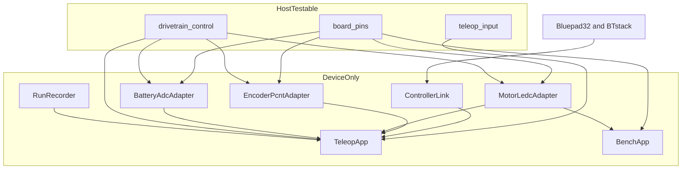
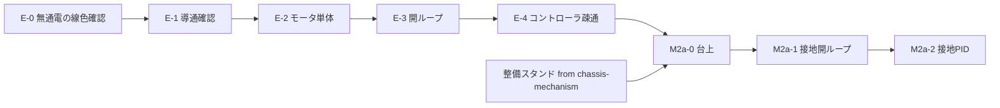

# Technical Design

## Overview

**Purpose**: teleop-bringup は `drivetrain-core` が確定させた駆動中核ロジックに実機の身体を与え、人が手で走らせながら足回りの前提を確認する段階を担う。

**Users**: 足回りをブリングアップする開発者が、端子割当と結線を確定させ、通電前の電気系確認（E-0〜E-4）を経て M2a-0 / M2a-1 / M2a-2 を実施し、安全機能4種の発火を確かめるために用いる。

**Impact**: 現在 `firmware/src/main.cpp` は「核とリンクできること」だけを証明する空の入口である。本設計はここに端子割当・3つのペリフェラルアダプタ・コントローラ接続・制御ループ・記録を与え、`[env:teleop]` に無線を有効化する。⚠️ **本番ビルドの無線除外（`firmware/CMakeLists.txt` の `COMPONENTS` 許可リスト）には一切触れない。**

### Goals

- 端子割当が単一の正として存在し、成立しない割当が**実機へ書き込む前に**ホストテストで落ちる
- `EncoderPort` / `MotorOutputPort` / `BatteryVoltagePort` の3実装が、判断ロジックを持たずに動く
- 人が DualSense で機体を手動走行させられ、安全機能4種が実機で発火する
- `ENCODER_COUNTS_PER_WHEEL_REV` が実測校正され、下流 `m2-motion-validation` が計測だけに集中できる

### Non-Goals

- 逆運動学・速度PID・オドメトリ・保護①〜④の判定ロジック本体（→ `drivetrain-core`、実装済み）
- 開ループ入口そのもの（→ `drivetrain-core`、`WheelDutyCommand` として landing 済み）
- 整備スタンド・配線の物理経路・電源スイッチ・電源分岐端子（→ `chassis-mechanism`）
- 定量計測と NFR-1 の評価（→ `m2-motion-validation`）
- 固定側との通信・ジオフェンス・物理的な非常停止手段（→ M3）

## Boundary Commitments

### This Spec Owns

- **端子割当の正**（`firmware/lib/board_pins/`）とその成立検査
- **結線表と回路図の照合枠**（作図そのものは開発者が行う）
- **3つのポート実装**（PCNT / LEDC / ADC1）とアプリ層の制御ループ
- **テレオペ用ビルドの無線有効化とパーティション指定**（`sdkconfig.defaults.teleop`）
- **走行1回＝1レコードの記録**とその取り出し
- **手順と記録**: E-0〜E-4 / M2a-0/1/2 / 安全機能の発火試験
- OQ-15 / OQ-16 / OQ-17 / OQ-18 / OQ-37 / OQ-42 の決着

### Out of Boundary

- `lib/drivetrain_control/` の一切の変更。⚠️ 核は3環境すべてで同一ソースであることが `build_profile.hpp` に明記されている
- `firmware/CMakeLists.txt` の production 側 `COMPONENTS` 許可リスト
- `sdkconfig.defaults` / `sdkconfig.defaults.production`（共通と本番の設定）
- 保護閾値の最終確定値（OQ-14 / OQ-22 → `m2-motion-validation`）
- 整備スタンドの設計・製作、配線の物理経路、OQ-11 / OQ-12（→ `chassis-mechanism`）

### Allowed Dependencies

- `drivetrain_control` の**公開ヘッダ1本のみ**（`drivetrain_control/drivetrain_control.hpp`）。内部ヘッダを直接 include しない
- ESP-IDF 5.5.5 のドライバ（`driver/pulse_cnt.h` / `driver/ledc.h` / `esp_adc/adc_oneshot.h`）
- Bluepad32 と BTstack（**teleop 系ビルドのみ**。本番成果物へ入れない）
- `chassis-mechanism` の決定（電源スイッチ・電源分岐端子）を**読み取り専用で取り込む**

### Revalidation Triggers

- `drivetrain_control` の `ports.hpp` / `types.hpp` の契約変更
- 端子割当の変更（→ 結線表・回路図・実機配線のすべてが再確認対象）
- `platformio.ini` のプラットフォーム pin の変更（→ Bluepad32 の対応版が変わる）
- パーティション構成の変更（→ 成果物サイズの再測定）
- `chassis-mechanism` による OQ-11 / OQ-12 の決着（→ 結線表と回路図の更新）

## Architecture

### Existing Architecture Analysis

| 既存の制約 | 根拠 | 本設計の従い方 |
|---|---|---|
| 核は3環境で同一ソース。ビルドマクロで分岐しない | `build_profile.hpp` のコメント | `lib/drivetrain_control/` に触れない |
| `firmware/src/teleop/` は既に予約済み | `src/CMakeLists.txt` が env 変数で glob | 追加先をここに置く |
| `[env:teleop]` は `SDKCONFIG_DEFAULTS` 未指定で無線が無効 | `platformio.ini` のコメントが本 Spec の責務と明記 | production と同じ機構で層を重ねる |
| ⚠️ `build_src_filter` は espidf で効かない（実測済み） | `src/CMakeLists.txt` のコメント | ソース選択は環境変数と CMake で行う |
| ⚠️ `CONFIG_ESP_WIFI_ENABLED=n` は無視される（実測済み） | `sdkconfig.defaults.production` のコメント | 本番の無線除外機構に触れない |
| ⚠️ `firmware/src/` はホストテストでビルドされない | `test_build_src` 既定 `no` | **ホスト検証が要るものは `firmware/lib/` へ置く** |

### Architecture Pattern & Boundary Map



**Architecture Integration**:

- **Selected pattern**: Ports & Adapters。`drivetrain-core` が宣言した3ポートを ESP32 ペリフェラルで実装する。核が上流、アダプタが下流という向きを崩さない
- **Dependency Direction**: `board_pins` / `drivetrain_control` → アダプタ → アプリ。`teleop_input` はアプリにのみ依存される。**逆向きの依存を作らない**。アダプタは `ControllerLink` を知らず、`teleop_input` はペリフェラルを知らない
- **ホスト検証境界**: ⚠️ **`firmware/src/` はネイティブビルドに含まれない。** したがって要件 2.7（端子検査をホストで）と 17.1 / 17.2（入力変換をホストで）を満たすには、該当ロジックを `firmware/lib/` の独立コンポーネントへ置くしかない。これが `board_pins` と `teleop_input` を分けた理由である
- **新規コンポーネントの根拠**: `board_pins` は端子割当の正＋成立検査（純データと純述語）、`teleop_input` はパッド軸から指令への変換（純関数）。どちらもペリフェラル API を参照しない
- **Steering compliance**: `structure.md` の「実機ペリフェラル実装とアプリ層の指令生成は `firmware/src/`」に従う。⚠️ ただし上記のホスト検証要件により**純データ・純関数だけを `firmware/lib/` へ切り出す**。`lib/test_support/` が既に `lib/` に第2のコンポーネントを置いている前例があり、パターンの逸脱ではない

### Technology Stack

| Layer | Choice / Version | Role in Feature | Notes |
|-------|------------------|-----------------|-------|
| Infrastructure / Runtime | pioarduino platform-espressif32 **55.03.311**（ESP-IDF **5.5.5**） | 既存の pin。変更しない | リリース zip 固定が再現性の担保 |
| Backend / Services | **Bluepad32**（raw ESP-IDF プラットフォーム）＋ **BTstack** | DualSense の BR/EDR HID host | ⚠️ **Arduino-as-component を採らない**。raw 版が IDF 5.5+ 推奨で pin 済み版と一致。roadmap 2026-08-23 の決定を是正する（→ research.md） |
| Backend / Services | ESP-IDF `driver/pulse_cnt.h` | エンコーダ計数 | B-9。legacy API と `ESP32Encoder` を使わない |
| Backend / Services | ESP-IDF `driver/ledc.h` | PWM 出力 | — |
| Backend / Services | ESP-IDF `esp_adc/adc_oneshot.h` + キャリブレーション | バッテリ電圧 / E-3 の可変抵抗 | B-12。ADC1 のみ |
| Infrastructure / Runtime | `CONFIG_PARTITION_TABLE_SINGLE_APP_LARGE` | 無線込み成果物の収容 | ⚠️ `board_build.partitions` ではなく Kconfig で指定（espidf で INI オプションが効かない前例あり） |

## File Structure Plan

### Directory Structure

```
firmware/
├── platformio.ini                       # 変更: teleop に SDKCONFIG_DEFAULTS、bench 環境を追加
├── sdkconfig.defaults.teleop            # 新規: BT 有効化・パーティション・BTstack 設定
├── CMakeLists.txt                       # 変更: EXTRA_COMPONENT_DIRS へ board_pins / teleop_input を追加
├── lib/
│   ├── board_pins/                      # 新規: 端子割当の正（ホスト検証可）
│   │   ├── CMakeLists.txt
│   │   ├── library.json
│   │   └── include/board_pins/
│   │       ├── pin_map.hpp              # 端子割当そのもの（constexpr データ）
│   │       └── pin_rules.hpp            # 成立条件の述語と ESP32 の端子特性表
│   └── teleop_input/                    # 新規: パッド軸から指令への変換（ホスト検証可）
│       ├── CMakeLists.txt
│       ├── library.json
│       ├── include/teleop_input/
│       │   ├── pad_state.hpp            # 正規化済みパッド状態。Bluepad32 の型を含まない
│       │   └── mapping.hpp              # 無効範囲・変換特性・速度上限・輪単体選択
│       └── src/mapping.cpp
├── src/
│   ├── CMakeLists.txt                   # 変更: teleop 時のみ REQUIRES へ 2 コンポーネントを追加
│   ├── main.cpp                         # 変更: プロファイルで TeleopApp / BenchApp を選ぶ
│   └── teleop/                          # 既に glob 対象。以下すべて新規
│       ├── encoder_pcnt.{hpp,cpp}       # EncoderPort 実装。WrapAccumulator を使う
│       ├── motor_ledc.{hpp,cpp}         # MotorOutputPort 実装。bench と共用
│       ├── battery_adc.{hpp,cpp}        # BatteryVoltagePort 実装。VoltageScaler を使う
│       ├── controller_link.{hpp,cpp}    # Bluepad32 ラッパ。接続状態と鍵消去
│       ├── run_recorder.{hpp,cpp}       # RAM バッファと吸い出し
│       ├── teleop_app.{hpp,cpp}         # 制御ループ本体
│       └── bench_app.{hpp,cpp}          # E-3 専用の最小経路
└── test/native/
    ├── test_pin_plan/test_pin_plan.cpp      # 新規: 端子割当の成立検査（要件 2）
    └── test_pad_mapping/test_pad_mapping.cpp # 新規: 入力変換（要件 8, 17）
docs/
├── drivetrain-spec.md                   # 変更: §7 へ結線表と端子割当への参照、接地の方針
└── bom.md                               # 変更: 手持ち機材（安定化電源・テスター・可変抵抗）
.kiro/specs/teleop-bringup/
├── wiring.md                            # 新規: 結線表（線色・系統・端子・未確定欄）
├── schematic.svg                        # 新規: 回路図（開発者が Cirkit Designer で作図）
└── procedures.md                        # 新規: E-0〜E-4 / M2a / 発火試験の手順と記録
```

### Modified Files

- `firmware/platformio.ini` — `[env:teleop]` に `board_build.cmake_extra_args` で `sdkconfig.defaults.teleop` を層に加える。`[env:bench]` を追加（teleop と同じ env 変数を立て、`-DDRIVETRAIN_BENCH` を足す）
- `firmware/CMakeLists.txt` — `EXTRA_COMPONENT_DIRS` へ `lib/board_pins` と `lib/teleop_input` を**個別に**追加する。⚠️ `lib/` 全体を指さない（`test_support` の混入経路を作らないため）
- `firmware/src/CMakeLists.txt` — `DRIVETRAIN_BUILD_TELEOP` 環境変数のときだけ `REQUIRES` へ 2 コンポーネントを足す。⚠️ **production の `COMPONENTS` 許可リストを変えずに済ませるため**
- `firmware/src/main.cpp` — `DRIVETRAIN_BENCH` の有無で `BenchApp` / `TeleopApp` を選ぶ。production 経路は現状のまま

## System Flows

### 制御ループ1周期

```mermaid
sequenceDiagram
    participant Link as ControllerLink
    participant Map as teleop_input mapping
    participant App as TeleopApp
    participant Core as DrivetrainController
    participant Rec as RunRecorder

    Link->>App: パッド状態と接続状態
    App->>Map: 正規化済み軸とデッドマン
    Map-->>App: 指令と出力許可
    App->>Core: submit 指令
    App->>Core: setOutputEnabled 出力許可
    App->>Core: step 現在時刻
    Core-->>App: StepResult
    App->>Core: resetProtections 現在時刻
    App->>Core: status
    App->>Rec: 1周期ぶんを追記
```

⚠️ **`resetProtections()` は `step()` の直後にのみ呼ぶ。** 核のヘッダが事前条件として明記しており、間に別の操作を挟むと古いキャッシュで保護を解いてしまう。この順序はループの構造で固定する。

### 段階の進行と前提



各段は前段の合格が前提であり、不合格なら次へ進まない。⚠️ **E-1〜E-4 は整備スタンドを必要としない**（机上・モータ単体・モータ非接続）。整備スタンド待ちに入るのは M2a-0 からである。

## Requirements Traceability

| Requirement | Summary | Components | Interfaces | Flows |
|-------------|---------|------------|------------|-------|
| 1.1, 1.2, 1.3, 1.4, 1.5, 1.6 | テレオペ専用ビルドと無線 | TeleopBuildProfile | `sdkconfig.defaults.teleop`, `platformio.ini` | — |
| 2.1, 2.2, 2.3, 2.4, 2.5, 2.6, 2.7 | 端子割当と成立検査 | board_pins | `pin_map.hpp`, `pin_rules.hpp` | — |
| 3.1, 3.2, 3.3, 3.4, 3.5, 3.6, 3.7, 3.8, 3.9 | 結線表・回路図・照合 | WiringDocs | `wiring.md`, `schematic.svg` | — |
| 4.1, 4.2, 4.3, 4.4, 4.5, 4.6, 4.7 | エンコーダ入力 | EncoderPcntAdapter | `EncoderPort` | 制御ループ |
| 5.1, 5.2, 5.3, 5.4, 5.5 | モータ出力 | MotorLedcAdapter | `MotorOutputPort` | 制御ループ |
| 6.1, 6.2, 6.3, 6.4, 6.5, 6.6 | バッテリ電圧 | BatteryAdcAdapter | `BatteryVoltagePort` | 制御ループ |
| 7.1, 7.2, 7.3, 7.4, 7.5, 7.6 | コントローラ接続 | ControllerLink | `LinkState` | 制御ループ |
| 8.1, 8.2, 8.3, 8.4, 8.5, 8.6, 8.7, 8.8, 8.9 | 入力マッピング | teleop_input | `mapping.hpp` | 制御ループ |
| 9.1, 9.2, 9.3, 9.4, 9.5, 9.6, 9.7 | 制御ループ | TeleopApp | `DrivetrainController` | 制御ループ |
| 10.1, 10.2, 10.3, 10.4, 10.5, 10.6, 10.7, 10.8, 10.9 | 電気系ブリングアップ | BenchApp, Procedures | `procedures.md` | 段階の進行 |
| 11.1, 11.2, 11.3, 11.4, 11.5, 11.6, 11.7 | M2a-0 台上 | TeleopApp, Procedures | `mapping.hpp` 輪単体選択 | 段階の進行 |
| 12.1, 12.2, 12.3, 12.4, 12.5 | M2a-1 接地開ループ | TeleopApp, Procedures | `WheelDutyCommand` | 段階の進行 |
| 13.1, 13.2, 13.3, 13.4, 13.5 | M2a-2 接地PID | TeleopApp, Procedures | `BodyVelocityCommand` | 段階の進行 |
| 14.1, 14.2, 14.3, 14.4, 14.5, 14.6, 14.7, 14.8 | 安全機能の発火試験 | TeleopApp, RunRecorder, Procedures | `StepResult`, `DrivetrainStatus` | 制御ループ |
| 15.1, 15.2, 15.3, 15.4, 15.5 | 走行の記録 | RunRecorder | `RunRecord` | 制御ループ |
| 16.1, 16.2, 16.3, 16.4, 16.5, 16.6, 16.7, 16.8, 16.9, 16.10 | 未決事項と文書の是正 | Procedures, WiringDocs | `docs/`, `.kiro/steering/` | — |
| 17.1, 17.2, 17.3, 17.4, 17.5 | ホスト検証範囲の維持 | board_pins, teleop_input, BoundaryCheck | `test/native/` | — |

## Components and Interfaces

| Component | Domain/Layer | Intent | Req Coverage | Key Dependencies (P0/P1) | Contracts |
|-----------|--------------|--------|--------------|--------------------------|-----------|
| board_pins | 定義（ホスト可） | 端子割当の正と成立検査 | 2, 17 | なし | Service, State |
| teleop_input | 入力（ホスト可） | パッド軸から指令への純変換 | 8, 11, 17 | drivetrain_control 型 (P0) | Service |
| EncoderPcntAdapter | アダプタ | `EncoderPort` 実装 | 4 | board_pins (P0), WrapAccumulator (P0) | Service |
| MotorLedcAdapter | アダプタ | `MotorOutputPort` 実装 | 5, 10, 12 | board_pins (P0) | Service |
| BatteryAdcAdapter | アダプタ | `BatteryVoltagePort` 実装 | 6 | board_pins (P0), VoltageScaler (P0) | Service |
| ControllerLink | 入力 | Bluepad32 ラッパと接続状態 | 7, 14 | Bluepad32 (P0), BTstack (P0) | Service, State |
| RunRecorder | 記録 | 走行1回＝1レコード | 15, 14 | なし | State, Batch |
| TeleopApp | アプリ | 制御ループと段階の実施 | 9, 11, 12, 13, 14 | 全アダプタ (P0), Core (P0) | Service, State |
| BenchApp | アプリ | E-3 の最小経路 | 10 | MotorLedcAdapter (P0) | Service |
| TeleopBuildProfile | ビルド | 無線有効化とパーティション | 1 | pioarduino 55.03.311 (P0) | State |
| WiringDocs | 文書 | 結線表・回路図・照合 | 3, 16 | chassis-mechanism の決定 (P1) | — |
| Procedures | 文書 | E/M2a/発火試験の手順と記録 | 10, 11, 12, 13, 14, 16 | 整備スタンド (P1) | Batch |

### 定義層

#### board_pins

| Field | Detail |
|-------|--------|
| Intent | 端子割当を単一の正として保持し、成立条件を機械検査する |
| Requirements | 2.1, 2.2, 2.3, 2.4, 2.5, 2.6, 2.7, 17.3 |

**Responsibilities & Constraints**

- 端子割当そのもの（`pin_map.hpp`）と、ESP32 classic の端子特性および成立条件（`pin_rules.hpp`）を持つ
- ⚠️ **ペリフェラル API を一切参照しない。** `driver/*.h` を include しない。これによりホスト・実機の両方でコンパイルできる
- 検査は `constexpr` 述語として書き、ホストテストが値として評価する

**Dependencies**

- Inbound: EncoderPcntAdapter / MotorLedcAdapter / BatteryAdcAdapter / BenchApp — 端子番号の取得 (P0)
- Outbound: なし
- External: なし

**Contracts**: Service [x] / API [ ] / Event [ ] / Batch [ ] / State [x]

##### Service Interface

```cpp
namespace board_pins {

enum class PinRole : std::uint8_t {
  kEncoderA, kEncoderB, kMotorPwm, kMotorDir, kBatterySense, kBenchPot,
};

struct PinAssignment {
  PinRole      role;
  std::uint8_t wheel_index;   // 輪に紐づかない用途は kNoWheel
  std::int8_t  gpio;          // 未割当は kUnassigned
};

enum class PinViolation : std::uint16_t {
  kNone            = 0,
  kDuplicate       = 1u << 0,  // 2.2 同一端子の二重割当
  kOutputOnInputOnly = 1u << 1, // 2.3 入力専用端子への出力割当
  kNotAdc1         = 1u << 2,  // 2.4 無線動作中に使えない変換器
  kStrapping       = 1u << 3,  // 2.5 起動モードを決める端子
  kFlash           = 1u << 4,  // 2.5 内蔵フラッシュ用端子
  kUnitOverflow    = 1u << 5,  // 2.6 計数器・出力生成器・変換器の本数超過
  kUnassigned      = 1u << 6,
};
using PinViolationMask = std::uint16_t;

struct PinPlanDiagnostic {
  PinViolationMask global = 0;
  PinViolationMask per_assignment[kAssignmentCount] = {};
  bool ok() const noexcept;
};

constexpr PinPlanDiagnostic checkPinPlan(const PinPlan& plan) noexcept;

}  // namespace board_pins
```

- **Preconditions**: なし。未割当を含む任意の入力を受け付け、診断として返す
- **Postconditions**: `ok()` が真である割当だけが実機で使用されうる
- **Invariants**: 入力専用端子は GPIO 34 / 35 / 36 / 39。ストラッピング端子は 0 / 2 / 5 / 12 / 15。フラッシュ用は 6〜11。ADC1 は 32〜39（出典 → research.md）

**Implementation Notes**

- Integration: アダプタは `pin_map.hpp` の値だけを参照し、端子番号をリテラルで持たない
- Validation: `test/native/test_pin_plan/` が (a) 出荷する割当が `ok()` であること、(b) **各違反種別が実際に検出されること**を crafted 入力で示す。⚠️ 後者が無いと検査が空虚になりうる
- Risks: ⚠️ エンコーダ入力を 34〜39 へ置くと内部プルアップが無く外部プルアップが要る（要件 4.7）。**入力専用端子を避ける割当を出荷値とする**

### 入力層

#### teleop_input

| Field | Detail |
|-------|--------|
| Intent | 正規化済みパッド状態から指令と出力許可への変換を、実機なしで検証できる形で提供する |
| Requirements | 8.1, 8.2, 8.3, 8.4, 8.5, 8.6, 8.7, 8.8, 8.9, 11.1, 17.1, 17.2 |

**Responsibilities & Constraints**

- ⚠️ **Bluepad32 の型を一切含まない。** 入力は `PadState`（正規化済み軸・ボタン）であり、コントローラ固有の事情を持ち込まない
- 無効範囲・変換特性・速度上限・輪単体選択を、すべてこの層の純関数で行う
- ⚠️ **判定・遮断を持たない。** デッドマンの結果は「出力許可の真偽」として返すだけで、遮断は核が行う

**Dependencies**

- Inbound: TeleopApp — 変換の実行 (P0)
- Outbound: `drivetrain_control` の指令型 (P0)
- External: なし

**Contracts**: Service [x] / API [ ] / Event [ ] / Batch [ ] / State [ ]

##### Service Interface

```cpp
namespace teleop_input {

struct PadState {
  float left_x = 0.0f, left_y = 0.0f;   // [-1, +1] 正規化済み
  float right_x = 0.0f;
  bool  deadman = false;
  std::int8_t selected_wheel = -1;      // -1 は機体走行。0..2 は輪単体
};

struct MappingParams {                   // すべて実走中に調整できる（8.9）
  float deadzone = 0.0f;                 // 8.6
  float curve_exponent = 1.0f;           // 8.7
  float speed_scale = 0.0f;              // 8.8 機体能力に対する割合
  float max_body_mm_s = 0.0f;
  float max_omega_rad_s = 0.0f;
};

struct MappedCommand {
  bool output_enabled = false;                       // 8.1, 8.2
  bool wheel_scoped = false;                         // 11.1 輪単体か
  drivetrain_control::BodyVelocityCommand body{};    // 8.3, 8.4
  drivetrain_control::WheelVelocityCommand wheel{};  // 8.5
};

MappedCommand mapPad(const PadState& pad, const MappingParams& params,
                     drivetrain_control::TimeMs now) noexcept;

}  // namespace teleop_input
```

- **Preconditions**: `params` の各値は非負。`speed_scale` は (0, 1]
- **Postconditions**: `deadman == false` のとき `output_enabled == false` かつ指令値はすべてゼロ
- **Invariants**: 無効範囲の内側では出力がゼロ。変換特性は中立付近の分解能を高める単調写像

**Implementation Notes**

- Integration: `ControllerLink` が Bluepad32 の生値を `PadState` へ正規化する。**その変換だけが実機側に残る**
- Validation: `test/native/test_pad_mapping/` が無効範囲・変換特性・速度上限の変更が結果へ及ぼす影響を検証する（17.2）
- Risks: 変換式の具体形（OQ-17）は M2a で実走しながら決める。**設計時に固定値を埋め込まない**

### アダプタ層

#### EncoderPcntAdapter / MotorLedcAdapter / BatteryAdcAdapter

| Field | Detail |
|-------|--------|
| Intent | `drivetrain-core` の3ポートを ESP32 ペリフェラルで実装する |
| Requirements | 4.1〜4.7, 5.1〜5.5, 6.1〜6.6 |

**Responsibilities & Constraints**

- ⚠️ **判断・計算を持たない。** 折り返しの桁上げは `WrapAccumulator`、電圧換算は `VoltageScaler` を用いる（`ports.hpp` の契約、要件 4.3 / 6.3）
- 端子番号は `board_pins` からのみ取得する
- 輪ごとの向き反転（4.4 / 5.4）は設定値として持ち、演算はしない
- ⚠️ 起動直後で制御ループが動く前はモータを駆動しない（5.5）。LEDC の初期デューティをゼロで確定させてから有効化する

**Dependencies**

- Inbound: TeleopApp / BenchApp (P0)
- Outbound: `board_pins` (P0), `WrapAccumulator` / `VoltageScaler` (P0)
- External: ESP-IDF `driver/pulse_cnt.h` / `driver/ledc.h` / `esp_adc/adc_oneshot.h` (P0)

**Contracts**: Service [x] / API [ ] / Event [ ] / Batch [ ] / State [ ]

##### Service Interface

3つとも `drivetrain_control` が宣言済みの純粋仮想を実装するのみで、**新しい公開契約を作らない**。

```cpp
class EncoderPcntAdapter final : public drivetrain_control::EncoderPort {
 public:
  drivetrain_control::EncoderCounts read() override;   // 4.1, 4.2
};
class MotorLedcAdapter final : public drivetrain_control::MotorOutputPort {
 public:
  void write(const drivetrain_control::WheelOutputs& outputs) override;  // 5.1, 5.2, 5.3
};
class BatteryAdcAdapter final : public drivetrain_control::BatteryVoltagePort {
 public:
  drivetrain_control::VoltageSample read() override;   // 6.1, 6.2
};
```

- **Preconditions**: 初期化が成功していること。失敗時 `BatteryAdcAdapter::read()` は `valid == false` を返す（6.2）
- **Postconditions**: `read()` は核の状態を変えない
- **Invariants**: ⚠️ **ハードウェアカウンタは符号付き16bit（±32767）。** watch point と 64bit 累積で桁上げを保持しないと「数秒走るとオドメトリが壊れる」形で現れる（B-10）

**Implementation Notes**

- Integration: グリッチフィルタはユニット単位設定で上限 1023 APB クロック。⚠️ **これは硬い天井であり、それ以上のフィルタリングを前提にしない**（B-11、要件 4.6）
- Validation: アダプタ自体はホストで回せない。⚠️ **だからこそ判断を持たせない。** 判断を持たせた瞬間に検証不能な領域が増える（要件 17.3 が静的に検査する）
- Risks: ADC は両端で非線形。校正値は実測にもとづき設定できる形で保持する（6.4 / 6.6）

#### ControllerLink

| Field | Detail |
|-------|--------|
| Intent | Bluepad32 を包み、接続状態を制御ループが判別できる形で示す |
| Requirements | 7.1, 7.2, 7.3, 7.4, 7.5, 7.6, 14.2 |

**Responsibilities & Constraints**

- Bluepad32 の生値を `teleop_input::PadState` へ正規化する。⚠️ **ここが唯一 Bluepad32 の型に触れる場所である**
- 保存済みペアリング鍵の消去手段を提供する（7.4）
- ⚠️ **接続断を「停止」へ変換しない。** 接続状態を示すだけで、停止の判断は核のウォッチドッグが行う（B-7 / 要件 9.6）

**Dependencies**

- Inbound: TeleopApp (P0)
- External: Bluepad32 / BTstack (P0)

**Contracts**: Service [x] / API [ ] / Event [ ] / Batch [ ] / State [x]

##### State Management

- **State model**: 未接続 / 接続済み入力なし / 接続済み入力あり の3状態（要件 7.6 が 2 と 1 の区別を要求する）
- **Concurrency**: Bluepad32 のコールバックと制御ループが別コンテキストで動く。⚠️ 核の `status()` は単一スレッド前提であり同期は呼び出し側の責務（`controller.hpp` 冒頭）。**パッド状態はコールバック側で更新し、制御ループが1周期に1回だけ読む**形にする

**Implementation Notes**

- Integration: ⚠️ **BTstack は `integrate_btstack.py` によるパッチ適用を伴う。** 素の IDF コンポーネントとして取得できない。再現手順を記録する
- Validation: E-4 で**モータ非接続**のまま疎通を確認する（10.7）。ここが OQ-16 の判断材料になる
- Risks: マルチペアモードで無言のペアリング失敗が既知（B-15）。リンク鍵の残留が再接続失敗の頻出原因であり、7.4 の消去手段はその対処である

### アプリ層

#### TeleopApp / BenchApp / RunRecorder

| Field | Detail |
|-------|--------|
| Intent | 制御ループを一定周期で回し、段階の実施結果を記録する |
| Requirements | 9.1〜9.7, 11.x, 12.x, 13.x, 14.x, 15.x, 10.6 |

**Responsibilities & Constraints**

- 単調増加する時刻を毎周期供給する（9.2）。⚠️ ホストに `millis()` は無く、核は `TimeMs = int64_t` を要求する
- 指令の投入と出力許可を独立した操作として扱う（9.4）
- ⚠️ **`resetProtections()` は `step()` の直後にのみ呼ぶ**（核のヘッダの事前条件）
- 保護の判定・遮断値の決定を核へ委ね、独自に実装しない（9.5）
- `BenchApp` は **PCNT も核も初期化しない**。可変抵抗を ADC1 で読み、`MotorLedcAdapter` へ直接書く。⚠️ E-3 の切り分け対象を「ドライバ＋モータ」だけに保つため（→ research.md）
- `RunRecorder` は走行中 RAM にバッファし、走行後に吸い出す（`tech.md` 開発標準5）

**Dependencies**

- Inbound: `main.cpp` (P0)
- Outbound: 全アダプタ (P0), `DrivetrainController` (P0), teleop_input (P0), ControllerLink (P0)

**Contracts**: Service [x] / API [ ] / Event [ ] / Batch [x] / State [x]

##### Batch / Job Contract（RunRecorder）

- **Trigger**: 走行の開始（15.2）
- **Input**: 指令値・各輪の実測速度・バッテリ電圧・保護の発火状態・出力許可の状態＋時刻（15.3）
- **Output**: 走行1回＝1レコード（15.1）。⚠️ **固定側の投擲記録とは別形式**（15.5、OQ-37 の決着対象）
- **Idempotency & recovery**: RAM バッファは有限。上限到達時の扱い（打ち切り / 巻き取り）を実装時に決め、**黙って欠落させない**

**Implementation Notes**

- Integration: 発火試験の4種は `StepResult.global_reasons` / `wheel_reasons` の `BlockReason` ビットで観測する。核が既に `kCommandTimeout` / `kLowVoltage` / `kMotorLock` / `kOutputDisabled` を持つため、**新しい判定を作らない**（14.1〜14.4）
- Validation: 通信途絶からモータ停止までの時間を実測して記録する（14.6）。これが OQ-18 の根拠になり、OQ-19 はそれを引き継ぐ
- Risks: ⚠️ 発火試験の記録には**これらが運転操作であって物理的な非常停止手段の代替ではない旨を明記する**（14.7、B-4）

### ビルドと文書

#### TeleopBuildProfile / WiringDocs / Procedures

| Field | Detail |
|-------|--------|
| Intent | 無線の有効化・結線の正・手順と記録 |
| Requirements | 1.x, 3.x, 10.x, 16.x |

**Responsibilities & Constraints**

- `sdkconfig.defaults.teleop` に BT 有効化とパーティションを置き、`[env:teleop]` から層に重ねる。⚠️ **`sdkconfig.defaults` と `sdkconfig.defaults.production` に触れない**
- ⚠️ **本番成果物へ無線が入らない状態を維持する**（1.2）。検証は production で実証済みの手法をそのまま使う — `firmware.map` に `libbt.a` / `libesp_wifi.a` の参照がゼロであること
- 無線ライブラリのライセンス制約を、配布時に誤読されない形で記載する（1.6、OQ-42）
- `wiring.md` は線色・系統・端子を1箇所にまとめ、⚠️ **黒がエンコーダ GND でありモータ電源−が白である**ことを、取り違えた結果とともに明示する（3.2）
- ⚠️ **A相／B相が黄か緑かは未確定欄として持つ**（3.3）。M2a-0 の実測で確定させる（16.7）
- `schematic.svg` は開発者が作図する。照合は SVG に対する手順化された目視レビュー（3.8、→ research.md）

**Implementation Notes**

- Integration: `chassis-mechanism` が OQ-11 / OQ-12 を決着させたら結線表へ取り込む（3.9）。⚠️ **本 Spec は決めない**
- Validation: 手順書は各段の合格条件を持ち、不合格なら次へ進まないことを明記する（10.8）
- Risks: ⚠️ **docs への書き込みは Spec の最終段にまとめる。** `spec/hardware` が `docs/drivetrain-spec.md` / `bom.md` を並行改訂しており、早期に触ると衝突する

## Error Handling

### Error Strategy

| 種別 | 例 | 応答 |
|---|---|---|
| 設定エラー（起動時に確定） | 端子割当が成立しない / ポートが未配線 | ⚠️ **ビルドまたはホストテストで落とす。** 実機で発現させない。核の `configure()` も未配線ポートを設定エラーとして拒否する |
| 読み取り不能（実行時） | ADC が読めない | `VoltageSample.valid == false` を返し、核が `kVoltageUnavailable` として遮断する。**アダプタは判断しない** |
| 接続断（実行時） | コントローラの電源断・圏外 | `ControllerLink` は状態を示すだけ。停止は核のウォッチドッグ（`kCommandTimeout`）が行う |
| 段階の不合格（手順） | E-1 で異常発熱 | 次の段へ進まない（10.8）。記録に残す |

### Monitoring

`RunRecorder` が保護の発火状態を毎周期記録する。⚠️ **走行中に外部へ送出しない**（`tech.md` 開発標準5: 走行中の無線送信は制御ループにジッタを乗せる）。

## Testing Strategy

### Unit Tests（ホスト、`test/native/`）

1. 出荷する端子割当が `checkPinPlan()` で `ok()` になる（2.1〜2.7）
2. **各違反種別が crafted 入力で実際に検出される** — 二重割当 / 入力専用端子への出力 / ADC1 以外 / ストラッピング / フラッシュ / 本数超過。⚠️ これが無いと検査が空虚になる
3. デッドマン解放で `output_enabled == false` かつ指令がゼロになる（8.1, 8.2）
4. 無効範囲・変換特性・速度上限の変更が指令値へ及ぼす影響（8.6, 8.7, 8.8, 17.2）
5. 輪単体選択が機体走行と排他になる（8.5, 11.1）

### Integration Tests（ホスト）

1. `board_pins` と `teleop_input` が `driver/*.h` を include しないことの静的検査（17.3）
2. `firmware/src/teleop/**` が `drivetrain_control` の**公開ヘッダ1本のみ**を include することの静的検査（17.5）
3. `drivetrain-core` の既存ホストテストが引き続き通る（17.4）

### 実機検証（`test/embedded/` および手順）

1. **E-1〜E-4**: 電流制限つき安定化電源での導通 → モータ単体 → 開ループ → コントローラ疎通（10.1〜10.9）
2. **M2a-0**: 輪単体の回転方向・エンコーダ符号・`ENCODER_COUNTS_PER_WHEEL_REV` の実測校正（11.1〜11.7）
3. **M2a-1 / M2a-2**: 逆運動学の符号、閉じた経路一周の位置姿勢差（12.1〜12.5, 13.1〜13.5）
4. **安全機能4種の発火**とそれぞれの発火までの時間（14.1〜14.8）
5. **本番成果物に無線が含まれない**ことを `firmware.map` の参照ゼロで確認（1.2）

## Security Considerations

- ⚠️ **BTstack はオープンソースではない**（商用不可条項付き）。teleop 系ビルドにのみ封じ込め、本番成果物をクリーンに保つ（1.6、OQ-42）。トップレベル LICENSE が BT 版ファームまで自由に再利用可能だと誤読させない記載を伴う
- ペアリング鍵は機体に保存される。消去手段を操作者が使える形で提供する（7.4）

## Performance & Scalability

- 制御ループ周期の**最終確定値は本 Spec で決めない**（OQ-22 → `m2-motion-validation`）。⚠️ `tech.md` 開発標準1 に従い、未実測の値を合否条件にしない
- ⚠️ 走行中のログ送出を行わない。制御ループにジッタを乗せるため（`tech.md` 開発標準5）
