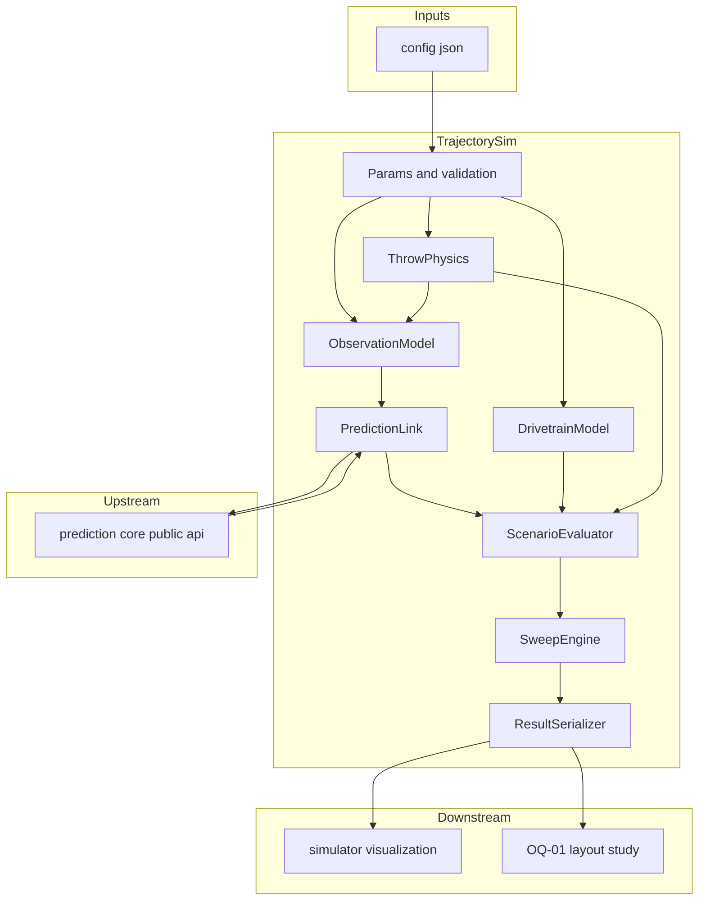
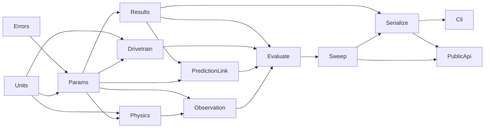
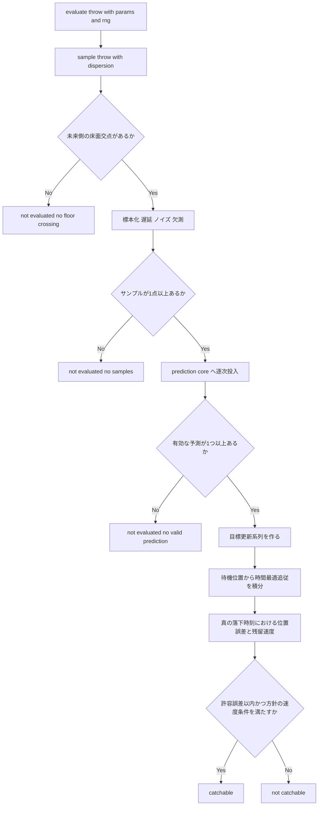
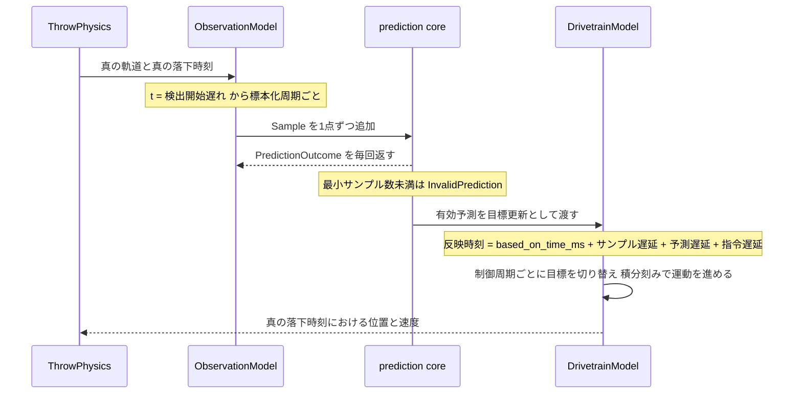

# Technical Design Document: trajectory-simulator

## Overview

**Purpose**: 本機能は、投擲条件・観測条件・移動体性能をパラメータとして受け取り、**物理 → 観測 → 予測 → 移動 → 判定**の経路を通してキャッチ成立性を評価し、その結果をパラメータ掃引の格子（キャッチ可能領域）として JSON へ出力する Python バッチシミュレータを提供する。価値の中心は「シミュレーションできること」ではなく、**機体を作る前に成立境界が数値として見えること**にある。

**Users**: 成立性を評価する開発者（時間予算が足りるかの判断）、OQ-01 を決める立場の開発者（投擲レイアウトの机上検討）、`simulator-visualization`（出力 JSON を読んで描画する下流 Spec）。

**Impact**: 既存コードへの変更は `pyproject.toml` の wheel パッケージ列挙 1 箇所に限られる。新規パッケージ `src/trajectory_sim/` を追加し、`prediction_core` を**公開 API 経由でのみ**利用する。上流の「実行時サードパーティ依存ゼロ」は既存テスト（`tests/prediction_core/test_packaging.py`）で固定されているため、**本 Spec も標準ライブラリのみで実装する**。

### Goals

- 投擲条件から真の軌道・真の落下地点・真の落下時刻を生成し、評価の「正解」を持つ
- 検出遅れ・標本化周期・位置ノイズ・欠測を模擬した合成サンプル列を `prediction_core` へ流す
- 移動体を**性能上限の近似**（加速度上限・最高速度・減速）としてモデル化し、性能値をすべて外部入力にする
- NFR-6 の停止方針 / 通過方針を同一条件で比較できるようにする
- 任意パラメータの格子掃引を行い、成立境界を1つの JSON にまとめる
- 較正段階・パラメータ出所・**モデルに含めなかった要因**を出力の必須項目にし、誤った安心を構造的に防ぐ
- OQ-33（物理モデルの詳細度）を決着させ、OQ-01 の机上検討材料を生成する

### Non-Goals

- 予測アルゴリズムの実装（`prediction_core` を呼ぶだけ。再実装しない）
- Throw Record スキーマの定義・改変（`prediction_core` が単一定義元）
- 描画・アニメーション・UI・HTTP API・常駐サーバ
- 空気抵抗・回転・跳ね返り・ホイールスリップ・逆運動学・PID の精密モデル化
- 投擲レイアウト（OQ-01）・減速方針（OQ-04）・ディレクトリ構成（OQ-40）・環境構築方法（OQ-41）の**確定**

> 詳細と担当先は下の [Out of Boundary](#out-of-boundary) を正とする。

---

## Boundary Commitments

### This Spec Owns

- **投擲物理**: 空気抵抗を無視した放物運動による真の軌道生成、投擲条件のばらつき、真の落下点・落下時刻（要件 1）
- **観測モデル**: 検出開始遅れ・標本化周期・軸別ノイズ・距離依存ノイズ・欠測（要件 2）
- **予測への接続**: 合成サンプル列を `prediction_core` へ流し、予測系列と Throw Record を得る薄い層（要件 3）
- **移動体運動モデル**: 並進のみの質点に対する時間最適追従、到達可否の閉形式判定（要件 4）
- **キャッチ判定**: 位置誤差・残留速度の算出と、停止方針 / 通過方針の成立判定（要件 5）
- **掃引**: 格子定義・試行反復・集計・成立割合（要件 6）
- **出力形式**: 本 Spec 独自の出力スキーマ `output_schema_version`（**Throw Record スキーマとは別物**）と、較正段階・出所・除外要因の必須項目（要件 7 / 9）
- **物理配置**: `src/trajectory_sim/**`、`tests/trajectory_sim/**`、`configs/trajectory_sim/**`

### Out of Boundary

- 放物運動フィッティング・床面交点算出・残差算出（要件 3.2。`prediction_core` が持つ）
- `ThrowRecord` の構造・直列化・`replay`（`prediction_core` が単一定義元。`docs/decisions.md` D-8）
- 掃引結果の描画・軌跡アニメーション・レイアウト操作 UI（→ `simulator-visualization`）
- 検出・追跡・座標変換・床平面推定（→ `flying-object-tracking` / `world-frame-calibration`）
- 構造化ロギング基盤・Record / Replay の保存形式（→ `sensing-foundation` / OQ-32 / OQ-35）
- 実機の較正値の取り込み（M1 / M2 実測後の別作業）
- 跳ね返り評価（FR-12、要件 5.7）、駆動制御の内部構造（PID・逆運動学、要件 4.6）
- `docs/` の更新（OQ-33 の決着内容を `decisions.md` へ移す作業を含む。`prediction-core` の OQ-31 と同じ運用で、実装完了後に別途行う）
- `src/trajectory_sim/` 以外のリポジトリ構成（OQ-40 は未決のまま残す）

### Allowed Dependencies

- **Python 標準ライブラリのみ**（`dataclasses` / `enum` / `math` / `json` / `random` / `hashlib` / `itertools` / `argparse` / `pathlib` / `sys` / `typing` / `collections.abc`）
- **`prediction_core` の公開 API（18シンボル）のみ**。内部モジュール（`prediction_core.fitting` 等）への直接 import を禁止する
- `prediction_core` を import してよいのは `params` / `results` / `prediction_link` / `__init__` の 4 モジュールに限る
- **実行時のサードパーティ依存を追加しない。** `numpy` / `scipy` / `pydantic` を含め一切導入しない
- 開発時依存は既存の `pytest` のみ
- ネットワーク・カメラ・シリアル・環境変数へのアクセスを行わない。ファイル入出力は `cli` と `serialize` に限る

### Revalidation Triggers

以下が発生した場合、`simulator-visualization` および OQ-01 の検討結果は再確認が必要になる。

- `output_schema_version` の変更、および出力 JSON の必須項目の追加・改名・単位変更
- 掃引の軸名（パラメータパス）の改名、`SweepKind` の意味変更
- 成立判定の定義変更（許容誤差の意味、残留速度条件、`catch_ratio_threshold` の扱い）
- モデル除外要因の増減（＝ OQ-33 の決着内容の変更）
- 較正段階の意味変更、または既定値の変更
- **実行時サードパーティ依存の追加**（上流 `tests/prediction_core/test_packaging.py` が落ちる。パッケージ分割を伴う設計変更になる）
- `prediction_core` 側の公開 API・`SCHEMA_VERSION`・`residual` 定義の変更（上流由来のトリガ）

---

## Architecture

### Existing Architecture Analysis

既存コードは `src/prediction_core/`（実装完了・`main` へマージ済み）とそのテストのみである。本設計が守るべき既存の制約は次の3点で、いずれも**テストによって固定済み**である。

| 既存の制約 | 固定している場所 | 本設計への影響 |
|---|---|---|
| 実行時サードパーティ依存ゼロ | `tests/prediction_core/test_packaging.py`（`[project] dependencies == []` を検査。`optional-dependencies` は `sensing-foundation` が許可リスト方式へ緩和し、`sensing` / `tracking` / `calibration` / `m1-viz` の extras を許容する） | **NumPy を採用できない。** 標準ライブラリのみで実装する。extras は opt-in で既定インストールされないため、**`import trajectory_sim` が第三者パッケージを必要としない**という本 Spec の前提は緩和後も変わらない |
| `prediction_core` 内の依存方向 | `tests/prediction_core/test_boundaries.py`（`src/prediction_core/*.py` のみ走査） | 本 Spec 側の境界は**本 Spec 側で用意する**必要がある |
| 単一 `pyproject.toml` / `src` レイアウト / `requires-python >= 3.11` | `pyproject.toml`、`test_packaging.py` | 同じ構成に相乗りする。**配布名の見直しは OQ-40 の範囲であり本 Spec では行わない** |

`prediction_core` 側から見た本 Spec は「サンプル列の供給側」であり、`prediction-core/design.md` の Boundary Map で既に `trajectory simulator` として上流に描かれている。本設計はその位置に実体を置くだけで、**上流の境界を変更しない**。

### Architecture Pattern & Boundary Map

**Selected pattern**: **段パイプライン + 掃引ドライバ**。各段は副作用を持たない関数とし、乱数器を引数として明示的に受け取る。状態を持つのは `prediction_core.ThrowPredictionTracker`（上流の型）のみで、本 Spec は自前の可変状態を持たない。



**Architecture Integration**:

- **Selected pattern**: 段パイプライン + 掃引ドライバ。段ごとの単体検証（要件 8.5）と、誤差要因をゼロにしたときの解析解一致（要件 2.7）が、この選択の直接の理由である
- **Domain/feature boundaries**: 予測は `PredictionLink` だけが `prediction_core` に触れる。物理・観測・運動の各段は上流を知らない。**この一点集中により要件 3.2 / 3.8 を静的検査で固定できる**
- **Existing patterns preserved**: `prediction_core` の「純関数コア + 薄い状態レイヤ」「不変な値オブジェクト」「無効は例外でなく値」「単位をフィールド名に含める」をそのまま踏襲する
- **New components rationale**: 各コンポーネントは brief.md の Boundary Candidates（投擲物理 / 観測モデル / 移動体運動モデル / 掃引と評価）に対応する。実装が1つしかない抽象（Estimator ストラテジ、プラグイン機構）は置かない
- **Steering compliance**:
  - `tech.md` 開発標準1 — 未実測値を合否条件にしない。機体性能に既定値を与えない（要件 4.3 / 9.5）
  - `tech.md` 開発標準3 — 予測は Python の1実装のみ。TypeScript へ複製しない（要件 3.1 / 11.1）
  - `tech.md` 開発標準6 — live / recorded / simulated で下流を共通にする。simulated 側の実証がこの Spec
  - `structure.md` 命名規約 — 距離 mm / 時刻 ms / 速度 mm/s をフィールド名に含める
  - `docs/original-features.md`「Hono を今は使わない」— 常駐サーバを持たない（要件 11.2）

### Dependency Direction

依存は**左から右へのみ**許可する。右の層が左の層を import してよく、逆は禁止する。



> 矢印は「矢先のモジュールが矢元のモジュールを import してよい」ことを表す。上図に無い辺は禁止である。

| 層 | モジュール | import してよい対象 | `prediction_core` |
|---|---|---|---|
| 0 | `units` / `errors` | 標準ライブラリのみ。互いに import しない | 不可 |
| 1 | `params` | `units`, `errors` | **可**（`PredictionConfig`） |
| 2 | `results` | `units`, `errors`, `params` | **可**（`ThrowRecord` / `Prediction` / `InvalidReason`） |
| 3 | `physics` / `drivetrain` | `units`, `errors`, `params` | 不可 |
| 4 | `observation` | 0〜3（`physics` を含む） | **不可**。ただし戻り値の型として `Sample` を使うため `params` 経由で型を受け取る |
| 4 | `prediction_link` | `units`, `errors`, `params`, `results` | **可**（`ThrowPredictionTracker` / `SourceKind` / `Prediction` / `ThrowRecord`） |
| 5 | `evaluate` | 0〜4 | 不可 |
| 6 | `sweep` | 0〜5 | 不可 |
| 7 | `serialize` | 0〜6 | 不可 |
| 8 | `cli` | 0〜7 | 不可 |
| 9 | `__init__` | 0〜8（再エクスポートのみ。ロジックを持たない） | **可**（再エクスポートしない。型注釈のみ） |

> **`prediction_core` を import してよいモジュールを 4 つに限定するのが、本設計の最も重要な制約である。**
> `physics` / `drivetrain` / `evaluate` が上流を触れない構造にしておけば、「掃引を速くするために簡易予測を書く」という
> 最も起きやすい劣化（`tech.md` 開発標準3 が名指しする失敗）が**import の段階で検出できる**。
>
> `observation` は `Sample` を生成するが、これは `params` が再公開する型注釈として受け取る。
> 上流の import 箇所を増やさないための措置であり、`Sample` の構築自体は `params` が公開する構築関数を通す。

### Technology Stack

| Layer | Choice / Version | Role in Feature | Notes |
|-------|------------------|-----------------|-------|
| 言語 / ランタイム | Python >= 3.11 | 実装言語 | 既存 `pyproject.toml` の下限に合わせる。PEP 695 構文を使わない |
| 実行時ライブラリ | 標準ライブラリのみ | 物理・観測・運動・掃引・直列化 | **サードパーティ依存ゼロ**。理由は `research.md`「実行時依存を追加できるか」 |
| 上流ライブラリ | `prediction_core`（同一リポジトリ、依存ゼロ） | 落下地点・落下時刻の予測、Throw Record | 公開 API 18シンボルのみを使用 |
| 乱数 | `random.Random` / `random.Random.normalvariate` | 投擲ばらつき・観測ノイズ・欠測 | `gauss` は生成値をキャッシュし呼び出し順に状態が残るため使わない |
| 種の導出 | `hashlib.blake2b` | 格子点・試行番号からの種生成 | 組み込み `hash()` は文字列でプロセスごとに変わるため使わない |
| 直列化 | 標準ライブラリ `json` | 掃引結果の出力 | `ensure_ascii=False` / `sort_keys=True` / `allow_nan=False` でバイト単位の再現性を確保 |
| エントリポイント | `argparse` + `python -m trajectory_sim` | バッチ実行 | **常駐サーバ・HTTP を持たない** |
| パッケージング | 既存 `pyproject.toml` / hatchling | 配布とテスト実行 | wheel の `packages` に `src/trajectory_sim` を追加するのみ |
| テスト | `pytest`（既存の開発依存） | 単体・結合・境界テスト | ハードウェア不要。`python -m pytest` で完結 |

---

## File Structure Plan

### Directory Structure

```
pyproject.toml                              # 変更。wheel の packages に src/trajectory_sim を追加
configs/
└── trajectory_sim/
    ├── drivetrain-wheel60.json             # Nexus 14145 前提の機体パラメータ（60mm）
    ├── drivetrain-wheel48.json             # Nexus 14148 代替時の機体パラメータ（48mm）
    ├── sweep-reachability.json             # 持ち時間 × 必要移動量の到達可否掃引（brief.md の図）
    └── sweep-layout.json                   # OQ-01 レイアウト候補の比較掃引
src/
└── trajectory_sim/
    ├── __init__.py                         # 公開 API の再エクスポートのみ。ロジックを持たない
    ├── units.py                            # 単位換算（mm/s <-> mm/ms、mm/s^2 -> mm/ms^2、deg -> rad）
    ├── errors.py                           # TrajectorySimError / ParameterError / SweepDefinitionError / OutputError
    ├── params.py                           # 全パラメータの不変データクラス、構築時検証、パラメータパス表、Sample 構築
    ├── results.py                          # 評価結果・格子結果・掃引結果・除外要因一覧・状態列挙
    ├── physics.py                          # 真の軌道生成と真の落下点・落下時刻（要件 1）
    ├── observation.py                      # 標本化・遅延・ノイズ・欠測（要件 2）
    ├── prediction_link.py                  # prediction_core への唯一の接続点と目標更新系列（要件 3）
    ├── drivetrain.py                       # 到達可否の閉形式判定と時間最適追従の数値積分（要件 4, 5.1, 5.2）
    ├── evaluate.py                         # 1シナリオの評価と成立判定（要件 5, 6.2, 6.3, 10.2）
    ├── sweep.py                            # 格子定義の検証・掃引実行・集計・種の導出（要件 6, 8.1, 8.3）
    ├── serialize.py                        # 出力 JSON の組み立てと書き出し（要件 7, 9）
    └── cli.py                              # 設定 JSON を読み、掃引を実行し、結果を書き出す（要件 7.5, 11.2）
tests/
└── trajectory_sim/
    ├── conftest.py                         # 共通フィクスチャ（最小構成のパラメータ一式）
    ├── test_units.py                       # 単位換算の往復
    ├── test_params.py                      # 既定値の有無、必須項目、検証エラー、パラメータパス表
    ├── test_physics.py                     # 解析解一致、交点なし、ばらつきの決定性
    ├── test_observation.py                 # 標本化時刻、ノイズゼロ時の一致、欠測、距離依存ノイズ
    ├── test_prediction_link.py             # 公開 API 経由の予測、目標更新時刻、無効予測の扱い
    ├── test_drivetrain.py                  # 到達可否の閉形式、積分との整合、方針別の挙動
    ├── test_evaluate.py                    # 成立判定、評価対象外3種、持ち時間と必要移動量の算出
    ├── test_sweep.py                       # 格子生成、集計、評価対象外の除外、閾値必須の検証
    ├── test_serialize.py                   # 必須項目の存在、スキーマ版、Throw Record 埋め込み
    ├── test_determinism.py                 # 同一設定2回実行のバイト一致、順序非依存、Replay 再現
    ├── test_cli.py                         # 設定ファイルからの実行と出力ファイル生成
    ├── test_layout_study.py                # OQ-01 掃引が必要移動量と成立境界を出すこと
    └── test_boundaries.py                  # 依存方向・公開 API 限定・依存ゼロの静的検査（要件 11.5）
```

### Modified Files

- `pyproject.toml` — `[tool.hatch.build.targets.wheel] packages` に `"src/trajectory_sim"` を追加する。**`[project] dependencies` は空のまま変更しない**（上流 `test_packaging.py` が検査している）

> `configs/trajectory_sim/*.json` は**コードではなくデータ**である。機体パラメータをコードへ埋め込まない（要件 4.3）という制約を、ファイル配置の面でも成立させる。
> 60mm 版と 48mm 版を並べて置くのは、**どちらになるか未決である**という 2026-08-21 時点の事実を構成に反映するためである。
> `test_boundaries.py` を1ファイルに独立させるのは、`prediction-core` と同じ理由（並行実装時に同一ファイルを複数タスクが触らないようにするため）。

---

## System Flows

### 1シナリオ評価のフロー



**Key Decisions**:

- 評価対象外は **3 種類の理由付きで区別**し、不成立と混ぜない（要件 6.7）。成立割合の分母から除外する
- `prediction_core` が返す `InvalidPrediction` は「無効な予測」であって「シナリオの失敗」ではない。**1つでも有効な予測があれば評価は続行**する（要件 3.5）
- 例外は「呼び出し方の誤り」にのみ使う。シナリオの成否・評価対象外は**値として返す**（`prediction_core` と同じ方針）

### 時間軸と目標更新



**Key Decisions**:

- 予測の**利用可能時刻**は `Prediction.based_on_time_ms` に3つの遅延を加算して求める。上流が「何時の観測に基づく予測か」を返すため、シミュレータ側で対応表を持たない
- **持ち時間** ＝ 真の落下時刻 − 最初の有効な目標更新が反映された時刻。この定義を到達可否掃引の軸 `hold_time_ms` と一致させる（両掃引の突き合わせが成立する条件）
- 目標の切り替えは**制御周期の境界でのみ**発生し、運動の積分は独立した積分刻みで行う。両者を同一にしないのは、制御周期を粗くしたときに積分誤差が混入するのを避けるため

---

## Requirements Traceability

| Requirement | Summary | Components | Interfaces | Flows |
|---|---|---|---|---|
| 1.1 | 放物運動で真の軌道を生成 | ThrowPhysics | `sample_throw` | 1シナリオ評価 |
| 1.2 | 真の落下地点・落下時刻 | ThrowPhysics | `solve_true_impact` | 1シナリオ評価 |
| 1.3 | 投擲条件のばらつき | ThrowPhysics, Params | `sample_throw`, `ThrowDispersion` | 1シナリオ評価 |
| 1.4 | 物理パラメータの外部化 | Params | `ThrowParams` | — |
| 1.5 | 空気抵抗等を含めず明示 | Results, ResultSerializer | `MODEL_EXCLUSIONS` | — |
| 1.6 | 交点なしを理由付きで報告 | ThrowPhysics, ScenarioEvaluator | `NotEvaluatedReason` | 1シナリオ評価 |
| 1.7 | 任意時刻の真の位置 | ThrowPhysics | `TrueTrajectory.position_at` | — |
| 2.1 | 検出開始遅れ | ObservationModel | `ObservationParams` | 時間軸 |
| 2.2 | 標本化周期 | ObservationModel | `observe` | 時間軸 |
| 2.3 | 軸別ノイズ | ObservationModel | `observe` | 時間軸 |
| 2.4 | 距離依存ノイズ | ObservationModel | `observe` | — |
| 2.5 | 欠測 | ObservationModel | `observe` | — |
| 2.6 | mm / ms の時刻付き3次元位置 | ObservationModel, Params | `make_sample` | — |
| 2.7 | 誤差ゼロなら真値と一致 | ObservationModel | `observe` | — |
| 2.8 | センサ固有要因を含めず明示 | Results, ResultSerializer | `MODEL_EXCLUSIONS` | — |
| 3.1 | 予測は公開 API 経由のみ | PredictionLink | `run_prediction` | 時間軸 |
| 3.2 | 予測を再実装しない | PredictionLink, BoundaryCheck | 依存方向表 | — |
| 3.3 | simulated 由来として扱う | PredictionLink | `SourceKind.SIMULATED` | — |
| 3.4 | Throw Record を再定義しない | PredictionLink, Results | `ThrowRecord` | — |
| 3.5 | 無効予測を成功扱いしない | PredictionLink, ScenarioEvaluator | `PredictionTimeline` | 1シナリオ評価 |
| 3.6 | 上流へ依存を追加しない | BoundaryCheck | `pyproject.toml` 検査 | — |
| 3.7 | 逐次更新を目標へ反映 | PredictionLink, DrivetrainModel | `TargetUpdate` | 時間軸 |
| 3.8 | 内部モジュールへ直接依存しない | BoundaryCheck | 静的 import 検査 | — |
| 3.9 | 拡張欄を単一の名前空間キーに収める | PredictionLink | `extra["sim"]` / `sim_extra_version` | — |
| 4.1 | 機体性能の外部化 | Params | `DrivetrainParams` | — |
| 4.2 | ホイール径からの導出手段 | Params | `DrivetrainParams.from_wheel` | — |
| 4.3 | 固定値を埋め込まない | Params | 必須フィールド（既定値なし） | — |
| 4.4 | 並進質点の時間最適追従 | DrivetrainModel | `simulate` | 時間軸 |
| 4.5 | 制御周期と指令遅延 | DrivetrainModel | `simulate` | 時間軸 |
| 4.6 | スリップ等を含めず明示 | Results, ResultSerializer | `MODEL_EXCLUSIONS` | — |
| 4.7 | 任意時刻の位置と速度 | DrivetrainModel | `MotionState` | — |
| 4.8 | 異なるホイール径の比較 | SweepEngine, Params | パラメータパス掃引 | — |
| 5.1 | 2方針の選択 | Params, DrivetrainModel | `CatchPolicy` | — |
| 5.2 | 停止方針は減速を含む | DrivetrainModel | `min_time_to_stop_at`, `simulate` | — |
| 5.3 | 位置誤差と残留速度 | ScenarioEvaluator | `ScenarioOutcome` | 1シナリオ評価 |
| 5.4 | 許容値の外部化と根拠 | Params | `CatchCriteria` | — |
| 5.5 | 成立判定 | ScenarioEvaluator | `evaluate_throw` | 1シナリオ評価 |
| 5.6 | 両方針の比較出力 | SweepEngine, ResultSerializer | 方針を軸とする掃引 | — |
| 5.7 | 跳ね返りを含めない | Results | `MODEL_EXCLUSIONS` | — |
| 5.8 | 方針を確定させない | ResultSerializer | 出力に判定を含めない | — |
| 6.1 | 任意軸の格子掃引 | SweepEngine, Params | `SweepSpec`, `PARAMETER_PATHS` | — |
| 6.2 | 到達可否のみの掃引 | SweepEngine, DrivetrainModel | `evaluate_reachability` | — |
| 6.3 | 全経路の掃引 | SweepEngine, ScenarioEvaluator | `evaluate_throw` | 1シナリオ評価 |
| 6.4 | 試行反復と成立割合 | SweepEngine | `CellResult` | — |
| 6.5 | 成否と判定指標 | SweepEngine, Results | `CellResult.metrics` | — |
| 6.6 | 1成果物へまとめる | SweepEngine, ResultSerializer | `SweepResult` | — |
| 6.7 | 評価対象外を区別 | SweepEngine, Results | `CellStatus` | 1シナリオ評価 |
| 6.8 | 描画を持たない | — | 出力は JSON のみ | — |
| 7.1 | JSON 出力 | ResultSerializer | `sweep_result_to_dict` | — |
| 7.2 | 全パラメータ値を含める | ResultSerializer | `parameters` | — |
| 7.3 | 出力形式の版を別名で持つ | ResultSerializer | `output_schema_version` | — |
| 7.4 | Throw Record 形式の記録 | PredictionLink, ResultSerializer | `ThrowRecord.to_dict` | — |
| 7.5 | ファイルとして得る | Cli, ResultSerializer | `write_sweep_result` | — |
| 7.6 | 軸の名前・単位・値 | ResultSerializer | `AxisSpec` | — |
| 7.7 | mm / ms と単位付き項目名 | Params, Results | 命名規約 | — |
| 8.1 | 乱数の種の外部指定 | Params, SweepEngine | `SweepSpec.seed` | — |
| 8.2 | 2回実行で同一出力 | SweepEngine, ResultSerializer | `derive_seed`, `json` 設定 | — |
| 8.3 | 種を格子点と試行から導出 | SweepEngine | `derive_seed` | — |
| 8.4 | Replay 再現性を弱めない | PredictionLink, BoundaryCheck | 依存ゼロ検査 | — |
| 8.5 | ハード非接続で検証可能 | 全コンポーネント | — | — |
| 8.6 | Replay で予測系列が再現 | PredictionLink | `replay`, `predictions_equivalent` | — |
| 9.1 | 較正段階を必須項目に | Params, ResultSerializer | `CalibrationStage` | — |
| 9.2 | 既定は未較正 | Params | `CalibrationStage.UNCALIBRATED` | — |
| 9.3 | 未較正時の注意書き | ResultSerializer | `calibration.notice` | — |
| 9.4 | パラメータの出所 | Params, ResultSerializer | `Provenance` | — |
| 9.5 | 合否を断定しない | ResultSerializer | 出力項目の制限 | — |
| 9.6 | 成立割合は前提付きの算出値 | ResultSerializer | `catch_ratio_threshold` の明示 | — |
| 9.7 | 除外要因の一覧 | Results, ResultSerializer | `MODEL_EXCLUSIONS` | — |
| 10.1 | レイアウトのパラメータ化 | Params | `LayoutParams`, `ThrowParams` | — |
| 10.2 | 必要移動量の算出 | ScenarioEvaluator | `ScenarioOutcome.required_distance_mm` | 1シナリオ評価 |
| 10.3 | 候補の比較出力 | SweepEngine, Cli | `configs/trajectory_sim/sweep-layout.json` | — |
| 10.4 | 成立境界が読み取れる | SweepEngine, ResultSerializer | `CellResult` | — |
| 10.5 | レイアウトを確定しない | ResultSerializer | 出力に確定値を含めない | — |
| 11.1 | Python のみ・複製しない | 全コンポーネント, BoundaryCheck | — | — |
| 11.2 | 常駐サーバを持たない | Cli, BoundaryCheck | `argparse` のみ | — |
| 11.3 | 実行時依存を追加しない | BoundaryCheck | `pyproject.toml` 検査 | — |
| 11.4 | 実機・ネットワーク不要 | BoundaryCheck | import 検査 | — |
| 11.5 | 境界を静的に検証 | BoundaryCheck | `test_boundaries.py` | — |
| 11.6 | 違反時に検証が失敗する | BoundaryCheck | 違反ソースを渡す試験 | — |

---

## Components and Interfaces

| Component | Domain/Layer | Intent | Req Coverage | Key Dependencies | Contracts |
|---|---|---|---|---|---|
| Units | L0 基盤 | 単位換算の単一定義元 | 2.6, 7.7 | なし | Service |
| Errors | L0 基盤 | 例外階層 | 6.1, 11.5 | なし | Service |
| Params | L1 パラメータ | 全入力の不変表現・検証・パラメータパス表 | 1.4, 2.6, 4.1-4.3, 5.1, 5.4, 7.7, 8.1, 9.1, 9.2, 9.4, 10.1 | Units (P0), Errors (P0), prediction_core (P0) | Service, State |
| Results | L2 結果 | 評価・格子・掃引の結果型と除外要因一覧 | 1.5, 2.8, 4.6, 5.3, 5.7, 6.5, 6.7, 9.7 | Params (P0), prediction_core (P1) | State |
| ThrowPhysics | L3 物理 | 真の軌道・真の落下点・落下時刻 | 1.1-1.3, 1.6, 1.7 | Params (P0), Units (P0) | Service |
| DrivetrainModel | L3 運動 | 到達可否の閉形式判定と時間最適追従 | 4.4, 4.5, 4.7, 5.2 | Params (P0), Units (P0) | Service |
| ObservationModel | L4 観測 | 標本化・遅延・ノイズ・欠測 | 2.1-2.5, 2.7 | ThrowPhysics (P0), Params (P0) | Service |
| PredictionLink | L4 接続 | `prediction_core` への唯一の接続点 | 3.1, 3.3-3.5, 3.7, 3.9, 7.4, 8.6 | prediction_core (P0), Params (P0), Results (P0) | Service |
| ScenarioEvaluator | L5 評価 | 1シナリオの成否・指標の算出 | 5.3, 5.5, 6.2, 6.3, 10.2 | L3/L4 全体 (P0) | Service |
| SweepEngine | L6 掃引 | 格子生成・試行反復・集計・種の導出 | 4.8, 5.6, 6.1, 6.4, 6.6, 8.1, 8.3, 10.3, 10.4 | ScenarioEvaluator (P0), Params (P0) | Batch |
| ResultSerializer | L7 出力 | 出力 JSON の組み立てと書き出し | 7.1-7.7, 9.1, 9.3-9.7, 10.5 | SweepEngine (P0), Results (P0) | Batch |
| Cli | L8 実行 | 設定ファイルからの一括実行 | 7.5, 10.3, 11.2 | 全体 (P0) | Batch |
| PublicApi | L9 入口 | 公開シンボルの再エクスポート | 11.1 | 全体 (P0) | Service |
| BoundaryCheck | テスト | 依存方向・公開 API 限定・依存ゼロの静的検査 | 3.2, 3.6, 3.8, 8.4, 11.1-11.6 | なし | Service |

### L0-L2 基盤層

#### Units

| Field | Detail |
|---|---|
| Intent | 単位換算係数の単一定義元 |
| Requirements | 2.6, 7.7 |

**Responsibilities & Constraints**

- 外部公開単位（mm / ms / mm/s / mm/s²）と内部計算単位（mm / ms / mm/ms / mm/ms²）の換算を集約する
- 角度の度 → ラジアン変換もここに置く
- **他モジュールが `1000` / `1e6` / `math.pi / 180` を直接書かない**ことを、この集約によって成立させる（`BoundaryCheck` が検査する）

**Dependencies**: なし（標準ライブラリ `math` のみ）

**Contracts**: Service [x]

##### Service Interface

```python
MS_PER_S: float

def mm_per_s_to_mm_per_ms(value: float) -> float: ...
def mm_per_ms_to_mm_per_s(value: float) -> float: ...
def mm_per_s2_to_mm_per_ms2(value: float) -> float: ...
def deg_to_rad(value: float) -> float: ...
```

- Invariants: 換算は純関数であり、非有限値をそのまま透過させる（検証は `params` の境界で行う）

#### Errors

| Field | Detail |
|---|---|
| Intent | 呼び出し方の誤りを表す例外階層 |
| Requirements | 6.1, 11.5 |

**Responsibilities & Constraints**

- `TrajectorySimError`（基底、`ValueError` を継承）/ `ParameterError` / `SweepDefinitionError` / `OutputError` の 4 種
- **シナリオの成否・評価対象外は例外にしない**。値として返す（`prediction_core` と同じ方針）
- 上流由来の例外（`PredictionConfigError` 等）は握りつぶさず、そのまま伝播させる

**Contracts**: Service [x]

#### Params

| Field | Detail |
|---|---|
| Intent | 全入力パラメータの不変表現・構築時検証・掃引が指定できるパスの表 |
| Requirements | 1.4, 2.6, 4.1, 4.2, 4.3, 5.1, 5.4, 7.7, 8.1, 9.1, 9.2, 9.4, 10.1 |

**Responsibilities & Constraints**

- すべて `frozen=True, slots=True` のデータクラス。値等価であり、結果へそのまま同梱できる
- **機体性能（最高速度・加速度上限・減速度上限・制御周期・指令遅延）に既定値を与えない**（要件 4.3）。呼び出し側が必ず値を与える
- 物理・観測・判定の既定値は**導出根拠を docstring に併記する**（要件 5.4）
- `PARAMETER_PATHS` を、パラメータ木を走査して構築時に生成する。掃引の軸名はこの表に存在するものだけを受け付ける
- `Sample` の構築をここに集約する（`observation` が上流を import しないため）
- 予測パラメータは `prediction_core.PredictionConfig` を**そのまま保持**する。独自の予測設定型を作らない

**Dependencies**

- Inbound: ThrowPhysics / ObservationModel / DrivetrainModel / ScenarioEvaluator / SweepEngine — パラメータの参照（P0）
- Outbound: Units — 換算（P0）、Errors — 検証失敗（P0）
- External: `prediction_core.PredictionConfig` / `Sample` / `SourceKind` — 上流型の再利用（P0）

**Contracts**: Service [x] / State [x]

##### Service Interface

```python
class CalibrationStage(StrEnum):
    UNCALIBRATED = "uncalibrated"
    M1_CALIBRATED = "m1_calibrated"
    M2_CALIBRATED = "m2_calibrated"

class Provenance(StrEnum):
    MEASURED = "measured"
    ASSUMED = "assumed"

class CatchPolicy(StrEnum):
    STOP_AND_WAIT = "stop_and_wait"
    PASS_THROUGH = "pass_through"

@dataclass(frozen=True, slots=True)
class ThrowParams:
    release_x_mm: float
    release_y_mm: float
    release_z_mm: float
    speed_mm_s: float
    elevation_deg: float
    azimuth_deg: float
    gravity_mm_s2: float = 9806.65
    object_diameter_mm: float = 65.0

@dataclass(frozen=True, slots=True)
class ThrowDispersion:
    speed_sigma_mm_s: float = 0.0
    elevation_sigma_deg: float = 0.0
    azimuth_sigma_deg: float = 0.0
    release_sigma_mm: float = 0.0

@dataclass(frozen=True, slots=True)
class ObservationParams:
    detection_start_delay_ms: float
    sample_period_ms: float
    sample_latency_ms: float
    prediction_latency_ms: float
    sigma_x_mm: float = 0.0
    sigma_y_mm: float = 0.0
    sigma_z_mm: float = 0.0
    distance_sigma_rel_per_m2: float = 0.0
    dropout_ratio: float = 0.0
    observer_x_mm: float = 0.0
    observer_y_mm: float = 0.0
    observer_z_mm: float = 0.0

@dataclass(frozen=True, slots=True)
class DrivetrainParams:
    max_speed_mm_s: float
    max_accel_mm_s2: float
    max_decel_mm_s2: float
    control_period_ms: float
    command_latency_ms: float
    integration_step_ms: float = 1.0
    wheel_diameter_mm: float | None = None
    motor_rpm: float | None = None
    speed_efficiency: float | None = None

    @classmethod
    def from_wheel(
        cls,
        *,
        wheel_diameter_mm: float,
        motor_rpm: float,
        speed_efficiency: float,
        max_accel_mm_s2: float,
        max_decel_mm_s2: float,
        control_period_ms: float,
        command_latency_ms: float,
        integration_step_ms: float = 1.0,
    ) -> "DrivetrainParams": ...

@dataclass(frozen=True, slots=True)
class CatchCriteria:
    policy: CatchPolicy = CatchPolicy.STOP_AND_WAIT
    position_tolerance_mm: float = 67.5
    residual_speed_tolerance_mm_s: float = 200.0

@dataclass(frozen=True, slots=True)
class LayoutParams:
    home_x_mm: float
    home_y_mm: float

@dataclass(frozen=True, slots=True)
class ScenarioParams:
    throw: ThrowParams
    dispersion: ThrowDispersion
    observation: ObservationParams
    drivetrain: DrivetrainParams
    catch: CatchCriteria
    layout: LayoutParams
    prediction: PredictionConfig
    calibration_stage: CalibrationStage = CalibrationStage.UNCALIBRATED
    provenance: Mapping[str, Provenance] = field(default_factory=dict)

PARAMETER_PATHS: Mapping[str, ParameterPath]

def replace_by_path(params: ScenarioParams, path: str, value: float | str) -> ScenarioParams: ...
def make_sample(t_ms: float, x_mm: float, y_mm: float, z_mm: float) -> Sample: ...
```

- Preconditions: 各データクラスの構築時に、非負であるべき量（周期・遅延・標準偏差・許容誤差）が非負かつ有限であること、`0 <= dropout_ratio < 1` であること、速度・加速度が正であることを検証する
- Postconditions: 検証を通った `ScenarioParams` は、以降のどの段でも再検証を必要としない
- Invariants: `PARAMETER_PATHS` に載っているパスは必ず `replace_by_path` で置換できる。未知のパスは `SweepDefinitionError` で拒否する

##### State Management

- State model: 不変。すべての「変更」は新しいインスタンスの生成である
- Persistence & consistency: 永続化を行わない。JSON からの読み込みは `cli`、JSON への書き出しは `serialize` が担う
- Concurrency strategy: 不変であるため共有安全。ロックを持たない

**Implementation Notes**

- Integration: `PARAMETER_PATHS` はデータクラス木の走査で生成し、単位はフィールド名の接尾辞（`_mm` / `_ms` / `_mm_s` / `_deg` / `_ratio`）から導く。手書きの表を二重管理しない
- Integration: `Sample` / `SourceKind` を本モジュール経由で参照できるようにし、`observation` が上流を直接 import しない構成を保つ。**これらを `__init__` から再公開はしない**（依存関係を隠さないため）
- Validation: 検証は `__post_init__` に置き、違反フィールド名と値を含むメッセージで `ParameterError` を送出する（`prediction_core.PredictionConfig` と同じ形）
- Risks: `provenance` のキーは `PARAMETER_PATHS` のパス文字列と一致させる。一致しないキーは `ParameterError` で拒否し、出所が黙って無視される事態を防ぐ

#### Results

| Field | Detail |
|---|---|
| Intent | 評価結果・格子結果・掃引結果の型、およびモデル除外要因の一覧 |
| Requirements | 1.5, 2.8, 4.6, 5.3, 5.7, 6.5, 6.7, 9.7 |

**Responsibilities & Constraints**

- `ScenarioOutcome` / `CellResult` / `SweepResult` を不変データクラスとして定義する
- `MODEL_EXCLUSIONS` を**この Spec が OQ-33 を決着させた内容そのもの**として保持する。段ごとに「含めなかった要因」を列挙する
- 評価対象外（`NotEvaluatedReason`）を不成立と別の状態として表現する
- **直列化を持たない。** JSON への変換は `ResultSerializer` の責務（構造と表現を分ける）

**Dependencies**

- Outbound: Params — パラメータの同梱（P0）
- External: `prediction_core.ThrowRecord` / `InvalidReason` — 記録の同梱と無効理由の保持（P1）

**Contracts**: State [x]

##### State Management

```python
class NotEvaluatedReason(StrEnum):
    NO_FLOOR_CROSSING = "no_floor_crossing"
    NO_SAMPLES = "no_samples"
    NO_VALID_PREDICTION = "no_valid_prediction"

class CellStatus(StrEnum):
    CATCHABLE = "catchable"
    NOT_CATCHABLE = "not_catchable"
    NOT_EVALUATED = "not_evaluated"

MODEL_EXCLUSIONS: Mapping[str, tuple[str, ...]]
# {"throw_physics": ("air_drag", "spin", "bounce"),
#  "observation": ("sensor_distortion", "field_of_view", "occlusion", "timestamp_jitter"),
#  "drivetrain": ("wheel_slip", "direction_dependent_performance", "inverse_kinematics", "speed_control_dynamics"),
#  "catch": ("bounce_out",)}

@dataclass(frozen=True, slots=True)
class ScenarioOutcome:
    catchable: bool | None
    not_evaluated_reason: NotEvaluatedReason | None
    true_impact_x_mm: float | None
    true_impact_y_mm: float | None
    true_impact_time_ms: float | None
    required_distance_mm: float | None
    hold_time_ms: float | None
    first_command_time_ms: float | None
    position_error_mm: float | None
    residual_speed_mm_s: float | None
    prediction_error_mm: float | None
    sample_count: int
    valid_prediction_count: int
    record: ThrowRecord | None

@dataclass(frozen=True, slots=True)
class CellResult:
    axis_values: tuple[float | str, ...]
    status: CellStatus
    trials: int
    evaluated_trials: int
    success_count: int
    success_ratio: float | None
    metrics: Mapping[str, float]
    not_evaluated_reason: NotEvaluatedReason | None
    representative: ScenarioOutcome | None

@dataclass(frozen=True, slots=True)
class SweepResult:
    spec: SweepSpec
    base_params: ScenarioParams
    cells: tuple[CellResult, ...]
```

- State model: すべて不変。評価順に積み上げるのは `SweepEngine` のローカル変数のみ
- Persistence & consistency: `success_ratio` は `success_count / evaluated_trials` で、**評価対象外を分母から除く**（要件 6.7）。`evaluated_trials == 0` の格子点は `NOT_EVALUATED` とし、`success_ratio` を `None` にする
- Concurrency strategy: 不変であるため共有安全

**Implementation Notes**

- Integration: `metrics` には位置誤差・持ち時間・必要移動量・予測誤差・残留速度の平均を入れる。**評価対象外の試行は平均に含めない**
- Validation: `catchable is None` と `not_evaluated_reason is None` が同時に成立しないことを構築時に検査する（片方だけ埋まった中途半端な結果を作らない）
- Risks: `MODEL_EXCLUSIONS` の項目を増減させると OQ-33 の決着内容が変わる。Revalidation Trigger に該当する

### L3-L4 モデル層

#### ThrowPhysics

| Field | Detail |
|---|---|
| Intent | 投擲条件から真の軌道と真の落下点・落下時刻を生成する |
| Requirements | 1.1, 1.2, 1.3, 1.6, 1.7 |

**Responsibilities & Constraints**

- 空気抵抗を無視した放物運動のみを扱う。`x`・`y` は等速、`z` は等加速度
- ばらつきは正規分布で与え、**乱数器を引数として受け取る**（自前で生成しない）
- 真の落下時刻は解析解（二次方程式の未来側の根）として求める。数値探索を行わない
- 未来側の根が存在しない場合（上向き成分が不足し初期高度が 0 以下など）は `None` を返す。例外にしない

**Dependencies**

- Outbound: Params — 投擲パラメータ（P0）、Units — 度→ラジアン・速度換算（P0）

**Contracts**: Service [x]

##### Service Interface

```python
@dataclass(frozen=True, slots=True)
class TrueTrajectory:
    t0_ms: float
    x0_mm: float
    y0_mm: float
    z0_mm: float
    vx_mm_ms: float
    vy_mm_ms: float
    vz_mm_ms: float
    gravity_mm_ms2: float

    def position_at(self, t_ms: float) -> tuple[float, float, float]: ...

@dataclass(frozen=True, slots=True)
class ImpactPoint:
    x_mm: float
    y_mm: float
    time_ms: float

def sample_throw(throw: ThrowParams, dispersion: ThrowDispersion, rng: Random) -> TrueTrajectory: ...
def solve_true_impact(trajectory: TrueTrajectory) -> ImpactPoint | None: ...
```

- Preconditions: `rng` は呼び出し側が試行ごとに用意した独立な乱数器であること
- Postconditions: `solve_true_impact` が返す `time_ms` は必ず `trajectory.t0_ms` より大きい
- Invariants: `sample_throw` は `rng` から**固定の順序で固定の回数**だけ乱数を引く（速度 → 仰角 → 方位角 → リリース位置 x, y, z）。順序を変えると同一種でも結果が変わるため、順序自体が契約である

**Implementation Notes**

- Integration: 内部の速度は mm/ms、重力は mm/ms² で保持する（`prediction_core` の内部規約と揃える）。外部公開値は mm/s
- Validation: ばらつきが全てゼロの場合、`rng` を一切引かないのではなく**引いた上で値が変わらない**構成にはしない。ゼロ分散の呼び出しを省略し、乱数消費を発生させない（決定性の見通しを良くするため）
- Risks: 仰角 90 度など縮退した入力では未来側の根が重根になる。数値的に `time_ms <= t0_ms` になった場合は `None` を返す

#### DrivetrainModel

| Field | Detail |
|---|---|
| Intent | 移動体の性能上限を近似し、到達可否と実際の運動を算出する |
| Requirements | 4.4, 4.5, 4.7, 5.2, 6.2 |

**Responsibilities & Constraints**

- 並進のみの質点。回転・逆運動学・輪ごとの速度配分を持たない
- **等方**（方向依存の性能差を持たない）。差は M2b で実測してから扱う
- 到達可否は閉形式で解く。時間最適（bang-bang）な運動を前提とする
- 実運動は固定刻みの数値積分で解く。目標の切り替えは制御周期の境界でのみ行う
- **機体性能値を自前で持たない。** すべて `DrivetrainParams` から受け取る

**Dependencies**

- Inbound: ScenarioEvaluator — 到達可否・運動の要求（P0）
- Outbound: Params — 機体パラメータ・方針（P0）、Units — 換算（P0）

**Contracts**: Service [x]

##### Service Interface

```python
@dataclass(frozen=True, slots=True)
class TargetUpdate:
    available_time_ms: float
    x_mm: float
    y_mm: float
    impact_time_ms: float

@dataclass(frozen=True, slots=True)
class MotionState:
    time_ms: float
    x_mm: float
    y_mm: float
    vx_mm_ms: float
    vy_mm_ms: float

    @property
    def speed_mm_s(self) -> float: ...

def max_distance_from_rest(hold_time_ms: float, params: DrivetrainParams) -> float: ...
def min_time_to_stop_at(distance_mm: float, params: DrivetrainParams) -> float: ...
def is_reachable(
    hold_time_ms: float,
    distance_mm: float,
    params: DrivetrainParams,
    policy: CatchPolicy,
) -> bool: ...
def simulate(
    start_x_mm: float,
    start_y_mm: float,
    updates: Sequence[TargetUpdate],
    params: DrivetrainParams,
    policy: CatchPolicy,
    end_time_ms: float,
) -> MotionState: ...
```

- Preconditions: `hold_time_ms >= 0`、`distance_mm >= 0`、`updates` は `available_time_ms` の昇順であること
- Postconditions: `simulate` の戻り値の `time_ms` は `end_time_ms` に等しい。`updates` が空の場合は始点に静止したままの状態を返す
- Invariants: `is_reachable` と `simulate` は、単一目標が時刻 0 に与えられた条件下で**積分刻み以内の誤差で一致する**。この一致は回帰テストで固定する

**Implementation Notes**

- Integration:
  - 通過方針の到達可能距離: 加速時間 `t_a = v_max / a` に対し、`T <= t_a` なら `½ a T²`、そうでなければ `½ v_max t_a + v_max (T − t_a)`
  - 停止方針の最短所要時間: 三角形プロファイル（`v_peak = sqrt(2 d a a_d / (a + a_d))`）と台形プロファイルを距離で場合分けする
  - 実運動の制御則: 停止方針では残距離が制動距離 `|v|² / (2 a_d)` 以下になった時点で最大減速へ切り替える。通過方針では常に目標方向へ最大加速し、速度を上限で飽和させる
- Validation: 到達可否の閉形式と数値積分の一致（上記 Invariants）、および `a == a_d` のときに停止方針の所要時間が加速時間の 2 倍になることを検証する
- Risks: 通過方針では目標を行き過ぎる（オーバーシュートする）。これは方針の性質であり、評価は落下時刻の位置で行うため問題にしない。**行き過ぎを抑える制御を足すと「性能上限の近似」ではなくなる**ため、足さない

#### ObservationModel

| Field | Detail |
|---|---|
| Intent | 真の軌道からセンサ観測に相当するサンプル列を生成する |
| Requirements | 2.1, 2.2, 2.3, 2.4, 2.5, 2.7 |

**Responsibilities & Constraints**

- 標本化時刻は `検出開始遅れ + k × 標本化周期`（`k = 0, 1, ...`）で、真の落下時刻を超えない範囲に限る
- ノイズは World frame の軸ごとに与える。**カメラ姿勢に依存する depth 方向のモデルを持たない**（OQ-03 が未決のため、存在しない前提を作らない）
- 距離依存項は「観測原点からの距離の2乗に比例する係数」として与える。既定は 0
- 欠測はサンプルごとの独立試行として扱う
- 誤差要因がすべてゼロなら、生成されるサンプルは真の軌道と厳密に一致する

**Dependencies**

- Outbound: ThrowPhysics — 真の位置の参照（P0）、Params — 観測パラメータと `Sample` 構築（P0）

**Contracts**: Service [x]

##### Service Interface

```python
def observe(
    trajectory: TrueTrajectory,
    impact: ImpactPoint,
    observation: ObservationParams,
    rng: Random,
) -> tuple[Sample, ...]: ...
```

- Preconditions: `impact.time_ms > trajectory.t0_ms`
- Postconditions: 戻り値の `t_ms` は狭義単調増加。全要素の `t_ms <= impact.time_ms`
- Invariants: 乱数の消費順序は「サンプルごとに 欠測判定 → x ノイズ → y ノイズ → z ノイズ」で固定する。ノイズ標準偏差が 0 の軸は乱数を消費しない

**Implementation Notes**

- Integration: 実効標準偏差は `sigma_axis + distance_sigma_rel_per_m2 × (観測原点からの距離[m])²`。距離の単位換算は `Units` を経由する
- Validation: ノイズ・欠測・遅延をすべて 0 にした場合に、生成サンプルが `TrueTrajectory.position_at` と一致することをテストで固定する（要件 2.7）。これが「観測モデルの誤差がゼロなら予測は解析解に一致する」という E2E 検証の前提になる
- Risks: 標本化周期が総飛行時間に対して粗いと、サンプルが最小サンプル数に満たず `NO_SAMPLES` / `NO_VALID_PREDICTION` が多発する。これは**モデルの欠陥ではなく評価結果**であり、評価対象外として区別して集計する

#### PredictionLink

| Field | Detail |
|---|---|
| Intent | `prediction_core` への唯一の接続点。予測系列と目標更新系列と Throw Record を返す |
| Requirements | 3.1, 3.3, 3.4, 3.5, 3.7, 3.9, 7.4, 8.6 |

**Responsibilities & Constraints**

- `ThrowPredictionTracker` にサンプルを1点ずつ追加し、返ってきた `PredictionOutcome` を走査する
- `Prediction` のみを目標更新へ変換する。`InvalidPrediction` は理由を保持し、成功として扱わない
- 目標更新の**反映時刻**を `based_on_time_ms + sample_latency_ms + prediction_latency_ms` として算出する（指令遅延は `DrivetrainModel` 側で加算する）
- `ThrowRecord` は `SourceKind.SIMULATED` で構築し、掃引の格子点番号・試行番号は `extra` の**名前空間キー `"sim"` の1キーに収める**。**スキーマを再定義しない**（要件 3.4 / 3.9）

  ```python
  extra["sim"] = {"sim_extra_version": "1.0", "cell_index": ..., "trial_index": ...}
  ```

  - `extra` のトップレベルへ項目を直接置かない。`sensing-foundation` の `extra["sensing"]` / `m1-prediction-validation` の `extra["m1"]` と同じ形（名前空間キー＋版フィールド）に揃え、同一の `ThrowRecord` が下流の記録ストアを通っても互いを壊さないようにする
  - `sim_extra_version` は `extra["sim"]` の**形の版**であり、上流の `schema_version` とも本 Spec の `OUTPUT_SCHEMA_VERSION` とも別物である。公開シンボルとしては再エクスポートしない
- **予測の数式に一切触れない。** フィッティング・交点算出・残差を自前で書かない

**Dependencies**

- Inbound: ScenarioEvaluator — 予測の要求（P0）
- Outbound: Params — 予測設定と観測パラメータ（P0）、Results — 記録の同梱（P0）
- External: `prediction_core`（`ThrowPredictionTracker` / `SourceKind` / `Prediction` / `ThrowRecord` / `replay` / `predictions_equivalent`）— 予測本体（P0）

**Contracts**: Service [x]

##### Service Interface

```python
@dataclass(frozen=True, slots=True)
class PredictionTimeline:
    record: ThrowRecord
    updates: tuple[TargetUpdate, ...]
    valid_prediction_count: int
    final_prediction: Prediction | None

def run_prediction(
    samples: Sequence[Sample],
    observation: ObservationParams,
    config: PredictionConfig,
    record_id: str,
    extra: Mapping[str, object],
) -> PredictionTimeline: ...
```

- Preconditions: `samples` は時刻昇順であること（`ObservationModel` の Postconditions が保証する）。`extra` は `{"sim": {"sim_extra_version": "1.0", "cell_index": ..., "trial_index": ...}}` の形で渡す（名前空間キーは `"sim"` の1つのみ）
- Postconditions: `updates` は `available_time_ms` の昇順。`valid_prediction_count == len(updates)`。`record.samples` は入力サンプル列と一致する
- Invariants: `record` を `prediction_core.replay` へ渡した結果は、`predictions_equivalent` の意味で `record.predictions` と一致する（要件 8.6）

**Implementation Notes**

- Integration: `ThrowRecord` は `ThrowPredictionTracker.samples` / `.predictions` から**公開コンストラクタで直接構築**する（`to_record()` は `extra` を受け取らないため）。`record_id` は掃引の格子点番号と試行番号から決定的に組み立て、同じ2値を `extra["sim"]` にも載せる（`record_id` を解析し直さずに引けるようにする）
- Validation: 上流の公開 API 以外を参照していないことを `BoundaryCheck` が静的に検査する。`from prediction_core.tracker import ...` のようなサブモジュール直接 import は失敗させる
- Risks: 上流の `Prediction` にフィールドが追加された場合でも本層は壊れない（読むのは `based_on_time_ms` / `predicted_hit_x_mm` / `predicted_hit_y_mm` / `predicted_hit_time_ms` のみ）。改名・削除は Revalidation Trigger

### L5-L8 評価・掃引・出力層

#### ScenarioEvaluator

| Field | Detail |
|---|---|
| Intent | 1シナリオを評価し、成否と指標を1つの結果にまとめる |
| Requirements | 5.3, 5.5, 6.2, 6.3, 10.2 |

**Responsibilities & Constraints**

- 全経路評価（`evaluate_throw`）と到達可否のみの評価（`evaluate_reachability`）の 2 つを提供する。**両者は同じ `ScenarioOutcome` を返す**
- 評価対象外を 3 種類の理由で区別する（フロー図を参照）
- 必要移動量 ＝ 待機位置と**真の落下地点**の水平距離（要件 10.2）
- 持ち時間 ＝ 真の落下時刻 − 最初の目標更新が指令へ反映された時刻
- 成立判定: 位置誤差 ≤ 許容誤差、かつ停止方針では残留速度 ≤ 許容速度。通過方針では残留速度を**記録するが判定に使わない**

**Dependencies**

- Inbound: SweepEngine — 格子点ごとの評価要求（P0）
- Outbound: ThrowPhysics / ObservationModel / PredictionLink / DrivetrainModel / Results / Params（すべて P0）

**Contracts**: Service [x]

##### Service Interface

```python
def evaluate_throw(params: ScenarioParams, rng: Random, record_id: str, keep_record: bool) -> ScenarioOutcome: ...
def evaluate_reachability(
    hold_time_ms: float,
    required_distance_mm: float,
    params: ScenarioParams,
) -> ScenarioOutcome: ...
```

- Preconditions: `params` は構築時検証を通過済みであること
- Postconditions: `catchable is None` のとき `not_evaluated_reason` が必ず埋まる。逆も成立する
- Invariants: `evaluate_reachability` は乱数を使わず、同一入力に対して常に同一結果を返す

**Implementation Notes**

- Integration: `keep_record` が偽のときは `ThrowRecord` を保持しない（掃引全体でメモリを持ち続けないため）。代表シナリオのみ真にする
- Validation: 誤差要因をすべて 0 にした条件で、`evaluate_throw` の成立判定が `evaluate_reachability` と一致することをテストで固定する。**2つの評価器が食い違わないことの担保**
- Risks: 予測誤差（`prediction_error_mm`）は最終予測と真の落下地点の水平距離として定義する。中間予測の収束は記録しない（必要になれば `ThrowRecord` から後で解析できる）

#### SweepEngine

| Field | Detail |
|---|---|
| Intent | 格子を生成し、試行を反復し、集計して掃引結果にまとめる |
| Requirements | 4.8, 5.6, 6.1, 6.4, 6.6, 6.7, 8.1, 8.3, 10.3, 10.4 |

**Responsibilities & Constraints**

- 軸は `AxisSpec` の列で与える。**軸の直積を行優先順**で走査する
- `SweepKind.REACHABILITY` の軸名は `hold_time_ms` / `required_distance_mm` に限る。`SweepKind.THROW` の軸名は `PARAMETER_PATHS` に存在するものに限る
- 試行回数が 2 以上のとき `catch_ratio_threshold` を**必須**とする。無い場合は `SweepDefinitionError`
- 種は `derive_seed(seed, cell_index, trial_index)` で導出する。**評価順序に依存しない**
- 集計は評価対象外を分母から除く

**Dependencies**

- Inbound: ResultSerializer / Cli（P0）
- Outbound: ScenarioEvaluator（P0）、Params — パスの検証と置換（P0）、Results（P0）

**Contracts**: Batch [x]

##### Batch / Job Contract

- Trigger: `run_sweep(spec, base_params)` の明示的な呼び出し（`Cli` 経由が標準）
- Input / validation: `SweepSpec` の軸名・値・試行回数・閾値を実行前に一括検証する。**1つでも不正なら1件も評価しない**
- Output / destination: `SweepResult`（メモリ上の値）。ファイルへの書き出しは `ResultSerializer` の責務
- Idempotency & recovery: 同一入力・同一種で常に同一結果。途中再開の仕組みを持たない（掃引は数十秒で完了する規模のため）

```python
class SweepKind(StrEnum):
    REACHABILITY = "reachability"
    THROW = "throw"

@dataclass(frozen=True, slots=True)
class AxisSpec:
    name: str
    unit: str
    values: tuple[float | str, ...]

@dataclass(frozen=True, slots=True)
class SweepSpec:
    kind: SweepKind
    axes: tuple[AxisSpec, ...]
    trials_per_cell: int = 1
    seed: int = 0
    catch_ratio_threshold: float | None = None
    keep_representative_record: bool = False

def derive_seed(seed: int, cell_index: int, trial_index: int) -> int: ...
def run_sweep(spec: SweepSpec, base_params: ScenarioParams) -> SweepResult: ...
```

**Implementation Notes**

- Integration: `derive_seed` は `hashlib.blake2b` に基準種・格子点番号・試行番号を固定長で詰めたバイト列を通し、先頭 8 バイトを整数化する。**組み込み `hash()` は文字列に対してプロセスごとに変わるため使わない**
- Validation: 軸が 0 本のとき、および軸の値が空のときは `SweepDefinitionError`。同じ軸名を 2 回指定した場合も拒否する
- Risks: 軸として `catch.policy` を与えれば両方針の比較が同一掃引で得られる（要件 5.6）。同様に `drivetrain.max_speed_mm_s` を軸にすればホイール径の違いを比較できる（要件 4.8）。**専用の比較機構を作らない**のは意図的な単純化である

#### ResultSerializer

| Field | Detail |
|---|---|
| Intent | 掃引結果を、前提と限界を必ず伴った JSON へ変換する |
| Requirements | 7.1, 7.2, 7.3, 7.4, 7.5, 7.6, 7.7, 9.1, 9.3, 9.4, 9.5, 9.6, 9.7, 10.5 |

**Responsibilities & Constraints**

- `OUTPUT_SCHEMA_VERSION`（本 Spec 独自）を含める。**`prediction_core.SCHEMA_VERSION` とは別のキー名**で表す（要件 7.3）
- 較正段階・注意書き・パラメータ出所・**モデル除外要因**を必須項目として出力する（要件 9）
- 合否を断定する項目を出力に**含めない**。成立割合には、判定に使った閾値を必ず併記する
- 代表シナリオが保持されている場合、`ThrowRecord.to_dict()` の結果をそのまま埋め込む（**再定義しない**）
- 数値は有限値のみ。非有限値が現れた場合は `OutputError`

**Dependencies**

- Inbound: Cli（P0）
- Outbound: SweepEngine — 掃引結果（P0）、Results（P0）、Params（P0）
- External: `prediction_core.ThrowRecord.to_dict` — 記録の埋め込み（P1）

**Contracts**: Batch [x]

##### Batch / Job Contract

- Trigger: `write_sweep_result(result, path)` の呼び出し
- Input / validation: `SweepResult`。非有限値・未知の列挙値を検出したら書き出さずに `OutputError`
- Output / destination: 指定パスの UTF-8 JSON ファイル。`ensure_ascii=False` / `sort_keys=True` / `indent=2` / `allow_nan=False`
- Idempotency & recovery: 同一入力で**バイト単位に同一**のファイルを生成する（要件 8.2）。既存ファイルは上書きする

出力の最上位構造:

| キー | 内容 | 要件 |
|---|---|---|
| `output_schema_version` | 本出力形式の版（初版 `"1.0"`） | 7.3 |
| `calibration` | `stage` と、未較正時の `notice` 文字列 | 9.1, 9.3 |
| `model_exclusions` | 段ごとの除外要因一覧 | 1.5, 2.8, 4.6, 5.7, 9.7 |
| `sweep` | `kind` / `axes`（`name`・`unit`・`values`）/ `trials_per_cell` / `seed` / `catch_ratio_threshold` | 6.6, 7.6, 8.1, 9.6 |
| `parameters` | `ScenarioParams` 全体の値（`prediction` を含む） | 7.2 |
| `parameter_provenance` | パスごとの `measured` / `assumed` | 9.4 |
| `cells` | 格子点ごとの `axis_values` / `status` / `success_ratio` / `metrics` / `not_evaluated_reason` | 6.5, 6.7, 10.4 |
| `throw_records` | 代表シナリオの Throw Record（`schema_version` は上流の値のまま） | 7.4 |

**Implementation Notes**

- Integration: `notice` は較正段階が未較正のときのみ必須。M1 / M2 較正済みの場合も段階名は必ず出力する
- Validation: 出力辞書に「合否」「達成」「NFR-7」に相当する断定的なキーが含まれないことをテストで固定する（要件 9.5）。キーの許可リストで検査する
- Risks: `simulator-visualization` はこの構造に依存する。キーの改名は Revalidation Trigger

#### Cli

| Field | Detail |
|---|---|
| Intent | 設定 JSON を読み、掃引を実行し、結果 JSON を書き出す |
| Requirements | 7.5, 10.3, 11.2 |

**Responsibilities & Constraints**

- `python -m trajectory_sim --config <path> --output <path>` の形で実行する
- 設定 JSON は `ScenarioParams` と `SweepSpec` の両方を含む。**機体パラメータのみを別ファイルから取り込む** `--drivetrain <path>` を用意し、60mm / 48mm の差し替えを1オプションで行えるようにする
- **常駐しない。** サーバ・ソケット・監視ループを持たない
- 設定の不備は実行前に `ParameterError` / `SweepDefinitionError` として報告し、部分的な出力を残さない

**Contracts**: Batch [x]

##### Batch / Job Contract

- Trigger: コマンドライン実行
- Input / validation: 設定ファイル（JSON）。未知のキーは `ParameterError` で拒否する（黙って無視しない）
- Output / destination: `--output` が指すファイル。標準出力へは要約1行のみ
- Idempotency & recovery: 同一入力で同一出力。中断時は出力ファイルを生成しない

**Implementation Notes**

- Integration: `configs/trajectory_sim/*.json` の 4 ファイルが、そのまま実行可能な入力の実例になる
- Validation: `sweep-layout.json` を実行すると、レイアウト候補ごとの必要移動量と成立性が格子として出ることを `test_layout_study.py` で固定する（要件 10.3 / 10.4）
- Risks: 設定ファイルの構造は出力の `parameters` と対称にする。片方だけ改名すると混乱するため、変換は1箇所（`cli`）に閉じる

#### PublicApi

| Field | Detail |
|---|---|
| Intent | 下流とテストが参照する入口を1箇所に定める |
| Requirements | 11.1 |

**Responsibilities & Constraints**

- 再エクスポートのみ。ロジックを持たない
- 公開するのは、パラメータ型・掃引型・結果型・`run_sweep` / `write_sweep_result` / `evaluate_throw` / `evaluate_reachability` / `OUTPUT_SCHEMA_VERSION` と例外階層
- **`prediction_core` のシンボルを再エクスポートしない。** 利用側は上流を直接 import する（依存関係を隠さない）。`params` が内部参照用に保持する `Sample` / `SourceKind` もここには載せない

#### BoundaryCheck

| Field | Detail |
|---|---|
| Intent | 境界の違反を静的に検出するテスト側の部品 |
| Requirements | 3.2, 3.6, 3.8, 8.4, 11.1, 11.2, 11.3, 11.4, 11.5, 11.6 |

**Responsibilities & Constraints**

- `src/trajectory_sim/*.py` を `ast` で走査し、以下を検査する
  1. **実行時 import が「標準ライブラリ許可リスト ∪ `trajectory_sim.*` ∪ `prediction_core`」のみ**であること（要件 11.3 / 11.4）
  2. `prediction_core` を import してよいのが `params` / `results` / `prediction_link` / `__init__` に限られること（要件 3.2）
  3. `prediction_core` のサブモジュール直接 import が無く、参照シンボルが**公開 18 シンボルの範囲内**であること（要件 3.8）
  4. `socket` / `http` / `urllib` / `asyncio` の import が無いこと（要件 11.2 / 11.4）
  5. `units.py` 以外に裸の単位換算リテラル（`1000` / `1e6` / `57.29...`）が無いこと
  6. モジュール間の import が Dependency Direction の表に載っている辺のみであること
- `pyproject.toml` の `[project] dependencies` が空であることを検査する（要件 3.6 / 8.4）。**`optional-dependencies` の有無は検査しない**
  - 理由: 兄弟 Spec が `[project.optional-dependencies]` に extras（`sensing` / `tracking` / `calibration` / `m1-viz`）を追加するため、「extras が無いこと」を本 Spec が独自に固定すると、他 Spec の着地と同時に本検査だけが落ちる。extras は opt-in であり既定インストールされないので、標準ライブラリのみで実装するという本 Spec の判断（Existing Constraints 表）を実際に守っているのは `[project] dependencies == []` の側である
  - 本 Spec 自身は extras を一切追加しない。`trajectory_sim` の実行に必要なものは標準ライブラリと `prediction_core` のみである
- **検査ロジックを関数として切り出し、違反を含む架空のソース文字列を渡すテストも書く**（要件 11.6）。「検査が実際に落ちること」を証明する

**Implementation Notes**

- Integration: `prediction_core` を import せず、常にソースをテキストとして読む（上流の `test_boundaries.py` と同じ方針）
- Risks: 許可リストの更新を伴う変更は、境界の変更そのものである。安易に許可リストへ追加しない

---

## Data Models

### Domain Model

- **Aggregate: 掃引（`SweepResult`）** — 掃引仕様・基準パラメータ・格子点結果を1つの整合単位として持つ。格子点結果は掃引から独立して意味を持たない
- **Entity: 格子点（`CellResult`）** — 軸値の組で識別される。同一掃引内で軸値の組は一意
- **Value Object: シナリオ結果（`ScenarioOutcome`）** — 1試行の評価結果。識別子を持たない
- **Value Object: パラメータ（`ScenarioParams` 以下すべて）** — 不変・値等価
- **上流の Aggregate: Throw Record** — 本 Spec は**参照するだけで所有しない**。1投擲＝1レコードの粒度は上流が定義する

不変条件:

- `catchable is None` ⇔ `not_evaluated_reason is not None`
- `success_ratio` の分母は `evaluated_trials`（評価対象外を除く）
- `evaluated_trials == 0` ⇒ `status == NOT_EVALUATED` かつ `success_ratio is None`
- 距離を表す値は mm、時刻は ms、速度は mm/s（外部公開）。内部計算は mm/ms

### Data Contracts & Integration

**上流との契約（`prediction_core`）**

| 項目 | 内容 |
|---|---|
| 入力 | `Sample`（`t_ms` / `x_mm` / `y_mm` / `z_mm`）の昇順列と `PredictionConfig` |
| 出力 | `PredictionOutcome` の列（`Prediction` / `InvalidPrediction`） |
| 記録 | `ThrowRecord`（`schema_version` は上流の値をそのまま使う。本 Spec は書き換えない） |
| 拡張 | 掃引メタ情報は `ThrowRecord.extra["sim"]`（`sim_extra_version` / `cell_index` / `trial_index`）に載せる。`ThrowRecord` に**新しいトップレベル項目を追加しない**。`extra` のトップレベルも `"sim"` の1キーしか使わず、`extra["sensing"]` / `extra["m1"]` と衝突させない |

**下流との契約（`simulator-visualization`）**

- 契約は出力 JSON のみ。Python の型を共有しない
- 描画側が必要とする「軸の名前・単位・値」「格子点の状態」「成立割合」は出力に含む
- **描画側の都合で判定ロジックを出力へ持ち込まない。** 表示上の色分け閾値などは描画側が決める

---

## Error Handling

### Error Strategy

`prediction_core` と同じ二分法を採る。

| 区分 | 表現 | 例 |
|---|---|---|
| **呼び出し方の誤り** | 例外（`ParameterError` / `SweepDefinitionError` / `OutputError`） | 負の標本化周期、未知の軸名、試行 2 回以上で閾値未指定、非有限値の出力 |
| **評価の結果** | 値（`ScenarioOutcome` / `CellResult` の状態） | 床面と交わらない、サンプルが無い、有効な予測が無い、不成立 |

- **Fail Fast**: パラメータと掃引仕様は実行前に一括検証する。1件も評価せずに失敗する
- **部分成功を残さない**: 出力ファイルは検証をすべて通過してから書き出す
- 上流由来の例外は握りつぶさず伝播させる。上流の設定不正を本 Spec の失敗として翻訳しない

### Error Categories and Responses

- **入力エラー（`ParameterError`）**: 違反したフィールド名・値・満たすべき条件をメッセージに含める
- **掃引定義エラー（`SweepDefinitionError`）**: 未知の軸名の場合、`PARAMETER_PATHS` の近い候補を提示する
- **出力エラー（`OutputError`）**: どの格子点のどの指標が非有限だったかを示す
- **評価対象外**: 例外ではない。理由を値として保持し、集計の分母から除く

### Monitoring

- 構造化ロギング基盤（`sensing-foundation`）に依存しない。バッチ実行のため標準出力への要約1行にとどめる
- 掃引の進捗は要約に含めない（決定性のある出力を汚さないため）。所要時間は `Cli` の要約行にのみ出す

---

## Testing Strategy

### Unit Tests

- **物理**: 既知の初速・仰角から生成した軌道の落下点・落下時刻が解析解と一致する。仰角 90 度・初期高度 0 などの縮退入力で `None` を返す
- **観測**: 標本化時刻が `検出開始遅れ + k × 周期` に一致し、真の落下時刻を超えない。ノイズ・欠測ゼロで真値と厳密一致する。欠測率 1 に近い設定でサンプル数が減る
- **運動**: 到達可能距離の閉形式が、三角形／台形プロファイルの境界で連続である。`a == a_d` のとき停止方針の所要時間が加速時間の 2 倍になる
- **パラメータ**: 機体性能に既定値が無く、省略すると構築に失敗する。負の周期・遅延・標準偏差、`dropout_ratio >= 1` が拒否される
- **掃引仕様**: 未知の軸名、空の軸、重複した軸名、試行 2 回以上で閾値未指定が拒否される

### Integration Tests

- **予測接続**: 誤差ゼロのサンプル列に対し、`prediction_core` が返す最終予測が真の落下地点と丸め誤差の範囲で一致する
- **評価器の一致**: 誤差ゼロ条件で `evaluate_throw` の成否が `evaluate_reachability` と一致する
- **到達可否と数値積分の一致**: 単一目標・時刻 0 の条件で `is_reachable` と `simulate` の結果が積分刻み以内で一致する
- **評価対象外の3経路**: 床面と交わらない投擲、標本化周期が粗くサンプル 0 件、最小サンプル数未満で有効予測 0 件の各条件が、それぞれ正しい理由で `NOT_EVALUATED` になる
- **集計**: 評価対象外が成立割合の分母から除かれ、全試行が対象外の格子点が `NOT_EVALUATED` になる

### E2E / 評価テスト

- **到達可否掃引**: `configs/trajectory_sim/sweep-reachability.json` を実行すると、持ち時間 × 必要移動量の格子が生成され、**成立領域が持ち時間について単調**になる（速い機体ほど成立範囲が広い）
- **レイアウト検討**: `sweep-layout.json` を実行すると、候補ごとの必要移動量と成立性が格子として得られる（要件 10.3 / 10.4）
- **ホイール径の比較**: `drivetrain-wheel60.json` と `drivetrain-wheel48.json` で同一掃引を実行し、結果が異なることを確認する（要件 4.8）
- **Replay 再現**: 出力に埋め込まれた Throw Record を `prediction_core.replay` へ通すと、記録された予測系列と `predictions_equivalent` の意味で一致する（要件 8.6）
- **出力の必須項目**: 較正段階・注意書き・除外要因・出所・軸の単位が必ず含まれ、合否を断定するキーが含まれない（要件 9）

### 決定性テスト

- 同一設定・同一種で 2 回実行した出力 JSON が**バイト単位で一致**する（要件 8.2）
- 格子点の評価順序を反転させても各格子点の結果が変わらない（要件 8.3）
- 乱数の消費順序が契約どおりであること（物理 → 観測の順、ゼロ分散では消費しない）

### Performance

- 格子点 80・試行 100（8,000 シナリオ）の掃引が、開発機で実用的な時間（数十秒）で完了する
- **性能は合否条件ではない。** 目安を超えた場合は掃引の粒度を見直す（`tech.md` 開発標準4 と同じ順序で、実装の最適化やライブラリ導入を先に行わない）

---

## Open Questions / Risks

| 項目 | 扱い |
|---|---|
| **OQ-33 物理モデルの詳細度** | **本 Spec で決着**。`MODEL_EXCLUSIONS` が決着内容そのものである。`docs/decisions.md` への移行は実装完了後の別作業（`prediction-core` の OQ-31 と同じ運用） |
| **OQ-01 投擲レイアウト** | 机上検討の材料（`sweep-layout.json` とその出力）を生成する。**確定しない** |
| OQ-04 減速方針 | 両方針を軸として比較できる形にする。決めない |
| OQ-40 ディレクトリ構成 | 本 Spec が確定させるのは `src/trajectory_sim/` / `tests/trajectory_sim/` / `configs/trajectory_sim/` のみ。全体構成は未決のまま。**配布名 `[project].name` が `prediction-core` のまま複数パッケージを含む状態も OQ-40 の範囲として先送りし、本 Spec では蒸し返さない** |
| OQ-41 環境構築・パッケージ管理 | 既存の `pyproject.toml` に相乗りする。**実行時依存を増やさないため、この決着を待たずに完成できる** |
| ホイール径の未決（2026-08-21） | 60mm / 48mm の設定ファイルを両方置く。コードに径を持たせない |
| 較正前の数値の誤用 | 出力の必須項目として較正段階・出所・除外要因を持たせる。運用ルールをファイル自身に埋め込む |
| 掃引が遅い場合 | 並列化を初期実装に含めない。種の導出が順序非依存なので、必要になった時点で結果を変えずに並列化できる |
