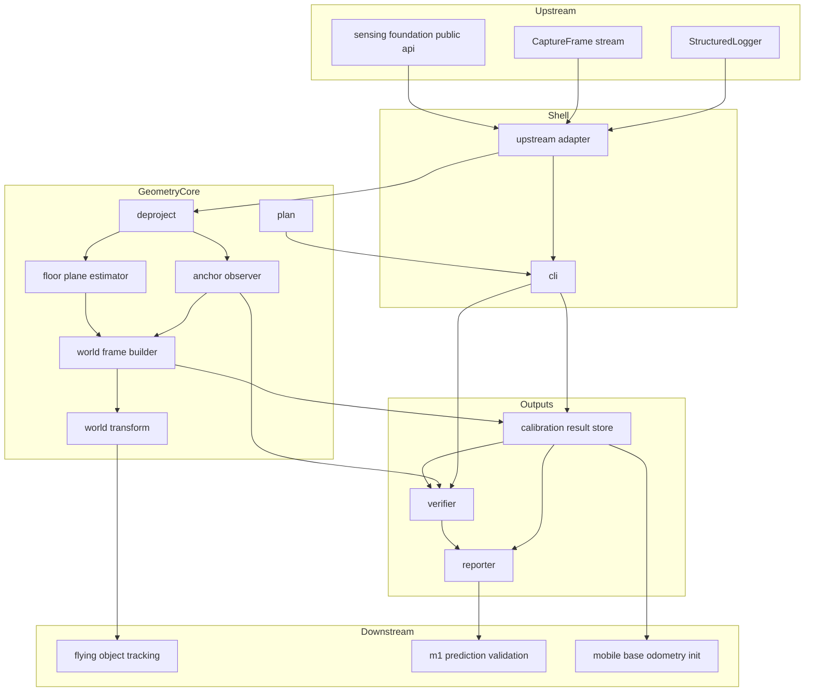
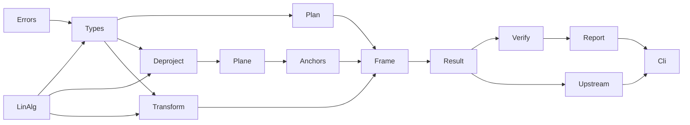
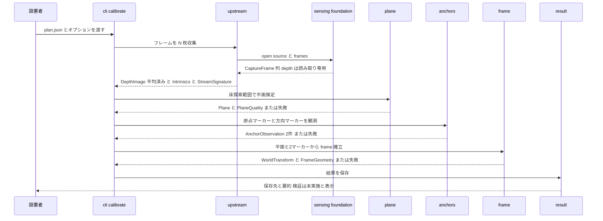
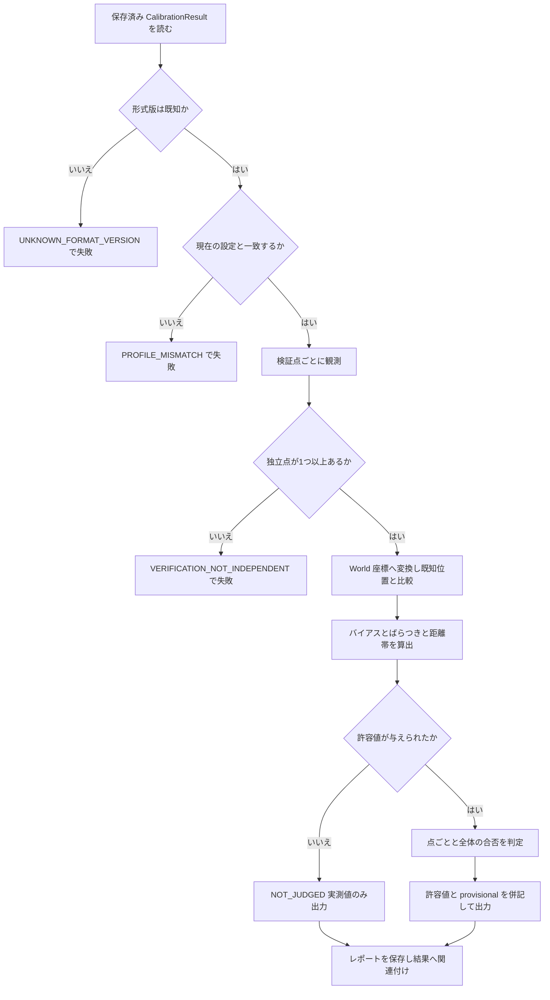
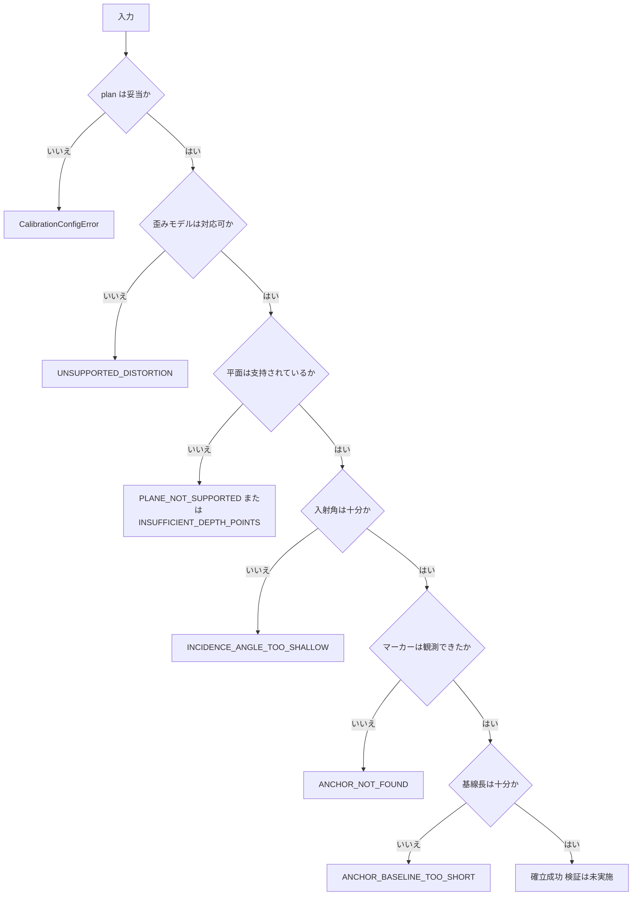

# Technical Design Document: world-frame-calibration

## Overview

**Purpose**: 本機能は、Depth から**床平面を推定して World frame を確立し**、カメラ座標系 → World 座標系の変換を提供する。ただし本設計の重心は変換そのものではなく、**変換が正しいことを独立に確かめる検証**にある。`docs/requirements.md §6.2` が警告するとおり、座標系の数 cm のずれは「予測が悪い」という症状としてしか現れず、検出誤差・予測誤差と区別がつかない。**検出も予測も動かさずに単体で合否が出る検証**を先に用意することで、M1 の誤差要因を最初に切り分けられる状態を作る。

**Users**: `flying-object-tracking`（カメラ座標系の検出結果を World へ変換する）、`m1-prediction-validation`（予測誤差と系統誤差の分離材料として検証レポートを使う）、および M3（移動体のオドメトリ原点を World 原点へ合わせる）。設置者は再設置のたびに本 Spec の手順を実行する。

**Impact**: 本 Spec は **OQ-03 を決着させる。** `docs/requirements.md §6.1` の空欄（原点・X 軸・Y 軸）が埋まり、§6.2 の手順1・2・4 が実行可能な形になる。手順3（移動体オドメトリ原点の初期化）は**手順として定義するが実装は M3 側**に残る。既存の `src/prediction_core/` には一切触れず、上流 `sensing-foundation` の公開入口のみを消費する。

### Goals

- Depth から床平面を推定し、推定品質（内点数・残差・入射角）を伴って返す（要件 1）
- World frame の原点・軸方向を**カメラ設置に依存しない形で**一意に確立する（要件 2。OQ-03）
- カメラ座標 → World 座標の変換と、画素 + Depth → カメラ座標の逆投影を提供する（要件 3）
- **確立に使っていない独立点との照合により、誤差をバイアス・ばらつき・距離依存に分解して報告し、単体で合否を出す**（要件 4）
- 座標系が定まらない条件では、部分的な結果を返さずに識別可能な理由で失敗する（要件 5）
- 結果を永続化し、設定不一致を検出する（要件 6）
- 設置のたびに実行できる手順を文書化し、再現性を数値で比較できるようにする（要件 7）
- live / recorded / simulated のいずれでも同じ結果を返し、**実機が無くても全機能を動かせる**（要件 8 / 9）
- 自区間の計測値を `sensing-foundation` の構造化ロギングへ送る（要件 10）

### Non-Goals

- 飛翔物の検出・追跡（`flying-object-tracking`）、予測（`prediction-core`、実装済み）
- フレーム取得・記録・再生・構造化ロギング基盤（`sensing-foundation`）
- 移動体オドメトリの実装（M3）。**原点を合わせる手順の定義までを持つ**
- 設置形態の決定（OQ-06）、リポジトリ全体のディレクトリ構成（OQ-40）、Python 環境構築方針（OQ-41）
- Throw Record スキーマの定義・変更（`prediction-core` が正。D-8）
- M1 の end-to-end 計測と完了判定（`m1-prediction-validation`）

> 詳細と担当先は下の [Out of Boundary](#out-of-boundary) を正とする。

---

## Boundary Commitments

### This Spec Owns

- **床平面の推定と推定品質**: 平面パラメータ、内点数・内点率・残差代表値・使用フレーム数・入射角（要件 1）
- **World frame の定義**: 原点・軸方向の決め方そのもの。**OQ-03 を決着させる**（要件 2）
- **カメラ座標 → World 座標の変換**と、画素 + Depth → カメラ座標の**逆投影**（要件 3）
- **独立検証**: 検証点の定義・誤差の分解・距離依存性・合否判定・レポート形式（要件 4）
- **縮退条件の定義と失敗理由の列挙**（要件 5）
- **キャリブレーション結果の永続化形式**（`CALIBRATION_FORMAT_VERSION`）と整合性検査（要件 6）
- **キャリブレーション計画（plan）の入力形式**: 探索範囲・マーカー定義・検証点・上限下限・許容値（要件 4 / 7）
- **設置手順書**と再現性比較の手段（要件 7）
- **`calibrate` stage の計測点**（要件 10）
- **物理配置**: `src/world_frame_calibration/**`、`tests/world_frame_calibration/**`、`.kiro/specs/world-frame-calibration/procedure.md`、同 `measurements.md`、ルート `pyproject.toml` への**追記**

### Out of Boundary

- 飛翔物の検出・追跡・フレーム間対応付け（`flying-object-tracking`）。**向こうはカメラ座標系のまま引き渡す**
- 落下地点・落下時刻の予測（`prediction-core`）
- フレーム取得・記録・再生・構造化ロギング基盤（`sensing-foundation`）
- 移動体オドメトリの実装、目標座標の送信、移動体側のすべて（M3 以降）
- カメラを移動させる運用・エゴモーション補正（カメラは固定運用）
- 段階別レイテンシの**集計と判断**（`m1-prediction-validation` / OQ-27）
- 設置形態の決定（OQ-06）。本設計は**どちらでも成立する**方式を採る
- `docs/` 本文の更新（実装完了時に OQ-03 を `decisions.md` へ移す作業として別途行う）
- `src/prediction_core/**` および `src/sensing_foundation/**` への一切の変更
- `.gitignore` の編集（`sensing-foundation` が `var/` を追加する。本 Spec の出力は `var/calibration/` に置き、その傘に入る）

### Allowed Dependencies

- **`sensing_foundation` の公開入口（`sensing_foundation.__init__`）のみ**。内部モジュールへ直接 import しない。**接点は `upstream.py` 1モジュールに限る**
- **`numpy` のみ**をサードパーティ依存として宣言する（extras `calibration`）。**`[project].dependencies` は空のまま維持する**
- 標準ライブラリ（`json` / `math` / `dataclasses` / `enum` / `pathlib` / `argparse` / `time` / `typing`）
- **禁止**:
  - `prediction_core` への依存（[research.md Decision 6](./research.md#decision-6-prediction_core-に依存しない)）
  - `cv2`（OpenCV）と `pyrealsense2` の import。前者は `flying-object-tracking` の道具、後者は `sensing-foundation` が遅延 import で扱う
  - `upstream.py` / `cli.py` 以外のモジュールからの `sensing_foundation` の import
  - `prediction_core` / `sensing_foundation` へのサードパーティ依存の逆流

### Revalidation Triggers

以下が発生した場合、下流（`flying-object-tracking` / `m1-prediction-validation` / M3）は結合を再確認する必要がある。

- **World frame の定義変更**（原点・軸の決め方、右手系、単位）。これは座標値の意味そのものが変わるため、最も重い変更である
- `WorldTransform` の構成・適用の意味論の変更（回転と平行移動のみという制約の変更を含む）
- `CALIBRATION_FORMAT_VERSION` の変更、および保存結果の必須フィールドの変更
- `PLAN_FORMAT_VERSION` の変更（設置者が持つ plan ファイルが読めなくなる）
- 検証レポートの誤差定義の変更（バイアス・ばらつき・距離帯の算出方法）
- 逆投影が対応する歪みモデルの拡大・縮小
- `calibrate` stage のイベント名・キーの変更（`m1-prediction-validation` の集計が壊れる）
- **上流由来**: `sensing_foundation` の `CaptureFrame` / `StreamProfile` / `CameraIntrinsics` の非追加変更、`FrameSource` の意味論変更、`RECORDING_FORMAT_VERSION` の変更

---

## 決着させる未決事項

| OQ | 決定 | 決め方 |
|---|---|---|
| **OQ-03** ★ | **World frame**: Z ＝ 床平面法線のカメラ側正、原点 ＝ 原点マーカーの床平面投影点、+X ＝ 原点マーカー → 方向マーカーの床平面成分、+Y ＝ Z × X（右手系）、単位 mm / ms。**キャリブレーション手順**: 計画作成 → フレーム収集 → 平面推定 → マーカー観測 → frame 確立 → 保存 → **独立検証**（必須） | 設計で決定（[research.md Decision 1](./research.md#decision-1-world-frame-の面内3自由度を床上の2マーカーで決める-oq-03)）。数値パラメータ（基線長下限・許容値等）は暫定値として根拠付きで置き、実機で `measurements.md` へ実測を記録する |

**未決のまま残すもの**（明示）:

- **OQ-06**（設置形態）: 決めない。本方式は**カメラ設置に依存しない**ため壁固定でも三脚でも成立する。ただし設置形態を変えたら再実施が要る旨を `procedure.md` に書く
- **OQ-26**（物体検出方式）: `flying-object-tracking` の担当。本 Spec のマーカー観測は**静止対象を範囲指定で観測するだけ**であり、検出方式の決定ではない
- **OQ-40 / OQ-41**: 本 Spec は `src/world_frame_calibration/` 1パッケージの位置だけを定める。環境構築方針は既存の設定に乗る
- **許容値の実測**: 既定の許容値は暫定。実機での実測後に `measurements.md` で見直す（`tech.md` 開発標準1）

---

## Architecture

### Existing Architecture Analysis

| 既存の約束 | 出典 | 本設計での扱い |
|---|---|---|
| `src/` レイアウト、`pyproject.toml` は PEP 621、hatchling | `prediction-core` | 踏襲。`packages` に追記する |
| 単位をフィールド名に含める（mm / ms / deg / px） | `prediction-core` / `structure.md` | 踏襲。角度は `_deg` を付す |
| 依存方向を階層で固定し、静的テストで回帰検証する | `prediction-core` `test_boundaries.py` | 踏襲。**加えて上流 import の集中も静的に検証する** |
| 公開 API を `__init__` の1箇所に集約する | `prediction-core` / `sensing-foundation` | 踏襲 |
| `json.dumps(allow_nan=False)`、欠測はキーごと省く | `prediction-core` / `sensing-foundation` | 踏襲 |
| Ports & Adapters、`for frame in source.frames():` が入口 | `sensing-foundation` | 消費側として踏襲。**アダプタを新設しない**（本 Spec は入力元を増やさない） |
| 外部デバイス起因の失敗は例外、判断材料は値 | `sensing-foundation` | 踏襲。**縮退条件は例外**（要件 5.5「部分的な結果を返さない」を型で保証するため） |
| OpenCV を導入しない | `sensing-foundation` | 踏襲。必要な演算は NumPy で完結する（[research.md](./research.md#床平面推定の手法選定)） |

### Architecture Pattern & Boundary Map

**Selected pattern**: **依存のない幾何コア ＋ 単一の上流アダプタ（Functional Core / Imperative Shell）**。幾何・変換・検証・永続化は NumPy と標準ライブラリだけの純粋な層とし、`sensing_foundation` に触れるのは `upstream.py` 1モジュールに限る。これにより幾何コアは上流の実装完了を待たずに単体テストでき、境界違反を静的テストで検出できる。



**Architecture Integration**:

- **Selected pattern**: 幾何コアを純粋関数群として置き、副作用（フレーム取得・ログ送出・ファイル入出力）を外側に追い出す。要件 9.4（同一入力に同一結果）と要件 9.2（ハード不要）を**構造として**保証する
- **Domain/feature boundaries**: 「推定（plane / anchors）」「確立（frame）」「適用（transform）」「検証（verify）」「永続化（result）」は互いに片方向にしか依存しない。結び付けるのは `cli.py` だけである
- **Existing patterns preserved**: `src/` レイアウト、単位付きフィールド名、依存方向の静的検証、公開 API の一点集約、`allow_nan=False`
- **New components rationale**: 各コンポーネントは要件の責務境界（計画／逆投影／平面／マーカー／確立／適用／永続化／検証／報告／上流接続／入口）に 1 対 1 で対応する。**入力元を増やさないためアダプタ抽象を作らない**（`sensing_foundation` が既に持っている）
- **Steering compliance**:
  - `tech.md` 開発標準1 — 暫定値には導出根拠を併記し、`provisional` フラグを結果に埋める（要件 4.6 / 10.6）
  - `tech.md` 開発標準4 — 部品を替える前に設定で詰める。探索範囲・反復回数・下限はすべて plan で設定可能
  - `tech.md` 開発標準5 — ロギングは上流の fire-and-forget に委ね、無効化できる（要件 10.5）
  - `tech.md` 開発標準6 — recorded 入力だけで全機能が動く（要件 8.5 / 9.2）
  - `development-environment.md §4` — **全画素の3次元展開をしない。** 逆投影は plan が指定した範囲の画素にのみ適用する（要件 1.4）

### Dependency Direction

依存は**左から右へのみ**許可する。右の層が左の層を import してよく、逆は禁止する。



| 層 | モジュール | import してよい対象 |
|---|---|---|
| 0 | `errors` / `linalg` | 標準ライブラリ ＋ `numpy`（`linalg` のみ）。互いに import しない |
| 1 | `types` | `errors`, `linalg` |
| 2 | `plan` / `deproject` | 0〜1 |
| 3 | `plane` / `transform` | 0〜2 |
| 4 | `anchors` | 0〜3 |
| 5 | `frame` | 0〜4 |
| 6 | `result` | 0〜5 |
| 7 | `verify` | 0〜6 |
| 8 | `report` | 0〜7 |
| 8 | `upstream` | 0〜6 ＋ **`sensing_foundation`（公開入口のみ）** |
| 9 | `cli` | 0〜8 |
| 9 | `__init__` | 0〜8（再エクスポートのみ。ロジックを持たない） |

> **`upstream` だけが `sensing_foundation` を import する。** これが本設計で最も重要な構造的制約である。幾何コア（0〜7）は上流の実装完了を待たずに完成でき、`flying-object-tracking` と並行実装しても衝突しない。`test_boundaries.py` がこの規則と、`cv2` / `pyrealsense2` / `prediction_core` を import していないことを静的に検証する。
>
> **`report` が `upstream` を import しないのは意図的である。** レポート生成にログ送出を絡めると、ログ無効時にレポートが変わりうる。レポートは純粋な変換に保つ。

### Technology Stack

| Layer | Choice / Version | Role in Feature | Notes |
|---|---|---|---|
| 言語 / ランタイム | Python >= 3.11 | 実装言語 | 既存2パッケージと同一。PEP 695 構文を使わない |
| 数値計算 | NumPy（extras `calibration`） | SVD・RANSAC・逆投影・統計量 | **唯一の宣言済みサードパーティ依存。** `[project].dependencies` は空のまま |
| 上流 | `sensing_foundation`（同一リポジトリ） | フレーム取得・内部パラメータ・ロギング | 公開入口のみ。`upstream.py` に集約 |
| 直列化 | 標準ライブラリ `json` | plan / calibration / verification report | `allow_nan=False`、欠測はキーごと省く |
| 乱数 | `numpy.random.Generator`（シード指定可） | RANSAC の候補抽出 | シードを結果に記録し、再現性を保証（要件 9.4） |
| CLI | 標準ライブラリ `argparse` | `calibrate` / `verify` / `show` / `compare` | 常駐サーバを持たない |
| テスト | `pytest`（開発依存） | 単体・結合・E2E・境界テスト | **実機・SDK なしで全通過すること** |

> **採用しなかったもの**: OpenCV（Color 依存の校正パターンを使わないため不要）、Open3D / SciPy（SVD と統計量は NumPy で足りる）、`pyrealsense2`（上流が扱う）。詳細は [research.md](./research.md#床平面推定の手法選定)。

---

## File Structure Plan

### Directory Structure

```
src/world_frame_calibration/
├── __init__.py          # 公開APIの再エクスポート専用。ロジックを持たない
├── errors.py            # 例外階層と FailureReason 列挙
├── linalg.py            # 正規直交化・直交性検査・回転差分・ロバスト統計。numpy のみ
├── types.py             # 値オブジェクト: Intrinsics / StreamSignature / DepthImage /
│                        #   PixelRegion / Plane / PlaneQuality / AnchorObservation /
│                        #   AnchorRole / FrameGeometry / ToleranceSpec
├── plan.py              # CalibrationPlan の読み書きと検証。PLAN_FORMAT_VERSION
├── deproject.py         # 画素 + Depth → カメラ座標。歪みモデルの受理判定
├── plane.py             # RANSAC + SVD による床平面推定と推定品質の算出
├── transform.py         # WorldTransform（回転と平行移動のみ）と適用・逆変換・差分
├── anchors.py           # 範囲 + 高さバンド + ロバスト代表値によるマーカー観測
├── frame.py             # 平面 + 2マーカー → WorldTransform 構築、縮退検査、ヨー感度
├── result.py            # CalibrationResult の組み立て・直列化・整合性検査・比較
├── verify.py            # 独立検証: 誤差分解・距離帯集計・合否判定
├── report.py            # 人間可読の要約と機械可読 JSON の生成
├── upstream.py          # sensing_foundation との唯一の接点（フレーム収集・型写像・ロギング）
└── cli.py               # calibrate / verify / show / compare

tests/world_frame_calibration/
├── conftest.py                 # 共通フィクスチャ（一時ディレクトリ・既定 plan）
├── synthetic.py                # 既知姿勢からの合成 Depth 生成器（床平面＋マーカー箱＋ノイズ）
├── test_linalg.py
├── test_types.py
├── test_plan.py
├── test_deproject.py           # 逆投影の正しさと歪みモデル拒否
├── test_plane.py               # 既知平面の復元・外れ値耐性・内点不足での失敗
├── test_transform.py           # 直交性・往復変換・差分の意味
├── test_anchors.py             # 範囲・高さバンド・ロバスト性・未検出時の失敗
├── test_frame.py               # 既知姿勢の復元・縮退条件の各分岐・ヨー感度
├── test_result.py              # 直列化往復・形式版・設定不一致の検出
├── test_verify.py              # 誤差分解・独立性検査・合否判定・許容値未指定
├── test_report.py
├── test_upstream.py            # 上流公開型を模した最小ダブルでの型写像とロギング委譲
├── test_cli.py                 # 4サブコマンドの入出力
├── test_e2e_synthetic.py       # plan → calibrate → verify が既知姿勢を復元して PASS する
└── test_boundaries.py          # 依存方向・上流 import 集中・cv2/pyrealsense2/prediction_core 不使用
```

### Modified Files

- `pyproject.toml` — `[tool.hatch.build.targets.wheel].packages` に `src/world_frame_calibration` を**追記**する。`[project.optional-dependencies]` に `calibration = ["numpy>=1.24"]` を**追記**する。**`[project].dependencies` は空のまま変更しない**（`tests/prediction_core/test_packaging.py` が空であることを表明している）
- `.kiro/specs/world-frame-calibration/procedure.md` — **新規**。設置のたびに実施する手順書（要件 7.2 / 7.5 / 7.6）
- `.kiro/specs/world-frame-calibration/measurements.md` — **新規**。実機での推定品質・検証誤差・再現性・許容値見直しの**結論**を記録する（生データは `var/` 配下で版管理しない）

> `src/prediction_core/**` と `src/sensing_foundation/**` は**一切変更しない**。`.gitignore` も編集しない（`var/` は `sensing-foundation` が追加する）。
>
> ⚠️ **`pyproject.toml` は `flying-object-tracking` と同時に編集される可能性がある。** 追記は上記2箇所に限定し、既存行を書き換えない。衝突した場合は両方の追記を残す形で解決する。

---

## System Flows

### キャリブレーション（`calibrate`）



**フロー上の決定**:

- **平均化は取得の直後に1度だけ行う。** 以降の段は `DepthImage` だけを見る。これにより平面推定とマーカー観測が同一の観測に基づくことが保証される
- **保存時点では検証が未実施**であり、結果はその状態を保持する（要件 6.6）。`procedure.md` は検証まで実施して初めて運用に使えるとする（要件 7.3）
- 各段の失敗はその場で停止する。**後続の段を「とりあえず」実行しない**

### 検証（`verify`）



**フロー上の決定**:

- **設定一致の検査を検証の前に置く。** 解像度が違えば内部パラメータも違い、比較する意味がない（要件 6.4）
- 確立に使ったマーカーと重複する検証点は**集計から除外し、重複として明示する**。独立点がゼロなら検証として成立しない（要件 4.3。[research.md Decision 2](./research.md#decision-2-検証は確立に使っていない独立点に対してのみ有効とする)）
- 許容値の有無で判定と非判定が分岐するが、**実測値の出力はどちらでも行う**（要件 4.7）

---

## Requirements Traceability

| Requirement | Summary | Components | Interfaces | Flows |
|---|---|---|---|---|
| 1.1 | 床平面をカメラ座標系の平面として推定 | FloorPlaneEstimator | `estimate_floor_plane` | calibrate |
| 1.2 | 推定品質（点数・内点率・残差）を提供 | FloorPlaneEstimator, GeoTypes | `PlaneQuality` | calibrate |
| 1.3 | 無効 Depth 画素を除外 | Deprojector, FloorPlaneEstimator | `deproject_region` | calibrate |
| 1.4 | 探索範囲に限定し全画素展開を要求しない | CalibrationPlan, Deprojector | `PixelRegion` | calibrate |
| 1.5 | 内点下限割れで平面を返さない | FloorPlaneEstimator, Errors | `FailureReason.PLANE_NOT_SUPPORTED` | calibrate |
| 1.6 | 複数フレームで安定化し使用枚数を残す | UpstreamAdapter, GeoTypes | `average_depth`, `DepthImage.frames_used` | calibrate |
| 1.7 | 入力 Depth を書き換えない | UpstreamAdapter | `average_depth` | calibrate |
| 2.1 | Z 軸＝床法線カメラ側、床面 z=0 | WorldFrameBuilder | `build_world_frame` | calibrate |
| 2.2 | 原点＝原点マーカーの床平面投影 | AnchorObserver, WorldFrameBuilder | `observe_anchor` | calibrate |
| 2.3 | +X＝原点→方向マーカーの床平面成分 | WorldFrameBuilder | `build_world_frame` | calibrate |
| 2.4 | +Y＝Z×X（右手系） | WorldFrameBuilder, LinAlg | `orthonormal_basis` | calibrate |
| 2.5 | 単位 mm / ms | GeoTypes | 全フィールド名 | — |
| 2.6 | マーカーに色・柄・既知寸法を要求しない | AnchorObserver | `observe_anchor` | calibrate |
| 2.7 | 基線長下限割れで変換を返さない | WorldFrameBuilder | `FailureReason.ANCHOR_BASELINE_TOO_SHORT` | calibrate |
| 2.8 | ヨー感度を算出し結果に含める | WorldFrameBuilder, GeoTypes | `FrameGeometry` | calibrate |
| 2.9 | カメラ設置に依存せず再現できる方式 | WorldFrameBuilder | `build_world_frame` | calibrate |
| 3.1 | カメラ座標点を World 座標へ変換 | WorldTransform | `apply_point` | 下流利用 |
| 3.2 | 複数点の一括変換 | WorldTransform | `apply` | 下流利用 |
| 3.3 | 回転と平行移動のみ | WorldTransform, LinAlg | `is_orthonormal` | — |
| 3.4 | 画素 + Depth + 内部パラメータ → カメラ座標 | Deprojector | `deproject_pixel`, `deproject_region` | calibrate / verify |
| 3.5 | 非対応の歪み係数で失敗 | Deprojector | `FailureReason.UNSUPPORTED_DISTORTION` | calibrate |
| 3.6 | 適用にカメラ・SDK・I/O を要求しない | WorldTransform, PublicApi | 依存方向 | — |
| 3.7 | 床上の点の z が品質範囲内で 0 | WorldFrameBuilder, Verifier | `verify_calibration` | verify |
| 4.1 | 検出・予測なしで単体完了 | Verifier, CLI | `verify` サブコマンド | verify |
| 4.2 | 軸ごとの差分を報告 | Verifier | `PointError.error_mm` | verify |
| 4.3 | 独立点を要求、確立点のみは無効 | Verifier | `FailureReason.VERIFICATION_NOT_INDEPENDENT` | verify |
| 4.4 | バイアスとばらつきを分けて報告 | Verifier | `VerificationReport.bias_mm` / `scatter_rms_mm` | verify |
| 4.5 | 距離と誤差の対応を報告 | Verifier | `RangeBucket` | verify |
| 4.6 | 許容値と暫定/実測の別を併記して判定 | Verifier, GeoTypes | `ToleranceSpec`, `Verdict` | verify |
| 4.7 | 許容値なしでも実測値を報告 | Verifier | `Verdict.NOT_JUDGED` | verify |
| 4.8 | 人間可読と機械可読の双方で残す | Reporter | `render_text`, `to_json` | verify |
| 4.9 | 既知高さの検証点も同形式で報告 | Verifier, CalibrationPlan | `VerificationPointSpec.truth_world_mm` | verify |
| 4.10 | 対象結果の識別子と設定を含める | Verifier, CalibrationResultStore | `VerificationReport.calibration_id` | verify |
| 5.1 | 有効点不足で失敗 | FloorPlaneEstimator | `INSUFFICIENT_DEPTH_POINTS` | calibrate |
| 5.2 | マーカー未検出でどれかを報告 | AnchorObserver | `ANCHOR_NOT_FOUND` | calibrate |
| 5.3 | 基線長不足で +X 不安定を報告 | WorldFrameBuilder | `ANCHOR_BASELINE_TOO_SHORT` | calibrate |
| 5.4 | 入射角過小で設置見直しを促す | FloorPlaneEstimator | `INCIDENCE_ANGLE_TOO_SHALLOW` | calibrate |
| 5.5 | 部分結果や既定値埋めを返さない | Errors | 例外による失敗 | 全体 |
| 5.6 | 失敗理由を分岐可能な値で提供 | Errors | `FailureReason` | 全体 |
| 6.1 | 保存・読み込みで同一変換を再現 | CalibrationResultStore | `save_calibration`, `load_calibration` | calibrate |
| 6.2 | 日時・入力元・設定・内部パラメータ等を含む | CalibrationResultStore | `CalibrationResult` | calibrate |
| 6.3 | 形式版を含み未知版で失敗 | CalibrationResultStore | `CALIBRATION_FORMAT_VERSION` | verify |
| 6.4 | 設定不一致を検出し有効扱いしない | CalibrationResultStore | `check_compatibility` | verify |
| 6.5 | 最後の検証要約を関連付け | CalibrationResultStore, Reporter | `attach_verification` | verify |
| 6.6 | 未検証・検証失敗の状態を判別可能に | CalibrationResultStore | `VerificationState` | verify |
| 7.1 | 設置のたびに実行できる一連の手順 | CLI | 4サブコマンド | calibrate / verify |
| 7.2 | 手順書を提供 | Procedure | `procedure.md` | — |
| 7.3 | 検証を必須段階として位置付け | Procedure, CalibrationResultStore | `VerificationState` | verify |
| 7.4 | 複数回の結果差分を比較 | CalibrationResultStore, WorldTransform | `compare_calibrations` | compare |
| 7.5 | オドメトリ原点合わせ手順と範囲外の明記 | Procedure | `procedure.md` | — |
| 7.6 | 設定変更時の再実施を明記 | Procedure | `procedure.md` | — |
| 8.1 | 共通フレーム表現で受け取り SDK を直接呼ばない | UpstreamAdapter | `collect_depth` | calibrate |
| 8.2 | 公開入口のみを参照 | UpstreamAdapter, BoundaryTest | `test_boundaries.py` | — |
| 8.3 | 入力元が違っても同一結果 | UpstreamAdapter, 幾何コア | `DepthImage` | calibrate |
| 8.4 | 内部パラメータを入力経路から取得 | UpstreamAdapter | `to_intrinsics` | calibrate |
| 8.5 | 実機・SDK なしで記録セッションに対し実行 | UpstreamAdapter, CLI | `--source recorded` | calibrate / verify |
| 8.6 | `prediction_core` に依存せずスキーマを再定義しない | BoundaryTest | `test_boundaries.py` | — |
| 9.1 | 既知姿勢の合成入力で姿勢を復元 | SyntheticDepth, E2E テスト | `test_e2e_synthetic.py` | — |
| 9.2 | 検証実行にハード接続を要求しない | 幾何コア全体 | 依存方向 | — |
| 9.3 | 既知ノイズが品質とレポートに反映 | SyntheticDepth, Verifier | `PlaneQuality`, `scatter_rms_mm` | — |
| 9.4 | 同一入力に同一結果 | FloorPlaneEstimator | `rng_seed` | calibrate |
| 9.5 | 縮退条件の各分岐を実機なしで再現 | SyntheticDepth | `test_frame.py` ほか | — |
| 10.1 | 自身の段階名でログ送出 | UpstreamAdapter | `stage_logger` | calibrate / verify |
| 10.2 | ロギング基盤を再実装しない | UpstreamAdapter | `sensing_foundation.Logger` | — |
| 10.3 | 各段の所要時間を計測値として残す | UpstreamAdapter, CLI | `timed` | calibrate / verify |
| 10.4 | 変換適用時間を下流が計測できる形で提供 | WorldTransform, UpstreamAdapter | `timed_apply` | 下流利用 |
| 10.5 | 無効時は計測値を生成しない | UpstreamAdapter | `NullLogger` 委譲 | — |
| 10.6 | 計測値を未実測目標との合否判定に使わない | Reporter | `provisional` 表示 | verify |
| 11.1 | 検出・追跡を持たない | Boundary Commitments | — | — |
| 11.2 | 予測を持たない | Boundary Commitments | — | — |
| 11.3 | オドメトリ実装を持たず手順定義まで | Procedure | `procedure.md` | — |
| 11.4 | 検出側からはカメラ座標で受け取る | WorldTransform | `apply` | 下流利用 |
| 11.5 | 変更範囲を自パッケージと追記に限る | File Structure Plan | — | — |

---

## Components and Interfaces

| Component | Domain/Layer | Intent | Req Coverage | Key Dependencies | Contracts |
|---|---|---|---|---|---|
| Errors | L0 | 例外階層と失敗理由の列挙 | 5.5, 5.6 | — | State |
| LinAlg | L0 | 正規直交化・直交性検査・回転差分・ロバスト統計 | 2.4, 3.3, 7.4 | numpy (P0) | Service |
| GeoTypes | L1 | 値オブジェクトの定義 | 1.2, 1.6, 2.5, 2.8, 4.6 | errors (P1), linalg (P2) | State |
| CalibrationPlan | L2 | 設置者の入力（範囲・マーカー・検証点・下限・許容値） | 1.4, 4.9, 7.1 | types (P0) | State, Batch |
| Deprojector | L2 | 画素 + Depth → カメラ座標、歪みモデル受理判定 | 1.3, 1.4, 3.4, 3.5 | types (P0) | Service |
| FloorPlaneEstimator | L3 | RANSAC + SVD による床平面推定と品質算出 | 1.1-1.7, 5.1, 5.4, 9.3, 9.4 | deproject (P0) | Service |
| WorldTransform | L3 | 剛体変換の保持と適用・逆変換・差分 | 3.1-3.3, 3.6, 7.4, 10.4, 11.4 | linalg (P0) | Service, State |
| AnchorObserver | L4 | 範囲 + 高さバンドのロバスト代表値としてマーカーを観測 | 2.2, 2.6, 5.2, 9.3 | plane (P1), deproject (P0) | Service |
| WorldFrameBuilder | L5 | 平面 + 2マーカー → 変換の確立と縮退検査 | 2.1-2.9, 3.7, 5.3 | transform (P0), anchors (P0) | Service |
| CalibrationResultStore | L6 | 結果の組み立て・直列化・整合性検査・比較 | 6.1-6.6, 7.4, 4.10 | frame (P0), plan (P1) | Batch, State |
| Verifier | L7 | 独立検証と誤差分解・距離帯集計・合否判定 | 4.1-4.10, 3.7, 9.3 | result (P0), anchors (P1) | Service, Batch |
| Reporter | L8 | 人間可読要約と機械可読 JSON の生成 | 4.8, 6.5, 10.6 | verify (P0), result (P0) | Batch |
| UpstreamAdapter | L8 | `sensing_foundation` との唯一の接点 | 1.6, 1.7, 8.1-8.5, 10.1-10.5 | sensing_foundation (P0 外部) | Service |
| CLI | L9 | 4サブコマンドの入口 | 4.1, 7.1, 7.3, 8.5, 10.3 | 全コンポーネント (P0) | Service |
| PublicApi | L9 | 公開シンボルの再エクスポート | 3.6, 8.6 | 全コンポーネント (P0) | — |
| Procedure | ドキュメント | 設置手順書 | 7.2, 7.3, 7.5, 7.6, 11.3 | — | — |
| SyntheticDepth | テスト | 既知姿勢からの合成 Depth 生成 | 9.1, 9.3, 9.5 | numpy (P0) | — |
| BoundaryTest | テスト | 依存方向と禁止 import の静的検証 | 8.2, 8.6, 11.5 | — | — |

---

### L0-L2: 基盤・入力

#### Errors

| Field | Detail |
|---|---|
| Intent | 失敗を「呼び出し方の誤り」と「座標系が定まらない条件」に分け、後者を分岐可能な理由付きで表す |
| Requirements | 5.5, 5.6 |

**Contracts**: State [x]

```python
class WorldFrameCalibrationError(Exception): ...
class CalibrationConfigError(WorldFrameCalibrationError): ...   # 呼び出し方・plan の誤り
class CalibrationFailure(WorldFrameCalibrationError):           # 座標系が定まらない
    reason: "FailureReason"
    detail: str
    context: Mapping[str, object]        # 何をどう直せばよいかの材料

class FailureReason(StrEnum):
    INSUFFICIENT_DEPTH_POINTS = "insufficient_depth_points"
    PLANE_NOT_SUPPORTED = "plane_not_supported"
    INCIDENCE_ANGLE_TOO_SHALLOW = "incidence_angle_too_shallow"
    ANCHOR_NOT_FOUND = "anchor_not_found"
    ANCHOR_BASELINE_TOO_SHORT = "anchor_baseline_too_short"
    ANCHOR_DEGENERATE = "anchor_degenerate"
    UNSUPPORTED_DISTORTION = "unsupported_distortion"
    ROTATION_NOT_ORTHONORMAL = "rotation_not_orthonormal"
    UNKNOWN_FORMAT_VERSION = "unknown_format_version"
    PROFILE_MISMATCH = "profile_mismatch"
    VERIFICATION_NOT_INDEPENDENT = "verification_not_independent"
```

**Implementation Notes**

- Integration: **縮退条件は値ではなく例外にする。** `prediction_core` は「無効は値で返す」方針だが、そちらは予測が出ないことが正常系の一部であるのに対し、本 Spec では**縮退した変換が下流へ流れること自体が事故**であり、呼び出し側が戻り値の確認を忘れられない形にする必要がある
- Validation: `context` には内点率・基線長・入射角などの実測値と、判定に用いた下限を必ず入れる（要件 5.1〜5.4 が「報告する」を求めているため）
- Risks: 例外を握り潰す呼び出し側が現れうる。CLI は失敗理由を終了コードと標準エラーへ必ず出す

#### LinAlg

| Field | Detail |
|---|---|
| Intent | 幾何に必要な最小限の線形代数とロバスト統計を1箇所に置く |
| Requirements | 2.4, 3.3, 7.4 |

**Contracts**: Service [x]

```python
def unit(v: "np.ndarray") -> "np.ndarray": ...
def orthonormal_basis(z_axis, x_hint) -> tuple["np.ndarray", "np.ndarray", "np.ndarray"]:
    """z を保ち、x_hint の z 直交成分を x とし、y = z × x を返す（右手系）。"""
def is_orthonormal(r: "np.ndarray", tol: float) -> bool: ...
def rotation_angle_deg(r_a, r_b) -> float: ...      # 2 回転間の全体角
def robust_center(points: "np.ndarray") -> tuple["np.ndarray", float]:
    """各軸の中央値と、中央絶対偏差から導いた散らばりを返す。"""
```

- Preconditions: `z_axis` と `x_hint` は非零。`x_hint` の z 直交成分が数値的に消えていないこと
- Postconditions: `orthonormal_basis` の返す3軸は右手系で単位長。`is_orthonormal` の許容差は呼び出し側が与える
- Invariants: 本モジュールは `numpy` 以外を import しない

**Implementation Notes**

- Integration: `x_hint` の z 直交成分がほぼ消える場合は `CalibrationFailure(ANCHOR_DEGENERATE)` の判定材料を返す。判定自体は `frame` が行う（ここでは真偽と大きさだけを返す）
- Risks: 正規直交化を怠ると `WorldTransform` が拡大縮小を含みうる。**構築時に必ず `is_orthonormal` を通す**（要件 3.3）

#### GeoTypes

| Field | Detail |
|---|---|
| Intent | 上流の型に依存しない値オブジェクトを定義し、単位をフィールド名に含める |
| Requirements | 1.2, 1.6, 2.5, 2.8, 4.6 |

**Contracts**: State [x]

```python
@dataclass(frozen=True, slots=True)
class Intrinsics:                    # sensing_foundation.CameraIntrinsics の写像
    width_px: int; height_px: int
    fx_px: float; fy_px: float; ppx_px: float; ppy_px: float
    model: str
    coeffs: tuple[float, float, float, float, float]

@dataclass(frozen=True, slots=True)
class StreamSignature:               # 整合性検査の対象（要件 6.4）
    width_px: int; height_px: int; fps: int
    depth_scale_mm: float; color_enabled: bool

@dataclass(frozen=True, slots=True)
class PixelRegion:
    x0_px: int; y0_px: int; x1_px: int; y1_px: int      # 半開区間

@dataclass(frozen=True, slots=True)
class DepthImage:
    depth_mm: "np.ndarray"           # float64, (h, w)。無効画素は NaN
    valid_count: "np.ndarray"        # int32, (h, w)。平均に寄与した枚数
    frames_used: int
    intrinsics: Intrinsics
    signature: StreamSignature
    source_kind: str                 # "live" / "recorded" / "simulated"

@dataclass(frozen=True, slots=True)
class Plane:
    normal: tuple[float, float, float]   # 単位ベクトル（カメラ座標系、カメラ側が正）
    distance_mm: float                   # 平面上の点 p に対し dot(normal, p) = distance_mm
    quality: "PlaneQuality"

@dataclass(frozen=True, slots=True)
class PlaneQuality:
    points_considered: int; inlier_count: int; inlier_ratio: float
    residual_abs_p50_mm: float; residual_abs_p95_mm: float; residual_rms_mm: float
    frames_used: int
    incidence_angle_deg: float           # 光軸と床面のなす角。小さいほど浅い
    rng_seed: int

class AnchorRole(StrEnum):
    ORIGIN = "origin"; X_AXIS = "x_axis"; VERIFICATION = "verification"

@dataclass(frozen=True, slots=True)
class AnchorObservation:
    label: str; role: AnchorRole
    point_camera_mm: tuple[float, float, float]      # ロバスト代表点（投影前）
    point_on_plane_mm: tuple[float, float, float]    # 床平面へ法線方向に投影した点
    height_above_plane_mm: float
    range_from_camera_mm: float
    sample_count: int; spread_mm: float
    region: PixelRegion; frames_used: int

@dataclass(frozen=True, slots=True)
class FrameGeometry:
    origin_camera_mm: tuple[float, float, float]
    x_axis_camera: tuple[float, float, float]
    y_axis_camera: tuple[float, float, float]
    z_axis_camera: tuple[float, float, float]
    baseline_mm: float                          # 原点マーカーと方向マーカーの床平面上の距離
    yaw_sensitivity_deg_per_mm: float           # degrees(1 / baseline_mm)
    lateral_error_mm_per_mm_at_1000mm: float    # 1000 / baseline_mm

@dataclass(frozen=True, slots=True)
class ToleranceSpec:
    horizontal_mm: float; vertical_mm: float
    provisional: bool                           # 暫定目標値か実測由来か（要件 4.6）
    source: str                                 # 出典の説明文
```

- Preconditions: `depth_mm.shape == (intrinsics.height_px, intrinsics.width_px)`。`PixelRegion` は画像内かつ非空
- Invariants: すべて `frozen=True, slots=True` で値等価。距離は mm、角度は deg、画素は px
- Postconditions: `Plane.normal` は単位長。`DepthImage.depth_mm` の NaN は「無効」を意味し 0 で埋めない

**Implementation Notes**

- Integration: `Intrinsics` と `StreamSignature` は上流型のフィールド名を**そのまま**採る。写像は `upstream.py` の1箇所に閉じ、写経ミスを起こしにくくする
- Validation: 生成時に検証しない（`prediction_core` / `sensing_foundation` の方針を踏襲）。検証は `deproject` と `plan` の境界で行う
- Risks: `FrameGeometry.yaw_sensitivity_deg_per_mm` は**基線長が短い設置で静かに精度が落ちる罠**の唯一の可視化手段である（[research.md](./research.md#ヨー誤差の増幅とマーカー間距離の下限)）。レポートから落とさない

#### CalibrationPlan

| Field | Detail |
|---|---|
| Intent | 設置者の入力（探索範囲・マーカー・検証点・下限・許容値）を1つのファイルとして受け取る |
| Requirements | 1.4, 4.9, 7.1 |

**Contracts**: State [x] / Batch [x]

```python
PLAN_FORMAT_VERSION = "1.0"

@dataclass(frozen=True, slots=True)
class AnchorSpec:
    label: str; region: PixelRegion
    height_band_mm: tuple[float, float]        # 床平面からの高さの下限・上限

@dataclass(frozen=True, slots=True)
class VerificationPointSpec:
    label: str; region: PixelRegion
    height_band_mm: tuple[float, float]
    truth_world_mm: tuple[float, float, float]  # メジャー実測値。床上なら z=0
    truth_source: str                           # 実測手段の記録

@dataclass(frozen=True, slots=True)
class PlanLimits:
    min_inlier_points: int = 2000
    min_inlier_ratio: float = 0.5
    plane_inlier_threshold_mm: float = 15.0
    min_incidence_angle_deg: float = 10.0
    min_baseline_mm: float = 800.0
    min_anchor_samples: int = 50
    ransac_success_probability: float = 0.999
    ransac_outlier_ratio: float = 0.5
    rng_seed: int = 0

@dataclass(frozen=True, slots=True)
class CalibrationPlan:
    plan_format_version: str
    floor_region: PixelRegion
    origin_anchor: AnchorSpec
    x_axis_anchor: AnchorSpec
    verification_points: tuple[VerificationPointSpec, ...]
    limits: PlanLimits
    tolerance: ToleranceSpec | None
    expected_baseline_mm: float | None          # メジャー実測値。スケールの独立確認に使う
    notes: str

def load_plan(path: Path) -> CalibrationPlan: ...
def save_plan(plan: CalibrationPlan, path: Path) -> None: ...
```

##### Batch / Job Contract

- **Trigger**: CLI の全サブコマンドが `--plan` で受け取る
- **Input / validation**: JSON。`plan_format_version` が未知なら `CalibrationConfigError`。範囲が画像外・空、`height_band_mm` の下限≧上限、検証点ラベルの重複は起動時に拒否する
- **Output / destination**: なし（読み取り専用）。ただし `CalibrationResult` に**使用した plan の要約を埋め込む**（要件 6.2）
- **Idempotency & recovery**: 純粋な読み取り。冪等

**Implementation Notes**

- Integration: `expected_baseline_mm` は **World frame の定義に使わない。** 向きだけを使うため、この距離は独立な検証量になる（[research.md](./research.md#検証の設計-何をもって検証したと言えるか)）。`verify` がここと算出値を突き合わせる
- Validation: 既定値はすべて**暫定**であり、`min_baseline_mm = 800` の根拠（観測誤差 10 mm・距離 2 m で横ずれ約 25 mm）を docstring と `--help` に書く（`tech.md` 開発標準1）
- Risks: 範囲指定は設置ごとに変わる。`procedure.md` に「plan は設置ごとに作り直す／保管する」ことを明記する

#### Deprojector

| Field | Detail |
|---|---|
| Intent | 画素座標と Depth からカメラ座標系の点を求め、扱えない歪みモデルを拒否する |
| Requirements | 1.3, 1.4, 3.4, 3.5 |

**Contracts**: Service [x]

```python
def ensure_supported_distortion(intr: Intrinsics) -> None:
    """歪み係数がすべて 0 でなければ CalibrationFailure(UNSUPPORTED_DISTORTION)。"""

def deproject_pixel(intr: Intrinsics, u_px: float, v_px: float, z_mm: float
                    ) -> tuple[float, float, float]: ...

def deproject_region(image: DepthImage, region: PixelRegion
                     ) -> tuple["np.ndarray", "np.ndarray"]:
    """範囲内の有効画素だけを (N, 3) の点群と (N, 2) の画素座標として返す。"""
```

- Preconditions: `region` が画像内。`ensure_supported_distortion` を通過していること
- Postconditions: `deproject_region` は NaN 画素を除外して返す（要件 1.3）。返り値は新しい配列であり入力を参照しない
- Invariants: 逆投影は `x = (u - ppx_px) / fx_px * z`、`y = (v - ppy_px) / fy_px * z`、`z = z_mm`

**Implementation Notes**

- Integration: **範囲外の画素を一切触らない。** これが「全画素の3次元展開をしない」（要件 1.4、`development-environment.md §4`）の実装上の担保である
- Validation: 歪み係数の判定は厳密な 0 比較とする。近似で受理すると「少しだけ歪んだ座標」が静かに流れる
- Risks: `fx_px` / `fy_px` が 0 の内部パラメータ（未初期化）を受け取ると発散する。`CalibrationConfigError` で弾く

---

### L3-L5: 推定と確立

#### FloorPlaneEstimator

| Field | Detail |
|---|---|
| Intent | 床探索範囲の点群から平面を頑健に推定し、推定品質を返す |
| Requirements | 1.1, 1.2, 1.3, 1.4, 1.5, 1.6, 1.7, 5.1, 5.4, 9.3, 9.4 |

**Responsibilities & Constraints**

- **RANSAC で内点を選び、内点だけで SVD による総最小二乗を解き直す**（[research.md](./research.md#床平面推定の手法選定)）
- 反復回数は `N = log(1 - p) / log(1 - (1 - e)^3)` から導く。**固定値を埋め込まない**（`tech.md` 開発標準1）
- 法線の向きは**カメラ側（原点側）を正**に統一する。これが World frame の +Z になる（要件 2.1）
- 入射角（光軸と床面のなす角）を算出し、下限を下回れば失敗させる（要件 5.4）

**Dependencies**

- Inbound: CLI, Verifier（P0）
- Outbound: Deprojector（P0）, GeoTypes（P0）, Errors（P0）
- External: numpy（P0）

**Contracts**: Service [x]

```python
def estimate_floor_plane(image: DepthImage, region: PixelRegion,
                         limits: PlanLimits) -> Plane: ...
def signed_distance_mm(plane: Plane, points_mm: "np.ndarray") -> "np.ndarray": ...
def project_onto_plane(plane: Plane, points_mm: "np.ndarray") -> "np.ndarray": ...
```

- Preconditions: `region` に有効画素が `limits.min_inlier_points` 以上ありうること
- Postconditions: 返る `Plane.normal` は単位長かつカメラ側正。`quality.rng_seed` に使用シードが入る
- Invariants: 同一の `DepthImage` と同一の `limits.rng_seed` に対して**常に同一の平面**を返す（要件 9.4）

**Implementation Notes**

- Integration: `signed_distance_mm` と `project_onto_plane` を公開するのは、マーカー観測と検証が**同じ平面定義**を使うことを保証するためである。各所で符号規約を再実装させない
- Validation: 有効点が最小サンプル数に満たなければ `INSUFFICIENT_DEPTH_POINTS`、内点が下限割れなら `PLANE_NOT_SUPPORTED`、入射角が下限割れなら `INCIDENCE_ANGLE_TOO_SHALLOW`。いずれも `context` に実測値と下限を入れる
- Risks: 床以外の広い平面（壁・天井）が探索範囲に入ると、そちらを掴む。`procedure.md` に「床探索範囲は床だけを含むように取る」ことを明記し、`incidence_angle_deg` の異常値で気付けるようにする

#### WorldTransform

| Field | Detail |
|---|---|
| Intent | 剛体変換を保持し、点・点群への適用と逆変換・差分を提供する |
| Requirements | 3.1, 3.2, 3.3, 3.6, 7.4, 10.4, 11.4 |

**Contracts**: Service [x] / State [x]

```python
@dataclass(frozen=True, slots=True)
class WorldTransform:
    rotation: tuple[tuple[float, float, float], ...]   # 3x3。R_world_from_camera
    translation_mm: tuple[float, float, float]

    def apply_point(self, p_camera_mm) -> tuple[float, float, float]: ...
    def apply(self, points_camera_mm: "np.ndarray") -> "np.ndarray": ...   # (N,3) -> (N,3)
    def inverse(self) -> "WorldTransform": ...
    def as_matrix(self) -> "np.ndarray": ...            # 4x4 同次変換（表示・保存の補助）

@dataclass(frozen=True, slots=True)
class TransformDifference:
    origin_shift_mm: tuple[float, float, float]
    origin_shift_norm_mm: float
    axis_angle_deg: float
    z_axis_angle_deg: float        # 床法線のずれ＝平面推定の再現性
    yaw_angle_deg: float           # 面内回転のずれ＝マーカー設置の再現性

def compare_transforms(a: WorldTransform, b: WorldTransform) -> TransformDifference: ...
```

- Preconditions: `rotation` は正規直交・行列式 +1。構築時に検査し、外れれば `CalibrationFailure(ROTATION_NOT_ORTHONORMAL)`
- Postconditions: `p_world = R @ p_camera + t`。`apply` は `(N, 3)` の `float64` を返し、入力を変更しない
- Invariants: 拡大縮小・せん断を含まない（要件 3.3）。`inverse()` の往復は数値誤差の範囲で恒等

**Implementation Notes**

- Integration: **本モジュールは `sensing_foundation` にも `numpy` 以外の外部にも依存しない。** 下流は変換だけを持ち回れる（要件 3.6 / 11.4）
- Validation: `apply` は `(N, 3)` 以外の形状を `CalibrationConfigError` で弾く。単点は `apply_point`
- Risks: **`apply` の中でログを取らない。** 毎フレーム呼ばれる唯一の経路であり、ここに副作用を入れると `tech.md` 開発標準5（計測が計測対象を歪めない）に反する。計測は `upstream.timed_apply` が担う（要件 10.4）

#### AnchorObserver

| Field | Detail |
|---|---|
| Intent | 指定範囲・指定高さ帯の点群からマーカーのロバスト代表点を求め、床平面へ投影する |
| Requirements | 2.2, 2.6, 5.2, 9.3 |

**Responsibilities & Constraints**

- **範囲 + 高さバンド + 中央値**という3段だけで観測する。連結成分抽出も形状当てはめも行わない（[research.md](./research.md#面内3自由度をどう決めるか-oq-03-の核心)）
- マーカーの**色・柄・既知寸法を要求しない**（要件 2.6）
- 代表点を床平面へ**法線方向に投影**するため、マーカーの高さは結果に影響しない

**Dependencies**

- Inbound: CLI, WorldFrameBuilder, Verifier（P0）
- Outbound: FloorPlaneEstimator（P1、投影と符号付き距離）, Deprojector（P0）
- External: numpy（P0）

**Contracts**: Service [x]

```python
def observe_anchor(image: DepthImage, plane: Plane, spec: AnchorSpec,
                   role: AnchorRole, limits: PlanLimits) -> AnchorObservation: ...
```

- Preconditions: `plane` が推定済み。`spec.region` が画像内
- Postconditions: `point_on_plane_mm` は平面上（符号付き距離が数値誤差の範囲で 0）。`sample_count >= limits.min_anchor_samples`
- Invariants: 高さバンドは**床平面からの符号付き距離**で判定する。画像上の位置や絶対的な奥行きでは判定しない

**Implementation Notes**

- Integration: 検証点の観測も**同じ関数**を使う（`role=VERIFICATION`）。確立と検証で観測方法が違うと、検証が観測方法の違いを測ってしまう
- Validation: 高さバンド内の点が `min_anchor_samples` に満たなければ `ANCHOR_NOT_FOUND`。`context` にラベル・範囲・実際に得られた点数を入れる（要件 5.2）
- Risks: 範囲に複数の物体が入ると中央値が両者の間に落ちる。`spread_mm`（中央絶対偏差ベース）が大きい場合の警告を要約に出し、`procedure.md` で「範囲は1つのマーカーだけを含める」ことを求める

#### WorldFrameBuilder

| Field | Detail |
|---|---|
| Intent | 床平面と2つのマーカーから World frame を確立し、縮退条件を検査する |
| Requirements | 2.1, 2.2, 2.3, 2.4, 2.5, 2.6, 2.7, 2.8, 2.9, 3.7, 5.3 |

**Responsibilities & Constraints**

- **+Z** ＝ `plane.normal`（カメラ側正）、**原点** ＝ 原点マーカーの `point_on_plane_mm`、
  **+X** ＝ 原点 → 方向マーカーのベクトルの平面内成分を正規化、**+Y** ＝ Z × X
- 基線長が `limits.min_baseline_mm` を下回れば失敗させる（要件 2.7 / 5.3）
- 基線長から**ヨー感度**を算出して結果に含める（要件 2.8）
- **カメラの位置・姿勢を一切参照しない。** マーカーの物理配置だけで frame が決まる（要件 2.9）

**Dependencies**

- Inbound: CLI（P0）
- Outbound: WorldTransform（P0）, AnchorObserver（P0）, LinAlg（P0）, Errors（P0）
- External: numpy（P0）

**Contracts**: Service [x]

```python
@dataclass(frozen=True, slots=True)
class WorldFrameEstablishment:
    transform: WorldTransform
    geometry: FrameGeometry
    plane: Plane
    origin_anchor: AnchorObservation
    x_axis_anchor: AnchorObservation

def build_world_frame(plane: Plane,
                      origin_anchor: AnchorObservation,
                      x_axis_anchor: AnchorObservation,
                      limits: PlanLimits) -> WorldFrameEstablishment: ...
```

- Preconditions: 2つの観測が同一の `plane` に対して得られていること
- Postconditions: `transform.apply_point(origin_anchor.point_on_plane_mm) ≈ (0, 0, 0)`。
  `transform.apply_point(x_axis_anchor.point_on_plane_mm) ≈ (baseline_mm, 0, 0)`。
  床平面上の任意の点の変換結果は z が数値誤差の範囲で 0（要件 3.7）
- Invariants: `rotation` は正規直交・行列式 +1

**Implementation Notes**

- Integration: `R` の各行がカメラ座標系で表した World の X / Y / Z 軸、`t = -R @ origin_camera_mm`。この対応を docstring に明記する
- Validation: 基線長不足は `ANCHOR_BASELINE_TOO_SHORT`、X 方向ベクトルの平面内成分がほぼ消える（＝方向マーカーが原点マーカーの真上・真下にある）場合は `ANCHOR_DEGENERATE`。`context` に基線長・下限・ヨー感度を入れる
- Risks: **「動くが精度が悪い」設置が最大の罠である。** 下限による拒否とヨー感度の報告の両方を持つのはこのためであり、どちらか一方に減らさない

---

### L6-L9: 永続化・検証・入口

#### CalibrationResultStore

| Field | Detail |
|---|---|
| Intent | 確立結果を保存・読み込みし、現在の設定との整合を検査し、結果どうしを比較する |
| Requirements | 4.10, 6.1, 6.2, 6.3, 6.4, 6.5, 6.6, 7.4 |

**Contracts**: Batch [x] / State [x]

```python
CALIBRATION_FORMAT_VERSION = "1.0"

class VerificationState(StrEnum):
    NOT_VERIFIED = "not_verified"
    PASSED = "passed"
    FAILED = "failed"
    NOT_JUDGED = "not_judged"          # 検証は実施したが許容値が無く判定していない

@dataclass(frozen=True, slots=True)
class VerificationSummary:
    verified_at_wall_ms: float
    verdict: VerificationState
    point_count: int; independent_point_count: int
    bias_mm: tuple[float, float, float]
    scatter_rms_mm: float; max_error_norm_mm: float
    tolerance: ToleranceSpec | None
    report_path: str | None

@dataclass(frozen=True, slots=True)
class CalibrationResult:
    calibration_format_version: str
    calibration_id: str                 # 生成時刻とハッシュから作る一意識別子
    created_at_wall_ms: float
    source_kind: str; session_path: str | None
    signature: StreamSignature; intrinsics: Intrinsics
    plane: Plane
    transform: WorldTransform; geometry: FrameGeometry
    origin_anchor: AnchorObservation; x_axis_anchor: AnchorObservation
    plan_digest: Mapping[str, object]   # 使用した plan の要約（範囲・下限・許容値）
    verification: VerificationSummary | None
    notes: str

    @property
    def verification_state(self) -> VerificationState: ...

def save_calibration(result: CalibrationResult, path: Path) -> None: ...
def load_calibration(path: Path) -> CalibrationResult: ...
def check_compatibility(result: CalibrationResult,
                        signature: StreamSignature,
                        intrinsics: Intrinsics) -> None: ...
def attach_verification(result: CalibrationResult,
                        summary: VerificationSummary) -> CalibrationResult: ...
def compare_calibrations(a: CalibrationResult, b: CalibrationResult
                         ) -> TransformDifference: ...
```

##### Batch / Job Contract

- **Trigger**: CLI `calibrate`（保存）／`verify`（読み込み・要約の付与）／`show`／`compare`
- **Input / validation**: JSON。`calibration_format_version` が未知なら `CalibrationFailure(UNKNOWN_FORMAT_VERSION)`。`rotation` は読み込み時に正規直交性を検査する
- **Output / destination**: 既定 `var/calibration/<calibration_id>.json`。検証レポートは `var/calibration/<calibration_id>.verification.json`
- **Idempotency & recovery**: `attach_verification` は**新しい値を返す**（不変）。保存は同一パスへの上書き

**Implementation Notes**

- Integration: `verification` が `None` のとき `verification_state` は `NOT_VERIFIED`。**検証を経ていない結果は運用に使えない**という手順上の規則（要件 7.3）を、この状態値で機械的に判別できるようにする（要件 6.6）
- Validation: `check_compatibility` は `signature` の全フィールドと `intrinsics` の主要値（`fx_px` / `fy_px` / `ppx_px` / `ppy_px` / 解像度）を比較し、不一致なら `PROFILE_MISMATCH`。**解像度が変われば内部パラメータも変わるため、古い結果を使い回すと静かにずれる**
- Risks: `plan_digest` を入れないと「どの範囲で取った結果か」が後から分からない。`plan` ファイル自体が失われても最低限の再現材料が残るようにする

#### Verifier

| Field | Detail |
|---|---|
| Intent | 独立な既知位置との照合により、座標系の誤差をバイアス・ばらつき・距離依存に分解して判定する |
| Requirements | 3.7, 4.1, 4.2, 4.3, 4.4, 4.5, 4.6, 4.7, 4.9, 4.10, 9.3 |

**Responsibilities & Constraints**

- **検出も予測も呼ばない。** 入力は「保存済み結果」と「検証点の観測」だけである（要件 4.1）
- **確立に使ったマーカーと重複する検証点を集計から除外し、重複として明示する。** 独立点がゼロなら失敗させる（要件 4.3）
- 誤差を3層に分解する: バイアス（軸ごとの平均）、ばらつき（バイアス除去後の RMS）、距離帯ごとの集計（要件 4.4 / 4.5）
- 許容値が与えられれば判定し、**許容値とその暫定/実測の別を必ず併記する**（要件 4.6）。無ければ `NOT_JUDGED`（要件 4.7）

**Dependencies**

- Inbound: CLI, Reporter（P0）
- Outbound: CalibrationResultStore（P0）, AnchorObserver（P1）, WorldTransform（P0）
- External: numpy（P0）

**Contracts**: Service [x] / Batch [x]

```python
class Verdict(StrEnum):
    PASS = "pass"; FAIL = "fail"; NOT_JUDGED = "not_judged"

@dataclass(frozen=True, slots=True)
class PointError:
    label: str; independent: bool
    measured_world_mm: tuple[float, float, float]
    truth_world_mm: tuple[float, float, float]; truth_source: str
    error_mm: tuple[float, float, float]          # measured - truth
    error_norm_mm: float; horizontal_error_mm: float; vertical_error_mm: float
    range_from_camera_mm: float
    spread_mm: float; sample_count: int
    verdict: Verdict

@dataclass(frozen=True, slots=True)
class RangeBucket:
    range_lo_mm: float; range_hi_mm: float; point_count: int
    mean_error_norm_mm: float; max_error_norm_mm: float

@dataclass(frozen=True, slots=True)
class ScaleCheck:
    expected_baseline_mm: float | None      # plan のメジャー実測値
    measured_baseline_mm: float
    difference_mm: float | None

@dataclass(frozen=True, slots=True)
class VerificationReport:
    calibration_id: str; calibration_format_version: str
    signature: StreamSignature
    generated_at_wall_ms: float
    points: tuple[PointError, ...]
    independent_point_count: int; excluded_labels: tuple[str, ...]
    bias_mm: tuple[float, float, float]
    scatter_rms_mm: float
    max_error_norm_mm: float; max_horizontal_error_mm: float; max_vertical_error_mm: float
    range_buckets: tuple[RangeBucket, ...]
    scale_check: ScaleCheck
    tolerance: ToleranceSpec | None
    verdict: Verdict

def verify_calibration(result: CalibrationResult,
                       observations: Sequence[tuple[VerificationPointSpec,
                                                    AnchorObservation]],
                       *, expected_baseline_mm: float | None = None,
                       tolerance: ToleranceSpec | None = None
                       ) -> VerificationReport: ...
def to_summary(report: VerificationReport, report_path: Path | None
               ) -> VerificationSummary: ...
```

##### Batch / Job Contract

- **Trigger**: CLI `verify`。live / recorded / simulated のいずれでも実行できる
- **Input / validation**: 検証点は plan で定義される。`check_compatibility` を先に通す。独立点がゼロなら `VERIFICATION_NOT_INDEPENDENT`
- **Output / destination**: `var/calibration/<calibration_id>.verification.json` ＋ 標準出力の要約 ＋ `CalibrationResult` への要約の付与
- **Idempotency & recovery**: 同一入力に同一レポート。過去のレポートは上書きせず、`calibration_id` と時刻で区別する

**Implementation Notes**

- Integration: **`bias_mm` が支配的なら座標系、`scatter_rms_mm` が支配的なら観測、遠方の `RangeBucket` だけ大きいなら Depth の距離特性**、という読み分けを `report.py` の要約文に明記する。これが `docs/requirements.md §6.2` の「系統誤差か予測誤差かを即座に分離できる」の実体である
- Validation: 全体の合否は「独立点すべてが水平・垂直の許容値を満たすこと」とする。**平均で合格にしない**（1点だけ大きく外れる状態を見逃す）
- Risks: 検証点の真値はメジャー実測であり、それ自体に誤差がある。`truth_source` を必須にし、レポートに出す。**真値の測り方を記録しないと、後から誤差の出どころを議論できない**

#### Reporter

| Field | Detail |
|---|---|
| Intent | 結果とレポートを、人が読む要約と機械が再集計する JSON の双方で出力する |
| Requirements | 4.8, 6.5, 10.6 |

**Contracts**: Batch [x]

```python
def report_to_dict(report: VerificationReport) -> dict[str, object]: ...
def render_verification_text(report: VerificationReport) -> str: ...
def render_calibration_text(result: CalibrationResult) -> str: ...
def render_difference_text(diff: TransformDifference) -> str: ...
```

**Implementation Notes**

- Integration: JSON は `json.dumps(..., allow_nan=False, ensure_ascii=False)`。**欠測はキーごと省く**（0 で埋めない）。上流2 Spec と同じ方針
- Validation: 要約テキストは、判定に使った許容値と `provisional` を**必ず含める**。暫定値が既成事実になることを防ぐ（要件 10.6、`tech.md` 開発標準1）
- Risks: 要約が長すぎると読まれない。**先頭3行に「判定・最大誤差・バイアス」を置く**

#### UpstreamAdapter

| Field | Detail |
|---|---|
| Intent | `sensing_foundation` との唯一の接点として、フレーム収集・型写像・ロギング委譲を行う |
| Requirements | 1.6, 1.7, 8.1, 8.2, 8.3, 8.4, 8.5, 10.1, 10.2, 10.3, 10.4, 10.5 |

**Responsibilities & Constraints**

- **本モジュールだけが `sensing_foundation` を import する。** `test_boundaries.py` が静的に検証する
- フレームの平均化は**新しい `float64` 配列**へ行う。上流の読み取り専用 Depth を破壊しない（要件 1.7）
- ロギングは上流の `Logger` へ委譲し、**stage 名 `calibrate` を使う**。基盤を再実装しない（要件 10.1 / 10.2）

**Dependencies**

- Inbound: CLI（P0）
- Outbound: GeoTypes（P0）, Errors（P0）
- External: `sensing_foundation`（P0、公開入口のみ）, numpy（P0）

**Contracts**: Service [x]

```python
CALIBRATE_STAGE = "calibrate"

def to_intrinsics(profile) -> Intrinsics: ...          # StreamProfile -> Intrinsics
def to_signature(profile) -> StreamSignature: ...

def collect_depth(source, *, frame_count: int, logger=None) -> DepthImage:
    """FrameSource から frame_count 枚を取り、平均化した DepthImage を返す。"""

def open_depth_image(settings, *, frame_count: int, logger=None) -> DepthImage:
    """RuntimeSettings から入力元を開いて collect_depth する CLI 向けの入口。"""

def stage_logger(logger): ...                          # logger.stage(CALIBRATE_STAGE)
def timed(logger, event: str, /, **data): ...          # logger.timed への薄い委譲
def timed_apply(logger, transform: WorldTransform, points_camera_mm): ...
```

- Preconditions: `frame_count >= 1`。収集中に `StreamProfile` が変化しないこと（変化すれば `CalibrationConfigError`）
- Postconditions: `DepthImage.frames_used` は実際に平均へ寄与した枚数。無効画素（生値 0）は平均から除外し、寄与ゼロの画素は NaN
- Invariants: 入力 `CaptureFrame.depth` を書き換えない。同一のフレーム列に対して同一の `DepthImage` を返す（要件 8.3）

**Implementation Notes**

- Integration: 入力元の選択（live / recorded / simulated）は**上流の `open_source` に委ねる**。本 Spec はアダプタを新設しない（要件 8.1 / 8.5）
- Validation: `logger` が `None`（または上流の `NullLogger`）なら、**計測値の生成そのものを行わない**（要件 10.5）
- Risks: 平均化は Depth のランダム誤差を減らすが、**動く物体があると滲む**。`procedure.md` に「収集中は視野内を静止させる」ことを明記し、`valid_count` の分布を要約に出す

#### CLI

| Field | Detail |
|---|---|
| Intent | 手順を実行可能なサブコマンドとして提供する |
| Requirements | 4.1, 7.1, 7.3, 8.5, 10.3 |

| サブコマンド | 役割 | 主な要件 |
|---|---|---|
| `calibrate` | フレーム収集 → 平面推定 → マーカー観測 → frame 確立 → 保存 | 1.x, 2.x, 5.x, 6.1, 6.2 |
| `verify` | 保存済み結果 ＋ 検証点の観測 → 誤差レポートと合否 | 4.x, 6.3, 6.4, 6.5 |
| `show` | 保存済み結果の要約表示と整合性検査 | 6.3, 6.4, 6.6 |
| `compare` | 2つの結果の差分（再現性の確認） | 7.4 |

**Contracts**: Service [x]

**Implementation Notes**

- Integration: 共通オプションは `--plan`（必須）、`--source`（`live` / `recorded` / `simulated`）、`--session`、`--frames`、`--out`、`--log`。**設定の解決は上流の `RuntimeSettings` に乗る**
- Validation: `verify` は `--tolerance-*` が与えられなければ `NOT_JUDGED` で完了し、**終了コードを成功にする**（判定していないことと失敗を区別する）。`FAIL` は非ゼロで終える
- Risks: `--help` に「既定の下限・許容値はすべて暫定であり、実測で見直す」と明記する（`tech.md` 開発標準1）

#### PublicApi

| Field | Detail |
|---|---|
| Intent | 下流が参照する唯一の入口を定める |
| Requirements | 3.6, 8.6 |

**Implementation Notes**

- Integration: `__all__` に列挙したシンボルのみが公開契約。下流（`flying-object-tracking` / `m1-prediction-validation`）が日常的に使うのは
  `load_calibration` / `CalibrationResult` / `WorldTransform` / `check_compatibility` / `CalibrationFailure` / `FailureReason` の6つに集約される
- Validation: `__init__` はロジックを持たず再エクスポートのみ。`prediction_core` を import しない（要件 8.6）

#### Procedure（ドキュメント成果物）

| Field | Detail |
|---|---|
| Intent | 設置のたびに実施する手順を、物理的な準備を含めて記述する |
| Requirements | 7.2, 7.3, 7.5, 7.6, 11.3 |

`procedure.md` が必ず含む項目:

1. **物理準備**: 原点マーカーと方向マーカーの置き方、基線長の目安と下限の理由、床探索範囲の取り方（床だけを含める）、検証点の配置（最低3点・うち1点は想定投擲距離の端）とメジャー実測の記録方法
2. **plan の作成**: 範囲の決め方と保管（設置ごとに作り直す）
3. **実行順序**: `calibrate` → `show`（整合性）→ `verify`（必須）→ 合否の読み方
4. **レポートの読み方**: バイアス／ばらつき／距離帯の切り分け（[Verifier](#verifier) の Implementation Notes と同じ規則）
5. **再現性の確認**: 2回実施して `compare` する手順と、記録先（`measurements.md`）
6. **移動体オドメトリ原点の初期化**（要件 7.5）: World 原点は原点マーカーの位置であり、**移動体をそこへ置いて向きを +X に合わせればオドメトリ原点が World 原点と一致する**。⚠️ **実装は M3 側であり本 Spec の範囲外**
7. **再実施が必要な条件**（要件 7.6）: カメラの移動・設置形態の変更（OQ-06）、解像度や fps の変更、マーカー位置の変更、床の移動・変更

---

## Data Models

### キャリブレーション計画（`plan.json`）

```json
{
  "plan_format_version": "1.0",
  "floor_region": {"x0_px": 80, "y0_px": 260, "x1_px": 560, "y1_px": 470},
  "origin_anchor": {"label": "origin", "region": {"x0_px": 280, "y0_px": 300, "x1_px": 360, "y1_px": 380},
                    "height_band_mm": [40.0, 400.0]},
  "x_axis_anchor": {"label": "x_axis", "region": {"x0_px": 150, "y0_px": 380, "x1_px": 230, "y1_px": 450},
                    "height_band_mm": [40.0, 400.0]},
  "verification_points": [
    {"label": "P1", "region": {"x0_px": 400, "y0_px": 320, "x1_px": 460, "y1_px": 380},
     "height_band_mm": [40.0, 400.0], "truth_world_mm": [1000.0, 500.0, 0.0],
     "truth_source": "メジャー実測 原点マーカー中心から"}
  ],
  "limits": {"min_inlier_points": 2000, "min_inlier_ratio": 0.5,
             "plane_inlier_threshold_mm": 15.0, "min_incidence_angle_deg": 10.0,
             "min_baseline_mm": 800.0, "min_anchor_samples": 50,
             "ransac_success_probability": 0.999, "ransac_outlier_ratio": 0.5,
             "rng_seed": 0},
  "tolerance": {"horizontal_mm": 30.0, "vertical_mm": 30.0, "provisional": true,
                "source": "暫定目標値。想定される狙い誤差 0.3〜0.8 m の一桁下に置いた。実測で見直す"},
  "expected_baseline_mm": 1200.0,
  "notes": "三脚設置 2026-09-01"
}
```

**不変条件**: 範囲は画像内・非空・半開区間。`height_band_mm` は下限 < 上限。検証点ラベルは一意で、`origin` / `x_axis` と重複しない（重複した場合は検証時に除外・明示される）。

### キャリブレーション結果（`<calibration_id>.json`）

`CalibrationResult` をそのまま JSON 化する。回転は 3×3 の入れ子配列、平行移動は3要素配列。読み込み時に **`calibration_format_version` の既知性**と**回転の正規直交性**を検査する。`verification` は未検証なら省略され、`verification_state` は `not_verified` になる。

### 検証レポート（`<calibration_id>.verification.json`）

`VerificationReport` をそのまま JSON 化する。`points` は独立点・除外点の**両方**を含み、`independent` フラグで区別する。集計値（`bias_mm` / `scatter_rms_mm` / `range_buckets` / `verdict`）は**独立点のみ**から算出する。

### 構造化ログ（stage = `calibrate`）

上流の NDJSON へ送る。**形式は上流が正**であり、本 Spec は `stage` と `event` と `data` の中身だけを定める。

| event | 主な `data` |
|---|---|
| `collect` | `frames_requested`, `frames_used`, `valid_ratio` |
| `plane_fit` | `points_considered`, `inlier_count`, `inlier_ratio`, `residual_rms_mm`, `incidence_angle_deg`, `rng_seed`, 所要時間 |
| `anchor_observe` | `label`, `role`, `sample_count`, `spread_mm`, `height_above_plane_mm`, 所要時間 |
| `frame_build` | `baseline_mm`, `yaw_sensitivity_deg_per_mm`, 所要時間 |
| `verify` | `independent_point_count`, `max_error_norm_mm`, `bias_mm`, `verdict`, `tolerance_provisional`, 所要時間 |
| `failure` | `reason`, `detail`, `context` |

> **予約 stage（`system` / `capture` / `record`）と衝突しない。** 下流が自分の stage を足す前提（上流 要件 8.9）に沿う。

---

## Error Handling

### Error Strategy

- **呼び出し方・入力ファイルの誤り** → `CalibrationConfigError`。起動時・読み込み時に即座に失敗する
- **座標系が定まらない条件** → `CalibrationFailure(reason, detail, context)`。**部分的な結果を返さない**（要件 5.5）
- **上流由来の失敗**（デバイス・SDK・記録破損） → 上流の例外をそのまま伝播させる。**握り潰して既定値で続行しない**
- **検証の不合格**（`Verdict.FAIL`） → 例外ではなく**レポートの値**。不合格は「正しく検出できた状態」であり、失敗ではない

### Error Categories and Responses

| カテゴリ | 例 | 応答 |
|---|---|---|
| 入力の誤り | plan の範囲が画像外、未知の `plan_format_version` | `CalibrationConfigError`。何行目・どのフィールドかを示す |
| 縮退（推定不能） | 内点不足、入射角過小、マーカー未検出、基線長不足 | `CalibrationFailure`。`context` に実測値と下限、`procedure.md` の該当項目を指す文言 |
| 非対応 | 歪み係数が非ゼロ | `CalibrationFailure(UNSUPPORTED_DISTORTION)`。モデル名と係数を示す |
| 整合性 | 保存結果と現在の設定が不一致、未知の形式版、回転が非直交 | `CalibrationFailure(PROFILE_MISMATCH / UNKNOWN_FORMAT_VERSION / ROTATION_NOT_ORTHONORMAL)` |
| 検証の成立性 | 独立な検証点がゼロ | `CalibrationFailure(VERIFICATION_NOT_INDEPENDENT)` |
| 判定 | 誤差が許容値超過 | `Verdict.FAIL` をレポートに記録し、CLI は非ゼロ終了 |



### Monitoring

- 各段の所要時間・品質値は `calibrate` stage の構造化ログへ送る（上表）
- 失敗は `event=failure` として同じログへ残す。**成功時しかログが残らない状態を作らない**（切り分けの材料が消える）
- 実機での結論（採用した plan、推定品質、検証誤差、再現性、許容値の見直し）は `measurements.md` に人が読む形で記録する

---

## Testing Strategy

### Unit Tests

- `test_plane.py` — 既知の平面から生成した点群で法線と距離を復元する（要件 1.1）。外れ値を 40% 混ぜても内点が正しく選ばれる。内点が下限を割ると `PLANE_NOT_SUPPORTED`（要件 1.5）、有効点が最小サンプル数未満で `INSUFFICIENT_DEPTH_POINTS`（要件 5.1）、浅い入射角で `INCIDENCE_ANGLE_TOO_SHALLOW`（要件 5.4）。同一シードで同一結果（要件 9.4）
- `test_deproject.py` — 内部パラメータから作った既知の点を投影 → 逆投影して往復一致（要件 3.4）。歪み係数が非ゼロなら `UNSUPPORTED_DISTORTION`（要件 3.5）。範囲外の画素に触れないこと（要件 1.4）と NaN 画素の除外（要件 1.3）
- `test_transform.py` — 回転が正規直交で行列式 +1（要件 3.3）。`apply` と `apply_point` の一致、`inverse` の往復（要件 3.1 / 3.2）。`compare_transforms` が既知の平行移動・ヨー回転を分離して返す（要件 7.4）
- `test_anchors.py` — 高さバンド内の点だけが使われる。範囲内に外れ値を混ぜても中央値が動かない（要件 2.6 / 9.3）。点数不足で `ANCHOR_NOT_FOUND` とラベルの報告（要件 5.2）
- `test_frame.py` — 原点マーカーが (0,0,0)、方向マーカーが (baseline, 0, 0) に落ちる（要件 2.2 / 2.3）。床上の点の z が 0（要件 3.7）。右手系（要件 2.4）。基線長不足で `ANCHOR_BASELINE_TOO_SHORT`（要件 2.7 / 5.3）。ヨー感度が基線長の逆数に一致（要件 2.8）。**カメラ姿勢を変えてもマーカー配置が同じなら同一の World 座標が出る**（要件 2.9）

### Integration Tests

- `test_result.py` — 保存 → 読み込みで変換が一致（要件 6.1）。必須フィールドの存在（要件 6.2）。未知の形式版で失敗（要件 6.3）。解像度違いの `signature` で `PROFILE_MISMATCH`（要件 6.4）。`attach_verification` 後に `verification_state` が変わる（要件 6.5 / 6.6）
- `test_verify.py` — 既知のバイアスを与えた検証点で `bias_mm` がそれを検出し、`scatter_rms_mm` が小さいままであること（要件 4.4）。距離帯ごとの集計（要件 4.5）。確立用マーカーを検証点に混ぜると除外・明示され、独立点ゼロで `VERIFICATION_NOT_INDEPENDENT`（要件 4.3）。許容値ありで PASS / FAIL、無しで `NOT_JUDGED`（要件 4.6 / 4.7）。高さのある検証点で垂直誤差が出る（要件 4.9）。レポートに `calibration_id` と `signature`（要件 4.10）
- `test_upstream.py` — 上流公開型を模した最小ダブルで、`CaptureFrame.depth` が**書き換えられていない**こと（要件 1.7）、`frames_used` の記録（要件 1.6）、`Intrinsics` / `StreamSignature` の写像（要件 8.4）、`NullLogger` 相当で計測値が生成されないこと（要件 10.5）
- `test_boundaries.py` — `upstream` / `cli` 以外が `sensing_foundation` を import しない（要件 8.2）。全モジュールが `cv2` / `pyrealsense2` / `prediction_core` を import しない（要件 8.6 / 11.1 / 11.2）。層をまたぐ逆方向 import が無い。変更対象が自パッケージに閉じている（要件 11.5）

### E2E Tests

- `test_e2e_synthetic.py` — **本 Spec の中心となるテスト。** 既知のカメラ姿勢・既知のマーカー配置から `synthetic.py` が Depth を生成し、`plan` → `calibrate` → `verify` を通して、(a) 復元された変換が既知姿勢と数値誤差の範囲で一致し（要件 9.1）、(b) 検証が PASS になることを確かめる（要件 4.1）
- 既知の量のノイズを加えた合成入力で、`PlaneQuality` の残差と `scatter_rms_mm` がノイズ量に応じて増えること（要件 9.3）
- 既知のバイアス（例: 平面を意図的に 20 mm ずらす）を注入すると `verify` が FAIL し、`bias_mm` がその量を指すこと。**「検証が本当に不合格を出せる」ことを確かめる**
- 縮退条件の各分岐（内点不足・浅い入射角・マーカー未検出・基線長不足・非対応歪み）を合成入力で再現（要件 9.5）
- `test_cli.py` — 4サブコマンドの終了コードと出力。`verify` の `NOT_JUDGED` は成功終了、`FAIL` は非ゼロ終了

### 実機テスト（ハード到着後・別タスク群）

- 実際の床・実際のマーカーでの `calibrate` 成立と `PlaneQuality` の実測記録
- メジャー実測の検証点3点以上での `verify` 実行と、誤差の実測記録
- 同一配置での2回実施と `compare` による再現性の実測
- **上記の実測を踏まえた許容値の見直し**と `measurements.md` への記録（`tech.md` 開発標準1）

---

## Performance & Scalability

- **キャリブレーションは常時実行しない。** 平面推定とマーカー観測は設置時の1回だけであり、Pi 4 上でも時間制約は緩い（`brief.md` Constraints）
- **毎フレーム走るのは変換だけ。** `WorldTransform.apply` は `(N, 3)` の行列積であり、飛翔物の追跡点数（数個〜数十個）では無視できる。**ここにログ・検証・確保を挟まない**（要件 10.4、`tech.md` 開発標準5）
- **全画素の3次元展開をしない。** 逆投影は plan が指定した範囲に限る（要件 1.4、`development-environment.md §4`）。640×480 全画素でも 30 万点だが、床探索範囲に絞れば通常その 1/3 以下になる
- 複数フレームの平均化はフレーム枚数に比例するメモリを使わない（逐次加算で `float64` の 2 面のみ保持する）
- ⚠️ **処理時間の目標値を置かない。** 実測して `measurements.md` に記録する（要件 10.6）

---

## Supporting References

- [research.md](./research.md) — 面内3自由度の方式比較（Decision 1）、検証の独立性（Decision 2）、誤差の3層分解（Decision 3）、縮退を失敗にする判断（Decision 4）、依存の閉じ込め（Decision 5 / 6）、Depth 誤差特性とヨー感度の導出
- `.kiro/specs/sensing-foundation/design.md` — `CaptureFrame` / `FrameSource` / `StructuredLogger` / `SessionReader` の公開契約、予約 stage 名、`var/` の扱い
- `.kiro/specs/prediction-core/design.md` — 依存方向の静的検証と `allow_nan=False` の先例
- `docs/requirements.md §6.1 / §6.2` — World frame の枠と、本 Spec が埋める空欄
- `docs/development-environment.md §4 / §13.1 / §13.2` — Pi 4 向け設計方針、段階別レイテンシ、改善順序
- `.kiro/steering/tech.md` 開発標準1 / 4 / 5 / 6 — 未実測値を合否条件にしない、設定で詰める、計測が対象を歪めない、Record / Replay 前提
